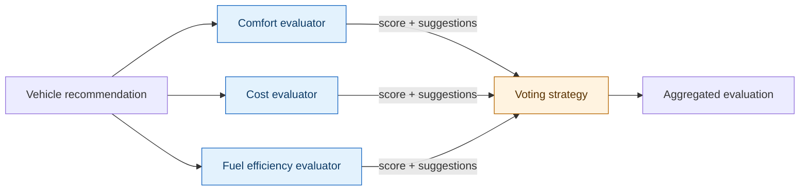
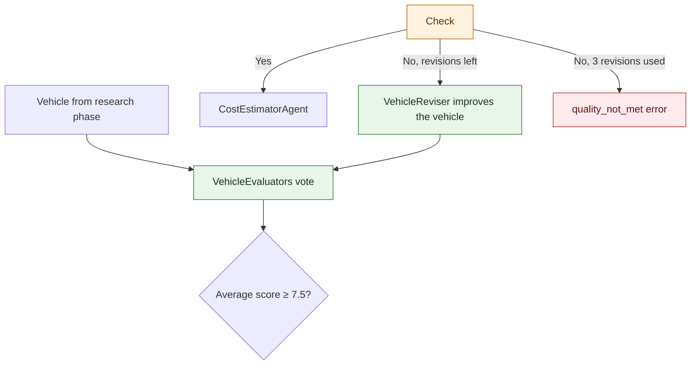

# Step 03 - Voting, Loops, and Adaptive Model Selection

In Step 2, we added guardrails to add some hard rules around agent outputs and tool inputs, so that a traveler on a tight budget cannot create a trip with a fancy Lamborghini, or a group of 10 gets stuck in a small Fiat 500. Those are pretty clear cut rules, but what if a family of four books five days on the Italian Riviera with a moderate budget, and the vehicle agent recommends a compact hatchback. The guardrails from Step 02 let it through, because it seats four, and it isn't a Ferrari. 

While technically possible, it's questionable whether four people and their luggage will be comfortable in it for five days, or it's good value for their budget, or efficient it is on the coast roads. A recommendation that passes the rules isn't necessarily the *best* one, and the Miles of Smiles customer reviews are starting to say so.

In this step we'll give the planner a small review panel. Three evaluator agents each score the vehicle recommendation, a voting pattern combines their scores, and a refinement loop lets a reviser agent improve the recommendation until the panel is satisfied. We'll also add adaptive model selection, so the reviser switches to a more capable model for the final polish once the recommendation is nearly there.

## Parallel assessment with the voting pattern

The **voting pattern** sends the same question to several agents in parallel and collects their answers. The difference from a plain parallel workflow is the last step, where a voting strategy combines the answers into **one decision**. It could average the scores, take a majority, or apply whatever logic you like.

Voting spreads the judgement across agents that each have **one narrow job**. An agent that only thinks about cost will catch cost problems that a general-purpose evaluator might ignore. Each agent's score is also visible on its own, so you can see exactly who voted for or against a decision. 

For the family planning the Italian Riviera trip, a comfort evaluator could look at space for four people and their bags, a cost evaluator at the moderate budget, and a fuel efficiency evaluator at consumption and range over five days of driving.



We'll implement this new feature with the **`VotingPlanner`** provided by the LangChain4j agentic patterns module. This planner pattern starts all evaluator subagents in parallel and records each result as a vote when the evaluator completes. Once every evaluator has reported, it passes the votes to a `VotingStrategy` for aggregation.

## Iterative refinement with @LoopAgent

A single round of voting tells us how good the recommendation is, but it doesn't make it any better. For that we need a **loop**. After the  evaluators vote and the score is too low, a reviser agent will improve the recommendation and then the evaluators vote again. As you can imagine, it's important to make sure the vote is a numeric value, and to include an exit condition to close the loop.



The `@LoopAgent` annotation turns this cycle into an agent with a maximum number of iterations, and an `@ExitCondition` method decides when to stop. 

For our family, the reviser might swap the compact hatchback for an estate with room for the luggage, and the panel votes again. If the reviser has had three attempts and the evaluators still aren't convinced, the loop gives up and the planner returns a `quality_not_met` error. Miles of Smiles would rather tell the family it couldn't find a car it's proud of than hand them the keys to a cramped one.

## Adaptive model selection with @ChatModelSupplier

When building agentic applications, it's important to choose the right model for the job. Some models are really good at certain tasks, while others are better at other tasks. We also have to consider the cost of models. The latest frontier models might be generally more capable, but they're typically also quite a bit more expensive. If you've gone through [Section 2 Step 07](../section-2/step-07.md), you have already seen how different agents can use different models to optimize capability and cost usage.

In this case, Miles of Smiles wants the final reviser that reviews the votes and the specific suggestions from the evaluators to use a more capable model when the combined score is close to the theshold so that it can make the best decision possible: 

| Evaluation score | Model selected | Rationale |
|---|---|---|
| ≤ 6.0 | base model | Broad changes still needed, such as a bigger car or a different category |
| > 6.0 | enhanced model | Detailed polishing against several evaluators' suggestions at once |


## Preparing the working copy

As always, you can keep building on the previous step or read along with the finished solution.

#### Option 1: Continue from Step 02


<mark>Keep working in your Step 02 working copy and apply the changes below.</mark> If you get stuck, compare your code with `section-3/step-03`.

#### Option 2: Follow the completed Step 03 project


<mark>Copy `section-3/step-03` to a working directory and open that copy.</mark> It already contains the changes below, so you can follow along through the implementation, then join the exercise at [Testing the voting loop](#testing-the-voting-loop).

## Add the vehicle evaluation model

The evaluator agents need a shared return type to represent their assessment.

<mark>Create `src/main/java/com/tripplanner/model/VehicleEvaluation.java`:</mark>

**VehicleEvaluation.java**
```java
{snippet:insert("section-3/step-03/src/main/java/com/tripplanner/model/VehicleEvaluation.java")}
```

Each evaluator will return a score between 1 and 10, along with textual suggestions for improvement. The voting strategy will average the scores and concatenate the suggestions.

## Create the evaluator agents

Each evaluator is a simple agent that cares about exactly one thing: comfort, cost, or fuel efficiency.

<mark>Create `src/main/java/com/tripplanner/agentic/agents/ComfortEvaluator.java`:</mark>

**ComfortEvaluator.java**
```java
{snippet:insert("section-3/step-03/src/main/java/com/tripplanner/agentic/agents/ComfortEvaluator.java")}
```

<mark>Create `src/main/java/com/tripplanner/agentic/agents/CostEvaluator.java`:</mark>

**CostEvaluator.java**
```java
{snippet:insert("section-3/step-03/src/main/java/com/tripplanner/agentic/agents/CostEvaluator.java")}
```

<mark>Create `src/main/java/com/tripplanner/agentic/agents/FuelEfficiencyEvaluator.java`:</mark>

**FuelEfficiencyEvaluator.java**
```java
{snippet:insert("section-3/step-03/src/main/java/com/tripplanner/agentic/agents/FuelEfficiencyEvaluator.java")}
```

- Each evaluator uses `@Agent` with a unique `outputKey`, so its individual score remains in the workflow scope next to the aggregated result.
- The evaluators take the current `vehicle` recommendation from the scope, plus trip context parameters for their specific assessment dimension.
- All three return `VehicleEvaluation`, the same record type, so the aggregation strategy can process them uniformly.

## Add the voting planner

LangChain4j provides ready-made planners for common orchestration patterns in its `langchain4j-agentic-patterns` module, and its `VotingPlanner` does exactly what the evaluators need. The Quarkus LangChain4j BOM already manages the module's version, so the dependency does not need a `<version>` element.

<mark>Add the agentic patterns dependency to `pom.xml`:</mark>

**pom.xml (agentic patterns dependency)**
```xml
<dependency>
    <groupId>dev.langchain4j</groupId>
    <artifactId>langchain4j-agentic-patterns</artifactId>
</dependency>
```

The planner only coordinates the evaluators, while the decision about how to combine their votes comes from a `VotingStrategy`. This is a functional interface that receives the collected votes and returns the aggregate, so any lambda or method reference can act as a strategy.

The library includes `majority()`, `average()`, and `highest()` strategies for votes that are plain values such as labels or numbers. Our evaluators return a `VehicleEvaluation` that combines a score with suggestions, so we'll write our own strategy that averages the scores and keeps every evaluator's suggestions for the reviser.

## Wire evaluators with @PlannerAgent

The `@PlannerAgent` annotation connects the evaluator subagents to the voting planner through a `@PlannerSupplier` method.

<mark>Create `src/main/java/com/tripplanner/agentic/workflow/VehicleEvaluators.java`:</mark>

**VehicleEvaluators.java**
```java
{snippet:insert("section-3/step-03/src/main/java/com/tripplanner/agentic/workflow/VehicleEvaluators.java")}
```

The class has three parts:

- `@PlannerAgent` lists the three evaluators as `subAgents` and stores the aggregated score under `outputKey = "evaluation"`, where the exit condition and the reviser can find it. Its method signature lists the trip details the evaluators need, and the framework passes them along through the workflow scope.
- `@PlannerSupplier` returns a new `VotingPlanner` that uses `aggregateVotes` as its voting strategy.
- `aggregateVotes` averages the scores and collects the suggestions. It expects exactly three `VehicleEvaluation` results with scores between 1 and 10, and throws `IllegalStateException` if one is missing or malformed.

<details>
<summary>How does the `VotingPlanner` drive the evaluators?</summary>

A planner decides which subagents run next each time the framework asks it for an action. The `VotingPlanner` answers the first request with `call(subagents)`, which starts all evaluators in parallel. The framework then asks for the next action once for every evaluator that completes. The planner adds that evaluator's output to its votes and returns `noOp()` while others are still running. After the last one reports, it returns `done(...)` with the strategy's result, which becomes the output of `VehicleEvaluators`. Its `topology()` method returns `PARALLEL`, so the Dev UI renders the evaluators as parallel branches.

The framework calls the `@PlannerSupplier` method on every invocation, so each loop iteration collects its votes in a new planner. The [`VotingPlanner` source](https://github.com/langchain4j/langchain4j/blob/main/langchain4j-agentic-patterns/src/main/java/dev/langchain4j/agentic/patterns/voting/VotingPlanner.java) is a compact example of the `Planner` interface if you want to write a planner of your own.

</details>


## Add the vehicle reviser with @ChatModelSupplier

The reviser agent takes the current recommendation and evaluation feedback and produces an improved recommendation. It uses adaptive model selection to pick the right model for the current quality level.

<mark>Create `src/main/java/com/tripplanner/agentic/agents/DynamicModelSelector.java`:</mark>

**DynamicModelSelector.java**
```java
{snippet:insert("section-3/step-03/src/main/java/com/tripplanner/agentic/agents/DynamicModelSelector.java")}
```

<mark>Create `src/main/java/com/tripplanner/agentic/agents/VehicleReviser.java`:</mark>

**VehicleReviser.java**
```java
{snippet:insert("section-3/step-03/src/main/java/com/tripplanner/agentic/agents/VehicleReviser.java")}
```

`DynamicModelSelector` is a `@Singleton` bean that injects both the default `ChatModel` and the `@ModelName("enhancedModel")` model, and picks one based on the current evaluation score.

In the reviser, two annotations are worth a closer look:

- `@OutputGuardrails(TripAppropriatenessGuardrail.class, maxRetries = 3)` keeps the Step 02 content guardrail, so a revision that breaks the rules gets up to three more tries.
- `outputKey = "vehicle"` overwrites the vehicle in the scope, so the cost estimator and everything after it receive the refined version without extra wiring.

## Wrap the review cycle with @LoopAgent

The loop wraps the evaluators and reviser into an iterative cycle with an exit condition.

<mark>Create `src/main/java/com/tripplanner/agentic/workflow/VehicleReviewLoop.java`:</mark>

**VehicleReviewLoop.java**
```java
{snippet:insert("section-3/step-03/src/main/java/com/tripplanner/agentic/workflow/VehicleReviewLoop.java")}
```

`@LoopAgent` runs `VehicleEvaluators` and then `VehicleReviser` on each iteration. With `maxIterations = MAX_REVISIONS + 1` that makes four iterations: the first evaluation, plus one more after each of the three allowed revisions. The loop's own `outputKey = "vehicle"` writes the final vehicle back to the scope, replacing the one from the research phase.

`@ExitCondition(testExitAtLoopEnd = false)` checks the condition right after each evaluation, before the reviser gets its turn. `shouldExit` receives the latest `VehicleEvaluation` and the `AgenticScope`, and ends up in one of three places:

- A score of 7.5 or more returns `true` and ends the loop.
- A lower score with revisions left returns `false`, and the reviser runs.
- A lower score after `MAX_REVISIONS` revisions throws `TripQualityException`, which reaches the browser as a 422 with error code `quality_not_met`.

Before the loop can throw `TripQualityException`, you need the exception class itself.

<mark>Create `src/main/java/com/tripplanner/model/TripQualityException.java`:</mark>

**TripQualityException.java**
```java
{snippet:insert("section-3/step-03/src/main/java/com/tripplanner/model/TripQualityException.java")}
```

The `CODE` and `MESSAGE` constants are used by the exception mapper and the frontend to display a consistent error when the loop exhausts its revision budget.

## Update the main workflow

<mark>Open `src/main/java/com/tripplanner/agentic/workflow/TripPlannerSystem.java` and add `VehicleReviewLoop.class` to the `subAgents` array, between `ResearchPhase` and `CostEstimatorAgent`:</mark>

**TripPlannerSystem.java**
```java
{snippet:insert("section-3/step-03/src/main/java/com/tripplanner/agentic/workflow/TripPlannerSystem.java")}
```

The sequence now runs: parallel research → voting evaluation loop → cost estimation. The `@Output` method is unchanged because it still assembles the final `TripPlan` from `vehicle`, `itineraryResult`, and `costs`. The loop simply refines which vehicle reaches the cost estimator.

## Configure adaptive model selection

<mark>Update `src/main/resources/application.properties` to add the enhanced model configuration:</mark>

**application.properties**
```properties
{snippet:insert("section-3/step-03/src/main/resources/application.properties")}
```

- The base model stays `gpt-4o`, which every other agent keeps using.
- The `enhancedModel` is configured as a separate named model using `gpt-4.1`. The `@ModelName("enhancedModel")` qualifier in `DynamicModelSelector` resolves to this configuration.
- Both models share the same `OPENAI_API_KEY`. The enhanced model has its own temperature and timeout settings.

## Testing the voting loop

Time to put the Riviera family's trip in front of the review panel! If the application is not already running, start it from the project directory you chose above:

#### Linux / macOS

```bash
./mvnw quarkus:dev
```

#### Windows

```cmd
.\mvnw.cmd quarkus:dev
```

==Open [http://localhost:8080](http://localhost:8080) and fill in the form:==

- Destination: `Italian Riviera`
- Start date: a future date
- Duration: `5` days
- Travelers: `4`
- Trip Type: `Family Vacation`
- Budget: `Moderate (€1,000–€2,500)`

<mark>Click **Generate Trip Plan**, wait for it to finish, and look for the evaluation and model selection messages in the terminal.</mark> You should see lines like:

```text
Score 6.3 > 6.0 — switching to enhanced model for final refinement
```

This line means the `DynamicModelSelector` handed the revision to the enhanced model. It only appears when the reviser actually runs with a score above 6.0. If the evaluators liked the first vehicle enough to pass it outright, there's nothing to revise and nothing to log, so try another run or two.

==Open the [Quarkus Dev UI](http://localhost:8080/q/dev-ui) and select **Topology** on the LangChain4j Agentic card.== The graph shows the full agent structure: the `planTrip` sequence contains the parallel research phase, the `vehicleReviewLoop`, and `estimateCosts`. Inside the loop you can see the `vehicleEvaluators` node, rendered as a parallel fan-out with the three evaluators, and the `vehicleReviser`.


<mark>Switch to **Executions** on the same card and expand the latest run.</mark> Each agent has its own row with its duration, inputs, and outputs. Under `vehicleReviewLoop`, the `vehicleEvaluators` rows show the three individual scores and the average they produced. If the average reached 7.5 on the first vote, the loop ends right there and `revise` never runs. If it fell short, you'll see a `revise` row followed by another round of evaluations, each tagged with its iteration number. Run the same request a few times and the number of rounds will probably change, because the evaluators are language models and have their moods like the rest of us.


Now and then `planItinerary` also tries to activate a skill that doesn't exist, such as `route-overview`. Those calls show up marked failed, the tool replies with the list of available skills, and the agent carries on with the one it did load.

<mark>Compare the output of `recommendVehicle` in the research phase with the output of `vehicleReviewLoop`.</mark> If the reviser ran, the two recommendations differ. If the first candidate passed, they're the same vehicle.

<details>
<summary>Verifying with tests</summary>

The supplied tests verify the voting aggregation, pipeline assembly, and end-to-end HTTP contract without calling a live model.

<mark>Run the Step 03 test suite:</mark>

#### Linux / macOS

```bash
./mvnw test
```

#### Windows

```cmd
.\mvnw.cmd test
```

- `VehicleEvaluationAggregatorTest` checks the averaging strategy. Three scores produce the right average, blank suggestions are skipped, and a missing, incomplete, or out-of-range set of votes throws `IllegalStateException`.

- `TripPlanContractTest` checks that `VehicleReviewLoop` sits between `ResearchPhase` and `CostEstimatorAgent` in the workflow, and that the trip plan JSON still has no `tips` field.

- `VehicleReviewWorkflowTest` calls the `/trip/plan` endpoint with a scripted model. It covers a first candidate that passes outright, a low-scoring candidate that gets revised and re-evaluated, three failed revisions ending in `quality_not_met`, and the guardrail rejecting a revised recommendation, including the case where the guardrail runs out of retries. Each scripted profile also replaces the `@ModelName("enhancedModel")` model with an `@Alternative`, so the `DynamicModelSelector` works without a live API key.

</details>


## Taking it further

- As an optional exercise, try adding a fourth evaluator that assesses the vehicle's suitability for the planned route terrain (mountain roads, coastal highways, city driving). Use a different `outputKey` and update the `aggregateVotes` method to handle four votes.

- You can also play with the exit threshold. Lowering it to 6.0 makes the loop exit sooner. Raising it to 9.5 will probably use up all three revisions, even though the scores tend to creep up with each one, and the browser then shows the `quality_not_met` message. Add a log line inside `shouldExit` to watch the score change from one round to the next.

    

- For a more advanced experiment, try a weighted voting strategy where the comfort evaluator counts double for family trips and the cost evaluator counts double for economy budgets. Pass the trip type into the aggregation to select the weights.

## What's next?

The planner now has a panel of evaluators that vote on every vehicle and a reviser that keeps trying until they're happy. In Step 04, we'll wrap the planning pipeline in an event-driven Quarkus Flow workflow, so the customer can take their time before approving or rejecting a trip.

[Continue to Step 04 - Event-Driven Agentic Workflows with Quarkus Flow](step-04.md)

## Troubleshooting

<details>
<summary>The enhanced model is not configured</summary>

<mark>Check that `application.properties` has the `quarkus.langchain4j.enhancedModel.*` properties and that `OPENAI_API_KEY` is set.</mark> Both the base and enhanced models use the same API key. If the enhanced model configuration is missing, the `@ModelName("enhancedModel")` injection will fail at startup.

</details>


<details>
<summary>Every request ends with quality_not_met</summary>

<mark>Check the evaluator prompts and the exit condition threshold.</mark> If the evaluators consistently return low scores, three revisions may not be enough to get the recommendation over the line. Try lowering the threshold in `VehicleReviewLoop.shouldExit()` or adjusting the evaluator prompts to be more generous. Inspect the evaluation scores in the Dev UI execution view.

</details>


<details>
<summary>Tests fail with missing enhancedModel bean</summary>

<mark>Check that each test profile's `getEnabledAlternatives()` includes both `ScriptedModel.class` and `ScriptedEnhancedModel.class`.</mark> The `ScriptedEnhancedModel` is an `@Alternative @ModelName("enhancedModel")` bean that delegates to the default scripted model.

</details>


<details>
<summary>OPENAI_API_KEY is not set</summary>

<mark>Set `OPENAI_API_KEY` in the shell used to start the application, then restart it.</mark> Both models require the same key.

</details>
