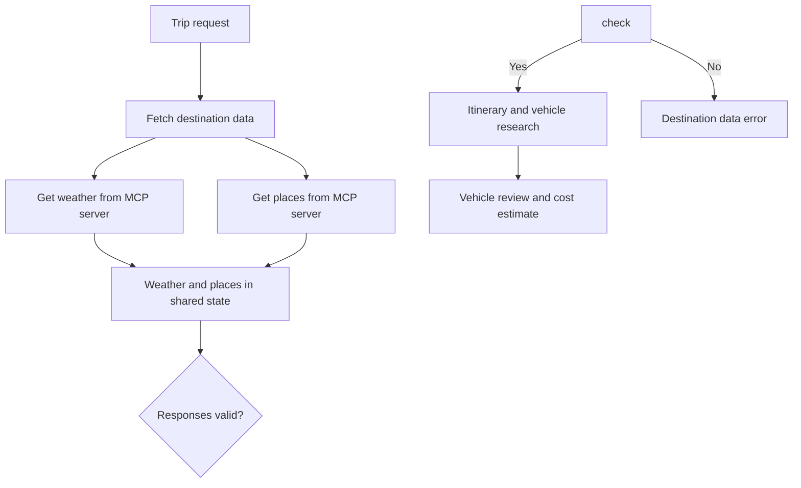

# Step 06 - MCP Integration with Non-AI Agents

The Miles of Smiles trip planner generates solid itineraries, but every recommendation is based entirely on what the language model already knows. It has no way to check whether the destination will be rainy next week or which attractions are actually worth visiting. Customers are starting to notice that a "sunny outdoor itinerary" sometimes ends up being stuck indoors during a week of thunderstorms. (Management's suggestion to rename these "immersive weather experiences" was not well received.)

We'll fix this with a Trip Intelligence MCP server, a small Quarkus service that exposes weather forecasts and points of interest as MCP tools. On the trip planner side, two new `@McpClientAgent` interfaces call these tools **before any language model runs** and write the results into the workflow's shared state. The itinerary planner and vehicle advisor then work from real data.

## Fetching destination data before planning

Each trip starts by fetching weather and points of interest from the Trip Intelligence MCP server. The workflow makes both calls in parallel, checks the returned data, and then passes it to the itinerary and vehicle agents.



## MCP tools as workflow agents

An MCP client is the connection to an MCP server. With [`@McpToolBox`](https://docs.quarkiverse.io/quarkus-langchain4j/dev/mcp.html#_using_mcp_tools_in_ai_services), that client makes the server's tools available to an AI service, and the model decides whether to call one while generating a response.

`@McpClientAgent` lets a workflow treat a **remote MCP tool as one of its agents**. The workflow supplies the arguments, calls the tool at a defined point, and saves the result for later steps. For required lookups, this ensures the tool runs before later steps without an extra model call to fetch the data.

## Preparing the working copy

#### Option 1: Continue from Step 05


<mark>Apply the changes below to your Step 05 working project.</mark> Keep your existing model-provider settings and dependencies. Dev mode restarts automatically when it detects `pom.xml` changes.

#### Option 2: Follow the completed Step 06 project


<mark>Copy `section-3/step-06` to a working directory and open that copy. Apply your model-provider settings.</mark> The code changes below are already included, so you can follow along and join the hands-on route at [Running the demo](#running-the-demo).

A container runtime (Docker or Podman) is needed for PostgreSQL and Kafka Dev Services.

## Project structure

The trip planner and the Trip Intelligence server run as separate Quarkus applications. The server exposes the weather and points-of-interest tools on port 8085, and the planner calls them over HTTP from port 8080. The project has one Maven module for each application:

```
step-06/
├── pom.xml              ← parent POM
├── mcp-server/          ← Trip Intelligence MCP server
│   ├── pom.xml
│   └── src/
└── trip-planner/        ← Main trip planner app (MCP client)
    ├── pom.xml
    └── src/
```

## Building the MCP server

The MCP server exposes two tools: `getWeatherForecast` and `getPointsOfInterest`. Points of interest are stored in a PostgreSQL database provided automatically by Dev Services and loaded from `import.sql` at startup. The weather tool returns fixed scenario data, so the workshop behaves the same for everyone.

### The PointOfInterest entity

Points of interest are modeled as a JPA entity using Panache:

**PointOfInterest.java**
```java
{snippet:insert("section-3/step-06/mcp-server/src/main/java/com/tripplanner/mcp/model/PointOfInterest.java")}
```

The `import.sql` file seeds the database with POI data for several cities (Rome, Barcelona, Florence, Madrid, Paris, Antwerp), each with entries for family, adventure, and business trip types.

### The tool class

<mark>Create the tool class at `mcp-server/src/main/java/com/tripplanner/mcp/TripIntelligenceTools.java`:</mark>

**TripIntelligenceTools.java**
```java
{snippet:insert("section-3/step-06/mcp-server/src/main/java/com/tripplanner/mcp/TripIntelligenceTools.java")}
```

`@Tool` and `@ToolArg` come from `quarkus-mcp-server-http` and describe each tool to any MCP client that connects:

- `getWeatherForecast` picks its response from a configurable scenario, `sunny` by default. The other scenarios are `severe-weather`, `empty-poi`, `malformed-response`, and `timeout`. Start the server with `-Dquarkus.profile=<name>` to switch to one and see how the trip planner copes.
- `getPointsOfInterest` uses Panache's `list()` to filter by destination and trip type, and wraps the result in a `PoiCatalog` record. The MCP server serializes that record to JSON on its own.

Both tools throw `IllegalArgumentException` for blank or out-of-range input, which reaches the MCP client as a proper error.

<mark>Configure the server at `mcp-server/src/main/resources/application.properties`:</mark>

**application.properties**
```properties
{snippet:insert("section-3/step-06/mcp-server/src/main/resources/application.properties")}
```

Port 8085 avoids conflicts with the trip planner (8080). Dev Services automatically provisions a PostgreSQL container for the MCP server, separate from the trip planner's database.

## Connecting the trip planner to the MCP server

The trip planner needs a named MCP client so its new agents know which server to call. The `tripIntelligence` client uses Streamable HTTP to reach the server on port 8085.

<mark>Run the following command from the `trip-planner/` directory to add the MCP client extension:</mark>

```shell
./mvnw quarkus:add-extension -Dextensions="quarkus-langchain4j-mcp"
```

<mark>Add the MCP client configuration to `trip-planner/src/main/resources/application.properties`:</mark>

**trip-planner/src/main/resources/application.properties (MCP client)**
```properties
{snippet:insert("section-3/step-06/trip-planner/src/main/resources/application.properties:14", "17")}
```

The client name `tripIntelligence` will select this connection in both MCP agent interfaces.

## Creating the weather and points-of-interest agents

`WeatherAgent` calls `getWeatherForecast` with the destination and trip dates, while `PointsOfInterestAgent` calls `getPointsOfInterest` with the destination and trip type.

<mark>Create `trip-planner/src/main/java/com/tripplanner/agentic/agents/WeatherAgent.java`:</mark>

**WeatherAgent.java**
```java
{snippet:insert("section-3/step-06/trip-planner/src/main/java/com/tripplanner/agentic/agents/WeatherAgent.java")}
```

<mark>Create `trip-planner/src/main/java/com/tripplanner/agentic/agents/PointsOfInterestAgent.java`:</mark>

**PointsOfInterestAgent.java**
```java
{snippet:insert("section-3/step-06/trip-planner/src/main/java/com/tripplanner/agentic/agents/PointsOfInterestAgent.java")}
```

Both interfaces use `@McpClientName("tripIntelligence")` to reach the server. Their JSON responses are saved under `weather` and `pointsOfInterest`, ready for the next workflow phase.

## Wiring the DestinationIntelligence phase

`DestinationIntelligence` runs the two MCP agents in parallel at the start of each trip. Their JSON results enter the shared scope, where `DestinationEvidence` checks them before the research agents use them. An invalid response stops planning with `intelligence_unavailable` instead of passing bad destination data to the model.

<mark>Create `trip-planner/src/main/java/com/tripplanner/agentic/workflow/DestinationIntelligence.java`:</mark>

**DestinationIntelligence.java**
```java
{snippet:insert("section-3/step-06/trip-planner/src/main/java/com/tripplanner/agentic/workflow/DestinationIntelligence.java")}
```

The `@Output` method validates the two results and combines them after both calls finish. Its `intelligenceComplete` output lets `TripPlannerSystem` continue to research; the weather and places remain available under their own scope keys.

`DestinationEvidence.validate()` parses the JSON into records that mirror the server's weather and points-of-interest types, then checks that:

- every required field is present
- the numbers are sensible
- the response is about the destination we asked for

Anything malformed throws `TripIntelligenceException`, which maps to a 502 with error code `intelligence_unavailable`, so the frontend can tell the customer that the destination data was the problem.

<mark>Create `trip-planner/src/main/java/com/tripplanner/agentic/workflow/DestinationEvidence.java`:</mark>

**DestinationEvidence.java**
```java
{snippet:insert("section-3/step-06/trip-planner/src/main/java/com/tripplanner/agentic/workflow/DestinationEvidence.java")}
```

<mark>Update `TripPlannerSystem.java` to insert `DestinationIntelligence` as the first step:</mark>

**TripPlannerSystem.java (updated subAgents)**
```java
{snippet:insert("section-3/step-06/trip-planner/src/main/java/com/tripplanner/agentic/workflow/TripPlannerSystem.java:12", "18")}
```

## Enriching AI agent prompts

With weather and POI data now in the scope, the AI agents can reference it.

<mark>Update `ItineraryPlannerAgent` to accept `weather` and `pointsOfInterest` parameters and use them in the prompt:</mark>

**ItineraryPlannerAgent.java**
```java
{snippet:insert("section-3/step-06/trip-planner/src/main/java/com/tripplanner/agentic/agents/ItineraryPlannerAgent.java")}
```

<mark>Update `VehicleAdvisorAgent` to accept a `weather` parameter:</mark>

**VehicleAdvisorAgent.java**
```java
{snippet:insert("section-3/step-06/trip-planner/src/main/java/com/tripplanner/agentic/agents/VehicleAdvisorAgent.java")}
```

<mark>Update `ResearchPhase` to pass the new parameters through:</mark>

**ResearchPhase.java**
```java
{snippet:insert("section-3/step-06/trip-planner/src/main/java/com/tripplanner/agentic/workflow/ResearchPhase.java")}
```

## Tightening the request validation

In Step 02, the Duration field accepted any number so you could trip the rental tool's input guardrail with something outside 1 to 30 days. Now the MCP server has its own limit: `getWeatherForecast` only accepts trips of up to 30 days. A longer trip would reach the tool, throw an `IllegalArgumentException`, and show up as a generic planning failure.

<mark>Open `trip-planner/src/main/java/com/tripplanner/resource/TripPlannerResource.java` and add the duration check to `validatePlanRequest()`:</mark>

**TripPlannerResource.java (request validation)**
```java
{snippet:insert("section-3/step-06/trip-planner/src/main/java/com/tripplanner/resource/TripPlannerResource.java:96", "104")}
```

Anything outside 1 to 30 days now gets a 400 with a clear message before the workflow starts. The Step 02 guardrail still protects the rental tool's arguments. This check protects the MCP call further upstream.

## Running the demo

The two applications run side by side. <mark>Start the MCP server first, in its own terminal:</mark>

#### Linux / macOS

```bash
cd section-3/step-06/mcp-server
./mvnw quarkus:dev
```

#### Windows

```cmd
cd section-3\step-06\mcp-server
.\mvnw.cmd quarkus:dev
```

<mark>Then start the trip planner in a second terminal:</mark>

#### Linux / macOS

```bash
cd section-3/step-06/trip-planner
./mvnw quarkus:dev
```

#### Windows

```cmd
cd section-3\step-06\trip-planner
.\mvnw.cmd quarkus:dev
```

==Open [http://localhost:8080](http://localhost:8080) and generate a family trip to `Barcelona`.== Look for the weather in the vehicle recommendation and for places from `import.sql`, such as Barcelona Science Museum or Barcelona Central Park, in the itinerary. The model may choose which places to include, so a particular name is not guaranteed. The database lookup matches the city name exactly; `barcelona` or an unseeded city returns an empty list.

<figure markdown="span">
  \{ width="600" }
</figure>

After viewing the plan, <mark>open the Dev UI, click **Executions** on the LangChain4j Agentic card, and expand the latest run.</mark> The `DestinationIntelligence` phase appears as `fetchIntelligence` before the research agents. Its `getWeatherForecast` and `getPointsOfInterest` children are ACTION rows for direct MCP calls. Inspect their results to see which weather and places were supplied before the AI agents wrote the plan.


## What's next?

The trip planner now checks the weather and local attractions before any model starts dreaming up an itinerary, and the workflow itself decides when those MCP tools are called. In Step 07, we'll find out whether all this effort actually produces good plans, using an evaluation harness and traces in Langfuse.

[Continue to Step 07 - Testing, Evaluation, and Observability](step-07.md)

## Troubleshooting

<details>
<summary>Connection refused when starting the trip planner</summary>

Make sure the MCP server is running on port 8085 before starting the trip planner. The MCP client connects lazily (on first tool call), so the trip planner starts even without the MCP server, but the first trip plan request will fail.

</details>


<details>
<summary>Unsatisfied dependency for McpClient</summary>

Verify that `quarkus-langchain4j-mcp` is in the trip planner's `pom.xml` dependencies and that the `tripIntelligence` name in `application.properties` matches the `@McpClientName` qualifier.

</details>


<details>
<summary>Trip plan fails with intelligence_unavailable</summary>

The MCP server returned data the trip planner could not validate. Check that the MCP server is running the default `sunny` scenario and that its database was seeded correctly. If you started the server with a test profile such as `malformed-response` or `timeout`, restart it without that profile.

</details>
