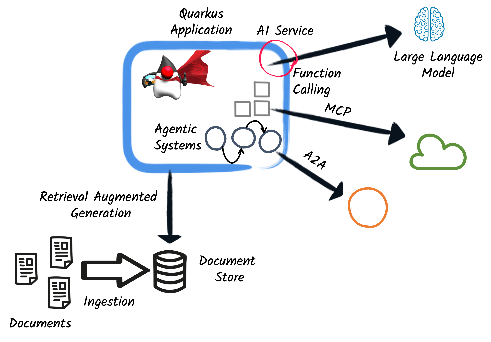

# Quarkus LangChain4j Workshop

Welcome to the Quarkus LangChain4j Workshop!  
This workshop will guide you through building **AI-infused applications** and **agentic systems** using Quarkus and LangChain4j.

You will learn how to:

- Integrate LLMs (Language Models) into your Quarkus application
- Build a chatbot using Quarkus
- Configure and send prompts to the LLM
- Implement guardrails for safe interactions
- Build simple and advanced RAG (Retrieval-Augmented Generation) patterns
- Use remote tools via the Model Context Protocol (MCP)
- Connect with remote agents using Agent-to-Agent (A2A) communication
- Design agentic systems using workflow and supervisor patterns

---

## Workshop Scenario

Throughout the workshop, you will create an LLM-powered customer support chatbot for a car rental company.

The workshop is divided into two sections:

- **Section 1 – AI-infused application (11 steps):**  
  You’ll progressively build a chatbot, starting with basic LLM integration and adding features such as structured outputs, guardrails, and RAG.

- **Section 2 – Agentic systems (4 steps):**  
  You’ll extend the chatbot into an agentic workflow, introducing planning, supervision, and collaboration patterns.

Each step builds on the previous one, with the results stored in separate directories (`step-XX`):

- Final solution for Section 1: `section-1/step-10`
- Final solution for Section 2: `section-2/step-04`

---

## How to Work with Steps

!!! tip
    We recommend starting with the `main` branch, then opening the project from `step-01` in your IDE.  
    If you prefer, you can make a copy of the directory instead.

!!! note
    To reset to a particular step, either overwrite your working directory with the content of that step,  
    or open the project directly from the desired step directory.

---

---

## Let's Get Started

First, check the [requirements](./requirements.md) page to prepare your environment.

Once ready, you can pick one of these entries points to start the workshop:

- If you discover Quarkus and Quarkus LangChain4j, start with [Section 1 - AI Apps](./section-1/step-01.md).
- If you want to learn more advanced AI-Infused features, such as MCP, Guardrails, Observability, and Fault Tolerance, start with [Section 1 - Step 08](./section-1/step-08.md).
- If you want to jump directly into agentic systems, start with [Section 2 - Agentic Workflows](./section-2/step-01.md).
