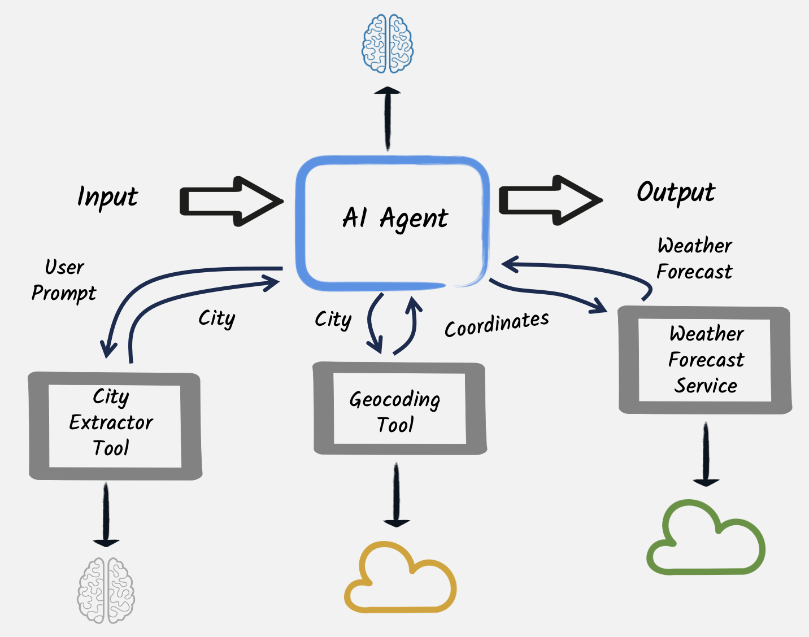

# Step 08 - Agentic AI - Model Context Protocol

Building on top of the Function Calling concept of the previous step, let's explore how we can make this idea more distributed with the [Model Context Protocol](https://docs.quarkiverse.io/quarkus-mcp-server/dev/index.html) pattern.

Basically, we will allow the LLM to act as a true agent, calling a predefined set of tools using the Model Context Protocol to further enhance its knowledge and/or functionality. 

## Model Context Protocol

The [Model Context Protocol](https://modelcontextprotocol.io/introduction) serves as an open standard, facilitating the creation of secure,
bidirectional links between data repositories and AI-driven tools. The design is uncomplicated;
developers can either make their data accessible via MCP servers or construct AI applications
(MCP clients) that interface with these servers.



In this step, we are going to see how to implement both MCP servers and clients in our application. The MCP client will be integrated with our existing code, while the MCP server will be a standalone application that the MCP client's agent will call to retrieve additional context.

The final code is available in the `step-08` folder for the client application (the one we've been working on). You will find the MCP server application in the `step-08-mcp-server` folder.
As before, we recommend you follow the step-by-step guide to understand how it works, and the different steps to implement this pattern.

## Create a new MCP Weather Server project

Let's create a Quarkus MCP server from scratch (or, you can use the step-08-mcp-server project directly). We're going to add the Quarkus MCP server dependency, and the REST Client dependency so we can call a remote weather service to retrieve current weather conditions for a given location.

In your terminal, make sure you're in the main directory of the workshop, and then execute the following command:

```shell
 quarkus create app dev.langchain4j.quarkus.workshop:quarkus-langchain4j-workshop-08-mcp-server:1.0-SNAPSHOT -x quarkus-mcp-server-sse -x quarkus-rest-client-jackson
```

You should now see a new `quarkus-langchain4j-workshop-08-mcp-server` folder. In it, create a new `src/main/java/dev/langchain4j/quarkus/workshop/WeatherClient.java` file. This will be our REST client to call the remote weather API. ==Populate it with the below code:==

```java title="WeatherClient.java"
--8<-- "../../section-1/step-08-mcp-server/src/main/java/dev/langchain4j/quarkus/workshop/WeatherClient.java"
```
Now create an MCP server class that will contain methods annotated with @Tool, just like we did in the previous step for our local function calling. The only difference is that in this case, the MCP Tools we define will be available over the wire using the MCP protocol and a given transport type.

```java title="Weather.java"
--8<-- "../../section-1/step-08-mcp-server/src/main/java/dev/langchain4j/quarkus/workshop/Weather.java"
```

Great! All that's left is to add some configurations to our project. ==To the application.properties, add the following:==

```properties title="application.properties"
# run the MCP server on a different port than the client
quarkus.http.port=8081

# Configure MCP server
quarkus.mcp.server.server-info.name=Weather Service
quarkus.mcp.server.traffic-logging.enabled=true
quarkus.mcp.server.traffic-logging.text-limit=100

# Configure the Rest Client
quarkus.rest-client.logging.scope=request-response
quarkus.rest-client.follow-redirects=true
quarkus.rest-client.logging.body-limit=50
quarkus.rest-client."weatherclient".uri=https://api.open-meteo.com/
```

Easy right? With just a few lines of code, we were able to build a full-blown MCP server that would require much more work with any other stack or language out there! Quarkus FTW!

==Go ahead and start the server from the `quarkus-langchain4j-workshop-08-mcp-server` folder in a separate terminal window/tab:==

```shell
 ./mvnw quarkus:dev"
```

Now, let's configure our client app to use the newly built MCP server.

## A new MCP client dependency

Quarkus LangChain4j supports MCP with equally minimal work. To use it, we need to install a new MCP client dependency.
==Open the `pom.xml` file in your **main project** (ie. NOT the one containing the MCP Server) and add the following dependency:==

```xml title="pom.xml"
--8<-- "../../section-1/step-08/pom.xml:step-8"
```

!!! tip
    You could also open another terminal and run

    ```shell
    ./mvnw quarkus:add-extension -Dextensions="quarkus-langchain4j-mcp"
    ```

The LangChain4j MCP dependency will allow us to call remote MCP servers. Remember, MCP servers can be written in Java, like the one we created above, but in fact they can be any kind of technology that exposes the MCP protocol.

## Configuring the MCP client

Now that we have the dependency, we just need to configure it to call our MCP server using the http transport-type. You can do that in the application.properties file:

```properties title="application.properties"
quarkus.langchain4j.mcp.weather.transport-type=http
quarkus.langchain4j.mcp.weather.url=http://localhost:8081/mcp/sse/
```

Notice that we have used the "weather" name. We will reference this in the AI service to use this particular MCP server. 

We'll add a @McpToolBox("weather") annotation to our AI Service to reference the available MCP server. And we'll add some instructions to the prompt to make the model calls retrieve the current weather for a car rental location, and provide suggestions on what special equipment the driver might need.

==In the CustomerSupportAgent.java file, update the SystemMessage with the following:==

```java title="CustomerSupportAgent.java"
--8<-- "../../section-1/step-08/src/main/java/dev/langchain4j/quarkus/workshop/CustomerSupportAgent.java"
```

## Testing the function calling

Let's test the function calling.
==Make sure the application is running (`./mvnw quarkus:dev`).==

Open your browser and go to [http://localhost:8080](http://localhost:8080).
In the chatbot, let's try the following interactions:

```text title="You"
Hello, I would like to retrieve information about my booking.
```

**AI**: Sure, I can help with that. I'll need a bit more information to proceed: 1. Your first and last name to look up the booking. 2. The booking ID associated with your reservation. Please provide these details so I can assist you further.

```text title="You"
My name is Speedy McWheels and my booking id is 2.
```

**AI**: The booking details for Speedy McWheels are as follows: - **Booking ID:** 2 - **Customer Name:** Speedy McWheels - **Rental Dates:** From August 5, 2024, to August 12, 2024 - **Location:** Los Angeles, California Would you like information about the weather for this location, or is there anything else I can assist you with regarding this booking?

```text title="You"
yes I would like to know if I need any additional equipment
```

**AI**: The weather in Los Angeles, California, for your rental period is expected to be warm with no snowfall or significant precipitation. Temperatures are likely to vary between 14°C and 30°C. Given this forecast, here’s what you might need: - **Air Conditioning:** As the temperatures can rise up to 30°C, having air conditioning in your rental car would ensure a comfortable drive. - **No Snow Chains Needed:** Since there is no snow forecasted, snow chains won't be needed. If there's anything else you need help with, feel free to ask!

[//]: # (![type:video]&#40;images/chat-booking.mp4&#41;{: style='width: 80%'})

## Conclusion

In this step, we explored how to work with MCP servers and clients within our application, enabling us to create versatile _agents_ that can not only reason but also interact dynamically with remote systems that can provide additional functionality and data to our application.

An MCP server in this context is very similar to the concept of local function calling we explored previously, except it's running in a remote application. This allows us to interface with (and build) reusable components.

As you could see, the actual implementation of the MCP server is also entirely customizable.

However, introducing tools and function calling also comes with new risks, such as LLM misbehavior (e.g., calling functions excessively or with incorrect parameters) or vulnerabilities to prompt injection.
In the [next step](./step-09), we’ll explore a straightforward approach to mitigate prompt injection using guardrails, ensuring safer and more reliable interactions.
