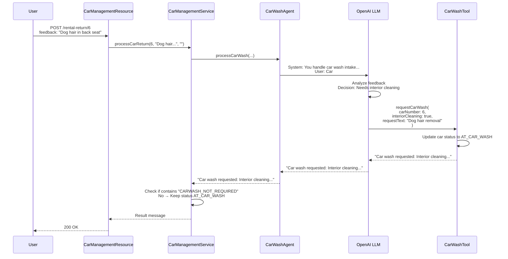
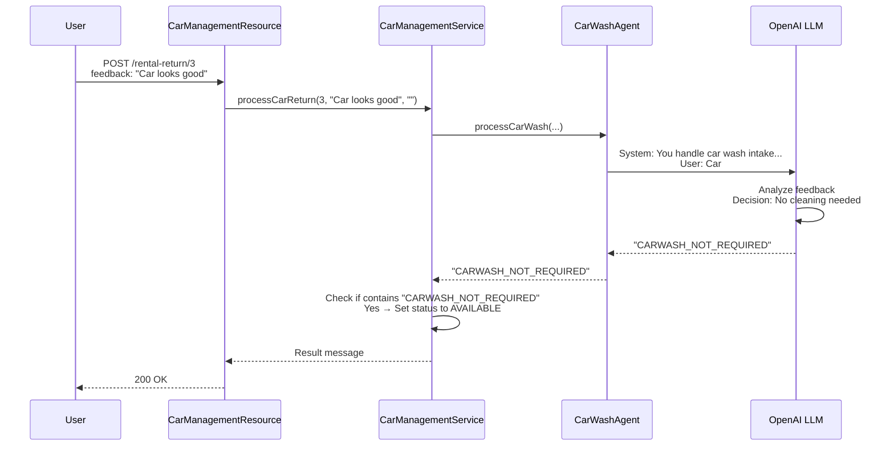

# Step 01 - Implementing AI Agents

## Welcome to Section 2: Agentic Systems

Congratulations on completing Section 1! You've learned how to build AI-infused applications with chatbots, RAG patterns, and function calling.

In **Section 2**, we're shifting gears to explore **agentic systems** — autonomous AI agents that can work together to solve complex, multi-step problems. Instead of a chatbot responding to user queries, you'll build agents that can make decisions, use tools, and collaborate in workflows.

### What You'll Learn

In this step, you will:

- Understand the difference between **AI Services** (Section 1) and **AI Agents** (Section 2)
- Build your first autonomous agent using the `quarkus-langchain4j-agentic` module
- Learn how agents use tools (_function calling_) to take actions
- See agents make decisions based on contextual information

---

## A New Scenario: Car Management System

The **Miles of Smiles** car rental company needs help managing their fleet.
Here's the business process:

1. **Rental Returns**: When customers return cars, the rental team records feedback about the car's condition.
2. **Car Wash Requests**: Based on the feedback, the system should automatically decide if the car needs cleaning.
3. **Car Wash Returns**: After cleaning, the car wash team provides their own feedback and returns the car.
4. **Fleet Availability**: Clean cars with no issues return to the available pool for rental.

Your job is to build an **AI agent** that can analyze feedback and _intelligently_ decide whether to request a car wash.

---

## AI Services vs. AI Agents

Before diving into the code, let's clarify the key differences:

| Feature | AI Services (Section 1) | AI Agents (Section 2)                                     |
|---------|------------------------|-----------------------------------------------------------|
| **Purpose** | Answer user questions | Perform autonomous tasks                                  |
| **Interaction** | Reactive (responds to prompts) | Reactive and Proactive (takes actions)                    |
| **Tool Usage** | Can call tools when needed | Can call tools to accomplish goals                        |
| **Workflows** | Single-agent interactions | Multi-agent collaboration  (workflow or supervisor-based) |
| **Annotation** | Methods use `@SystemMessage` + `@UserMessage` | One method per interface uses `@Agent`                    |
| **Use Cases** | Chatbots, Q&A, content generation | Automation, decision-making, orchestration                |

In this section, you'll see how agents extend the capabilities you learned in Section 1 to build sophisticated, autonomous systems.

---

## Prerequisites

Before starting, ensure you have:

- Completed Section 1 (or you are familiar with Quarkus LangChain4j basics)
- JDK 21+ installed
- OpenAI API key set as `OPENAI_API_KEY` environment variable
- A container runtime (Docker/Podman) for running a PostgreSQL [Dev Service](https://quarkus.io/guides/databases-dev-services)

---

## Running the Application

Navigate to the `section-2/step-01` directory and start the application:

=== "Linux / macOS"
```bash
cd section-2/step-01
./mvnw quarkus:dev
```

=== "Windows"
```cmd
cd section-2\step-01
mvnw quarkus:dev
```

Once started, open your browser to [http://localhost:8080](http://localhost:8080){target="_blank"}.

### Understanding the UI

The application has two main sections:

1. **Fleet Status** (top): Shows all cars in the Miles of Smiles fleet with their current status
2. **Returns** (bottom): Displays cars that are currently rented or at the car wash

{: .center}

---

## Try It Out

Let's see the agent in action!

### Test 1: Car Needs Cleaning

Act as a rental team member processing a car return. In the **Returns > Rental Return** section, select a car and enter this feedback:

```
Car has dog hair all over the back seat
```

Click the **Return** button.

**What happens?**

- The agent analyzes the feedback
- Recognizes the car needs cleaning
- Calls the `CarWashTool` to request interior cleaning
- Updates the car's status to `AT_CAR_WASH`

Check your terminal logs (you may need to scroll up). You should see output like:

```
🚗 CarWashTool result: Car wash requested for Mercedes-Benz C-Class (2020), Car #6:
- Interior cleaning
Additional notes: Interior cleaning required due to dog hair in back seat.
```

### Test 2: Car Is Clean

Now try returning a car that's already clean:

```
Car looks good
```

**What happens?**

- The agent analyzes the feedback
- Determines no cleaning is needed
- Returns `CARWASH_NOT_REQUIRED` (no tool call made)
- Updates the car's status to `AVAILABLE`

In your logs, you'll see the agent's response contains:

```
"content":"CARWASH_NOT_REQUIRED"
```

Notice how the agent **made a decision** without calling the car wash tool. This demonstrates reasoning!

---

## Building Agents with Quarkus LangChain4j

The [langchain4j-agentic](https://github.com/langchain4j/langchain4j/tree/main/langchain4j-agentic){target="_blank"} module introduces the ability to create AI Agents.
This module is available in Quarkus using the `quarkus-langchain4j-agentic` module.
If you open the `pom.xml` file from the project, you will see this dependency:

```xml
<dependency>
    <groupId>io.quarkiverse.langchain4j</groupId>
    <artifactId>quarkus-langchain4j-agentic</artifactId>
</dependency>
```

### Key Concepts

Agents share similarities with AI Services from Section 1:

- Declared as interfaces (implementation generated automatically)
- Use `@SystemMessage` to define the agent's role and behavior
- Use `@UserMessage` to provide request-specific context
- Can be assigned **tools** to perform actions
- Support both programmatic and declarative (annotation-based) definitions, even if in Quarkus, we recommend the declarative approach

### Key Differences

- **Only one method** per interface can be annotated with `@Agent` - this is the agent entry point
- Designed to be composed with for **workflows** or be invoked by a supervisor — agents can be composed together (more on this in Step 02)
- Focus on **autonomous actions** rather than conversational responses

---

## Understanding the Application Architecture

{: .center}

The application consists of four main components:

1. **CarManagementResource**: REST API endpoints
2. **CarManagementService**: Business logic and agent orchestration
3. **CarWashAgent**: AI agent that decides if cleaning is needed
4. **CarWashTool**: Tool that requests car wash services

Let's explore each component.

---

## Component 1: REST API Endpoints

The `CarManagementResource` provides REST APIs to handle car returns:

```java hl_lines="19 22 41 44" title="CarManagementResource.java"
--8<-- "../../section-2/step-01/src/main/java/com/carmanagement/resource/CarManagementResource.java:car-management"
```

**Key Points:**

- The `processRentalReturn` method (endpoint `/car-management/rental-return/{carNumber}`):  Accepts feedback from the rental team
- The `processCarWashReturn` method (endpoint `/car-management/car-wash-return/{carNumber}`): Accepts feedback from the car wash team
- Both endpoints delegate to `CarManagementService.processCarReturn`

---

## Component 2: Business Logic & Agent Invocation

The `CarManagementService` orchestrates the car return process:

```java hl_lines="37-43 45-47" title="CarManagementService.java"
--8<-- "../../section-2/step-01/src/main/java/com/carmanagement/service/CarManagementService.java"
```

**Key Points:**

- The `CarWashAgent` field is injected as a CDI bean
- In the `processCarReturn` method, the agent is invoked with car details and feedback. The response is checked for `CARWASH_NOT_REQUIRED`:

    * If found → Car marked as `AVAILABLE`
    * If not found → Car stays `AT_CAR_WASH` (tool was called)

This simple pattern allows you to ***integrate autonomous decision-making into your business logic***!

---

## Component 3: The CarWashAgent

Here's where the *magic* happens — the AI agent definition:

```java hl_lines="18 31-32" title="CarWashAgent.java"
--8<-- "../../section-2/step-01/src/main/java/com/carmanagement/agentic/agents/CarWashAgent.java"
```

**Let's break it down:**

### `@SystemMessage`
Defines the agent's **role** and **decision-making logic**:

- Acts as the intake specialist for the car wash department
- Should call the `requestCarWash` function in the CarWashTool when cleaning is needed
- Should be specific about which services to request
- Should return `CARWASH_NOT_REQUIRED` if no cleaning is needed

!!! tip "Pro Tip: Clear Instructions Matter"
The system message is critical! It tells the agent:

    - **WHO** it is (car wash intake specialist)
    - **WHAT** to do (submit car wash requests)
    - **WHEN** to act (based on feedback)
    - **HOW** to respond (specific services or `CARWASH_NOT_REQUIRED`)

### `@UserMessage`
Provides **context** for each request using template variables:

- Car details: `{carMake}`, `{carModel}`, `{carYear}`, `{carNumber}`
- Feedback sources: `{rentalFeedback}`, `{carWashFeedback}`

These variables are automatically populated from the method parameters.

### `@Agent`
Marks this as an **agent method** — only one per interface.

- Provides a description: "Car wash specialist. Determines what car wash services are needed."
- This description can be used by other agents or systems to understand this agent's purpose

### `@ToolBox`
Assigns the `CarWashTool` to this agent:

- The agent can call methods in this tool to perform actions
- The LLM decides when and how to use the tool based on the task (function calling has been covered in the Section 1 of the workshop)

### Method Signature
Defines the inputs and output:

- **Inputs**: All the context the agent needs to make decisions
- **Output**: `String` — the agent's response (either tool result or `CARWASH_NOT_REQUIRED`)

!!! info "No Implementation Required"
Notice there's **no method body**! LangChain4j automatically generates the implementation:

    1. Receives the inputs
    2. Sends the system + user messages to the LLM
    3. If the LLM wants to call the tool, it does so
    4. Returns the final response

---

## Component 4: The CarWashTool

Tools enable agents to take **actions** in the real world:

```java hl_lines="4 21 40 47-48" title="CarWashTool.java"
--8<-- "../../section-2/step-01/src/main/java/com/carmanagement/agentic/tools/CarWashTool.java:CarWashTool"
```

**Key Points:**

- `@Dependent` scope is required (see explanation below)
- `@Tool` annotation exposes this method to agents
    - The description helps the LLM understand when to use this tool
    - Parameters define what information the agent must provide
- The method updates the car status to `AT_CAR_WASH`, if the `carInfo` is not `null`
- The method returns a summary of the request (and prints a log messages)

### Understanding Tool Execution Flow

Here is the sequence of actions happening when the agent is invoked:

1. Agent receives car return feedback (entered by the user)
2. LLM analyzes the feedback
3. LLM decides to call `requestCarWash` (or not, depending on the feedback)
4. If called, LLM determines which parameters to use:
    - Should `interiorCleaning` be true?
    - Should `exteriorWash` be true?
    - What `requestText` should be included?
5. Tool executes and returns a result
6. Agent receives the result and can respond

??? question "Why do we use @Dependent scope for the Tool?"
When a tool is added to an agent, LangChain4j introspects the tool object to find methods with `@Tool` annotations.

    **The problem with other scopes:**
    CDI creates proxies for beans with scopes like `@ApplicationScoped` or `@SessionScoped`. These proxy objects don't preserve the `@Tool` annotations, so LangChain4j can't detect them.

    **The solution:**
    Use `@Dependent` scope, which doesn't create proxies, allowing LangChain4j to see the annotations directly.

    **Alternative:**
    If you need other CDI scopes, you can use a `ToolProvider` to manually register tools (not covered in this workshop).

---

## How It All Works Together

Let's trace through a complete example:

### Scenario: Dog Hair in Back Seat



### Scenario: Car Looks Good



---

## Key Takeaways

**Agents are autonomous**: They make decisions and take actions based on context.
**Tools enable actions**: Agents use tools to interact with systems (databases, APIs, etc.)
**Clear prompts matter**: The `@SystemMessage` guides the agent's decision-making
**Type-safe interfaces**: No manual API calls — just define interfaces and let Quarkus LangChain4j handle the rest
**CDI integration**: Agents and tools are managed beans that integrate seamlessly with Quarkus

---

## Experiment Further

Try these experiments to deepen your understanding:

### 1. Test Edge Cases

Try different feedback scenarios:

```
The trunk smells like fish
```

```
Minor scratch on the bumper
```

```
Spotless condition
```

What does the agent decide for each? Does it call the car wash tool?

### 2. Modify the System Message

Edit `CarWashAgent.java` and change the system message. For example:

```java
@SystemMessage("""
    You are a very picky car wash intake specialist.
    Request a full detail (exterior, interior, waxing, detailing)
    unless the car is absolutely perfect.
    If perfect, respond with "CARWASH_NOT_REQUIRED".
    """)
```

How does this change the agent's behavior?

### 3. Add More Tool Parameters

Edit `CarWashTool.java` to add a `tireCleaning` parameter.
Does the agent automatically learn to use it?

---

## Troubleshooting

??? warning "Error: OPENAI_API_KEY not set"
Make sure you've exported the environment variable:

    ```bash
    export OPENAI_API_KEY=sk-your-key-here
    ```

    Then restart the application.

??? warning "Tool methods not being called"
- Verify the tool uses `@Dependent` scope
- Check that the `@Tool` annotation is present
- Ensure the tool is properly referenced in `@ToolBox`

??? warning "Agent always/never calls the tool"
- Review your `@SystemMessage` — is it clear about when to use the tool?
- Try adding more explicit instructions
- Consider providing examples in the system message

---

## What's Next?

In this step, you built a **single autonomous agent** that makes decisions and uses tools.

In **Step 02**, you'll learn how to compose **multiple agents into workflows** — where agents collaborate to solve complex problems together!

[Continue to Step 02 - Composing Simple Agent Workflows](step-02.md)