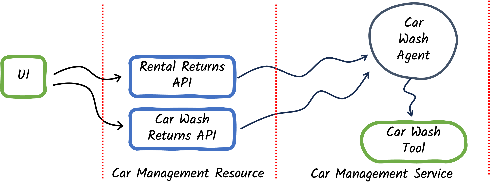

# Step 01 - Implementing AI Agents

## A new challenge

The Miles of Smiles management team needs help with managing their cars. 

When customers return cars they had rented, the team processing the return should be able to record comments about any issues they notice with the car. The car should then be sent for cleaning. The car wash team will pay attention to the comments and clean the car accordingly. When the cleaning is complete, the car wash team will provide their own comments and return the car. If the car is returned with no issues it can be put back into the available pool to be rented.

## Running the application

From the `section-2/step-01` directory, run the application with the following command:

```bash
./mvnw quarkus:dev
```

Open a browser to [http://localhost:8080](http://localhost:8080){target="_blank"}.

The UI has two sections. The **Fleet Status** section shows all the cars in the Miles of Smiles fleet. The **Returns** section shows cars that are either rented or at the car wash.

{: .center}

Acting as one of the Miles of Smiles team members accepting car rental returns, fill in a comment for one of the cars in the **Rental Return** section and click the corresponding **Return** button. 

```
Car has dog hair all over the back seat
```

After a few moments the car status will be updated in the fleet status section and the car should no longer appear in the returns section. With the above return comment, the log output would show evidence of a car wash request being made similar to the following:

```
CarWashTool result: Car wash requested for Mercedes-Benz C-Class (2020), Car #6:
- Interior cleaning
Additional notes: Car has dog hair all over the back seat, please perform interior cleaning.
```

For another car in the Rental Returns section, enter a comment that indicates the car is clean:

```
Car looks good
```

In the logs you should see a response indicating a car wash is not required:

```
...
- body: {
  "id": "chatcmpl-CK9jb3Xsyp3zHcbBgezBEmjsI4EMh",
  "object": "chat.completion",
  "created": 1758920015,
  "model": "gpt-4o-mini-2024-07-18",
  "choices": [
    {
      "index": 0,
      "message": {
        "role": "assistant",
        "content": "CARWASH_NOT_REQUIRED",
        "refusal": null,
        "annotations": []
      },
      "logprobs": null,
      "finish_reason": "stop"
    }
  ],
...
```

## Building Agents with LangChain4j

The [langchain4j-agentic](https://github.com/langchain4j/langchain4j/tree/main/langchain4j-agentic){target="_blank"} module introduces the ability to create Agents. In their simplest form, agents are very similar to AI Services (introduced in section-1):

- Agents are declared in interfaces (and are implemented for you automatically)
- Agent interfaces let you specify a `SystemMessage` and `UserMessage`
- Agents can be assigned ==tools== which they can use
- Agents can be defined programmatically or declaratively (with annotations).

In contrast to AI Services, only one method on an agent interface can be annotated with `@Agent`. This method is the method callers will call to invoke the agent.

## Understanding the app

{: .center}


The `CarManagementResource` provides REST APIs to handle returns of cars from the rental team and the car wash team. 

```java hl_lines="26 50" title="CarManagementResource.java"
--8<-- "../../section-2/step-01/src/main/java/com/carmanagement/resource/CarManagementResource.java:car-management"
```

The `CarManagementService`, when initialized, creates an instance of the `CarWashAgent` with a call to the `createCarWashAgent` method.

```java title="CarManagementService.java"
--8<-- "../../section-2/step-01/src/main/java/com/carmanagement/service/CarManagementService.java:createCarWashAgent"
```

The set up of the agent entails:

- defining the chat model it should use
- associating tools with the agent

The `CarManagementResource` calls the `CarManagementService.processCarReturn` method to handle car returns. 

```java hl_lines="16-22 24-26" title="CarManagementService.java"
--8<-- "../../section-2/step-01/src/main/java/com/carmanagement/service/CarManagementService.java:processCarReturn"
```

The `processCarReturn` method uses the `carWashAgent` to request car washes. Notice also that the response from the agent is checked to see if the agent's response contained `CARWASH_NOT_REQUIRED` -- if so, the car state is changed to mark the car available to rent, and if not, it implies the car wash agent requested further car cleaning (so no state change would be required).

```java title="CarWashAgent.java"
--8<-- "../../section-2/step-01/src/main/java/com/carmanagement/agentic/agents/CarWashAgent.java:carWashAgent"
```

The `CarWashAgent` looks at the feedback from when the car was returned and decides which car wash options to select.

- `@SystemMessage` is used to tell the agent its role and how to handle requests. Notice we ask the agent to return `CARWASH_NOT_REQUIRED`, if applicable, to make it easy for callers to identify that outcome.
- `@UserMessage` is used to provide content specific to the request.
- You don't provide the implementation of agents (that is created for you by LangChain4j)
- `@Agent` annotation identifies the method in the interface to use as the agent. Only one method can have the `@Agent` annotation per interface.

When the `carWashAgent` was created it was assigned a tool (the `CarWashTool`). When requests are made to the agent, the agent can decide to call any of the tools it has been assigned to help satisfy the request.

```java hl_lines="4 24" title="CarWashTool.java"
--8<-- "../../section-2/step-01/src/main/java/com/carmanagement/agentic/tools/CarWashTool.java:CarWashTool"
```

The `CarWashTool` is a mock tool for requesting the car wash. The `@Tool` annotation is used to identify the methods that should be registered as tool methods, which agents can use.

??? question "Why do we use @Dependent scope for the Tool?"
    When a tool is added to the definition of an agent, LangChain4j introspects the tool object to see which methods have `@Tool` annotations. CDI creates proxies around objects that are defined with certain CDI scopes (such as `@ApplicationScoped` or `@SessionScoped`). The proxy methods do not have the `@Tool` annotations and therefore the agents don't properly recognize the tool methods on those objects. If you need your tools to be defined with other CDI scopes, you can use a `ToolProvider` to add tools (not discussed in this tutorial).
