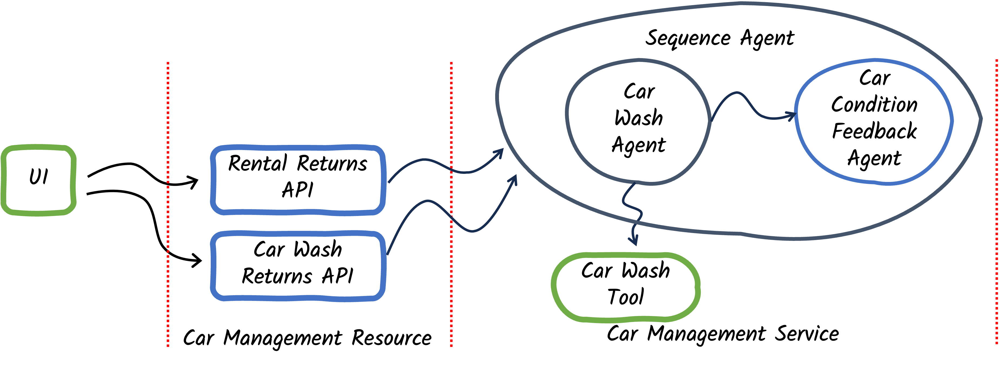
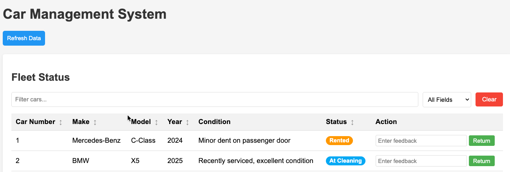

# Step 02 - Composing Simple Agent Workflows

## Tracking the Condition of Cars

The Miles of Smiles management team now wants to keep track of the condition of its cars.

In the previous step, cars could be returned by the team processing returns or the car wash team — and in either case comments could be provided from the teams about the car. The recorded condition of the car should be automatically updated based on those comments.

In this step you will be introduced to using multiple agents together in a workflow.

## Workflows

With LangChain4j you can set up a set of agents to work together to solve problems. Much like the building blocks of a programming language, langchain4j-agentic provides some basic constructs you can use to build agentic workflows:

- **Sequence Workflows** - Agents execute one after another in a predetermined order.
- **Parallel Workflows** - Agents execute at the same time on separate threads.
- **Loop Workflows** - A sequence of agents runs repeatedly, until some condition is satisfied.
- **Conditional Workflows** - A sequence of agents runs in a predetermined order, but each agent in the sequence only runs if a specified condition is satisfied.

To satisfy management's new requirement, let's use a Sequence of agents to first call the Car Wash agent, and then call another agent to update the car condition.

To enable Agents to better work together, langchain4j-agentic includes a shared context class called `AgenticScope`. The agent framework uses the `AgenticScope` to maintain context between calls to each agent in a workflow. When calling an agent in a workflow, the agent framework attempts to use an internal map in the `AgenticScope` to read inputs corresponding to the list of inputs declared in the agent method's signature. When an agent returns a result, the agent framework writes the result into the `AgenticScope`'s map using the output name specified by the agent.

## What Are We Going to Build?

{: .center}

We'll create a workflow that processes car returns, updates car conditions based on feedback, and manages the car washing process.

Starting from our app in step-01, we need to:

1. Create a `CarConditionFeedbackAgent`
2. Create a `CarProcessingWorkflow` interface
3. Create a sequence workflow in `CarManagementService` (we'll call it `CarProcessingWorkflow`)
4. Modify the `CarManagementService` to use the sequence workflow

## Before You Begin

You can either use the code from `step-01` and continue from there, or check the final code of the step located in the `step-02` directory.
    
??? important "Do not forget to close the application"
    If you have the application running from the previous step and decide to use the `step-02` directory, make sure to stop it (CTRL+C) before continuing.

If you are continuing to build the app in the step-01 directory, start by copying some files (which don't relate to the experience of building agentic AI apps) from step-02:

For Linux/macOS:
```bash
cd ./step-01
cp ../step-02/src/main/resources/static/css/styles.css ./src/main/resources/static/css/styles.css
cp ../step-02/src/main/resources/static/js/app.js ./src/main/resources/static/js/app.js
cp ../step-02/src/main/resources/templates/index.html ./src/main/resources/templates/index.html
cp ../step-02/src/main/java/com/carmanagement/service/CarService.java ./src/main/java/com/carmanagement/service/CarService.java
cp ../step-02/src/main/java/com/carmanagement/model/CarInfo.java ./src/main/java/com/carmanagement/model/CarInfo.java
```

For Windows:
```batch
cd .\step-01
copy ..\step-02\src\main\resources\static\css\styles.css .\src\main\resources\static\css\styles.css
copy ..\step-02\src\main\resources\static\js\app.js .\src\main\resources\static\js\app.js
copy ..\step-02\src\main\resources\templates\index.html .\src\main\resources\templates\index.html
copy ..\step-02\src\main\java\com\carmanagement\service\CarService.java .\src\main\java\com\carmanagement\service\CarService.java
copy ..\step-02\src\main\java\com\carmanagement\model\CarInfo.java .\src\main\java\com\carmanagement\model\CarInfo.java
```

## Create a CarConditionFeedbackAgent

```java title="CarConditionFeedbackAgent.java"
--8<-- "../../section-2/step-02/src/main/java/com/carmanagement/agentic/agents/CarConditionFeedbackAgent.java:carConditionFeedbackAgent"
```

As we've seen before, the interface for an agent defines the system message, user message and indicates which method is the agent method.

## Create a CarProcessingWorkflow Interface

First, create the directory:

```bash
mkdir ./src/main/java/com/carmanagement/agentic/workflow
```

Then create the workflow interface:

```java title="CarProcessingWorkflow.java"
--8<-- "../../section-2/step-02/src/main/java/com/carmanagement/agentic/workflow/CarProcessingWorkflow.java:carProcessingWorkflow"
```

`CarProcessingWorkflow` is a type-safe interface that we can use to refer to our sequence workflow. Notice that the `CarProcessingWorkflow` interface looks a lot like a regular Agent. Workflows can be thought of as containers for sets of agents, not agents themselves. Since they are not agents (and cause no LLM calls to be made on their behalf) they do not have `@SystemMessage` or `@UserMessage` annotations.

## Create a Sequence Workflow in CarManagementService

```java title="CarManagementService.java"
--8<-- "../../section-2/step-02/src/main/java/com/carmanagement/service/CarManagementService.java:carManagementService"
```

Let's break down the key parts of this implementation:

- **Lines 43-45**: Initialize the `CarProcessingWorkflow` when the service is instantiated.
- **Lines 47-??**: Define the `CarWashAgent` and `CarConditionFeedbackAgent` — the 2 agents we want to include in our sequence workflow. Set an output name, "carCondition", for the `CarConditionFeedbackAgent` that we can use to see the result from that agent.
- **Lines ?-71**: Define the sequence workflow, `CarProcessingWorkflow`, including the `CarWashAgent` and `CarConditionFeedbackAgent` as subagents (the term subagent is used to represent the list of agents that are in the workflow).
- **Lines 99-103**: Retrieve the "carCondition" value from the `AgenticScope`, and use that value to update the condition for the car.

## Trying Out the New Workflow

Now that we have updated the workflow to update the car condition we can try it in the UI. Notice that the Fleet Status section of the UI now has a "Condition" column, indicating the last known condition of the car.

On the Rental Return tab choose a car and enter some feedback that would indicate something has changed about the condition of the car. For example:

```
there has clearly been a fire in the trunk of this car
```

After submitting the feedback (by hitting the Return button), and a brief pause, you should see the condition of the car gets updated in the Fleet Status section.

{: .center}

You should also see in the log file that the two agents ran in sequence. Here you can see that the car wash agent requested an interior wash of car, and the car condition feedback agent came up with a new car condition.

```
<log snippet showing 2 agents running in sequence - remember to collect this while using OpenAI LLM>
```

## When to Use Parallel Workflows

In this step, we could have run the car wash agent and the car condition feedback agent in parallel since the car condition feedback agent doesn't depend on the output from the car wash agent. We chose to do them in sequence to simplify later steps in this lab, but you can try changing the sequence workflow to a parallel workflow (which should complete faster than the sequence workflow).
