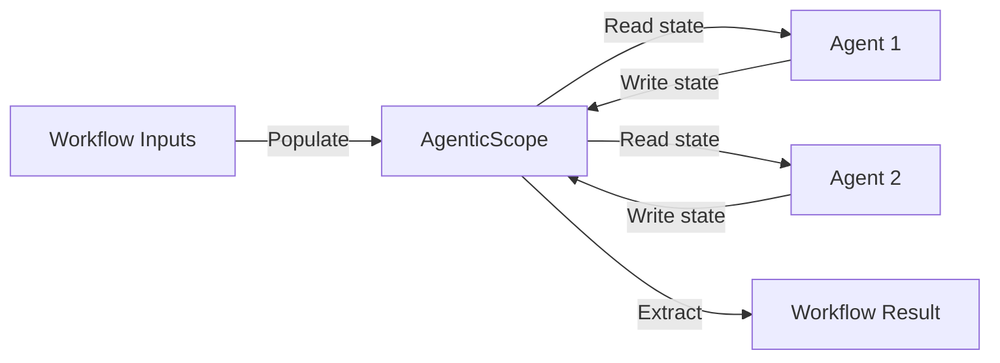
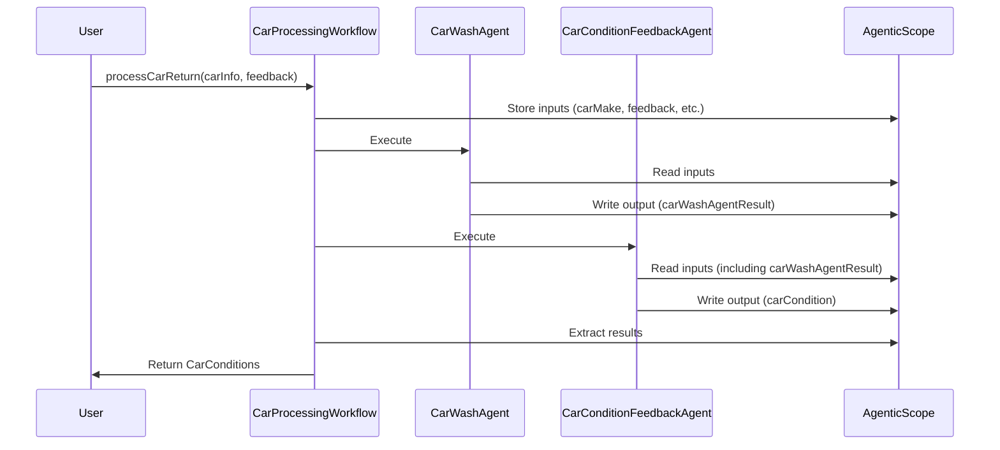

# Step 02 - Composing Simple Agent Workflows

## New Requirement: Track Car Conditions

The Miles of Smiles management team now wants to keep track of the condition of each car in their fleet.

Currently, when cars are returned (either from rentals or from the car wash), feedback is provided but not systematically recorded.
Management wants the system to:

1. **Automatically analyze feedback** from both rental returns and car wash returns
2. **Update the car's condition** based on this feedback
3. **Display the current condition** in the fleet management UI

In this step, you'll learn how to compose **multiple agents into workflows** that work together to solve more complex problems.

!!!note
"Workflow" is a pattern to compose agents with limited autonomy as you defined the control flow (when each agent is called).
This is different from the supervisor pattern where a special agent determines when to call _sub-agents_.

---

## What You'll Learn

In this step, you will:

- Understand the different types of **agentic workflows** (sequence, parallel, loop, conditional)
- Build a **sequence workflow** that runs agents one after another
- Learn about **AgenticScope**, the shared context that enables agents to pass data between each other
- Use the **declarative workflow API** with annotations
- See how to extract and use results from multi-agent workflows

---

## Understanding Workflows

With Quarkus LangChain4j, you can compose multiple agents to work together as a _team_.
Much like the building blocks of a programming language, `quarkus-langchain4j-agentic` provides constructs to build different types of workflows:

| Workflow Type | Description | Use Case |
|--------------|-------------|----------|
| **Sequence** | Agents execute one after another in order | When Agent B needs the output from Agent A |
| **Parallel** | Agents execute simultaneously on separate threads | When agents can work independently for faster execution |
| **Loop** | Agents run repeatedly until a condition is met | When iterative refinement is needed |
| **Conditional** | Agents only execute if a condition is satisfied | When different paths are needed based on context |

In this step, we'll use a **sequence workflow** to:

1. First, run the `CarWashAgent` to determine if washing is needed
2. Then, run the `CarConditionFeedbackAgent` to update the car's condition

---

## Understanding AgenticScope

To enable agents to work together, they need a way to **share data**.
This is where `AgenticScope` comes in.

**What is AgenticScope?**

- A **shared context** that keeps track throughout a workflow execution.
- Contains a **map** of key-value pairs that agents can read from and write to: the _state_.
- This state is automatically populated with **inputs** from the workflow method signature.
- This state is automatically updated with **outputs** from each agent using their `outputName`.

**How It Works:**



When an agent completes, its result is stored in the `AgenticScope`'s state using the `outputName` specified in the `@Agent` annotation.
The next agent in the workflow can access this value as an input parameter using the name specified in the `outputName` annotation.

---

## What Are We Going to Build?

{: .center}

We'll enhance the car management system with:

1. **CarConditionFeedbackAgent**: Analyzes feedback to determine the current condition of a car
2. **CarProcessingWorkflow**: A sequence workflow that orchestrates the car wash agent and condition feedback agent
3. **Updated UI**: Displays the current condition of each car

**The Flow:**



---

## Prerequisites

Before starting:

- Completed Step 01 (or have the `section-2/step-01` code available)
- Application from Step 01 is stopped (Ctrl+C)

---

## Option 1: Continue from Step 01

If you want to continue building on your Step 01 code, you'll need to copy some updated UI files and the updated `CarInfo.java` from `step-02`:

=== "Linux / macOS"
```bash
cd section-2/step-01
cp ../step-02/src/main/resources/META-INF/resources/css/styles.css ./src/main/resources/META-INF/resources/css/styles.css
cp ../step-02/src/main/resources/META-INF/resources/js/app.js ./src/main/resources/META-INF/resources/js/app.js
cp ../step-02/src/main/resources/META-INF/resources/index.html ./src/main/resources/META-INF/resources/index.html
cp ../step-02/src/main/resources/import.sql ./src/main/resources/import.sql
cp ../step-02/src/main/java/com/carmanagement/model/CarInfo.java ./src/main/java/com/carmanagement/model/CarInfo.java
```

=== "Windows"
```cmd
cd section-2\step-01
copy ..\step-02\src\main\resources\META-INF\resources\css\styles.css .\src\main\resources\META-INF\resources\css\styles.css
copy ..\step-02\src\main\resources\META-INF\resources\js\app.js .\src\main\resources\META-INF\resources\js\app.js
copy ..\step-02\src\main\resources\META-INF\resources\index.html .\src\main\resources\META-INF\resources\index.html
copy ..\step-02\src\main\resources\import.sql .\src\main\resources\import.sql
copy ..\step-02\src\main\java\com\carmanagement\model\CarInfo.java .\src\main\java\com\carmanagement\model\CarInfo.java
```

These files add the "Condition" column to the UI and update the data model to track car conditions.

---

## Option 2: Start Fresh from Step 02

Alternatively, navigate to the complete `section-2/step-02` directory:

```bash
cd section-2/step-02
```

---

## Step 1: Create the CarConditionFeedbackAgent

Create a new agent that analyzes feedback to determine a car's current condition.

In `src/main/java/com/carmanagement/agentic/agents`, create `CarConditionFeedbackAgent.java`:

```java title="CarConditionFeedbackAgent.java"
--8<-- "../../section-2/step-02/src/main/java/com/carmanagement/agentic/agents/CarConditionFeedbackAgent.java"
```

**Let's break it down:**

### `@SystemMessage`
Defines the agent's role as a **car condition analyzer**:

- Analyzes feedback to determine current condition
- Considers the previous condition when making assessments
- Provides concise condition descriptions
- Does not add headers or prefixes (for clean output)

### `@UserMessage`
Provides all the context needed:

- Car details: `{carMake}`, `{carModel}`, `{carYear}`
- **Previous condition**: `{carCondition}` — allows the agent to understand changes
- Feedback from multiple sources: `{rentalFeedback}`, `{carWashFeedback}`

### `@Agent` with `outputName`
Notice the new **`outputName` parameter**:

```java
@Agent(outputName = "carCondition", ...)
```

This tells the framework to store the agent's result in the `AgenticScope`'s state under the key `"carCondition"`.
Other agents or the workflow can then access this value.

---

## Step 2: Create the CarConditions Model

Before creating the workflow, we need a data model to return both the car condition and whether a car wash is required.

In `src/main/java/com/carmanagement/model`, create `CarConditions.java`:

```java title="CarConditions.java"
package com.carmanagement.model;

/**
 * Record representing the conditions of a car.
 *
 * @param generalCondition   A description of the car's general condition
 * @param carWashRequired    Indicates if a car wash is required
 */
public record CarConditions(String generalCondition, boolean carWashRequired) {
}
```

This simple record combines the results from both agents in our workflow.

---

## Step 3: Update the CarWashAgent

The `CarWashAgent` needs to specify an `outputName` so its result can be accessed by the workflow.

Update `src/main/java/com/carmanagement/agentic/agents/CarWashAgent.java`:

```java hl_lines="35" title="CarWashAgent.java"
--8<-- "../../section-2/step-02/src/main/java/com/carmanagement/agentic/agents/CarWashAgent.java"
```

**Key change:**

In the `@Agent` annotation, adds `outputName = "carWashAgentResult"` to the `@Agent` annotation. This stores the agent's response in the `AgenticScope`'s state, making it available to subsequent agents and the workflow output method.

---

## Step 4: Create the Workflow Directory

If continuing from Step 01, create the workflow directory:

=== "Linux / macOS"
```bash
mkdir -p ./src/main/java/com/carmanagement/agentic/workflow
```

=== "Windows"
```cmd
mkdir .\src\main\java\com\carmanagement\agentic\workflow
```

---

## Step 5: Define the CarProcessingWorkflow

Now, create the workflow that orchestrates both agents.

In `src/main/java/com/carmanagement/agentic/workflow`, create `CarProcessingWorkflow.java`:

```java hl_lines="18-21" title="CarProcessingWorkflow.java"
--8<-- "../../section-2/step-02/src/main/java/com/carmanagement/agentic/workflow/CarProcessingWorkflow.java"
```

**Let's break it down:**

### `@SequenceAgent` Annotation

This annotation defines a **sequence workflow**:

```java
@SequenceAgent(
    outputName = "carConditions",
    subAgents = {
        @SubAgent(type = CarWashAgent.class, outputName = "carWashAgentResult"),
        @SubAgent(type = CarConditionFeedbackAgent.class, outputName = "carCondition")
    }
)
```

- **`outputName`**: Where to store the final workflow result in `AgenticScope`'s state
- **`subAgents`**: The list of agents to execute in order
    - Agent 1: `CarWashAgent`: determines if washing is needed
    - Agent 2: `CarConditionFeedbackAgent`: updates the car condition

The agents execute sequentially: `CarWashAgent` → `CarConditionFeedbackAgent`

### Method Signature

The workflow method signature defines **all the inputs** needed by any agent in the workflow:

```java
CarConditions processCarReturn(
    String carMake,
    String carModel,
    Integer carYear,
    Integer carNumber,
    String carCondition,
    String rentalFeedback,
    String carWashFeedback
)
```

These parameters are automatically populated into the `AgenticScope` when the workflow is invoked.

### `@Output`

The output method defines **how to extract the final result** from the `AgenticScope`'s state:

```java
@Output
static CarConditions output(String carCondition, String carWashAgentResult) {
    boolean carWashRequired = !carWashAgentResult.toUpperCase().contains("NOT_REQUIRED");
    return new CarConditions(carCondition, carWashRequired);
}
```

**How it works:**

1. The method parameters (`carCondition`, `carWashAgentResult`) are automatically extracted from the `AgenticScope` by matching their names with the `outputName` values from the agents
2. The method processes these values (in this case, checking if a car wash is required)
3. Returns a `CarConditions` object combining both results

This is more powerful than just returning the last agent's result: you can combine outputs from multiple agents!

---

## Step 6: Update the CarManagementService

Now update the service to use the workflow instead of calling agents directly.

Update `src/main/java/com/carmanagement/service/CarManagementService.java`:

```java hl_lines="17-23 25-26 43 48 52-58 62" title="CarManagementService.java"
--8<-- "../../section-2/step-02/src/main/java/com/carmanagement/service/CarManagementService.java"
```

**What changed?**

### Injection
```java
@Inject
CarProcessingWorkflow carProcessingWorkflow;
```

The workflow interface is injected just like any other CDI bean.
Quarkus LangChain4j generates the implementation automatically.

### Workflow Invocation

```java
CarConditions carConditions = carProcessingWorkflow.processCarReturn(
    carInfo.make,
    carInfo.model,
    carInfo.year,
    carNumber,
    carInfo.condition,
    rentalFeedback != null ? rentalFeedback : "",
    carWashFeedback != null ? carWashFeedback : ""
);
```

Instead of calling agents individually, we call the workflow.
It returns a `CarConditions` object containing results from both agents.

### Using the Results
```java
// Update the car's condition with the result from CarConditionFeedbackAgent
carInfo.condition = carConditions.generalCondition();

// If carwash was not required, make the car available to rent
if (!carConditions.carWashRequired()) {
    carInfo.status = CarStatus.AVAILABLE;            
}
```

We extract both the updated condition and whether a car wash is required, then update the car accordingly.

---

## Try It Out

Start the application:

```bash
./mvnw quarkus:dev
```

Open your browser to [http://localhost:8080](http://localhost:8080){target="_blank"}.

### Notice the New UI

The **Fleet Status** section now has a **"Condition"** column showing each car's current state:

{: .center}

### Test the Workflow

In the `Returns > Rental Return` section, enter feedback that indicates a problem with a car:

```
there has clearly been a fire in the trunk of this car
```

Click **Return**.

**What happens?**

1. The `CarWashAgent` analyzes the feedback and likely requests cleaning (interior/exterior)
2. The `CarConditionFeedbackAgent` analyzes the feedback and updates the condition to reflect fire damage
3. The car's status is updated to `AT_CAR_WASH`
4. The **Condition** column in the Fleet Status updates to show the new condition

### Check the Logs

You should see both agents executing in sequence:

```
🚗 CarWashTool result: Car wash requested for Toyota Camry (2021), Car #4:
- Interior cleaning
- Exterior wash
Additional notes: Fire damage requires thorough cleaning

[CarConditionFeedbackAgent response]: Fire damage in trunk, requires inspection and repair
```

Notice how the workflow **coordinated both agents** automatically!

---

## How Data Flows Through the Workflow

Let's trace a complete example:

### Example: "Fire in the trunk"

```mermaid
sequenceDiagram
    participant Service as CarManagementService
    participant Workflow as CarProcessingWorkflow
    participant Scope as AgenticScope
    participant Agent1 as CarWashAgent
    participant Agent2 as CarConditionFeedbackAgent

    Service->>Workflow: processCarReturn(carMake="Toyota", ..., rentalFeedback="fire in trunk")

    Note over Workflow: Initialize AgenticScope
    Workflow->>Scope: Store all inputs: {carMake: "Toyota", rentalFeedback: "fire in trunk", ...}

    Note over Workflow: Execute Agent 1
    Workflow->>Agent1: processCarWash()
    Agent1->>Scope: Read inputs (carMake, rentalFeedback, etc.)
    Agent1->>Agent1: Analyze: Fire damage → needs cleaning
    Agent1->>Scope: Write output: {carWashAgentResult: "Wash requested..."}

    Note over Workflow: Execute Agent 2
    Workflow->>Agent2: analyzeForCondition()
    Agent2->>Scope: Read inputs (carMake, rentalFeedback, carWashAgentResult, etc.)
    Agent2->>Agent2: Analyze: Fire damage → serious condition issue
    Agent2->>Scope: Write output: {carCondition: "Fire damage in trunk"}

    Note over Workflow: Call @Output method
    Workflow->>Scope: Extract carCondition and carWashAgentResult
    Workflow->>Workflow: output("Fire damage in trunk", "Wash requested...")
    Workflow->>Service: return CarConditions(generalCondition="Fire damage in trunk", carWashRequired=true)

    Service->>Service: Update car condition and status
```



**Key Points:**

1. All workflow inputs are stored in `AgenticScope`'s state
2. Each agent reads what it needs from the scope's state
3. Each agent writes its result back to the scope's state using its `outputName`
4. The `@Output` method extracts specific values from the scope to build the final result

---

## Understanding the Declarative Workflow API

The declarative API uses annotations to define workflows, making them:

- **Type-safe**: Compile-time checking of agent interfaces
- **Readable**: Clear structure showing the flow
- **Composable**: Easily combine different agents even workflow-based agents
- **Maintainable**: Easy to add/remove/reorder agents
- **Automatic**: No manual AgenticScope management

---

## Key Takeaways

- **Workflows enable collaboration**: Multiple agents work together to solve complex problems
- **AgenticScope enables data sharing**: Agents pass data through a shared context without tight coupling
- **Sequence workflows run in order**: Perfect when Agent B needs Agent A's output
- **The declarative API is powerful**: Annotate interfaces, get automatic implementations
- **Type safety matters**: The compiler helps catch errors before runtime

---

## Experiment Further

### 1. Inspect the AgenticScope

Try adding different types of feedback and observe how both agents respond. Notice how they're working with the same context!

### 2. Add More Input to the Condition Agent

What if you wanted to pass the car's mileage to the condition agent? How would you:

1. Add it to the workflow method signature?
2. Add it to the agent's method signature?
3. Update the service to provide the mileage?

### 3. Try Different Feedback Combinations

Test these scenarios:

```
Rental feedback: "Scratch on door"
Car wash feedback: "Scratch remains after cleaning"
```

How does the condition agent synthesize feedback from multiple sources?

---

## Understanding Parallel vs. Sequence

!!! note "Why Sequence Instead of Parallel?"
You might notice that `CarConditionFeedbackAgent` doesn't actually use the output from `CarWashAgent`, it only looks at the original feedback.
This means these agents could run in **parallel** for better response time.

    We chose a **sequence** workflow in this step because:

    1. It's simpler to understand as your first workflow
    2. It sets us up for Step 03, where we'll add more agents that DO depend on each other

    Feel free to try converting this to a parallel workflow as an experiment! Replace `@SequenceAgent` with `@ParallelAgent` and see what happens.

---

## Troubleshooting

??? warning "Error: Cannot find symbol 'CarConditions'"
Make sure you created the `CarConditions.java` record in the `com.carmanagement.model` package.

??? warning "Workflow not updating car condition"
Check that:

    - The `CarWashAgent` has `outputName = "carWashAgentResult"`
    - The `CarConditionFeedbackAgent` has `outputName = "carCondition"`
    - The `@Output` method parameter names match these output names exactly

??? warning "UI not showing Condition column"
Make sure you copied the updated UI files from `step-02` (see "Option 1: Continue from Step 01" section above)

---

## What's Next?

You've successfully built your first multi-agent workflow!
You learned how agents collaborate through `AgenticScope` and how sequence workflows coordinate their execution.

In **Step 03**, you'll learn about **nested workflows**, combining sequence, parallel, and conditional workflows to build sophisticated agent systems!

[Continue to Step 03 - Building Nested Agent Workflows](step-03.md)