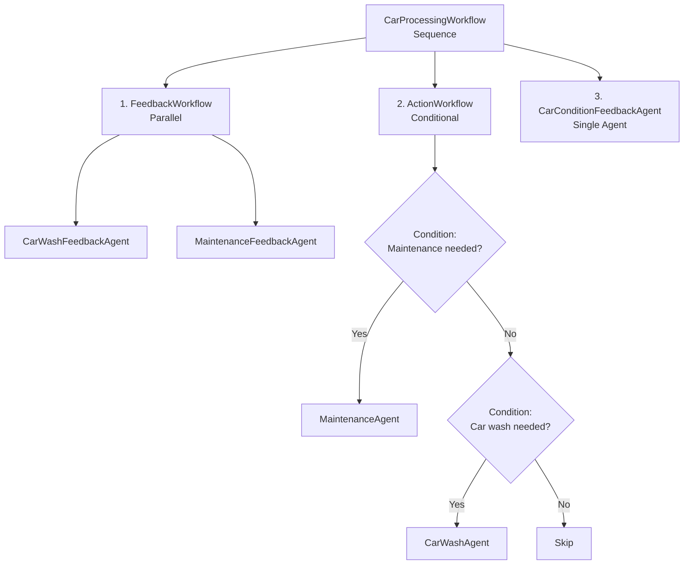
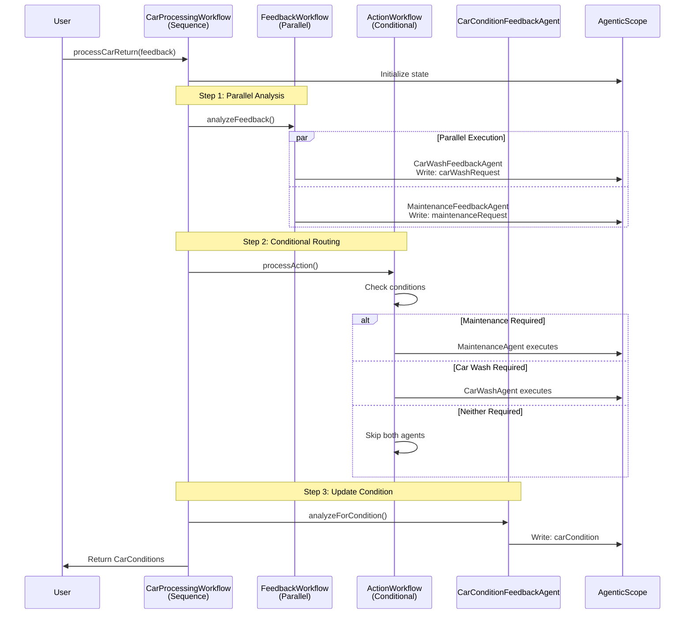

# Step 03 - Building Nested Agent Workflows

## New Requirement: Comprehensive Car Management

The Miles of Smiles management team wants (again!) a more sophisticated car management system.
When cars are returned, the system should automatically:

1. **Analyze feedback** for both cleaning needs AND maintenance requirements
2. **Route cars appropriately** — send to maintenance if needed, otherwise to car wash if needed
3. **Track all feedback sources** — from rentals, car wash, and maintenance teams
4. **Update car conditions** based on all collected feedback

This requires a more complex workflow that can handle **parallel analysis** and **conditional routing**.

---

## What You'll Learn

In this step, you will:

- Build **nested workflows**, workflows that contain other workflows
- Use **parallel workflows** to run multiple agents concurrently
- Implement **conditional workflows** that route execution based on conditions
- Understand **activation conditions** that control when agents execute
- See how complex agent systems compose from simple building blocks

---

## Understanding Nested Workflows

In Step 02, you built a simple sequence workflow with two agents running one after another. In this step, you'll build a three-level nested workflow:



**The Flow:**

1. **FeedbackWorkflow** (Parallel): Analyzes feedback simultaneously from two perspectives:
   - Does the car need maintenance?
   - Does the car need washing?

2. **ActionWorkflow** (Conditional): Routes the car based on the analysis:
   - If maintenance needed → send to maintenance team
   - Else if washing needed → send to car wash
   - Else → do nothing

3. **CarConditionFeedbackAgent** (Single): Updates the car's condition based on all feedback

---

## What Are We Going to Build?

{: .center}

We'll transform the car management system to handle:

- **Three feedback sources**: rental returns, car wash returns, maintenance returns
- **Parallel analysis**: concurrent evaluation for cleaning and maintenance needs
- **Conditional routing**: intelligent decision-making about where to send each car
- **Comprehensive tracking**: updated car conditions based on all feedback

---

## Architecture Overview

### The Nested Workflow Structure



---

## Prerequisites

Before starting:

- Completed Step 02 (or have the `section-2/step-02` code available)
- Application from Step 02 is stopped (Ctrl+C)

---

## Option 1: Continue from Step 02

If you want to continue building on your Step 02 code, copy the updated files:

=== "Linux / macOS"
    ```bash
    cd section-2/step-02
    cp ../step-03/src/main/resources/static/css/styles.css ./src/main/resources/static/css/styles.css
    cp ../step-03/src/main/resources/static/js/app.js ./src/main/resources/static/js/app.js
    cp ../step-03/src/main/resources/templates/index.html ./src/main/resources/templates/index.html
    cp ../step-03/src/main/resources/import.sql ./src/main/resources/import.sql
    cp ../step-03/src/main/java/com/carmanagement/model/CarStatus.java ./src/main/java/com/carmanagement/model/CarStatus.java
    ```

=== "Windows"
    ```cmd
    cd section-2\step-02
    copy ..\step-03\src\main\resources\static\css\styles.css .\src\main\resources\static\css\styles.css
    copy ..\step-03\src\main\resources\static\js\app.js .\src\main\resources\static\js\app.js
    copy ..\step-03\src\main\resources\templates\index.html .\src\main\resources\templates\index.html
    copy ..\step-03\src\main\resources\import.sql .\src\main\resources\import.sql
    copy ..\step-03\src\main\java\com\carmanagement\service\CarService.java .\src\main\java\com\carmanagement\service\CarService.java
    copy ..\step-03\src\main\java\com\carmanagement\model\CarStatus.java .\src\main\java\com\carmanagement\model\CarStatus.java
    ```

---

## Option 2: Start Fresh from Step 03

Navigate to the complete `section-2/step-03` directory:

```bash
cd section-2/step-03
```

---

## Part 1: Create Feedback Analysis Agents

We need two specialized agents to analyze feedback from different perspectives.

### Step 1: Create the MaintenanceFeedbackAgent

This agent determines if a car needs maintenance based on feedback.

In `src/main/java/com/carmanagement/agentic/agents`, create `MaintenanceFeedbackAgent.java`:

```java hl_lines="10 12-21 30-32 35" title="MaintenanceFeedbackAgent.java"
--8<-- "../../section-2/step-03/src/main/java/com/carmanagement/agentic/agents/MaintenanceFeedbackAgent.java"
```

**Key Points:**

- **System message**: Focuses on mechanical issues, performance problems, and maintenance needs
- **Specific output format**: Returns "MAINTENANCE_NOT_REQUIRED" when no maintenance is needed (for easy conditional checking)
- **outputName**: `"maintenanceRequest"` — stores the result in AgenticScope's state
- **Three feedback sources**: Analyzes rental, car wash, AND maintenance feedback

### Step 2: Create the CarWashFeedbackAgent

This agent determines if a car needs washing based on feedback.

In `src/main/java/com/carmanagement/agentic/agents`, create `CarWashFeedbackAgent.java`:

```java title="CarWashFeedbackAgent.java"
--8<-- "../../section-2/step-03/src/main/java/com/carmanagement/agentic/agents/CarWashFeedbackAgent.java"
```

**Key Points:**

- **System message**: Focuses on cleanliness issues — dirt, stains, smells
- **Specific output format**: Returns "CARWASH_NOT_REQUIRED" when no washing is needed
- **outputName**: `"carWashRequest"` — stores the result in AgenticScope's state
- **Same inputs**: Also analyzes all three feedback sources

---

## Part 2: Create the Parallel Feedback Workflow

Now we'll create a workflow that runs both feedback agents **concurrently**.

### Step 3: Create the FeedbackWorkflow

In `src/main/java/com/carmanagement/agentic/workflow`, create `FeedbackWorkflow.java`:

```java title="FeedbackWorkflow.java"
--8<-- "../../section-2/step-03/src/main/java/com/carmanagement/agentic/workflow/FeedbackWorkflow.java"
```

**Let's break it down:**

#### `@ParallelAgent` Annotation

```java
@ParallelAgent(
    outputName = "feedbackResult",
    subAgents = {
        @SubAgent(type = CarWashFeedbackAgent.class, outputName = "carWashRequest"),
        @SubAgent(type = MaintenanceFeedbackAgent.class, outputName = "maintenanceRequest")
    }
)
```

This defines a **parallel workflow**:

- Both agents execute **concurrently**
- Improves performance, no waiting for one to finish before the other starts
- Each agent has its own `outputName` to store results independently

!!! note "Why Parallel Here?"
    The two feedback agents analyze different aspects (cleaning vs. maintenance) and don't depend on each other. 
    Running them in parallel cuts the total execution time roughly in half!

---

## Part 3: Create Action Agents

We need agents that can actually request maintenance and car washes.

### Step 4: Create the MaintenanceAgent

This agent uses a tool to request maintenance services.

In `src/main/java/com/carmanagement/agentic/agents`, create `MaintenanceAgent.java`:

```java hl_lines="14-18 31 37" title="MaintenanceAgent.java"
--8<-- "../../section-2/step-03/src/main/java/com/carmanagement/agentic/agents/MaintenanceAgent.java"
```

**Key Points:**

- **Input**: `maintenanceRequest` — reads the output from `MaintenanceFeedbackAgent`
- **Tool**: `MaintenanceTool` — can request oil changes, brake service, etc.
- **System message**: Interprets the maintenance request and calls the appropriate tool

### Step 5: Update the CarWashAgent

The `CarWashAgent` needs to read from the `CarWashFeedbackAgent`'s output.

Update `src/main/java/com/carmanagement/agentic/agents/CarWashAgent.java`:

```java title="CarWashAgent.java"
--8<-- "../../section-2/step-03/src/main/java/com/carmanagement/agentic/agents/CarWashAgent.java"
```

**Key change:**

Now takes `carWashRequest` as input (instead of analyzing raw feedback itself). 
This follows the separation of concerns principle:

- Feedback agents: Analyze and decide
- Action agents: Execute based on decisions

---

## Part 4: Create the Conditional Action Workflow

Now we'll create a workflow that **conditionally** executes agents based on the feedback analysis.

### Step 6: Create the ActionWorkflow

In `src/main/java/com/carmanagement/agentic/workflow`, create `ActionWorkflow.java`:

```java title="ActionWorkflow.java"
--8<-- "../../section-2/step-03/src/main/java/com/carmanagement/agentic/workflow/ActionWorkflow.java"
```

**Let's break it down:**

#### `@ConditionalAgent` Annotation

```java
@ConditionalAgent(
    outputName = "actionResult",
    subAgents = {
        @SubAgent(type = MaintenanceAgent.class, outputName = "actionResult"),
        @SubAgent(type = CarWashAgent.class, outputName = "actionResult")
    }
)
```

A **conditional workflow** is a sequence where each agent only runs if its condition is met.

#### `@ActivationCondition` Methods

```java
@ActivationCondition(MaintenanceAgent.class)
static boolean activateMaintenance(String maintenanceRequest) {
    return isRequired(maintenanceRequest);
}

@ActivationCondition(CarWashAgent.class)
static boolean activateCarWash(String carWashRequest) {
    return isRequired(carWashRequest);
}
```

These methods control when each agent executes:

- **`activateMaintenance`**: Returns `true` if maintenance is needed
- **`activateCarWash`**: Returns `true` if car wash is needed

This logic is defined in the `isRequired` method:
```java
private static boolean isRequired(String value) {
    return value != null && !value.isEmpty() && !value.toUpperCase().contains("NOT_REQUIRED");
}
```

The parameters are automatically extracted from ***AgenticScope***'s state by name.

#### Execution Logic

```
if (activateMaintenance(maintenanceRequest) == true)
    → Execute MaintenanceAgent
    → Skip CarWashAgent (regardless of its condition)
else if (activateCarWash(carWashRequest) == true)
    → Execute CarWashAgent
else
    → Skip both agents
```

This implements _priority routing_: maintenance takes precedence over car wash.

---

## Part 5: Update the Car Condition Agent

### Step 7: Update CarConditionFeedbackAgent

The condition agent should now use the analyzed requests instead of raw feedback.

Update `src/main/java/com/carmanagement/agentic/agents/CarConditionFeedbackAgent.java`:

```java title="CarConditionFeedbackAgent.java"
--8<-- "../../section-2/step-03/src/main/java/com/carmanagement/agentic/agents/CarConditionFeedbackAgent.java:carConditionFeedbackSnippet"
```

**Key changes:**

- Now takes `carWashRequest` and `maintenanceRequest` as inputs
- Uses the analyzed requests (which include reasoning) to determine condition
- More accurate condition updates based on professional analysis

---

## Part 6: Create Supporting Infrastructure

### Step 8: Create the MaintenanceTool

In `src/main/java/com/carmanagement/agentic/tools`, create `MaintenanceTool.java`:

```java title="MaintenanceTool.java"
--8<-- "../../section-2/step-03/src/main/java/com/carmanagement/agentic/tools/MaintenanceTool.java"
```

Similar to `CarWashTool`, this tool:

- Uses `@Dependent` scope (required for tool detection)
- Provides maintenance options: oil change, tire rotation, brake service, etc.
- Updates car status to `IN_MAINTENANCE`
- Returns a summary of requested services

### Step 9: Create the RequiredAction Model

We need a model to represent what action is required for a car.

In `src/main/java/com/carmanagement/model`, create `RequiredAction.java`:

```java title="RequiredAction.java"
--8<-- "../../section-2/step-03/src/main/java/com/carmanagement/model/RequiredAction.java"
```

### Step 10: Update the CarConditions Model

Update `src/main/java/com/carmanagement/model/CarConditions.java`:

```java title="CarConditions.java"
--8<-- "../../section-2/step-03/src/main/java/com/carmanagement/model/CarConditions.java"
```
Notice how it has changed from `boolean carWashRequired` to `RequiredAction requiredAction` to support three states.

### Step 11: Add Maintenance Returns API

Update `src/main/java/com/carmanagement/resource/CarManagementResource.java`:

```java title="CarManagementResource.java"
--8<-- "../../section-2/step-03/src/main/java/com/carmanagement/resource/CarManagementResource.java:maintenanceReturn"
```

This adds a new endpoint for the maintenance team to return cars with feedback.

---

## Part 7: Update the Main Workflow

### Step 12: Update CarProcessingWorkflow

This is where everything comes together! Update the workflow to use nested workflows.

Update `src/main/java/com/carmanagement/agentic/workflow/CarProcessingWorkflow.java`:

```java title="CarProcessingWorkflow.java"
--8<-- "../../section-2/step-03/src/main/java/com/carmanagement/agentic/workflow/CarProcessingWorkflow.java"
```

**Let's break it down:**

#### The Sequence

```java
@SequenceAgent(outputName = "carProcessingAgentResult", subAgents = {
    @SubAgent(type = FeedbackWorkflow.class, outputName = "carProcessingAgentResult"),
    @SubAgent(type = ActionWorkflow.class, outputName = "carProcessingAgentResult"),
    @SubAgent(type = CarConditionFeedbackAgent.class, outputName = "carProcessingAgentResult")
})
```

Notice the subagents include **workflows** (`FeedbackWorkflow`, `ActionWorkflow`), not just agents!

This is **workflow composition**: workflows can contain other workflows.

#### The Execution Order

1. **FeedbackWorkflow** (parallel): Analyzes feedback for both maintenance and car wash needs
2. **ActionWorkflow** (conditional): Routes the car to maintenance or car wash based on analysis
3. **CarConditionFeedbackAgent** (single): Updates the car's overall condition

#### The @Output Method

```java
@Output
static CarConditions output(String carCondition, String maintenanceRequest, String carWashRequest) {
    RequiredAction requiredAction;
    if (isRequired(maintenanceRequest)) {
        requiredAction = RequiredAction.MAINTENANCE;
    } else if (isRequired(carWashRequest)) {
        requiredAction = RequiredAction.CAR_WASH;
    } else {
        requiredAction = RequiredAction.NONE;
    }
    return new CarConditions(carCondition, requiredAction);
}
```

This static method extracts three values from AgenticScope's state and combines them into the final result.

---

## Part 8: Update the Service Layer

### Step 13: Update CarManagementService

And to get things over the finish line, we need to update the car management service to handle the new workflow structure.

Update `src/main/java/com/carmanagement/service/CarManagementService.java`:

```java title="CarManagementService.java"
--8<-- "../../section-2/step-03/src/main/java/com/carmanagement/service/CarManagementService.java"
```

**Key changes:**

- Now passes `maintenanceFeedback` parameter to the workflow
- Uses `RequiredAction` enum to determine car status
- Sets status to `IN_MAINTENANCE` or `AT_CAR_WASH` based on the required action

---

## Try It Out

Start the application:

```bash
./mvnw quarkus:dev
```

Open [http://localhost:8080](http://localhost:8080){target="_blank"}.

### Notice the New UI

The **Returns** section now has a **Maintenance Return** tab:

{: .center}

### Test the Complete Workflow

Enter feedback on the Maintenance Return tab for car 3:

```
buffed out the scratch. car could use a wash now.
```

Click **Return**.

**What happens?**

1. **Parallel Analysis** (FeedbackWorkflow):
   - `MaintenanceFeedbackAgent`: "MAINTENANCE_NOT_REQUIRED" (scratch fixed)
   - `CarWashFeedbackAgent`: "Car wash needed for general cleaning"

2. **Conditional Routing** (ActionWorkflow):
   - Maintenance condition: `false` (not required)
   - Car wash condition: `true` (required)
   - → Executes `CarWashAgent`, sends car to car wash

3. **Condition Update** (CarConditionFeedbackAgent):
   - Updates car condition: "Scratch removed, clean overall"

4. **UI Update**:
   - Car status → `AT_CAR_WASH`
   - Condition column updates

### Check the Logs

Look for evidence of parallel execution:

```
🚗 CarWashTool result: Car wash requested for Ford F-150 (2021), Car #12:
- Exterior wash
Additional notes: Recommend an exterior car wash. The feedback suggests the car could use a wash after the scratch was buffed out.
```

---

## How It All Works Together

Let's trace a complete example with maintenance needed:

### Example: "Strange engine noise"

```
Rental feedback: "Engine making strange knocking sound"
```


---

## Understanding Workflow Composition

The power of this system comes from **composability** — complex workflows built from simple pieces.
We keep control on the flow, while letting agents focus on their specific tasks.

### Building Blocks

| Component | Type | Purpose |
|-----------|------|---------|
| `CarWashFeedbackAgent` | Agent | Analyzes cleaning needs |
| `MaintenanceFeedbackAgent` | Agent | Analyzes maintenance needs |
| `FeedbackWorkflow` | Parallel Workflow | Runs both analyses concurrently |
| `CarWashAgent` | Agent | Requests car washing |
| `MaintenanceAgent` | Agent | Requests maintenance |
| `ActionWorkflow` | Conditional Workflow | Routes to appropriate action |
| `CarConditionFeedbackAgent` | Agent | Updates car condition |
| `CarProcessingWorkflow` | Sequence Workflow | Orchestrates everything |

### Composition Hierarchy

```
CarProcessingWorkflow (Sequence)
├── FeedbackWorkflow (Parallel)
│   ├── CarWashFeedbackAgent
│   └── MaintenanceFeedbackAgent
├── ActionWorkflow (Conditional)
│   ├── MaintenanceAgent (with MaintenanceTool)
│   └── CarWashAgent (with CarWashTool)
└── CarConditionFeedbackAgent
```

This is a **three-level** nested workflow!

---

## Key Takeaways

- **Workflows compose**: Build complex systems by nesting simple workflows
- **Parallel workflows improve response time**: Independent tasks run concurrently
- **Conditional workflows enable routing**: Execute different paths based on runtime conditions
- **Activation conditions are powerful**: Control agent execution with simple boolean logic
- **Separation of concerns**: Analysis agents separate from action agents for clarity
- **Type safety throughout**: Compile-time checks on the entire workflow structure

---

## Experiment Further

### 1. Add Priority Levels

What if you wanted to add a third level of priority (e.g., emergency repairs)?

- Add an `EmergencyRepairFeedbackAgent`
- Update `ActionWorkflow` with a third condition
- Ensure emergency repairs take highest priority

### 2. Make Feedback Analysis Sequential

Try changing `FeedbackWorkflow` from `@ParallelAgent` to `@SequenceAgent`. How does this affect performance? When might you want sequential analysis?

### 3. Add More Sophisticated Conditions

The `ActionWorkflow` currently uses simple `isRequired()` checks. Try adding:

- Cost-based conditions (only send to maintenance if estimated cost < $500)
- Time-based conditions (skip car wash if it was washed in last 24 hours)
- Severity-based conditions (emergency repairs vs. routine maintenance)

### 4. Visualize the Workflow

Add logging to each agent and workflow to print when they start and finish. Observe the parallel execution in the logs!

---

## Troubleshooting

??? warning "Parallel agents not executing in parallel"
    Check that your system has multiple CPU cores and that the thread pool is configured properly. In development mode, Quarkus should handle this automatically.

??? warning "Conditional workflow always/never executing certain agents"
    - Verify your `@ActivationCondition` methods are correctly named
    - Check that parameter names match the `outputName` values exactly
    - Add logging to the condition methods to see what values they're receiving

??? warning "Error: Cannot find symbol 'RequiredAction'"
    Make sure you created both:

    - The `RequiredAction` enum
    - Updated `CarConditions` to use it

??? warning "Agents getting wrong input values"
    Remember that parameter names must match the `outputName` from previous agents or workflow inputs. Check for typos!

---

## What's Next?

You've built a sophisticated multi-level nested workflow combining sequence, parallel, and conditional execution!

In **Step 04**, you'll learn about **Agent-to-Agent (A2A) communication** — connecting your workflows to remote agents running in separate systems!

[Continue to Step 04 - Using Remote Agents (A2A)](step-04.md)
