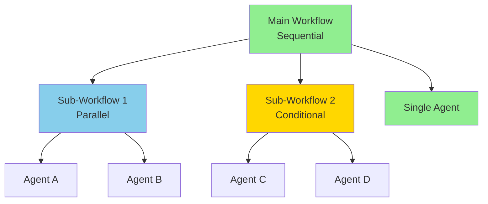
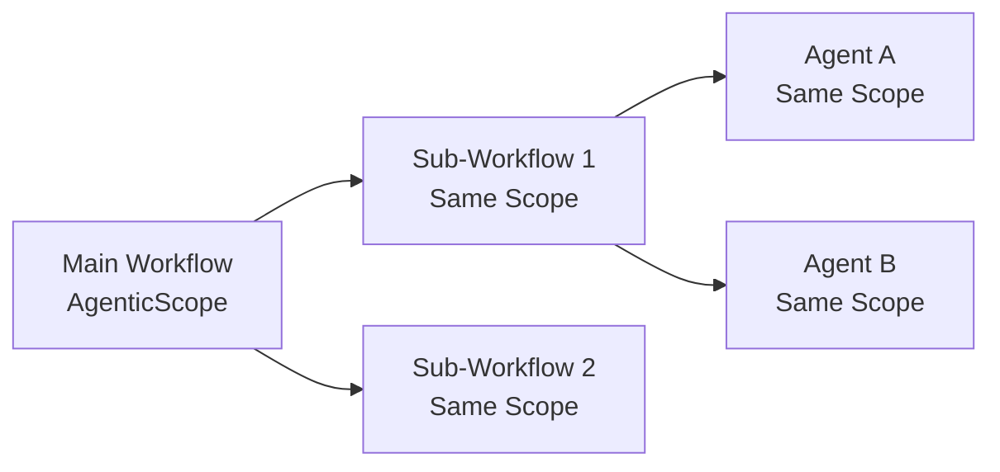
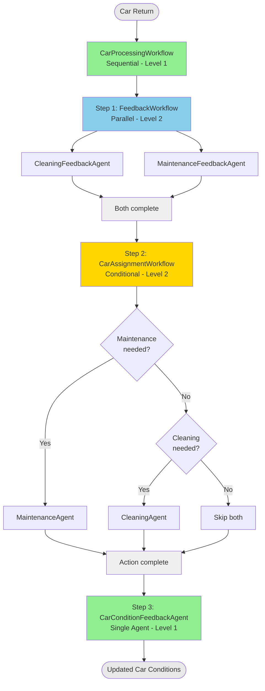
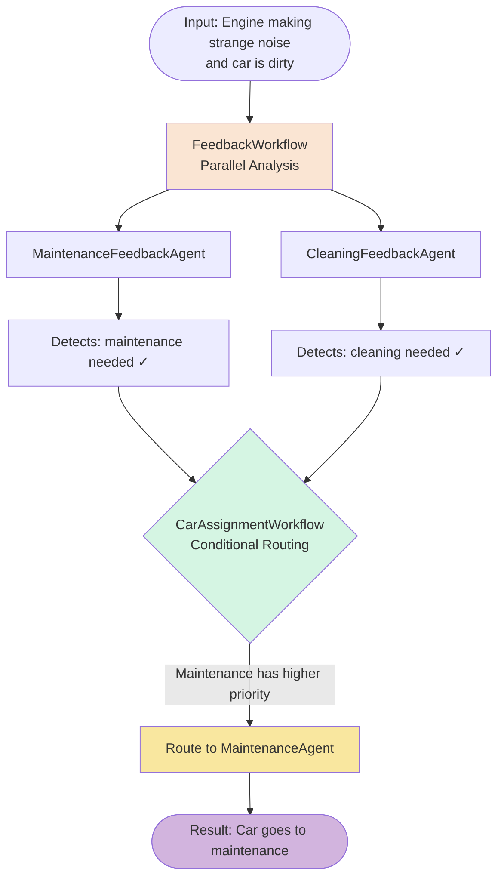
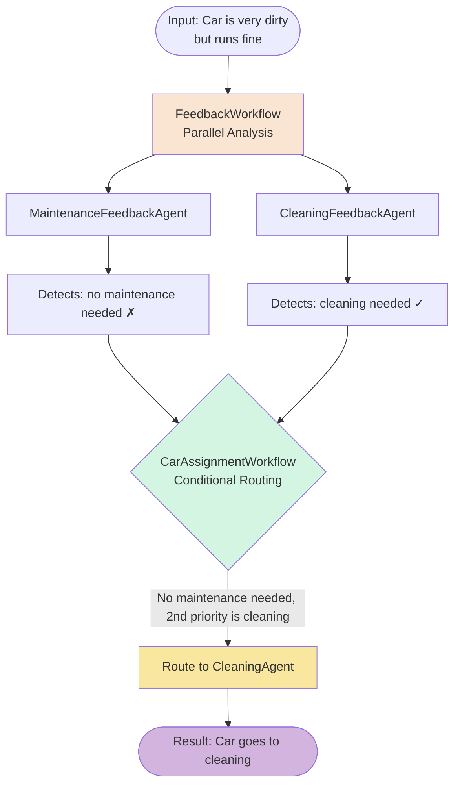
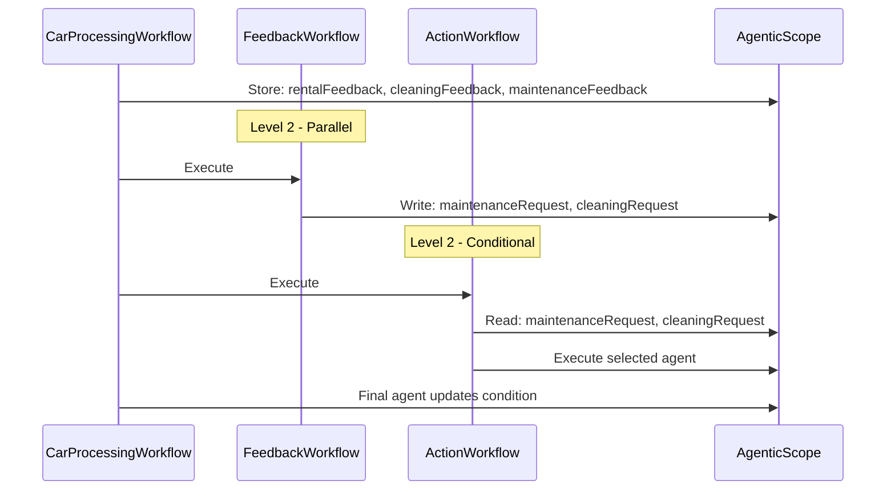

# Step 03 - Composing Multiple Agentic Workflows

## Composing Multiple Agentic Workflows

In the previous step, you created a **sequential workflow** that orchestrated two agents working together:

1. The `CleaningAgent` determined if a car needed cleaning
2. The `CarConditionFeedbackAgent` updated the car's condition based on feedback

A single sequential pattern works well you just need agents to run one after another.
However, real-world scenarios often require more sophisticated orchestration patterns.

In this step, you'll learn how to **compose workflows by nesting them within other workflows** to build complex
agentic systems, by creating multi-level orchestration patterns that combine mixed pattern executions.

---

## New Requirement from Miles of Smiles Management: Comprehensive Car Management

The Miles of Smiles management team wants a more sophisticated car management system.
When cars are returned, they want the system to automatically:

1. **Analyze feedback** for both cleaning needs AND maintenance requirements **simultaneously**
2. **Route cars** appropriately to maintenance if needed, otherwise to cleaning if needed
3. **Track all feedback sources** from rentals, cleaning, and maintenance teams
4. **Update car conditions** based on all collected feedback

These new features require more advanced orchestration between agents to route requests appropriately.

---

## What You'll Learn

In this step, you will:

- Understand how to **nest workflows within workflows** to create sophisticated multi-level orchestration
- Explore additional types of workflow patterns such as **parallel** and **conditional**
- See how `AgenticScope` flows through nested workflow levels

---

## Composing Agentic Workflows

Let's start with a bit of theory. In [Step 02](step-02.md){target="_blank"}, you learned about the four fundamental workflow patterns: sequential, parallel, conditional, and loop. Now we'll explore how to **compose these patterns** by nesting workflows within other workflows.

### What is Agentic Workflow Nesting?

Workflow nesting means using a workflow as a sub-agent within another workflow. This allows you to:

- **Combine patterns**: Use parallel execution within a sequential flow
- **Organize complexity**: Break down complex orchestration into manageable pieces
- **Reuse workflows**: Use the same sub-workflow in multiple places
- **Create hierarchies**: Build multi-level agent systems

### Example: Nested Agentic Workflow Architecture



This creates a **three-level nested workflow** where:

- The main sequential workflow coordinates the overall flow
- Sub-workflows handle specific orchestration patterns (parallel, conditional)
- Individual agents perform specific tasks

### How AgenticScope Works with Nesting

When workflows are nested, the `AgenticScope` flows through all levels:



**Key points:**

- All nested workflows and agents share the **same `AgenticScope` instance**
- Data written by any agent is available to all subsequent agents
- The scope maintains state throughout the entire execution hierarchy

---

## What is Being Added?

Now that we have that bit of theory under out belt, we can continue to transform our car management system.
We're going to implement:

- **3 feedback sources**: collect *human* feedback not only from the car rental returns team, but also from the cleaning team, and from the maintenance team
- **Parallel analysis**: do concurrent evaluation for both cleaning and maintenance needs
- **Conditional routing**: implement intelligent decision-making about where to send each car
- **Update the system**: add additional Tools the agents can call to update the car conditions in the database based on all feedback

### The Complete Solution Architecture

The final system uses a 3-level nested workflow, similar to what we saw above in the theoretical part:



**The Flow:**

1. **FeedbackWorkflow** (Parallel): Analyzes feedback simultaneously from two perspectives:
    - Does the car need maintenance?
    - Does the car need cleaning?

2. **CarAssignmentWorkflow** (Conditional): Routes the car based on the analysis:
    - If maintenance needed, then send to maintenance team
    - Else if cleaning needed, then send to cleaning
    - Else: do nothing

3. **CarConditionFeedbackAgent** (Single): Updates the car's condition based on all feedback

---

### Key Implementation Details

### How Each Level Works

#### Level 1: Main Sequential Workflow

The `CarProcessingWorkflow` orchestrates the entire process sequentially:

```java title="CarProcessingWorkflow.java" hl_lines="1-3"
--8<-- "../../section-2/step-03/src/main/java/com/carmanagement/agentic/workflow/CarProcessingWorkflow.java:sequence-agent"
```

Notice that `subAgents` contains **two workflows** and one agent. Workflows are first-class citizens that can be nested just like agents.

#### Level 2a: Parallel Feedback Workflow

The `FeedbackWorkflow` runs multiple agents **simultaneously**:

```java title="FeedbackWorkflow.java" hl_lines="1-2"
--8<-- "../../section-2/step-03/src/main/java/com/carmanagement/agentic/workflow/FeedbackWorkflow.java:parallel-agent"
```

The agents analyze different aspects (cleaning vs. maintenance) and don't depend on each other, so running them concurrently improves performance.

#### Level 2b: Conditional Action Workflow

The `CarAssignmentWorkflow` uses **activation conditions** to intelligently route cars to the appropriate team based on the analysis it has done:

```java title="CarAssignmentWorkflow.java" hl_lines="1 12 17 22"
--8<-- "../../section-2/step-03/src/main/java/com/carmanagement/agentic/workflow/CarAssignmentWorkflow.java:conditional-agent"
```

- If `assignToMaintenance()` returns `true` → MaintenanceAgent runs, CleaningAgent skipped
- Else if `assignToCleaning()` returns `true` → CleaningAgent runs
- Else → Both skipped

This implements **priority routing**: maintenance takes precedence over cleaning.

---

## Try the Complete Solution

Now that you understand the architecture, let's see it in action!

### Start the Application

1. Navigate to the complete solution directory:

```bash
cd section-2/step-03
./mvnw quarkus:dev
```

2. Open [http://localhost:8080](http://localhost:8080){target="_blank"}

### Test Different Scenarios

Try these scenarios to see how the nested workflows route cars:

#### Scenario 1: Maintenance Priority

Enter the following text in the feedback field for the Honda Civic:

```text
Engine making strange noise and car is dirty
```

**What happens:**



#### Scenario 2: Cleaning Only

Enter the following text in the Mercedes Benz feedback field:

```text
Car is very dirty but runs fine
```

**What happens:**



#### Scenario 3: Maintenance Return

Now use the "Maintenance Return" tab and enter in the For F-150 field:

```text
Fixed the brakes, car could use a wash now
```

**What happens:**

- FeedbackWorkflow: Analyzes maintenance feedback
- CarAssignmentWorkflow: Routes to CleaningAgent
- Result: Car goes to cleaning after maintenance

### Check the Logs

Watch the console output to see the workflow execution:

```bash
FeedbackWorkflow executing...
  ├─ CleaningFeedbackAgent analyzing...
  └─ MaintenanceFeedbackAgent analyzing...
CarAssignmentWorkflow evaluating conditions...
  └─ MaintenanceAgent activated
CarConditionFeedbackAgent updating...
```

Notice how the parallel agents execute simultaneously, then the conditional workflow makes routing decisions!

---

## Why Nested Workflows Matter

### Separation of Concerns

Each workflow has a single responsibility:

- **FeedbackWorkflow**: Analyze all feedback sources
- **CarAssignmentWorkflow**: Route cars to appropriate teams
- **CarProcessingWorkflow**: Orchestrate the complete process

This makes the system easier to understand, test, and modify.

### Reusability

Workflows are **reusable components**. For example, you could use `FeedbackWorkflow` in other contexts:

```java
// Use in a different workflow
@SequenceAgent(subAgents = {
    FeedbackWorkflow.class,  // Reuse the same workflow!
    SomeOtherAgent.class
})
public interface DifferentWorkflow extends Workflow { }
```

### Type Safety

The entire nested structure is **type-checked at compile time**:

```java
// This won't compile if the workflow structure is invalid
CarProcessingWorkflow workflow = AiServices.create(
    CarProcessingWorkflow.class,
    chatLanguageModel
);
```

### AgenticScope Across Levels

The `AgenticScope` flows through all levels of nesting:



All agents and workflows share the same scope, enabling seamless data flow across levels.

---

## Optional: Implement It Yourself

If you want hands-on practice implementing these patterns, you can build the solution step-by-step.
Be warned though, there are quite a few changes to make,
so if you're short on time and would like to learn about the next concepts, feel free to skip to the next step.
As a middle-of-the-road solution, you can also read on and walk through the implementation steps in the source code of section-2/step-03.

### What You'll Build

Starting from your current code in `section-2/step-02`, you'll add:

1. **Feedback Analysis Agents** (MaintenanceFeedbackAgent, CleaningFeedbackAgent)
2. **Parallel Feedback Workflow** to run them concurrently
3. **Action Agents** (MaintenanceAgent, updated CleaningAgent)
4. **Conditional Action Workflow** for intelligent routing
5. **Nested Main Workflow** that orchestrates everything
6. **Supporting Infrastructure** (tools, models, service updates)

**Time:** 60-90 minutes (20-30 minutes if you're working directly from step-03)

### Prerequisites

Before starting:

- Completed [Step 02](step-02.md){target="_blank"} (or have the `section-2/step-02` code available)
- Application from Step 02 is stopped (Ctrl+C)

=== "Option 1: Continue from Step 02"

    If you want to continue building on your Step 02 code, you'll need to copy the updated UI files from `step-03`:

    === "Linux / macOS"
        ```bash
        cp ../step-03/src/main/resources/META-INF/resources/css/styles.css ./src/main/resources/META-INF/resources/css/styles.css
        cp ../step-03/src/main/resources/META-INF/resources/js/app.js ./src/main/resources/META-INF/resources/js/app.js
        cp ../step-03/src/main/resources/META-INF/resources/index.html ./src/main/resources/META-INF/resources/index.html
        cp ../step-03/src/main/resources/import.sql ./src/main/resources/import.sql
        cp ../step-03/src/main/java/com/carmanagement/model/CarStatus.java ./src/main/java/com/carmanagement/model/CarStatus.java
        ```

    === "Windows"
        ```cmd
        copy ..\step-03\src\main\resources\META-INF\resources\css\styles.css .\src\main\resources\META-INF\resources\css\styles.css
        copy ..\step-03\src\main\resources\META-INF\resources\js\app.js .\src\main\resources\META-INF\resources\js\app.js
        copy ..\step-03\src\main\resources\META-INF\resources\index.html .\src\main\resources\META-INF\resources\index.html
        copy ..\step-03\src\main\resources\import.sql .\src\main\resources\import.sql
        copy ..\step-03\src\main\java\com\carmanagement\service\CarService.java .\src\main\java\com\carmanagement\service\CarService.java
        copy ..\step-03\src\main\java\com\carmanagement\model\CarStatus.java .\src\main\java\com\carmanagement\model\CarStatus.java
        ```

=== "Option 2: Start Fresh from Step 03 [Recommended]"

    If you prefer to start with the complete Step 03 code, and walk through the code instead of implementing everything yourself:

    ```bash
    cd section-2/step-03
    ```

### Create Feedback Analysis Agents

#### MaintenanceFeedbackAgent

Create `src/main/java/com/carmanagement/agentic/agents/MaintenanceFeedbackAgent.java`:

```java title="MaintenanceFeedbackAgent.java" hl_lines="10 12-21 30-32 35"
--8<-- "../../section-2/step-03/src/main/java/com/carmanagement/agentic/agents/MaintenanceFeedbackAgent.java"
```

**Key Points:**

- Focuses on mechanical issues and maintenance needs
- Returns "MAINTENANCE_NOT_REQUIRED" for easy conditional checking
- Uses `outputKey` to store result in AgenticScope

#### CleaningFeedbackAgent

Create `src/main/java/com/carmanagement/agentic/agents/CleaningFeedbackAgent.java`:

```java title="CleaningFeedbackAgent.java" hl_lines="17 33"
--8<-- "../../section-2/step-03/src/main/java/com/carmanagement/agentic/agents/CleaningFeedbackAgent.java"
```

**Key Points:**

- Focuses on cleanliness issues
- Returns "CLEANING_NOT_REQUIRED" when no cleaning needed
- Stores result in AgenticScope for later use

### Create the Parallel Feedback Workflow

Create `src/main/java/com/carmanagement/agentic/workflow/FeedbackWorkflow.java`:

```java title="FeedbackWorkflow.java" hl_lines="15-16"
--8<-- "../../section-2/step-03/src/main/java/com/carmanagement/agentic/workflow/FeedbackWorkflow.java"
```

**Key Points:**

- `@ParallelAgent` makes both agents execute simultaneously
- Both agents can read from and write to the shared `AgenticScope`
- Results are available to subsequent workflow steps

### Create Car Specialist Agents

These agents will examine the analysis results and determine what should happen to the car based on their specialty (either maintenance or cleaning)

#### MaintenanceAgent

Create `src/main/java/com/carmanagement/agentic/agents/MaintenanceAgent.java`:

```java title="MaintenanceAgent.java"
--8<-- "../../section-2/step-03/src/main/java/com/carmanagement/agentic/agents/MaintenanceAgent.java"
```

#### Update CleaningAgent

Update `src/main/java/com/carmanagement/agentic/agents/CleaningAgent.java`:

```java title="CleaningAgent.java"
--8<-- "../../section-2/step-03/src/main/java/com/carmanagement/agentic/agents/CleaningAgent.java"
```

### Create the Conditional Car Assignment Workflow

Create `src/main/java/com/carmanagement/agentic/workflow/CarAssignmentWorkflow.java`:

```java title="CarAssignmentWorkflow.java" hl_lines="16-17 27 32"
--8<-- "../../section-2/step-03/src/main/java/com/carmanagement/agentic/workflow/CarAssignmentWorkflow.java"
```

**Key Points:**

- `@ConditionalAgent` evaluates conditions to determine which agent runs
- `@ActivationCondition` methods return `true` to activate an agent
- Maintenance has priority (checked first)
- Cleaning only runs if maintenance is not needed

### Update CarConditionFeedbackAgent

Update `src/main/java/com/carmanagement/agentic/agents/CarConditionFeedbackAgent.java` to add the new maintenance recommendations:

```java title="CarConditionFeedbackAgent.java" hl_lines="27 38"
--8<-- "../../section-2/step-03/src/main/java/com/carmanagement/agentic/agents/CarConditionFeedbackAgent.java"
```

### Create Supporting Infrastructure

#### Create a Maintenance Tool for function calling

Create `src/main/java/com/carmanagement/agentic/tools/MaintenanceTool.java` to add a function for creating a request to the maintenance team:

```java title="MaintenanceTool.java"
--8<-- "../../section-2/step-03/src/main/java/com/carmanagement/agentic/tools/MaintenanceTool.java"
```

#### Create CarAssignment Model

Create `src/main/java/com/carmanagement/model/CarAssignment.java`:

```java title="CarAssignment.java"
--8<-- "../../section-2/step-03/src/main/java/com/carmanagement/model/CarAssignment.java"
```

#### Update CarConditions Model

Update `src/main/java/com/carmanagement/model/CarConditions.java`:

```java title="CarConditions.java"
--8<-- "../../section-2/step-03/src/main/java/com/carmanagement/model/CarConditions.java"
```

#### Update the main Car Processing Workflow

Now it's finally time to compose the sub workflows in the main Car Processing workflow!
We need to replace the direct call to the CleaningAgent with the FeedbackWorkflow that will analyze the feedback from the intake,
and then the CarAssignmentWorkflow to actually assign the car to the appropriate team based on the analysis.

We'll also update the outputKey and the output method to make sure the assignment happens with the right priority.

Update `src/main/java/com/carmanagement/agentic/workflow/CarProcessingWorkflow.java`:

```java title="CarProcessingWorkflow.java" hl_lines="17-18 27 30-41 43-45"
--8<-- "../../section-2/step-03/src/main/java/com/carmanagement/agentic/workflow/CarProcessingWorkflow.java"
```

**Key Points:**

- `@SequenceAgent` runs the workflows and agents in order
- Sub-agents can be **other workflows** (FeedbackWorkflow, CarAssignmentWorkflow)
- All agents share the same `AgenticScope`
- The `@Output` method retrieves the maintenanceRequest and cleaningRequest from the AgenticScope
to determine what needs to happen next, and then returns this result.

#### Update the Service Layer

And finally, we'll update the Car Management service to handle the result from the Agentic AI workflow and update the system accordingly.
Update `src/main/java/com/carmanagement/service/CarManagementService.java`:

```java title="CarManagementService.java"
--8<-- "../../section-2/step-03/src/main/java/com/carmanagement/service/CarManagementService.java"
```

### Test Your Implementation

Once you've implemented all the parts:

1. Start your application:
```bash
./mvnw quarkus:dev
```

2. Open [http://localhost:8080](http://localhost:8080){target="_blank"}

3. Test with the scenarios described earlier

4. Compare your implementation with the complete solution in `section-2/step-03`

---

## Experiment Further

### 1. Add Priority Levels

What if you wanted to add a third level of priority (e.g., emergency repairs)?

- Add an `EmergencyRepairFeedbackAgent`
- Update `CarAssignmentWorkflow` with a third condition
- Ensure emergency repairs take highest priority

### 2. Make Feedback Analysis Sequential

Try changing `FeedbackWorkflow` from `@ParallelAgent` to `@SequenceAgent`. How does this affect performance? When might you want sequential analysis?

### 3. Add More Sophisticated Conditions

The `CarAssignmentWorkflow` currently uses simple `isRequired()` checks. Try adding:

- Cost-based conditions (only send to maintenance if estimated cost < $500)
- Time-based conditions (skip cleaning if it was cleaned in last 24 hours)
- Severity-based conditions (emergency repairs vs. routine maintenance)

### 4. Visualize the Workflow

Add logging to each agent and workflow to print when they start and finish. Observe the parallel execution in the logs!

---

## Troubleshooting

??? warning "Parallel agents not executing in parallel"
    Check that your system has multiple CPU cores and that the thread pool is configured properly. In development mode, Quarkus should handle this automatically.

??? warning "Conditional workflow always/never executing certain agents"
    - Verify your `@ActivationCondition` methods are correctly named
    - Check that parameter names match the `outputKey` values exactly
    - Add logging to the condition methods to see what values they're receiving

??? warning "Error: Cannot find symbol 'CarAssignment'"
    Make sure you created both:

    - The `CarAssignment` enum
    - Updated `CarConditions` to use it

??? warning "Agents getting wrong input values"
    Remember that parameter names must match the `outputKey` from previous agents or workflow inputs. Check for typos!

---

## What's Next?

You've built a sophisticated multi-level nested workflow combining sequence, parallel, and conditional execution!

In **Step 04**, you'll learn about **Agent-to-Agent (A2A) communication** — connecting your workflows to remote agents running in separate systems!

[Continue to Step 04 - Using Remote Agents (A2A)](step-04.md)
