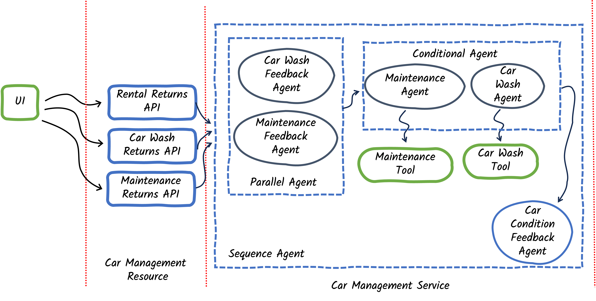

# Step 03 - Building nested agent workflows

## Expanding Requirements

The Miles of Smiles management team has decided to get more serious about car maintenance. When cars are returned, the provided feedback should be analyzed — to see if car cleaning is needed and also to see if car maintenance is needed. If maintenance is needed then the car should be given to the maintenance team. If the car doesn't need maintenance but does need cleaning then it should be given to the car wash team. 

There are a number of things that we now need our car management app to handle:

- Car returns from rentals, the car wash, or the maintenance department
- Analyzing the return feedback to see if a car wash and/or maintenance are required
- Based on the feedback, getting the maintenance department to work on the car
- Based on the feedback, getting the car wash team to clean the car
- Automatically updating the car condition based on the analysis of the feedback

## Nested Workflows

In the previous step, we used a sequence workflow, which ran the car wash agent followed by the car condition feedback agent. In this step, we will build a sequence workflow that contains a parallel workflow, a conditional workflow, and a single agent (see diagram below). 

At each step in the workflow, the agentic framework checks the inputs needed by the next workflow or agent that needs to run. For the root of the workflow (in this case our sequence workflow), parameters are provided by the caller of the workflow interface. In subsequent steps within the workflow, the framework gathers values for input parameters from the `AgenticScope`. The output from each agent or workflow is added to the `AgenticScope` (using the agent's `outputName` setting). The output from a workflow is typically the output of the last agent in the workflow. When building the agent/workflow, you can also specify an output method, which will be run after the response from the agent/workflow is created — this is particularly useful for parallel workflows, to customize what to fill into the corresponding `outputName` for that agent/workflow.

## What are we going to build?

{: .center}

Starting from our app in `step-02`, we need to:

Create/Update agents and workflows:

   - Create a `MaintenanceFeedbackAgent`
   - Create a `CarWashFeedbackAgent`
   - Create a `FeebackWorkflow`
   - Modify the `CarProcessingWorkflow` to add the maintenance feedback
   - Create a `MaintenanceAgent`
   - Modify the `CarWashAgent` to use the output from the car wash feedback agent
   - Create an `ActionWorkflow`
   - Modify the `CarConditionFeedbackAgent` to use the output from the feedback agents

Create the maintenance tool and maintenance returns API:

   - Create a `MaintenanceTool` 
   - Modify `CarManagementResource` to add a maintenance returns API

Define the workflows:

   - Define a parallel workflow, `FeebackWorkflow`, including the `CarWashFeedbackAgent` and `MaintenanceFeedbackAgent`
   - Define a conditional workflow, `ActionWorkflow`, including the `CarWashAgent` and `MaintenanceAgent`
   - Modify the sequence workflow, to include the feedback workflow, the action workflow and the car condition feedback agent


## Before You Begin
    
If you are continuing to build the app in the `step-01` directory, start by copying some files (which don't relate to the experience of building agentic AI apps) from `step-03`:

For Linux/macOS:
```bash
cd ./step-01
cp ../step-03/src/main/resources/static/css/styles.css ./src/main/resources/static/css/styles.css
cp ../step-03/src/main/resources/static/js/app.js ./src/main/resources/static/js/app.js
cp ../step-03/src/main/resources/templates/index.html ./src/main/resources/templates/index.html
cp ../step-03/src/main/java/com/carmanagement/service/CarService.java ./src/main/java/com/carmanagement/service/CarService.java
cp ../step-03/src/main/java/com/carmanagement/model/CarStatus.java ./src/main/java/com/carmanagement/model/CarStatus.java
```

For Windows:
```batch
cd .\step-01
copy ..\step-03\src\main\resources\static\css\styles.css .\src\main\resources\static\css\styles.css
copy ..\step-03\src\main\resources\static\js\app.js .\src\main\resources\static\js\app.js
copy ..\step-03\src\main\resources\templates\index.html .\src\main\resources\templates\index.html
copy ..\step-03\src\main\java\com\carmanagement\service\CarService.java .\src\main\java\com\carmanagement\service\CarService.java
copy ..\step-03\src\main\java\com\carmanagement\model\CarStatus.java .\src\main\java\com\carmanagement\model\CarStatus.java
```

## Create/Update agents and workflows

### Create a `MaintenanceFeedbackAgent`

Create a `MaintenanceFeedbackAgent` to analyze the feedback from rental returns, car wash returns and maintenance returns. The agent will decide if maintenance is required on the car.

In the system prompt, instruct the agent to include `MAINTENANCE_NOT_REQUIRED` in its response if no maintenance is needed so that we can easily check for that string when we build our conditional agents.

Create the file in your `src/main/java/com/carmanagement/agentic/agents` directory.

```java hl_lines="20" title="MaintenanceFeedbackAgent.java"
--8<-- "../../section-2/step-03/src/main/java/com/carmanagement/agentic/agents/MaintenanceFeedbackAgent.java"
```

### Create a `CarWashFeedbackAgent`

Create a `CarWashFeedbackAgent` to analyze the feedback from rental returns, car wash returns and maintenance returns. The agent will decide if any cleaning is required of the car.

In the system prompt instruct the agent to include `CARWASH_NOT_REQUIRED` in its response if no cleaning is needed so that we can easily check for that string when we build our conditional agents.

Create the file in your `src/main/java/com/carmanagement/agentic/agents` directory.

```java hl_lines="19" title="CarWashFeedbackAgent.java"
--8<-- "../../section-2/step-03/src/main/java/com/carmanagement/agentic/agents/CarWashFeedbackAgent.java"
```

### Create a `FeedbackWorkflow`

We need to analyze feedback from car returns both from the perspective of car cleanliness and needed repairs/maintenance. Since those are independent considerations we can do those analyses in parallel (to improve responsiveness of the overall workflow).

Create a `FeedbackWorkflow` which we will use for our parallel workflow.

Create the file in your `src/main/java/com/carmanagement/agentic/workflow` directory.

```java title="FeedbackWorkflow.java"
--8<-- "../../section-2/step-03/src/main/java/com/carmanagement/agentic/workflow/FeedbackWorkflow.java"
```

### Modify the `CarProcessingWorkflow` to add the maintenance feedback

The `CarProcessingWorkflow` represents our overall agent system. Modify the `CarProcessingWorkflow` to add the parameter for the feedback related to maintenance:

```java hl_lines="24" title="CarProcessingWorkflow.java"
--8<-- "../../section-2/step-03/src/main/java/com/carmanagement/agentic/workflow/CarProcessingWorkflow.java"
```

### Create a `MaintenanceAgent`

Create a maintenance agent that can use a maintenance tool to request maintenance. The maintenance requests will be created by the `MaintenanceFeedbackAgent`. The `MaintenanceFeedbackAgent` uses an `outputName` of `maintenanceRequest`.

Create the file in your `src/main/java/com/carmanagement/agentic/agents` directory.

```java hl_lines="26-27 35" title="MaintenanceAgent.java"
--8<-- "../../section-2/step-03/src/main/java/com/carmanagement/agentic/agents/MaintenanceAgent.java"
```

### Modify the `CarWashAgent` to use the output from the car wash feedback agent

We need to modify the `CarWashAgent` to rely on requests created by the `CarWashFeedbackAgent`. The `CarWashFeedbackAgent`, uses an `outputName` of `carWashRequest`. Modify the `CarWashAgent` to use the `carWashRequest` as its input.

Update the file in your `src/main/java/com/carmanagement/agentic/agents` directory.

```java hl_lines="27-28 36" title="CarWashAgent.java"
--8<-- "../../section-2/step-03/src/main/java/com/carmanagement/agentic/agents/CarWashAgent.java"
```

### Create an `ActionWorkflow`

In cases where the feedback agents indicate car maintenance is required, we want to invoke the maintenance agent (to request maintenance). In cases where no maintenance is required, but a car wash is required, we want to invoke the car wash agent (to request a car wash). If the feedback indicates neither is required then we should act accordingly. For this, we will need a conditional workflow.

Create an `ActionWorkflow` which we will use for our conditional workflow, using the `carWashRequest` and `maintenanceRequest` as inputs.

Create the file in your `src/main/java/com/carmanagement/agentic/workflow` directory.

```java hl_lines="21-22" title="ActionWorkflow.java"
--8<-- "../../section-2/step-03/src/main/java/com/carmanagement/agentic/workflow/ActionWorkflow.java"
```

### Modify the `CarConditionFeedbackAgent` to use the output from the feedback agents

Similarly to the `CarWashAgent` and `MaintenanceAgent`, we will have the `CarConditionFeedbackAgent` rely on the output from the feedback agents rather than interpreting the returns feedback directly itself.

Update the file in your `src/main/java/com/carmanagement/agentic/agents` directory.

```java hl_lines="19-20" title="CarConditionFeedbackAgent.java"
--8<-- "../../section-2/step-03/src/main/java/com/carmanagement/agentic/agents/CarConditionFeedbackAgent.java:carConditionFeedbackSnippet"
```

## Create the maintenance tool and maintenance returns API

### Create a `MaintenanceTool`

We need to create a `MaintenanceTool` that can be used by the `MaintenanceAgent` to select maintenance options to open a request for maintenance. The tool should let an agent request a variety of maintenance tasks for the car, such as oil changes, tire rotations, brake service, engine service or transmission service.

Create the file in your `src/main/java/com/carmanagement/agentic/tools` directory.

```java title="MaintenanceTool.java"
--8<-- "../../section-2/step-03/src/main/java/com/carmanagement/agentic/tools/MaintenanceTool.java"
```

### Modify `CarManagementResource` to add a maintenance returns API

We'll modify the `CarManagementResource` to add a maintenance returns API. This will be called by the UI and will be very similar to the car wash returns API.

Update the file in your `src/main/java/com/carmanagement/resource` directory.

```java title="CarManagementResource.java"
--8<-- "../../section-2/step-03/src/main/java/com/carmanagement/resource/CarManagementResource.java:maintenanceReturn"
```

## Define the workflows

We'll need to make a few changes to our `CarManagementService` to define new workflows and update existing workflows:

Update the file in your `src/main/java/com/carmanagement/service` directory.

```java hl_lines="93-97 99-112 114-118 174-192" title="CarManagementService.java"
--8<-- "../../section-2/step-03/src/main/java/com/carmanagement/service/CarManagementService.java"
```

### Define a parallel workflow, `FeedbackWorkflow`, including the `CarWashFeedbackAgent` and `MaintenanceFeedbackAgent`

Notice, in the `CarManagementService` (above), that we've defined the `FeedbackWorkflow` using the agent interface we created earlier. This is a parallel workflow that runs both feedback agents simultaneously to analyze the car's condition from different perspectives.

### Define a conditional workflow, `ActionWorkflow`, including the `CarWashAgent` and `MaintenanceAgent`

Also in the `CarManagementService` (above), notice the definition of the `ActionWorkflow`, which is a conditional workflow including the maintenance agent and the car wash agent as subagents. Conditional workflows are sequence workflows where each agent in the workflow is paired with a condition that must evaluate to true in order for the agent to be called (otherwise the agent is skipped).

The maintenance agent will only execute if the `selectAgent` method indicates maintenance is required. The car wash agent will only execute if the `selectAgent` method indicates a car wash is required. The `selectAgent` method looks at the values of `maintenanceRequest` and `carWashRequest`, in the agentic scope, to make the determination. In this way, we have used conditions to build a kind of router, choosing which of the agents to run for each request.

### Modify the sequence workflow, to include the feedback workflow, the action workflow and the car condition feedback agent

Finally, in the code above, we redefined the `CarProcessingWorkflow` to sequentially run the feedback workflow, the action workflow, and the car condition feedback agent:

Notice that the `CarProcessingWorkflow` is a nested workflow (workflows within workflows).


## Try out the new workflow

In the Returns section of the UI you should now be able to see a Maintenance Return tab in the Returns section. This is where the Miles of Smiles maintenance team will enter their feedback when they are finished working on the car. 

{: .center}

On the Maintenance Return tab, for car 3, enter feedback to indicate the scratch (mentioned in the car condition) has been fixed, but the car needs to be cleaned:

```
buffed out the scratch. car could use a wash now.
```

Once the request completes, you should see that the car's status has been updated in the Fleet Status section.

{: .center}

Take a look at the logs. You should see that the car wash feedback agent and maintenance feedback agent both ran (in parallel, which may be evident from when the responses from those agents were logged). You should then see the car wash agent and car wash tool responses in the log (since there was no need for maintenance, but a car wash was needed). Finally, you should see the response from the car condition feedback agent.
