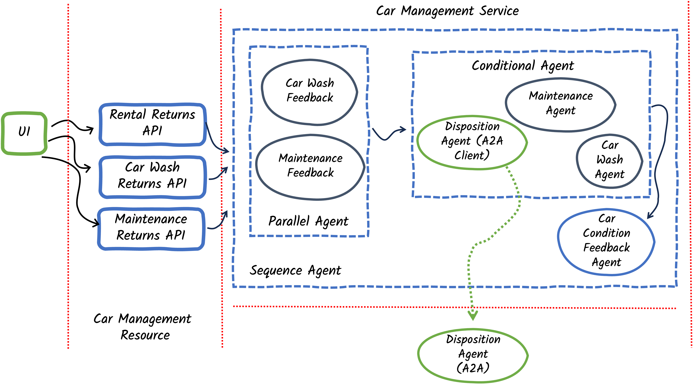
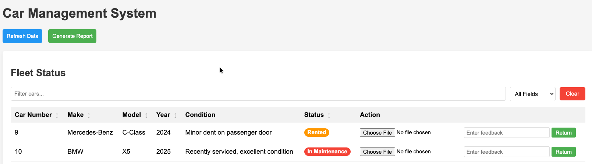

# Step 04 - Using remote agents (A2A)

## Time to get rid of some cars!

The Miles of Smiles team has decided they need to get rid of cars that are no longer in good enough shape to rent out. When car return feedback warrants disposing of a car, they want to send the car to a car broker who will then sell, donate, or scrap it. The Miles of Smiles team will still make the determination of which cars to get rid of, and the car broker will take action on their request. The car broker has their own agent that handles car dispositions.

## Agent2Agent (A2A)

The Agent2Agent protocol can be used to enable agents to communicate to each other remotely. 

LangChain4j provides the `langchain4j-agentic-a2a` module, which can be used with `langchain4j-agentic` to add remote agents to a workflow in the same way as you have been adding local agents. We will declare an A2A agent in our existing app that we will then add to our workflow. Communicating with this local agent will make a2a send the agent request to the remotely connected agent.

You will see how the A2A sdk handles the protocol in our remote A2A server built on Quarkus. As part of the protocol, agents defined in the server must provide an `AgentCard` which describes:

- The name and description of the agent
- The agent's capabilities (the parts of the A2A protocol it supports)
- The agent's skills (what the agent's purpose is)
- etc.

A2A Agents must also implement an `AgentExecutor`. The A2A sdk calls the `AgentExecutor.execute` method when it wants to invoke your agent. Your implementation of the `AgentExecutor` interface is responsible for calling your agent (for example your LangChain4j AI service or Agent). The `AgentExecutor.execute` method has the following signature:

```java
public void execute(RequestContext context, EventQueue eventQueue)
```

The execute method is invoked when a task or message needs to be handled.

**Tasks** have unique IDs, have a state (submitted, working, input-required, auth-required, completed, canceled, failed, rejected or unknown), and can be referenced across requests to the A2A agent. As such, tasks are created for tracking ongoing work on a specific topic (eg. a hotel booking) that may not complete within a few seconds.

**Messages** have unique IDs but no tracked state. They are good for short requests that do not require more context information than can be found in the recent message history.

We will create a `DispositionAgent` to handle getting rid of cars, where each disposition of a car is a task.

## What are we going to build?

{: .center}

Our architecture includes 2 Quarkus runtimes -- one running our agentic workflow (Quarkus runtime 1) and the other running the remote A2A agent (Quarkus runtime 2). 

## Quarkus Runtime 1
Starting from our app in `step-03`, we need to do the following for the original Quarkus Runtime 1:

Create/Update agent and workflow declarations:

  - Create a new `DispositionFeedbackAgent`
  - Create a new `DispositionAgent` (for the client side)
  - Modify the `ActionWorkflow` to use output from the `DispositionFeedbackAgent`
  - Modify the `CarConditionFeedbackAgent` to use output from the `DispositionFeedbackAgent`

Define the agents and workflows:

  - Define the `DispositionFeedbackAgent`
  - Define the `DispositionAgent`
  - Include the `DispositionFeedbackAgent` in the parallel workflow
  - Include the `DispositionAgent` in the conditional workflow


## Before you begin

If you are continuing to build the app in the `step-01` directory, start by copying some files (which don't relate to the experience of building agentic AI apps) from `step-04`. Run the following commands from your `section-2` directory:

For Linux/macOS:
```bash
mv step-01 multi-agent-system
mkdir step-01
mv multi-agent-system step-01
cd step-01/multi-agent-system
cp ../../step-04/multi-agent-system/pom.xml ./pom.xml
cp ../../step-04/multi-agent-system/src/main/java/com/carmanagement/model/CarInfo.java ./src/main/java/com/carmanagement/model/CarInfo.java
cp ../../step-04/multi-agent-system/src/main/java/com/carmanagement/model/CarStatus.java ./src/main/java/com/carmanagement/model/CarStatus.java
cp ../../step-04/multi-agent-system/src/main/java/com/carmanagement/service/CarService.java ./src/main/java/com/carmanagement/service/CarService.java
cp ../../step-04/multi-agent-system/src/main/resources/static/css/styles.css ./src/main/resources/static/css/styles.css
cp ../../step-04/multi-agent-system/src/main/resources/static/js/app.js ./src/main/resources/static/js/app.js
cp ../../step-04/multi-agent-system/src/main/resources/templates/index.html ./src/main/resources/templates/index.html
```

For Windows:
```batch
move step-01 multi-agent-system
mkdir step-01
move multi-agent-system step-01
cd step-01\multi-agent-system
copy ..\..\step-04\multi-agent-system\pom.xml pom.xml
copy ..\..\step-04\multi-agent-system\src\main\java\com\carmanagement\model\CarInfo.java src\main\java\com\carmanagement\model\CarInfo.java
copy ..\..\step-04\multi-agent-system\src\main\java\com\carmanagement\model\CarStatus.java src\main\java\com\carmanagement\model\CarStatus.java
copy ..\..\step-04\multi-agent-system\src\main\java\com\carmanagement\service\CarService.java src\main\java\com\carmanagement\service\CarService.java
copy ..\..\step-04\multi-agent-system\src\main\resources\static\css\styles.css src\main\resources\static\css\styles.css
copy ..\..\step-04\multi-agent-system\src\main\resources\static\js\app.js src\main\resources\static\js\app.js
copy ..\..\step-04\multi-agent-system\src\main\resources\templates\index.html src\main\resources\templates\index.html
```

## Create/Update agent and workflow declarations:

### Create a new `DispositionFeedbackAgent`

Create a `DispositionFeedbackAgent` to analyze the feedback from rental returns, car wash returns and maintenance returns. The agent will decide if we need to get rid of the car.

In the system prompt, instruct the agent to include `DISPOSITION_NOT_REQUIRED` in its response if the car is in decent shape so that we can easily check for that string when we build our conditional agents.

Create the file in your `src/main/java/com/carmanagement/agentic/agents` directory.

```java hl_lines="17" title="DispositionFeedbackAgent.java"
--8<-- "../../section-2/step-04/multi-agent-system/src/main/java/com/carmanagement/agentic/agents/DispositionFeedbackAgent.java"
```

### Create a new `DispositionAgent` (for the client side)

For the disposition agent, in Quarkus runtime 1 we need to create an agent to be used as a type-safe interface for us to invoke the remote A2A agent. This agent will not need to interact with LLMS, so it shouldn't have system message or user message annotations. The parameters we define on the agent method define what will be sent to the remote agent.

Create the file in your `src/main/java/com/carmanagement/agentic/agents` directory.

```java title="DispositionAgent.java"
--8<-- "../../section-2/step-04/multi-agent-system/src/main/java/com/carmanagement/agentic/agents/DispositionAgent.java"
```

### Modify the `ActionWorkflow` to use output from the `DispositionFeedbackAgent`

We need to extend our ActionWorkflow to accept the disposition feedback agent's output. The `DispositionFeedbackAgent` uses an `outputName` of `dispositionRequest`.

Update the file in your `src/main/java/com/carmanagement/agentic/workflow` directory.

```java hl_lines="10" title="ActionWorkflow.java"
--8<-- "../../section-2/step-04/multi-agent-system/src/main/java/com/carmanagement/agentic/workflow/ActionWorkflow.java:actionWorkflow"
```

### Modify the `CarConditionFeedbackAgent` to use output from the `DispositionFeedbackAgent`

Similarly, we need to modify the `CarConditionFeedbackAgent` to use the output from the `DispositionFeedbackAgent`.

Update the file in your `src/main/java/com/carmanagement/agentic/agents` directory.

```java hl_lines="11 20" title="CarConditionFeedbackAgent.java"
--8<-- "../../section-2/step-04/multi-agent-system/src/main/java/com/carmanagement/agentic/agents/CarConditionFeedbackAgent.java:carConditionFeedback"
```

## Define the agents and workflows:

We need to make a few changes to our `CarManagementService` to define agents and workflows:

Update the file in your `src/main/java/com/carmanagement/service` directory.

```java hl_lines="75-78 86-90 108 114-118 197-200" title="CarManagementService.java"
--8<-- "../../section-2/step-04/multi-agent-system/src/main/java/com/carmanagement/service/CarManagementService.java"
```

### Define the `DispositionFeedbackAgent`

Notice the definition of the `DispositionFeedbackAgent` in the `CarManagementService` code above.

### Define the `DispositionAgent`

We use the `a2aBuilder` method, in the `CarManagementService` code above, to create an A2A agent client out of the `DispositionAgent` interface. Notice that we specify the URL of the remote A2A agent as part of the `a2aBuilder` method.

### Include the `DispositionFeedbackAgent` in the parallel workflow

We added the disposition feedback agent to the `FeedbackWorkflow` in the `CarManagementService` code above. This will make the disposition agent run in parallel along with the other 2 feedback agents.

### Include the `DispositionAgent` in the conditional workflow

We added the disposition agent to the `ActionWorkflow` in the `CarManagementService` code above. 

The disposition agent will only be run if the `selectAgent` method indicates disposition is required. Notice corresponding changes in the `selectAgent` method, which ensure that disposition requests are given higher priority than maintenance or car wash requests.

## Quarkus Runtime 2

Starting from our app in step-03, we need to do the following for Quarkus Runtime 2 (the Remote A2A Agent)

- Create a new Quarkus project for the remote A2A agent
- Create a new `DispositionAgent`
- Create a new `DispositionTool`
- Create a new `DispositionAgentCard`
- Create a new `DispositionAgentExecutor`

## Before you begin

Run the following commands, from your `section-2` directory, to get your second Quarkus project set up with some initial files.

For Linux/macOS:
```bash
cd ./step-01
mkdir remote-a2a-agent
cd remote-a2a-agent
cp ../../step-04/remote-a2a-agent/mvnw.cmd ./mvnw.cmd
cp ../../step-04/remote-a2a-agent/pom.xml ./pom.xml
cp ../../step-04/remote-a2a-agent/mvnw ./mvnw
mkdir -p ./src/main/resources
mkdir -p ./src/main/java/com/demo
cp ../../step-04/remote-a2a-agent/src/main/resources/application.properties ./src/main/resources/application.properties
```

For Windows:
```batch
cd step-01
mkdir remote-a2a-agent
cd remote-a2a-agent
copy ..\..\step-04\remote-a2a-agent\mvnw.cmd mvnw.cmd
copy ..\..\step-04\remote-a2a-agent\pom.xml pom.xml
copy ..\..\step-04\remote-a2a-agent\mvnw mvnw
mkdir src\main\resources
mkdir src\main\java\com\demo
copy ..\..\step-04\remote-a2a-agent\src\main\resources\application.properties src\main\resources\application.properties
```

### Create a new Quarkus project for the remote A2A agent

The files you have already copied from `step-04` include the Quarkus project setup. Take a moment to look at the `pom.xml` file, in the `section-2/step-04/remote-a2a-agent` directory, to see the new dependency added for `langchain4j-agentic-a2a`.

### Create a new `DispositionTool`

Let's create a `DispositionTool` that can be used by the `DispositionAgent` to request disposition of cars. The tool should be able to handle scrapping the car, selling it, or donating it. 

Create the file in your `src/main/java/com/demo` directory.

```java title="DispositionTool.java"
--8<-- "../../section-2/step-04/remote-a2a-agent/src/main/java/com/demo/DispositionTool.java"
```

### Create a new `DispositionAgent`

Here, let's use an AI service (introduced in `section-1`) rather than an agent, since we aren't going to be using the `DispositionAgent` in a workflow.

Create the disposition AI service, providing it a `ToolBox` that contains the `DispositionTool`. This will enable the AI Service to call the `DispositionTool` to request disposition. For ease of parameter passing, let's use the same method signature for this `DispositionAgent` as we did for the client `DispositionAgent`.

Create the file in your `src/main/java/com/demo` directory.

```java title="DispositionAgent.java (remote)"
--8<-- "../../section-2/step-04/remote-a2a-agent/src/main/java/com/demo/DispositionAgent.java"
```

### Create a new `DispositionAgentCard`

The agent card provides:

- A description of the agent
- A URL to invoke the agent with
- A URL for the agent's documentation 
- An indication of the agent's supported A2A capabilities
- Input and output modes
- A description of the skills the agent provides
- An A2A protocol version

This information is provided to clients that connect to the A2A server so that they know when and how to use the agent.

Create the file in your `src/main/java/com/demo` directory.

```java title="DispositionAgentCard.java"
--8<-- "../../section-2/step-04/remote-a2a-agent/src/main/java/com/demo/DispositionAgentCard.java"
```

### Create a new `DispositionAgentExecutor`

In the execute method we need to take action on the task:

- We initialize a `TaskUpdater`, which is responsible for making updates to the Task status and recording events (such as Task status updates or additions of artifacts to the task) in the EventQueue.

- If there is no task currently in the `RequestContext` we put the task into the initial submitted state. If the task already exists, we put it into working state.

- We extract the message parts from the request context. When an A2A agent has multiple parameters, each parameter gets stored as a separate message part.

- We invoke our LangChain4j `DispositionAgent` with the same parameters as were provided to the A2A agent.

- We put the agent's response into an artifact in the `Task` and mark the task complete. This will result in the response being made available to the A2A client agent.

Create the file in your `src/main/java/com/demo` directory.

```java hl_lines="39-43 48-56 59-65 68-71" title="DispositionAgentExecutor.java"
--8<-- "../../section-2/step-04/remote-a2a-agent/src/main/java/com/demo/DispositionAgentExecutor.java"
```


## Try out the new workflow

Ensure both Quarkus runtimes are running. From each of the `multi-agent-system` and `remote-a2a-agent` directories, run the following command (if it is not already running):

```bash
mvn quarkus:dev
```

After reloading the UI, you should see the **Returns** section is now called **Returns and Dispositions**. You'll also notice that there is a new tab to list the cars that are pending disposition.

On the **Maintenance Return** tab, select a car and try entering feedback that would suggest there is something wrong (so that it should be disposed of). For example:

```
looks like this car hit a tree
```

{: .center}

In the logs of Quarkus runtime 2, you should be able to see that the disposition agent called its disposition tool and the tool initiated the disposition of the vehicle.

```
DispositionTool result: Car disposition requested for Ford Mustang (2022), Car #11: Scrap the car
```