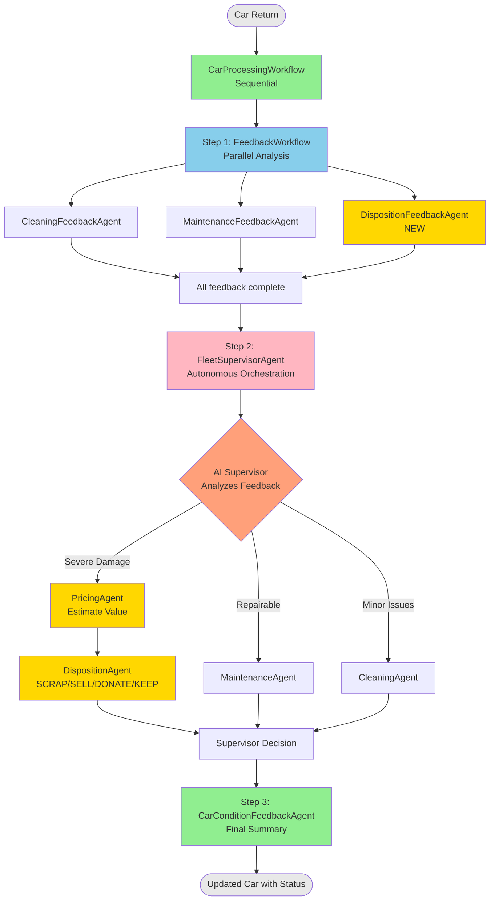
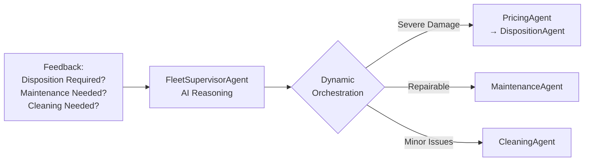

# Step 04 - Supervisor Pattern for Dynamic Orchestration

## Supervisor Pattern for Dynamic Orchestration

In the previous step, you created **nested workflows** that combined sequential, parallel, and conditional patterns to build sophisticated multi-level orchestration.

However, those workflows used **fixed, deterministic routing** - the conditions were hardcoded and predictable. What if you need **dynamic, context-aware orchestration** where an AI agent decides which sub-agents to invoke based on the current situation?

In this step, you'll learn about the **Supervisor Pattern** - a powerful approach where a supervisor agent autonomously orchestrates other agents based on runtime context and business conditions.

---

## New Requirement from Miles of Smiles Management: Intelligent Disposition Decisions

The Miles of Smiles management team has identified a new challenge: they need to make **intelligent decisions about vehicle disposition** when cars return with severe damage.

The system needs to:

1. **Detect severe damage** that might make a car uneconomical to repair
2. **Estimate vehicle value** to inform disposition decisions
3. **Decide disposition strategy** (SCRAP, SELL, DONATE, or KEEP) based on:
   - Car value
   - Age of the vehicle
   - Severity of damage
   - Repair cost estimates
4. **Let an AI supervisor orchestrate** the entire decision-making process

---

## What You'll Learn

In this step, you will:

- Understand the **Supervisor Pattern** and when to use it
- Implement a supervisor agent using `@SupervisorAgent` annotation
- Create specialized agents for **feedback analysis** and **action execution**
- Build a **PricingAgent** to estimate vehicle market values
- Create a **DispositionAgent** to make SCRAP/SELL/DONATE/KEEP decisions
- See how supervisors provide **autonomous, adaptive orchestration**

---

## Understanding the Supervisor Pattern

### What is a Supervisor Agent?

A **supervisor agent** is an AI agent that:

- **Coordinates other agents** (called sub-agents)
- **Makes runtime decisions** about which agents to invoke
- **Adapts to context** using business rules and current conditions
- **Provides autonomous orchestration** without hardcoded logic

### Supervisor vs. Conditional Workflows

| Aspect | Conditional Workflow | Supervisor Agent |
|--------|---------------------|------------------|
| **Decision Logic** | Hardcoded conditions | AI-driven decisions |
| **Flexibility** | Fixed rules | Adapts to context |
| **Complexity** | Simple boolean checks | Complex reasoning |
| **Maintenance** | Update code for changes | Update prompts/context |

### When to Use Supervisors

Use supervisor agents when you need:

- **Context-aware routing**: Decisions based on multiple factors
- **Business rule flexibility**: Easy to adjust without code changes
- **Complex orchestration**: Multiple agents with interdependencies
- **Adaptive behavior**: System that learns and improves

---

## What is Being Added?

We're going to enhance our car management system with:

- **DispositionFeedbackAgent**: Detects severe damage requiring disposition evaluation
- **PricingAgent**: Estimates vehicle market value
- **DispositionAgent**: Decides SCRAP/SELL/DONATE/KEEP based on value and condition
- **FleetSupervisorAgent**: Orchestrates feedback and action agents autonomously
- **Updated workflow**: Two-phase processing (feedback → supervisor → actions)

### The New Architecture



**The Key Innovation:**

The **FleetSupervisorAgent** receives feedback from three parallel agents and then autonomously decides:

- If severe damage detected → invoke PricingAgent → DispositionAgent
- If repairable damage → invoke MaintenanceAgent
- If only cleaning needed → invoke CleaningAgent

---

## Key Implementation Details

### DispositionFeedbackAgent (NEW)

Detects severe damage that requires disposition evaluation:

```java title="DispositionFeedbackAgent.java" hl_lines="12-28 44"
--8<-- "../../section-2/step-04/src/main/java/com/carmanagement/agentic/agents/DispositionFeedbackAgent.java"
```

**Key Points:**

- Analyzes feedback for severe damage keywords ("wrecked", "totaled", "crashed")
- Outputs "DISPOSITION_REQUIRED" or "DISPOSITION_NOT_REQUIRED"
- Runs in parallel with other feedback agents
- Provides early detection of cars that need disposition evaluation

### PricingAgent

Estimates vehicle market value for disposition decisions:

```java title="PricingAgent.java" hl_lines="13-42 50-53"
--8<-- "../../section-2/step-04/src/main/java/com/carmanagement/agentic/agents/PricingAgent.java"
```

**Key Points:**

- Uses detailed pricing guidelines (brand base values, depreciation, condition adjustments)
- Considers make, model, year, and condition
- Returns structured output with value and justification
- Invoked by supervisor when disposition evaluation is needed

### DispositionAgent (NEW)

Makes intelligent disposition decisions:

```java title="DispositionAgent.java" hl_lines="13-30 44"
--8<-- "../../section-2/step-04/src/main/java/com/carmanagement/agentic/agents/DispositionAgent.java"
```

**Key Points:**

- Receives car value from PricingAgent
- Decides: SCRAP, SELL, DONATE, or KEEP
- Considers repair cost vs. value, age, and damage severity
- Provides clear reasoning for the decision

### FleetSupervisorAgent

Orchestrates the entire processing workflow:

```java title="FleetSupervisorAgent.java" hl_lines="12-48 50-60"
--8<-- "../../section-2/step-04/src/main/java/com/carmanagement/agentic/agents/FleetSupervisorAgent.java"
```

**Key Points:**

- `@SupervisorAgent` annotation enables autonomous orchestration
- `subAgents` lists all available action agents (not feedback agents)
- Receives feedback results as input parameters
- Makes intelligent routing decisions based on feedback analysis
- Two-phase approach: supervisor coordinates actions AFTER feedback is complete

### Updated FeedbackWorkflow

Now includes disposition feedback:

```java title="FeedbackWorkflow.java" hl_lines="17"
--8<-- "../../section-2/step-04/src/main/java/com/carmanagement/agentic/workflow/FeedbackWorkflow.java"
```

### Updated CarProcessingWorkflow

Sequential workflow with supervisor:

```java title="CarProcessingWorkflow.java" hl_lines="21 35-60"
--8<-- "../../section-2/step-04/src/main/java/com/carmanagement/agentic/workflow/CarProcessingWorkflow.java"
```

**Changes:**

- FeedbackWorkflow runs first (produces `dispositionRequest`, `maintenanceRequest`, `cleaningRequest`)
- FleetSupervisorAgent receives feedback and orchestrates actions
- Output logic checks `dispositionRequest` first for highest priority routing

---

## Try the Supervisor Pattern

### Start the Application

1. Navigate to the step-04 directory:

```bash
cd section-2/step-04
./mvnw quarkus:dev
```

2. Open [http://localhost:8080](http://localhost:8080){target="_blank"}

### Test Disposition Scenarios

Try these scenarios to see how the supervisor pattern autonomously orchestrates agents:

#### Scenario 1: Severe Damage - Disposition Required

Enter the following text in the feedback field for the **Honda Civic**:

```text
The car was in a serious collision. Front end is completely destroyed and airbags deployed.
```

**What happens:**


**Expected Result:**
- Status: `PENDING_DISPOSITION`
- Condition includes disposition decision (e.g., "SCRAP - severe damage, repair cost exceeds value")
- PricingAgent estimated the car's value
- DispositionAgent made a SCRAP decision based on economics

#### Scenario 2: Total Loss

Enter the following text in the **Toyota Camry** feedback field:

```text
The car is totaled after a major accident, completely inoperable
```

**What happens:**


**Expected Result:**
- Status: `PENDING_DISPOSITION`
- Disposition decision: SCRAP or SELL (beyond economical repair)
- PricingAgent estimated value before total loss
- DispositionAgent determined vehicle is not worth repairing

#### Scenario 3: Repairable Damage

Enter the following text in the **Mercedes Benz** feedback field:

```text
Engine making noise, needs inspection
```

**What happens:**


**Expected Result:**
- Status: `IN_MAINTENANCE`
- Condition describes the maintenance issue
- Supervisor routed to MaintenanceAgent (not disposition)

#### Scenario 4: Minor Issues

Enter the following text in the **Ford F-150** feedback field:

```text
Car is dirty, needs cleaning
```

**What happens:**


**Expected Result:**
- Status: `IN_CLEANING`
- Condition describes cleaning needs
- Supervisor routed to CleaningAgent only

### Observe the Supervisor's Decisions

Watch the console logs to see the two-phase processing:

```bash
Phase 1: FeedbackWorkflow executing (parallel)...
  ├─ CleaningFeedbackAgent analyzing...
  ├─ MaintenanceFeedbackAgent analyzing...
  └─ DispositionFeedbackAgent analyzing...
  
Phase 2: FleetSupervisorAgent orchestrating...
  ├─ Received: DISPOSITION_REQUIRED (severe damage detected)
  ├─ Invoking: PricingAgent (estimating value)...
  ├─ Invoking: DispositionAgent (making decision)...
  └─ Decision: SCRAP - severe damage, repair cost exceeds value
  
Phase 3: CarConditionFeedbackAgent updating...
  └─ Condition: SCRAP - severe damage, low value
```

---

## Why the Supervisor Pattern Matters

### Autonomous Decision-Making

The supervisor uses AI reasoning to make complex decisions:



### Economic Intelligence

The system makes economically sound decisions:

- **Car value < $5,000 + major damage** → SCRAP
- **Repair cost > 50% of value** → SELL or SCRAP
- **Old car (10+ years) + damage** → Disposition evaluation
- **Valuable car + minor damage** → KEEP and repair

### Flexibility Without Code Changes

To adjust behavior, you can:

- **Update prompts**: Change the supervisor's decision criteria
- **Adjust thresholds**: Modify pricing guidelines or disposition rules
- **Add context**: Provide more information (repair history, customer value)

No code changes required!

---

## Comparing Patterns

### Before: Conditional Workflow (Step 03)

```java
@ConditionalAgent(subAgents = {MaintenanceAgent.class, CleaningAgent.class})
String processAction(...);

@ActivationCondition(MaintenanceAgent.class)
static boolean assignToMaintenance(String maintenanceRequest) {
    return isRequired(maintenanceRequest);  // Simple boolean check
}
```

**Limitations:**

- Fixed logic
- Simple conditions
- No disposition handling
- Requires code changes

### After: Supervisor Agent (Step 04)

```java
@SupervisorAgent(
    subAgents = {
        PricingAgent.class,
        DispositionAgent.class,
        MaintenanceAgent.class,
        CleaningAgent.class
    }
)
String superviseCarProcessing(
    String carMake, String carModel, Integer carYear,
    String carCondition, String rentalFeedback,
    String cleaningRequest, String maintenanceRequest,
    String dispositionRequest  // NEW: Disposition feedback
);
```

**Advantages:**

- AI-driven decisions
- Context-aware reasoning
- Handles complex disposition scenarios
- Easy to adjust via prompts
- Economic intelligence built-in

---

## Experiment Further

### 1. Add More Disposition Criteria

Enhance the DispositionAgent to consider:

- Repair history (frequent repairs → disposition)
- Market demand for specific models
- Seasonal factors (convertibles in winter)
- Fleet composition (too many of same model)

### 2. Implement Multi-Tier Pricing

Create different pricing strategies:

- Wholesale value (for SCRAP decisions)
- Retail value (for SELL decisions)
- Donation value (for tax purposes)

### 3. Add Disposition Workflow

Create a separate workflow for cars marked PENDING_DISPOSITION:

- Get multiple price quotes
- Check auction values
- Evaluate donation options
- Final disposition decision

### 4. Test Edge Cases

What happens when:

- Luxury car with severe damage?
- Old car in excellent condition?
- Multiple disposition-worthy issues?
- Repair cost estimate unavailable?

---

## Troubleshooting

??? warning "Supervisor not invoking DispositionAgent"
    - Check that DispositionFeedbackAgent is detecting severe damage keywords
    - Verify "DISPOSITION_REQUIRED" is in the output
    - Review supervisor's system message for disposition routing logic
    - Add logging to see feedback values

??? warning "Cars not getting PENDING_DISPOSITION status"
    - Check the output logic in CarProcessingWorkflow
    - Verify `dispositionRequest` parameter is being passed
    - Ensure `isDisposition()` method checks for correct keywords
    - Check CarManagementService status mapping

??? warning "PricingAgent returning unexpected values"
    - Review the pricing guidelines in the `@SystemMessage`
    - Check that car information (make, model, year) is passed correctly
    - Verify the LLM is following the output format
    - Test with different car makes/models/years

---

## What's Next?

You've implemented the **Supervisor Pattern** for autonomous, context-aware orchestration with intelligent disposition decisions!

The supervisor agent can now:

- Detect severe damage requiring disposition
- Estimate vehicle value
- Make economically sound SCRAP/SELL/DONATE/KEEP decisions
- Route to appropriate action agents based on feedback

In **Step 05**, you'll learn about **Agent-to-Agent (A2A) communication** — connecting your workflows to remote agents running in separate systems, including converting the DispositionAgent to a remote service!

[Continue to Step 05 - Using Remote Agents (A2A)](step-05.md)
