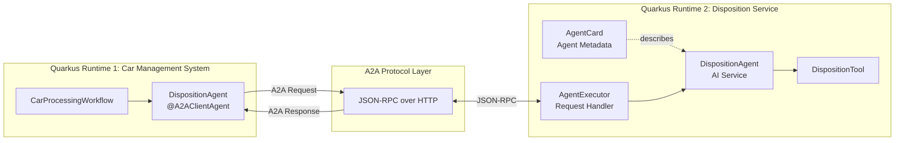
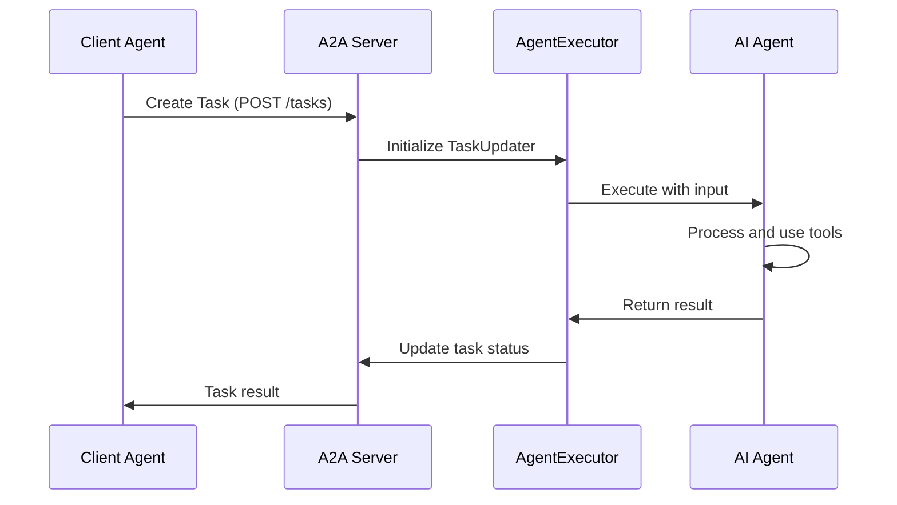
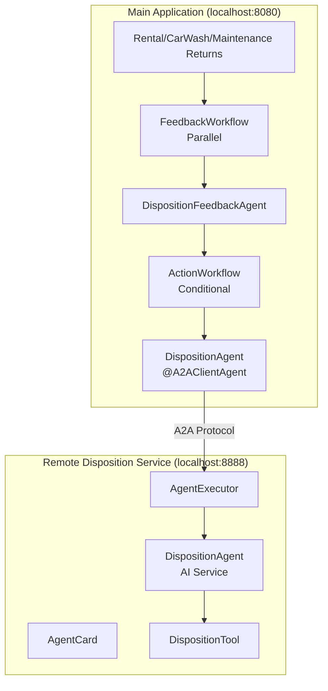
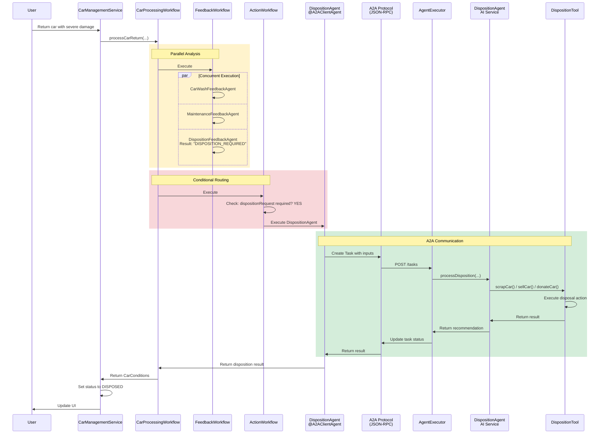

# Step 04 - Using Remote Agents (A2A)

## New Requirement: Car Disposal Decisions

The Miles of Smiles management team has yet another new challenge: they need to decide what to do with cars that are beyond economical repair.

When cars are returned with severe damage or major mechanical issues, the company needs to:

1. **Analyze if disposal is needed**: determine if repair costs exceed the car's value
2. **Consult a specialized disposition expert**: a remote AI agent that makes disposal recommendations
3. **Execute the disposal decision**: scrap, sell, or donate the car

The disposition expert is maintained by a separate (remote) team and runs in its own system. 
You'll learn how to integrate it using the **Agent-to-Agent (A2A) protocol**.

---

## What You'll Learn

In this step, you will:

- Understand the **Agent-to-Agent (A2A) protocol** for distributed agent communication
- Build a **client agent** that connects to remote A2A agents using `@A2AClientAgent`
- Create an **A2A server** that exposes an AI agent as a remote service
- Learn about **AgentCard**, **AgentExecutor**, and **TaskUpdater** components from the A2A SDK
- Understand the difference between **Tasks** and **Messages** in A2A protocol
- Run **multiple Quarkus applications** that communicate via A2A
- Integrate remote agents into existing workflows

!!!note
   
    At the moment the A2A integration is quite low-level and requires some boilerplate code.
    The Quarkus LangChain4j team is working on higher-level abstractions to simplify A2A usage in future releases.

---

## Understanding the A2A Protocol

The **Agent-to-Agent (A2A) protocol** is an open standard for AI agents to communicate across different systems and platforms.

### Why A2A?

- **Separation of concerns**: Different teams can develop specialized agents independently
- **Scalability**: Distribute agent workload across multiple systems
- **Reusability**: One agent can serve multiple client applications
- **Technology independence**: Agents can be implemented in different languages/frameworks

### A2A Architecture



**The Flow:**

1. **Client agent** (`DispositionAgent` with `@A2AClientAgent`) sends a request to the remote agent
2. **A2A Protocol Layer** (JSON-RPC) transports the request over HTTP
3. **AgentCard** describes the remote agent's capabilities (skills, inputs, outputs)
4. **AgentExecutor** receives the request and orchestrates the execution
5. **Remote AI agent** (DispositionAgent AI service) processes the request using tools
6. Response flows back through the same path

---

## Understanding Tasks vs. Messages

The A2A protocol distinguishes between two types of interactions:

| Concept | Description | Use Case |
|---------|-------------|----------|
| **Task** | A long-running job with a defined goal and tracked state | "Determine if this car should be scrapped" |
| **Message** | A single conversational exchange with no tracked state | Chat messages, quick questions |

In this step, we'll use **Tasks** because car disposition analysis is a discrete job with a clear objective.

**Task Lifecycle:**



---

## What Are We Going to Build?

{: .center}

We'll extend the car management system with:

1. **DispositionFeedbackAgent**: Analyzes if a car should be disposed (scrap/sell/donate)
2. **DispositionAgent (Client)**: Connects to the remote disposition expert via A2A
3. **Remote A2A Server**: A separate Quarkus application exposing the disposition expert
4. **Disposition Workflow**: Integrates disposition analysis into the car processing flow

**The Complete Architecture:**



---

## Prerequisites

Before starting:

- Completed Step 03 (or have the `section-2/step-03` code available)
- Application from Step 03 is stopped (Ctrl+C)
- Ports 8080 and 8888 are available (you'll run two applications simultaneously)

---

## Understanding the Project Structure

The Step 04 code includes **two separate Quarkus applications**:

```
section-2/step-04/
├── multi-agent-system/          # Main car management application (port 8080)
│   ├── src/main/java/com/carmanagement/
│   │   ├── agentic/
│   │   │   ├── agents/
│   │   │   │   ├── DispositionAgent.java          # A2A client agent
│   │   │   │   └── DispositionFeedbackAgent.java  # Analyzes disposal needs
│   │   │   └── workflow/
│   │   │       ├── FeedbackWorkflow.java          # Parallel analysis
│   │   │       ├── ActionWorkflow.java            # Conditional routing
│   │   │       └── CarProcessingWorkflow.java     # Main orchestrator
│   └── pom.xml
│
└── remote-a2a-agent/            # Remote disposition service (port 8888)
    ├── src/main/java/com/demo/
    │   ├── DispositionAgentCard.java       # Describes agent capabilities
    │   ├── DispositionAgentExecutor.java   # Handles A2A requests
    │   ├── DispositionAgent.java           # AI service
    │   └── DispositionTool.java            # Tool for scrap/sell/donate
    └── pom.xml
```

**Why Two Applications?**

- Simulates a real-world scenario where different teams maintain different agents
- The disposition service could be reused by multiple client applications
- Demonstrates cross-application agent communication via A2A

---

## Option 1: Continue from Step 03

If you want to continue building on your Step 03 code, copy the updated files:

=== "Linux / macOS"
    ```bash
    cd section-2/step-03
    cp ../step-04/multi-agent-system/pom.xml ./pom.xml
    cp ../step-04/multi-agent-system/src/main/java/com/carmanagement/model/CarInfo.java ./src/main/java/com/carmanagement/model/CarInfo.java
    cp ../step-04/multi-agent-system/src/main/java/com/carmanagement/model/CarStatus.java ./src/main/java/com/carmanagement/model/CarStatus.java
    cp ../step-04/multi-agent-system/src/main/resources/static/css/styles.css ./src/main/resources/static/css/styles.css
    cp ../step-04/multi-agent-system/src/main/resources/static/js/app.js ./src/main/resources/static/js/app.js
    cp ../step-04/multi-agent-system/src/main/resources/templates/index.html ./src/main/resources/templates/index.html
    cp ../step-04/multi-agent-system/src/main/resources/import.sql ./src/main/resources/import.sql
    ```

=== "Windows"
    ```cmd
    cd section-2\step-03
    copy ..\step-04\multi-agent-system\pom.xml .\pom.xml
    copy ..\step-04\multi-agent-system\src\main\java\com\carmanagement\model\CarInfo.java .\src\main\java\com\carmanagement\model\CarInfo.java
    copy ..\step-04\multi-agent-system\src\main\java\com\carmanagement\model\CarStatus.java .\src\main\java\com\carmanagement\model\CarStatus.java
    copy ..\step-04\multi-agent-system\src\main\resources\static\css\styles.css .\src\main\resources\static\css\styles.css
    copy ..\step-04\multi-agent-system\src\main\resources\static\js\app.js .\src\main\resources\static\js\app.js
    copy ..\step-04\multi-agent-system\src\main\resources\templates\index.html .\src\main\resources\templates\index.html
    copy ..\step-04\multi-agent-system\src\main\resources\import.sql .\src\main\resources\import.sql
    ```

---

## Option 2: Start Fresh from Step 04

Navigate to the complete `section-2/step-04/multi-agent-system` directory:

```bash
cd section-2/step-04/multi-agent-system
```

---

## Part 1: Build the Client-Side Components

### Step 1: Create the DispositionFeedbackAgent

This agent analyzes feedback to determine if a car should be disposed.

In `src/main/java/com/carmanagement/agentic/agents`, create `DispositionFeedbackAgent.java`:

```java title="DispositionFeedbackAgent.java"
--8<-- "../../section-2/step-04/multi-agent-system/src/main/java/com/carmanagement/agentic/agents/DispositionFeedbackAgent.java"
```

**Key Points:**

- **System message**: Focuses on economic viability (is the car worth repairing?)
- **Specific output format**: Returns `"DISPOSITION_NOT_REQUIRED"` when the car is repairable
- **outputName**: `"dispositionRequest"` (stores the analysis in AgenticScope's state)
- **Three feedback sources**: Analyzes rental, car wash, and maintenance feedback

**Decision Criteria:**

The agent considers:
- Severity of damage (structural, engine, transmission)
- Repair costs vs. car value
- Age and condition of the vehicle
- Safety concerns

### Step 2: Create the DispositionAgent (Client)

This is where the A2A magic happens! 
This agent connects to the remote disposition agent.

In `src/main/java/com/carmanagement/agentic/agents`, create `DispositionAgent.java`:

```java title="DispositionAgent.java"
--8<-- "../../section-2/step-04/multi-agent-system/src/main/java/com/carmanagement/agentic/agents/DispositionAgent.java"
```

**Let's break it down:**

#### `@A2AClientAgent` Annotation

```java
@A2AClientAgent(
    a2aServerUrl = "http://localhost:8888",
    outputName = "dispositionAgentResult",
    description = "Car disposition specialist. Recommends how to dispose of a car (scrap, sell, donate)."
)
```

This annotation transforms the method into an **A2A client**:

- **`a2aServerUrl`**: The URL of the remote A2A server
- **`outputName`**: Where to store the result in AgenticScope's state
- **`description`**: Describes the agent's purpose (helps with agent discovery)

#### The Method Signature

```java
String processDisposition(
    String carMake,
    String carModel,
    Integer carYear,
    Long carNumber,
    String carCondition,
    String dispositionRequest
)
```

These parameters are sent to the remote agent as task inputs. 
The remote agent can access them by name.

#### How It Works

1. When this method is called, Quarkus LangChain4j:
   - Creates an A2A Task with the method parameters as inputs
   - Sends the task to the remote server via JSON-RPC
   - Waits for the remote agent to complete the task
   - Returns the result as a String

2. No manual HTTP requests needed
3. Type-safe: compile-time checking of parameters
4. Automatic error handling and retries

---

## Part 2: Update the Workflows

### Step 3: Update FeedbackWorkflow

The `FeedbackWorkflow` needs to include the new disposition analysis.

Update `src/main/java/com/carmanagement/agentic/workflow/FeedbackWorkflow.java`:

```java title="FeedbackWorkflow.java"
--8<-- "../../section-2/step-04/multi-agent-system/src/main/java/com/carmanagement/agentic/workflow/FeedbackWorkflow.java"
```

**Key changes:**

Added `DispositionFeedbackAgent` to the parallel workflow:

```java
@SubAgent(type = DispositionFeedbackAgent.class, outputName = "dispositionRequest")
```

Now **three agents run concurrently**:
- `CarWashFeedbackAgent` — analyzes cleaning needs
- `MaintenanceFeedbackAgent` — analyzes maintenance needs
- `DispositionFeedbackAgent` — analyzes disposal needs

This parallel execution is efficient: all three analyses happen at the same time!

### Step 4: Update ActionWorkflow

The `ActionWorkflow` needs to handle disposition requests.

Update `src/main/java/com/carmanagement/agentic/workflow/ActionWorkflow.java`:

```java title="ActionWorkflow.java"
--8<-- "../../section-2/step-04/multi-agent-system/src/main/java/com/carmanagement/agentic/workflow/ActionWorkflow.java"
```

**Key changes:**

#### Added DispositionAgent to SubAgents

```java
@SubAgent(type = DispositionAgent.class, outputName = "actionResult")
```

#### Added Activation Condition

```java
@ActivationCondition(DispositionAgent.class)
static boolean activateDisposition(String dispositionRequest) {
    return isRequired(dispositionRequest);
}
```

#### Updated Execution Priority

The conditional workflow now has **priority ordering**:

1. **Disposition** (highest priority) — if disposal is needed
2. **Maintenance** — if maintenance is needed and disposal isn't
3. **Car Wash** — if washing is needed and neither disposal nor maintenance is
4. **Skip** — if nothing is needed

This ensures critical issues (disposal) are handled before routine tasks (washing).

### Step 5: Update CarConditionFeedbackAgent

The `CarConditionFeedbackAgent` should consider disposition feedback.

Update `src/main/java/com/carmanagement/agentic/agents/CarConditionFeedbackAgent.java`:

```java title="CarConditionFeedbackAgent.java"
--8<-- "../../section-2/step-04/multi-agent-system/src/main/java/com/carmanagement/agentic/agents/CarConditionFeedbackAgent.java"
```

**Key changes:**

Now takes `dispositionRequest` as input to provide more comprehensive condition assessments.

### Step 6: Update CarProcessingWorkflow

Update the output method to handle disposition:

Update `src/main/java/com/carmanagement/agentic/workflow/CarProcessingWorkflow.java`:

```java title="CarProcessingWorkflow.java"
--8<-- "../../section-2/step-04/multi-agent-system/src/main/java/com/carmanagement/agentic/workflow/CarProcessingWorkflow.java"
```

**Key changes:**

The `@Output` method now checks for disposition requests first:

```java
 @Output
static CarConditions output(String carCondition, String dispositionRequest, String maintenanceRequest, String carWashRequest) {
    RequiredAction requiredAction;
    // Check maintenance first (higher priority)
    if (isRequired(dispositionRequest)) {              // Highest priority
        requiredAction = RequiredAction.DISPOSITION;
    } else if (isRequired(maintenanceRequest)) {
        requiredAction = RequiredAction.MAINTENANCE;
    } else if (isRequired(carWashRequest)) {
        requiredAction = RequiredAction.CAR_WASH;
    } else {
        requiredAction = RequiredAction.NONE;
    }
    return new CarConditions(carCondition, requiredAction);
}
```

Disposition has the highest priority in the result.

### Step 7: Update RequiredAction Enum

Update the `RequiredAction` enum to include disposition:

Update `src/main/java/com/carmanagement/model/RequiredAction.java`:

```java title="RequiredAction.java"
package com.carmanagement.model;

public enum RequiredAction {
    NONE,
    CAR_WASH,
    MAINTENANCE,
    DISPOSITION
}
```

### Step 8: Update CarManagementService

Update the service to handle disposition status:

Update `src/main/java/com/carmanagement/service/CarManagementService.java`:

```java title="CarManagementService.java"
--8<-- "../../section-2/step-04/multi-agent-system/src/main/java/com/carmanagement/service/CarManagementService.java"
```

**Key changes:**

Added handling for `RequiredAction.DISPOSITION`:

```java
case DISPOSITION -> carInfo.setStatus(CarStatus.DISPOSED);
```

When disposition is required, the car is marked as disposed and removed from the active fleet.

---

## Part 3: Build the Remote A2A Server

Now let's build the remote disposition service that will handle A2A requests.

Navigate to the remote-a2a-agent directory:

```bash
cd section-2/step-04/remote-a2a-agent
```

### Step 9: Create the DispositionTool

The tool that executes disposition actions (scrap, sell, donate).

In `src/main/java/com/demo`, create `DispositionTool.java`:

```java title="DispositionTool.java"
--8<-- "../../section-2/step-04/remote-a2a-agent/src/main/java/com/demo/DispositionTool.java"
```

**Key Points:**

- **@Dependent scope**: Required for tool detection
- **Three methods**: `scrapCar()`, `sellCar()`, `donateCar()`
- **@Tool annotation**: Makes each method available to the AI agent
- **Detailed descriptions**: Help the AI agent choose the appropriate action

### Step 10: Create the DispositionAgent (AI Service)

The AI agent that actually makes disposition decisions.

In `src/main/java/com/demo`, create `DispositionAgent.java`:

```java title="DispositionAgent.java"
--8<-- "../../section-2/step-04/remote-a2a-agent/src/main/java/com/demo/DispositionAgent.java"
```

**Key Points:**

- **`@RegisterAiService`**: Registers this as an AI service (not an agentic agent)
- **`@ToolBox(DispositionTool.class)`**: Has access to the DispositionTool
- **System message**: Defines the agent as a car disposition specialist
- **Decision criteria**: Considers condition, age, safety, and recommendation from the feedback agent

!!!note "AI Service vs. Agentic Agent"
    Notice this is a **traditional AI service** (from Section 1), not an agentic workflow. 
    The A2A server can expose both types.

### Step 11: Create the AgentCard

The **AgentCard** describes the agent's capabilities, skills, and interface.

In `src/main/java/com/demo`, create `DispositionAgentCard.java`:

```java title="DispositionAgentCard.java"
--8<-- "../../section-2/step-04/remote-a2a-agent/src/main/java/com/demo/DispositionAgentCard.java"
```

**Let's break it down:**

#### `@PublicAgentCard` Annotation

```java
@Produces
@PublicAgentCard
public AgentCard agentCard()
```

This makes the AgentCard available at the `/card` endpoint. 
Clients can query this endpoint to discover the agent's capabilities.

#### AgentCard Components

**Basic Information:**
```java
.name("Disposition Agent")
.description("Determines how a car should be disposed...")
.url("http://localhost:8888/")
.version("1.0.0")
```

**Capabilities:**
```java
.capabilities(new AgentCapabilities.Builder()
    .streaming(true)           // Supports streaming responses
    .pushNotifications(false)  // No push notifications
    .stateTransitionHistory(false)  // No state history tracking
    .build())
```

**Skills:**
```java
.skills(Collections.singletonList(new AgentSkill.Builder()
    .id("disposition")
    .name("Car disposition")
    .description("Makes a request to dispose of a car (SCRAP, SELL, or DONATE)")
    .tags(List.of("disposition"))
    .build()))
```

Skills describe what the agent can do. This helps clients discover appropriate agents for their needs.

**Transport Protocol:**
```java
.preferredTransport(TransportProtocol.JSONRPC.asString())
.additionalInterfaces(List.of(
    new AgentInterface(TransportProtocol.JSONRPC.asString(), "http://localhost:8888")))
```

Specifies that this agent communicates via JSON-RPC over HTTP.

### Step 12: Create the AgentExecutor

The **AgentExecutor** handles incoming A2A requests and orchestrates the AI agent.

In `src/main/java/com/demo`, create `DispositionAgentExecutor.java`:

```java title="DispositionAgentExecutor.java"
--8<-- "../../section-2/step-04/remote-a2a-agent/src/main/java/com/demo/DispositionAgentExecutor.java"
```

**Let's break it down:**

#### CDI Bean with AgentExecutor Factory

```java
@ApplicationScoped
public class DispositionAgentExecutor {
    @Produces
    public AgentExecutor agentExecutor(DispositionAgent dispositionAgent)
```

Produces an `AgentExecutor` bean that Quarkus LangChain4j will use to handle A2A task requests.

#### Task Processing

```java
public void execute(RequestContext context, EventQueue eventQueue) {
    TaskUpdater updater = new TaskUpdater(context, eventQueue);

    // Extract input parts from the task
    Map<String, MessagePart> inputParts = context.task().input();
```

The `RequestContext` contains the incoming task with all input parameters sent by the client.

#### Extract Parameters

```java
String carMake = getTextPart(inputParts, "carMake");
String carModel = getTextPart(inputParts, "carModel");
Integer carYear = getIntegerPart(inputParts, "carYear");
// ... etc
```

Extracts each parameter by name from the task input. These names must match the client agent's method parameters.

#### Call the AI Agent

```java
String result = dispositionAgent.processDisposition(
    carMake, carModel, carYear, carNumber, carCondition, dispositionRequest
);
```

Invokes the AI agent to process the disposition request.

#### Update Task Status

```java
updater.finishTask(List.of(MessagePart.text(result)));
```

Sends the result back to the client via the `TaskUpdater`. This completes the A2A task.

#### Helper Methods

```java
private String getTextPart(Map<String, MessagePart> parts, String key) {
    MessagePart part = parts.get(key);
    return part != null ? part.content() : "";
}
```

Safely extracts text values from MessagePart objects.

---

## Try It Out

You'll need to run **two applications simultaneously**.

### Terminal 1: Start the Remote A2A Server

```bash
cd section-2/step-04/remote-a2a-agent
./mvnw quarkus:dev
```

Wait for:
```
Listening on: http://localhost:8888
```

The disposition service is now running and ready to accept A2A requests!

### Terminal 2: Start the Main Application

Open a **new terminal** and run:

```bash
cd section-2/step-04/multi-agent-system
./mvnw quarkus:dev
```

Wait for:
```
Listening on: http://localhost:8080
```

### Test the Complete Flow

Open your browser to [http://localhost:8080](http://localhost:8080){target=_blank}.

After reloading the UI, you should see the Returns section is now called **Returns and Dispositions**. You'll also notice that there is a new tab to list the cars that are pending disposition.

{: .center}

On the Maintenance Return tab, enter feedback indicating severe damage for car 11:

```
looks like this car hit a tree
```

Click **Return**.

**What happens?**

1. **Parallel Analysis** (FeedbackWorkflow):
   - `DispositionFeedbackAgent`: "Disposition required — severe damage"
   - `MaintenanceFeedbackAgent`: "Major repairs needed"
   - `CarWashFeedbackAgent`: "Not applicable"

2. **Conditional Routing** (ActionWorkflow):
   - Disposition condition: `true` (required)
   - → Executes `DispositionAgent` (A2A client)

3. **A2A Communication**:
   - Client sends task to `http://localhost:8888`
   - `AgentExecutor` receives and processes task
   - `DispositionAgent` (AI service) analyzes using `DispositionTool`
   - Result flows back to client

4. **UI Update**:
   - Car status → `DISPOSED`
   - Car appears in the Dispositions tab

### Check the Logs

**Terminal 1 (Remote A2A Server):**
```
[DispositionAgentExecutor] Received task: process disposition
[DispositionAgent] Analyzing car: Ford Mustang (2022)
⛍ DispositionTool result: Car disposition requested for Ford Mustang (2022), Car #11: Scrap the car
```

**Terminal 2 (Main Application):**
```
[DispositionFeedbackAgent] DISPOSITION_REQUIRED - Severe structural damage, uneconomical to repair
[ActionWorkflow] Activating DispositionAgent
[DispositionAgent @A2AClientAgent] Sending task to http://localhost:8888
[DispositionAgent @A2AClientAgent] Received result: Car should be scrapped...
```

Notice the **cross-application communication** via A2A!

---

## How It All Works Together

Let's trace the complete flow:



---

## Understanding the A2A Implementation

### Client Side (`@A2AClientAgent`)

The client agent is remarkably simple:

```java
@A2AClientAgent(a2aServerUrl = "http://localhost:8888", ...)
String processDisposition(...)
```

Quarkus LangChain4j handles:
- Creating the A2A task
- Serializing method parameters as task inputs
- Sending the HTTP request via JSON-RPC
- Waiting for the response
- Deserializing the result
- Error handling and retries

### Server Side (AgentCard + AgentExecutor)

The server requires more components:

| Component | Purpose |
|-----------|---------|
| **AgentCard** | Describes agent capabilities, published at `/card` endpoint |
| **AgentExecutor** | Receives and processes A2A task requests |
| **TaskUpdater** | Updates task status and sends results back to client |
| **AI Agent** | The actual AI service that processes requests |
| **Tools** | Actions the AI agent can perform |

This separation allows:
- Agents to focus on business logic
- A2A infrastructure to handle protocol details
- Multiple agents to be exposed from one server

---

## Key Takeaways

- **A2A enables distributed agents**: Different teams can maintain specialized agents in separate systems
- **`@A2AClientAgent` is powerful**: Simple annotation transforms a method into an A2A client
- **AgentCard describes capabilities**: Clients can discover what remote agents can do
- **AgentExecutor handles protocol**: Separates A2A infrastructure from agent logic
- **Tasks vs. Messages**: A2A supports both task-based and conversational interactions
- **Type-safe integration**: Method parameters automatically become task inputs
- **Remote agents integrate seamlessly**: Works with existing workflows and agents
- **Two runtimes communicate**: Real-world simulation of distributed agent systems

---

## Experiment Further

### 1. Add Agent Discovery

The AgentCard is published at `http://localhost:8888/card`. Try:

```bash
curl http://localhost:8888/card | jq
```

You'll see the full agent description including skills, capabilities, and transport protocols.

### 2. Test Different Disposition Scenarios

Try these feedback examples:

**Scenario 1: Sell the car**
```
Minor engine issues, good body condition, low mileage. Repair cost: $800.
```

**Scenario 2: Donate the car**
```
Old car, high mileage, runs but needs work. Market value low.
```

**Scenario 3: Scrap the car**
```
Total loss from flood damage, electrical system destroyed.
```

Observe how the remote agent makes different decisions!

### 3. Create Your Own A2A Agent

What other specialized agents could be useful?

- **Pricing Agent**: Determines optimal rental pricing based on demand
- **Route Planner Agent**: Plans maintenance schedules for the fleet
- **Insurance Agent**: Assesses insurance claims for damaged cars

Try creating a simple A2A server for one of these!

### 4. Monitor A2A Communication

Add logging to see the JSON-RPC messages:

```properties
# In application.properties
quarkus.log.category."io.a2a".level=DEBUG
```

This shows the raw A2A protocol messages.

---

## Troubleshooting

??? warning "Connection refused to localhost:8888"
    Make sure the remote A2A server is running in Terminal 1. Check for:
    ```
    Listening on: http://localhost:8888
    ```

    If you see "Port already in use", another application is using port 8888. You can change it in `remote-a2a-agent/src/main/resources/application.properties`:
    ```properties
    quarkus.http.port=8889
    ```

    Then update the client's `a2aServerUrl` accordingly.

??? warning "Task execution timeout"
    If the remote agent takes too long to respond, you might see a timeout error. The default timeout is sufficient for most cases, but you can increase it if needed by configuring the A2A client.

??? warning "Parameter mismatch errors"
    If you see errors about missing parameters, verify that:

    - Client agent method parameter names match what AgentExecutor extracts
    - The `getTextPart()` / `getIntegerPart()` calls use the correct keys
    - All required parameters are being sent by the client

??? warning "Agent not activating"
    If the DispositionAgent never executes, check:

    - The `@ActivationCondition` method is correctly implemented
    - The `dispositionRequest` contains `"DISPOSITION_REQUIRED"`
    - The condition is being checked in the correct order

??? warning "Both applications on same port"
    If you see "Port already in use" on 8080:

    - Make sure you stopped the application from Step 03
    - Only run the main application from `multi-agent-system`, not from a previous step directory
    - Check for zombie Java processes: `ps aux | grep java`

---

## What's Next?

You've successfully built a distributed agent system using the A2A protocol!

You learned how to:
- Connect to remote agents using `@A2AClientAgent`
- Build A2A servers with AgentCard and AgentExecutor
- Integrate remote agents into complex workflows
- Run multiple Quarkus applications that communicate via A2A

This completes **Section 2: Agentic Systems**! You've progressed from simple agents to complex distributed workflows with remote agent communication.

**Congratulations!** You now have the skills to build sophisticated multi-agent systems with Quarkus LangChain4j!

---

## Additional Resources

- [A2A Protocol Specification](https://a2a.dev)
- [Quarkus LangChain4j Documentation](https://docs.quarkiverse.io/quarkus-langchain4j/dev/)
- [Quarkus LangChain4j Agentic Module](https://docs.quarkiverse.io/quarkus-langchain4j/dev/agentic.html)
