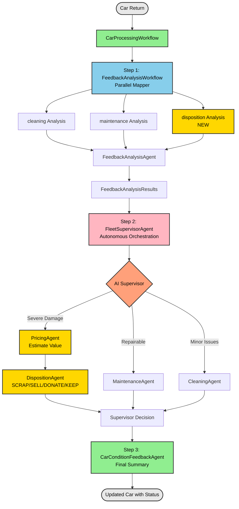
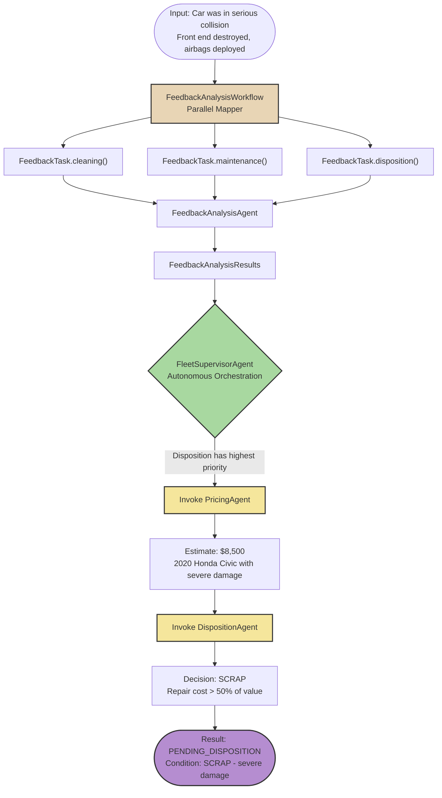
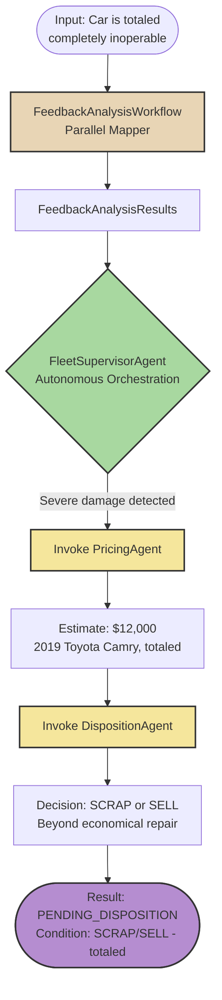
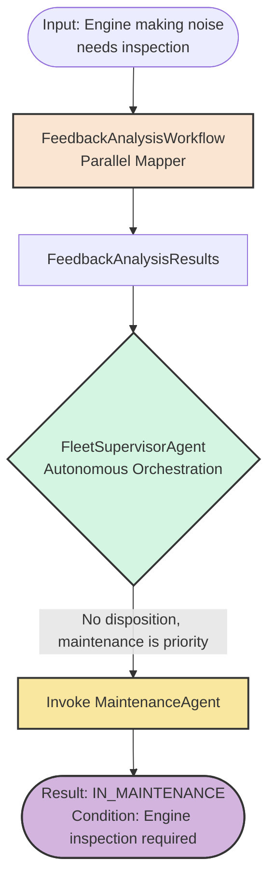
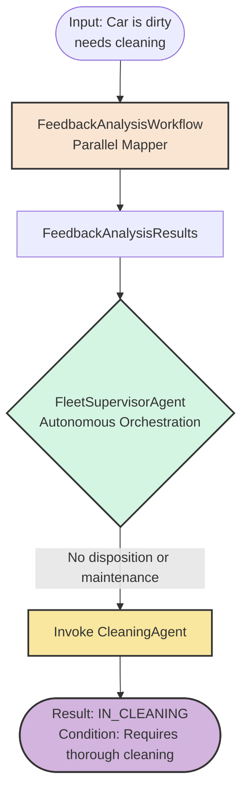

# Step 04 - Supervisor Pattern for Autonomous Agentic Orchestration

## Supervisor Pattern for Autonomous Agentic Orchestration

In the previous step, you created **nested workflows** that combined sequential, parallel, and conditional patterns to build sophisticated multi-level orchestration.

That design was intentionally concrete. Step 03 introduced separate feedback agents and a straightforward [`@ParallelAgent`](section-2/step-03/src/main/java/com/carmanagement/agentic/workflow/FeedbackWorkflow.java) workflow so you could clearly see how multiple specialized agents collaborate inside a larger workflow.

In this step, the business problem evolves. We are still building on the same orchestration ideas, but the addition of a third feedback dimension creates a good opportunity to refactor the architecture. Rather than adding yet another nearly identical feedback agent and keeping the duplication, you'll move to a more flexible pattern: a **single parameterized feedback agent** executed multiple times in parallel by a supervisor-driven workflow.

This step therefore introduces two ideas at once. First, you'll learn the **Supervisor Pattern**, where an AI agent autonomously decides which downstream agents to invoke. Second, you'll see how to evolve a workflow from multiple concrete agents to a reusable, task-driven design using [`@ParallelMapperAgent`](section-2/step-04/src/main/java/com/carmanagement/agentic/workflow/FeedbackAnalysisWorkflow.java:23).

---

## New Requirement from Miles of Smiles Management: Intelligent Disposition Decisions

The Miles of Smiles management team has identified a new challenge: they need to make **intelligent decisions about vehicle disposition** when cars return with severe damage.

The system needs to:

1. **Detect severe damage** that might make a car uneconomical to repair
2. **Estimate vehicle value** to inform disposition decisions
3. **Decide disposition strategy** (SCRAP, SELL, DONATE, or KEEP) based on:
       - Car value
       - Age of the vehicle
       - Severity of damage
       - Repair cost estimates
4. **Let an AI supervisor orchestrate** the entire decision-making process

---

## What You'll Learn

In this step, you will:

- Understand the **Supervisor Pattern** and when to use it
- Implement a supervisor agent using the [`@SupervisorAgent`](section-2/step-04/src/main/java/com/carmanagement/agentic/agents/FleetSupervisorAgent.java:17) annotation
- Refactor three similar feedback analyzers into a single parameterized [`FeedbackAnalysisAgent`](section-2/step-04/src/main/java/com/carmanagement/agentic/agents/FeedbackAnalysisAgent.java)
- Model feedback work as reusable [`FeedbackTask`](section-2/step-04/src/main/java/com/carmanagement/model/FeedbackTask.java) instances
- Use [`@ParallelMapperAgent`](section-2/step-04/src/main/java/com/carmanagement/agentic/workflow/FeedbackAnalysisWorkflow.java:23) to invoke the same agent multiple times in parallel
- Use an [`@Output`](section-2/step-04/src/main/java/com/carmanagement/agentic/workflow/FeedbackAnalysisWorkflow.java:45) method to transform raw workflow results into structured data
- Build a [`PricingAgent`](section-2/step-04/src/main/java/com/carmanagement/agentic/agents/PricingAgent.java) to estimate vehicle market values
- Create a [`DispositionAgent`](section-2/step-04/src/main/java/com/carmanagement/agentic/agents/DispositionAgent.java) to make SCRAP/SELL/DONATE/KEEP decisions
- See how supervisors provide **autonomous, adaptive orchestration**

---

## Understanding the Supervisor Pattern

### What is a Supervisor Agent?

A **supervisor agent** is an AI agent that:

- **Autonomously coordinates other (sub-)agents**
- **Makes runtime decisions** about which agents to invoke
- **Adapts to context** using business rules and current conditions
- **Provides autonomous orchestration** without hardcoded routing logic

### Supervisor vs. Conditional Workflows

| Aspect | Conditional Workflow | Supervisor Agent |
|--------|---------------------|------------------|
| **Decision Logic** | Hardcoded conditions | AI-driven decisions |
| **Flexibility** | Fixed rules | Adapts to context |
| **Complexity** | Simple boolean checks | Complex reasoning |
| **Maintenance** | Update code for changes | Update prompts/context |

### When to Use Supervisors

Use supervisor agents when you need:

- **Context-aware routing** where decisions are based on multiple factors that are hard to predict
- **Business rule flexibility** that is easier to adjust through instructions than code changes
- **Complex orchestration** with multiple agents that have interdependencies

---

## Understanding the ParallelMapperAgent pattern

Step 03 deliberately used concrete feedback analysis agents because that made the composition pattern easy to understand. You had one explicit agent for **cleaning analysis**, and one for **maintenance analysis**, and the workflow simply ran both in parallel. 

Step 04 adds yet another analysis agent, this time for figuring out if a car is beyond repair and needs to be **dispositioned**.  Each one of these agents reads the same car information and the same feedback sources. The main difference is the instructions it follows and the output it produces.

Instead of creating one more near-duplicate agent, this step refactors the design to implement a **single, multi-purpose analysis agent** that can be dynamically configured for the different cleaning, maintenance and disposition outcomes and called multiple times in parallel using a `ParallelMapperAgent`.

---


### The New Architecture


```mermaid
graph TB
    Start(["Car Return"]) --> A["CarProcessingWorkflow"]

    A --> B["Step 1: FeedbackAnalysisWorkflow<br/>Parallel Mapper"]
    B --> B1["cleaning Analysis"]
    B --> B2["maintenance Analysis"]
    B --> B3["disposition Analysis<br/>NEW"]
    B1 --> BA["FeedbackAnalysisAgent"]
    B2 --> BA
    B3 --> BA
    BA --> BEnd["FeedbackAnalysisResults"]

    BEnd --> C["Step 2: FleetSupervisorAgent<br/>Autonomous Orchestration"]
    C --> C1{"AI Supervisor"}
    C1 -->|"Severe Damage"| C2["PricingAgent<br/>Estimate Value"]
    C2 --> C3["DispositionAgent<br/>SCRAP/SELL/DONATE/KEEP"]
    C1 -->|Repairable| C4["MaintenanceAgent"]
    C1 -->|"Minor Issues"| C5["CleaningAgent"]

    C3 --> CEnd["Supervisor Decision"]
    C4 --> CEnd
    C5 --> CEnd

    CEnd --> D["Step 3: CarConditionFeedbackAgent<br/>Final Summary"]
    D --> End(["Updated Car with Status"])

    style A fill:#90EE90,stroke:#333,stroke-width:2,color:#000
    style B fill:#87CEEB,stroke:#333,stroke-width:2,color:#000
    style C fill:#FFB6C1,stroke:#333,stroke-width:2,color:#000
    style D fill:#90EE90,stroke:#333,stroke-width:2,color:#000
    style C1 fill:#FFA07A,stroke:#333,stroke-width:2,color:#000
    style B3 fill:#FFD700,stroke:#333,stroke-width:2,color:#000
    style C2 fill:#FFD700,stroke:#333,stroke-width:2,color:#000
    style C3 fill:#FFD700,stroke:#333,stroke-width:2,color:#000
    style Start fill:#E8E8E8,stroke:#333,stroke-width:2,color:#000
    style End fill:#E8E8E8,stroke:#333,stroke-width:2,color:#000
```

---

## Implementing the new patterns

Let's build the new autonomous dispositioning system step by step.

## Prerequisites

Before starting:

- Completed [Step 03](step-03.md){target="_blank"} (or have the `section-2/step-03` code available)
- Application from Step 03 is stopped (Ctrl+C)

=== "Option 1: Continue from Step 03"

    If you want to continue building on your Step 03 code, copy the updated UI files from `step-04`:

    === "Linux / macOS"
        ```bash
        cd section-2/step-03
        cp ../step-04/src/main/resources/META-INF/resources/css/styles.css ./src/main/resources/META-INF/resources/css/styles.css
        cp ../step-04/src/main/resources/META-INF/resources/js/app.js ./src/main/resources/META-INF/resources/js/app.js
        cp ../step-04/src/main/resources/META-INF/resources/index.html ./src/main/resources/META-INF/resources/index.html
        ```

    === "Windows"
        ```cmd
        cd section-2\step-03
        copy ..\step-04\src\main\resources\META-INF\resources\css\styles.css .\src\main\resources\META-INF\resources\css\styles.css
        copy ..\step-04\src\main\resources\META-INF\resources\js\app.js .\src\main\resources\META-INF\resources\js\app.js
        copy ..\step-04\src\main\resources\META-INF\resources\index.html .\src\main\resources\META-INF\resources\index.html
        ```

=== "Option 2: Start Fresh from Step 04"

    Navigate to the complete `section-2/step-04` directory:

    ```bash
    cd section-2/step-04
    ```

---

### Create the Feedback Task Model

The first step in the refactoring is to make the analysis type explicit. Instead of encoding "cleaning", "maintenance", or "disposition" in three separate agent interfaces, we represent that variation with a task model.

Create [`src/main/java/com/carmanagement/model/FeedbackTask.java`](section-2/step-04/src/main/java/com/carmanagement/model/FeedbackTask.java):

```java title="FeedbackTask.java" hl_lines="16-30 35-49 55-77"
--8<-- "../../section-2/step-04/src/main/java/com/carmanagement/model/FeedbackTask.java"
```

Each factory method returns a configured [`FeedbackTask`](section-2/step-04/src/main/java/com/carmanagement/model/FeedbackTask.java) with two important pieces of data:

- the feedback type (for identification and debugging)
- the system instructions to use for that analysis

This design keeps the agent generic and moves the task-specific behavior into data. If you ever want to add another feedback dimension later, you can simply add another task factory rather than introducing another near-identical agent.

### Create the Unified FeedbackAnalysisAgent

Now create the single feedback analyzer that can handle any of those tasks.

In [`src/main/java/com/carmanagement/agentic/agents`](section-2/step-04/src/main/java/com/carmanagement/agentic/agents), create [`FeedbackAnalysisAgent.java`](section-2/step-04/src/main/java/com/carmanagement/agentic/agents/FeedbackAnalysisAgent.java):

```java title="FeedbackAnalysisAgent.java" hl_lines="14 27-30"
--8<-- "../../section-2/step-04/src/main/java/com/carmanagement/agentic/agents/FeedbackAnalysisAgent.java"
```

The key detail here is the system message. Instead of hardcoding the instructions in the agent itself, the agent uses `{task.systemInstructions}`. That means the same agent can behave like a cleaning analyzer, a maintenance analyzer, or a disposition analyzer depending on the [`FeedbackTask`](section-2/step-04/src/main/java/com/carmanagement/model/FeedbackTask.java) that was passed in.


### Create the FeedbackAnalysisResults Record

Once the parallel analysis is complete, we want to pass the results around as structured data rather than as a raw list of strings.

Create [`src/main/java/com/carmanagement/model/FeedbackAnalysisResults.java`](section-2/step-04/src/main/java/com/carmanagement/model/FeedbackAnalysisResults.java):

```java title="FeedbackAnalysisResults.java"
--8<-- "../../section-2/step-04/src/main/java/com/carmanagement/model/FeedbackAnalysisResults.java"
```

This record gives the rest of the workflow a stable, readable contract. Instead of dealing with array positions or ad hoc keys, later components can call `cleaningAnalysis()`, `maintenanceAnalysis()`, and `dispositionAnalysis()` directly.

### Create the PricingAgent

The Miles & Smiles management has decided they feel comfortable using AI to determine the value of their cars to make further decisions on whether to keep or dispose the car. A wise decision? That remains to be seen 😉.

Either way, our task is to implement their idea in the form of a new PricingAgent. We'll add some prompt engineering in the system message to guide the model on how to estimate value based on the brand, its state, and its age. The agent will be invoked by the supervisor when it deems that pricing is needed.

In [`src/main/java/com/carmanagement/agentic/agents`](section-2/step-04/src/main/java/com/carmanagement/agentic/agents), create [`PricingAgent.java`](section-2/step-04/src/main/java/com/carmanagement/agentic/agents/PricingAgent.java):

```java title="PricingAgent.java" hl_lines="16 35-37 39-41 50-53"
--8<-- "../../section-2/step-04/src/main/java/com/carmanagement/agentic/agents/PricingAgent.java"
```

### Create a DispositionAgent

Management also feels comfortable letting an AI model decide whether to SCRAP, SELL, DONATE, or KEEP the vehicle based on repair economics.

Create an agent that makes disposition decisions based on the pricing outcome from the PricingAgent, as well as the car's age and condition.

In [`src/main/java/com/carmanagement/agentic/agents`](section-2/step-04/src/main/java/com/carmanagement/agentic/agents), create [`DispositionAgent.java`](section-2/step-04/src/main/java/com/carmanagement/agentic/agents/DispositionAgent.java):

```java title="DispositionAgent.java" hl_lines="16 22 29 41 43"
--8<-- "../../section-2/step-04/src/main/java/com/carmanagement/agentic/agents/DispositionAgent.java"
```

### Create the FleetSupervisorAgent

Now create the **supervisor agent** that orchestrates everything.

What matters most here is making the prompt as clear as possible about the workflow and the agents available to it. The more explicit you are, the better the supervisor can reason about which action agents to invoke.

In [`src/main/java/com/carmanagement/agentic/agents`](section-2/step-04/src/main/java/com/carmanagement/agentic/agents), create [`FleetSupervisorAgent.java`](section-2/step-04/src/main/java/com/carmanagement/agentic/agents/FleetSupervisorAgent.java):

```java title="FleetSupervisorAgent.java" hl_lines="17-24 35 53-64 93-117"
--8<-- "../../section-2/step-04/src/main/java/com/carmanagement/agentic/agents/FleetSupervisorAgent.java"
```

**Key points:**

- The [`@SupervisorAgent`](section-2/step-04/src/main/java/com/carmanagement/agentic/agents/FleetSupervisorAgent.java:17) annotation enables **autonomous orchestration**
- The supervisor receives a [`FeedbackAnalysisResults`](section-2/step-04/src/main/java/com/carmanagement/model/FeedbackAnalysisResults.java) object and **decides which action agents to invoke**
- Notice that the `subAgents` list contains only **action agents**. Feedback analysis has already been completed before the supervisor begins.
- The prompt clearly explains both the available inputs and the routing expectations.
- The [`@SupervisorRequest`](section-2/step-04/src/main/java/com/carmanagement/agentic/agents/FleetSupervisorAgent.java:53) method provides the runtime request context for the supervisor.

### Understanding `@SupervisorRequest`

The [`@SupervisorRequest`](section-2/step-04/src/main/java/com/carmanagement/agentic/agents/FleetSupervisorAgent.java:53) annotation is what gives the supervisor its runtime instructions. This method inspects the feedback analysis results and builds a different request depending on whether disposition is required.

```java
@SupervisorRequest
static String request(
        String carMake,
        String carModel,
        Integer carYear,
        Integer carNumber,
        String carCondition,
        FeedbackAnalysisResults feedbackAnalysisResults,
        String rentalFeedback
) {
    boolean dispositionRequired = feedbackAnalysisResults.dispositionAnalysis() != null &&
            feedbackAnalysisResults.dispositionAnalysis().toUpperCase().contains("DISPOSITION_REQUIRED");

    String noDispositionMessage = """
           No disposition has been requested.

            INSTRUCTIONS:
            - DO NOT invoke PricingAgent
            - DO NOT invoke DispositionAgent
            - Only invoke MaintenanceAgent if maintenance needed
            - Only invoke CleaningAgent if cleaning needed
           """;

    String dispositionMessage = """
        The car has to be disposed.

        STEP 1: Invoke PricingAgent to get car value
        STEP 2: Invoke DispositionAgent to decide disposition action (SCRAP/SELL/DONATE/KEEP)
        STEP 3: If DispositionAgent decides KEEP:
                - Invoke MaintenanceAgent if maintenance needed
                - Invoke CleaningAgent if cleaning needed
        """;

    // returns the final formatted request string...
}
```

This approach is useful because it keeps the supervisor's instructions tightly aligned with the structured analysis results. The supervisor is not re-analyzing raw feedback from scratch. It is consuming the work already done by the feedback-analysis phase and using that to decide which actions to orchestrate.

---

## Parallel Feedback Analysis with `@ParallelMapperAgent`

Step 03 introduced [`@ParallelAgent`](section-2/step-03/src/main/java/com/carmanagement/agentic/workflow/FeedbackWorkflow.java), which is ideal when you have a fixed set of different agents that should all run concurrently.

In this step, the situation is slightly different. We still want parallel execution, but we no longer have three different agent types. We have one reusable agent that should run once per task. That is exactly what [`@ParallelMapperAgent`](section-2/step-04/src/main/java/com/carmanagement/agentic/workflow/FeedbackAnalysisWorkflow.java:23) is for.

You can think of the difference like this:

- [`@ParallelAgent`](section-2/step-03/src/main/java/com/carmanagement/agentic/workflow/FeedbackWorkflow.java) says: "run these different sub-agents in parallel"
- [`@ParallelMapperAgent`](section-2/step-04/src/main/java/com/carmanagement/agentic/workflow/FeedbackAnalysisWorkflow.java:23) says: "take this list of items and run the same sub-agent in parallel for each item"

That second model is a much better fit when the only thing that varies is configuration.

### Create the FeedbackAnalysisWorkflow

Now create the workflow that runs the unified agent once for each task.

Create [`src/main/java/com/carmanagement/agentic/workflow/FeedbackAnalysisWorkflow.java`](section-2/step-04/src/main/java/com/carmanagement/agentic/workflow/FeedbackAnalysisWorkflow.java):

```java title="FeedbackAnalysisWorkflow.java" hl_lines="23-27 29-38 45-51"
--8<-- "../../section-2/step-04/src/main/java/com/carmanagement/agentic/workflow/FeedbackAnalysisWorkflow.java"
```

A few things are happening here.

The [`@ParallelMapperAgent`](section-2/step-04/src/main/java/com/carmanagement/agentic/workflow/FeedbackAnalysisWorkflow.java:23) annotation points to [`FeedbackAnalysisAgent`](section-2/step-04/src/main/java/com/carmanagement/agentic/agents/FeedbackAnalysisAgent.java) as the sub-agent and uses `itemsProvider = "tasks"` so the framework knows which collection to iterate over.

The method therefore receives a `List<FeedbackTask>` and executes the same analysis agent in parallel for each entry in that list.

The raw result of that execution is a `List<String>`, with one result per task. That is useful, but it is not yet the shape we want for the rest of the workflow. The static [`@Output`](section-2/step-04/src/main/java/com/carmanagement/agentic/workflow/FeedbackAnalysisWorkflow.java:45) method solves that by converting the list into a [`FeedbackAnalysisResults`](section-2/step-04/src/main/java/com/carmanagement/model/FeedbackAnalysisResults.java) record.

Without the [`@Output`](section-2/step-04/src/main/java/com/carmanagement/agentic/workflow/FeedbackAnalysisWorkflow.java:45) method, downstream agents would need to know that index `0` means cleaning, index `1` means maintenance, and index `2` means disposition. That would make the design more fragile and harder to understand.

By transforming the parallel results into [`FeedbackAnalysisResults`](section-2/step-04/src/main/java/com/carmanagement/model/FeedbackAnalysisResults.java), you create an explicit contract between workflow stages. The supervisor and final condition agent can then work with named properties instead of positional assumptions.

---

## Update the CarProcessingWorkflow

Now that we've built the new components, we'll replace the previous parallel agent and the subsequent conditional routing with the supervisor agent. The workflow now becomes a clean three-step sequence:

1. [`FeedbackAnalysisWorkflow`](section-2/step-04/src/main/java/com/carmanagement/agentic/workflow/FeedbackAnalysisWorkflow.java) performs parallel analysis
2. [`FleetSupervisorAgent`](section-2/step-04/src/main/java/com/carmanagement/agentic/agents/FleetSupervisorAgent.java) decides which action agents to invoke
3. [`CarConditionFeedbackAgent`](section-2/step-04/src/main/java/com/carmanagement/agentic/agents/CarConditionFeedbackAgent.java) summarizes the outcome into structured car conditions

Update [`src/main/java/com/carmanagement/agentic/workflow/CarProcessingWorkflow.java`](section-2/step-04/src/main/java/com/carmanagement/agentic/workflow/CarProcessingWorkflow.java):

```java title="CarProcessingWorkflow.java" hl_lines="26-30"
--8<-- "../../section-2/step-04/src/main/java/com/carmanagement/agentic/workflow/CarProcessingWorkflow.java"
```


### Update the Final Condition Agent

Because the feedback-analysis phase now returns a structured results object, the final condition agent also becomes simpler and clearer.

Update [`src/main/java/com/carmanagement/agentic/agents/CarConditionFeedbackAgent.java`](section-2/step-04/src/main/java/com/carmanagement/agentic/agents/CarConditionFeedbackAgent.java):

```java title="CarConditionFeedbackAgent.java" hl_lines="25-31 38-41 45-52"
--8<-- "../../section-2/step-04/src/main/java/com/carmanagement/agentic/agents/CarConditionFeedbackAgent.java"
```

The agent now consumes [`FeedbackAnalysisResults`](section-2/step-04/src/main/java/com/carmanagement/model/FeedbackAnalysisResults.java) directly. It also explicitly checks the actual supervisor decision so that a disposition analysis does not automatically imply a final disposition outcome. If the supervisor reaches a KEEP decision, the workflow can still fall back to maintenance or cleaning.

### Update the Service Layer

Finally, the service layer needs to create the feedback tasks before invoking the workflow.

Update [`src/main/java/com/carmanagement/service/CarManagementService.java`](section-2/step-04/src/main/java/com/carmanagement/service/CarManagementService.java):

```java title="CarManagementService.java" hl_lines="42-59 67-80"
--8<-- "../../section-2/step-04/src/main/java/com/carmanagement/service/CarManagementService.java"
```

This is where the list of tasks is assembled:

```java
List<FeedbackTask> tasks = List.of(
        FeedbackTask.cleaning(),
        FeedbackTask.maintenance(),
        FeedbackTask.disposition()
);
```

That list is then passed into the main workflow. This is a small change in code, but it is a significant architectural improvement. The service is now explicitly defining which analyses should run, and the workflow is generic enough to execute them without knowing about separate feedback agent types.


---

## Test our changes

You've now implemented the supervisor pattern together with a parameterized parallel analysis stage. Let's test it.

Start the application:

=== "Linux / macOS"
    ```bash
    ./mvnw quarkus:dev
    ```

=== "Windows"
    ```cmd
    mvnw quarkus:dev
    ```

Open [http://localhost:8080](http://localhost:8080){target="_blank"}

### Test Disposition Scenarios

Try these scenarios to see how the supervisor pattern autonomously orchestrates agents.

#### Scenario 1: Severe Damage - Disposition Required

Enter the following text in the feedback field for the **Honda Civic**:

```text
The car was in a serious collision. Front end is completely destroyed and airbags deployed.
```

**What happens:**


```mermaid
flowchart TD
    Start(["Input: Car was in serious collision<br/>Front end destroyed, airbags deployed"])

    Start --> FW["FeedbackAnalysisWorkflow<br/>Parallel Mapper"]
    FW --> T1["FeedbackTask.cleaning()"]
    FW --> T2["FeedbackTask.maintenance()"]
    FW --> T3["FeedbackTask.disposition()"]
    T1 --> A1["FeedbackAnalysisAgent"]
    T2 --> A1
    T3 --> A1
    A1 --> Results["FeedbackAnalysisResults"]

    Results --> FSA{"FleetSupervisorAgent<br/>Autonomous Orchestration"}
    FSA -->|"Disposition has highest priority"| PA["Invoke PricingAgent"]
    PA --> PV["Estimate: $8,500<br/>2020 Honda Civic with severe damage"]
    PV --> DA["Invoke DispositionAgent"]
    DA --> DD["Decision: SCRAP<br/>Repair cost > 50% of value"]
    DD --> Result(["Result: PENDING_DISPOSITION<br/>Condition: SCRAP - severe damage"])

    style FW fill:#e8d5b5,stroke:#333,stroke-width:2,color:#333
    style FSA fill:#a8d8a0,stroke:#333,stroke-width:2,color:#333
    style PA fill:#f5e69c,stroke:#333,stroke-width:2,color:#333
    style DA fill:#f5e69c,stroke:#333,stroke-width:2,color:#333
    style Result fill:#b58dd0,stroke:#333,stroke-width:2,color:#333
```

**Expected result:**

- Status: `PENDING_DISPOSITION`
- Condition includes disposition decision, such as "SCRAP - severe damage, repair cost exceeds value"
- [`PricingAgent`](section-2/step-04/src/main/java/com/carmanagement/agentic/agents/PricingAgent.java) estimated the car's value
- [`DispositionAgent`](section-2/step-04/src/main/java/com/carmanagement/agentic/agents/DispositionAgent.java) made a SCRAP decision based on economics

#### Scenario 2: Total Loss

Enter the following text in the **Ford F-150** feedback field (status: In Maintenance) in the Fleet Status grid:

```text
The car is totaled after a major accident, completely inoperable
```

In this scenario, the car had already been sent to maintenance by the returns team, but the maintenance team is not able to repair it. The system can handle that scenario as well.

**What happens:**


```mermaid
flowchart TD
    Start(["Input: Car is totaled<br/>completely inoperable"])

    Start --> FW["FeedbackAnalysisWorkflow<br/>Parallel Mapper"]
    FW --> Results["FeedbackAnalysisResults"]
    Results --> FSA{"FleetSupervisorAgent<br/>Autonomous Orchestration"}

    FSA -->|"Severe damage detected"| PA["Invoke PricingAgent"]
    PA --> PV["Estimate: $12,000<br/>2019 Toyota Camry, totaled"]
    PV --> DA["Invoke DispositionAgent"]
    DA --> DD["Decision: SCRAP or SELL<br/>Beyond economical repair"]
    DD --> Result(["Result: PENDING_DISPOSITION<br/>Condition: SCRAP/SELL - totaled"])

    style FW fill:#e8d5b5,stroke:#333,stroke-width:2,color:#333
    style FSA fill:#a8d8a0,stroke:#333,stroke-width:2,color:#333
    style PA fill:#f5e69c,stroke:#333,stroke-width:2,color:#333
    style DA fill:#f5e69c,stroke:#333,stroke-width:2,color:#333
    style Result fill:#b58dd0,stroke:#333,stroke-width:2,color:#333
```

**Expected result:**

- Status: `PENDING_DISPOSITION`
- Disposition decision: SCRAP or SELL
- [`PricingAgent`](section-2/step-04/src/main/java/com/carmanagement/agentic/agents/PricingAgent.java) estimates value before the final disposition decision
- [`DispositionAgent`](section-2/step-04/src/main/java/com/carmanagement/agentic/agents/DispositionAgent.java) determines the vehicle is not worth repairing

#### Scenario 3: Repairable Damage

Enter the following text in the **Mercedes Benz** feedback field:

```text
Engine making noise, needs inspection
```

**What happens:**


```mermaid
flowchart TD
    Start(["Input: Engine making noise<br/>needs inspection"])

    Start --> FW["FeedbackAnalysisWorkflow<br/>Parallel Mapper"]
    FW --> Results["FeedbackAnalysisResults"]
    Results --> FSA{"FleetSupervisorAgent<br/>Autonomous Orchestration"}

    FSA -->|"No disposition, maintenance is priority"| MA["Invoke MaintenanceAgent"]
    MA --> Result(["Result: IN_MAINTENANCE<br/>Condition: Engine inspection required"])

    style FW fill:#FAE5D3,stroke:#333,stroke-width:2,color:#333
    style FSA fill:#D5F5E3,stroke:#333,stroke-width:2,color:#333
    style MA fill:#F9E79F,stroke:#333,stroke-width:2,color:#333
    style Result fill:#D2B4DE,stroke:#333,stroke-width:2,color:#333
```

**Expected result:**

- Status: `IN_MAINTENANCE`
- Condition describes the maintenance issue
- Supervisor routes to [`MaintenanceAgent`](section-2/step-04/src/main/java/com/carmanagement/agentic/agents/MaintenanceAgent.java), not disposition

#### Scenario 4: Minor Issues

Enter the following text in the **BMW X5** feedback field (status: In Maintenance) in the Fleet Status grid:

```text
Car is dirty, needs cleaning
```

**What happens:**


```mermaid
flowchart TD
    Start(["Input: Car is dirty<br/>needs cleaning"])

    Start --> FW["FeedbackAnalysisWorkflow<br/>Parallel Mapper"]
    FW --> Results["FeedbackAnalysisResults"]
    Results --> FSA{"FleetSupervisorAgent<br/>Autonomous Orchestration"}

    FSA -->|"No disposition or maintenance"| CA["Invoke CleaningAgent"]
    CA --> Result(["Result: IN_CLEANING<br/>Condition: Requires thorough cleaning"])

    style FW fill:#FAE5D3,stroke:#333,stroke-width:2,color:#333
    style FSA fill:#D5F5E3,stroke:#333,stroke-width:2,color:#333
    style CA fill:#F9E79F,stroke:#333,stroke-width:2,color:#333
    style Result fill:#D2B4DE,stroke:#333,stroke-width:2,color:#333
```

**Expected result:**

- Status: `IN_CLEANING`
- Condition describes cleaning needs
- Supervisor routes only to [`CleaningAgent`](section-2/step-04/src/main/java/com/carmanagement/agentic/agents/CleaningAgent.java)

---

## Experiment Further

### 1. Add More Feedback Tasks

Extend the [`FeedbackTask`](section-2/step-04/src/main/java/com/carmanagement/model/FeedbackTask.java) model with another factory method. For example, you could add a cosmetic-inspection task, a safety-compliance task, or an interior-damage task. Then update the list created in [`CarManagementService`](section-2/step-04/src/main/java/com/carmanagement/service/CarManagementService.java) to include it.

This is a good way to see the benefit of the refactoring. You are extending behavior by adding configuration and workflow inputs rather than cloning another feedback agent.

### 2. Add More Disposition Criteria

Enhance the [`DispositionAgent`](section-2/step-04/src/main/java/com/carmanagement/agentic/agents/DispositionAgent.java) to consider:

- repair history
- market demand for specific models
- seasonal factors
- fleet composition

### 3. Implement Multi-Tier Pricing

Create different pricing strategies:

- wholesale value for SCRAP decisions
- retail value for SELL decisions
- donation value for tax purposes

### 4. Add a Separate Disposition Workflow

Create a dedicated workflow for cars marked `PENDING_DISPOSITION`:

- get multiple price quotes
- check auction values
- evaluate donation options
- make a final disposition decision

---

## Troubleshooting

??? warning "Supervisor not invoking DispositionAgent"
    - Check that [`FeedbackTask.disposition()`](section-2/step-04/src/main/java/com/carmanagement/model/FeedbackTask.java:55) includes the expected severe-damage instructions
    - Verify that `"DISPOSITION_REQUIRED"` appears in `feedbackAnalysisResults.dispositionAnalysis()`
    - Review the [`@SupervisorRequest`](section-2/step-04/src/main/java/com/carmanagement/agentic/agents/FleetSupervisorAgent.java:53) logic
    - Add logging to inspect the values inside [`FeedbackAnalysisResults`](section-2/step-04/src/main/java/com/carmanagement/model/FeedbackAnalysisResults.java)

??? warning "Cars not getting PENDING_DISPOSITION status"
    - Check the output logic in [`CarConditionFeedbackAgent`](section-2/step-04/src/main/java/com/carmanagement/agentic/agents/CarConditionFeedbackAgent.java)
    - Verify that the supervisor decision actually contains a disposition outcome such as SCRAP, SELL, or DONATE
    - Ensure [`CarManagementService`](section-2/step-04/src/main/java/com/carmanagement/service/CarManagementService.java) maps `DISPOSITION` to `PENDING_DISPOSITION`

??? warning "Parallel analysis results look mismatched"
    - Verify that the task list in [`CarManagementService`](section-2/step-04/src/main/java/com/carmanagement/service/CarManagementService.java:43) is created in the same order expected by the [`@Output`](section-2/step-04/src/main/java/com/carmanagement/agentic/workflow/FeedbackAnalysisWorkflow.java:45) method
    - Check that each [`FeedbackTask`](section-2/step-04/src/main/java/com/carmanagement/model/FeedbackTask.java) has the correct instructions and output key

??? warning "PricingAgent returning unexpected values"
    - Review the pricing guidelines in the [`@SystemMessage`](section-2/step-04/src/main/java/com/carmanagement/agentic/agents/PricingAgent.java)
    - Check that car information is being passed correctly
    - Verify the LLM is following the expected output format

---

## What's Next?

You've implemented the **Supervisor Pattern** for autonomous, context-aware orchestration and, along the way, refactored the feedback-analysis phase into a more maintainable parameterized design.

The system now:

- runs a single analysis agent multiple times in parallel with different [`FeedbackTask`](section-2/step-04/src/main/java/com/carmanagement/model/FeedbackTask.java) configurations
- transforms those parallel results into a structured [`FeedbackAnalysisResults`](section-2/step-04/src/main/java/com/carmanagement/model/FeedbackAnalysisResults.java) object
- lets a [`FleetSupervisorAgent`](section-2/step-04/src/main/java/com/carmanagement/agentic/agents/FleetSupervisorAgent.java) decide which action agents to invoke
- estimates vehicle value when disposition is needed
- makes economically informed SCRAP/SELL/DONATE/KEEP decisions

In **Step 05**, you'll keep this refactored feedback-analysis architecture and add the **Human-in-the-Loop (HITL) pattern** so that high-value vehicle dispositions require human approval before execution.

[Continue to Step 05 - Human-in-the-Loop Pattern](step-05.md)
