```mermaid
flowchart TD
    Start([Input: Car was in serious collision<br/>Front end destroyed, airbags deployed])
    
    Start --> FW[FeedbackWorkflow<br/>Parallel Analysis]
    
    FW --> DFA[DispositionFeedbackAgent]
    FW --> MFA[MaintenanceFeedbackAgent]
    FW --> CFA[CleaningFeedbackAgent]
    
    DFA --> DR[Detects: DISPOSITION_REQUIRED ✓<br/>Keywords: collision, destroyed]
    MFA --> MR[Detects: maintenance issues ✓]
    CFA --> CR[Detects: cleaning needed ✓]
    
    DR --> FSA{FleetSupervisorAgent<br/>Autonomous Orchestration}
    MR --> FSA
    CR --> FSA
    
    FSA -->|Disposition has highest priority| PA[Invoke PricingAgent]
    PA --> PV[Estimate: $8,500<br/>2020 Honda Civic with severe damage]
    PV --> DA[Invoke DispositionAgent]
    DA --> DD[Decision: SCRAP<br/>Repair cost > 50% of value]
    DD --> Result([Result: PENDING_DISPOSITION<br/>Condition: SCRAP - severe damage])
    
    style FW fill:#FAE5D3
    style FSA fill:#D5F5E3
    style PA fill:#F9E79F
    style DA fill:#F9E79F
    style Result fill:#D2B4DE
```

```mermaid
flowchart TD
    Start([Input: Car is dirty<br/>needs cleaning])
    
    Start --> FW[FeedbackWorkflow<br/>Parallel Analysis]
    
    FW --> DFA[DispositionFeedbackAgent]
    FW --> MFA[MaintenanceFeedbackAgent]
    FW --> CFA[CleaningFeedbackAgent]
    
    DFA --> DR[Detects: no severe damage ✗]
    MFA --> MR[Detects: no maintenance needed ✗]
    CFA --> CR[Detects: cleaning needed ✓]
    
    DR --> FSA{FleetSupervisorAgent<br/>Autonomous Orchestration}
    MR --> FSA
    CR --> FSA
    
    FSA -->|No disposition or maintenance| CA[Invoke CleaningAgent]
    CA --> Result([Result: IN_CLEANING<br/>Condition: Requires thorough cleaning])
    
    style FW fill:#FAE5D3
    style FSA fill:#D5F5E3
    style CA fill:#F9E79F
    style Result fill:#D2B4DE
```

# Step 04 - Supervisor Pattern for Autonomous Agentic Orchestration

## Supervisor Pattern for Autonomous Agentic Orchestration

In the previous step, you created **nested workflows** that combined sequential, parallel, and conditional patterns to build sophisticated multi-level orchestration.

However, those workflows used **fixed, deterministic routing** - the conditions were hardcoded and predictable, which is great for maintaining control over the agentic workflow. But what if outcomes are less predictable and you need **dynamic, context-aware orchestration** where an AI agent decides which sub-agents to invoke based on the current situation?

In this step, you'll learn about the **Supervisor Pattern** - a powerful approach where a supervisor agent autonomously orchestrates other agents based on runtime context and business conditions.

---

## New Requirement from Miles of Smiles Management: Intelligent Disposition Decisions

The Miles of Smiles management team has identified a new challenge: they need to make **intelligent decisions about vehicle disposition** when cars return with severe damage.

The system needs to:

1. **Detect severe damage** that might make a car uneconomical to repair
2. **Estimate vehicle value** to inform disposition decisions
3. **Decide disposition strategy** (SCRAP, SELL, DONATE, or KEEP) based on:
       - Car value
       - Age of the vehicle
       - Severity of damage
       - Repair cost estimates
4. **Let an AI supervisor orchestrate** the entire decision-making process

---

## What You'll Learn

In this step, you will:

- Understand the **Supervisor Pattern** and when to use it
- Implement a supervisor agent using `@SupervisorAgent` annotation
- Create specialized agents for **feedback analysis** and **action execution**
- Build a **PricingAgent** to estimate vehicle market values
- Create a **DispositionAgent** to make SCRAP/SELL/DONATE/KEEP decisions
- See how supervisors provide **autonomous, adaptive orchestration**

---

## Understanding the Supervisor Pattern

### What is a Supervisor Agent?

A **supervisor agent** is an AI agent that:

- **Autonomously coordinates other (sub-)agents**
- **Makes runtime decisions** about which agents to invoke
- **Adapts to context** using business rules and current conditions
- **Provides autonomous orchestration** without hardcoded logic

### Supervisor vs. Conditional Workflows

| Aspect | Conditional Workflow | Supervisor Agent |
|--------|---------------------|------------------|
| **Decision Logic** | Hardcoded conditions | AI-driven decisions |
| **Flexibility** | Fixed rules | Adapts to context |
| **Complexity** | Simple boolean checks | Complex reasoning |
| **Maintenance** | Update code for changes | Update prompts/context |

### When to Use Supervisors

Use supervisor agents when you need:

- **Context-aware routing** where decisions are based on multiple factors that are hard to predict
- **Business rule flexibility** that are easier to adjust without code changes
- **Complex orchestration** with multiple agents that have interdependencies

---

## What is Being Added?

We're going to enhance our car management system with:

- a **FleetSupervisorAgent** that will orchestrate feedback and action agents autonomously
- a **DispositionFeedbackAgent** that detects severe damage requiring disposition evaluation
- a **PricingAgent** that estimates vehicle market value
- a **DispositionAgent** which will decide to SCRAP/SELL/DONATE/KEEP based on value and condition
- an **Updated workflow** with two-phase processing (feedback → supervisor → actions)

### The New Architecture


**The Key Innovation:**

The **FleetSupervisorAgent** receives feedback from three parallel agents and then autonomously decides:

- If severe damage detected → invoke PricingAgent → DispositionAgent
- If repairable damage → invoke MaintenanceAgent
- If only cleaning needed → invoke CleaningAgent

---

## Implementing the Supervisor Pattern

Let's build the new autonomous dispositioning system step by step.

## Prerequisites

Before starting:

- Completed [Step 03](step-03.md){target="_blank"} (or have the `section-2/step-03` code available)
- Application from Step 03 is stopped (Ctrl+C)

=== "Option 1: Continue from Step 03"

    If you want to continue building on your Step 03 code, copy the updated UI files from `step-04`:

    === "Linux / macOS"
        ```bash
        cd section-2/step-03
        cp ../step-04/src/main/resources/META-INF/resources/css/styles.css ./src/main/resources/META-INF/resources/css/styles.css
        cp ../step-04/src/main/resources/META-INF/resources/js/app.js ./src/main/resources/META-INF/resources/js/app.js
        cp ../step-04/src/main/resources/META-INF/resources/index.html ./src/main/resources/META-INF/resources/index.html
        ```

    === "Windows"
        ```cmd
        cd section-2\step-03
        copy ..\step-04\src\main\resources\META-INF\resources\css\styles.css .\src\main\resources\META-INF\resources\css\styles.css
        copy ..\step-04\src\main\resources\META-INF\resources\js\app.js .\src\main\resources\META-INF\resources\js\app.js
        copy ..\step-04\src\main\resources\META-INF\resources\index.html .\src\main\resources\META-INF\resources\index.html
        ```

=== "Option 2: Start Fresh from Step 04"

    Navigate to the complete `section-2/step-04` directory:

    ```bash
    cd section-2/step-04
    ```

---

### Create the DispositionFeedbackAgent

Create an agent that detects severe damage requiring disposition evaluation.

In `src/main/java/com/carmanagement/agentic/agents`, create `DispositionFeedbackAgent.java`:

```java title="DispositionFeedbackAgent.java" hl_lines="15-19 22 25 42"
--8<-- "../../section-2/step-04/src/main/java/com/carmanagement/agentic/agents/DispositionFeedbackAgent.java"
```

This agent runs in **parallel** with the other feedback agents,
looking for keywords like "wrecked", "totaled", or "crashed" that indicate severe damage.

### Create the PricingAgent

The Miles & Smiles management feels comfortable using AI to determine the value of their cars. A wise decision? That remains to be seen 😉.

Either way, let's create the agent.
We'll add some prompt engineering in the system message to 'train' the AI model on how to calculate
the value based on the brand, its state and its age.
As a reminder, the agent will be invoked by the supervisor when pricing is needed.

In `src/main/java/com/carmanagement/agentic/agents`, create `PricingAgent.java`:

```java title="PricingAgent.java" hl_lines="16 35-37 39-41 50-53"
--8<-- "../../section-2/step-04/src/main/java/com/carmanagement/agentic/agents/PricingAgent.java"
```

### Create the DispositionAgent

Management also feels comfortable letting an AI model decide whether to SCRAP, SELL, DONATE, or KEEP the vehicle based on repair economics.

Create an agent that makes disposition decisions based on the value outcome of the
PricingAgent's value estimate as well as the car's age and condition.

In `src/main/java/com/carmanagement/agentic/agents`, create `DispositionAgent.java`:

```java title="DispositionAgent.java" hl_lines="16 22 29 41 43"
--8<-- "../../section-2/step-04/src/main/java/com/carmanagement/agentic/agents/DispositionAgent.java"
```

### Create the FleetSupervisorAgent

Now create the **supervisor agent** that orchestrates everything.
What's absolutely key here is to make the prompt **as clear as possible** about the
workflow and the agents that are available to it. The more precise you are,
the better the supervisor will be at deciding which agents to invoke.

In `src/main/java/com/carmanagement/agentic/agents`, create `FleetSupervisorAgent.java`:

```java title="FleetSupervisorAgent.java" hl_lines="13 15 20 22"
--8<-- "../../section-2/step-04/src/main/java/com/carmanagement/agentic/agents/FleetSupervisorAgent.java"
```

**Key Points:**

- The `@SupervisorAgent` annotation enables **autonomous orchestration**.
- The supervisor receives feedback analysis results and **decides which action agents to invoke**.
- Notice how the `subAgents` parameter lists only action agents (not feedback agents) - the supervisor coordinates actions after feedback is complete.
- The **prompt clearly explains the workflow and available agents**.

### Update the FeedbackWorkflow

We need to update the `FeedbackWorkflow` and add the `DispositionFeedbackAgent` to the parallel feedback workflow.

Update `src/main/java/com/carmanagement/agentic/workflow/FeedbackWorkflow.java`:

```java title="FeedbackWorkflow.java" hl_lines="5 19"
--8<-- "../../section-2/step-04/src/main/java/com/carmanagement/agentic/workflow/FeedbackWorkflow.java"
```

### Update the CarProcessingWorkflow

Since we want the supervisor to determine which agents need to be called,
we will replace the previous conditional workflow with the supervisor agent,
and add the additional car assignment logic based on the output of the supervisor agent.

Update `src/main/java/com/carmanagement/agentic/workflow/CarProcessingWorkflow.java`:

```java title="CarProcessingWorkflow.java" hl_lines="4 22 39-49"
--8<-- "../../section-2/step-04/src/main/java/com/carmanagement/agentic/workflow/CarProcessingWorkflow.java"
```

!!!question "Why both check dispositionRequest and supervisorDecision?"
    Both checks serve different purposes in the workflow:
    
    1. **First check** (dispositionRequest): Catches severe damage from initial feedback analysis
    2. **Second check** (supervisorDecision): Catches final disposition decision (SCRAP/SELL/DONATE) after pricing evaluation
    
    While there's logical overlap (severe damage → supervisor invokes DispositionAgent → outputs SCRAP/SELL/DONATE),
    both checks provide defense in depth.
    The first ensures immediate routing for catastrophic damage, while the second catches the supervisor's final action decision.

### Update the Service Layer

Finally, we need to add the new disposition status to the processCarReturn method.

In `src/main/java/com/carmanagement/service/CarManagementService.java`, add disposition handling in the `processCarReturn` method:

```java
// Add after existing status checks:
if (carConditions.carAssignment() == CarAssignment.DISPOSITION) {
    carInfo.status = CarStatus.PENDING_DISPOSITION;
}
```

---

## Try the Supervisor Pattern

Nicely done! You've implemented the supervisor pattern to autonomously orchestrate agents. Let's test it:

Start the application:

=== "Linux / macOS"
    ```bash
    ./mvnw quarkus:dev
    ```

=== "Windows"
    ```cmd
    mvnw quarkus:dev
    ```

Open [http://localhost:8080](http://localhost:8080){target="_blank"}

### Test Disposition Scenarios

Try these scenarios to see how the supervisor pattern autonomously orchestrates agents:

#### Scenario 1: Severe Damage - Disposition Required

Enter the following text in the feedback field for the **Honda Civic**:

```text
The car was in a serious collision. Front end is completely destroyed and airbags deployed.
```

**What happens:**



**Expected Result:**
- Status: `PENDING_DISPOSITION`
- Condition includes disposition decision (e.g., "SCRAP - severe damage, repair cost exceeds value")
- PricingAgent estimated the car's value
- DispositionAgent made a SCRAP decision based on economics

#### Scenario 2: Total Loss

Enter the following text in the **Ford F-150** feedback field from the Maintenance Returns tab:

```text
The car is totaled after a major accident, completely inoperable
```

In this scenario, the car had already been sent to maintenance by the returns team,
but the maintenance team is not able to repair the car.
Our autonomous system can handle this scenario as well.

**What happens:**


**Expected Result:**
- Status: `PENDING_DISPOSITION`
- Disposition decision: SCRAP or SELL (beyond economical repair)
- PricingAgent estimated value before total loss
- DispositionAgent determined vehicle is not worth repairing

#### Scenario 3: Repairable Damage

Enter the following text in the **Mercedes Benz** feedback field:

```text
Engine making noise, needs inspection
```

**What happens:**


**Expected Result:**

- Status: `IN_MAINTENANCE`
- Condition describes the maintenance issue
- Supervisor routed to MaintenanceAgent (not disposition)

#### Scenario 4: Minor Issues

Enter the following text in the **Audi A4** feedback field (in the Maintenance Return tab):

```text
Car is dirty, needs cleaning
```

**What happens:**



**Expected Result:**

- Status: `IN_CLEANING`
- Condition describes cleaning needs
- Supervisor routed to CleaningAgent only

### Observe the Disposition Tab

After processing a car with severe damage, check the **Dispositions** tab in the Returns section. You'll see cars that have been marked for disposition with their condition and planned disposition action.

The UI now includes a dedicated tab to track all vehicles pending disposition, making it easy to see which cars need to be scrapped, sold, or donated.

---

## Experiment Further

### 1. Add More Disposition Criteria

Enhance the DispositionAgent to consider:

- Repair history (frequent repairs → disposition)
- Market demand for specific models
- Seasonal factors (convertibles in winter)
- Fleet composition (too many of same model)

### 2. Implement Multi-Tier Pricing

Create different pricing strategies:

- Wholesale value (for SCRAP decisions)
- Retail value (for SELL decisions)
- Donation value (for tax purposes)

### 3. Add Disposition Workflow

Create a separate workflow for cars marked PENDING_DISPOSITION:

- Get multiple price quotes
- Check auction values
- Evaluate donation options
- Final disposition decision

### 4. Test Edge Cases

What happens when:

- Luxury car with severe damage?
- Old car in excellent condition?
- Multiple disposition-worthy issues?
- Repair cost estimate unavailable?

---

## Troubleshooting

??? warning "Supervisor not invoking DispositionAgent"
    - Check that DispositionFeedbackAgent is detecting severe damage keywords
    - Verify "DISPOSITION_REQUIRED" is in the output
    - Review supervisor's system message for disposition routing logic
    - Add logging to see feedback values

??? warning "Cars not getting PENDING_DISPOSITION status"
    - Check the output logic in CarProcessingWorkflow
    - Verify `dispositionRequest` parameter is being passed
    - Ensure `isDisposition()` method checks for correct keywords
    - Check CarManagementService status mapping

??? warning "PricingAgent returning unexpected values"
    - Review the pricing guidelines in the `@SystemMessage`
    - Check that car information (make, model, year) is passed correctly
    - Verify the LLM is following the output format
    - Test with different car makes/models/years

---

## What's Next?

You've implemented the **Supervisor Pattern** for autonomous, context-aware orchestration with intelligent disposition decisions!

The supervisor agent can now:

- Detect severe damage requiring disposition
- Estimate vehicle value
- Make economically sound SCRAP/SELL/DONATE/KEEP decisions
- Route to appropriate action agents based on feedback

In **Step 05**, you'll learn about **Agent-to-Agent (A2A) communication** — converting the local DispositionAgent you just built into a remote service that runs in a separate system, demonstrating how to distribute agent workloads across multiple applications!

[Continue to Step 05 - Using Remote Agents (A2A)](step-05.md)
