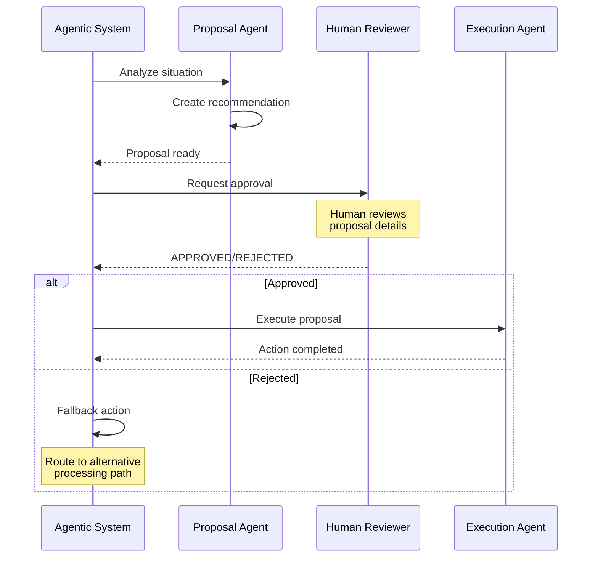
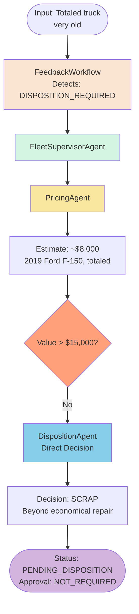

# Step 05 - Human-in-the-Loop Pattern

## Human-in-the-Loop Pattern

In the previous step, you built a **Supervisor Pattern** that orchestrates multiple agents to handle car returns, including disposition decisions for damaged vehicles.

However, that system made autonomous decisions about vehicle disposition without human oversight. What if you need **human approval** before executing high-stakes decisions, especially for valuable assets?

In this step, you'll learn about the **Human-in-the-Loop (HITL) pattern** - a critical approach where AI agents pause execution to request human approval before proceeding with significant actions.

---

## New Requirement from Miles of Smiles Management: Human Approval for High-Value Dispositions

The Miles of Smiles management team has identified a risk: the system is making autonomous disposition decisions on high-value vehicles without human oversight.

They want to implement a **human approval gate** with these requirements:

1. **Value threshold**: Any vehicle worth more than **$15,000** requires human approval before disposition
2. **Two-phase workflow**:
       - Phase 1: AI creates a disposition **proposal**
       - Phase 2: Human reviews and **approves or rejects** the proposal
3. **Execution control**: Only execute approved dispositions
4. **Audit trail**: Track approval status and reasoning for compliance

This ensures that expensive vehicles aren't scrapped or sold without proper human review.

---

## What You'll Learn

In this step, you will:

- Understand the **Human-in-the-Loop (HITL) pattern** and when to use it
- Implement a **two-phase approval workflow** (proposal → review → execution)
- Create a **DispositionProposalAgent** that generates proposals
- Build a **HumanApprovalAgent** using LangChain4j's **`@HumanInTheLoop`** annotation
- Modify the **FleetSupervisorAgent** to route high-value vehicles through approval
- Add **approval tracking** to the data model
- See how HITL provides **safety and control** in autonomous systems

---

## Understanding Human-in-the-Loop

### What is Human-in-the-Loop?

**Human-in-the-Loop (HITL)** is a pattern where:

- AI agents perform analysis and create recommendations
- Execution **pauses** to request human approval
- Humans review proposals and make final decisions
- System proceeds only after approval

### HITL vs. Fully Autonomous

| Aspect | Fully Autonomous | Human-in-the-Loop |
|--------|------------------|-------------------|
| **Speed** | Fast, immediate | Slower, waits for human |
| **Scalability** | Unlimited | Limited by human capacity |
| **Accuracy** | Consistent but may miss edge cases | Human judgment for complex cases |
| **Accountability** | System responsibility | Human responsibility |
| **Cost** | Lower operational cost | Higher due to human involvement |

### The Two-Phase Workflow


```mermaid
sequenceDiagram
    participant System as Agentic System
    participant Proposal as Proposal Agent
    participant Human as Human Reviewer
    participant Execution as Execution Agent

    System->>Proposal: Analyze situation
    Proposal->>Proposal: Create recommendation
    Proposal-->>System: Proposal ready

    System->>Human: Request approval
    Note over Human: Human reviews<br/>proposal details
    Human-->>System: APPROVED/REJECTED

    alt Approved
        System->>Execution: Execute proposal
        Execution-->>System: Action completed
    else Rejected
        System->>System: Fallback action
        Note over System: Route to alternative<br/>processing path
    end
```

---

## What is Being Added?

We're enhancing our car management system with:

- **DispositionProposalAgent**: Creates disposition proposals for review
- **HumanApprovalAgent**: Uses LangChain4j's `@HumanInTheLoop` annotation to pause workflow execution and wait for a human decision through the UI
- **Updated FleetSupervisorAgent**: Routes high-value vehicles through the approval workflow
- **Enhanced CarConditions**: Tracks approval status and reasoning
- **Value-based routing**: Different paths for high-value vs. low-value vehicles

### The Complete HITL Architecture

```mermaid
graph TB
    Start([Car Return]) --> A[CarProcessingWorkflow<br/>Sequential]

    A --> B[Step 1: FeedbackWorkflow<br/>Parallel Analysis]
    B --> B1[CleaningFeedbackAgent]
    B --> B2[MaintenanceFeedbackAgent]
    B --> B3[DispositionFeedbackAgent]
    B1 --> BEnd[All feedback complete]
    B2 --> BEnd
    B3 --> BEnd

    BEnd --> C[Step 2: FleetSupervisorAgent<br/>Autonomous Orchestration]
    C --> C1{Disposition<br/>Required?}

    C1 -->|Yes| PA[PricingAgent<br/>Estimate Value]
    PA --> VCheck{Value > $15k?}

    VCheck -->|Yes - HIGH VALUE| Proposal[DispositionProposalAgent<br/>Create Proposal]
    Proposal --> Approval[HumanApprovalAgent<br/>@HumanInTheLoop]
    Approval --> ApprovalCheck{Approved?}
    ApprovalCheck -->|Yes| Execute[Execute Disposition]
    ApprovalCheck -->|No| Fallback[Route to Maintenance/Cleaning]

    VCheck -->|No - LOW VALUE| Direct[DispositionAgent<br/>Direct Decision]
    Direct --> Execute

    C1 -->|No| Other[MaintenanceAgent or CleaningAgent]

    Execute --> CEnd[Supervisor Decision]
    Fallback --> CEnd
    Other --> CEnd

    CEnd --> D[Step 3: CarConditionFeedbackAgent<br/>Final Summary]
    D --> End([Updated Car with Approval Status])

    style A fill:#90EE90
    style B fill:#87CEEB
    style C fill:#FFB6C1
    style D fill:#90EE90
    style Proposal fill:#FFD700
    style Approval fill:#FF6B6B
    style VCheck fill:#FFA07A
    style ApprovalCheck fill:#FFA07A
    style Start fill:#E8E8E8
    style End fill:#E8E8E8
```

**The Key Innovation:**

The **FleetSupervisorAgent** now implements value-based routing:

- **High-value path** (>$15,000): PricingAgent → DispositionProposalAgent → HumanApprovalAgent → Execute if approved
- **Low-value path** (≤$15,000): PricingAgent → DispositionAgent → Execute directly
- **Fallback**: If approval rejected, route to maintenance or cleaning instead

---

## Implementing the Human-in-the-Loop Pattern

Let's build the HITL system step by step.

### Create the DispositionProposalAgent

This agent creates disposition proposals that will be reviewed by humans.

Create `src/main/java/com/carmanagement/agentic/agents/DispositionProposalAgent.java`:

```java title="DispositionProposalAgent.java" hl_lines="14-29 38-48 51"
--8<-- "../../section-2/step-05/src/main/java/com/carmanagement/agentic/agents/DispositionProposalAgent.java"
```

!!! note "Why two disposition agents?"
    You might wonder why we have both DispositionProposalAgent and DispositionAgent. They serve different purposes: DispositionProposalAgent creates recommendations for human review on high-value vehicles (>$15K), while DispositionAgent makes autonomous decisions on lower-value vehicles. Think of it like needing manager approval for expensive purchases but having autonomy for small ones.

**Key Points:**

- Creates **proposals** rather than final decisions
- Uses same decision criteria as DispositionAgent
- Output format includes "Proposed Action" and "Reasoning"
- Stored in AgenticScope with key `dispositionProposal`

### Create the HumanApprovalAgent

This agent implements Human-in-the-Loop using LangChain4j's **`@HumanInTheLoop`** annotation. Instead of relying on a separate tool, the agent method itself **pauses workflow execution** until a human makes a decision through the UI.

Create `src/main/java/com/carmanagement/agentic/agents/HumanApprovalAgent.java`:

```java title="HumanApprovalAgent.java" hl_lines="6 17"
--8<-- "../../section-2/step-05/src/main/java/com/carmanagement/agentic/agents/HumanApprovalAgent.java"
```

**Key Points:**

- The **`@HumanInTheLoop`** annotation from LangChain4j marks this agent method as requiring human interaction before completing
- The method body contains the blocking logic directly — no separate tool class is needed
- Calls `ApprovalService.createProposalAndWaitForDecision()` which returns a `CompletableFuture`
- Workflow execution **pauses** by calling `.get(5, TimeUnit.MINUTES)` on the future
- Human sees pending approval in the UI and clicks Approve/Reject
- The future completes, workflow resumes with the human's decision
- Returns structured decision: APPROVED/REJECTED with reasoning
- Stored in AgenticScope with key `approvalDecision`

!!! info "Why `@HumanInTheLoop` instead of a tool?"
    In previous versions of this workshop, the human approval logic lived in a separate `HumanApprovalTool` class that the agent would invoke. LangChain4j's `@HumanInTheLoop` annotation simplifies this by letting you place the blocking logic directly in the agent method. The annotation signals to the framework that this agent requires human interaction, keeping everything in one place and eliminating the extra tool class.

### The ApprovalService

The `ApprovalService` manages the `CompletableFuture` instances that pause and resume workflow execution. This is the bridge between the `HumanApprovalAgent` and the REST endpoints that the UI calls.

Create `src/main/java/com/carmanagement/service/ApprovalService.java`:

```java title="ApprovalService.java"
--8<-- "../../section-2/step-05/src/main/java/com/carmanagement/service/ApprovalService.java"
```

**Key Points:**

- Stores `CompletableFuture<ApprovalProposal>` in a map keyed by car number
- `createProposalAndWaitForDecision()` creates the future and returns it
- Proposal is persisted in a separate transaction to ensure it's visible to UI queries
- `processDecision()` completes the future when human makes a decision
- This completion **resumes the workflow** that was blocked on `.get()`

### Create the ApprovalProposal Entity

This entity stores proposals in the database so the UI can display them.

Create `src/main/java/com/carmanagement/model/ApprovalProposal.java`:

```java title="ApprovalProposal.java"
--8<-- "../../section-2/step-05/src/main/java/com/carmanagement/model/ApprovalProposal.java"
```

### Create the ApprovalResource

This REST resource allows the UI to fetch pending approvals and submit decisions.

Create `src/main/java/com/carmanagement/resource/ApprovalResource.java`:

```java title="ApprovalResource.java"
--8<-- "../../section-2/step-05/src/main/java/com/carmanagement/resource/ApprovalResource.java"
```

**REST API Endpoints:**

- `GET /api/approvals/pending` - Returns all pending approval proposals
- `POST /api/approvals/{id}/approve` - Approve a proposal
- `POST /api/approvals/{id}/reject` - Reject a proposal

!!!success "How the HITL Flow Works End-to-End"
    1. The `FleetSupervisorAgent` detects a high-value vehicle and invokes the `DispositionProposalAgent`
    2. The proposal is passed to the `HumanApprovalAgent`, which is annotated with `@HumanInTheLoop`
    3. Inside the agent method, `ApprovalService.createProposalAndWaitForDecision()` persists the proposal to the database and returns a `CompletableFuture`
    4. The agent method **blocks** on `future.get(5, TimeUnit.MINUTES)` — the workflow pauses here
    5. The UI polls `GET /api/approvals/pending` and displays the proposal to the human reviewer
    6. The human clicks **Approve** or **Reject**, which calls the corresponding REST endpoint
    7. `ApprovalService.processDecision()` completes the `CompletableFuture` with the decision
    8. The agent method **unblocks**, formats the decision, and returns it
    9. The workflow **resumes** with the human's decision

### Update the FleetSupervisorAgent

Modify the supervisor to implement value-based routing with the approval workflow.

Update `src/main/java/com/carmanagement/agentic/agents/FleetSupervisorAgent.java`:

```java title="FleetSupervisorAgent.java" hl_lines="10 24-35 40-46 49-51"
--8<-- "../../section-2/step-05/src/main/java/com/carmanagement/agentic/agents/FleetSupervisorAgent.java"
```

**Key Changes:**

- Added **DispositionProposalAgent** and **HumanApprovalAgent** to subAgents
- Implemented **two-path routing** based on vehicle value
- High-value path: Proposal → Approval → Execute if approved
- Low-value path: Direct disposition decision
- Stores approval status in AgenticScope for tracking

### Update the CarConditions Model

Add approval tracking fields to the data model.

Update `src/main/java/com/carmanagement/model/CarConditions.java`:

```java title="CarConditions.java" hl_lines="8-9 11-15 20-22"
--8<-- "../../section-2/step-05/src/main/java/com/carmanagement/model/CarConditions.java"
```

**Key Points:**

- Added `dispositionStatus` field (DISPOSITION_APPROVED/DISPOSITION_REJECTED/DISPOSITION_NOT_REQUIRED)
- Added `dispositionReason` field for audit trail
- Backward-compatible constructor for existing code

### Update Application Configuration

Add configuration for the approval threshold.

Update `src/main/resources/application.properties`:

```properties
# Human-in-the-Loop configuration
# Threshold for requiring human approval on high-value dispositions
car-management.approval.threshold=15000
```

This makes the threshold configurable without code changes.

---

## Try the Complete Solution

Now let's see the Human-in-the-Loop pattern in action!

### Start the Application

1. Navigate to the step-05 directory:

```bash
cd section-2/step-05
```

2. Start the application:

=== "Linux / macOS"
    ```bash
    ./mvnw quarkus:dev
    ```

=== "Windows"
    ```cmd
    mvnw quarkus:dev
    ```

3. Open [http://localhost:8080](http://localhost:8080){target="_blank"}

### Test HITL Scenarios

Try these scenarios to see how the approval workflow handles different vehicle values:

#### Scenario 1: High-Value Vehicle Requiring Approval

Enter the following text in the feedback field for the **Honda Civic**:

```text
The car was in a serious collision. Front end is completely destroyed and airbags deployed.
```

**What happens:**

```mermaid
flowchart TD
    Start([Input: Serious collision<br/>Front end destroyed])

    Start --> FW[FeedbackWorkflow<br/>Detects: DISPOSITION_REQUIRED]

    FW --> FSA[FleetSupervisorAgent<br/>Orchestration]
    FSA --> PA[PricingAgent]
    PA --> Value[Estimate: ~$18,000<br/>2020 Honda Civic]

    Value --> Check{Value > $15,000?}
    Check -->|Yes| Proposal[DispositionProposalAgent<br/>Creates Proposal]
    Proposal --> PropResult[Proposed: SCRAP<br/>Reasoning: Severe damage]

    PropResult --> Human[HumanApprovalAgent<br/>@HumanInTheLoop pauses workflow]
    Human --> Decision{Decision}
    Decision -->|APPROVED| Execute[Execute SCRAP]
    Decision -->|REJECTED| Fallback[Route to Maintenance]

    Execute --> Result([Status: PENDING_DISPOSITION<br/>Approval: APPROVED])
    Fallback --> Result2([Status: IN_MAINTENANCE<br/>Approval: REJECTED])

    style FW fill:#FAE5D3
    style FSA fill:#D5F5E3
    style PA fill:#F9E79F
    style Proposal fill:#FFD700
    style Human fill:#FF6B6B
    style Check fill:#FFA07A
    style Decision fill:#FFA07A
    style Result fill:#D2B4DE
    style Result2 fill:#D2B4DE
```

**Expected Result:**

- PricingAgent estimates value at ~$18,000 (above threshold)
- DispositionProposalAgent creates SCRAP proposal
- HumanApprovalAgent pauses the workflow (via `@HumanInTheLoop`) and waits for human input
- Human reviews the proposal in the UI and clicks Approve or Reject
- Workflow resumes with the decision
- Status: `PENDING_DISPOSITION` if approved, `IN_MAINTENANCE` if rejected

#### Scenario 2: High-Value Vehicle - Approval Rejected

Enter the following text in the **Mercedes Benz** feedback field:

```text
Minor fender bender, small dent in rear bumper
```

**What happens:**

```mermaid
flowchart TD
    Start([Input: Minor fender bender<br/>small dent])

    Start --> FW[FeedbackWorkflow<br/>Detects: DISPOSITION_REQUIRED]

    FW --> FSA[FleetSupervisorAgent]
    FSA --> PA[PricingAgent]
    PA --> Value[Estimate: ~$25,000<br/>2021 Mercedes Benz]

    Value --> Check{Value > $15,000?}
    Check -->|Yes| Proposal[DispositionProposalAgent<br/>Creates Proposal]
    Proposal --> PropResult[Proposed: SELL or KEEP<br/>Minor damage]

    PropResult --> Human[HumanApprovalAgent<br/>@HumanInTheLoop pauses workflow]
    Human --> Decision[Decision: REJECTED<br/>Too valuable for minor damage]

    Decision --> Fallback[Route to Maintenance<br/>Repair instead]
    Fallback --> Result([Status: IN_MAINTENANCE<br/>Approval: REJECTED])

    style FW fill:#FAE5D3
    style FSA fill:#D5F5E3
    style PA fill:#F9E79F
    style Proposal fill:#FFD700
    style Human fill:#FF6B6B
    style Check fill:#FFA07A
    style Result fill:#D2B4DE
```

**Expected Result:**

- PricingAgent estimates value at ~$25,000 (high value)
- DispositionProposalAgent suggests SELL or KEEP
- HumanApprovalAgent pauses workflow, human REJECTS (too valuable for disposition with minor damage)
- Fallback: Routes to MaintenanceAgent instead
- Status: `IN_MAINTENANCE`
- Disposition status: `DISPOSITION_REJECTED` with reasoning

#### Scenario 3: Low-Value Vehicle - No Approval Needed

Enter the following text in the **Ford F-150** feedback field (Maintenance Returns tab):

```text
The truck is totaled, completely inoperable, very old
```

**What happens:**


```mermaid
flowchart TD
    Start([Input: Totaled truck<br/>very old])

    Start --> FW[FeedbackWorkflow<br/>Detects: DISPOSITION_REQUIRED]

    FW --> FSA[FleetSupervisorAgent]
    FSA --> PA[PricingAgent]
    PA --> Value[Estimate: ~$8,000<br/>2019 Ford F-150, totaled]

    Value --> Check{Value > $15,000?}
    Check -->|No| Direct[DispositionAgent<br/>Direct Decision]
    Direct --> Decision[Decision: SCRAP<br/>Beyond economical repair]

    Decision --> Result([Status: PENDING_DISPOSITION<br/>Approval: NOT_REQUIRED])

    style FW fill:#FAE5D3
    style FSA fill:#D5F5E3
    style PA fill:#F9E79F
    style Direct fill:#87CEEB
    style Check fill:#FFA07A
    style Result fill:#D2B4DE
```

**Expected Result:**

- PricingAgent estimates value at ~$8,000 (below threshold)
- Skips approval workflow entirely (low value)
- DispositionAgent makes direct SCRAP decision
- Status: `PENDING_DISPOSITION`
- Disposition status: `DISPOSITION_NOT_REQUIRED`

### Check the Logs

Watch the console output to see the approval workflow execution:

```bash
FeedbackWorkflow executing...
  |- DispositionFeedbackAgent: DISPOSITION_REQUIRED
FleetSupervisorAgent orchestrating...
  |- PricingAgent: Estimated value $18,000
  |- Value check: $18,000 > $15,000 -> Approval required
  |- DispositionProposalAgent: Proposed SCRAP
  |- HumanApprovalAgent (@HumanInTheLoop): Workflow paused...
  |- Waiting for human decision via UI...
  |- Human decision received: APPROVED
  |- Workflow resumed
CarConditionFeedbackAgent updating...
  |- Disposition status: DISPOSITION_APPROVED
```

Notice how the workflow **truly pauses** at the `HumanApprovalAgent` and only resumes after the human makes a decision in the UI!

---

## Why Human-in-the-Loop Matters

### Safety and Control

HITL provides a **safety net** for autonomous systems:

- **Prevents costly mistakes**: Human review catches edge cases
- **Builds trust**: Gradual transition from manual to autonomous
- **Maintains accountability**: Clear human responsibility for critical decisions

### Compliance and Audit

Many industries require human oversight:

- **Financial services**: Large transactions need approval
- **Healthcare**: Treatment decisions require physician review
- **Legal**: Contract terms need lawyer approval
- **Audit trails**: Track who approved what and when

### Balancing Automation and Control

HITL lets you **tune the automation level**:


```mermaid
graph LR
    A[Fully Manual] --> B[HITL - High Threshold]
    B --> C[HITL - Low Threshold]
    C --> D[Fully Autonomous]

    style A fill:#FF6B6B
    style B fill:#FFD700
    style C fill:#87CEEB
    style D fill:#90EE90
```

- Start with **low threshold** (approve everything)
- Gradually **increase threshold** as confidence grows
- Eventually move to **fully autonomous** for routine cases
- Keep HITL for **high-stakes decisions**

---

## Optional: Implement It Yourself

If you want hands-on practice implementing the HITL pattern, you can build it step-by-step.

!!!warning "Short on time?"
    The complete solution is available in `section-2/step-05`.
    You can explore the code there if you prefer to move forward quickly.

### Prerequisites

Before starting:

- Completed [Step 04](step-04.md){target="_blank"} (or have the `section-2/step-04` code available)
- Application from Step 04 is stopped (Ctrl+C)

### Implementation Steps

1. **Copy the step-04 code** to create step-05 base
2. **Create DispositionProposalAgent.java** with proposal generation logic
3. **Create HumanApprovalAgent.java** using `@HumanInTheLoop` annotation with blocking approval logic
4. **Create ApprovalService.java** to manage `CompletableFuture` instances for pausing/resuming workflows
5. **Create ApprovalProposal.java** entity for persisting proposals
6. **Create ApprovalResource.java** REST endpoints for the UI
7. **Update FleetSupervisorAgent.java** to add value-based routing
8. **Update CarConditions.java** to add disposition status fields
9. **Update application.properties** with approval threshold
10. **Test** with different vehicle values

Follow the code examples shown earlier in this guide.

---

## Experiment Further

### 1. Adjust the Approval Threshold

Try different threshold values to see how they affect which vehicles require approval:

- Lower the threshold to $10,000 to require approval for more vehicles
- Raise it to $25,000 to only catch the most expensive ones
- Set it to $0 to require approval for all dispositions

### 2. Add Approval Workflows

Implement multi-level approval:

- $15,000-$25,000: Single approver
- $25,000-$50,000: Two approvers
- >$50,000: Manager approval required

### 3. Track Approval Metrics

Add monitoring:

- Approval rate by value range
- Average approval time
- Rejection reasons analysis
- Approver performance metrics

### 4. Implement Approval Timeouts

Add time limits:

- Auto-reject after 24 hours
- Escalate to manager after 48 hours
- Send reminder notifications

### 5. Add Approval History

Track all approvals:

- Who approved/rejected
- When the decision was made
- Reasoning provided
- Outcome of the decision

---

## Troubleshooting

??? warning "All vehicles going through approval workflow"
    Check that the value threshold is correctly configured in `application.properties` and that the PricingAgent is returning numeric values that can be compared.

??? warning "Workflow not pausing for human approval"
    Verify that:

    - The `HumanApprovalAgent` has the `@HumanInTheLoop` annotation
    - The `ApprovalService` is correctly creating the `CompletableFuture`
    - The agent method is calling `.get()` on the future to block

??? warning "Approval status not being tracked"
    Verify that:

    - FleetSupervisorAgent stores disposition status in AgenticScope
    - CarConditions model has the `dispositionStatus` and `dispositionReason` fields
    - CarProcessingWorkflow retrieves these values from the scope

??? warning "Low-value vehicles still requiring approval"
    Check the value comparison logic in FleetSupervisorAgent. Ensure the PricingAgent output is being parsed correctly as a number.

??? warning "Timeout errors when waiting for approval"
    The `HumanApprovalAgent` has a 5-minute timeout by default. If you need more time, adjust the timeout value in the `.get(5, TimeUnit.MINUTES)` call. On timeout, the system defaults to REJECTED for safety.

---

## Agent Observability with MonitoredAgent

Beyond the HITL workflow, step-05 also introduces **agent observability** - the ability to inspect what every agent in the system did, what inputs it received, what it produced, and how long it took.

LangChain4j provides the `MonitoredAgent` interface and an `HtmlReportGenerator` utility in the `dev.langchain4j.agentic.observability` package. Together, they give you a full execution report of your agentic system with zero manual instrumentation.

### Monitoring Agentic System Execution

`MonitoredAgent` is a simple interface with a single method:

```java
public interface MonitoredAgent {
    AgentMonitor agentMonitor();
}
```

When your top-level workflow interface extends `MonitoredAgent`, LangChain4j automatically attaches an `AgentMonitor` listener to the entire agent tree. The `AgentMonitor` implements `AgentListener` and records every agent invocation across the system:

- **Before each invocation**: captures the agent name, inputs, and start time
- **After each invocation**: captures the output and finish time
- **On errors**: captures the exception details
- **Nested invocations**: tracks the full call hierarchy (e.g., FleetSupervisorAgent calling PricingAgent calling DispositionProposalAgent)

The monitor groups executions by memory ID, so you can inspect each independent workflow run separately. It tracks ongoing, successful, and failed executions.

To enable this feature, it is enough to do the following:

**1. Extend `MonitoredAgent` in the workflow interface**

In `CarProcessingWorkflow.java`, the interface simply extends `MonitoredAgent`:

```java
public interface CarProcessingWorkflow extends MonitoredAgent {

    @SequenceAgent(outputKey = "carProcessingAgentResult",
            subAgents = { FeedbackWorkflow.class, FleetSupervisorAgent.class,
                          CarConditionFeedbackAgent.class })
    CarConditions processCarReturn(/* ... */);
}
```

That's it - no annotations on individual agents, no manual tracking code. The framework handles everything.

**2. Generate an HTML report from the monitor**

In `CarManagementService.java`, the `report()` method uses the static `HtmlReportGenerator.generateReport()` helper:

```java
import static dev.langchain4j.agentic.observability.HtmlReportGenerator.generateReport;

public String report() {
    return generateReport(carProcessingWorkflow.agentMonitor());
}
```

This produces a self-contained HTML page with:

- **Agent topology**: a visual map of all agents and their relationships (sequential, parallel, supervisor, etc.), including the data flow keys that connect them
- **Execution timeline**: for each workflow run, a detailed breakdown showing every agent invocation with inputs, outputs, duration, and nesting level
- **Error tracking**: any failed invocations are highlighted with their exception details

### Viewing the Report

The report is exposed via a REST endpoint in `CarManagementResource.java`:

```java
@GET
@Path("/report")
@Produces(MediaType.TEXT_HTML)
public Response report() {
    return Response.ok(carManagementService.report()).build();
}
```

After processing one or more cars, click the **"Generate Report"** button in the UI (next to "Refresh Data") to open the report in a new tab. The report shows:

1. The full agent topology of your system
2. Every execution grouped by workflow run
3. For each agent invocation: what went in, what came out, and how long it took

This is invaluable for debugging agent behavior, understanding why the supervisor made a particular routing decision, or verifying that the HITL workflow paused and resumed correctly.

---

## What's Next?

Congratulations! You've implemented the **Human-in-the-Loop pattern** for safe, controlled autonomous decision-making!

The system now:

- Routes high-value vehicles through human approval using LangChain4j's `@HumanInTheLoop` annotation
- Creates proposals for human review via the `DispositionProposalAgent`
- Pauses workflow execution in the `HumanApprovalAgent` until a human decides
- Tracks approval decisions for audit trails
- Provides fallback paths for rejected proposals
- Balances automation with human oversight

In **Step 06**, you'll learn about **multimodal image analysis** — allowing employees to upload car photos during rental returns, so the system can automatically enrich feedback with visual observations using a multimodal AI agent!

[Continue to Step 06 - Multimodal Image Analysis](step-06.md)
