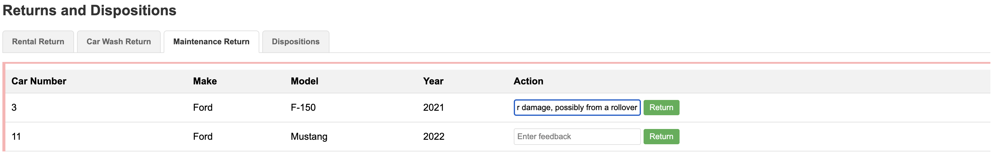

# Step 05 - Using Remote Agents (A2A)

## New Requirement: Distributing the Disposition Service

In Step 4, you implemented a complete disposition system using the Supervisor Pattern with local agents. The system works well, but the Miles of Smiles management team has a new architectural requirement:

**The disposition decision-making logic needs to be maintained by a separate team and run as an independent service.**

This is a common real-world scenario where:

1. **Different teams own different capabilities**: The disposition team has specialized expertise and wants to maintain their own service
2. **The service needs to be reusable**: Multiple client applications (not just car management) might need disposition recommendations
3. **Independent scaling is required**: The disposition service might need different resources than the main application

You'll learn how to convert Step 4's local `DispositionAgent` into a remote service using the [**Agent-to-Agent (A2A) protocol**](https://a2a-protocol.org/){target="_blank"}.

---

## What You'll Learn

In this step, you will:

- Understand the [**Agent-to-Agent (A2A) protocol**](https://a2a-protocol.org/){target="_blank"} for distributed agent communication
- **Convert** Step 4's local `DispositionAgent` into a remote A2A service
- Build a **client agent** that connects to remote A2A agents using `@A2AClientAgent`
- Create an **A2A server** that exposes an AI agent as a remote service
- Learn about **AgentCard**, **AgentExecutor**, and **TaskUpdater** components from the A2A SDK
- Understand the difference between **Tasks** and **Messages** in A2A protocol
- Run **multiple Quarkus applications** that communicate via A2A
- See the architectural trade-offs: lose Supervisor Pattern sophistication, gain distribution benefits

!!!note
   
    At the moment the A2A integration is quite low-level and requires some boilerplate code.
    The Quarkus LangChain4j team is working on higher-level abstractions to simplify A2A usage in future releases.

---

## Understanding the A2A Protocol

The [**Agent-to-Agent (A2A) protocol**](https://a2a-protocol.org/){target="_blank"} is an open protocol for AI agents to communicate across different systems and platforms.

### Why A2A?

- **Separation of concerns**: Different teams can develop specialized agents independently
- **Scalability**: Distribute agent workload across multiple systems
- **Reusability**: One agent can serve multiple client applications
- **Technology independence**: Agents can be implemented in different languages/frameworks

### A2A Architecture


**The Flow:**

1. **Client agent** (`DispositionAgent` with `@A2AClientAgent`) sends a request to the remote agent
2. **A2A Protocol Layer** ([JSON-RPC](https://www.jsonrpc.org/){target="_blank"}) transports the request over HTTP
3. **AgentCard** describes the remote agent's capabilities (skills, inputs, outputs)
4. **AgentExecutor** receives the request and orchestrates the execution
5. **Remote AI agent** (`DispositionAgent` AI service) processes the request using tools
6. Response flows back through the same path

!!!info "Additional A2A Info"
    For more information about the A2A protocol and the actors involved, see the [A2A documentation](https://a2a-protocol.org/latest/topics/key-concepts/#core-actors-in-a2a-interactions){target="_blank"}. 

---

## Understanding Tasks vs. Messages

The A2A protocol distinguishes between [two types of interactions](https://a2a-protocol.org/latest/topics/life-of-a-task/){target="_blank"}:

| Concept | Description | Use Case |
|---------|-------------|----------|
| **Task** | A long-running job with a defined goal and tracked state | "Determine if this car should be scrapped" |
| **Message** | A single conversational exchange with no tracked state | Chat messages, quick questions |

In this step, we'll use **Tasks** because car disposition analysis is a discrete job with a clear objective.

**Task Lifecycle:**


---

## What Are We Going to Build?

{: .center}

We'll convert Step 4's architecture to use remote agents:

1. **Keep DispositionFeedbackAgent**: Still analyzes if a car should be disposed (same as Step 4)
2. **Convert DispositionAgent to A2A Client**: Changes from local agent to remote A2A client
3. **Create Remote A2A Server**: A separate Quarkus application exposing the disposition service

**The Complete Architecture:**


---

## Prerequisites

Before starting:

- **Completed [Step 04](step-04.md){target="_blank"}** - This step directly builds on Step 4's architecture
- Application from Step 04 is stopped (Ctrl+C)
- Ports 8080 and 8888 are available (you'll run two applications simultaneously)
- Understanding of Step 4's Supervisor Pattern (we keep the same pattern, just make DispositionAgent remote)

---

## Understanding the Project Structure

The Step 05 code includes **two separate Quarkus applications**:

```
section-2/step-05/
├── multi-agent-system/          # Main car management application (port 8080)
│   ├── src/main/java/com/carmanagement/
│   │   ├── agentic/
│   │   │   ├── agents/
│   │   │   │   ├── DispositionAgent.java          # A2A client agent
│   │   │   │   └── DispositionFeedbackAgent.java  # Analyzes disposal needs
│   │   │   └── workflow/
│   │   │       ├── FeedbackWorkflow.java          # Parallel analysis
│   │   │       └── CarProcessingWorkflow.java     # Main orchestrator
│   └── pom.xml
│
└── remote-a2a-agent/            # Remote disposition service (port 8888)
    ├── src/main/java/com/demo/
    │   ├── DispositionAgentCard.java       # Describes agent capabilities
    │   ├── DispositionAgentExecutor.java   # Handles A2A requests
    │   ├── DispositionAgent.java           # AI service
    │   └── DispositionTool.java            # Tool for scrap/sell/donate
    └── pom.xml
```

**Why Two Applications?**

- Simulates a real-world scenario where different teams maintain different agents
- The disposition service could be reused by multiple client applications
- Demonstrates cross-application agent communication via A2A

---

!!! warning "Warning: this chapter involves many steps"
    In order to build out the solution, you will need to go through quite a few steps.
    While it is entirely possible to make the code changes manually (or via copy/paste),
    we recommend starting fresh from Step 05 with the changes already applied.
    You will then be able to walk through this chapter and focus on the examples and suggested experiments at the end of this chapter.

=== "Option 2: Start Fresh from Step 05 [Recommended]"

    Navigate to the complete `section-2/step-05/multi-agent-system` directory:
    
    ```bash
    cd section-2/step-05/multi-agent-system
    ```

=== "Option 1: Continue from Step 04"

    If you want to continue building on your previous code, place yourself at the root of your project and copy the updated files:
    
    === "Linux / macOS"
        ```bash
        cp ../step-05/multi-agent-system/pom.xml ./pom.xml
        cp ../step-05/multi-agent-system/src/main/java/com/carmanagement/model/CarInfo.java ./src/main/java/com/carmanagement/model/CarInfo.java
        cp ../step-05/multi-agent-system/src/main/java/com/carmanagement/model/CarStatus.java ./src/main/java/com/carmanagement/model/CarStatus.java
        cp ../step-05/multi-agent-system/src/main/resources/META-INF/resources/css/styles.css ./src/main/resources/META-INF/resources/css/styles.css
        cp ../step-05/multi-agent-system/src/main/resources/META-INF/resources/js/app.js ./src/main/resources/META-INF/resources/js/app.js
        cp ../step-05/multi-agent-system/src/main/resources/META-INF/resources/index.html ./src/main/resources/META-INF/resources/index.html
        cp ../step-05/multi-agent-system/src/main/resources/import.sql ./src/main/resources/import.sql
        ```
    
    === "Windows"
        ```cmd
        copy ..\step-05\multi-agent-system\pom.xml .\pom.xml
        copy ..\step-05\multi-agent-system\src\main\java\com\carmanagement\model\CarInfo.java .\src\main\java\com\carmanagement\model\CarInfo.java
        copy ..\step-05\multi-agent-system\src\main\java\com\carmanagement\model\CarStatus.java .\src\main\java\com\carmanagement\model\CarStatus.java
        copy ..\step-05\multi-agent-system\src\main\resources\META-INF\resources\css\styles.css .\src\main\resources\META-INF\resources\css\styles.css
        copy ..\step-05\multi-agent-system\src\main\resources\META-INF\resources\js\app.js .\src\main\resources\META-INF\resources\js\app.js
        copy ..\step-05\multi-agent-system\src\main\resources\META-INF\resources\index.html .\src\main\resources\META-INF\resources\index.html
        copy ..\step-05\multi-agent-system\src\main\resources\import.sql .\src\main\resources\import.sql
        ```

---

## Part 1: Convert DispositionAgent to A2A Client

The only change needed in the main application is converting the `DispositionAgent` from a local agent to an A2A client agent.

### Step 1: Update the DispositionAgent to A2A Client

**This is the key change from Step 4!** Instead of a local agent with full system messages and logic, we now have a simple client that delegates to a remote service.

**Step 4 Version (Local):**

- Had detailed `@SystemMessage` with disposition criteria
- Made decisions locally using AI

**Step 5 Version (A2A Client):**

- Uses `@A2AClientAgent` to connect to remote service
- Delegates all decision-making to the remote service

In `src/main/java/com/carmanagement/agentic/agents`, update `DispositionAgent.java`:

```java hl_lines="13" title="DispositionAgent.java"
--8<-- "../../section-2/step-05/multi-agent-system/src/main/java/com/carmanagement/agentic/agents/DispositionAgent.java"
```

**Let's break it down:**

#### `@A2AClientAgent` Annotation

```java
@A2AClientAgent(a2aServerUrl = "http://localhost:8888")
```

This annotation transforms the method into an **A2A client**:

- **`a2aServerUrl`**: The URL of the remote A2A server

#### The Method Signature

```java
String processDisposition(
    String carMake,
    String carModel,
    Integer carYear,
    Long carNumber,
    String carCondition,
    String carValue,
    String rentalFeedback
)
```

These parameters are sent to the remote agent as task inputs. The parameters match exactly what the remote DispositionAgent expects (same as Step 4's local version).

**Important:** The `carValue` parameter comes from the PricingAgent that the supervisor invokes first, and `rentalFeedback` provides context about the damage.

#### How It Works

1. When this method is called, Quarkus LangChain4j:
    1. Creates an A2A Task with the method parameters as inputs
    2. Sends the task to the remote server via JSON-RPC
    3. Waits for the remote agent to complete the task
    4. Returns the result as a String

2. No manual HTTP requests needed
3. Type-safe: compile-time checking of parameters
4. Automatic error handling and retries

---

## Part 2: Build the Remote A2A Server

Now let's build the remote disposition service that will handle A2A requests from the main application.

Navigate to the remote-a2a-agent directory:

```bash
cd section-2/step-05/remote-a2a-agent
```

### Step 2: Create the DispositionTool

The tool that executes disposition actions (scrap, sell, donate).

In `src/main/java/com/demo`, create `DispositionTool.java`:

```java title="DispositionTool.java"
--8<-- "../../section-2/step-05/remote-a2a-agent/src/main/java/com/demo/DispositionTool.java"
```

**Key Points:**

- **One method**: `requestDisposition`
- **@Tool annotation**: Makes each method available to the AI agent
- **Detailed descriptions**: Help the AI agent choose the appropriate action

### Step 3: Create the DispositionAgent (AI Service)

The AI agent that actually makes disposition decisions.

In `src/main/java/com/demo`, create `DispositionAgent.java`:

```java title="DispositionAgent.java"
--8<-- "../../section-2/step-05/remote-a2a-agent/src/main/java/com/demo/DispositionAgent.java"
```

**Key Points:**

- **`@RegisterAiService`**: Registers this as an AI service (not an agentic agent)
- **`@ToolBox(DispositionTool.class)`**: Has access to the DispositionTool
- **System message**: Identical to step-04's local DispositionAgent - defines decision criteria for SCRAP/SELL/DONATE/KEEP
- **Parameters**: Same as step-04 - includes carValue (from PricingAgent) and rentalFeedback
- **Decision logic**: Identical to step-04 - considers value, age, condition, and damage

!!!note "AI Service vs. Agentic Agent"
    Notice this is a **traditional AI service** (from Section 1), not an agentic workflow. 
    The A2A server can expose both types.

### Step 4: Create the AgentCard

The **AgentCard** describes the agent's capabilities, skills, and interface.

In `src/main/java/com/demo`, create `DispositionAgentCard.java`:

```java hl_lines="19-21" title="DispositionAgentCard.java"
--8<-- "../../section-2/step-05/remote-a2a-agent/src/main/java/com/demo/DispositionAgentCard.java"
```

**Let's break it down:**

#### `@PublicAgentCard` Annotation

```java
@Produces
@PublicAgentCard
public AgentCard agentCard();
```

This makes the AgentCard available at the `/card` endpoint. 
Clients can query this endpoint to discover the agent's capabilities.

#### AgentCard Components

**Basic Information:**
```java
.name("Disposition Agent")
.description("Determines how a car should be disposed of based on the car condition and disposition request.")
.url("http://localhost:8888/")
.version("1.0.0")
```

**Capabilities:**
```java
.capabilities(new AgentCapabilities.Builder()
        .streaming(true)
        .pushNotifications(false)
        .stateTransitionHistory(false)
        .build())
```

**Skills:**
```java
.skills(List.of(new AgentSkill.Builder()
    .id("disposition")
    .name("Car disposition")
    .description("Makes a request to dispose of a car (SCRAP, SELL, or DONATE)")
    .tags(List.of("disposition"))
    .build()))
```

Skills describe what the agent can do. This helps clients discover appropriate agents for their needs.

**Transport Protocol:**
```java
.preferredTransport(TransportProtocol.JSONRPC.asString())
.additionalInterfaces(List.of(
        new AgentInterface(TransportProtocol.JSONRPC.asString(), "http://localhost:8888")))
```

Specifies that this agent communicates via JSON-RPC over HTTP.

### Step 5: Create the AgentExecutor

The **AgentExecutor** handles incoming A2A requests and orchestrates the AI agent.

In `src/main/java/com/demo`, create `DispositionAgentExecutor.java`:

```java title="DispositionAgentExecutor.java"
--8<-- "../../section-2/step-05/remote-a2a-agent/src/main/java/com/demo/DispositionAgentExecutor.java"
```

**Let's break it down:**

#### CDI Bean with AgentExecutor Factory

```java
@ApplicationScoped
public class DispositionAgentExecutor {
    @Produces
    public AgentExecutor agentExecutor(DispositionAgent dispositionAgent)
```

Produces an `AgentExecutor` bean that Quarkus LangChain4j will use to handle A2A task requests.

#### Task Processing

```java
public void execute(RequestContext context, EventQueue eventQueue) {
    TaskUpdater updater = new TaskUpdater(context, eventQueue);
    if (context.getTask() == null) {
        updater.submit();
    }
    updater.startWork();

    List<String> inputs = new ArrayList<>();
    
    // Process the request message
    Message message = context.getMessage();
    if (message.getParts() != null) {
        for (Part<?> part : message.getParts()) {
            if (part instanceof TextPart textPart) {
                inputs.add(textPart.getText());
            }
        }
    }
```

The `RequestContext` contains the incoming message with all input parameters sent by the client as text parts.

#### Extract Parameters

```java
String agentResponse = dispositionAgent.processDisposition(
        inputs.get(0),                      // carMake
        inputs.get(1),                      // carModel
        Integer.parseInt(inputs.get(2)),    // carYear
        Long.parseLong(inputs.get(3)),      // carNumber
        inputs.get(4),                      // carCondition
        inputs.get(5),                      // carValue (from PricingAgent)
        inputs.get(6));                     // rentalFeedback
```

Extracts each parameter by index from the message parts. The order and parameters match step-04's local DispositionAgent exactly.

#### Return the Result

```java
TextPart responsePart = new TextPart(agentResponse, null);
List<Part<?>> parts = List.of(responsePart);
updater.addArtifact(parts, null, null, null);
updater.complete();
```

Creates a text part with the agent's response and sends it back to the client via the `TaskUpdater`. This completes the A2A task.

#### Cancel Handler

```java
@Override
public void cancel(RequestContext context, EventQueue eventQueue) throws JSONRPCError {
    throw new UnsupportedOperationError();
}
```

The cancel method is required by the interface but not implemented for this simple agent.

---

## Try It Out

You'll need to run **two applications simultaneously**.

### Terminal 1: Start the Remote A2A Server

```bash
cd section-2/step-05/remote-a2a-agent
./mvnw quarkus:dev
```

Wait for:
```
Listening on: http://localhost:8888
```

The disposition service is now running and ready to accept A2A requests!

### Terminal 2: Start the Main Application

Open a **new terminal** and run:

```bash
cd section-2/step-05/multi-agent-system
./mvnw quarkus:dev
```

Wait for:
```
Listening on: http://localhost:8080
```

### Test the Complete Flow

Open your browser to [http://localhost:8080](http://localhost:8080){target=_blank}.

You'll see the same UI as Step 4 with the **Returns and Dispositions** section and the **Dispositions** tab (introduced in Step 4).

{: .center}

On the Maintenance Return tab, enter feedback indicating severe damage for the Ford F-150:

```
looks like this car hit a tree
```

Click **Return**.

**What happens?**

1. **Parallel Analysis** (FeedbackWorkflow):
    1. `DispositionFeedbackAgent`: "Disposition required — severe damage"
    2. `MaintenanceFeedbackAgent`: "Major repairs needed"
    3. `CleaningFeedbackAgent`: "Not applicable"

2. **Supervisor Orchestration** (FleetSupervisorAgent):
    1. Analyzes feedback and determines disposition is required
    2. Invokes PricingAgent to estimate vehicle value
    3. Invokes DispositionAgent (remote via A2A)
    2. → Executes `DispositionAgent` (A2A client)

3. **A2A Communication**:
    1. Client sends task to `http://localhost:8888`
    2. `AgentExecutor` receives and processes task
    3. `DispositionAgent` (AI service) analyzes using `DispositionTool`
    4. Result flows back to client

4. **UI Update**:
    1. Car status → `DISPOSED`
    2. Car appears in the Dispositions tab

### Check the Logs

**Terminal 1 (Remote A2A Server):**
```
⛍ DispositionTool result: Ford F-150 (2021), Car #11: Scrap the car
```

**Terminal 2 (Main Application):**
```
[DispositionFeedbackAgent] DISPOSITION_REQUIRED - Severe structural damage, uneconomical to repair
[FleetSupervisorAgent] Invoking PricingAgent for value estimation
[PricingAgent] Estimated Value: $12,500
[FleetSupervisorAgent] Invoking DispositionAgent
[DispositionAgent @A2AClientAgent] Sending task to http://localhost:8888
[DispositionAgent @A2AClientAgent] Received result: Car should be scrapped...
```

Notice the **cross-application communication** via A2A!

---

## How It All Works Together

Let's trace the complete flow:


---

## Understanding the A2A Implementation

### Client Side (`@A2AClientAgent`)

The client agent is remarkably simple:

```java
@A2AClientAgent(a2aServerUrl = "http://localhost:8888", ...)
String processDisposition(...)
```

Quarkus LangChain4j handles:

- Creating the A2A task
- Serializing method parameters as task inputs
- Sending the HTTP request via JSON-RPC
- Waiting for the response
- Deserializing the result
- Error handling and retries

### Server Side (AgentCard + AgentExecutor)

The server requires more components:

| Component | Purpose |
|-----------|---------|
| **AgentCard** | Describes agent capabilities, published at `/card` endpoint |
| **AgentExecutor** | Receives and processes A2A task requests |
| **TaskUpdater** | Updates task status and sends results back to client |
| **AI Agent** | The actual AI service that processes requests |
| **Tools** | Actions the AI agent can perform |

This separation allows:
- Agents to focus on business logic
- A2A infrastructure to handle protocol details
- Multiple agents to be exposed from one server

---

## Key Takeaways

- **A2A enables distributed agents**: Different teams can maintain specialized agents in separate systems
- **`@A2AClientAgent` is powerful**: Simple annotation transforms a method into an A2A client
- **AgentCard describes capabilities**: Clients can discover what remote agents can do
- **AgentExecutor handles protocol**: Separates A2A infrastructure from agent logic
- **Tasks vs. Messages**: A2A supports both task-based and conversational interactions
- **Type-safe integration**: Method parameters automatically become task inputs
- **Remote agents integrate seamlessly**: Works with existing workflows and agents
- **Two runtimes communicate**: Real-world simulation of distributed agent systems
- **Architectural trade-offs**: We traded Step 4's sophisticated Supervisor Pattern for simpler Conditional routing to enable distribution
- **Distribution benefits**: The disposition service can now be maintained independently, scaled separately, and reused by other applications

---

## Experiment Further

### 1. Add Agent Discovery

The AgentCard is published at `http://localhost:8888/card`. Try:

```bash
curl http://localhost:8888/card | jq
```

You'll see the full agent description including skills, capabilities, and transport protocols.

### 2. Test Different Disposition Scenarios

Try these feedback examples:

**Scenario 1: Sell the car**
```
Minor engine issues, good body condition, low mileage. Repair cost: $800.
```

**Scenario 2: Donate the car**
```
Old car, high mileage, runs but needs work. Market value low.
```

**Scenario 3: Scrap the car**
```
Total loss from flood damage, electrical system destroyed.
```

Observe how the remote agent makes different decisions!

### 3. Create Your Own A2A Agent

What other specialized agents could be useful?

- **Pricing Agent**: Determines optimal rental pricing based on demand
- **Route Planner Agent**: Plans maintenance schedules for the fleet
- **Insurance Agent**: Assesses insurance claims for damaged cars

Try creating a simple A2A server for one of these!

### 4. Monitor A2A Communication

Add logging to see the JSON-RPC messages:

```properties
# In application.properties
quarkus.log.category."io.a2a".level=DEBUG
```

This shows the raw A2A protocol messages.

---

## Troubleshooting

??? warning "Connection refused to localhost:8888"
    Make sure the remote A2A server is running in Terminal 1. Check for:
    ```
    Listening on: http://localhost:8888
    ```

    If you see "Port already in use", another application is using port 8888. You can change it in `remote-a2a-agent/src/main/resources/application.properties`:
    ```properties
    quarkus.http.port=8889
    ```

    Then update the client's `a2aServerUrl` accordingly.

??? warning "Task execution timeout"
    If the remote agent takes too long to respond, you might see a timeout error. The default timeout is sufficient for most cases, but you can increase it if needed by configuring the A2A client.

??? warning "Parameter mismatch errors"
    If you see errors about missing parameters, verify that:

    - Client agent method parameter names match what AgentExecutor extracts
    - The `getTextPart()` / `getIntegerPart()` calls use the correct keys
    - All required parameters are being sent by the client

??? warning "Agent not activating"
    If the DispositionAgent never executes, check:

    - The `@ActivationCondition` method is correctly implemented
    - The `dispositionRequest` contains `"DISPOSITION_REQUIRED"`
    - The condition is being checked in the correct order

??? warning "Both applications on same port"
    If you see "Port already in use" on 8080:

    - Make sure you stopped the application from Step 04
    - Only run the main application from `multi-agent-system`, not from a previous step directory
    - Check for zombie Java processes: `ps aux | grep java`

---

## What's Next?

You've successfully converted Step 4's local disposition system into a distributed agent system using the A2A protocol!

You learned how to:

- Convert local agents to remote A2A services
- Connect to remote agents using `@A2AClientAgent`
- Build A2A servers with AgentCard and AgentExecutor
- Integrate remote agents into complex workflows
- Run multiple Quarkus applications that communicate via A2A
- Understand the architectural trade-offs between local and distributed agents

**Key Progression:**
- **Step 4**: Sophisticated local orchestration with Supervisor Pattern
- **Step 5**: Distributed architecture with A2A protocol

This completes **Section 2: Agentic Systems**! You've progressed from simple agents to complex distributed workflows with remote agent communication.

**Congratulations!** You now have the skills to build sophisticated multi-agent systems with Quarkus LangChain4j!

---

## Additional Resources

- [A2A Protocol Specification](https://a2a.dev)
- [Quarkus LangChain4j Documentation](https://docs.quarkiverse.io/quarkus-langchain4j/dev/)
- [Quarkus LangChain4j Agentic Module](https://docs.quarkiverse.io/quarkus-langchain4j/dev/agentic.html)
