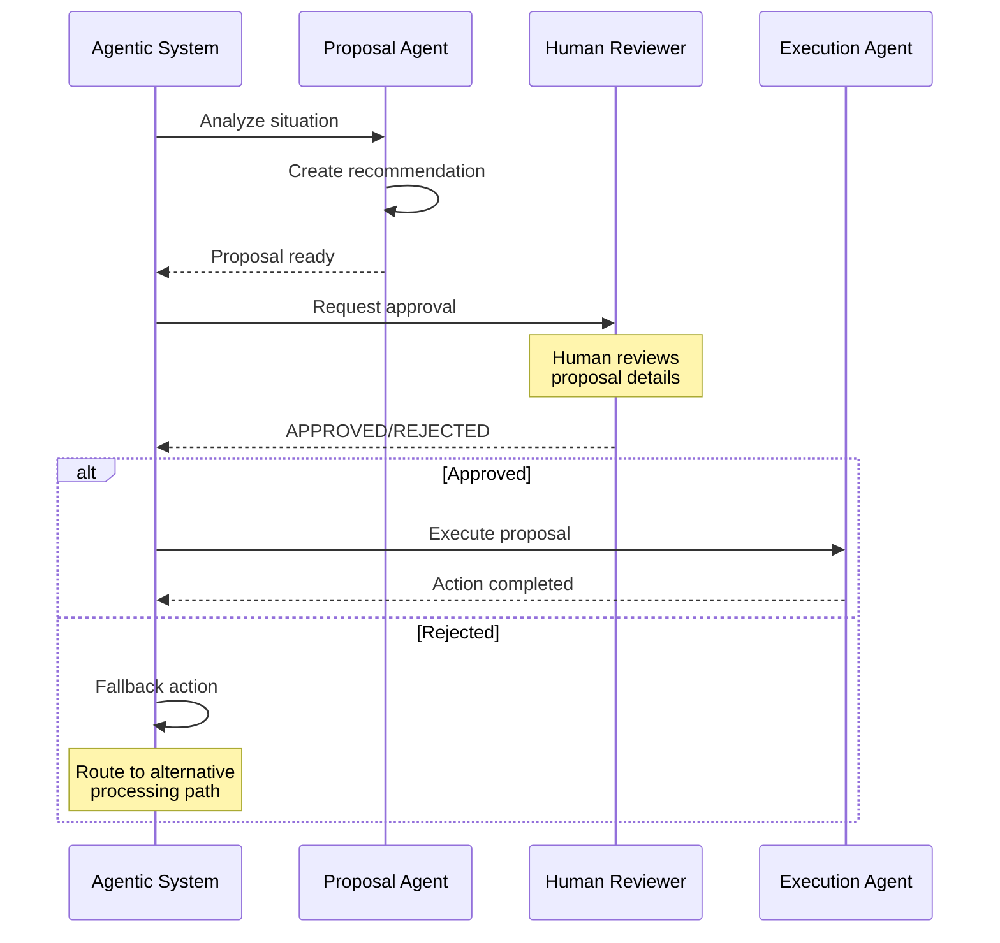
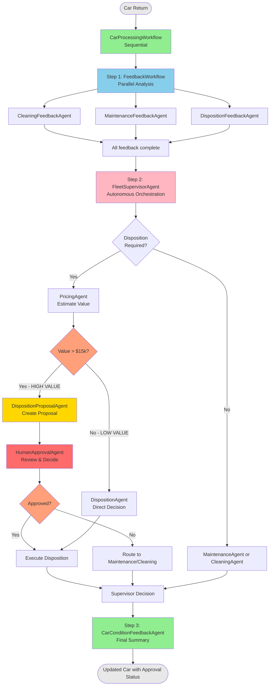
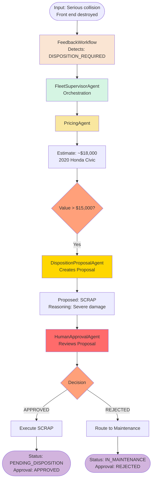
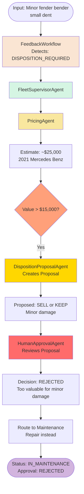
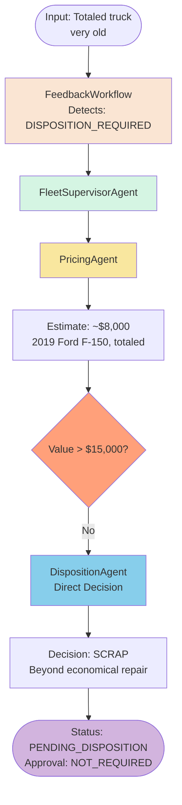

# Step 06 - Human-in-the-Loop Pattern

## Human-in-the-Loop Pattern

In the previous step, you built a **distributed agent system** using Agent-to-Agent (A2A) communication, where the DispositionAgent ran as a remote service.

However, that system made autonomous decisions about vehicle disposition without human oversight. What if you need **human approval** before executing high-stakes decisions, especially for valuable assets?

In this step, you'll learn about the **Human-in-the-Loop (HITL) pattern** - a critical approach where AI agents pause execution to request human approval before proceeding with significant actions.

---

## New Requirement from Miles of Smiles Management: Human Approval for High-Value Dispositions

The Miles of Smiles management team has identified a risk: the system is making autonomous disposition decisions on high-value vehicles without human oversight.

They want to implement a **human approval gate** with these requirements:

1. **Value threshold**: Any vehicle worth more than **$15,000** requires human approval before disposition
2. **Two-phase workflow**: 
   - Phase 1: AI creates a disposition **proposal**
   - Phase 2: Human reviews and **approves or rejects** the proposal
3. **Execution control**: Only execute approved dispositions
4. **Audit trail**: Track approval status and reasoning for compliance

This ensures that expensive vehicles aren't scrapped or sold without proper human review.

---

## What You'll Learn

In this step, you will:

- Understand the **Human-in-the-Loop (HITL) pattern** and when to use it
- Implement a **two-phase approval workflow** (proposal → review → execution)
- Create a **DispositionProposalAgent** that generates proposals
- Build a **HumanApprovalAgent** that simulates human decision-making
- Modify the **FleetSupervisorAgent** to route high-value vehicles through approval
- Add **approval tracking** to the data model
- See how HITL provides **safety and control** in autonomous systems

---

## Understanding Human-in-the-Loop

### What is Human-in-the-Loop?

**Human-in-the-Loop (HITL)** is a pattern where:

- AI agents perform analysis and create recommendations
- Execution **pauses** to request human approval
- Humans review proposals and make final decisions
- System proceeds only after approval

### Why Use Human-in-the-Loop?

HITL is essential when:

- **High-stakes decisions**: Financial impact, safety concerns, legal implications
- **Regulatory compliance**: Certain industries require human oversight
- **Trust building**: Gradual transition from manual to autonomous processes
- **Edge cases**: Unusual situations that AI might handle incorrectly
- **Accountability**: Clear human responsibility for critical decisions

### HITL vs. Fully Autonomous

| Aspect | Fully Autonomous | Human-in-the-Loop |
|--------|------------------|-------------------|
| **Speed** | Fast, immediate | Slower, waits for human |
| **Scalability** | Unlimited | Limited by human capacity |
| **Accuracy** | Consistent but may miss edge cases | Human judgment for complex cases |
| **Accountability** | System responsibility | Human responsibility |
| **Cost** | Lower operational cost | Higher due to human involvement |

### The Two-Phase Workflow



**Key Points:**

1. **Proposal Phase**: AI analyzes and creates a recommendation
2. **Approval Gate**: Human reviews and decides
3. **Execution Phase**: System acts only if approved
4. **Fallback**: Alternative path if rejected

---

## What is Being Added?

We're enhancing our car management system with:

- **DispositionProposalAgent**: Creates disposition proposals for review
- **HumanApprovalAgent**: Simulates human approval decisions (in production, this would integrate with a real approval system)
- **Updated FleetSupervisorAgent**: Routes high-value vehicles through the approval workflow
- **Enhanced CarConditions**: Tracks approval status and reasoning
- **Value-based routing**: Different paths for high-value vs. low-value vehicles

### The Complete HITL Architecture



**The Key Innovation:**

The **FleetSupervisorAgent** now implements value-based routing:

- **High-value path** (>$15,000): PricingAgent → DispositionProposalAgent → HumanApprovalAgent → Execute if approved
- **Low-value path** (≤$15,000): PricingAgent → DispositionAgent → Execute directly
- **Fallback**: If approval rejected, route to maintenance or cleaning instead

---

## Implementing the Human-in-the-Loop Pattern

Let's build the HITL system step by step.

### Create the DispositionProposalAgent

This agent creates disposition proposals that will be reviewed by humans.

Create `src/main/java/com/carmanagement/agentic/agents/DispositionProposalAgent.java`:

```java title="DispositionProposalAgent.java" hl_lines="14-29 38-48 51"
--8<-- "../../section-2/step-06/src/main/java/com/carmanagement/agentic/agents/DispositionProposalAgent.java"
```

**Key Points:**

- Creates **proposals** rather than final decisions
- Uses same decision criteria as DispositionAgent
- Output format includes "Proposed Action" and "Reasoning"
- Stored in AgenticScope with key `dispositionProposal`

### Create the HumanApprovalAgent

This agent implements TRUE Human-in-the-Loop by using a tool that **actually pauses workflow execution** until a human makes a decision through the UI.

Create `src/main/java/com/carmanagement/agentic/agents/HumanApprovalAgent.java`:

```java title="HumanApprovalAgent.java" hl_lines="14-35 38-58"
--8<-- "../../section-2/step-06/src/main/java/com/carmanagement/agentic/agents/HumanApprovalAgent.java"
```

**Key Points:**

- Uses the `requestHumanApproval` tool which **BLOCKS execution** until human decides
- The tool calls `HumanInputService.requestInput()` which returns a `CompletableFuture`
- Workflow execution pauses by calling `.get()` on the future
- Human sees pending approval in the UI and clicks Approve/Reject
- The future completes, workflow resumes with the human's decision
- Returns structured decision: APPROVED/REJECTED with reasoning
- Stored in AgenticScope with key `approvalDecision`

### Create the HumanApprovalTool

This tool implements the actual blocking mechanism for TRUE HITL.

Create `src/main/java/com/carmanagement/agentic/tools/HumanApprovalTool.java`:

```java title="HumanApprovalTool.java"
--8<-- "../../section-2/step-06/src/main/java/com/carmanagement/agentic/tools/HumanApprovalTool.java"
```

**Key Points:**

- Creates an approval proposal in the database
- Returns a `CompletableFuture<ApprovalProposal>` that completes when human decides
- **Blocks by calling `.get(5, TimeUnit.MINUTES)`** - this is where the workflow pauses!
- Workflow thread waits here until human clicks Approve/Reject in UI
- Includes 5-minute timeout for safety
- Returns human's decision to the agent

### Create the ApprovalService

This service manages the CompletableFutures that pause workflow execution.

Create `src/main/java/com/carmanagement/service/ApprovalService.java`:

```java title="ApprovalService.java"
--8<-- "../../section-2/step-06/src/main/java/com/carmanagement/service/ApprovalService.java"
```

**Key Points:**

- Stores `CompletableFuture<ApprovalProposal>` in a map keyed by car number
- `createProposalAndWaitForDecision()` creates the future and returns it
- Proposal is persisted in a separate transaction to ensure it's visible to UI queries
- `processDecision()` completes the future when human makes a decision
- This completion **resumes the workflow** that was blocked on `.get()`

### Create the ApprovalProposal Entity

This entity stores proposals in the database so the UI can display them.

Create `src/main/java/com/carmanagement/model/ApprovalProposal.java`:

```java title="ApprovalProposal.java"
--8<-- "../../section-2/step-06/src/main/java/com/carmanagement/model/ApprovalProposal.java"
```

### Create the ApprovalResource

This REST resource allows the UI to fetch pending approvals and submit decisions.

Create `src/main/java/com/carmanagement/resource/ApprovalResource.java`:

```java title="ApprovalResource.java"
--8<-- "../../section-2/step-06/src/main/java/com/carmanagement/resource/ApprovalResource.java"
```

**REST API Endpoints:**

- `GET /api/approvals/pending` - Returns all pending approval proposals
- `POST /api/approvals/{id}/approve` - Approve a proposal
- `POST /api/approvals/{id}/reject` - Reject a proposal

!!!success "TRUE Human-in-the-Loop Implementation"
    This is a **TRUE HITL implementation** where:
    
    - ✅ Workflow execution **actually pauses** when approval is needed
    - ✅ The workflow thread **blocks** on `CompletableFuture.get()`
    - ✅ Human sees pending approvals in the **real-time UI**
    - ✅ Human clicks **Approve/Reject buttons** in the UI
    - ✅ The future **completes** with the human's decision
    - ✅ Workflow **resumes** and continues with the decision
    - ✅ Includes **timeout handling** (5 minutes)
    - ✅ Full **audit trail** in the database

### Update the FleetSupervisorAgent

Modify the supervisor to implement value-based routing with the approval workflow.

Update `src/main/java/com/carmanagement/agentic/agents/FleetSupervisorAgent.java`:

```java title="FleetSupervisorAgent.java" hl_lines="10 24-35 40-46 49-51"
--8<-- "../../section-2/step-06/src/main/java/com/carmanagement/agentic/agents/FleetSupervisorAgent.java"
```

**Key Changes:**

- Added **DispositionProposalAgent** and **HumanApprovalAgent** to subAgents
- Implemented **two-path routing** based on vehicle value
- High-value path: Proposal → Approval → Execute if approved
- Low-value path: Direct disposition decision
- Stores approval status in AgenticScope for tracking

### Update the CarConditions Model

Add approval tracking fields to the data model.

Update `src/main/java/com/carmanagement/model/CarConditions.java`:

```java title="CarConditions.java" hl_lines="8-9 11-15 20-22"
--8<-- "../../section-2/step-06/src/main/java/com/carmanagement/model/CarConditions.java"
```

**Key Points:**

- Added `approvalStatus` field (APPROVED/REJECTED/NOT_REQUIRED)
- Added `approvalReason` field for audit trail
- Backward-compatible constructor for existing code

### Update Application Configuration

Add configuration for the approval threshold.

Update `src/main/resources/application.properties`:

```properties
# Human-in-the-Loop configuration
# Threshold for requiring human approval on high-value dispositions
car-management.approval.threshold=15000
```

This makes the threshold configurable without code changes.

---

## Try the Complete Solution

Now let's see the Human-in-the-Loop pattern in action!

### Start the Application

1. Navigate to the step-06 directory:

```bash
cd section-2/step-06
```

2. Start the application:

=== "Linux / macOS"
    ```bash
    ./mvnw quarkus:dev
    ```

=== "Windows"
    ```cmd
    mvnw quarkus:dev
    ```

3. Open [http://localhost:8080](http://localhost:8080){target="_blank"}

### Test HITL Scenarios

Try these scenarios to see how the approval workflow handles different vehicle values:

#### Scenario 1: High-Value Vehicle Requiring Approval

Enter the following text in the feedback field for the **Honda Civic**:

```text
The car was in a serious collision. Front end is completely destroyed and airbags deployed.
```

**What happens:**



**Expected Result:**

- PricingAgent estimates value at ~$18,000 (above threshold)
- DispositionProposalAgent creates SCRAP proposal
- HumanApprovalAgent reviews and likely APPROVES (severe damage justifies scrapping)
- Status: `PENDING_DISPOSITION`
- Condition includes approval status and reasoning

#### Scenario 2: High-Value Vehicle - Approval Rejected

Enter the following text in the **Mercedes Benz** feedback field:

```text
Minor fender bender, small dent in rear bumper
```

**What happens:**



**Expected Result:**

- PricingAgent estimates value at ~$25,000 (high value)
- DispositionProposalAgent suggests SELL or KEEP
- HumanApprovalAgent REJECTS (too valuable for disposition with minor damage)
- Fallback: Routes to MaintenanceAgent instead
- Status: `IN_MAINTENANCE`
- Approval status: `REJECTED` with reasoning

#### Scenario 3: Low-Value Vehicle - No Approval Needed

Enter the following text in the **Ford F-150** feedback field (Maintenance Returns tab):

```text
The truck is totaled, completely inoperable, very old
```

**What happens:**



**Expected Result:**

- PricingAgent estimates value at ~$8,000 (below threshold)
- Skips approval workflow (low value)
- DispositionAgent makes direct SCRAP decision
- Status: `PENDING_DISPOSITION`
- Approval status: `NOT_REQUIRED`

### Check the Logs

Watch the console output to see the approval workflow execution:

```bash
FeedbackWorkflow executing...
  ├─ DispositionFeedbackAgent: DISPOSITION_REQUIRED
FleetSupervisorAgent orchestrating...
  ├─ PricingAgent: Estimated value $18,000
  ├─ Value check: $18,000 > $15,000 → Approval required
  ├─ DispositionProposalAgent: Proposed SCRAP
  ├─ HumanApprovalAgent: Reviewing proposal...
  └─ Decision: APPROVED - Severe damage justifies scrapping
CarConditionFeedbackAgent updating...
  └─ Approval status: APPROVED
```

Notice how high-value vehicles go through the proposal → approval → execution flow!

---

## Why Human-in-the-Loop Matters

### Safety and Control

HITL provides a **safety net** for autonomous systems:

- **Prevents costly mistakes**: Human review catches edge cases
- **Builds trust**: Gradual transition from manual to autonomous
- **Maintains accountability**: Clear human responsibility for critical decisions

### Compliance and Audit

Many industries require human oversight:

- **Financial services**: Large transactions need approval
- **Healthcare**: Treatment decisions require physician review
- **Legal**: Contract terms need lawyer approval
- **Audit trails**: Track who approved what and when

### Balancing Automation and Control

HITL lets you **tune the automation level**:


- Start with **low threshold** (approve everything)
- Gradually **increase threshold** as confidence grows
- Eventually move to **fully autonomous** for routine cases
- Keep HITL for **high-stakes decisions**

---

## Optional: Implement It Yourself

If you want hands-on practice implementing the HITL pattern, you can build it step-by-step.

!!!warning "Short on time?"
    The complete solution is available in `section-2/step-06`.
    You can explore the code there if you prefer to move forward quickly.

### Prerequisites

Before starting:

- Completed [Step 05](step-05.md){target="_blank"} (or have the `section-2/step-05/multi-agent-system` code available)
- Application from Step 05 is stopped (Ctrl+C)

### Implementation Steps

1. **Copy the step-05 code** to create step-06 base
2. **Create DispositionProposalAgent.java** with proposal generation logic
3. **Create HumanApprovalAgent.java** with approval simulation
4. **Update FleetSupervisorAgent.java** to add value-based routing
5. **Update CarConditions.java** to add approval fields
6. **Update application.properties** with approval threshold
7. **Test** with different vehicle values

Follow the code examples shown earlier in this guide.

---

## Experiment Further

### 1. Implement Real Human Approval

Replace the simulated HumanApprovalAgent with a real approval system:

- Store proposals in a database with PENDING status
- Send email/Slack notifications to approvers
- Create a web UI for reviewing proposals
- Use async processing to wait for human response

### 2. Add Approval Workflows

Implement multi-level approval:

- $15,000-$25,000: Single approver
- $25,000-$50,000: Two approvers
- >$50,000: Manager approval required

### 3. Track Approval Metrics

Add monitoring:

- Approval rate by value range
- Average approval time
- Rejection reasons analysis
- Approver performance metrics

### 4. Implement Approval Timeouts

Add time limits:

- Auto-reject after 24 hours
- Escalate to manager after 48 hours
- Send reminder notifications

### 5. Add Approval History

Track all approvals:

- Who approved/rejected
- When the decision was made
- Reasoning provided
- Outcome of the decision

---

## Troubleshooting

??? warning "All vehicles going through approval workflow"
    Check that the value threshold is correctly configured in `application.properties` and that the PricingAgent is returning numeric values that can be compared.

??? warning "Approval agent always approving/rejecting"
    Review the approval criteria in HumanApprovalAgent's system message. The simulated logic may need adjustment based on your test scenarios.

??? warning "Approval status not being tracked"
    Verify that:
    
    - FleetSupervisorAgent stores `approvalStatus` and `approvalReason` in AgenticScope
    - CarConditions model has the new fields
    - CarProcessingWorkflow retrieves these values from the scope

??? warning "Low-value vehicles still requiring approval"
    Check the value comparison logic in FleetSupervisorAgent. Ensure the PricingAgent output is being parsed correctly as a number.

---

## What's Next?

Congratulations! You've completed the final step of Section 2 and implemented the **Human-in-the-Loop pattern** for safe, controlled autonomous decision-making!

The system now:

- Routes high-value vehicles through human approval
- Creates proposals for human review
- Tracks approval decisions for audit trails
- Provides fallback paths for rejected proposals
- Balances automation with human oversight

Ready to wrap up? Head to the conclusion to review everything you've learned and see how these patterns apply to real-world scenarios!

[Continue to Conclusion - Mastering Agentic Systems](conclusion.md)