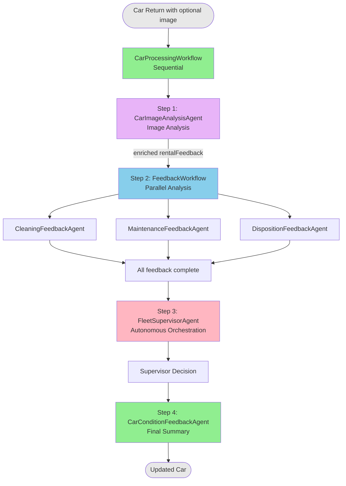
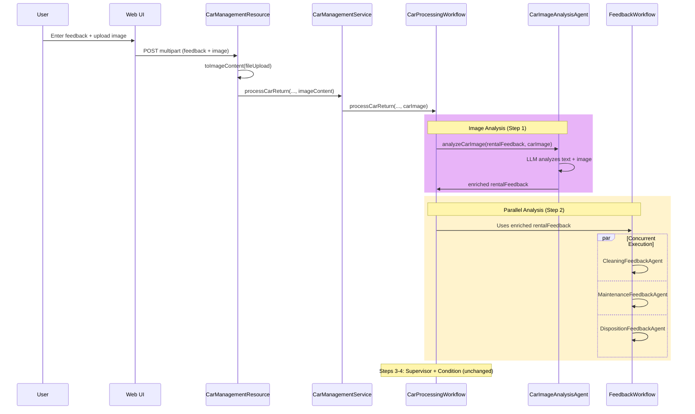

# Step 06 - Multimodal Agents

## New Requirement: Visual Car Inspection

In Step 5, you implemented the Human-in-the-Loop pattern for safe, controlled disposition decisions. The system relies entirely on textual feedback from employees returning cars. But what if the person returning the car could also **upload a photo**?

The Miles of Smiles management team wants to enhance the rental return process:

**Allow employees to optionally upload an image of the car when returning it, so the system can automatically enrich the rental feedback with visual observations.**

This is a common real-world scenario where:

1. **Text alone is insufficient**: An employee might write "car looks fine" but a photo reveals scratches or dents they missed
2. **Multimodal AI is powerful**: Modern LLMs can analyze images alongside text to provide richer assessments

You'll learn how to integrate **multimodal capabilities** (text + image) into your existing agentic workflow using LangChain4j's `ImageContent`.

---

## What You'll Learn

In this step, you will:

- Add **image upload** to the Rental Return UI using multipart form data
- Convert uploaded images to LangChain4j's **`ImageContent`** for multimodal processing
- Create a **`CarImageAnalysisAgent`** that analyzes car images and enriches rental feedback
- Integrate the new agent at the beginning of the existing **`CarProcessingWorkflow`** sequence
- Understand how `ImageContent` flows through agent parameters using `@UserMessage`
- See how the agent gracefully handles the **absence of an image**, returning the feedback unchanged

---

## Understanding Multimodal Agents

### What is Multimodal Processing?

**Multimodal processing** allows an AI agent to work with multiple types of content simultaneously — in this case, **text and images**. Instead of just reading feedback like "the car has some damage", the agent can also _see_ the car and identify specific issues.

### How LangChain4j Handles Images

LangChain4j provides the `ImageContent` class to represent image data in messages sent to the LLM:

- **`ImageContent`**: Wraps an image (as base64-encoded data with a MIME type) as a content part
- When passed as a method parameter annotated with `@UserMessage`, it is automatically included alongside text in the message sent to the LLM
- The LLM receives both the text prompt and the image, enabling visual reasoning

### The Enrichment Pattern

Rather than creating a separate "image analysis" output, the `CarImageAnalysisAgent` uses an **enrichment pattern**:

1. Receives the original rental feedback text and an optional car image
2. If an image is present, analyzes it and **appends visual observations** to the feedback
3. If no image is present, returns the feedback **unchanged**
4. The enriched feedback then flows into the existing `FeedbackWorkflow` — no downstream changes needed

This is elegant because it preserves the existing workflow structure while adding new capabilities.

---

## What Are We Going to Build?

We're enhancing the car management system with multimodal image analysis:

1. **Update the UI**: Add an image upload field to the Rental Return tab
2. **Update the REST endpoint**: Accept multipart form data with an optional image
3. **Convert to `ImageContent`**: Transform the uploaded file into a LangChain4j `ImageContent`
4. **Create `CarImageAnalysisAgent`**: A new agent that analyzes car images
5. **Update the workflow**: Insert the new agent at the beginning of the sequence

**The Updated Architecture:**


```mermaid
graph TB
    Start([Car Return with optional image]) --> A[CarProcessingWorkflow<br/>Sequential]

    A --> IMG[Step 1: CarImageAnalysisAgent<br/>Image Analysis]
    IMG -->|enriched rentalFeedback| B[Step 2: FeedbackWorkflow<br/>Parallel Analysis]
    B --> B1[CleaningFeedbackAgent]
    B --> B2[MaintenanceFeedbackAgent]
    B --> B3[DispositionFeedbackAgent]
    B1 --> BEnd[All feedback complete]
    B2 --> BEnd
    B3 --> BEnd

    BEnd --> C[Step 3: FleetSupervisorAgent<br/>Autonomous Orchestration]
    C --> CEnd[Supervisor Decision]

    CEnd --> D[Step 4: CarConditionFeedbackAgent<br/>Final Summary]
    D --> End([Updated Car])

    style A fill:#90EE90
    style IMG fill:#E8B4F8
    style B fill:#87CEEB
    style C fill:#FFB6C1
    style D fill:#90EE90
    style Start fill:#E8E8E8
    style End fill:#E8E8E8
```

**The Key Innovation:**

The **`CarImageAnalysisAgent`** sits at the beginning of the sequence, _before_ the `FeedbackWorkflow`. Its output key is `rentalFeedback`, which means it **replaces** the original rental feedback in the agentic scope with the enriched version. All downstream agents automatically receive the enriched feedback without any code changes.

---

## Prerequisites

Before starting:

- **Completed [Step 05](step-05.md){target="_blank"}** — This step builds on Step 5's architecture
- Application from Step 05 is stopped (Ctrl+C)
- Understanding of the existing `CarProcessingWorkflow` sequence

---

## Part 1: Update the UI for Image Upload

### Update the HTML

Add a "Car Image" column to the Rental Return table in `index.html`:

```html title="index.html (Rental Return table header)"
<tr>
    <th>Car Number</th>
    <th>Make</th>
    <th>Model</th>
    <th>Year</th>
    <th>Car Image</th>
    <th>Action</th>
</tr>
```

Each car row now includes a file input for optional image upload:

```html title="index.html (Rental Return table row — generated by JavaScript)"
<td>
    <input type="file" id="rental-image-${car.id}" accept="image/*">
</td>
```

### Update the JavaScript

The `returnFromRental` function is updated to send a `FormData` object (multipart) instead of a simple query parameter:

```javascript title="app.js"
function returnFromRental(event, carId) {
    event.preventDefault();
    const feedback = document.getElementById(`rental-feedback-${carId}`).value;
    const imageInput = document.getElementById(`rental-image-${carId}`);
    const button = event.target.querySelector('button[type="submit"]');

    // ...loading state...

    const formData = new FormData();
    formData.append('rentalFeedback', feedback);
    if (imageInput.files.length > 0) {
        formData.append('carImage', imageInput.files[0]);
    }

    fetch(`/car-management/rental-return/${carId}`, {
        method: 'POST',
        body: formData
    })
    // ...response handling...
}
```

**Key Points:**

- Uses `FormData` for multipart encoding
- The image is only appended if the user selected a file
- No `Content-Type` header is set — the browser automatically adds `multipart/form-data` with the correct boundary

---

## Part 2: Update the REST Endpoint

### Accept Multipart Form Data

Update `src/main/java/com/carmanagement/resource/CarManagementResource.java` to accept the image as a `FileUpload` and convert it to `ImageContent`:

```java title="CarManagementResource.java hl_lines="37-61 114-127"
--8<-- "../../section-2/step-06/src/main/java/com/carmanagement/resource/CarManagementResource.java"
```

**Let's break it down:**

#### `@Consumes(MediaType.MULTIPART_FORM_DATA)`

The rental return endpoint now consumes multipart form data instead of query parameters:

```java
@POST
@Path("/rental-return/{carNumber}")
@Consumes(MediaType.MULTIPART_FORM_DATA)
@Blocking
public Uni<Response> processRentalReturn(Integer carNumber,
        @RestForm String rentalFeedback, @RestForm FileUpload carImage) {
```

- **`@RestForm`**: Extracts form fields from the multipart request
- **`FileUpload`**: RESTEasy Reactive's type for handling uploaded files

#### The `toImageContent` Helper

```java
private ImageContent toImageContent(FileUpload fileUpload) {
    if (fileUpload == null || fileUpload.filePath() == null) {
        return EMPTY_IMAGE;
    }
    try {
        byte[] bytes = Files.readAllBytes(fileUpload.filePath());
        String base64 = Base64.getEncoder().encodeToString(bytes);
        String mimeType = fileUpload.contentType();
        return new ImageContent(base64, mimeType);
    } catch (IOException e) {
        Log.error("Failed to read uploaded car image", e);
        return EMPTY_IMAGE;
    }
}
```

- Reads the uploaded file and converts it to **base64-encoded** data
- Creates an `ImageContent` with the base64 data and the file's MIME type (e.g., `image/jpeg`, `image/png`)
- Falls back to `EMPTY_IMAGE` (a tiny white pixel) when no image is provided — this avoids null handling throughout the pipeline

#### Non-Rental Endpoints

The cleaning and maintenance return endpoints don't support image upload, so they pass `EMPTY_IMAGE`:

```java
return carManagementService.processCarReturn(carNumber, "", cleaningFeedback, "", EMPTY_IMAGE)
```

---

## Part 3: Pass the Image Through the Service Layer

### Update `src/main/java/com/carmanagement/service/CarManagementService`

Add `ImageContent` as a parameter and forward it to the workflow:

```java title="CarManagementService.java  hl_lines="37-38"
--8<-- "../../section-2/step-06/src/main/java/com/carmanagement/service/CarManagementService.java"
```

The image is passed straight through to the workflow:

```java
CarConditions carConditions = carProcessingWorkflow.processCarReturn(
        carInfo.make, carInfo.model, carInfo.year, carNumber, carInfo.condition,
        rentalFeedback != null ? rentalFeedback : "",
        cleaningFeedback != null ? cleaningFeedback : "",
        maintenanceFeedback != null ? maintenanceFeedback : "",
        carImage);
```

---

## Part 4: Create the CarImageAnalysisAgent

This is the core of this step — a new agent that processes car images.

Create `src/main/java/com/carmanagement/agentic/agents/CarImageAnalysisAgent.java`:

```java title="CarImageAnalysisAgent.java  hl_lines="28 30-32"
--8<-- "../../section-2/step-06/src/main/java/com/carmanagement/agentic/agents/CarImageAnalysisAgent.java"
```

**Let's break it down:**

#### The `@SystemMessage`

```java
@SystemMessage("""
    You are a car image analyst for a car rental company.
    You will receive the current rental feedback for a car being returned.
    If an image of the car is provided, analyze it and enrich the rental feedback by appending
    your visual observations about the car's condition (e.g., visible damage, scratches, dents,
    cleanliness issues, tire condition, etc.).
    If no image is provided, return the rental feedback exactly as it is, without any modification.
    Your response must always include the original rental feedback text followed by your observations if any.
    """)
```

The system message instructs the LLM to:

- **Analyze the image** if one is provided, looking for visible damage, cleanliness issues, etc.
- **Preserve the original feedback** — always include it in the response
- **Be a no-op when there's no image** — return the feedback unchanged

#### The `@UserMessage` and `ImageContent` Parameter

```java
@UserMessage("""
    Rental Feedback: {rentalFeedback}
    """)
String analyzeCarImage(String rentalFeedback, @UserMessage ImageContent carImage);
```

Note that the `@UserMessage` annotation on the `ImageContent` parameter tells LangChain4j to include the image as an additional content part in the user message sent to the LLM. That is a particular usage of the `@UserMessage` annotation that is specific for multimodal content. The LLM receives both the text template and the image simultaneously, enabling multimodal reasoning.

#### The `outputKey = "rentalFeedback"`

```java
@Agent(description = "Car image analyzer. Enriches rental feedback with visual observations from a car image.",
        outputKey = "rentalFeedback")
```

This is the key design decision: the agent's output key is `rentalFeedback`, which means its result **replaces** the `rentalFeedback` value in the agentic scope. All subsequent agents in the workflow (FeedbackWorkflow, FleetSupervisorAgent, etc.) will automatically receive the enriched feedback.

---

## Part 5: Update the Workflow

### Add the Agent to the Sequence

Update `CarProcessingWorkflow.java` to include `CarImageAnalysisAgent` as the **first** sub-agent and add the `ImageContent` parameter:

```java title="CarProcessingWorkflow.java"
--8<-- "../../section-2/step-06/src/main/java/com/carmanagement/agentic/workflow/CarProcessingWorkflow.java"
```

**Key Changes:**

- **`CarImageAnalysisAgent.class`** is added as the first sub-agent in the `@SequenceAgent`
- The sequence is now: `CarImageAnalysisAgent` → `FeedbackWorkflow` → `FleetSupervisorAgent` → `CarConditionFeedbackAgent`
- **`ImageContent carImage`** is added as a new parameter to `processCarReturn`

The flow is:

1. `CarImageAnalysisAgent` analyzes the image and enriches `rentalFeedback` in the scope
2. `FeedbackWorkflow` receives the enriched `rentalFeedback` and runs parallel analysis
3. The rest of the workflow proceeds as before

---

## Try It Out

### Start the Application

1. Navigate to the step-06 directory:

```bash
cd section-2/step-06
```

2. Start the application:

=== "Linux / macOS"
    ```bash
    ./mvnw quarkus:dev
    ```

=== "Windows"
    ```cmd
    mvnw quarkus:dev
    ```

3. Open [http://localhost:8080](http://localhost:8080){target="_blank"}

### Test Without an Image

On the Rental Return tab, enter feedback for the Honda Civic **without** uploading an image:

```text
The car has a small dent on the rear bumper
```

Click **Return**.

**Expected Result:**

- The `CarImageAnalysisAgent` receives the feedback with an empty image
- Since there's no meaningful image, it returns the feedback unchanged
- The rest of the workflow processes the original feedback as before

### Test With an Image

1. Find or take a photo of a car (there is a sample image named `q4-tree.png` in the `resources` folder, but any car photo will work)
2. On the Rental Return tab, click "Choose File" in the Car Image column
3. Select the image
4. Enter some feedback:

```text
Customer mentioned a minor scratch
```

5. Click **Return**

**Expected Result:**

- The `CarImageAnalysisAgent` analyzes the image alongside the feedback
- It enriches the feedback with visual observations, e.g.: _"Customer mentioned a minor scratch. Visual analysis: The image shows a visible scratch on the front left fender, approximately 15cm long. The paint is chipped in the affected area. Additionally, the front bumper shows minor scuff marks on the lower right corner."_
- The enriched feedback flows into `FeedbackWorkflow`, which may now detect cleaning or maintenance needs that the original text alone wouldn't have triggered

### Check the Agent Report

Click **Generate Report** to see the execution trace. You'll see the `CarImageAnalysisAgent` as the first step in the sequence, with its input (original feedback) and output (enriched feedback).

---

## How It All Works Together


```mermaid
sequenceDiagram
    participant User
    participant UI as Web UI
    participant REST as CarManagementResource
    participant Service as CarManagementService
    participant Workflow as CarProcessingWorkflow
    participant ImageAgent as CarImageAnalysisAgent
    participant FeedbackWF as FeedbackWorkflow

    User->>UI: Enter feedback + upload image
    UI->>REST: POST multipart (feedback + image)
    REST->>REST: toImageContent(fileUpload)
    REST->>Service: processCarReturn(..., imageContent)
    Service->>Workflow: processCarReturn(..., carImage)

    rect rgb(232, 180, 248)
    Note over Workflow,ImageAgent: Image Analysis (Step 1)
    Workflow->>ImageAgent: analyzeCarImage(rentalFeedback, carImage)
    ImageAgent->>ImageAgent: LLM analyzes text + image
    ImageAgent->>Workflow: enriched rentalFeedback
    end

    rect rgb(255, 243, 205)
    Note over Workflow,FeedbackWF: Parallel Analysis (Step 2)
    Workflow->>FeedbackWF: Uses enriched rentalFeedback
    par Concurrent Execution
        FeedbackWF->>FeedbackWF: CleaningFeedbackAgent
    and
        FeedbackWF->>FeedbackWF: MaintenanceFeedbackAgent
    and
        FeedbackWF->>FeedbackWF: DispositionFeedbackAgent
    end
    end

    Note over Workflow: Steps 3-4: Supervisor + Condition (unchanged)
```

---

## Key Takeaways

- **Multimodal agents** can process both text and images in a single interaction
- **`ImageContent`** is LangChain4j's way to represent images for LLM consumption
- **`@UserMessage` on `ImageContent`** parameters automatically includes the image in the message to the LLM
- **The enrichment pattern** (outputKey matching an existing scope variable) allows new agents to augment data without changing downstream code
- **Graceful degradation**: The agent handles missing images by returning feedback unchanged
- **Multipart form data** with `@RestForm FileUpload` makes image upload straightforward in Quarkus
- **Base64 encoding** is used to convert uploaded files into `ImageContent`

---

## Experiment Further

### 1. Try Different Image Types

Upload various car images to see how the agent describes different conditions:

- A clean, well-maintained car
- A car with visible damage (dents, scratches)
- A dirty car (mud, stains)
- An interior shot showing wear

### 2. Compare With and Without Images

Return the same car with identical text feedback but with and without an image. Compare how the downstream agents (cleaning, maintenance, disposition) react differently based on the enriched feedback.

### 3. Adjust the System Message

Modify the `CarImageAnalysisAgent`'s system message to focus on specific aspects:

- Only report safety-critical damage
- Include estimated repair costs
- Rate the car's cleanliness on a scale of 1-10

---

## Troubleshooting

??? warning "Image not being processed"
    Verify that:

    - The file input has `accept="image/*"` to filter non-image files
    - The JavaScript correctly appends the file to `FormData`
    - The `toImageContent` method is reading the file and encoding it as base64
    - Check the server logs for any `IOException` messages

??? warning "Agent returns feedback unchanged even with an image"
    This can happen if:

    - The image is too small or blank (the LLM sees nothing to analyze)
    - The MIME type is incorrect — verify `fileUpload.contentType()` returns a valid image type
    - The LLM model doesn't support vision — ensure your configured model supports multimodal input

??? warning "Request too large"
    Large images (>10MB) may exceed request size limits. Consider:

    - Adding `accept="image/*"` to the file input (already done)
    - Configuring `quarkus.http.body.max-body-size` in `application.properties` if needed
    - Compressing images client-side before upload

---

## What's Next?

You've successfully added multimodal image analysis to the car management system!

The system now:

- Accepts optional car images during rental returns
- Analyzes images using a multimodal LLM agent
- Enriches rental feedback with visual observations
- Seamlessly integrates with the existing workflow — no downstream changes needed

**Key Progression:**
- **Step 4**: Sophisticated local orchestration with Supervisor Pattern
- **Step 5**: Human-in-the-Loop for safe, controlled autonomous decisions
- **Step 6**: Multimodal image analysis for enriched feedback

In **Step 07**, you'll learn about **Agent-to-Agent (A2A) communication** — converting the local PricingAgent into a remote service that runs in a separate system, demonstrating how to distribute agent workloads across multiple applications!

[Continue to Step 07 - Using Remote Agents (A2A)](step-07.md)
