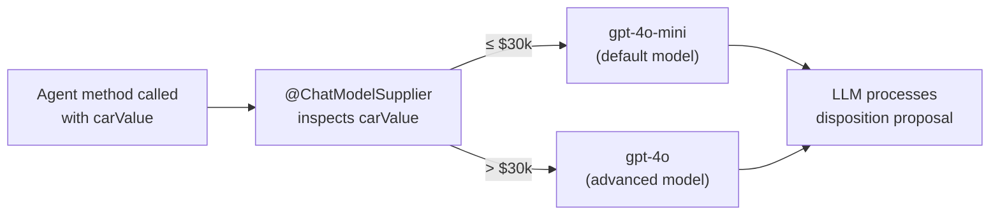
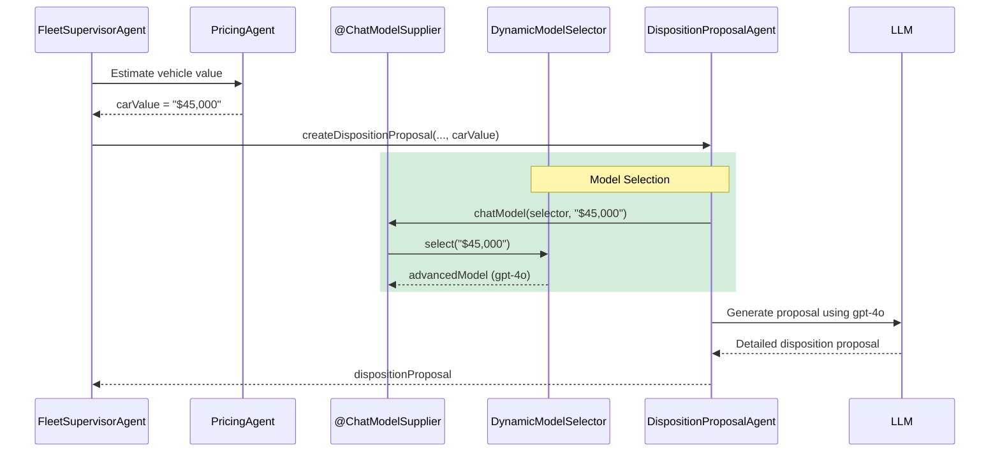

# Step 07 - Dynamic Model Selection

## New Requirement: Smarter Decisions for High-Value Vehicles

In Step 6, you enhanced the system with multimodal image analysis, giving the workflow visual context alongside textual feedback. The system now makes well-informed disposition decisions, but there's a catch: every decision uses the same LLM model, regardless of how much is at stake.

The Miles of Smiles management team has noticed that disposition proposals for high-value vehicles deserve more careful reasoning. A $50,000 car scrapped by mistake is far more costly than a $3,000 one. They want the system to automatically use a more capable (and more expensive) model when the stakes are high, while keeping costs down for routine decisions on lower-value vehicles.

In this step you'll implement **dynamic model selection**: the `DispositionProposalAgent` will automatically switch to an advanced LLM when the vehicle's estimated value exceeds $30,000.

---

## What You'll Learn

In this step, you will:

- Configure **multiple named AI models** in a single Quarkus application
- Create a **`DynamicModelSelector`** CDI bean that chooses a model based on runtime data
- Use the **`@ChatModelSupplier`** annotation to dynamically select a model per agent invocation
- Understand how **`@ModelName`** qualifies named model injection in Quarkus LangChain4j
- See how **`@CdiBean`** injects CDI beans into a static supplier method on an agent interface

---

## Understanding Dynamic Model Selection

### Why Not Use the Same Model for Everything?

Using a single model for all decisions is simple, but it forces a trade-off between cost and quality. A cheaper model handles most routine decisions perfectly well, but may miss nuances on complex, high-stakes cases. A more capable model produces better reasoning, but running it for every request is wasteful when most cars in the fleet are low-to-mid-value vehicles.

Dynamic model selection lets you have both: route high-value decisions to a stronger model and keep everything else on the cost-effective default.

### How It Works in LangChain4j

LangChain4j's `@ChatModelSupplier` annotation marks a static method on an agent interface that returns the `ChatModel` to use for each invocation. The method receives:

- **CDI beans** via `@CdiBean` — for accessing application services like model selectors
- **Agent method parameters** — matched by type, giving the supplier access to the same inputs the agent receives

This means the model choice can depend on the actual data flowing through the agent at runtime, not just static configuration.



---

## Prerequisites

Before starting:

- **Completed [Step 06](step-06.md){target="_blank"}** — This step builds on Step 6's architecture
- Application from Step 06 is stopped (Ctrl+C)
- Understanding of Step 5's disposition workflow (DispositionProposalAgent, HumanApprovalAgent)

---

## Configure the Named Models

The first change is in `application.properties`. In previous steps, the application had a single unnamed model configuration that every agent shared. Now we configure two models: a default model used by all agents unless overridden, and a named `advancedModel` used selectively for high-value decisions.

==Open `src/main/resources/application.properties`== and update the AI model configuration:

```properties title="application.properties"
--8<-- "../../section-2/step-07/src/main/resources/application.properties:27:39"
```

The default (unnamed) model uses `gpt-4o-mini` — a cost-effective model that handles routine disposition decisions well. The named `advancedModel` uses `gpt-4o`, which provides stronger reasoning for complex cases. The naming convention follows the Quarkus LangChain4j pattern: `quarkus.langchain4j.openai.<modelName>.*` defines a model you can later inject with `@ModelName("<modelName>")`.

All other agents in the application (FeedbackAnalysisAgent, PricingAgent, FleetSupervisorAgent, etc.) continue to use the default model automatically — no changes needed anywhere else.

---

## Create the DynamicModelSelector

The model selection logic lives in a dedicated CDI bean. This keeps the decision rule in one place and makes it easy to test, adjust the threshold, or add more sophisticated selection logic later.

==Create `src/main/java/com/carmanagement/agentic/agents/DynamicModelSelector.java`==:

```java title="DynamicModelSelector.java"
--8<-- "../../section-2/step-07/src/main/java/com/carmanagement/agentic/agents/DynamicModelSelector.java"
```

The selector injects two `ChatModel` instances. The first, with no qualifier, resolves to the default unnamed model (`gpt-4o-mini`). The second uses `@ModelName("advancedModel")` to inject the named model configuration (`gpt-4o`).

The `select` method parses the car value string (which arrives formatted as something like `"$42,500"`) and compares it against the $30,000 threshold. Values above the threshold route to the advanced model; everything else stays on the default.

---

## Update the DispositionProposalAgent

The `DispositionProposalAgent` is the agent that creates disposition proposals — SCRAP, SELL, DONATE, or KEEP — based on the vehicle's value, condition, age, and damage. It is the natural place for dynamic model selection because the quality of its reasoning directly determines whether a valuable car is handled correctly.

==Open `src/main/java/com/carmanagement/agentic/agents/DispositionProposalAgent.java`== and add the `@ChatModelSupplier` method:

```java title="DispositionProposalAgent.java"
--8<-- "../../section-2/step-07/src/main/java/com/carmanagement/agentic/agents/DispositionProposalAgent.java"
```

The key addition is the static method at the bottom of the interface:

```java
@ChatModelSupplier
static ChatModel chatModel(@CdiBean DynamicModelSelector modelSelector, String carValue) {
    return modelSelector.select(carValue);
}
```

This method is called by the framework before each invocation of `createDispositionProposal`. It receives the `DynamicModelSelector` CDI bean via `@CdiBean` and the `carValue` parameter — the same `carValue` that was passed to the agent method. The `String carValue` parameter is matched by type against the agent method's parameters, so it automatically receives the car's estimated value.

The returned `ChatModel` is the model used for that specific invocation. A $10,000 car goes to `gpt-4o-mini`; a $45,000 car goes to `gpt-4o`. Every other aspect of the agent — its system message, user message template, output key — stays the same.

---

## Try It Out

### Start the Application

1. Navigate to the step-07 directory:

```bash
cd section-2/step-07
```

2. Start the application:

=== "Linux / macOS"
    ```bash
    ./mvnw quarkus:dev
    ```

=== "Windows"
    ```cmd
    mvnw quarkus:dev
    ```

3. Open [http://localhost:8080](http://localhost:8080){target="_blank"}

### Test with a Standard-Value Vehicle

Find the Honda Civic in the Fleet Status grid and enter feedback describing severe damage:

```text
The car was involved in a severe collision, with heavy front-end damage, rear bumper damage, and possible frame damage. It may not be safe to drive.
```

Click **Return**.

This feedback is intentionally severe so the disposition analysis is activated. The Honda Civic should still be below the $30,000 advanced-model threshold, so the `DispositionProposalAgent` will use the default `gpt-4o-mini` model. Check the application logs. You should see the disposition proposal generated without the advanced model being invoked.

### Test with a High-Value Vehicle

Now try a scenario where the PricingAgent estimates a value above $30,000. Find the Mercedes-Benz C-Class in the Fleet Status grid and enter feedback describing severe damage:

```text
The car was involved in a severe multi-car rear-end collision, with heavy damage to both the front and rear bumpers and possible structural damage.
```

Click **Return**.

This time, when the PricingAgent returns a high estimated value (above $30,000), the `DispositionProposalAgent` will automatically switch to the `gpt-4o` model. The more capable model provides stronger reasoning for the disposition decision on this valuable vehicle. In this case you should also notice that the logs indicate the advanced model was selected:

```text
INFO  [co.ca.ag.ag.DynamicModelSelector] (executor-thread-1) Selecting advanced model for high-value car estimated $30,500
```

### Verify the Model Switch

Enable request logging to see which model is being used:

```properties
quarkus.langchain4j.log-requests=true
```

In the logs, look for the model name in the request payload. You'll see `gpt-4o-mini` for low-value vehicles and `gpt-4o` for high-value ones.

---

## How It All Works Together



---

## Key Takeaways

- **Named models** in `application.properties` let you configure multiple LLM backends in the same application, each with its own model, temperature, and timeout settings
- **`@ModelName`** qualifies which named model to inject into a CDI bean
- **`@ChatModelSupplier`** is a static method on an agent interface that returns the `ChatModel` for each invocation — the framework calls it before every agent method execution
- **`@CdiBean`** makes CDI beans available inside the static supplier method, bridging the gap between the declarative agent interface and the application's dependency injection context
- **Parameter matching by type** gives the supplier access to the same inputs the agent receives, enabling data-driven model selection without extra plumbing
- The pattern keeps model selection logic **separate from agent logic** — the agent's prompts and output handling don't change at all

---

## Experiment Further

### 1. Adjust the Threshold

Change the `HIGH_VALUE_THRESHOLD` in `DynamicModelSelector` to a lower value (e.g., 10000) and observe how more vehicles get routed to the advanced model. Watch the logs to confirm the switch.

### 2. Add a Third Model Tier

Configure a third named model (e.g., `premiumModel` using `gpt-5.1`) for vehicles above $100,000 and update the selector to use a three-tier selection:

```properties
quarkus.langchain4j.premiumModel.chat-model.provider=openai
quarkus.langchain4j.openai.premiumModel.chat-model.model-name=gpt-5.1
quarkus.langchain4j.openai.premiumModel.api-key=${OPENAI_API_KEY}
quarkus.langchain4j.openai.premiumModel.timeout=PT180S
```

### 3. Apply Dynamic Selection to Other Agents

Try adding `@ChatModelSupplier` to other agents in the system. For example, the `FleetSupervisorAgent` could use a more capable model when the overall disposition involves multiple damaged vehicles.

### 4. Make the Threshold Configurable

Replace the hardcoded `HIGH_VALUE_THRESHOLD` with a Quarkus configuration property using `@ConfigProperty`, so it can be tuned without recompilation:

```java
@ConfigProperty(name = "car-management.advanced-model.threshold", defaultValue = "30000")
int highValueThreshold;
```

---

## Troubleshooting

??? warning "Bean resolution error for advancedModel"
    If you see `UnsatisfiedResolutionException` for the `@ModelName("advancedModel")` injection, verify that the named model is fully configured in `application.properties`. The name in `@ModelName("advancedModel")` must match the segment in `quarkus.langchain4j.openai.advancedModel.*` exactly.

??? warning "All requests using the same model"
    If you see the same model in all requests regardless of car value, check that:

    - The `carValue` parameter reaching the agent is correctly formatted (e.g., `"$42,500"`)
    - The `parseValue` method can extract digits from the format used by your PricingAgent
    - The threshold in `DynamicModelSelector` matches your test data

??? warning "ChatModelSupplier method not being called"
    The `@ChatModelSupplier` method must be `static` and declared directly on the agent interface. Verify the method signature returns `ChatModel` and that the `@CdiBean` and parameter types match what's available.

---

## Cleanup

Before moving to the next step:

1. **Stop the running server** by pressing `Ctrl+C` in the terminal where Quarkus is running

2. **Return to the root project directory**:

    ```bash
    cd ..
    ```

---

## What's Next?

You've successfully implemented dynamic model selection, giving the system cost-effective reasoning for routine decisions and more capable analysis for high-value vehicles.

The system now:

- Configures multiple named AI models in a single application
- Automatically selects the appropriate model based on the vehicle's estimated value
- Uses a stronger model for high-value disposition decisions without changing agent prompts or workflow structure

**Key Progression:**

- **Step 4**: Sophisticated local orchestration with Supervisor Pattern
- **Step 5**: Human-in-the-Loop for safe, controlled autonomous decisions
- **Step 6**: Multimodal image analysis for enriched feedback
- **Step 7**: Dynamic model selection for cost-effective, risk-aware decisions

In **Step 08**, you'll learn about **Agent-to-Agent (A2A) communication** — converting the local PricingAgent into a remote service that runs in a separate system, demonstrating how to distribute agent workloads across multiple applications!

[Continue to Step 08 - Using Remote Agents (A2A)](step-08.md)
