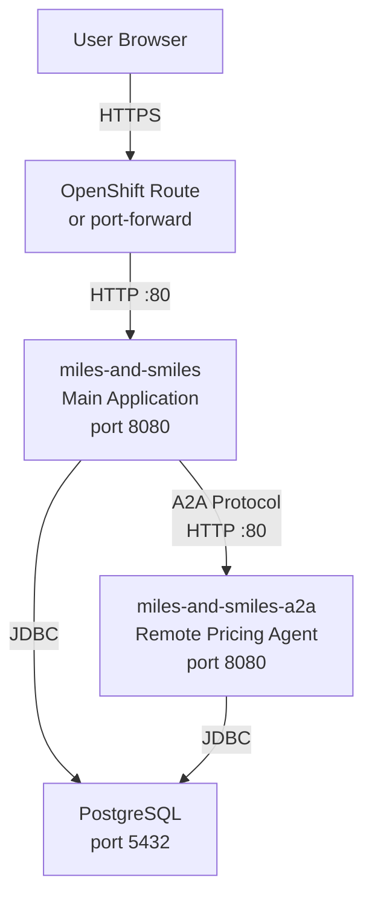

# Bonus Step - Deploying to Kubernetes

!!! tip "This step is optional"
    This bonus step requires access to a Kubernetes or OpenShift cluster. If you don't have one available, you can get a free cluster in minutes using the [OpenShift Developer Sandbox](https://developers.redhat.com/developer-sandbox){target="_blank"} — no installation required, just sign in with a Red Hat account. If you'd rather skip this step entirely, head straight to the [conclusion](conclusion.md).

Over the course of this section, you built a sophisticated distributed multi-agent system: a fleet management application with a supervisor, parallel workflows, human-in-the-loop approval, multimodal image analysis, and a remote pricing agent communicating over the A2A protocol. All of that ran on your local environment with `./mvnw quarkus:dev`.

This step takes that same system and deploys it to a real Kubernetes cluster. You'll see how to containerize both  Quarkus applications (the main agentic app and the A2A app), deploy them to the cluster, connect them through Kubernetes services and how secrets and ConfigMaps replace local properties. 

---

## What You'll Learn

- How to containerize the Agentic system
- How to deploy a multi-application Quarkus system to Kubernetes/OpenShift
- How Quarkus profiles (`%prod`) separate local and cluster configuration
- How the A2A agent and main application discover each other in a cluster via Kubernetes service names
- How to add configuration values through ConfigMaps and Secrets and enable access from the apps
- How Quarkus SmallRye Health integrates with Kubernetes liveness, readiness, and startup probes

---

## Architecture in the Cluster

The deployment runs three components in a dedicated `miles-and-smiles` namespace:



The main application hosts the full multi-agent system — supervisor, workflows, HITL pattern, and multimodal agent — exactly as you built it in steps 01–07. The remote pricing agent runs as a separate Deployment, and the main application connects to it over HTTP using the Kubernetes internal service name `miles-and-smiles-a2a.miles-and-smiles.svc.cluster.local`. PostgreSQL is deployed alongside both and shared via Kubernetes Secrets.

---

## Prerequisites

You'll need a Kubernetes or OpenShift cluster with `kubectl` or `oc` cli configured to point at it, and your OpenAI API key. If you plan to build and push your own images rather than using the pre-built ones, you'll also need write access to a container registry such as Quay.io.

If you don't have a cluster, the [OpenShift Developer Sandbox](https://developers.redhat.com/developer-sandbox){target="_blank"} provides a free, hosted OpenShift environment. It runs OpenShift 4.x, supports Routes out of the box, and is the easiest way to follow this step without any local cluster setup.

---

## From Step 07 to Step 08: Adding Kubernetes Extensions

The code in `section-2/step-08/` is the same two-application system you built in Step 07 — the multi-agent system and the remote A2A pricing agent — with three new extensions added to each `pom.xml` to make them cluster-ready.

**`quarkus-kubernetes`** generates Kubernetes manifests (Deployment, Service, health probes, RBAC resources) automatically at build time into `target/kubernetes/`.

**`quarkus-kubernetes-config`** allows the application to read configuration from Kubernetes ConfigMaps and Secrets at startup, without those values needing to be baked into the image or passed as individual environment variables. In `application.properties`, the `%prod.quarkus.kubernetes-config.*` properties tell each application which Secret and ConfigMap to read:

```properties
%prod.quarkus.kubernetes-config.enabled=true
%prod.quarkus.kubernetes-config.secrets.enabled=true
%prod.quarkus.kubernetes-config.secrets=miles-and-smiles
%prod.quarkus.kubernetes-config.config-maps=miles-and-smiles-config
%prod.quarkus.kubernetes.namespace=miles-and-smiles
```

**`quarkus-smallrye-health`** exposes the `/q/health/live`, `/q/health/ready`, and `/q/health/started` endpoints that Kubernetes uses for its liveness, readiness, and startup probes. Without this extension, Kubernetes has no way to know whether a pod has successfully initialized or is healthy enough to receive traffic.

To add these extensions to an existing project, run:

```bash
./mvnw quarkus:add-extension \
  -Dextensions="quarkus-kubernetes,quarkus-kubernetes-config,quarkus-smallrye-health"
```

---

## The Project Structure

The code for this step lives in `section-2/step-08/`. It contains two Quarkus modules and the deployment resources:

```
section-2/step-08/
├── multi-agent-system/     # Main application — supervisor, workflows, HITL, A2A client
├── remote-a2a-agent/       # Remote pricing agent — A2A server
├── kubernetes/             # Kubernetes manifests ready to apply
│   ├── namespace.yaml
│   ├── configmap.yaml
│   ├── secret.yaml
│   ├── postgresql.yaml
│   ├── main-app.yaml
│   ├── a2a-agent.yaml
│   └── route.yaml
└── deploy.java             # Convenience JBang script wrapping kubectl and Maven commands
```

The manifests in `kubernetes/` were derived from the output of the `quarkus-kubernetes` extension. When you build either module with `./mvnw package`, Quarkus generates a `kubernetes.yml` file in `target/kubernetes/` that already contains a Deployment, Service, and health probes wired to the SmallRye Health endpoints. The files in the `kubernetes/` folder extend and combine that generated output with the additional resources needed for a full deployment: the namespace, PostgreSQL, the shared Secret and ConfigMap, and the OpenShift Route.


## Building the Container Images (Optional)

!!! tip "You can skip this section"
    The workshop images are already built and published to `quay.io/kevindubois`. If you just want to see the system running, skip ahead to [Deploying the System](#deploying-the-system) and use those images directly.

If you want to deploy your own changes, you need to build and push container images for both modules. Quarkus makes this straightforward — the same `src/main/docker/Dockerfile.jvm` files that a regular Docker build would use are also what the Quarkus image commands use under the hood.

From inside each module directory, build the image locally with:

```bash
./mvnw quarkus:image-build
```

Or build and push to your registry in one step:

```bash
./mvnw quarkus:image-push -Dquarkus.container-image.push=true
```

Before pushing, update `quarkus.container-image.registry` and `quarkus.container-image.group` in each module's `application.properties` to point to your registry and username, and update the image references in `kubernetes/main-app.yaml` and `kubernetes/a2a-agent.yaml` to match.

If you prefer to build with Docker or Podman directly, the Dockerfiles are in `src/main/docker/`. The JVM variant (`Dockerfile.jvm`) is the right choice for a standard deployment — build the JAR first, then the image:

```bash
# In multi-agent-system/
./mvnw package -DskipTests
docker build -f src/main/docker/Dockerfile.jvm -t your-registry/miles-and-smiles:latest .

# In remote-a2a-agent/
./mvnw package -DskipTests
docker build -f src/main/docker/Dockerfile.jvm -t your-registry/miles-and-smiles-a2a:latest .
```

!!! Note "Natively compiled images"
    Feel free to compile the app to a native binary and containerize it with the Dockerfile.native for a smaller container image that starts up even faster.
    To do this, you just need to add the `-Dnative` flag to the maven commands above.

---

## What Gets Deployed

The manifests in `section-2/step-08/kubernetes/` create the following resources, all inside the `miles-and-smiles` namespace.

A **Namespace** named `miles-and-smiles` isolates every resource created by this deployment from the rest of your cluster.

A **ConfigMap** named `miles-and-smiles-config` holds non-sensitive configuration that both applications read. Before deploying, open `kubernetes/configmap.yaml` and adjust these values to match your environment:

```yaml
data:
  POSTGRES_HOST: "postgresql"
  POSTGRES_PORT: "5432"
  OPENAI_BASE_URL: "https://api.openai.com/v1"
  OPENAI_MODEL_NAME: "gpt-4o"
```

If you're using a different model, a local LLM proxy, or a compatible API endpoint (such as Azure OpenAI or a self-hosted inference server), this is the place to set it — no image rebuild required.

A **Secret** named `miles-and-smiles` holds the sensitive values injected at runtime: your `OPENAI_API_KEY`, the PostgreSQL username and password, and the database name. The secret is created with `kubectl create secret --dry-run=client -o yaml | kubectl apply -f -`, which makes re-running the deployment idempotent — it won't fail if the secret already exists.

A **PostgreSQL Deployment and Service** provide the shared database. The Deployment uses the official `postgres:18` image with liveness and readiness probes (`pg_isready`), and the Service exposes it cluster-internally on port `5432` under the hostname `postgresql`.

Two application **Deployments and Services** — `miles-and-smiles` for the main multi-agent system and `miles-and-smiles-a2a` for the remote pricing agent. Each has a ClusterIP Service on port 80 forwarding to container port 8080. Both include liveness, readiness, and startup health probes backed by the Quarkus SmallRye Health endpoints (`/q/health/live`, `/q/health/ready`, `/q/health/started`). Each pod also gets a ServiceAccount with a Role and RoleBinding granting read access to Secrets and ConfigMaps in the namespace, which is how Quarkus Kubernetes Config picks up runtime configuration.

An **OpenShift Route** named `miles-and-smiles` provides external HTTPS access with edge TLS termination and automatic HTTP-to-HTTPS redirect. On vanilla Kubernetes without OpenShift, the main-app manifest also includes a Gateway API HTTPRoute as an alternative — see the [Accessing on Vanilla Kubernetes](#accessing-on-vanilla-kubernetes) section below.

---

## Deploying the System

You can deploy the system using standard `kubectl` (or `oc` on OpenShift) commands, applying the manifests in order and waiting for each component to become ready before proceeding to the next:

```bash
export OPENAI_API_KEY=your-key-here

kubectl apply -f kubernetes/namespace.yaml
kubectl apply -f kubernetes/configmap.yaml

# Create the secret with your API key injected directly — never written to disk
kubectl create secret generic miles-and-smiles \
  --from-literal=OPENAI_API_KEY=$OPENAI_API_KEY \
  --from-literal=POSTGRES_USER=milesandsmiles \
  --from-literal=POSTGRES_PASSWORD=milesandsmiles123 \
  --from-literal=POSTGRES_DB=milesandsmiles \
  --namespace=miles-and-smiles \
  --dry-run=client -o yaml | kubectl apply -f -

kubectl apply -f kubernetes/postgresql.yaml
kubectl wait --for=condition=ready pod -l app=postgresql \
  -n miles-and-smiles --timeout=120s

kubectl apply -f kubernetes/a2a-agent.yaml
kubectl wait --for=condition=ready pod \
  -l app.kubernetes.io/name=miles-and-smiles-a2a \
  -n miles-and-smiles --timeout=120s

kubectl apply -f kubernetes/main-app.yaml
kubectl apply -f kubernetes/route.yaml
```

Notice the secret creation pattern: the `--dry-run=client -o yaml | kubectl apply -f -` pipeline generates the secret manifest in memory and pipes it straight to the cluster. Your API key is never written to a file on disk.

If you prefer not to run each command manually, a `deploy.java` JBang script in the same directory automates the exact sequence above, including the readiness waits. Set your API key and run:

```bash
./deploy.java deploy
```

Once everything is up, get your application URL:

```bash
./deploy.java get-route
# or: kubectl get route miles-and-smiles -n miles-and-smiles -o jsonpath='{.spec.host}'
```

Open that URL in your browser and the full Miles and Smiles fleet management system is running on Kubernetes.

If you made changes to the application code and want to deploy your own images, update `quarkus.container-image.group` in both `application.properties` files and the image references in the `kubernetes/` manifests, then run `./deploy.java all` to build, push, and deploy in one shot.


---

## Accessing the Application

On OpenShift (including the Developer Sandbox), an OpenShift Route is created automatically during deployment. You can retrieve the generated hostname with:

```bash
./deploy.java get-route
```

The URL will look something like `https://miles-and-smiles.apps.your-cluster.example.com`. Open it in a browser to reach the car return form.

On vanilla Kubernetes without OpenShift, `kubernetes/main-app.yaml` includes a Gateway API `HTTPRoute`. Update the `hostnames` field with your cluster's domain and configure it with your Gateway controller (Istio, Envoy Gateway, or similar).

---

## Dev vs Production Configuration

When the applications run with `./mvnw quarkus:dev`, they use `localhost` URLs and local ports. In the cluster they need to talk to Kubernetes service names instead. Quarkus profiles make this switch automatic; any property prefixed with `%prod.` takes effect only when the application runs outside dev mode.

The A2A agent's `application.properties` contains the key example of this pattern:

```properties
# Used in dev mode — A2A agent runs on port 8888 locally to avoid conflicts
a2a.base-url=http://localhost:8888/

# Overridden automatically in production — resolves to the Kubernetes service
%prod.a2a.base-url=http://miles-and-smiles-a2a.miles-and-smiles.svc.cluster.local/
```

The `PricingAgentCard` class in the remote A2A agent injects this `a2a.base-url` property and uses it to generate the URLs it advertises in its agent card. When the main application fetches the agent card at startup, it receives the Kubernetes-internal URL and uses that for all subsequent A2A calls.

The main application's `@A2AClientAgent` annotation specifies the Kubernetes service URL directly so it knows where to fetch the agent card in production:

```java
@A2AClientAgent(
    a2aServerUrl = "http://miles-and-smiles-a2a.miles-and-smiles.svc.cluster.local",
    ...
)
```

PostgreSQL connectivity follows the same pattern: dev mode connects to `localhost`, while in production the `POSTGRES_HOST` environment variable is injected from the ConfigMap and resolves to the `postgresql` Kubernetes service.

---

## Observing the Running System

Check the status of all pods in the namespace:

```bash
kubectl get pods -n miles-and-smiles
```

Stream logs from any component directly with `kubectl`, or use the convenience wrappers:

```bash
kubectl logs -f -l app.kubernetes.io/name=miles-and-smiles -n miles-and-smiles
kubectl logs -f -l app.kubernetes.io/name=miles-and-smiles-a2a -n miles-and-smiles
kubectl logs -f -l app=postgresql -n miles-and-smiles
```

### Health Endpoints

Both Quarkus applications include the `quarkus-smallrye-health` extension, which exposes three standard health endpoints that Kubernetes uses to manage pod lifecycle:

| Endpoint | Kubernetes probe | Purpose |
|---|---|---|
| `/q/health/live` | Liveness | Is the process alive? If this fails, Kubernetes restarts the pod. |
| `/q/health/ready` | Readiness | Is the application ready to serve traffic? If this fails, the pod is removed from the Service load balancer. |
| `/q/health/started` | Startup | Has the application finished starting up? Kubernetes won't check liveness or readiness until this passes, giving the app time to initialize without triggering a premature restart. |

The startup probe is particularly important here because the main application fetches the A2A agent card on startup — a network call that can take a few seconds. The startup probe is configured with a generous timeout (`failureThreshold: 30`, `periodSeconds: 10`, up to five minutes) so the pod isn't killed before it finishes initializing.

Once the application is running, you can query the health endpoints directly using the OpenShift Route. First get your route hostname:

```bash
./deploy.java get-route
```

Then query any of the health endpoints:

```bash
export APP_URL=https://miles-and-smiles.apps.your-cluster.example.com

# Overall health summary
curl $APP_URL/q/health

# Individual probes
curl $APP_URL/q/health/live
curl $APP_URL/q/health/ready
curl $APP_URL/q/health/started
```

Each response is a JSON document listing the overall status (`UP` or `DOWN`) and the result of every individual health check registered in the application. A healthy response looks like:

```json
{
  "status": "UP",
  "checks": [
    {
      "name": "Database connections health check",
      "status": "UP"
    }
  ]
}
```

The SmallRye Health UI at `$APP_URL/q/health-ui` presents the same information in a readable browser dashboard — useful for a quick visual confirmation that all checks are green after a fresh deployment.

---

## Troubleshooting

**Pods stuck in `Pending` or `ImagePullBackOff`** — the cluster can't reach the registry or the image name is wrong. Check pod events with `kubectl describe pod <pod-name> -n miles-and-smiles`. For `ImagePullBackOff`, verify the image names in the YAML manifests match what was pushed to your registry.

**Main application fails to start** — the main application fetches the A2A agent card during initialization. If the A2A agent pod isn't fully ready at that point, the fetch will fail. The manifests are designed to be applied in order with readiness waits between them, so if you're applying them manually make sure to wait for the A2A agent first:

```bash
kubectl wait --for=condition=ready pod \
  -l app.kubernetes.io/name=miles-and-smiles-a2a \
  -n miles-and-smiles --timeout=120s
```

**Route returns 503** — the main application may still be starting up. Its startup probe allows up to five minutes for initialization. Wait a moment and check pod status with `kubectl get pods -n miles-and-smiles`.

**Secret or ConfigMap not found** — if `OPENAI_API_KEY` wasn't set during deployment, the secret creation step will have failed. Set the variable and re-run `./deploy.java deploy`.

---

## Cleaning Up

To remove every resource created by this step from your cluster:

```bash
./deploy.java undeploy
```

This deletes the Route, both application Deployments and Services, PostgreSQL, the Secret, the ConfigMap, and finally the namespace itself.

---

## What's Next

You've now seen a complete picture of the Miles and Smiles agentic system — from a single agent with a tool in Step 01, through compositional workflows, supervisor orchestration, human approval, multimodal analysis, and distributed A2A communication in Step 07, to a production cluster deployment here. Head to the [Mastering Agentic Systems](conclusion.md) conclusion to reflect on everything you've built and the patterns you can carry into your own projects.

If you're continuing to **Section 3**, you'll take these foundations into enterprise territory: agent skills and dynamic discovery, persistent event-driven workflows with Quarkus Flow, adaptive model selection, and AI-powered evaluation.
