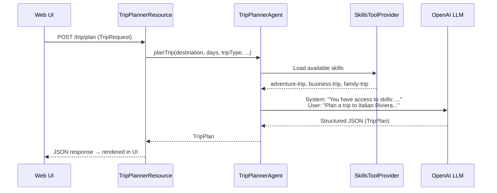
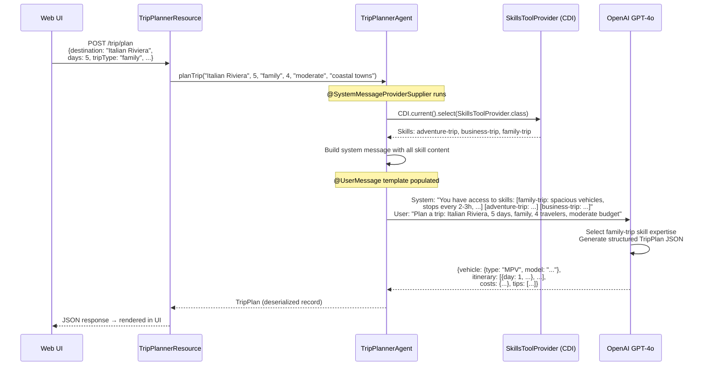

# Step 01 - Agent Skills and Discovery

## Welcome to Section 3: Enterprise Agentic Patterns

Congratulations on completing Section 2! You've learned how to build AI agents, compose them into workflows (sequential, parallel, conditional, and loop), and orchestrate them with supervisors and planners.

In **Section 3**, we're shifting to a brand-new scenario and exploring **enterprise-grade agentic patterns** — skills, guardrails, persistent state, and more. Instead of managing a car fleet, you'll build an intelligent **Customer Trip Planner** that helps customers plan road trips.

### The Scenario

**Miles of Smiles** offers customers more than just a car — an intelligent Trip Planner helps plan the entire journey. Customers describe their trip (e.g., "7 days on the Italian Riviera, family of 4, moderate budget") and the system picks the right vehicle, plans a route, estimates costs, and provides practical tips.

Different trip types need different planning expertise. For example, a "family vacation" skill knows about kid-friendly stops, rest frequency, and car seat compatibility, while a "business travel" skill optimizes for speed, motorway routes, and professional accommodation. 

---

## What You'll Learn

In this step, you will:

- Build an AI agent that generates **structured output** (a complete trip plan with vehicle, itinerary, and costs)
- Use `SkillsToolProvider` to **dynamically load expertise** from Markdown files on the filesystem
- Use `@SystemMessageProviderSupplier` to **inject skill knowledge** into the agent's system message at runtime
- Expose the agent as a **REST endpoint** with a web-based UI

---

## What Are We Going to Build?

The application consists of three main components:

1. **TripPlannerAgent**: An AI agent that generates structured trip plans, dynamically enhanced with skill-based expertise
2. **TripPlannerResource**: A REST endpoint that receives trip requests and delegates to the agent
3. **Skill files**: Markdown files containing specialized trip-planning knowledge (family, business, adventure)

**The Flow:**



---

## Understanding Skills

In Sections 1 and 2, agents got their behavior from annotations like `@SystemMessage`. While those messages can also reference external files, thus not requiring recompilation in case you want to change them, they nevertheless remain static, as they are not contextualized with the specific user request at runtime.

**Skills** solve this problem by externalizing domain expertise into Markdown files that are loaded at runtime. Each skill is a `SKILL.md` file with YAML frontmatter (name and description) followed by Markdown content:

```markdown
---
name: adventure-trip
description: Instructions for planning adventurous road trips.
---

# Adventure Trip Planning

You are an expert at planning adventurous road trips across Europe...

## Vehicle Recommendations
- Recommend vehicles with good ground clearance...
```

The `quarkus-langchain4j-skills` extension scans one or more directories and makes all discovered skills available to agents via a `SkillsToolProvider` CDI bean. The directories to scan are configured in `application.properties` using the `quarkus.langchain4j.skills.directories` property — each entry can be a filesystem path or a classpath location (prefixed with `classpath:`). See the [Skills extension documentation](https://docs.quarkiverse.io/quarkus-langchain4j/dev/skills.html#_configuration){target="_blank"} for full configuration details. The agent can then inject this knowledge into its system message dynamically.

**Benefits of this approach:**

- **Hot-reload friendly**: Quarkus dev mode picks up changes to skill files automatically
- **Separation of concerns**: Domain experts can author skill content in Markdown without touching Java code
- **Composable**: Skills can be loaded selectively based on context
- **Cost-effective**: Skills are only loaded when needed, reducing LLM token usage

---

## Running the Application

Navigate to the `section-3/step-01` directory and start the application:

=== "Linux / macOS"
    ```bash
    cd section-3/step-01
    ./mvnw quarkus:dev
    ```

=== "Windows"
    ```cmd
    cd section-3\step-01
    mvnw quarkus:dev
    ```

Once started, open your browser to [http://localhost:8080](http://localhost:8080){target="_blank"}.

### Understanding the UI

The application has a two-panel layout:

1. **Left Panel — Trip Form**: Fields for destination, duration, number of travelers, trip type (family, business, adventure, romantic, road trip), budget range, and additional preferences.
2. **Right Panel — Trip Plan**: Displays the generated plan with vehicle recommendation, route overview, daily itinerary, cost estimates, and practical tips.
3. **Bottom — Refine Drawer**: A text input to send follow-up adjustments (e.g., "skip Florence", "add a lake day"), which re-submits the form with the refinement as the preferences.

---

## Try It Out

Let's see the agent in action!

### Test 1: Family Beach Vacation

Fill in the form with:

- **Destination**: `Italian Riviera`
- **Duration**: `5` days
- **Travelers**: `4`
- **Trip Type**: `Family Vacation`
- **Budget**: `Moderate (€1,000–€2,500)`
- **Preferences**: `We love coastal towns and good food`

Click **Generate Trip Plan**.

**What happens?**

- The agent loads the `family-trip` skill with expertise about family-friendly stops, spacious vehicles, and kid-friendly attractions
- The LLM generates a complete trip plan structured as a `TripPlan` object
- The UI renders the vehicle recommendation, a day-by-day itinerary with overnight stops, cost estimates, and practical tips

### Test 2: Adventure Trip

Now try a different trip type:

- **Destination**: `Swiss Alps`
- **Trip Type**: `Adventure Trip`
- **Preferences**: `We want hiking and mountain passes`

**What happens?**

- The agent uses the `adventure-trip` skill, which recommends 4WD vehicles, legendary driving roads like Furka Pass, and outdoor activities like via ferrata
- Notice how the vehicle recommendation, route, and tips are completely different from the family trip — the skill shapes the entire response

### Test 3: Refine the Plan

With a plan displayed, use the **Refine** input at the bottom:

```
Skip the first first day in Zermatt and a day in Verbier instead
```

The agent generates a new plan incorporating your adjustment.

---

## Project Dependencies

Open the `pom.xml` file. The key dependencies for this step are:

```xml
<dependency>
    <groupId>io.quarkiverse.langchain4j</groupId>
    <artifactId>quarkus-langchain4j-agentic</artifactId>
</dependency>
<dependency>
    <groupId>io.quarkiverse.langchain4j</groupId>
    <artifactId>quarkus-langchain4j-openai</artifactId>
</dependency>
<dependency>
    <groupId>io.quarkiverse.langchain4j</groupId>
    <artifactId>quarkus-langchain4j-skills</artifactId>
</dependency>
```

- `quarkus-langchain4j-agentic`: The agent framework with `@Agent`, `@SystemMessageProviderSupplier`, and workflow support
- `quarkus-langchain4j-openai`: OpenAI model provider (GPT-4o)
- `quarkus-langchain4j-skills`: The skills extension that loads `SKILL.md` files and provides `SkillsToolProvider`

---

## Component 1: The TripPlannerAgent

This is the core of the application — an AI agent that generates structured trip plans:

```java title="TripPlannerAgent.java"
--8<-- "../../section-3/step-01/src/main/java/com/tripplanner/agentic/agents/TripPlannerAgent.java"
```

**Let's break it down:**

### `@Agent`

Marks the `planTrip` method as the agent's entry point, just like in Section 2:

```java
@Agent("Plans road trips based on customer preferences and trip type")
```

The description tells the framework (and other agents in future steps) what this agent does.

### `@UserMessage`

Provides the trip details using template variables:

```java
@UserMessage("""
        Plan a trip with the following details:
        - Destination: {destination}
        - Duration: {days} days
        - Trip type: {tripType}
        - Number of travelers: {travelers}
        - Budget: {budget}
        - Additional preferences: {preferences}
        """)
```

These variables are populated from the method parameters.

### Structured Output with `TripPlan`

Notice the return type is `TripPlan`, not `String`:

```java
TripPlan planTrip(String destination, Integer days, String tripType, ...)
```

LangChain4j automatically instructs the LLM to return JSON matching the `TripPlan` record structure and deserializes it. No manual JSON parsing needed!

### `@SystemMessageProviderSupplier` — Dynamic System Messages

This is where the skills integration happens:

```java
@SystemMessageProviderSupplier
static String systemMessageProvider(Object memoryId) {
    Instance<SkillsToolProvider> skillsToolProvider = CDI.current().select(SkillsToolProvider.class);
    if (skillsToolProvider.isResolvable()) {
        return """
                You have access to the following skills:
                %s
                """.formatted(skillsToolProvider.get().getSkills().formatAvailableSkills());
    }
    return "";
}
```

Instead of a static `@SystemMessage`, this method dynamically builds the system message at runtime by:

1. Looking up the `SkillsToolProvider` CDI bean
2. Formatting all available skills (their names, descriptions, and full content) into the system prompt
3. The LLM then uses the relevant skill expertise when generating the trip plan

!!! tip "Why Dynamic System Messages?"
    Using `@SystemMessageProviderSupplier` instead of `@SystemMessage` means the agent's expertise updates automatically when skill files are added, removed, or modified — without any code change or recompilation.

---

## Component 2: Structured Output — The TripPlan Model

The `TripPlan` record defines the structured output schema:

```java title="TripPlan.java"
--8<-- "../../section-3/step-01/src/main/java/com/tripplanner/model/TripPlan.java"
```

**Key Points:**

- **Nested records**: `VehicleRecommendation`, `DayItinerary`, and `CostEstimate` are nested within `TripPlan`, providing a clean, hierarchical structure
- **Type-safe**: The compiler ensures the agent returns a properly structured plan — no manual JSON parsing or string manipulation
- **Automatic deserialization**: LangChain4j handles converting the LLM's JSON response into this record hierarchy

---

## Component 3: The REST Endpoint

The `TripPlannerResource` exposes the agent as a REST API:

```java title="TripPlannerResource.java"
--8<-- "../../section-3/step-01/src/main/java/com/tripplanner/resource/TripPlannerResource.java"
```

**Key Points:**

- The `TripPlannerAgent` is injected as a CDI bean — Quarkus generates the implementation automatically
- A single `POST /trip/plan` endpoint receives a `TripRequest` and returns a `TripPlan`
- Jackson handles JSON serialization/deserialization for both input and output

---

## Component 4: The Skill Files

The application ships with three skill files in `src/main/resources/skills/`:

```java title="skills/family-trip/SKILL.md"
--8<-- "../../section-3/step-01/src/main/resources/skills/family-trip/SKILL.md"
```

Each skill follows the same structure:

- **YAML frontmatter**: `name` and `description` — used by `SkillsToolProvider` to index and present skills
- **Markdown body**: The actual expertise — vehicle recommendations, route planning guidelines, accommodation tips, and practical considerations

The other two skills (`adventure-trip/SKILL.md` and `business-trip/SKILL.md`) follow the same pattern with expertise tailored to their trip types.

---

## Configuration

The `application.properties` file configures the LLM and the skills directory:

```properties title="application.properties"
--8<-- "../../section-3/step-01/src/main/resources/application.properties"
```

**Key settings:**

- `quarkus.langchain4j.openai.chat-model.model-name=gpt-4o`: Uses GPT-4o for high-quality trip plans
- `quarkus.langchain4j.openai.chat-model.temperature=0.7`: Higher temperature for creative, varied trip suggestions
- `quarkus.langchain4j.openai.timeout=120`: Generous timeout — generating a complete trip plan with structured output can take a while
- `quarkus.langchain4j.skills.directories=classpath:skills`: Tells the skills extension where to find `SKILL.md` files

---

## How It All Works Together

Let's trace through a complete example:

### Scenario: Family Trip to the Italian Riviera



**Key Points:**

1. The `@SystemMessageProviderSupplier` runs before each agent invocation, building a dynamic system message with all available skills
2. The LLM receives all skill content but applies the expertise relevant to the requested trip type
3. The agent returns a strongly-typed `TripPlan` record — not a raw string — that the REST layer serializes to JSON

---

## Key Takeaways

- **Skills externalize expertise**: Domain knowledge lives in Markdown files, not in code — making the agent modular and extensible
- **Dynamic system messages**: `@SystemMessageProviderSupplier` builds the agent's context at runtime, picking up new skills without recompilation
- **Structured output**: Returning a record type (`TripPlan`) instead of `String` gives you type-safe, well-structured responses
- **Declarative agents**: The `@Agent` annotation generates the implementation — you just define the interface
- **Minimal wiring**: Quarkus CDI handles dependency injection for agents, skills, and REST resources

---

## Experiment Further

### 1. Add a New Skill

Create a new skill file at `src/main/resources/skills/romantic-trip/SKILL.md`:

```markdown
---
name: romantic-trip
description: Instructions for planning romantic getaway road trips.
---

# Romantic Trip Planning

You are an expert at planning romantic road trips across Europe...

## Vehicle Recommendations
- Recommend convertibles or sporty coupés for scenic coastal drives...
```

Restart the application (or let Quarkus dev mode hot-reload) and try a trip with the **Romantic Getaway** type. Does the agent use your new skill?

### 2. Test Different Trip Types with the Same Destination

Try planning a trip to the **Swiss Alps** three times — once as `Family Vacation`, once as `Adventure Trip`, and once as `Business Travel`. Compare how the vehicle recommendations, routes, and tips change based on the skill.

### 3. Inspect the LLM Interaction

Since `log-requests` and `log-responses` are enabled in `application.properties`, check your terminal logs to see:

- The full system message with all skills formatted
- The user message with the trip details
- The structured JSON response from the LLM

---

## Troubleshooting

??? warning "Error: OPENAI_API_KEY not set"
    Make sure you've exported the environment variable:

    ```bash
    export OPENAI_API_KEY=sk-your-key-here
    ```

    Then restart the application.

??? warning "Response takes too long or times out"
    Generating a structured trip plan with GPT-4o can take 15-30 seconds. If you're getting timeouts:

    - Check the `quarkus.langchain4j.openai.timeout` value in `application.properties` (default is 120 seconds)
    - Ensure your internet connection is stable
    - Try a shorter trip (fewer days = less content to generate)

??? warning "Skills not being loaded"
    - Verify that `quarkus.langchain4j.skills.directories=classpath:skills` is set in `application.properties`
    - Check that skill files are named `SKILL.md` (case-sensitive) and placed in subdirectories under `src/main/resources/skills/`
    - Each `SKILL.md` must have valid YAML frontmatter with `name` and `description` fields

---

## Cleanup

Before moving to the next step, let's clean up:

1. **Stop the running server** by pressing `Ctrl+C` in the terminal where Quarkus is running

2. **Return to the root project directory**:

    ```bash
    cd ..
    ```

---

## What's Next?

In this step, you built a **Trip Planner agent** that dynamically loads specialized expertise from skill files on the filesystem. You saw how `SkillsToolProvider` and `@SystemMessageProviderSupplier` work together to give agents modular, extensible knowledge without code changes.

In **Step 02**, you'll learn how to add **guardrails and compliance checks** — ensuring that trip recommendations are safe, honest, and appropriate before they reach the customer!

[Continue to Step 02 - Guardrails and Compliance](step-02.md)
