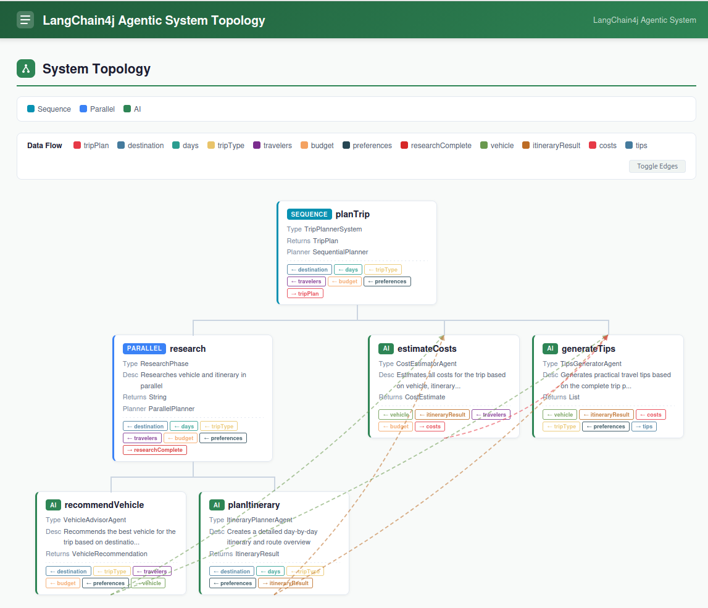
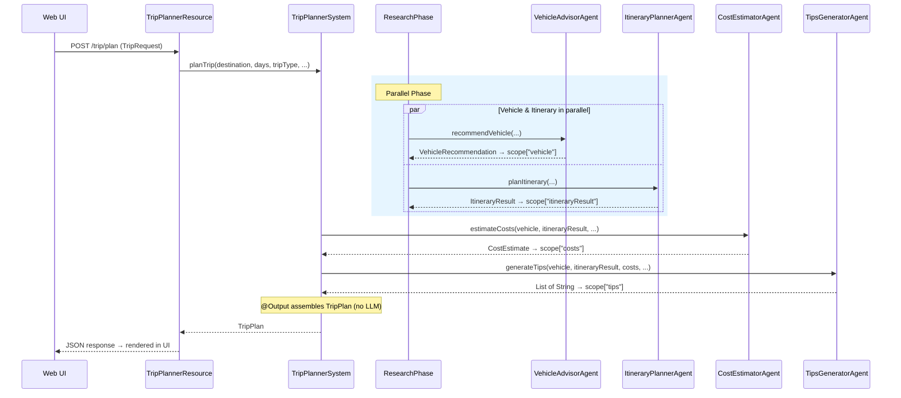
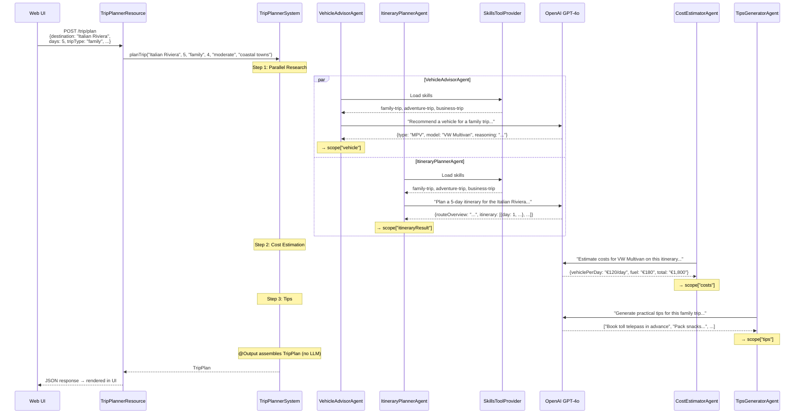
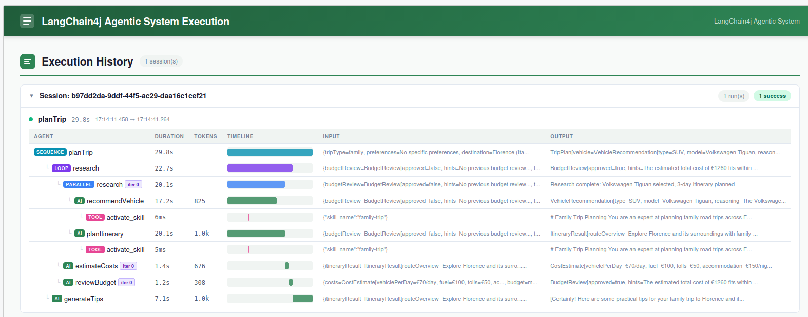

# Step 01 - Multi-Agent Trip Planner with Skills

## Welcome to Section 3: Enterprise Agentic Patterns

Congratulations on completing Section 2! You've learned how to build AI agents, compose them into workflows (sequential, parallel, conditional, and loop), and orchestrate them with supervisors and planners.

In **Section 3**, we're shifting to a brand-new scenario and exploring **enterprise-grade agentic patterns** — skills, guardrails, persistent state, and more. Instead of managing a car fleet, you'll build an intelligent **Customer Trip Planner** that helps customers plan road trips.

### The Scenario

**Miles of Smiles** offers customers more than just a car — an intelligent Trip Planner helps plan the entire journey. Customers describe their trip (e.g., "7 days on the Italian Riviera, family of 4, moderate budget") and the system picks the right vehicle, plans a route, estimates costs, and provides practical tips.

Different trip types need different planning expertise. For example, a "family vacation" skill knows about kid-friendly stops, rest frequency, and car seat compatibility, while a "business travel" skill optimizes for speed, motorway routes, and professional accommodation. 

---

## What You'll Learn

In this step, you will:

- Build a **multi-agent system** that splits trip planning across specialized agents
- Use `@SequenceAgent` and `@ParallelAgent` to orchestrate agents into a **pipeline with parallel phases**
- Use `@Output` to **assemble results** from the `AgenticScope` into a final response
- Use `SkillsToolProvider` to **dynamically load expertise** from Markdown files on the filesystem
- Use `@SystemMessageProviderSupplier` to **inject skill knowledge** into specific agents at runtime
- Use `MonitoredAgent` for **built-in observability** across the entire agent pipeline

---

## What Are We Going to Build?

Instead of a single monolithic agent that does everything in one LLM call, we'll split trip planning into specialized agents orchestrated by a sequential pipeline:

```
TripPlannerSystem (@SequenceAgent)
│
├─ ResearchPhase (@ParallelAgent)
│   ├── VehicleAdvisorAgent    → recommends a vehicle
│   └── ItineraryPlannerAgent  → plans day-by-day itinerary
│
├─ CostEstimatorAgent          → estimates costs
│
├─ TipsGeneratorAgent          → generates practical tips
│
└─ @Output                     → assembles the final TripPlan
```

**Why this architecture?**

- **VehicleAdvisorAgent** and **ItineraryPlannerAgent** are independent — they run **in parallel** inside `ResearchPhase`
- **CostEstimatorAgent** needs the vehicle and itinerary to produce realistic estimates — it runs **after** the research phase
- **TipsGeneratorAgent** runs last, with the full plan context available
- The `@Output` method assembles the final `TripPlan` from scope values — pure Java, no LLM call needed

Each agent has a **focused prompt** producing better results than asking a single LLM call to do everything at once.

The Quarkus DevUI provides an interactive topology view of the entire agent system, showing each agent's type (Sequence, Parallel, AI), its inputs/outputs, and the data flow between them:



**The Flow:**


```mermaid
sequenceDiagram
    participant User as Web UI
    participant REST as TripPlannerResource
    participant Seq as TripPlannerSystem
    participant RP as ResearchPhase
    participant VA as VehicleAdvisorAgent
    participant IP as ItineraryPlannerAgent
    participant CE as CostEstimatorAgent
    participant TG as TipsGeneratorAgent

    User->>REST: POST /trip/plan (TripRequest)
    REST->>Seq: planTrip(destination, days, tripType, ...)

    rect rgb(230, 245, 255)
        Note over RP: Parallel Phase
        par Vehicle & Itinerary in parallel
            RP->>VA: recommendVehicle(...)
            VA-->>RP: VehicleRecommendation → scope["vehicle"]
        and
            RP->>IP: planItinerary(...)
            IP-->>RP: ItineraryResult → scope["itineraryResult"]
        end
    end

    Seq->>CE: estimateCosts(vehicle, itineraryResult, ...)
    CE-->>Seq: CostEstimate → scope["costs"]

    Seq->>TG: generateTips(vehicle, itineraryResult, costs, ...)
    TG-->>Seq: List of String → scope["tips"]

    Note over Seq: @Output assembles TripPlan (no LLM)
    Seq-->>REST: TripPlan
    REST-->>User: JSON response → rendered in UI
```

---

## Understanding Skills

In Sections 1 and 2, agents got their behavior from annotations like `@SystemMessage`. While those messages can also reference external files, thus not requiring recompilation in case you want to change them, they nevertheless remain static, as they are not contextualized with the specific user request at runtime.

**Skills** solve this problem by externalizing domain expertise into Markdown files that are loaded at runtime. Each skill is a `SKILL.md` file with YAML frontmatter (name and description) followed by Markdown content:

```markdown
---
name: adventure-trip
description: Instructions for planning adventurous road trips.
---

# Adventure Trip Planning

You are an expert at planning adventurous road trips across Europe...

## Vehicle Recommendations
- Recommend vehicles with good ground clearance...
```

The `quarkus-langchain4j-skills` extension scans one or more directories and makes all discovered skills available to agents via a `SkillsToolProvider` CDI bean. The directories to scan are configured in `application.properties` using the `quarkus.langchain4j.skills.directories` property — each entry can be a filesystem path or a classpath location (prefixed with `classpath:`). See the [Skills extension documentation](https://docs.quarkiverse.io/quarkus-langchain4j/dev/skills.html#_configuration){target="_blank"} for full configuration details. The agent can then inject this knowledge into its system message dynamically.

**Benefits of this approach:**

- **Hot-reload friendly**: Quarkus dev mode picks up changes to skill files automatically
- **Separation of concerns**: Domain experts can author skill content in Markdown without touching Java code
- **Composable**: Skills can be loaded selectively based on context
- **Cost-effective**: Skills are only loaded when needed, reducing LLM token usage

---

## Running the Application

Navigate to the `section-3/step-01` directory and start the application:

=== "Linux / macOS"
    ```bash
    cd section-3/step-01
    ./mvnw quarkus:dev
    ```

=== "Windows"
    ```cmd
    cd section-3\step-01
    mvnw quarkus:dev
    ```

Once started, open your browser to [http://localhost:8080](http://localhost:8080){target="_blank"}.

### Understanding the UI

The application has a two-panel layout:

1. **Left Panel — Trip Form**: Fields for destination, duration, number of travelers, trip type (family, business, adventure, romantic, road trip), budget range, and additional preferences.
2. **Right Panel — Trip Plan**: Displays the generated plan with vehicle recommendation, route overview, daily itinerary, cost estimates, and practical tips.
3. **Bottom — Refine Drawer**: A text input to send follow-up adjustments (e.g., "skip Florence", "add a lake day"), which re-submits the form with the refinement as the preferences.

---

## Try It Out

Let's see the multi-agent system in action!

### Test 1: Family Beach Vacation

Fill in the form with:

- **Destination**: `Italian Riviera`
- **Duration**: `5` days
- **Travelers**: `4`
- **Trip Type**: `Family Vacation`
- **Budget**: `Moderate (€1,000–€2,500)`
- **Preferences**: `We love coastal towns and good food`

Click **Generate Trip Plan**.

**What happens?**

- `ResearchPhase` runs `VehicleAdvisorAgent` and `ItineraryPlannerAgent` **in parallel** — both load the `family-trip` skill for family-specific expertise
- `CostEstimatorAgent` reads the vehicle and itinerary from the `AgenticScope` to produce cost estimates
- `TipsGeneratorAgent` then reads everything from scope to generate relevant tips
- Finally, the `@Output` method on `TripPlannerSystem` assembles all outputs into a `TripPlan` — pure Java, no LLM call
- The UI renders the vehicle recommendation, a day-by-day itinerary with overnight stops, cost estimates, and practical tips

### Test 2: Adventure Trip

Now try a different trip type:

- **Destination**: `Swiss Alps`
- **Trip Type**: `Adventure Trip`
- **Preferences**: `We want hiking and mountain passes`

**What happens?**

- The `VehicleAdvisorAgent` uses the `adventure-trip` skill and recommends a 4WD vehicle
- The `ItineraryPlannerAgent` uses the same skill to plan routes over legendary roads like Furka Pass with outdoor activities
- Notice how the vehicle recommendation, route, and tips are completely different from the family trip — the skill shapes each agent's response

### Test 3: Refine the Plan

With a plan displayed, use the **Refine** input at the bottom:

```
Skip the first day in Zermatt and add a day in Verbier instead
```

The entire pipeline re-runs with your refinement, generating a new plan incorporating your adjustment.

---

## Project Dependencies

Open the `pom.xml` file. The key dependencies for this step are:

```xml
<dependency>
    <groupId>io.quarkiverse.langchain4j</groupId>
    <artifactId>quarkus-langchain4j-agentic</artifactId>
</dependency>
<dependency>
    <groupId>io.quarkiverse.langchain4j</groupId>
    <artifactId>quarkus-langchain4j-openai</artifactId>
</dependency>
<dependency>
    <groupId>io.quarkiverse.langchain4j</groupId>
    <artifactId>quarkus-langchain4j-skills</artifactId>
</dependency>
```

- `quarkus-langchain4j-agentic`: The agent framework with `@Agent`, `@SequenceAgent`, `@ParallelAgent`, `@SystemMessageProviderSupplier`, and workflow support
- `quarkus-langchain4j-openai`: OpenAI model provider (GPT-4o)
- `quarkus-langchain4j-skills`: The skills extension that loads `SKILL.md` files and provides `SkillsToolProvider`

---

## The Leaf Agents

The trip planning work is split across four specialized AI agents. Each agent has a focused responsibility and communicates with others through the `AgenticScope` — a shared key-value store where each agent writes its output under an `outputKey` and reads inputs from keys written by previous agents.

### VehicleAdvisorAgent — Picking the Right Car

```java title="VehicleAdvisorAgent.java"
--8<-- "../../section-3/step-01/src/main/java/com/tripplanner/agentic/agents/VehicleAdvisorAgent.java"
```

**Key points:**

- `outputKey = "vehicle"` — the recommended vehicle is stored in scope under this key, so downstream agents can read it
- Returns `TripPlan.VehicleRecommendation` — a nested record with `type`, `model`, and `reasoning`
- Has `@SystemMessageProviderSupplier` to load skills — the `adventure-trip` skill recommends 4WD vehicles while the `family-trip` skill recommends spacious MPVs
- Does **not** receive `days` — vehicle selection doesn't depend on trip duration

### ItineraryPlannerAgent — Planning the Route

```java title="ItineraryPlannerAgent.java"
--8<-- "../../section-3/step-01/src/main/java/com/tripplanner/agentic/agents/ItineraryPlannerAgent.java"
```

**Key points:**

- `outputKey = "itineraryResult"` — stores an `ItineraryResult` (route overview + list of day itineraries) in scope
- Also has `@SystemMessageProviderSupplier` for skills — the `adventure-trip` skill suggests legendary driving roads like Stelvio Pass, while the `family-trip` skill recommends kid-friendly stops every 2-3 hours
- Does **not** receive `travelers` or `budget` — those are cost concerns, not route planning concerns

!!! note "Why ItineraryResult instead of separate fields?"
    Each agent can only write a single value to the scope via its `outputKey`. Since the itinerary planner produces both a route overview (String) and a day-by-day itinerary (List), they're grouped into an `ItineraryResult` record:

    ```java title="ItineraryResult.java"
    --8<-- "../../section-3/step-01/src/main/java/com/tripplanner/model/ItineraryResult.java"
    ```

### CostEstimatorAgent — Crunching the Numbers

```java title="CostEstimatorAgent.java"
--8<-- "../../section-3/step-01/src/main/java/com/tripplanner/agentic/agents/CostEstimatorAgent.java"
```

**Key points:**

- Reads `vehicle` and `itineraryResult` from the scope — these were written by the parallel research phase
- `outputKey = "costs"` — stores a `TripPlan.CostEstimate` with per-category breakdowns
- **No skills needed** — cost estimation is a reasoning task based on the concrete vehicle and itinerary data already in scope
- This agent **must run after** the research phase because it depends on its outputs

### TipsGeneratorAgent — Practical Travel Advice

```java title="TipsGeneratorAgent.java"
--8<-- "../../section-3/step-01/src/main/java/com/tripplanner/agentic/agents/TipsGeneratorAgent.java"
```

**Key points:**

- Reads `vehicle`, `itineraryResult`, `costs`, `tripType`, and `preferences` from scope — the most comprehensive view
- Returns `List<String>` — LangChain4j instructs the LLM to produce a JSON array and deserializes it
- Runs last among the AI agents, after costs are estimated, so tips can reference specific budget advice

---

## The Workflow Orchestration

### ResearchPhase — Parallel Execution

The `VehicleAdvisorAgent` and `ItineraryPlannerAgent` don't depend on each other — choosing a vehicle and planning a route are independent tasks. `@ParallelAgent` runs them simultaneously:

```java title="ResearchPhase.java"
--8<-- "../../section-3/step-01/src/main/java/com/tripplanner/agentic/workflow/ResearchPhase.java"
```

**Key points:**

- `@ParallelAgent` runs both sub-agents concurrently — the wall-clock time is the **slower** of the two, not the sum
- Both sub-agents write to their own scope keys (`vehicle` and `itineraryResult`) — these persist in the `AgenticScope` for downstream agents
- The `@Output` method reads both results from scope and produces a summary string — this is stored under `researchComplete`, but downstream agents read the individual keys directly

### TripPlannerSystem — The Full Pipeline

The top-level orchestrator chains everything together:

```java title="TripPlannerSystem.java"
--8<-- "../../section-3/step-01/src/main/java/com/tripplanner/agentic/workflow/TripPlannerSystem.java"
```

**Key points:**

- `@SequenceAgent` executes sub-agents in order: `ResearchPhase` → `CostEstimatorAgent` → `TipsGeneratorAgent`
- `ResearchPhase` runs the two research agents in parallel, then `CostEstimatorAgent` estimates costs, and `TipsGeneratorAgent` generates tips
- The `planTrip` method signature matches the original API — same parameters, same `TripPlan` return type
- The `@Output` method assembles the final `TripPlan` from scope values — parameters `vehicle`, `itineraryResult`, `costs`, and `tips` are resolved by name from the `AgenticScope`. This is pure Java, saving an LLM call for simple data assembly.
- Extends `MonitoredAgent` — the framework automatically creates an `AgentMonitor` that records the full invocation tree (timing, tokens, inputs/outputs for every sub-agent), accessible via `agentMonitor()`. The monitor propagates to all sub-agents automatically.
- Quarkus auto-registers this as a CDI bean — just `@Inject` it in the REST resource

---

## The Structured Output Model

The `TripPlan` record defines the structured output schema that all agents contribute to:

```java title="TripPlan.java"
--8<-- "../../section-3/step-01/src/main/java/com/tripplanner/model/TripPlan.java"
```

**Key Points:**

- **Nested records**: `VehicleRecommendation`, `DayItinerary`, and `CostEstimate` are nested within `TripPlan`, providing a clean, hierarchical structure
- **Type-safe**: The compiler ensures each agent returns a properly structured component — no manual JSON parsing
- **Automatic deserialization**: LangChain4j handles converting each LLM's JSON response into the corresponding record

---

## The REST Endpoint

The `TripPlannerResource` exposes the multi-agent system as a REST API:

```java title="TripPlannerResource.java"
--8<-- "../../section-3/step-01/src/main/java/com/tripplanner/resource/TripPlannerResource.java"
```

**Key Points:**

- The `TripPlannerSystem` is injected as a CDI bean — Quarkus generates the implementation for all agents and workflows automatically
- A single `POST /trip/plan` endpoint receives a `TripRequest` and returns a `TripPlan`
- The REST layer is unaware of the multi-agent architecture — it just calls `planTrip()` and gets back a `TripPlan`

---

## The Skill Files

The application ships with three skill files in `src/main/resources/skills/`:

```java title="skills/family-trip/SKILL.md"
--8<-- "../../section-3/step-01/src/main/resources/skills/family-trip/SKILL.md"
```

Each skill follows the same structure:

- **YAML frontmatter**: `name` and `description` — used by `SkillsToolProvider` to index and present skills
- **Markdown body**: The actual expertise — vehicle recommendations, route planning guidelines, accommodation tips, and practical considerations

The other two skills (`adventure-trip/SKILL.md` and `business-trip/SKILL.md`) follow the same pattern with expertise tailored to their trip types.

Only the `VehicleAdvisorAgent` and `ItineraryPlannerAgent` load skills — they're the agents that benefit from trip-type-specific domain knowledge. The `CostEstimatorAgent` and `TipsGeneratorAgent` operate on the structured data already in scope and don't need skills.

---

## Configuration

The `application.properties` file configures the LLM and the skills directory:

```properties title="application.properties"
--8<-- "../../section-3/step-01/src/main/resources/application.properties"
```

**Key settings:**

- `quarkus.langchain4j.openai.chat-model.model-name=gpt-4o`: Uses GPT-4o for high-quality trip plans
- `quarkus.langchain4j.openai.chat-model.temperature=0.7`: Higher temperature for creative, varied trip suggestions
- `quarkus.langchain4j.openai.timeout=120`: Generous timeout per agent call — each agent's call is faster than the monolithic approach, but there are multiple calls
- `quarkus.langchain4j.skills.directories=classpath:skills`: Tells the skills extension where to find `SKILL.md` files

---

## How It All Works Together

Let's trace through a complete example:

### Scenario: Family Trip to the Italian Riviera


```mermaid
sequenceDiagram
    participant User as Web UI
    participant REST as TripPlannerResource
    participant Seq as TripPlannerSystem
    participant VA as VehicleAdvisorAgent
    participant IP as ItineraryPlannerAgent
    participant Skills as SkillsToolProvider
    participant LLM as OpenAI GPT-4o
    participant CE as CostEstimatorAgent
    participant TG as TipsGeneratorAgent

    User->>REST: POST /trip/plan<br/>{destination: "Italian Riviera",<br/>days: 5, tripType: "family", ...}
    REST->>Seq: planTrip("Italian Riviera", 5, "family", 4, "moderate", "coastal towns")

    Note over Seq: Step 1: Parallel Research
    par VehicleAdvisorAgent
        VA->>Skills: Load skills
        Skills-->>VA: family-trip, adventure-trip, business-trip
        VA->>LLM: "Recommend a vehicle for a family trip..."
        LLM-->>VA: {type: "MPV", model: "VW Multivan", reasoning: "..."}
        Note over VA: → scope["vehicle"]
    and ItineraryPlannerAgent
        IP->>Skills: Load skills
        Skills-->>IP: family-trip, adventure-trip, business-trip
        IP->>LLM: "Plan a 5-day itinerary for the Italian Riviera..."
        LLM-->>IP: {routeOverview: "...", itinerary: [{day: 1, ...}, ...]}
        Note over IP: → scope["itineraryResult"]
    end

    Note over Seq: Step 2: Cost Estimation
    CE->>LLM: "Estimate costs for VW Multivan on this itinerary..."
    LLM-->>CE: {vehiclePerDay: "€120/day", fuel: "€180", total: "€1,800"}
    Note over CE: → scope["costs"]

    Note over Seq: Step 3: Tips
    TG->>LLM: "Generate practical tips for this family trip..."
    LLM-->>TG: ["Book toll telepass in advance", "Pack snacks...", ...]
    Note over TG: → scope["tips"]

    Note over Seq: @Output assembles TripPlan (no LLM)
    Seq-->>REST: TripPlan
    REST-->>User: JSON response → rendered in UI
```

**Key Points:**

1. `VehicleAdvisorAgent` and `ItineraryPlannerAgent` run **in parallel** inside `ResearchPhase` — both load skills via `@SystemMessageProviderSupplier`
2. `CostEstimatorAgent` runs after the research phase, reading the vehicle and itinerary from scope
3. `TipsGeneratorAgent` runs last, with access to all prior results
4. The `@Output` method on `TripPlannerSystem` assembles all outputs into a `TripPlan` with pure Java — no LLM call wasted on data assembly
5. The REST layer sees a single `planTrip()` call returning a `TripPlan` — the multi-agent orchestration is transparent

Since `TripPlannerSystem` extends `MonitoredAgent`, the Quarkus DevUI provides a full execution trace — showing every agent invocation with its duration, token usage, timeline, inputs, and outputs:



Notice how `recommendVehicle` and `planItinerary` run in parallel (overlapping timelines), each activating the `family-trip` skill via tool calls. Also see how both these agents call the `activate_skill` tool in order to enrich the system message with the most appropriate skill for the current task. The entire pipeline completes in ~13 seconds with ~3.5k tokens across 4 LLM calls (2 parallel + 2 sequential).

---

## Key Takeaways

- **Multi-agent pipelines**: `@SequenceAgent` and `@ParallelAgent` let you split complex tasks into focused agents with clear data dependencies
- **AgenticScope**: Agents exchange data through a shared scope — each agent writes its output under an `outputKey` and reads inputs by parameter name
- **`@Output` for assembly**: The `@Output` static method on a workflow reads sub-agent results from the scope and combines them into a final return value — pure Java, no LLM call wasted on data assembly
- **Skills externalize expertise**: Domain knowledge lives in Markdown files, not in code — making agents modular and extensible
- **Dynamic system messages**: `@SystemMessageProviderSupplier` builds the agent's context at runtime, picking up new skills without recompilation
- **Structured output**: Returning record types (`VehicleRecommendation`, `ItineraryResult`, `CostEstimate`) gives you type-safe, well-structured responses from each agent
- **Built-in observability**: Extending `MonitoredAgent` gives you a full invocation tree with timing, token counts, and inputs/outputs across all sub-agents — no extra wiring needed
- **Transparent orchestration**: The REST layer is unaware of the multi-agent architecture — composition happens inside the agent framework

---

## Experiment Further

### 1. Add a New Skill

Create a new skill file at `src/main/resources/skills/romantic-trip/SKILL.md`:

```markdown
---
name: romantic-trip
description: Instructions for planning romantic getaway road trips.
---

# Romantic Trip Planning

You are an expert at planning romantic road trips across Europe...

## Vehicle Recommendations
- Recommend convertibles or sporty coupés for scenic coastal drives...
```

Restart the application (or let Quarkus dev mode hot-reload) and try a trip with the **Romantic Getaway** type. Does the agent use your new skill?

### 2. Test Different Trip Types with the Same Destination

Try planning a trip to the **Swiss Alps** three times — once as `Family Vacation`, once as `Adventure Trip`, and once as `Business Travel`. Compare how the vehicle recommendations, routes, and tips change based on the skill.

### 3. Inspect Parallel Execution

Since `log-requests` and `log-responses` are enabled in `application.properties`, check your terminal logs to see:

- Two parallel LLM calls (VehicleAdvisor + ItineraryPlanner), followed sequentially by CostEstimator and TipsGenerator
- The VehicleAdvisor and ItineraryPlanner requests should have **overlapping timestamps**, confirming parallel execution

### 4. Compare Prompt Sizes

Look at the LLM requests in the logs. Notice how each agent's prompt is **smaller and more focused** than a single monolithic prompt would be — the vehicle prompt doesn't mention costs, the cost prompt doesn't mention route preferences. Focused prompts tend to produce higher-quality outputs.

---

## Troubleshooting

??? warning "Error: OPENAI_API_KEY not set"
    Make sure you've exported the environment variable:

    ```bash
    export OPENAI_API_KEY=sk-your-key-here
    ```

    Then restart the application.

??? warning "Response takes too long or times out"
    The multi-agent pipeline makes 4 LLM calls (2 in parallel + 2 sequential). If you're getting timeouts:

    - Check the `quarkus.langchain4j.openai.timeout` value in `application.properties` (default is 120 seconds per call)
    - Ensure your internet connection is stable
    - Try a shorter trip (fewer days = less content to generate)

??? warning "Skills not being loaded"
    - Verify that `quarkus.langchain4j.skills.directories=classpath:skills` is set in `application.properties`
    - Check that skill files are named `SKILL.md` (case-sensitive) and placed in subdirectories under `src/main/resources/skills/`
    - Each `SKILL.md` must have valid YAML frontmatter with `name` and `description` fields
    - Only `VehicleAdvisorAgent` and `ItineraryPlannerAgent` load skills — the other agents don't use `@SystemMessageProviderSupplier`

---

## Cleanup

Before moving to the next step, let's clean up:

1. **Stop the running server** by pressing `Ctrl+C` in the terminal where Quarkus is running

2. **Return to the root project directory**:

    ```bash
    cd ..
    ```

---

## What's Next?

In this step, you built a **multi-agent Trip Planner** that splits planning across specialized agents, orchestrated by `@SequenceAgent` and `@ParallelAgent`. You saw how agents exchange data through the `AgenticScope`, how skills provide dynamic domain expertise, how `@Output` handles data assembly without wasting LLM calls, and how `MonitoredAgent` provides built-in observability.

In **Step 02**, you'll learn how to add **guardrails and compliance checks** — ensuring that trip recommendations are safe, honest, and appropriate before they reach the customer!

[Continue to Step 02 - Guardrails and Compliance](step-02.md)
