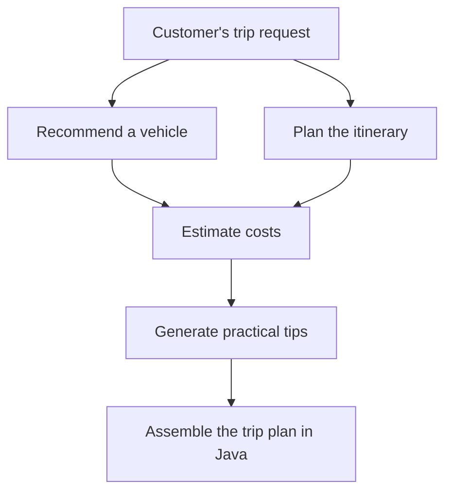

# Step 01 - Agent Skills with Quarkus LangChain4j

A family renting a car for the Italian Riviera needs room for luggage and a route with time for breaks. A customer heading to the Alps for a hiking trip has different priorities, even when the budget and trip length are similar. Miles of Smiles wants to help both customers choose a vehicle and plan a trip that fits those needs.

Sections 1 and 2 covered customer support and fleet operations. Section 3 brings those AI Services, RAG, and multi-agent workflow concepts to a customer trip planner. The starter already recommends a vehicle, plans a route, and estimates costs, but its agents rely on general instructions in their prompts. It has no separate guidance for family holidays, adventure trips, or business travel.

We'll add that guidance as skills: Markdown files that agents can request at runtime. By keeping travel expertise outside the Java prompts, Miles of Smiles can update its advice without rewriting the agents. At the end, you'll compare different trip types and inspect the tool calls to check which guidance the agents actually used.

## Composing sequential and parallel agents

Vehicle selection and itinerary planning can run independently, while cost estimates need both results. The existing workflow uses the parallel and sequential patterns from Section 2 to express these dependencies.


```mermaid
flowchart TD
    Request[Customer's trip request] --> Vehicle[Recommend a vehicle]
    Request --> Itinerary[Plan the itinerary]
    Vehicle --> Costs[Estimate costs]
    Itinerary --> Costs
    Costs --> Tips[Generate practical tips]
    Tips --> Plan[Assemble the trip plan in Java]
```

The form sends a `TripRequest` to `POST /trip/plan`, and the response is a `TripPlan` rendered in the browser. In the code, `TripPlannerSystem` uses `@SequenceAgent`, with a nested `@ParallelAgent` called `ResearchPhase` for the two independent tasks. Each agent saves its result in the shared `AgenticScope`; the tips agent has the vehicle, itinerary, and costs available, and the `@Output` method assembles the final plan without another LLM call.

## Preparing a working copy

==Copy `section-3/step-00` to a working directory outside the step folders and open that copy in your IDE.== All paths and commands below refer to this working project, including when it's time to run the application.

!!!note
    `section-3/step-00` is the runnable starter without skills integration. `section-3/step-01` contains the completed implementation for comparison. There is no need to switch to that directory after editing the starter.

## Dynamic skill discovery and activation

The agents introduced in earlier sections receive instructions through `@SystemMessage` and `@UserMessage`. Although those prompts can contain request-specific values, any guidance written into them is sent on every invocation. Skills keep domain guidance in separate Markdown files so an agent can request the content relevant to the current trip.

Each skill lives in its own subdirectory under `src/main/resources/skills/` as a file named `SKILL.md`. A YAML frontmatter block supplies its `name` and `description`, followed by the guidance in Markdown.

### Adding the Quarkus LangChain4j Skills extension

The `quarkus-langchain4j-skills` extension handles skill discovery and injection. ==Add it to your `pom.xml`:==

```xml
<dependency>
    <groupId>io.quarkiverse.langchain4j</groupId>
    <artifactId>quarkus-langchain4j-skills</artifactId>
</dependency>
```

==Then add the following line to `src/main/resources/application.properties` to tell the extension where to find skill files:==

```properties
quarkus.langchain4j.skills.directories=classpath:skills
```

This points the extension at the `src/main/resources/skills/` directory on the classpath. You can also point it at filesystem paths for skills you want to manage outside the project. See the [Skills extension documentation](https://docs.quarkiverse.io/quarkus-langchain4j/dev/skills.html#_configuration){target="_blank"} for all configuration options. In dev mode, Quarkus picks up changes to skill files automatically without a restart.

### Defining skills in Markdown

This step uses four skills split along two purposes. The `vehicle-selection` skill contains guidance on picking the right vehicle category and applies regardless of trip type. The `family-trip`, `adventure-trip`, and `business-trip` skills each contain itinerary and route planning conventions for their respective trip type.

==Create `src/main/resources/skills/vehicle-selection/SKILL.md` with the following content:==

```markdown title="skills/vehicle-selection/SKILL.md"
--8<-- "../../section-3/step-01/src/main/resources/skills/vehicle-selection/SKILL.md"
```

==Create `src/main/resources/skills/family-trip/SKILL.md`:==

```markdown title="skills/family-trip/SKILL.md"
--8<-- "../../section-3/step-01/src/main/resources/skills/family-trip/SKILL.md"
```

==Create `src/main/resources/skills/adventure-trip/SKILL.md`:==

```markdown title="skills/adventure-trip/SKILL.md"
--8<-- "../../section-3/step-01/src/main/resources/skills/adventure-trip/SKILL.md"
```

==Create `src/main/resources/skills/business-trip/SKILL.md`:==

```markdown title="skills/business-trip/SKILL.md"
--8<-- "../../section-3/step-01/src/main/resources/skills/business-trip/SKILL.md"
```

The extension presents the skill names and descriptions to the LLM and exposes an `activate_skill` tool for agents annotated with `@Skills`. When the model calls that tool, the framework adds the requested Markdown content to the conversation. Making a skill available does not guarantee that the model will use it, so we'll also add prompt instructions and check the tool calls when testing.

### Controlling skill access with `@Skills`

Only the vehicle and itinerary agents need direct access to these skills. ==Open `src/main/java/com/tripplanner/agentic/agents/VehicleAdvisorAgent.java` and update the highlighted lines, including the import, prompt, and annotation:==

```java title="VehicleAdvisorAgent.java" hl_lines="6 12-13 24"
--8<-- "../../section-3/step-01/src/main/java/com/tripplanner/agentic/agents/VehicleAdvisorAgent.java"
```

==In the same directory, update the highlighted lines in `ItineraryPlannerAgent.java`:==

```java title="ItineraryPlannerAgent.java" hl_lines="6 12 25"
--8<-- "../../section-3/step-01/src/main/java/com/tripplanner/agentic/agents/ItineraryPlannerAgent.java"
```

The vehicle advisor has access only to vehicle-selection guidance, which applies across trip types. The itinerary planner can choose from the three trip-specific skills. Explicit names in `@Skills` limit what each agent can access; a name that doesn't match a loaded skill causes a startup error listing the available skills.

The highlighted prompt changes ask the model to activate a skill before answering. The vehicle advisor names its one skill, while the itinerary planner asks for a match to the trip type. These instructions encourage tool use, but the model can still skip the call and answer from its own knowledge.

`CostEstimatorAgent` and `TipsGeneratorAgent` stay unchanged. They use the structured results already in scope and do not need their own skills for this exercise.

!!!note
    A bare `@Skills` annotation, without parameters, gives an agent access to all available skills. With the explicit lists used here, adding a new skill also requires updating the relevant annotation.

## Running the working project

==From the root of your working copy, start the application in a terminal where `OPENAI_API_KEY` is set:==

=== "Linux / macOS"
    ```bash
    ./mvnw quarkus:dev
    ```

=== "Windows"
    ```cmd
    .\mvnw.cmd quarkus:dev
    ```

==Once started, open [http://localhost:8080](http://localhost:8080){target="_blank"} in your browser.==

The application opens on a trip form with fields for destination, start date, duration, number of travelers, trip type, budget range, and additional preferences. The existing capture below shows those fields with an example business trip; the exercise uses different values.


!!! tip "Click to enlarge"
    Screenshots in these docs open fullscreen when you click them, so you can read the form fields and results more easily.

## Testing request-specific skill activation

### A family beach vacation

==Fill in the form with:==

- Destination: `Italian Riviera`
- Start date: a future date of your choice
- Duration: `5` days
- Travelers: `4`
- Trip type: `Family Vacation`
- Budget: `Moderate (€1,000–€2,500)`
- Preferences: `We love coastal towns and good food`

==Click **Generate Trip Plan**.==

While the agents work, the UI shows a wait screen.


==When the plan appears, check the vehicle's seating and luggage advice and the itinerary's pace.== The family skill asks for regular breaks and child-friendly stops, so these are useful details to look for. A plausible plan alone doesn't prove the skills were used; the execution trace below lets you check that separately.

### An adventure trip

==Click **Plan Another Trip**, keep the other fields, and change these values:==

- Destination: `Swiss Alps`
- Trip type: `Adventure Trip`
- Preferences: `We want hiking and mountain passes`

==Click **Generate Trip Plan** and compare the recommendations with the family trip.== The vehicle guidance considers terrain, while the adventure guidance covers hiking and mountain routes. A 4WD recommendation or a route through the Furka Pass is a possible result, not a requirement; the details depend on the request and model response.

### Adjusting the plan

This version has no separate refinement input. ==Click **Plan Another Trip** and add a change to **Additional Preferences**, adapting the locations to your generated itinerary:==

```text
Skip the first day in Zermatt and add a day in Verbier instead
```

==Click **Generate Trip Plan** again.== The entire workflow runs with the updated request. It does not receive the previous plan, so any details the customer wants to keep must be included in the preferences too.

## Inspecting skill tool calls in the Dev UI

==Open the Quarkus Dev UI at `http://localhost:8080/q/dev-ui` and use the LangChain4j Agentic card to inspect the execution history.== Because the planner extends `MonitoredAgent`, this view records agent invocations with their durations, token usage, inputs, and outputs.

==Expand the latest run and look for `activate_skill` calls under the vehicle and itinerary agents.== For the family request, the intended skill names are `vehicle-selection` and `family-trip`; for the adventure request, the itinerary skill is `adventure-trip`. The two research agents should have overlapping timelines, but the duration and number of model requests vary, especially when tool calls require follow-up requests.

??? info "Existing Dev UI captures"
    These captures show where to find the topology and execution details. They predate the current prompts and skill restrictions: the execution capture shows the vehicle advisor calling `family-trip`, which is not available to it with the annotation used in this exercise. Its roughly 13-second duration is one recorded run, not an expected completion time.

    

    

The terminal logs provide another way to check discovery and activation. ==Check the startup logs for the skill count, then inspect the request and response logs for `activate_skill`.== The starter already enables `log-requests` and `log-responses` in `application.properties`. The existing log example shows four discovered files:

```text
INFO  [io.quarkiverse.langchain4j.skills.runtime.SkillsRecorder] Loaded 4 skill(s) from directory: classpath:skills
```

For agents with skills enabled, the outgoing request exposes the activation tool in its `tools` array. This excerpt shows the tool definition, not evidence that the model called it:

```json
"tools" : [ {
  "type" : "function",
  "function" : {
    "name" : "activate_skill",
    "description" : "Returns the full instructions for a skill. Call this before following any skill-specific steps.",
    "parameters" : {
      "type" : "object",
      "properties" : {
        "skill_name" : {
          "type" : "string",
          "description" : "The name of the skill to activate"
        }
      }
    }
  }
} ]
```

An `activate_skill` call in the model's response, followed by the skill content in the tool result, confirms activation. If the call is absent, the skill was not activated for that request; the logs alone do not explain why the model skipped it. The troubleshooting checks below cover configuration and prompt issues worth ruling out.

## Adding and discovering a new skill

The form also has a Romantic Getaway option, but the itinerary agent doesn't yet have a matching skill. A new file can supply the travel guidance without adding another agent.

==Create a new skill file at `src/main/resources/skills/romantic-trip/SKILL.md`:==

```markdown
---
name: romantic-trip
description: Itinerary planning guidance for romantic road trips, covering scenic pacing, atmosphere, and accommodation.
---

# Romantic road trip planning

## Pacing
- Prioritize slow travel over coverage. Two or three meaningful stops are better than six rushed ones.
- Build in unplanned time. A spontaneous vineyard visit or a sunset on a cliff is the point of a romantic trip.
- Avoid motorways when a scenic alternative exists and the time difference is under 45 minutes.

## What to include in the itinerary
- Anchor each overnight stop at a place with atmosphere: a hilltop village, a harbour town, a vineyard estate.
- Include one quiet moment per day where the itinerary has no scheduled activity.
- Coastal routes (Amalfi, Cinque Terre, Algarve) are reliably atmospheric but very busy in peak season; flag this.

## Accommodation
- Boutique hotels and agriturismos over chains. Atmosphere matters more than loyalty points on a romantic trip.
- For stays of 3+ nights in one place, look for a room with a terrace or private garden.
```

==In `ItineraryPlannerAgent.java`, add `romantic-trip` to the existing `@Skills` list:==

```java title="ItineraryPlannerAgent.java" hl_lines="1"
    @Skills({"family-trip", "adventure-trip", "business-trip", "romantic-trip"})
```

Discovery makes the file available to the extension, but the explicit list controls access for this agent. Dev mode picks up the changes; the vehicle advisor's list stays unchanged and still permits only `vehicle-selection`.

==Generate a trip with **Romantic Getaway** selected, then check the execution trace for an `activate_skill` call with `romantic-trip`.== If the model uses it, the plan may reflect slower pacing and accommodation with more atmosphere. The trace is the check for activation, not whether the result mentions a particular hotel or scenic stop.

### Comparing trip types at one destination

==Plan a trip to the Swiss Alps as **Family Vacation**, **Adventure Trip**, and **Business Travel**, keeping the other fields the same. Compare the plans and the skills activated in each run.== The available vehicle guidance stays the same, but its recommendation can still change because it also considers the trip type. The itinerary agent has different guidance available for each type, so pacing and suggested activities are useful points of comparison.

## Troubleshooting

??? warning "Error: OPENAI_API_KEY not set"
    ==Set the environment variable in the terminal used to run the application.== For Linux or macOS:

    ```bash
    export OPENAI_API_KEY=sk-your-key-here
    ```

    ==Then restart the application from your working copy.==

??? warning "Response takes too long or times out"
    The workflow invokes four agents, two in parallel and two sequentially. Skill activation can add model requests within an agent invocation. ==Check `quarkus.langchain4j.openai.timeout` in `application.properties` and try a shorter trip duration.== The starter configures a 120-second timeout.

??? warning "Skills not being activated"
    ==Check the following before generating another plan:==

    - `quarkus.langchain4j.skills.directories=classpath:skills` is set in `application.properties`.
    - Skill files are named `SKILL.md` (case-sensitive) and placed in subdirectories under `src/main/resources/skills/`.
    - Each file has valid YAML frontmatter with both `name` and `description` fields.
    - The skill's name appears in the agent's explicit `@Skills` list, including `romantic-trip` if added.
    - The prompt asks the model to activate a skill, and the model supports tool calling.

## What's next?

The planner now has travel guidance in Markdown files, with each agent's access controlled by its skill list. Inspecting the tool calls lets you distinguish guidance that was available from guidance the model actually used.

In Step 02, you'll add guardrails and compliance checks to catch unsuitable trip recommendations before they reach the customer.

[Continue to Step 02 - Guardrails and Compliance](step-02.md)
