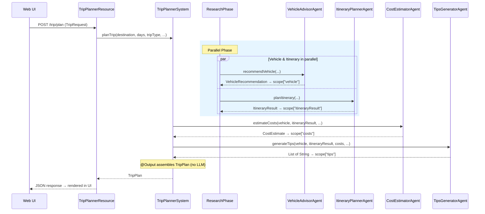
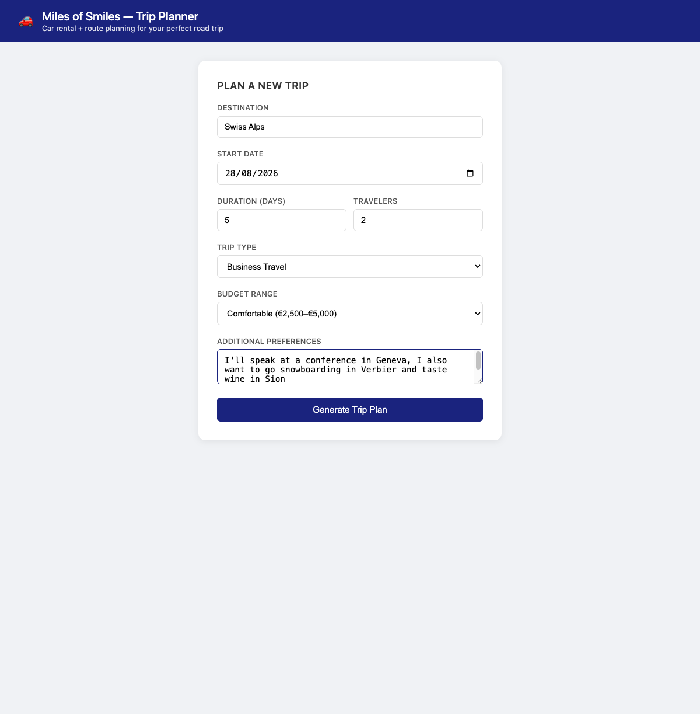

# Step 01 - Multi-Agent Trip Planner with Skills

## Welcome to Section 3: Enterprise Agentic Patterns

Section 3 introduces a brand-new scenario and a set of enterprise-grade agentic patterns built on top of everything covered in Sections 1 and 2. If you're not yet comfortable with AI Services, RAG, or the basics of multi-agent workflows, it's worth going back and reviewing those sections first — we'll build on all of it here.

The new scenario we're going to work on in this section is a **Customer Trip Planner**. Miles of Smiles wants to offer a trip planner to their customers, helping with decisions on where they want to go, for how long, and what kind of trip they have in mind. The system then picks the right vehicle, plans the route, estimates costs, and generates practical tips.

The main new concept we're covering in this step is **Skills**. Skills let you inject domain expertise into agents at runtime from plain Markdown files.

!!!note
    Two code directories accompany this step. `section-3/step-00` contains the initial multi-agent trip planner without any skills integration. The agents are wired up and the app runs, but the skills extension and its annotations are not yet added. `section-3/step-01` is the completed version for this step. If you want to implement skills yourself as you read, start from `step-00`. If you'd rather follow along in a working codebase, use `step-01`.

---

## The System

The multi-agent system is already built using the agentic patterns from Section 2. Here's the shape of it:

```
TripPlannerSystem (@SequenceAgent)
│
├─ ResearchPhase (@ParallelAgent)
│   ├── VehicleAdvisorAgent    → recommends a vehicle
│   └── ItineraryPlannerAgent  → plans day-by-day itinerary
│
├─ CostEstimatorAgent          → estimates costs
│
├─ TipsGeneratorAgent          → generates practical tips
│
└─ @Output                     → assembles the final TripPlan
```

The `VehicleAdvisorAgent` and `ItineraryPlannerAgent` are independent, so they run in parallel inside `ResearchPhase`. The `CostEstimatorAgent` needs the vehicle and itinerary to produce realistic numbers, so it runs after. `TipsGeneratorAgent` runs last with the full context available. The `@Output` method on `TripPlannerSystem` then assembles the final `TripPlan` from scope values using pure Java without an extra LLM call.

The LangChain4j Agentic card in the Quarkus DevUI gives you an interactive topology view of the entire agent system:


Here's an overview of the flow: 

```mermaid
sequenceDiagram
    participant User as Web UI
    participant REST as TripPlannerResource
    participant Seq as TripPlannerSystem
    participant RP as ResearchPhase
    participant VA as VehicleAdvisorAgent
    participant IP as ItineraryPlannerAgent
    participant CE as CostEstimatorAgent
    participant TG as TipsGeneratorAgent

    User->>REST: POST /trip/plan (TripRequest)
    REST->>Seq: planTrip(destination, days, tripType, ...)

    rect rgb(230, 245, 255)
        Note over RP: Parallel Phase
        par Vehicle & Itinerary in parallel
            RP->>VA: recommendVehicle(...)
            VA-->>RP: VehicleRecommendation → scope["vehicle"]
        and
            RP->>IP: planItinerary(...)
            IP-->>RP: ItineraryResult → scope["itineraryResult"]
        end
    end

    Seq->>CE: estimateCosts(vehicle, itineraryResult, ...)
    CE-->>Seq: CostEstimate → scope["costs"]

    Seq->>TG: generateTips(vehicle, itineraryResult, costs, ...)
    TG-->>Seq: List of String → scope["tips"]

    Note over Seq: @Output assembles TripPlan (no LLM)
    Seq-->>REST: TripPlan
    REST-->>User: JSON response → rendered in UI
```

---

## Skills

In Sections 1 and 2, agents got their behavior and instructions from `@SystemMessage` and `@UserMessage` annotations. Those messages are static and the entire content is sent to the LLM regardless of the context.

Skills solve this by externalizing domain knowledge into Markdown files that are loaded and injected at runtime. Each skill lives in its own subdirectory under `src/main/resources/skills/` as a file named `SKILL.md`. The file starts with a YAML frontmatter block containing a `name` and a `description`, followed by the actual expert content in plain Markdown.

### Adding the extension

The `quarkus-langchain4j-skills` extension handles skill discovery and injection. ==Add it to your `pom.xml`:==

```xml
<dependency>
    <groupId>io.quarkiverse.langchain4j</groupId>
    <artifactId>quarkus-langchain4j-skills</artifactId>
</dependency>
```

==Then add the following line to `application.properties` to tell the extension where to find skill files:==

```properties
quarkus.langchain4j.skills.directories=classpath:skills
```

This points the extension at the `src/main/resources/skills/` directory on the classpath. You can also point it at filesystem paths for skills you want to manage outside the project. See the [Skills extension documentation](https://docs.quarkiverse.io/quarkus-langchain4j/dev/skills.html#_configuration){target="_blank"} for all configuration options. In dev mode, Quarkus picks up changes to skill files automatically without a restart.

### Creating the skill files

This step uses four skills split along two purposes. The `vehicle-selection` skill contains guidance on picking the right vehicle category and applies regardless of trip type. The `family-trip`, `adventure-trip`, and `business-trip` skills each contain itinerary and route planning conventions for their respective trip type.

==Create `src/main/resources/skills/vehicle-selection/SKILL.md` with the following content:==

```markdown title="skills/vehicle-selection/SKILL.md"
--8<-- "../../section-3/step-01/src/main/resources/skills/vehicle-selection/SKILL.md"
```

==Create `src/main/resources/skills/family-trip/SKILL.md`:==

```markdown title="skills/family-trip/SKILL.md"
--8<-- "../../section-3/step-01/src/main/resources/skills/family-trip/SKILL.md"
```

==Create `src/main/resources/skills/adventure-trip/SKILL.md`:==

```markdown title="skills/adventure-trip/SKILL.md"
--8<-- "../../section-3/step-01/src/main/resources/skills/adventure-trip/SKILL.md"
```

==Create `src/main/resources/skills/business-trip/SKILL.md`:==

```markdown title="skills/business-trip/SKILL.md"
--8<-- "../../section-3/step-01/src/main/resources/skills/business-trip/SKILL.md"
```

The `name` and `description` fields in the frontmatter are what the skills extension presents to the LLM. When an agent annotated with `@Skills` is invoked, the framework exposes an `activate_skill` tool listing the names and descriptions of the skills that agent has access to. The LLM picks the one that fits the current request, calls the tool, and the full Markdown content is injected into its context before it generates a response.

### Annotating the agents

Only two of the four agents need skills. ==Open `VehicleAdvisorAgent.java` and add the `@Skills` annotation and its import:==

```java title="VehicleAdvisorAgent.java"
--8<-- "../../section-3/step-01/src/main/java/com/tripplanner/agentic/agents/VehicleAdvisorAgent.java"
```

==Do the same for `ItineraryPlannerAgent.java`:==

```java title="ItineraryPlannerAgent.java"
--8<-- "../../section-3/step-01/src/main/java/com/tripplanner/agentic/agents/ItineraryPlannerAgent.java"
```

The two agents use `@Skills` differently. `VehicleAdvisorAgent` gets `@Skills({"vehicle-selection"})` because it only ever needs vehicle guidance, regardless of trip type. `ItineraryPlannerAgent` gets `@Skills({"family-trip", "adventure-trip", "business-trip"})` and picks the right one based on what the customer described. When you pass skill names explicitly, each agent only sees the skills you listed. If a name doesn't match any loaded skill, the application fails at startup with a clear error listing what's available.

You'll also notice each prompt explicitly tells the LLM to activate a skill before answering. `VehicleAdvisorAgent` says `Before answering, activate the vehicle-selection skill.` since there's only one and it should always be used. `ItineraryPlannerAgent` says `Before answering, activate the skill that matches the trip type.` so the LLM picks the right one from the three available. Without these instructions, the LLM may skip the tool call entirely and answer from its own knowledge, defeating the purpose of injecting the skill in the first place.

`CostEstimatorAgent` and `TipsGeneratorAgent` need no `@Skills` annotation. They work from the structured vehicle and itinerary data already in scope and don't need anything injected at runtime.

!!!note
    If you want to load all available skills to an agent, you can just annotate it a bare `@Skills` without parameters.

---

## Running the Application

==Navigate to the `section-3/step-01` directory and start the application:==

=== "Linux / macOS"
    ```bash
    cd section-3/step-01
    ./mvnw quarkus:dev
    ```

=== "Windows"
    ```cmd
    cd section-3\step-01
    mvnw quarkus:dev
    ```

Once started, open your browser to [http://localhost:8080](http://localhost:8080){target="_blank"}.

The application opens on a trip form with fields for destination, duration, number of travelers, trip type, budget range, and any additional preferences.



!!! tip "Click to enlarge"
    Screenshots in these docs open fullscreen when you click them, so you can read the form fields and results more easily.

---

## Try It Out

### Family Beach Vacation

==Fill in the form with:==

- **Destination**: `Italian Riviera`
- **Duration**: `5` days
- **Travelers**: `4`
- **Trip Type**: `Family Vacation`
- **Budget**: `Moderate (€1,000–€2,500)`
- **Preferences**: `We love coastal towns and good food`

==Click **Generate Trip Plan**.==

While the agents work, the UI shows a wait screen:


`ResearchPhase` runs `VehicleAdvisorAgent` and `ItineraryPlannerAgent` in parallel. `VehicleAdvisorAgent` activates the `vehicle-selection` skill and picks a vehicle suited for a family of four. `ItineraryPlannerAgent` activates the `family-trip` skill and builds a paced, kid-friendly itinerary. `CostEstimatorAgent` then reads both results from the `AgenticScope` to produce cost estimates, and `TipsGeneratorAgent` reads everything to generate relevant tips. The `@Output` method assembles all of it into a `TripPlan` without an extra LLM call.

### Adventure Trip

==Now try a different trip type:==

- **Destination**: `Swiss Alps`
- **Trip Type**: `Adventure Trip`
- **Preferences**: `We want hiking and mountain passes`

`VehicleAdvisorAgent` activates `vehicle-selection` and recommends a 4WD vehicle for the Alpine terrain. `ItineraryPlannerAgent` activates `adventure-trip` and routes the itinerary through passes like Furka. Each agent uses a different skill for a different job.

### Refine the Plan

With a plan displayed, ==use the **Refine** input at the bottom:==

```
Skip the first day in Zermatt and add a day in Verbier instead
```

The entire pipeline re-runs with your refinement incorporated.

---

## Looking at the Execution

Since `TripPlannerSystem` extends `MonitoredAgent`, the Quarkus DevUI gives you a full execution trace showing every agent invocation with its duration, token usage, and inputs/outputs:


Notice how `recommendVehicle` and `planItinerary` run in parallel with overlapping timelines, each firing an `activate_skill` tool call before generating a response. The entire pipeline completes in roughly 13 seconds across 4 LLM calls, 2 parallel and 2 sequential.

You can also confirm skills are working directly from the terminal logs. At startup, the skills extension logs how many skill files it found:

```
INFO  [io.quarkiverse.langchain4j.skills.runtime.SkillsRecorder] Loaded 4 skill(s) from directory: classpath:skills
```

For each agent request, the outgoing JSON includes `activate_skill` in the `tools` array, which is how the framework exposes available skills to the LLM:

```json
"tools" : [ {
  "type" : "function",
  "function" : {
    "name" : "activate_skill",
    "description" : "Returns the full instructions for a skill. Call this before following any skill-specific steps.",
    "parameters" : {
      "type" : "object",
      "properties" : {
        "skill_name" : {
          "type" : "string",
          "description" : "The name of the skill to activate"
        }
      }
    }
  }
} ]
```

When the LLM decides to use a skill, it responds with a tool call for `activate_skill` before generating its final answer. The framework then injects the full skill content into the conversation and the LLM proceeds with that context. If you don't see the tool call in the logs for a given request, the LLM judged that none of the available skills were relevant enough to activate.

---

## Experiment Further

### Add a New Skill

==Create a new skill file at `src/main/resources/skills/romantic-trip/SKILL.md`:==

```markdown
---
name: romantic-trip
description: Itinerary planning guidance for romantic road trips — scenic pacing, atmosphere, and accommodation.
---

# Romantic Road Trip Planning

## Pacing
- Prioritize slow travel over coverage. Two or three meaningful stops are better than six rushed ones.
- Build in unplanned time. A spontaneous vineyard visit or a sunset on a cliff is the point of a romantic trip.
- Avoid motorways when a scenic alternative exists and the time difference is under 45 minutes.

## What to Include in the Itinerary
- Anchor each overnight stop at a place with atmosphere: a hilltop village, a harbour town, a vineyard estate.
- Include one quiet moment per day where the itinerary has no scheduled activity.
- Coastal routes (Amalfi, Cinque Terre, Algarve) are reliably atmospheric but very busy in peak season; flag this.

## Accommodation
- Boutique hotels and agriturismos over chains. Atmosphere matters more than loyalty points on a romantic trip.
- For stays of 3+ nights in one place, look for a room with a terrace or private garden.
```

Quarkus dev mode will pick it up automatically. Try a trip with the **Romantic Getaway** type and watch `ItineraryPlannerAgent` activate the new skill. `VehicleAdvisorAgent` is unaffected because it only has access to `vehicle-selection`.

### Compare Trip Types

Plan a trip to the **Swiss Alps** three times as `Family Vacation`, `Adventure Trip`, and `Business Travel`. The vehicle recommendation stays in a similar category each time because `VehicleAdvisorAgent` always uses `vehicle-selection`. The itinerary and pacing change for each because `ItineraryPlannerAgent` activates a different skill each time.

### Inspect Parallel Execution

With `log-requests` and `log-responses` enabled in `application.properties`, check your terminal logs. You should see two overlapping LLM calls from `VehicleAdvisorAgent` and `ItineraryPlannerAgent`, confirming they ran in parallel.

---

## Troubleshooting

??? warning "Error: OPENAI_API_KEY not set"
    Make sure you've exported the environment variable:

    ```bash
    export OPENAI_API_KEY=sk-your-key-here
    ```

    Then restart the application.

??? warning "Response takes too long or times out"
    The pipeline makes 4 LLM calls (2 in parallel + 2 sequential). If you're hitting timeouts, check the `quarkus.langchain4j.openai.timeout` value in `application.properties` (default is 120 seconds per call) and try a shorter trip duration.

??? warning "Skills not being activated"
    - Check that `quarkus.langchain4j.skills.directories=classpath:skills` is set in `application.properties`
    - Skill files must be named `SKILL.md` (case-sensitive) and placed in subdirectories under `src/main/resources/skills/`
    - Each `SKILL.md` must have valid YAML frontmatter with both `name` and `description` fields

---

## What's Next?

In this step you saw how Skills let you externalize domain expertise into Markdown files and inject it into agents dynamically at runtime. You don't need to recompile or change any Java code. Drop in a new `SKILL.md` and the LLM picks it up automatically.

In **Step 02**, you'll add guardrails and compliance checks to make sure trip recommendations are safe and appropriate before they reach the customer.

[Continue to Step 02 - Guardrails and Compliance](step-02.md)
