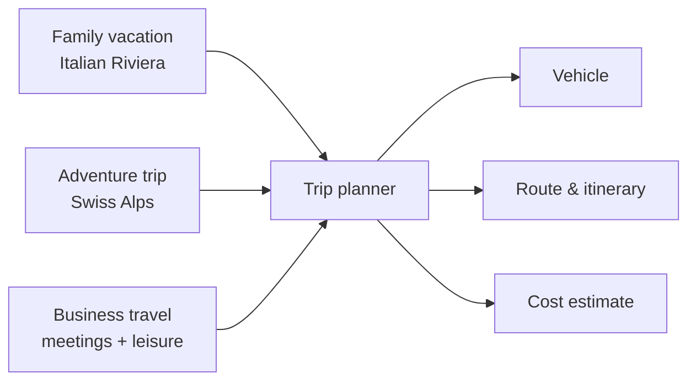
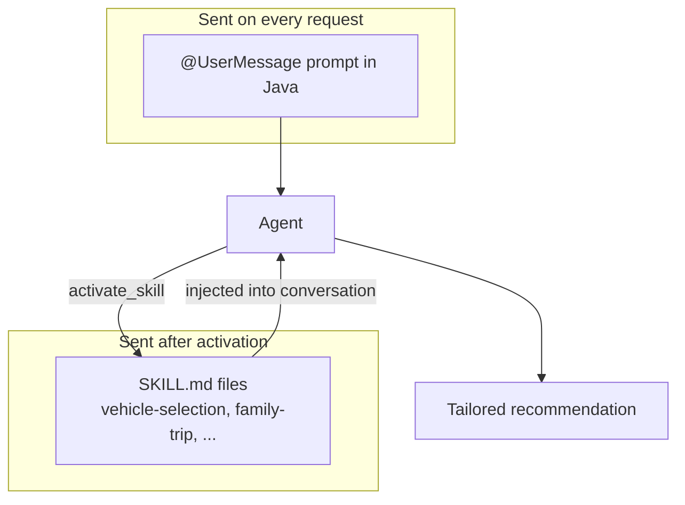
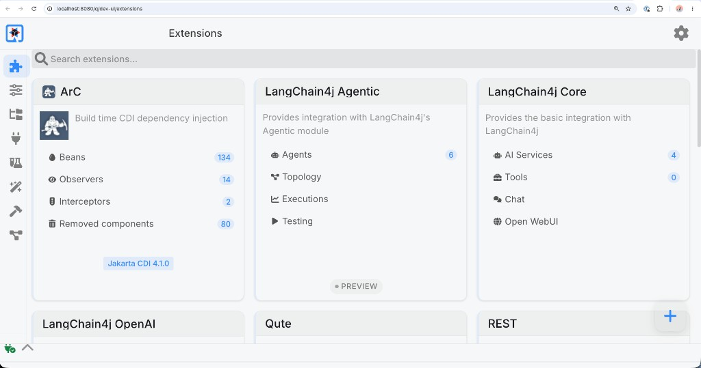
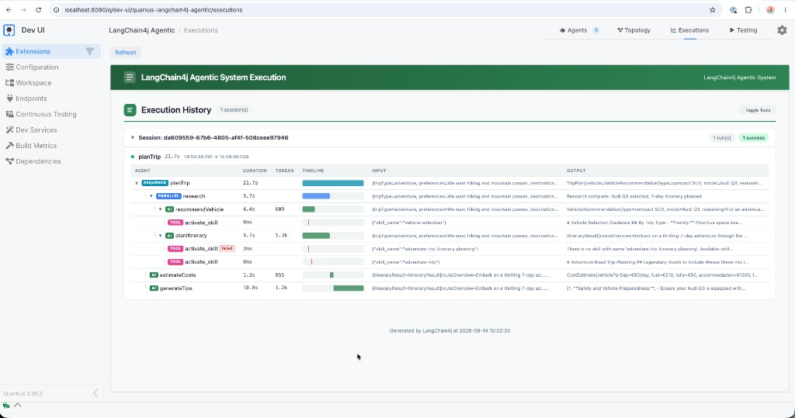

# Step 01 - Agent Skills with Quarkus LangChain4j

## Welcome to Section 3: Enterprise Agentic Patterns

This section builds on Sections 1 and 2 with a new scenario and a set of enterprise agentic patterns. If AI Services or multi-agent workflows are still unfamiliar, review those sections first.

## A new scenario

Miles of Smiles wants a **Customer Trip Planner** that helps customers choose a destination, duration, and trip style, then returns a vehicle recommendation, route, and cost estimate.

A family of four on the Italian Riviera needs space for luggage, regular breaks, and child-friendly stops, while a customer combining a Geneva meeting with snowboarding in Verbier has different priorities entirely. The planner needs to handle these different scenarios, with different guidance for each.

As a car rental agency, Miles of Smiles also wants to suggest useful rental extras. A family traveling with a young child may need a suitable child seat, while a winter mountain trip might call for compatible snow chains. Some of these extras will (conveniently for Miles of Smiles) be paid extras, while others like child seats are legally required and can't be considered upsells. 



```mermaid
flowchart LR
    Family[Family vacation\nItalian Riviera] --> Planner[Trip planner]
    Adventure[Adventure trip\nSwiss Alps] --> Planner
    Business[Business travel\nmeetings + leisure] --> Planner
    Planner --> Vehicle[Vehicle]
    Planner --> Route[Route & itinerary]
    Planner --> Costs[Cost estimate]
```

## What are we building?

To keep the focus on the new concepts of this step, the workshop provides starter code in `section-3/step-00` with all the UI components already built. This starter code also has an existing set of agents to plan a basic trip. These Agents recommend a vehicle, plan a route, and estimate costs, but they rely on **general instructions** baked into their prompts. There is no separate guidance for family holidays, adventure trips, or business travel yet.

<figure markdown="span">
  { width="400" }
</figure>

In this step, we're going to add **skills**: Markdown files that agents can request at runtime through a built-in `activate_skill` tool. Unlike the fixed prompts we've seen in the previous chapters which are passed to the model on every request, the full skill content is added to the conversation **only after activation**.


```mermaid
flowchart TD
    subgraph fixed [Sent on every request]
        Prompt["@UserMessage prompt in Java"]
    end

    subgraph ondemand [Sent after activation]
        Skills["SKILL.md files\nvehicle-selection, family-trip, ..."]
    end

    Prompt --> Agent[Agent]
    Agent -->|"activate_skill"| Skills
    Skills -->|"injected into conversation"| Agent
    Agent --> Result[Tailored recommendation]
```

Keeping specific skills, like travel expertise, outside the fixed prompts lets Miles of Smiles update its advice without rewriting the agents and only load specific guidance if the model deems it useful to its response. 


## Preparing a working copy

!!!note "Build Hands-on or review"
    You have the option to build the new features hands-on by working from the starter code, or if you prefer to just review you can go directly to the completed step 01 project. If you're going with option 1 and something doesn't end up working, you can also compare your code with the step 01 solution to see what you've missed.

=== "Option 1: Build it hands-on"

    ==Copy `section-3/step-00` to a working directory outside the step folders and open that copy in your IDE.== All paths and commands below refer to this working project, including when it's time to run the application.

=== "Option 2: Use the completed Step 01 project"

    The completed project already contains the changes below.

    ==Open `section-3/step-01` and start dev mode:==

    === "Linux / macOS"
        ```bash
        cd section-3/step-01
        ./mvnw quarkus:dev
        ```

    === "Windows"
        ```cmd
        cd section-3\step-01
        mvnw quarkus:dev
        ```

!!! info "How the starter workflow is structured"

    Vehicle selection and itinerary planning run in parallel, then cost estimation runs once both are done. The outputs are assembled into the final trip plan in Java.

    ```mermaid
    flowchart TD
        Request[Customer's trip request] --> Vehicle[Recommend a vehicle]
        Request --> Itinerary[Plan the itinerary]
        Vehicle --> Costs[Estimate costs]
        Itinerary --> Costs
        Costs --> Plan[Assemble the trip plan in Java]
    ```


## Dynamic skill discovery and activation

You've already seen how system and user prompts work through the `@SystemMessage` and `@UserMessage` annotations. These are very useful to provide context and instructions to a model, however this guidance is sent on **every invocation**. Skills on the other hand keep domain guidance in separate Markdown files so an agent can request **only the content relevant** to the current trip.

### Adding skills to Quarkus LangChain4j

To be able to handle skill discovery and injection in Quarkus LangChain4j, you need to add the `quarkus-langchain4j-skills` extension. ==Add it to your `pom.xml`:==

```xml
<dependency>
    <groupId>io.quarkiverse.langchain4j</groupId>
    <artifactId>quarkus-langchain4j-skills</artifactId>
</dependency>
```

==Then add the following line to `src/main/resources/application.properties` to tell the extension where to find skill files:==

```properties
quarkus.langchain4j.skills.directories=classpath:skills
```

This points the extension at the `src/main/resources/skills/` directory on the classpath. You can also point it at filesystem paths for skills you want to manage outside the project.

??? "Create skills from other sources?"
    Skills do not have to be file-system based. You can also create them from any other source — a database, a remote API, generated at runtime — using the upstream [LangChain4j builder API](https://docs.langchain4j.dev/tutorials/skills/#programmatically).


### Defining skills

We're going to add four skills split along two purposes. A `vehicle-selection` skill contains guidance on picking the right vehicle category and applies regardless of trip type. Then we'll add 3 additional skills containing itinerary and route planning conventions based on what kind of trip the customer will take: `family-trip`, `adventure-trip`, and `business-trip`.

Skills live in their own subdirectory under `src/main/resources/skills/` as a file named `SKILL.md`. A YAML frontmatter block (a block of metadata that sits at the top of a Markdown file) supplies its `name` and `description`, followed by the guidance in Markdown. See the [Skills extension documentation](https://docs.quarkiverse.io/quarkus-langchain4j/dev/skills.html#_configuration){target="_blank"} for all configuration options.

==Create `src/main/resources/skills/vehicle-selection/SKILL.md` with the following content:==

```markdown title="skills/vehicle-selection/SKILL.md"
--8<-- "../../section-3/step-01/src/main/resources/skills/vehicle-selection/SKILL.md"
```

==Create `src/main/resources/skills/family-trip/SKILL.md`:==

```markdown title="skills/family-trip/SKILL.md"
--8<-- "../../section-3/step-01/src/main/resources/skills/family-trip/SKILL.md"
```

==Create `src/main/resources/skills/adventure-trip/SKILL.md`:==

```markdown title="skills/adventure-trip/SKILL.md"
--8<-- "../../section-3/step-01/src/main/resources/skills/adventure-trip/SKILL.md"
```

==Create `src/main/resources/skills/business-trip/SKILL.md`:==

```markdown title="skills/business-trip/SKILL.md"
--8<-- "../../section-3/step-01/src/main/resources/skills/business-trip/SKILL.md"
```

The extension presents the skill names and descriptions to the LLM and exposes an `activate_skill` tool for agents.

### Controlling skill access with `@Skills`

Only the vehicle and itinerary agents need direct access to these skills. You can control which agents have access to all or some skills by using the `@Skills` annotation. When the model requests to activate a skill, the framework automatically adds the requested Markdown content to the conversation. Note that making a skill available does not guarantee that the model will use it, so we'll also add prompt instructions and check the tool calls when testing.

 ==Open `src/main/java/com/tripplanner/agentic/agents/VehicleAdvisorAgent.java` and update the highlighted lines, including the import, prompt, and annotation:==

```java title="VehicleAdvisorAgent.java" hl_lines="6 12-13 24"
--8<-- "../../section-3/step-01/src/main/java/com/tripplanner/agentic/agents/VehicleAdvisorAgent.java"
```

==In the same directory, update the highlighted lines in `ItineraryPlannerAgent.java`:==

```java title="ItineraryPlannerAgent.java" hl_lines="6 12 25"
--8<-- "../../section-3/step-01/src/main/java/com/tripplanner/agentic/agents/ItineraryPlannerAgent.java"
```

The vehicle advisor has access **only** to vehicle-selection guidance, which applies across trip types. The itinerary planner can choose from the three trip-specific skills.

The highlighted prompt changes ask the model to activate a skill before answering. Be aware that these instructions encourage tool use, but the model can still skip the call and answer from its own knowledge.

!!!note
    A bare `@Skills` annotation, without parameters, gives an agent access to *all* available skills. With the explicit lists used here, adding a new skill also requires updating the relevant annotation.

## Running the working project

==From the root of your working copy, start the application in a terminal where your `OPENAI_API_KEY` is set:==

=== "Linux / macOS"
    ```bash
    ./mvnw quarkus:dev
    ```

=== "Windows"
    ```cmd
    .\mvnw.cmd quarkus:dev
    ```

==Once started, open [http://localhost:8080](http://localhost:8080){target="_blank"} in your browser.== The trip form shown at the top of this page is where you will enter each test request.

## Planning a family beach vacation

==Fill in the form with:==

- Destination: `Italian Riviera`
- Start date: a future date of your choice
- Duration: `7` days
- Travelers: `4`
- Trip type: `Family Vacation`
- Budget: `Moderate (€1,000–€2,500)`
- Preferences: `We love coastal towns and good food`

==Click **Generate Trip Plan**.== The family skill asks for rest days on a week-long trip, along with driving-time estimates and regular breaks.

While the agents work, the UI shows a wait screen.


==Read the vehicle recommendation and daily itinerary.== Look for family-friendly choices such as luggage space, regular breaks, and days without driving. Driving times are model-generated estimates, not verified routing data.

## Inspecting skill tool calls in the Dev UI

The model can produce family travel advice from its own knowledge while ignoring the skill instructions. The execution history and logs let us check whether it requested the skill and received its content before judging the itinerary.

==Open the Quarkus Dev UI at [http://localhost:8080/q/dev-ui](http://localhost:8080/q/dev-ui){target="_blank"} (or press the letter `d` from your terminal).== The extensions page lists a LangChain4j Agentic card alongside the other installed extensions.



==Click **Executions** in the LangChain4j Agentic card.== Because the planner extends `MonitoredAgent`, this view records agent invocations with their durations, token usage, inputs, and outputs.

==Expand the family run and inspect the `activate_skill` calls and their results under the vehicle and itinerary agents.== Look for `vehicle-selection` and `family-trip`. A successful family activation returns the Markdown headed `# Family Road Trip Planning`.



The terminal logs provide another way to check discovery and activation. ==Check the startup logs for the skill count, then scroll through the request and response logs after generating a trip plan.== The starter already enables `log-requests` and `log-responses` in `application.properties`.

At startup, the skills extension reports how many files it found:

```text
INFO  [io.quarkiverse.langchain4j.skills.runtime.SkillsRecorder] Loaded 4 skill(s) from directory: classpath:skills
```

When an agent with skills enabled makes its first request, the outgoing body includes the `activate_skill` tool definition in the `tools` array. That only means the tool is available to the model, not that it was called:

```json
"tools" : [ {
  "type" : "function",
  "function" : {
    "name" : "activate_skill",
    "description" : "Returns the full instructions for a skill. Call this before following any skill-specific steps.",
    "parameters" : {
      "type" : "object",
      "properties" : {
        "skill_name" : {
          "type" : "string",
          "description" : "The name of the skill to activate"
        }
      },
      "required" : [ "skill_name" ]
    }
  }
} ]
```

The evidence that the model actually called the tool is in the **Response** log. Look for a `tool_calls` entry with `activate_skill` and the skill name in the arguments:

```json
"tool_calls" : [ {
  "id" : "call_GvYO3PDO7EnJCU0v7Ix28zXp",
  "type" : "function",
  "function" : {
    "name" : "activate_skill",
    "arguments" : "{\"skill_name\":\"vehicle-selection\"}"
  }
} ]
```

Once a call succeeds, the next request log includes a `tool` message with the full skill content. This excerpt is from the vehicle advisor after `vehicle-selection` was activated:

```json
{
  "role" : "tool",
  "tool_call_id" : "call_GvYO3PDO7EnJCU0v7Ix28zXp",
  "content" : "# Vehicle Selection Guidance\n\n## By Trip Type\n- **Family:** Prioritize space over style. An MPV or 7-seat SUV fits car seats, luggage, and restless passengers...\n- **Adventure:** Ground clearance matters more than engine power. A compact SUV handles most classified mountain roads..."
}
```

==Find the corresponding `family-trip` call and its returned content.== Match `tool_call_id` to the call's `id` to avoid confusing an earlier result in the conversation with the current activation. If the Dev UI does not show the full content, use the terminal logs.

## Updating the travel guidance

Suppose Miles of Smiles wants to recommend more rest days for week-long family trips. You can change that advice in the skill without editing the Agent prompts.

First, to make our dev mode testing smoother, ==add this dev-mode setting to `application.properties` so edits to the family skill trigger an application reload:==

```properties
%dev.quarkus.live-reload.watched-resources=skills/family-trip/SKILL.md
```

??? "Why add this watched-resources property?"
    The extension keeps skill content in memory, so edits need an application reload to take effect. This setting makes Quarkus reload on the next HTTP request after the file changes. Paths are relative to `src/main/resources/`, and additional files can be listed with commas.

Notice how many rest days were mentioned in the original trip plan (there should be one), then ==open `src/main/resources/skills/family-trip/SKILL.md` and change "exactly one rest day" to "exactly two rest days".== Leave dev mode running. The watched-resource setting reloads the application on the next request, which also clears its in-memory execution history.

==Click **Plan Another Trip** and generate a plan with the same form values.== Then inspect the new `family-trip` tool result for the updated rest-day instruction and compare the itineraries. Does the new plan include two rest days without driving?

==Restore "exactly one rest day" before continuing.==

## Comparing family and adventure skill selection

The itinerary planner also has guidance for other trip types. Let's see which skill it chooses for an adventure trip.

==Click **Plan Another Trip**, keep the remaining family form values, and change these fields:==

- Destination: `Swiss Alps`
- Trip type: `Adventure Trip`
- Preferences: `We want hiking and mountain passes`

==Click **Generate Trip Plan**, then inspect the new execution for a successful `adventure-trip` activation and its returned content. Compare the recommendations with the family trip.== The vehicle advisor still uses `vehicle-selection`, while the itinerary planner can select guidance for hiking and mountain routes.

## Taking it further

For more practice with skills, try adding child-seat guidance to `family-trip/SKILL.md`. Ask the itinerary agent to include the advice in the route overview and request any missing age, height, or weight details before suggesting a specific seat. Selecting **Family Vacation** alone is not enough to determine what restraint a child needs. Compare a request to rent a child seat with one whose preferences say "We are bringing our own child seat", checking both the activated skill content and the recommendation. Leave vehicle compatibility, availability, and price for Miles of Smiles to confirm.

The trip form also includes a **Romantic Getaway** option with no matching skill yet. You could add a `romantic-trip/SKILL.md` file, register it on the itinerary agent's `@Skills` list, and check the execution trace for an `activate_skill` call when you select that trip type.

The exercises above used family and adventure trips. Run the same destination as **Business Travel** and confirm the `business-trip` skill is activated instead. Planning one destination three or four times with different trip types is a quick way to see how much the itinerary changes when only the skill selection differs.

==Try a bare `@Skills` annotation on one agent to give it access to every discovered skill, then compare which skills the model picks when the list is not restricted.==

## Troubleshooting

??? warning "Error: OPENAI_API_KEY not set"
    ==Set the environment variable in the terminal used to run the application.== For Linux or macOS:

    ```bash
    export OPENAI_API_KEY=sk-your-key-here
    ```

    ==Then restart the application from your working copy.==

??? warning "Response takes too long or times out"
    The Step 01 workflow invokes three agents, with vehicle selection and itinerary planning running in parallel before cost estimation. Skill activation can add model requests within an agent invocation. ==Check `quarkus.langchain4j.openai.timeout` in `application.properties` and try a shorter trip duration.== The starter configures a 120-second timeout.

??? warning "Skills not being activated"
    ==Check the following before generating another plan:==

    - `quarkus.langchain4j.skills.directories=classpath:skills` is set in `application.properties`.
    - Skill files are named `SKILL.md` (case-sensitive) and placed in subdirectories under `src/main/resources/skills/`.
    - Each file has valid YAML frontmatter with both `name` and `description` fields.
    - The skill's name appears in the agent's explicit `@Skills` list.
    - The prompt asks the model to activate a skill, and the model supports tool calling.

??? warning "An activation returns the old skill content"
    ==Check that `%dev.quarkus.live-reload.watched-resources` includes the edited skill file, then refresh the application page.== The completed Step 01 project watches only `skills/family-trip/SKILL.md`. The terminal should show fresh `Loaded 4 skill(s)` and `Live reload total time` messages before the next generation.

## What's next?

The planner now has travel guidance in Markdown files, with each agent's access controlled by its skill list. You can update that guidance independently of the Java prompts and use tool results to check what the model received.

In Step 02, you'll add guardrails and compliance checks to catch unsuitable trip recommendations before they reach the customer.

[Continue to Step 02 - Guardrails and Compliance](step-02.md)
