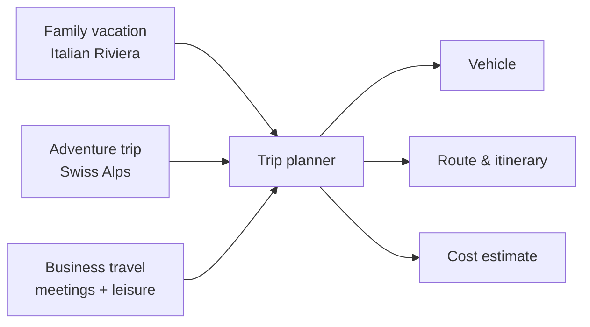
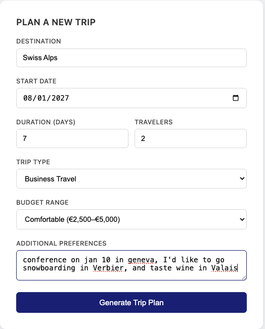
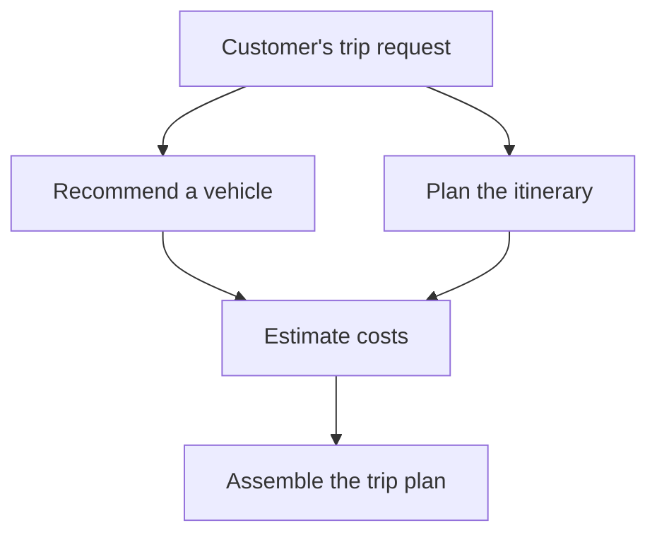
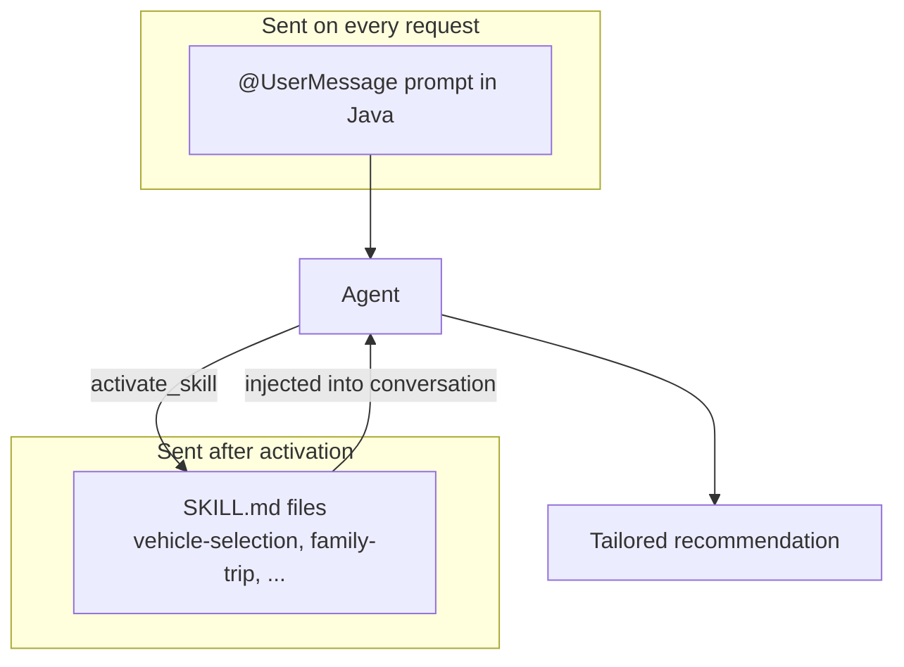
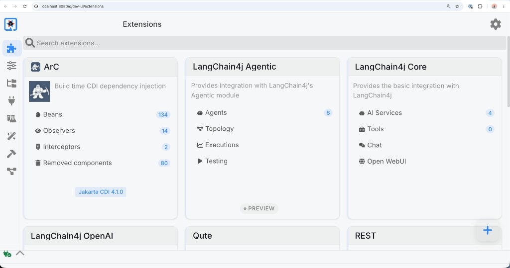
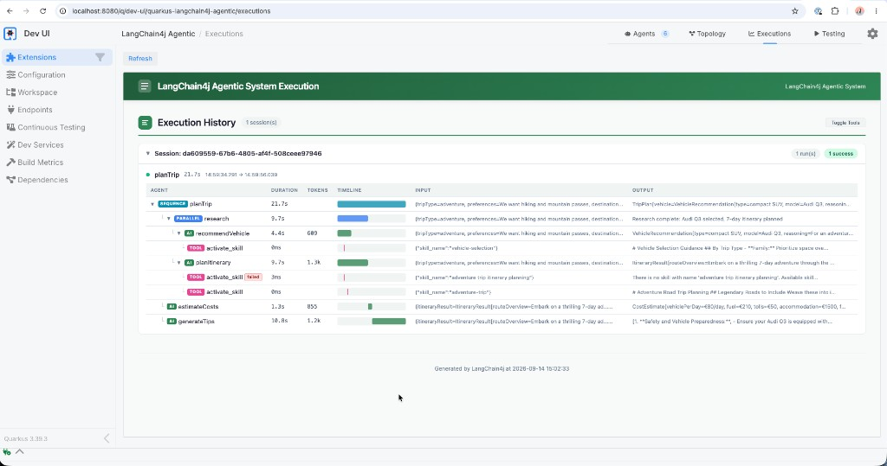

# Step 01 - Agent Skills and Discovery

## Welcome to Section 3: Enterprise Agentic Patterns

In section 2, we focused on the various ways you can **orchestrate and implement agents** into a full-blow agentic system. 
In this section, we're going to continue our deep dive into agentic AI and explore **additional capabilities** you will 
likely need in order to build an **enterprise-grade** agentic system. 

!!!note
    If you're not familiar with how to implement and orchestrate agents, feel free to visit [section 2](../section-2/step-01.md) first.

## A new scenario

Miles of Smiles, the fictitious car rental company we've been following throughout this workshop, has decided they want 
a Customer Trip Planner app. 
This trip planner should help customers build out a trip based on their destination, trip duration and trip style 
as well as personal preferences for the trip. 
Based on those criteria, the trip planner then returns a recommended itinerary with activities and sights to see, 
and it will also recommend an appropriate rental vehicle as well as a cost estimate.


```mermaid
flowchart LR
    Family[Family vacation\nItalian Riviera] --> Planner[Trip planner]
    Adventure[Adventure trip\nSwiss Alps] --> Planner
    Business[Business travel\nmeetings + leisure] --> Planner
    Planner --> Vehicle[Vehicle]
    Planner --> Route[Route & itinerary]
    Planner --> Costs[Cost estimate]
```

## What are we building?

To keep the focus on the new concepts of this step, the workshop provides starter code with all the UI components already built for the trip planner form. 

<figure markdown="span">
  { width="400", style="border: 1px solid #e5e7eb; border-radius: 4px;" }
</figure>

This starter code also has an existing set of agents to plan a basic trip. When the customer creates a trip, the top level trip planner agent will call 2 agents in parallel to recommend a vehicle, and plan an itinerary. Based on that data, a cost estimator agent will come up with an estimate, and finally the trip plan will be assembled and sent back to the UI.


```mermaid
flowchart TD
    Request[Customer's trip request] --> Vehicle[Recommend a vehicle]
    Request --> Itinerary[Plan the itinerary]
    Vehicle --> Costs[Estimate costs]
    Itinerary --> Costs
    Costs --> Plan[Assemble the trip plan]
```

These existing agents rely on **general instructions baked into their prompts** so there is no separate guidance for family holidays, adventure trips, or business travel yet.

In this step, we're going to add **skills**. Skills are essentially instructions in a Markdown file that agents can request at runtime through a built-in `activate_skill` tool. Whereas fixed prompts go to the model on every request, q skill's full content is only sent if the agent activates it.


```mermaid
flowchart TD
    subgraph fixed [Sent on every request]
        Prompt["@UserMessage prompt in Java"]
    end

    subgraph ondemand [Sent after activation]
        Skills["SKILL.md files\nvehicle-selection, family-trip, ..."]
    end

    Prompt --> Agent[Agent]
    Agent -->|"activate_skill"| Skills
    Skills -->|"injected into conversation"| Agent
    Agent --> Result[Tailored recommendation]
```

Keeping specific skills, like travel expertise, outside the fixed prompts lets Miles of Smiles update its advice without rewriting the agents and only load specific guidance if the model deems it useful to its response.


## Preparing a working copy

!!!question "Build it hands-on or follow along"
    You have the option to build the new features hands-on by working from the starter code, or if you prefer to just follow along, you can go directly to the completed step 01 project. If you're going with the hands-on option and something doesn't end up working, you can also compare your code with the step 01 solution to see what you've missed. (a little birdie told us your code assistant can help with that too 😉). Make sure you have gone through the [workshop requirements](../../requirements/){target=_blank} and you have [the source code](../../requirements/#getting-the-workshop-material){target=_blank} available.

=== "Option 1: Start from the Step 00 starter code"

    ==Copy `section-3/step-00` to a working directory outside the step folders and open that copy in your IDE.== All paths and commands below refer to this working project, including when it's time to run the application.

=== "Option 2: Follow the completed Step 01 code"

    The completed project already contains the changes below.

    ==Open `section-3/step-01` and start dev mode:==

    === "Linux / macOS"
        ```bash
        cd section-3/step-01
        ./mvnw quarkus:dev
        ```

    === "Windows"
        ```cmd
        cd section-3\step-01
        .\mvnw.cmd quarkus:dev
        ```

## Dynamic skill discovery and activation

In the previous sections you've already seen how system and user prompts work through the `@SystemMessage` and `@UserMessage` annotations. They are a good way to give a model context and instructions, but that guidance is sent on every invocation. Skills keep domain guidance in separate Markdown files, so an agent can request just the part that matters for the current trip.

### Adding skills to Quarkus LangChain4j

To be able to handle skill discovery and injection in Quarkus LangChain4j, you need to add the `quarkus-langchain4j-skills` extension. ==Run the following maven command to add it:==

```shell
./mvnw quarkus:add-extension -Dextensions="quarkus-langchain4j-skills"
```

==Then add the following line to `src/main/resources/application.properties` to tell the extension where to find skill files:==

```properties
quarkus.langchain4j.skills.directories=classpath:skills
```

This points the extension at the `src/main/resources/skills/` directory on the **classpath**. You can also point it at **filesystem paths** for skills you want to manage outside the project.

!!!note "Create skills from other sources"
    Skills do not have to be file-system based. You can also build them from a database, a remote API, or content generated at runtime, using the upstream [LangChain4j builder API](https://docs.langchain4j.dev/tutorials/skills/#programmatically){target="_blank"}.


### Defining skills

We're going to add four skills split along two purposes. A `vehicle-selection` skill contains guidance on picking the right vehicle category and applies regardless of trip type. Then we'll add 3 additional skills containing itinerary and route planning conventions based on what kind of trip the customer will take: `family-trip`, `adventure-trip`, and `business-trip`.

Skills live in their own subdirectory, in this case under `src/main/resources/skills/`, as a file named `SKILL.md`. A YAML frontmatter block (a block of metadata that sits at the top of a Markdown file) supplies its `name` and `description`, followed by the guidance in Markdown. See the [Skills extension documentation](https://docs.quarkiverse.io/quarkus-langchain4j/dev/skills.html#_configuration){target="_blank"} for all configuration options.

==Create `src/main/resources/skills/vehicle-selection/SKILL.md` with the following content:==

```markdown title="skills/vehicle-selection/SKILL.md"
--8<-- "../../section-3/step-01/src/main/resources/skills/vehicle-selection/SKILL.md"
```

==Create `src/main/resources/skills/family-trip/SKILL.md`:==

```markdown title="skills/family-trip/SKILL.md"
--8<-- "../../section-3/step-01/src/main/resources/skills/family-trip/SKILL.md"
```

==Create `src/main/resources/skills/adventure-trip/SKILL.md`:==

```markdown title="skills/adventure-trip/SKILL.md"
--8<-- "../../section-3/step-01/src/main/resources/skills/adventure-trip/SKILL.md"
```

==Create `src/main/resources/skills/business-trip/SKILL.md`:==

```markdown title="skills/business-trip/SKILL.md"
--8<-- "../../section-3/step-01/src/main/resources/skills/business-trip/SKILL.md"
```

The extension presents the skill names and descriptions to the LLM and exposes an `activate_skill` tool for agents.

### Controlling skill access with `@Skills`

Only the vehicle and itinerary agents need direct access to these skills. You can control which agents have access to **all or some** skills by using the `@Skills` annotation. Note that making a skill available does **not guarantee** that the model will use it, so we'll also add prompt instructions and check the tool calls when testing.

 ==Open `src/main/java/com/tripplanner/agentic/agents/VehicleAdvisorAgent.java` and update the highlighted lines, including the import, prompt, and annotation:==

```java title="VehicleAdvisorAgent.java" hl_lines="6 12-13 24"
--8<-- "../../section-3/step-01/src/main/java/com/tripplanner/agentic/agents/VehicleAdvisorAgent.java"
```

==In the same directory, update the highlighted lines in `ItineraryPlannerAgent.java`:==

```java title="ItineraryPlannerAgent.java" hl_lines="6 12 25"
--8<-- "../../section-3/step-01/src/main/java/com/tripplanner/agentic/agents/ItineraryPlannerAgent.java"
```

As you can see, the vehicle advisor agent has access to vehicle-selection guidance only, which applies across trip types. The itinerary planner on the other hand has access to the three trip-specific skills.

The highlighted prompt changes ask the model to activate a skill before answering. Again, be aware that these instructions *encourage* tool use, but the model can still skip the call and answer from its own knowledge.

!!!note
    A bare `@Skills` annotation, without parameters, gives an agent access to *all* available skills. With the explicit lists used here, adding a new skill also requires updating the relevant annotation.

## Running the working project

We have added a skills extension, @Skills annotation, steered the prompt and added a few skills files. Pretty easy, right?
Now let's see it in action.

==From the root of your working copy, start the application in a terminal where your `OPENAI_API_KEY` is set:==

=== "Linux / macOS"
    ```bash
    ./mvnw quarkus:dev
    ```

=== "Windows"
    ```cmd
    .\mvnw.cmd quarkus:dev
    ```

==Once started, open [http://localhost:8080](http://localhost:8080){target="_blank"} in your browser.== The trip form shown at the top of this page is where you will enter each test request.

## Planning a family beach vacation

==Fill in the form with:==

- Destination: `Italian Riviera`
- Start date: a future date of your choice
- Duration: `7` days
- Travelers: `4`
- Trip type: `Family Vacation`
- Budget: `Moderate (€1,000–€2,500)`
- Preferences: `We love coastal towns and good food`

==Click **Generate Trip Plan**.== The family skill asks for rest days on a week-long trip, along with driving-time estimates and regular breaks.

While the agents work, the UI shows a wait screen.


Read the vehicle recommendation and daily itinerary. Look for family-friendly choices such as luggage space, regular breaks. Do you see a rest day?

## Inspecting skill tool calls in the Dev UI

While it may seem like the skills were used, it's also entirely possible that the model produced the family travel advice from its own knowledge while ignoring the skill instructions. The execution history and logs let us check whether it really did request the skill and received its content before judging the itinerary.

==Open the Quarkus Dev UI at [http://localhost:8080/q/dev-ui](http://localhost:8080/q/dev-ui){target="_blank"} (or press the letter `d` from your terminal).== The extensions page lists a LangChain4j Agentic card alongside the other installed extensions.



==Click **Executions** in the LangChain4j Agentic card.== Because the planner extends `MonitoredAgent`, this view records agent invocations with their durations, token usage, inputs, and outputs.

Inspect the `activate_skill` calls and their results under the vehicle and itinerary agents. Look for `vehicle-selection` and `family-trip`. A successful family activation returns the Markdown headed `# Family Road Trip Planning` which you can see in the output field.



The terminal logs provide another way to check discovery and activation. ==Check the startup logs for the skill count, then scroll through the request and response logs after generating a trip plan.

??? "Not seeing the request or response logs?"
    The starter already enables `log-requests` and `log-responses` in `src/main/resources/application.properties`, but if for some reason they're not set, or set to false, go ahead and add them and make sure they're set to true: 
    ```java
    quarkus.langchain4j.openai.log-requests=true
    quarkus.langchain4j.openai.log-responses=true
    ```

At startup, the skills extension reports how many files it found:

```text
INFO  [io.quarkiverse.langchain4j.skills.runtime.SkillsRecorder] Loaded 4 skill(s) from directory: classpath:skills
```

When an agent with skills enabled makes its first request, the outgoing body includes the `activate_skill` tool definition in the `tools` array, which means the tool is available to the model.

```json
"tools" : [ {
  "type" : "function",
  "function" : {
    "name" : "activate_skill",
    "description" : "Returns the full instructions for a skill. Call this before following any skill-specific steps.",
    "parameters" : {
      "type" : "object",
      "properties" : {
        "skill_name" : {
          "type" : "string",
          "description" : "The name of the skill to activate"
        }
      },
      "required" : [ "skill_name" ]
    }
  }
} ]
```

The evidence that the model *actually* got called the tool is in the **Response** log. Look for a `tool_calls` entry with `activate_skill` and the skill name in the arguments:

```json
"tool_calls" : [ {
  "id" : "call_GvYO3PDO7EnJCU0v7Ix28zXp",
  "type" : "function",
  "function" : {
    "name" : "activate_skill",
    "arguments" : "{\"skill_name\":\"vehicle-selection\"}"
  }
} ]
```

Once a call succeeds, the next request log includes a `tool` message with the full skill content. This excerpt is from the vehicle advisor after `vehicle-selection` was activated:

```json
{
  "role" : "tool",
  "tool_call_id" : "call_GvYO3PDO7EnJCU0v7Ix28zXp",
  "content" : "# Vehicle Selection Guidance\n\n## By Trip Type\n- **Family:** Prioritize space over style. An MPV or 7-seat SUV fits car seats, luggage, and restless passengers...\n- **Adventure:** Ground clearance matters more than engine power. A compact SUV handles most classified mountain roads..."
}
```

See if you can find the corresponding `family-trip` call and its returned content as well. Match `tool_call_id` to the call's `id` to avoid confusing an earlier result in the conversation with the current activation. 

## Updating the travel guidance

Suppose Miles of Smiles wants to recommend more rest days for week-long family trips. You (or they) can change this advice in the skill without editing the Agent prompts.

First, to make our dev mode testing smoother, ==add this dev-mode setting to `application.properties` so edits to the family skill trigger an application reload:==

```properties
%dev.quarkus.live-reload.watched-resources=skills/family-trip/SKILL.md
```

??? "Why add this watched-resources property?"
    The extension keeps skill content in memory, so edits need an application reload to take effect. This setting makes Quarkus reload on the next HTTP request after the file changes. Paths are relative to `src/main/resources/`, and additional files can be listed with commas.

Notice how many rest days were mentioned in the original trip plan (there should be exactly one), then ==open `src/main/resources/skills/family-trip/SKILL.md` and change "exactly one rest day" to "exactly two rest days".== Leave dev mode running. The watched-resource setting reloads the application on the next request, which also clears its in-memory execution history.

==Click **Plan Another Trip** and generate a plan with the same form values.== Then inspect the new `family-trip` tool result for the updated rest-day instruction and compare the itineraries. Does the new plan include two rest days without driving?

## Comparing family and adventure skill selection

The itinerary planner also has guidance for other trip types. Let's see which skill it chooses for an adventure trip.

==Click **Plan Another Trip**, keep the remaining family form values, and change these fields:==

- Destination: `Swiss Alps`
- Trip type: `Adventure Trip`
- Preferences: `We want hiking and mountain passes`

==Click **Generate Trip Plan**,== then inspect the invocation history again and notice it now used the `adventure-trip` activation instead of `family trip`, and the reccomendations for the trip have changed as well.

## Taking it further

If you want more practice with skills, try these additional scenarios and see what happens to the result:

* Add child-seat guidance to `family-trip/SKILL.md`. Ask the itinerary agent to include the advice in the route overview and request any missing age, height, or weight details before suggesting a specific seat. Compare a request to rent a child seat with one whose preferences say "We are bringing our own child seat", checking both the activated skill content and the recommendation.

* Select **Business Travel** and confirm the `business-trip` skill is activated instead. Planning one destination three or four times with different trip types is a quick way to see how much the itinerary changes when only the skill selection differs.

* ==Try a bare `@Skills` annotation on one agent== to give it access to every discovered skill, then compare which skills the model picks when the list is not restricted.

## What's next?

The planner now keeps its travel advice in Markdown files that Miles of Smiles can update without touching the Java code.
What if the trip planner suggests something that's completely unsuitable though, like recommending a Ferrari to a group of 8 on a string budget? In Step 02, we'll add guardrails that catch unsuitable recommendations before a customer ever sees them.

[Continue to Step 02 - Guardrails and Compliance](step-02.md)

## Troubleshooting

??? warning "Error: OPENAI_API_KEY not set"
    ==Set the environment variable in the terminal used to run the application.== For Linux or macOS:

    ```bash
    export OPENAI_API_KEY=sk-your-key-here
    ```

    ==Then restart the application from your working copy.==

??? warning "Response takes too long or times out"
    This workshop uses relatively basic and cheap models so they tend to be slow.
    The Step 01 workflow invokes three agents, with vehicle selection and itinerary planning running in parallel before cost estimation. Skill activation can add model requests within an agent invocation. ==Check `quarkus.langchain4j.openai.timeout` in `application.properties` and try a shorter trip duration.== The starter configures a 120-second timeout.

??? warning "Skills not being activated"
    ==Check the following before generating another plan:==

    - `quarkus.langchain4j.skills.directories=classpath:skills` is set in `application.properties`.
    - Skill files are named `SKILL.md` (case-sensitive) and placed in subdirectories under `src/main/resources/skills/`.
    - Each file has valid YAML frontmatter with both `name` and `description` fields.
    - The skill's name appears in the agent's explicit `@Skills` list.
    - The prompt asks the model to activate a skill, and the model supports tool calling.

??? warning "An activation returns the old skill content"
    ==Check that `%dev.quarkus.live-reload.watched-resources` includes the edited skill file, then refresh the application page.== The completed Step 01 project watches only `skills/family-trip/SKILL.md`. The terminal should show fresh `Loaded 4 skill(s)` and `Live reload total time` messages before the next generation.
