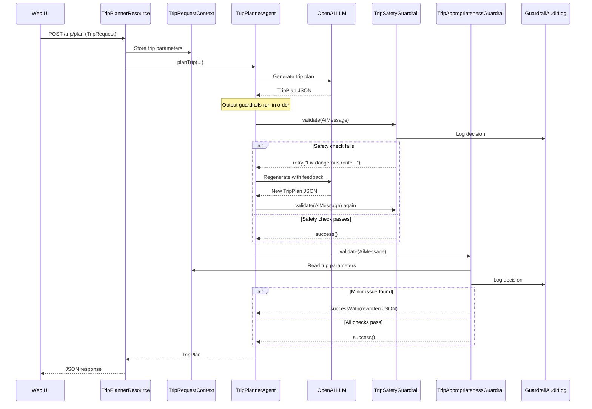
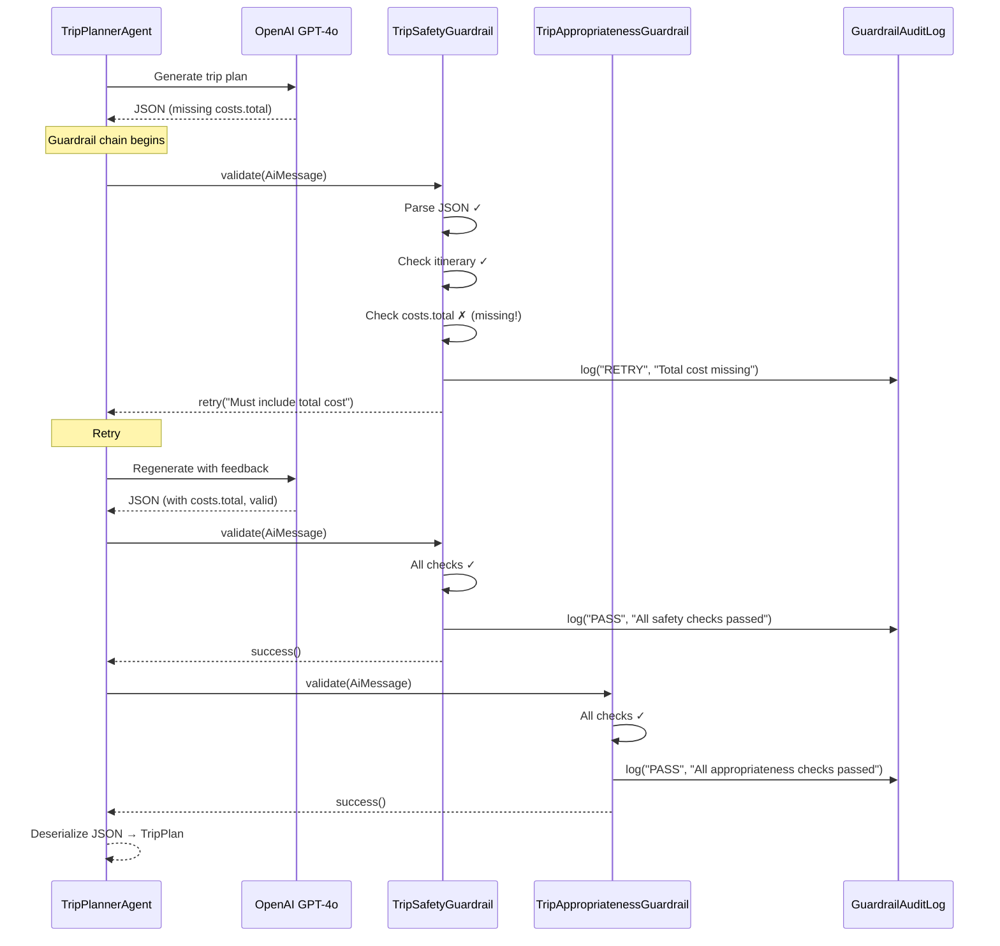

# Step 02 - Guardrails and Compliance

## Ensuring Safe and Honest Recommendations

In Step 01, you built a Trip Planner agent that generates structured trip plans using skills. But what happens when the LLM recommends a 2-seat sports car to a family of 5? Or forgets to disclose toll costs? Or suggests a route through a dangerous area?

In production systems, you can't trust LLM output blindly. **Guardrails** are programmatic checks that validate, reject, or rewrite agent output before it reaches the user. They enforce business rules that the LLM alone might not follow consistently.

In this step, you'll add output guardrails to the Trip Planner that ensure every recommendation is **safe**, **honest**, and **appropriate** — regardless of what the LLM generates.

---

## What You'll Learn

In this step, you will:

- Implement `OutputGuardrail` classes that validate LLM-generated trip plans
- Use `retry()` to ask the LLM to **regenerate** output that fails hard safety checks
- Use `successWith()` to **rewrite** output that has minor appropriateness issues
- Build an **audit trail** that logs every guardrail decision for compliance
- Handle guardrail failures gracefully with a JAX-RS `ExceptionMapper`
- Bridge request context to guardrails using a `@RequestScoped` CDI bean

---

## What Are We Going to Build?

We'll add four new components to the Trip Planner from Step 01:

1. **TripSafetyGuardrail**: Validates hard safety and honesty rules (dangerous routes, missing costs, empty itineraries). Uses `retry()` on failure.
2. **TripAppropriatenessGuardrail**: Validates soft appropriateness rules (vehicle/traveler mismatch, budget coherence, family-appropriate content). Uses `successWith()` to rewrite minor issues.
3. **GuardrailAuditLog**: Logs every guardrail decision (`PASS`, `RETRY`, `REWRITE`) for compliance.
4. **TripRequestContext**: A `@RequestScoped` CDI bean that bridges trip parameters from the REST endpoint to the guardrails.

**The Flow:**



---

## Understanding Output Guardrails

An `OutputGuardrail` is a class that intercepts the LLM's response **before** it's returned to the caller. It can:

| Action | Method | When to Use |
|--------|--------|-------------|
| **Accept** | `success()` | Output passes all checks |
| **Retry** | `retry(feedback)` | Output has serious issues — ask the LLM to regenerate with feedback |
| **Rewrite** | `successWith(AiMessage)` | Output has minor issues — fix them in code and accept |
| **Reject** | `failure(message)` | Output is fatally flawed — stop processing |

Multiple guardrails can be chained with `@OutputGuardrails`. They run in order: if the first guardrail triggers a `retry()`, the LLM regenerates and **all** guardrails run again against the new response. The `maxRetries` parameter caps the number of retry attempts.

!!! note "Input vs. Output Guardrails"
    In [Section 1](../section-1/step-09.md){target="_blank"}, you used an `InputGuardrail` to detect prompt injection **before** the LLM processes the request. Output guardrails work on the other side — they validate the LLM's **response** before it reaches the user. Both are critical for production systems.

---

## Prerequisites

=== "Option 1: Continue from Step 01"

    If you want to continue building on top of Step 01 code, stay in the `section-3/step-01` directory. You'll create the guardrail classes and modify existing files as described below.

=== "Option 2: Follow along using the completed solution"

    If you prefer to follow along (without making any code changes), navigate to the completed `section-3/step-02` directory:

    === "Linux / macOS"
        ```bash
        cd section-3/step-02
        ./mvnw quarkus:dev
        ```

    === "Windows"
        ```cmd
        cd section-3\step-02
        mvnw quarkus:dev
        ```

---

## Component 1: The Audit Log

Before building the guardrails, let's create the audit trail service that both guardrails will use.

In `src/main/java/com/tripplanner/guardrails`, create `GuardrailAuditLog.java`:

```java title="GuardrailAuditLog.java"
--8<-- "../../section-3/step-02/src/main/java/com/tripplanner/guardrails/GuardrailAuditLog.java"
```

**Key Points:**

- `@ApplicationScoped` — a single instance shared across all requests
- Each audit entry records a timestamp, the guardrail name, the decision (`PASS`, `RETRY`, `REWRITE`), and a reason
- Entries are stored in a `ConcurrentLinkedDeque` (capped at 100) for thread safety
- Also logs to the JBoss Logger at INFO level — check your terminal to see guardrail decisions in real time

---

## Component 2: The TripRequestContext

The `TripAppropriatenessGuardrail` needs to know the original trip parameters (how many travelers, what budget, what trip type) to validate the LLM's response. Since the `OutputGuardrail.validate()` method only receives the `AiMessage`, we use a `@RequestScoped` CDI bean to bridge the data.

In `src/main/java/com/tripplanner/model`, create `TripRequestContext.java`:

```java title="TripRequestContext.java"
--8<-- "../../section-3/step-02/src/main/java/com/tripplanner/model/TripRequestContext.java"
```

**Key Points:**

- `@RequestScoped` — a new instance is created for each HTTP request and destroyed when the request completes
- The REST endpoint populates it before calling the agent; the guardrail reads it during validation
- CDI handles the scoping automatically: even though the guardrail is `@ApplicationScoped`, it injects a client proxy that resolves to the correct request-scoped instance at runtime

---

## Component 3: The Safety Guardrail

This guardrail enforces **hard rules** — violations that require the LLM to regenerate its response.

In `src/main/java/com/tripplanner/guardrails`, create `TripSafetyGuardrail.java`:

```java title="TripSafetyGuardrail.java"
--8<-- "../../section-3/step-02/src/main/java/com/tripplanner/guardrails/TripSafetyGuardrail.java"
```

**Let's break it down:**

### Handling Structured Output

The guardrail receives the raw `AiMessage` that the framework will parse into a `TripPlan` record. Depending on the LLM and configuration, the response may arrive as plain JSON text, as JSON wrapped in markdown code blocks (`` ```json...``` ``), or even as `null` text when the framework uses tool calls for structured output.

The guardrail handles all these cases:

- **Null or blank text**: The framework is using tool calls for structured output — the guardrail returns `success()` and lets the framework handle deserialization
- **JSON in markdown**: The `extractJson()` helper strips any surrounding text and extracts the JSON object
- **Malformed JSON**: The guardrail calls `retry()` — giving the LLM another chance to produce valid output

### Safety Checks

The guardrail validates three rules:

1. **Completeness** — the itinerary must not be empty (a trip plan without days is useless)
2. **Cost transparency** — `costs.total` must be present (honesty requires disclosing the total cost)
3. **Route safety** — the route overview and itinerary descriptions are scanned for dangerous-area keywords

Each failed check calls `retry(feedback)`, which sends the feedback to the LLM and asks it to regenerate. The LLM gets up to `maxRetries` attempts (configured on the annotation).

### Audit Logging

Every decision — pass or retry — is logged to the `GuardrailAuditLog`:

```java
auditLog.log("TripSafetyGuardrail", "RETRY", "Total cost estimate is missing");
```

---

## Component 4: The Appropriateness Guardrail

This guardrail enforces **soft rules** — violations that can be fixed by **rewriting** the JSON in code, without asking the LLM to regenerate.

In `src/main/java/com/tripplanner/guardrails`, create `TripAppropriatenessGuardrail.java`:

```java title="TripAppropriatenessGuardrail.java"
--8<-- "../../section-3/step-02/src/main/java/com/tripplanner/guardrails/TripAppropriatenessGuardrail.java"
```

**Let's break it down:**

### Context-Aware Validation

The guardrail injects `TripRequestContext` to access the original trip parameters:

```java
TripRequest request = tripRequestContext.get();
```

This enables checks like "is this vehicle appropriate for the number of travelers?" — something the guardrail can only determine by comparing the LLM's recommendation against the original request.

### Vehicle/Traveler Mismatch — Rewriting

When the LLM recommends a sports car for 4+ travelers, the guardrail doesn't ask the LLM to try again. Instead, it **rewrites the JSON directly**:

```java
vehicle.put("type", replacement);
vehicle.put("reasoning", "Vehicle upgraded by guardrail: ...");
return successWith(AiMessage.from(root.toString()));
```

The `successWith(AiMessage)` method replaces the LLM's response with the corrected version. The framework then deserializes the modified JSON into the `TripPlan` record as usual.

### Budget Coherence — Retry

When the mismatch is too significant to fix in code (luxury brand on economy budget), the guardrail calls `retry()`:

```java
return retry("The vehicle recommendation is a luxury vehicle but the budget is economy. "
        + "Please recommend an affordable, budget-friendly vehicle instead.");
```

### Family Content Filtering — Rewriting

For family trips, the guardrail removes tips mentioning nightclubs, casinos, or other family-inappropriate content, and replaces itinerary descriptions containing such keywords with a generic family-friendly alternative:

```java
((ObjectNode) day).put("description",
        "Explore the local area with family-friendly activities and sightseeing.");
```

---

## Component 5: Updated TripPlannerAgent

Now wire the guardrails to the agent. Update `TripPlannerAgent.java`:

```java hl_lines="1-2 12" title="TripPlannerAgent.java"
--8<-- "../../section-3/step-02/src/main/java/com/tripplanner/agentic/agents/TripPlannerAgent.java"
```

**Key change:**

```java
@OutputGuardrails(value = {TripSafetyGuardrail.class, TripAppropriatenessGuardrail.class}, maxRetries = 3)
```

- **Order matters**: `TripSafetyGuardrail` runs first — it rejects dangerous content before `TripAppropriatenessGuardrail` checks for appropriateness
- **`maxRetries = 3`**: The LLM gets up to 3 chances to fix its output when a guardrail calls `retry()`
- When a retry is triggered, the LLM regenerates and **all guardrails run again** against the new response

---

## Component 6: Updated REST Endpoint

Update `TripPlannerResource.java` to populate the `TripRequestContext` and handle guardrail failures:

```java hl_lines="6-7 25-26 34 44-55" title="TripPlannerResource.java"
--8<-- "../../section-3/step-02/src/main/java/com/tripplanner/resource/TripPlannerResource.java"
```

**Key changes:**

### TripRequestContext Population

```java
tripRequestContext.set(request);
```

The context is populated **before** calling the agent, so it's available when the guardrails run.

### GuardrailExceptionMapper

When the LLM exhausts all retries and the guardrails still fail, an `AgentInvocationException` is thrown (wrapping the underlying `OutputGuardrailException`). The `ExceptionMapper` catches it, unwraps to find the guardrail failure message, and returns a structured HTTP 422 response instead of a raw 500 error:

```java
@Provider
public static class GuardrailExceptionMapper implements ExceptionMapper<AgentInvocationException> {
    // Unwraps the GuardrailException cause and returns HTTP 422 with JSON error body
}
```

---

## Running the Application

Start the application:

=== "Linux / macOS"
    ```bash
    cd section-3/step-02
    ./mvnw quarkus:dev
    ```

=== "Windows"
    ```cmd
    cd section-3\step-02
    mvnw quarkus:dev
    ```

Open your browser to [http://localhost:8080](http://localhost:8080){target="_blank"}.

---

## Try It Out

### Test 1: Normal Trip (Guardrails Pass)

Fill in the form:

- **Destination**: `Italian Riviera`
- **Duration**: `5` days
- **Travelers**: `4`
- **Trip Type**: `Family Vacation`
- **Budget**: `Moderate (€1,000–€2,500)`

Click **Generate Trip Plan**.

**What happens?**

The trip plan generates normally. Check your terminal logs — you should see:

```
🛡️ [TripSafetyGuardrail] PASS — All safety checks passed
🛡️ [TripAppropriatenessGuardrail] PASS — All appropriateness checks passed
```

Both guardrails ran and approved the LLM's output.

### Test 2: Vehicle Rewrite

Try a trip with many travelers and an adventure type (which sometimes triggers a small vehicle recommendation):

- **Travelers**: `6`
- **Trip Type**: `Adventure Trip`
- **Destination**: `Swiss Alps`

If the LLM recommends a compact or sporty vehicle, you'll see:

```
🛡️ [TripAppropriatenessGuardrail] REWRITE — Vehicle type 'sports car' is too small for 6 travelers
```

The vehicle recommendation in the response will show the guardrail-corrected type (SUV) with a note about the upgrade.

### Test 3: Observe Audit Trail

After running a few requests, check your terminal for the full audit trail. Each guardrail decision is logged with a timestamp, the guardrail name, the decision, and the reason.

---

## How It All Works Together

Let's trace through a scenario where the LLM generates a plan with a missing total cost:



---

## Key Takeaways

- **Output guardrails validate LLM responses** before they reach the user — critical for production systems
- **`retry()` asks the LLM to regenerate** with feedback, useful for hard safety violations
- **`successWith()` rewrites the response in code**, useful for minor fixups without wasting an LLM call
- **Guardrails are composable**: chain multiple guardrails with `@OutputGuardrails` — order matters
- **Audit trails** log every guardrail decision, enabling compliance and debugging
- **`@RequestScoped` CDI beans** bridge request context to guardrails for context-aware validation

---

## Experiment Further

### 1. Add a New Guardrail Rule

Add a check to `TripSafetyGuardrail` that validates the itinerary has the correct number of days (matching the requested duration). You'll need to access the trip parameters — consider using `TripRequestContext` like `TripAppropriatenessGuardrail` does.

### 2. Try the `reprompt()` Method

Instead of `retry(feedback)`, try `reprompt(feedback, newSystemPrompt)` — this lets you change the system prompt for the retry attempt. For example, you could add stricter instructions when the first attempt failed.

### 3. Test Guardrail Exhaustion

Set `maxRetries = 0` on the `@OutputGuardrails` annotation and trigger a retry scenario. Observe how the `GuardrailExceptionMapper` returns an HTTP 422 error.

### 4. Write a Custom Unit Test

Add a test case to `TripSafetyGuardrailTest` with a JSON payload that contains a dangerous keyword in the itinerary title (not just the description). Does the guardrail catch it? If not, extend the `findDangerousContent` method.

---

## Troubleshooting

??? warning "Error: OPENAI_API_KEY not set"
    Make sure you've exported the environment variable:

    ```bash
    export OPENAI_API_KEY=sk-your-key-here
    ```

    Then restart the application.

??? warning "Guardrail never triggers"
    The LLM usually generates reasonable output. To test guardrails reliably, use the unit tests (`TripSafetyGuardrailTest`, `TripAppropriatenessGuardrailTest`) which construct specific JSON payloads that trigger each rule.

??? warning "GuardrailException thrown unexpectedly"
    This means all retries were exhausted and the guardrails still failed. Check:

    - The `maxRetries` value on `@OutputGuardrails` (default is 2, we set it to 3)
    - The terminal logs for audit trail entries showing what failed
    - Whether your retry feedback is clear enough for the LLM to fix the issue

---

## Cleanup

Before moving to the next step, let's clean up:

1. **Stop the running server** by pressing `Ctrl+C` in the terminal where Quarkus is running

2. **Return to the root project directory**:

    ```bash
    cd ..
    ```

---

## What's Next?

In this step, you added **output guardrails** that validate, rewrite, and audit LLM-generated trip plans. You saw how `retry()` asks the LLM to regenerate, how `successWith()` rewrites output in code, and how an audit trail logs every decision for compliance.

In **Step 03**, you'll learn how to add **persistent state** to agents — enabling the Trip Planner to remember past trips, learn from user preferences, and build context across interactions!

[Continue to Step 03 - Persistent State](step-03.md)
