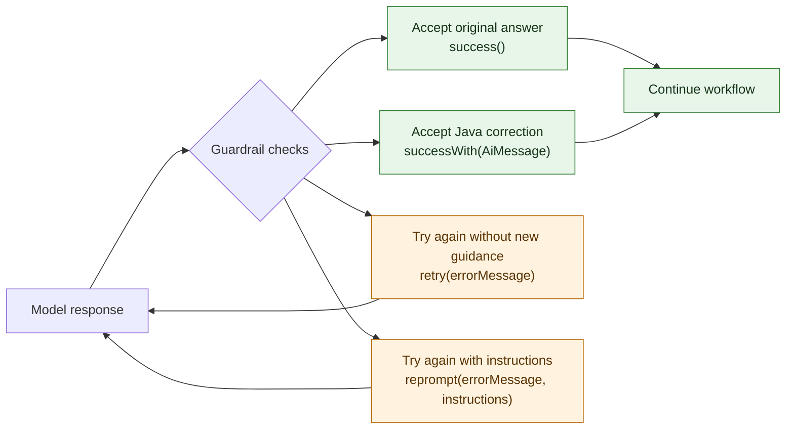
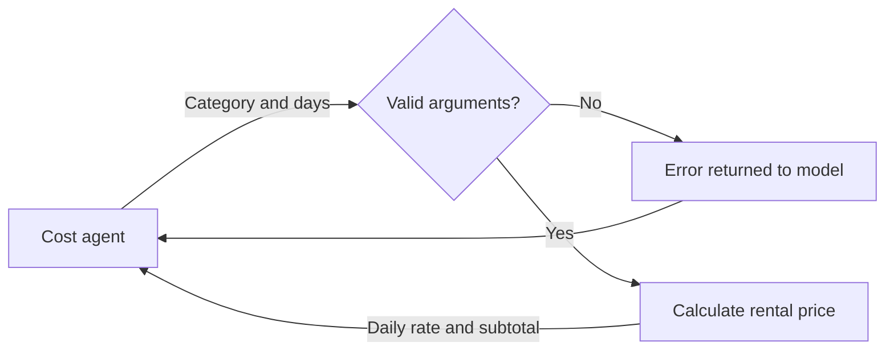

# Step 02 - Agent Guardrails and Compliance

A family of five asks Miles of Smiles for a road trip, but the vehicle agent recommends a two-seat sports car. Even with the skills we added in Step 01, the model-backed agents can still overlook our instructions when generating a response. That's the joy of working with probablistic AI models. The application therefore needs safety and compliance checks of its own before passing recommendations to the rest of the planning pipeline.

We'll attach output guardrails to the vehicle and itinerary agents so they can request another response or rewrite a recommendation. We'll also give the cost estimator a tool that calculates rental prices from a small rate list, with a tool input guardrail to reject invalid arguments before the calculation runs. Fixed-response tests will let us inspect a corrected vehicle and distinguish exhausted recommendation checks from an unrelated planning failure, without having to provoke a live-model mistake.

## Per-agent output guardrails

The [input guardrails from Section 1](../section-1/step-09.md) checked the customer's message before it reached the model. Here on the other hand, we need to check the recommendations the agents produce before the cost estimator uses them. **Output guardrails** run after an agent has finished its model and tool interactions, allowing the application to inspect the response before accepting it.

We'll add these checks to the parallel research phase from Step 01. An **itinerary guardrail** will look for an absent or empty itinerary and a short list of dangerous-area phrases, while a **vehicle guardrail** will compare the recommendation with the customer's request.

A guardrail can accept the answer, fix it, or ask the model to try again. The four responses below determine which path the workflow takes.



For the family of five, `successWith(AiMessage)` lets the application replace the unsuitable vehicle category, description, and reasoning directly. The workflow continues with that corrected answer without another model call. If the original answer already passes, `success()` keeps it as it is.

When the model needs another attempt, `retry(errorMessage)` requests a new response without adding guidance. With `reprompt(errorMessage, instructions)`, the first argument describes the problem for the application log, and the second tells the model what to change. Our vehicle guardrail uses this to request an affordable option when a recommendation breaks the economy-budget rule.

Both paths back to the model run the new response through the checks again. We'll also set an **attempt limit** when registering the guardrails so that repeated failures stop planning instead of looping indefinitely.

## Tool input guardrails

Once the vehicle and itinerary recommendations have passed their checks, the cost agent uses them to estimate the trip's expenses. We'll give this agent a rental calculator so it can calculate the vehicle cost using Miles of Smiles' daily rates. Calling a tool introduces another place where the model can make a mistake, even when the recommendations it received have already been checked.

Checking tool arguments is particularly important when a tool can modify the file system or write to a database. Before a destructive action such as deleting files or removing database records, a tool input guardrail can check whether the requested paths or records are within the permitted scope. An output guardrail would only inspect the agent's response after the action had already happened.

Our rental calculator has no such serious side effects, but the model could still request an unknown vehicle category or a rental of zero days. These values need checking before the calculator runs.

A tool input guardrail sits between the agent's tool request and the calculation. Valid arguments let the tool execute. Invalid arguments **block** that call and **return an error** to the model as a tool result, giving it a chance to correct its request.



This check happens within the agent's tool-calling conversation. Rejecting a tool call does not consume the output guardrail's attempt allowance. We'll add the calculator and its input guardrail after implementing the vehicle and itinerary output checks.

## Preparing the working copy

Keep the model configuration from Step 01 and make sure `OPENAI_API_KEY` is set in the terminal used to run the application. The fixed-response tests later in this chapter do not call the model, but generating a trip through the browser still needs it.

=== "Option 1: Continue from Step 01"

    Continue in your Step 01 working copy and apply the changes below. Use the completed Step 02 project for comparison if you get stuck.

    The starter already displays the error messages returned by the application. Once we add the guardrails and exception mapper below, it will also show why a trip could not pass the recommendation checks.

=== "Option 2: Use Step 02 solution and review the changes"

    The completed project already contains the changes below. You can read through the implementation without editing, then join the exercise at [Inspecting guardrail execution](#inspecting-guardrail-execution).

    ==Open `section-3/step-02` and start dev mode:==

    === "Linux / macOS"
        ```bash
        cd section-3/step-02
        ./mvnw quarkus:dev
        ```

    === "Windows"
        ```cmd
        cd section-3\step-02
        .\mvnw.cmd quarkus:dev
        ```

## Logging guardrail decisions

The guardrails need a shared place to record their decisions so we can inspect them while testing.

==Create `src/main/java/com/tripplanner/guardrails/GuardrailAuditLog.java`:==

```java title="GuardrailAuditLog.java"
--8<-- "../../section-3/step-02/src/main/java/com/tripplanner/guardrails/GuardrailAuditLog.java"
```

Calling `log()` writes the guardrail's name, decision, and reason to the terminal. It also keeps the latest 100 entries in memory for tests to inspect through `getRecentEntries()`, until the application restarts.

For example, a guardrail could record a decision like this (shortened for readability):

```text
[TripAppropriatenessGuardrail] REWRITE: Vehicle too small for 4 travelers
```

## Validating structured output with `retry()`

The itinerary guardrail asks the model to try again when its response has invalid JSON, an empty itinerary, or a phrase from our dangerous-area list.

==Create `src/main/java/com/tripplanner/guardrails/TripSafetyGuardrail.java`:==

```java title="TripSafetyGuardrail.java"
--8<-- "../../section-3/step-02/src/main/java/com/tripplanner/guardrails/TripSafetyGuardrail.java"
```

### What to notice

- `extractJson()` finds the JSON inside a response, including one wrapped in Markdown fences.
- `validate()` checks for an itinerary, then scans the route overview and daily descriptions for the configured phrases.
- `retry()` requests another response. Its error message records the problem but is not sent to the model as corrective guidance.

For example, an empty `itinerary` array triggers another attempt before the response becomes an `ItineraryResult`.

??? info "What does an itinerary PASS mean?"
    `PASS` means the itinerary is nonempty and none of the configured phrases matched. It does not establish that the route is safe or has the requested number of days. Titles are not scanned, and a warning such as "avoid the conflict area" still matches the phrase list.

    Blank text is logged as `SKIP` and allowed through without validation. Tool-call content is not inspected.

The following sequence illustrates a retry whose second response passes the implemented checks. The messages are descriptions of the interaction, not captured logs.


## Rewriting and reprompting with `successWith()` and `reprompt()`

The vehicle guardrail checks whether a recommendation fits the customer's group size and budget.

It checks the economy-budget rule first, then corrects small-vehicle recommendations for groups of four or more.

==Create `src/main/java/com/tripplanner/guardrails/TripAppropriatenessGuardrail.java`:==

```java title="TripAppropriatenessGuardrail.java"
--8<-- "../../section-3/step-02/src/main/java/com/tripplanner/guardrails/TripAppropriatenessGuardrail.java"
```

### What to notice

- `requestParams().variables()` supplies the trip details for this agent call, so each recommendation is checked against the right group size and budget, including on retries.
- `reprompt()` asks the model for an affordable vehicle when a listed luxury brand conflicts with an economy budget.
- `rewriteVehicle()` replaces the type, model description, and reasoning. It chooses an SUV for adventure trips, an Estate for business trips, and an MPV otherwise.
- `successWith()` accepts that corrected JSON without another model call, before it becomes a `TripPlan.VehicleRecommendation`.

For a family, the replacement model is `Family MPV; specific model subject to availability.` The accompanying reason asks the customer to confirm capacity, price, and availability.

Order matters: a Ferrari sports car for four travelers on an economy budget triggers `REPROMPT` first. This prevents a generic rewrite from hiding the budget violation. The next answer may still need a group-size correction.

??? info "Limits of the vehicle check"
    The replacement is a generic category suggestion, not a checked rental offer. No inventory, seating specification, or price lookup supports it. The economy rule only recognizes its listed brands; a different model can still be unaffordable. These keyword checks cannot establish suitability for every group size or vehicle.

## Registering guardrails with `@OutputGuardrails`

The agents need to run these checks whenever the model returns a recommendation.

==Open `src/main/java/com/tripplanner/agentic/agents/ItineraryPlannerAgent.java` and add the highlighted imports and annotation:==

```java hl_lines="3 7 27" title="ItineraryPlannerAgent.java"
--8<-- "../../section-3/step-02/src/main/java/com/tripplanner/agentic/agents/ItineraryPlannerAgent.java"
```

==Make the corresponding additions in `src/main/java/com/tripplanner/agentic/agents/VehicleAdvisorAgent.java`:==

```java hl_lines="3 7 26" title="VehicleAdvisorAgent.java"
--8<-- "../../section-3/step-02/src/main/java/com/tripplanner/agentic/agents/VehicleAdvisorAgent.java"
```

Each `@OutputGuardrails` annotation connects the agent to its guardrail, which checks the response before deserialization. In this step's dependency version, `maxRetries = 3` allows the first response and two more attempts, as verified by the exhaustion tests below. These checks run alongside the existing prompts and skills within the same research workflow.

## Mapping guardrail exceptions to HTTP responses

When an agent runs out of attempts, the customer needs a readable error explaining that planning failed.

==Create `src/main/java/com/tripplanner/resource/GuardrailExceptionMapper.java`:==

```java title="GuardrailExceptionMapper.java"
--8<-- "../../section-3/step-02/src/main/java/com/tripplanner/resource/GuardrailExceptionMapper.java"
```

The mapper searches the exception's causes for a `GuardrailException`, returning HTTP 422 with `guardrail_violation` when it finds one. Other agent failures return HTTP 500 with `planning_failed`. Both responses include a customer-facing `message`, while the full exception stays in the server log.

The starter UI already displays these messages as text. An unrecognized error, malformed response, or network failure shows the generic "Could not generate the trip plan. Please try again later." message.

## Calculating rental prices with a tool

The cost estimator needs a calculator that multiplies a daily rental rate by the requested number of days. We'll use fictional workshop prices in EUR.

==Create `src/main/java/com/tripplanner/agentic/tools/RentalPricingTool.java`:==

```java title="RentalPricingTool.java"
--8<-- "../../section-3/step-02/src/main/java/com/tripplanner/agentic/tools/RentalPricingTool.java"
```

The tool calculates a rental subtotal using the fictional prices in `DAILY_RATES` and returns it alongside the daily rate. Its log message lets us check whether the calculation ran. The `@ToolInputGuardrails` annotation connects it to the argument validator below.

For example, `suv` for five days returns 80 EUR per day and a 400 EUR rental subtotal. Other trip expenses are separate, and no external pricing service is called.

### Rejecting invalid tool arguments

The model supplies the tool's arguments, so we need to check the category and duration before calculating a price.

==Create `src/main/java/com/tripplanner/guardrails/RentalEstimateInputGuardrail.java`:==

```java title="RentalEstimateInputGuardrail.java"
--8<-- "../../section-3/step-02/src/main/java/com/tripplanner/guardrails/RentalEstimateInputGuardrail.java"
```

#### What to notice

- `validate()` checks the raw JSON before Quarkus converts it to Java arguments. Categories must be exactly `compact`, `estate`, `suv`, or `mpv`, and days must be an integer from 1 to 30.
- `failure()` blocks the calculation and returns the reason to the model as a tool error, giving it a chance to correct its request.

For example, `days: 1.5` and `days: "5"` are both rejected. Neither is silently converted to a whole number.

Rejecting a tool call does not consume the output guardrail's attempt allowance or automatically fail the HTTP request. The model can request another tool call within the same conversation. See the [tool guardrails reference](https://docs.quarkiverse.io/quarkus-langchain4j/dev/function-calling.html#_tool_guardrails){target="_blank"} for more detail.

### Giving the cost estimator access

The cost agent needs access to the calculator and instructions to use its prices in the estimate.

==Open `src/main/java/com/tripplanner/agentic/agents/CostEstimatorAgent.java` and add the highlighted imports, prompt changes, annotation, and `days` parameter:==

```java title="CostEstimatorAgent.java" hl_lines="3 8 18 22-28 31 36"
--8<-- "../../section-3/step-02/src/main/java/com/tripplanner/agentic/agents/CostEstimatorAgent.java"
```

`@ToolBox` makes the calculator available to the agent, and the new `days` parameter supplies the duration from the workflow's shared scope. The prompt asks the model to use the returned daily rate and include the rental subtotal once, while estimating the other trip expenses separately.

## Inspecting guardrail execution

If the application is not already running, start it from the project directory you chose above:

=== "Linux / macOS"
    ```bash
    ./mvnw quarkus:dev
    ```

=== "Windows"
    ```cmd
    .\mvnw.cmd quarkus:dev
    ```

==Open [http://localhost:8080](http://localhost:8080){target="_blank"} and fill in the form:==

- Destination: `Italian Riviera`
- Start date: a future date
- Duration: `5` days
- Travelers: `4`
- Trip Type: `Family Vacation`
- Budget: `Moderate (€1,000–€2,500)`

==Click **Generate Trip Plan**, wait for it to finish, and check the terminal for guardrail decisions.== You should see the INFO messages written by `GuardrailAuditLog` when both responses reach the final success branch.

```text
🛡️ [TripSafetyGuardrail] PASS — Nonempty itinerary; no configured phrases in route overview or day descriptions
🛡️ [TripAppropriatenessGuardrail] PASS — No configured small-vehicle or economy-brand rule matched
```

!!!note
    If you find the guardrail lines hard to spot, temporarily set both `quarkus.langchain4j.openai.log-requests` and `quarkus.langchain4j.openai.log-responses` to `false` and try again.

A `PASS` means the recommendation already met the rules. A `REPROMPT` means the guardrail sent the model corrective instructions and waited for another answer. A `REWRITE` means the guardrail replaced the response directly without another model call. If a `REPROMPT` appears, look for the subsequent guardrail decision to see whether the next answer passed.

The `RentalEstimateInputGuardrail` decisions are also recorded in the INFO messages above. A valid call should have a corresponding `Rental calculation executed` message, while a rejected call returns an error without entering that method. A later corrected call can produce its own calculation message, so follow the arguments for each attempt.

==Open the [Quarkus Dev UI](http://localhost:8080/q/dev-ui){target="_blank"}==, select **Executions** on the LangChain4j Agentic card, and expand the `estimateCosts` in the latest run. Look for an `estimateRental` call and inspect its category, duration, and result. For example, an accepted `suv` call for five days returns a daily rate of 80 EUR and a rental subtotal of 400 EUR. Compare the returned rate with the vehicle-per-day amount displayed in the browser, without treating the full trip total as the rental subtotal.


## Observing a guardrail reprompt in the browser

The vehicle-selection skill guides the model toward sensible choices for most trips, but the guardrail's budget rule operates independently of the skill. Let's try to trigger it by requesting a luxury vehicle on an economy budget.

==Open [http://localhost:8080](http://localhost:8080){target="_blank"} and fill in the form:==

- Destination: `Italian Riviera`
- Start date: a future date
- Duration: `7` days
- Travelers: `2`
- Trip Type: `Romantic Getaway`
- Budget: `Economy (€500–€1,000)`
- Additional Preferences: `We want a Ferrari`

==Click **Generate Trip Plan**, wait for it to finish, and look for the guardrail decisions in the terminal.==

When the model recommends a Ferrari on an economy budget, the vehicle guardrail should catch the issue and interrupt with a `REPROMPT`, which will send an amended prompt back to the model. Then once the model corrects its answer you should see a `PASS`. Once both agents complete, the cost estimator calls `estimateRental` and the tool input guardrail validates its arguments. A successful run produces all four lines below, though not necessarily in this order because the vehicle and itinerary agents run in parallel:

```text
🛡️ [TripAppropriatenessGuardrail] REPROMPT — Luxury vehicle 'ferrari ...' does not match economy budget
🛡️ [TripAppropriatenessGuardrail] PASS — No configured small-vehicle or economy-brand rule matched
🛡️ [TripSafetyGuardrail] PASS — Nonempty itinerary; no configured phrases in route overview or day descriptions
🛡️ [RentalEstimateInputGuardrail] PASS — Rental arguments accepted
```

The `RentalEstimateInputGuardrail PASS` confirms the cost estimator passed valid arguments and the calculation ran. ==Open the [Quarkus Dev UI](http://localhost:8080/q/dev-ui){target="_blank"}, select **Executions** on the LangChain4j Agentic card, and expand the cost estimator entry in the latest run. Find the `estimateRental` tool call and inspect the category, duration, and returned `dailyRate`.== The daily rate shown there is what the model used for `vehiclePerDay` in the browser.

!!!note 
    If the vehicle guardrail audit log shows `PASS` on the first attempt, the model read the economy budget and self-corrected before the guardrail needed to act. Try the request again or try to fiddle with the instructions.

When a guardrail exhausts all its retry or reprompt attempts without a passing response, the `GuardrailExceptionMapper` returns HTTP 422 and the browser displays: `The trip plan could not pass the recommendation checks. Please revise your trip details and try again.`

## Observing a tool input guardrail rejection

The Duration field in the form accepts any number (the Miles of Smiles developers were perhaps a bit lazy 😉), so we can trigger the input guardrail simply by entering a value outside the tool's accepted range.

==Open [http://localhost:8080](http://localhost:8080){target="_blank"}, fill in the form with any destination, and set Duration to `45` days. Click **Generate Trip Plan** and look for the `RentalEstimateInputGuardrail` lines in the terminal:==

```text
🛡️ [RentalEstimateInputGuardrail] REJECT — Set days to a whole number from 1 to 30.
🛡️ [RentalEstimateInputGuardrail] PASS — Rental arguments accepted
```

There is no `Rental calculation executed` line after the rejected call since the guardrail blocked it before reaching the calculation. The model receives the rejection reason as a tool result and then decides what to do. For example, it could retry with arguments within the accepted range, and split the 45-day rental into two separate calls (30 days and 15 days) and combine the results itself. Each valid call then produces its own `PASS` and `Rental calculation executed` line.

The browser would still show a 45-day trip plan because the itinerary agent received the full duration from the form since the tool input guardrail protects the calculation, not the request. 

==Open the Dev UI Executions panel for the cost estimator, expand the latest run, and compare the rejected tool call with the corrected ones that follow it.==

??? info "Verifying with tests"
    Because a live model will not reliably reproduce a specific bad recommendation on demand, the supplied tests use fixed responses to exercise each guardrail branch deterministically.

    If you are continuing from Step 01, copy all test classes from `section-3/step-02/src/test/java/com/tripplanner/guardrails`, plus `src/test/java/com/tripplanner/TripPlanningFailureTest.java` and `src/test/java/com/tripplanner/resource/GuardrailExceptionMapperTest.java`, into the matching packages in your working copy. Copy `section-3/step-02/src/test/frontend/app.test.cjs` to `src/test/frontend/app.test.cjs` there as well. Keep the existing API-key fallback in `src/test/resources/application.properties`:

    ```properties
    quarkus.langchain4j.openai.api-key=${OPENAI_API_KEY:test}
    ```

    **Guardrail unit tests** — `*GuardrailTest` covers the output guardrails (rewrite, reprompt, retry decisions) and the rental pricing input guardrail (invalid arguments blocked, valid arguments reaching the calculation). An invalid duration is rejected with `Input guardrail failed for tool estimateRental: Set days to a whole number from 1 to 30.` A valid five-day SUV call logs `Rental calculation executed: category=suv, days=5, total=400 EUR`.

    === "Linux / macOS"
        ```bash
        ./mvnw test "-Dtest=*GuardrailTest"
        ```

    === "Windows"
        ```cmd
        .\mvnw.cmd test "-Dtest=*GuardrailTest"
        ```

    **HTTP contract tests** — `TripPlanningFailureTest` and `VehicleGuardrailConcurrencyTest` call the real `POST /trip/plan` endpoint with scripted model responses. They check that corrected vehicle fields reach the client, that exhausted guardrail attempts return HTTP 422, and that an unrelated agent failure returns HTTP 500. The exhausted-check cases assert this response body:

    ```json
    {
      "error": "guardrail_violation",
      "message": "The trip plan could not pass the recommendation checks. Please revise your trip details and try again."
    }
    ```

    === "Linux / macOS"
        ```bash
        ./mvnw test "-Dtest=*GuardrailTest,VehicleGuardrailConcurrencyTest,GuardrailExceptionMapperTest,TripPlanningFailureTest"
        ```

    === "Windows"
        ```cmd
        .\mvnw.cmd test "-Dtest=*GuardrailTest,VehicleGuardrailConcurrencyTest,GuardrailExceptionMapperTest,TripPlanningFailureTest"
        ```

    **Browser test** — The Playwright test displays a family vehicle correction and error responses at desktop and mobile widths using intercepted responses, without model calls. Node.js and npm are needed; they are not application dependencies.

    ```bash
    npm install --no-save --package-lock=false playwright
    npx playwright install chromium
    ```

    === "Linux / macOS"
        ```bash
        APP_URL=http://localhost:8080 node --test src/test/frontend/app.test.cjs
        ```

    === "Windows (PowerShell)"
        ```powershell
        $env:APP_URL="http://localhost:8080"
        node --test src/test/frontend/app.test.cjs
        ```

    Use your application's port in `APP_URL` if it differs from 8080. To watch the controlled vehicle card and failure messages in a real browser, rerun with `SHOW_BROWSER=true` added to the environment (`$env:SHOW_BROWSER="true"` in PowerShell). The test pauses briefly after each displayed result.

## Taking it further

Child-seat rentals give us another use for tool guardrails. As an optional exercise, add a small fictional extras-pricing tool with seat identifiers and quantities. Its input guardrail could reject an unknown seat or a negative quantity before calculation. Fixed-response tests should check that rejected calls never execute and that accepted calls return the expected separate extras subtotal.

For output-guardrail practice, compare a recommended seat's catalog limits with supplied child measurements and vehicle compatibility data. A fixed response recommending an unsuitable seat should be rejected even if its price is valid. Missing suitability data should prompt a request for details instead of accepting a guess.

To explore tool output guardrails instead, add a fictional internal sales note to a pricing result, such as the agency's commission on a child-seat rental, and filter it with `@ToolOutputGuardrails` before it reaches the model. Extend the scripted test to check that the calculation ran but the internal note is absent from the tool result seen by the model. Unlike the input guardrail, this check runs after the tool has executed.

You can also add a test with a flagged phrase only in an itinerary title, then extend `findDangerousContent()` to check titles. Another useful case is a warning such as "avoid the conflict area": the current phrase matching rejects it even though it advises the customer to stay away.

These experiments are optional. Since Step 03 continues from the original guardrail rules and retry allowance, keep any experimental rule changes in a separate working copy if you want to follow that baseline.

## Troubleshooting

??? warning "The rental estimate tool is missing or rejected"
    ==Check that the cost agent has `@ToolBox(RentalPricingTool.class)` and that its prompt asks for `estimateRental`. Inspect the tool-call arguments and error result.== Categories must be exactly `compact`, `estate`, `suv`, or `mpv`, and `days` must be a JSON integer from 1 to 30. The tool checks the arguments the model supplies, not whether they match the original trip request, so compare those values when inspecting the execution.

??? warning "The guardrail never triggers"
    The model may already produce output that passes these rules. ==Run the fixed-payload tests above to check specific branches, and inspect the terminal logs for `SKIP` decisions.== A skipped check permits processing to continue without validating that recommendation.

??? warning "An unsuitable response was accepted"
    ==Compare the original response with the fields and keywords checked by the guardrail.== The itinerary scan ignores titles and cannot recognize hazards expressed in other words. It also permits null or blank text without inspecting tool-call content, but now records `SKIP` instead of claiming a pass.

    The vehicle check permits blank text, JSON parsing failures, missing vehicle fields, and missing or incomplete trip variables without checking suitability. Each path logs `SKIP`. A later deserialization failure is still possible. The keyword lists do not cover every small or expensive vehicle, and a generic correction does not establish actual capacity or affordability. These paths need attention before using the sample to enforce rental policy.

??? warning "Planning fails after retries"
    ==Check the audit message for the rejection reason, then inspect the HTTP response in the browser's network panel and the server exception log.== HTTP 422 with `guardrail_violation` identifies an actual guardrail failure in the cause chain. HTTP 500 with `planning_failed` identifies an unrelated wrapped agent failure. Client messages intentionally omit the internal exception details, which can include model content or provider information; take care when sharing logs.

??? warning "OPENAI_API_KEY is not set"
    ==Set `OPENAI_API_KEY` in the shell used to start the application, then restart it.== Keep the same model configuration used in Step 01.

## What's next?

The planner now checks its research recommendations and can calculate rental prices through a tool that rejects invalid arguments before execution. In Step 03, we'll wrap planning in an event-driven Quarkus Flow workflow with Kafka and CloudEvents so the customer can approve or reject a proposed trip.

!!! note "Keeping the pricing tool when continuing"
    Keep the pricing tool, its guardrail, and the cost agent's tool prompt and annotation in your working copy. If Step 03 converts numeric agent parameters to `Integer`, change both `days` and `travelers` in `CostEstimatorAgent` to `Integer`; do not drop `days`. Carry the corrected vehicle behavior and safe error contract across the workflow boundary too. An exception mapper only handles failures that reach the HTTP request, so a background workflow must record and return its own failure outcome to the client.

[Continue to Step 03 - Event-Driven Workflows with Quarkus Flow](step-03.md)
