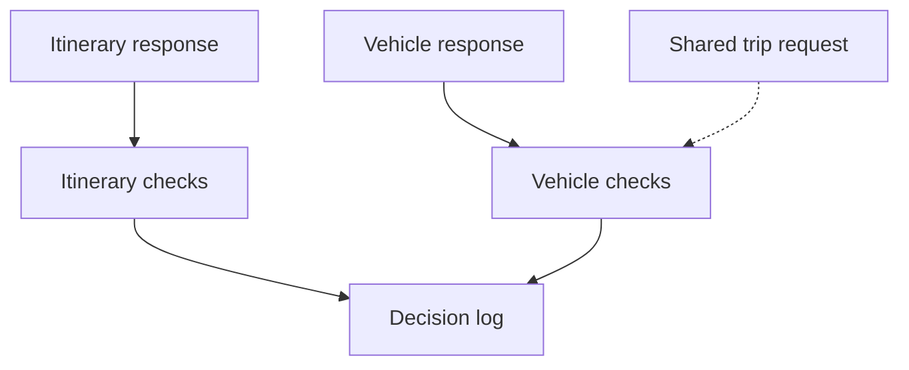
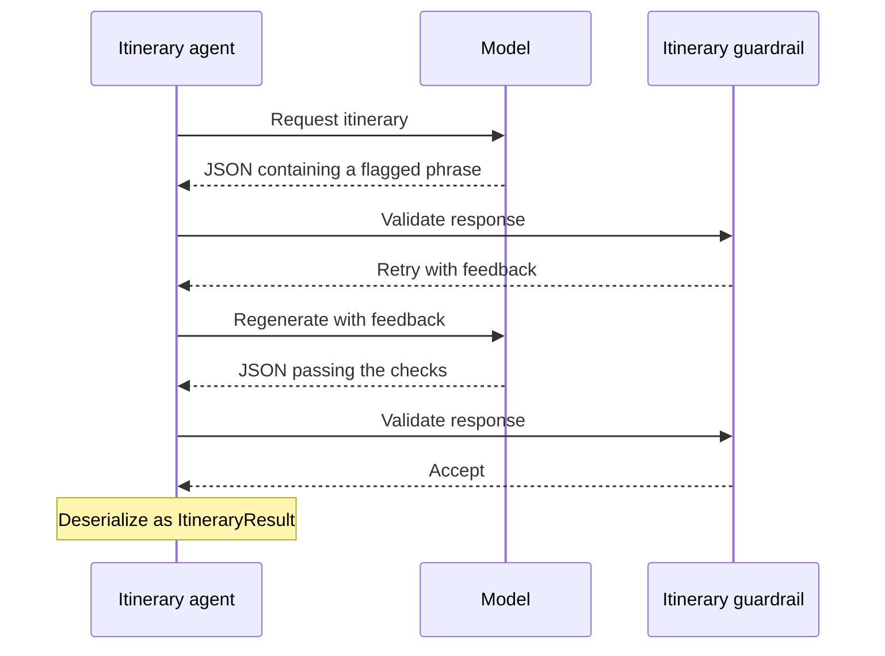

# Step 02 - Guardrails and Compliance

A family of five asks Miles of Smiles for a road trip, but the vehicle agent recommends a two-seat sports car. The skills added in Step 01 guide the agents' choices; they cannot ensure that every response follows those instructions. Before passing recommendations to the rest of the planning pipeline, the application needs checks of its own.

We'll attach output guardrails to the vehicle and itinerary agents so they can request another response or rewrite part of a recommendation. By the end, you'll be able to inspect those decisions in the terminal and see how a rejected response differs from one corrected in code.

These are demonstration rules, not a safety or compliance guarantee. Keyword matching cannot establish whether a route is safe, and changing a vehicle's type does not verify its seating capacity. The exercise makes those checks observable so their limits can be tested.

## Per-agent output guardrails

An output guardrail checks the model's response before the caller receives it. Here, the itinerary check looks for missing days and a short list of dangerous-area phrases, while the vehicle check compares the recommendation with the customer's request. Both run within the parallel research phase from Step 01; costs and tips have no guardrails in this exercise.



When the response passes, `success()` lets it continue. A failed check can ask the model to try again with `retry(feedback)`, or use `reprompt(feedback, newSystemPrompt)` to supply a replacement system prompt as well. Both consume the retry allowance configured on the agent. For a correction that can be made in Java, `successWith(AiMessage)` accepts rewritten output without another model call.

The [input guardrails from Section 1](../section-1/step-09.md) check what goes into the model. Output guardrails check what comes back, but only for the rules they implement.

## Preparing the working copy

==Continue in your working copy of Step 01, or open `section-3/step-02` to follow along with the completed solution.== The existing dependencies and configuration already support this exercise, so no changes to `pom.xml` or `application.properties` are needed.

## Logging guardrail decisions

Both guardrails need a place to record why they accepted, retried, or rewrote a response. ==Create `src/main/java/com/tripplanner/guardrails/GuardrailAuditLog.java`:==

```java title="GuardrailAuditLog.java"
--8<-- "../../section-3/step-02/src/main/java/com/tripplanner/guardrails/GuardrailAuditLog.java"
```

The logger writes decisions at INFO level and keeps a recent in-memory history, trimming it to 100 entries. This lets us follow the checks in the terminal during the exercise. The history disappears on restart, so a production audit trail would need durable storage and a way to associate decisions with each request.

## Sharing request context with CDI

The vehicle check needs the original traveler count and budget. Its `validate(AiMessage)` implementation reads these from an `@ApplicationScoped` bean populated by the REST endpoint before planning begins.

==Create `src/main/java/com/tripplanner/model/TripRequestContext.java`:==

```java title="TripRequestContext.java"
--8<-- "../../section-3/step-02/src/main/java/com/tripplanner/model/TripRequestContext.java"
```

!!! warning "One request at a time"
    ==Wait for each planning request to finish before submitting another, including from another browser tab or client.== This bean holds one shared request for the whole application. `volatile` makes updates visible to the parallel agent threads; it does not provide multi-user isolation. A concurrent request can overwrite the trip details while a guardrail is reading them.

??? info "Why use application scope here?"
    This workshop bean makes the request available across the parallel research tasks without relying on a request-scoped CDI context being active on those threads. It is `@ApplicationScoped`, not `@RequestScoped`, and retains the last request until overwritten or the application stops. A multi-user implementation needs context tied to each agent invocation before this pattern can be used beyond the exercise.

## Validating structured output with `retry()`

The itinerary guardrail parses the response as JSON and requests another attempt when the itinerary is missing, empty, or contains a configured phrase in the route overview or a day's description.

==Create `src/main/java/com/tripplanner/guardrails/TripSafetyGuardrail.java`:==

```java title="TripSafetyGuardrail.java"
--8<-- "../../section-3/step-02/src/main/java/com/tripplanner/guardrails/TripSafetyGuardrail.java"
```

The agent returns an `ItineraryResult`, which the guardrail checks before it becomes part of the final plan. The helper extracts a JSON object from surrounding text such as Markdown fences, and invalid JSON triggers a retry with feedback for the model.

??? info "What does an itinerary PASS mean?"
    The phrase check scans only the route overview and each day's description. It misses titles and hazards expressed in other words, and can reject a warning such as "avoid the conflict area." Null or blank text also returns success without checking an itinerary; the code assumes tool-call structured output in that case but does not inspect tool calls.

    A `PASS` therefore does not establish that a route is safe. The invalid-JSON feedback also refers to "TripPlan format," although this agent produces an `ItineraryResult`.

The following sequence illustrates a retry whose second response passes the implemented checks. The messages are descriptions of the interaction, not captured logs.



## Rewriting and reprompting with `successWith()` and `reprompt()`

A vehicle recommendation needs a different kind of check because its suitability depends on who is traveling. The next guardrail rewrites a small-vehicle type for groups of four or more. If that branch does not apply, it checks for listed luxury brands on an economy budget and asks the model to reconsider with a stricter system prompt.

==Create `src/main/java/com/tripplanner/guardrails/TripAppropriatenessGuardrail.java`:==

```java title="TripAppropriatenessGuardrail.java"
--8<-- "../../section-3/step-02/src/main/java/com/tripplanner/guardrails/TripAppropriatenessGuardrail.java"
```

The rewrite changes the vehicle type and reasoning before deserialization into `TripPlan.VehicleRecommendation`. It selects an SUV for adventure trips, an Estate for business trips, and an MPV otherwise. This demonstrates accepting a correction in Java, while the economy-budget branch demonstrates asking the model for a new response.

??? info "Limits of the vehicle check"
    The rewrite leaves the model name unchanged and returns before checking the budget, so a corrected type can still accompany a two-seat or luxury model. Its keyword list does not catch every small vehicle.

    Blank text, JSON parsing failures, and missing request context are accepted without checking suitability. Only the missing-context path logs that it skipped the checks. These paths need attention before using the sample to enforce rental policy.

## Registering guardrails with `@OutputGuardrails`

==Open `src/main/java/com/tripplanner/agentic/agents/ItineraryPlannerAgent.java` and add the highlighted imports and annotation:==

```java hl_lines="3 7 27" title="ItineraryPlannerAgent.java"
--8<-- "../../section-3/step-02/src/main/java/com/tripplanner/agentic/agents/ItineraryPlannerAgent.java"
```

==Make the corresponding additions in `src/main/java/com/tripplanner/agentic/agents/VehicleAdvisorAgent.java`:==

```java hl_lines="3 7 26" title="VehicleAdvisorAgent.java"
--8<-- "../../section-3/step-02/src/main/java/com/tripplanner/agentic/agents/VehicleAdvisorAgent.java"
```

Each annotation applies to that agent's response before deserialization. `maxRetries = 3` allows up to three retries after the initial response, with validation running again on each regenerated response. The vehicle guardrail's economy-budget branch uses `reprompt()`, while its rewrite branch accepts the modified JSON immediately. The existing prompts, skills, and workflow composition stay unchanged.

## Initializing guardrail context in the REST endpoint

Step 01 already calls `TripPlannerSystem` from the REST resource. The only changes here are importing and injecting the context bean, then storing the request before that call. No existing imports, fields, or methods need to be removed.

==In `src/main/java/com/tripplanner/resource/TripPlannerResource.java`, add the highlighted import:==

```java hl_lines="4" title="TripPlannerResource.java imports"
--8<-- "../../section-3/step-02/src/main/java/com/tripplanner/resource/TripPlannerResource.java:3:12"
```

==Add the context injection below the existing workflow injection:==

```java hl_lines="4 5" title="TripPlannerResource.java fields"
--8<-- "../../section-3/step-02/src/main/java/com/tripplanner/resource/TripPlannerResource.java:17:21"
```

==Set the context at the start of `planTrip()`, keeping the existing workflow call and its arguments unchanged:==

```java hl_lines="6" title="TripPlannerResource.java planTrip()"
--8<-- "../../section-3/step-02/src/main/java/com/tripplanner/resource/TripPlannerResource.java:23:38"
```

## Mapping guardrail exceptions to HTTP responses

If an agent cannot produce output that passes within its retry allowance, planning fails. The endpoint needs to translate the wrapped guardrail exception into a response the client can inspect.

==Create `src/main/java/com/tripplanner/resource/GuardrailExceptionMapper.java`:==

```java title="GuardrailExceptionMapper.java"
--8<-- "../../section-3/step-02/src/main/java/com/tripplanner/resource/GuardrailExceptionMapper.java"
```

The mapper searches the exception's cause chain for a guardrail failure and returns HTTP 422 with `error` and `message` fields. The UI displays a generic error, while the JSON details are available in the browser's network panel. The troubleshooting section below covers the mapper's handling of other agent failures.

## Inspecting guardrail execution

==If the application is not already running, start it from the project directory you chose above:==

=== "Linux / macOS"
    ```bash
    ./mvnw quarkus:dev
    ```

=== "Windows"
    ```cmd
    mvnw quarkus:dev
    ```

==Open [http://localhost:8080](http://localhost:8080){target="_blank"} and fill in the form:==

- Destination: `Italian Riviera`
- Start date: a future date
- Duration: `5` days
- Travelers: `4`
- Trip Type: `Family Vacation`
- Budget: `Moderate (€1,000–€2,500)`

==Click **Generate Trip Plan**, wait for it to finish, and check the terminal for guardrail decisions.== When both responses reach the final success branch, the message portions of the INFO logs are as follows. Their order can vary because the agents run in parallel; these are source-derived examples, not a captured run.

```text
🛡️ [TripSafetyGuardrail] PASS — All safety checks passed
🛡️ [TripAppropriatenessGuardrail] PASS — All appropriateness checks passed
```

==For another request, change the destination to `Swiss Alps`, travelers to `6`, and trip type to `Adventure Trip`, then generate a plan.== If the returned vehicle type is `Sports car`, the rewrite message is:

```text
🛡️ [TripAppropriatenessGuardrail] REWRITE — Vehicle type 'sports car' is too small for 6 travelers
```

The displayed type will be SUV with revised reasoning, but the original model will remain. A compact car does not trigger this rule unless its type contains one of the listed keywords. Model output varies, so neither this form input nor a normal trip guarantees a particular guardrail branch.

## Unit testing output guardrails

The completed solution has `TripSafetyGuardrailTest` and `TripAppropriatenessGuardrailTest` under `src/test/java/com/tripplanner/guardrails`. They call the guardrails with fixed `AiMessage` payloads, avoiding reliance on the model to generate a bad recommendation. The tests cover invalid JSON, empty itineraries, flagged phrases, and vehicle decisions; they do not exercise the full retry loop or HTTP exception mapping.

==If you are continuing from Step 01, copy both test classes from `section-3/step-02/src/test/java/com/tripplanner/guardrails` into the same package in your working copy. Then run them from your project directory:==

=== "Linux / macOS"
    ```bash
    ./mvnw test -Dtest=TripSafetyGuardrailTest,TripAppropriatenessGuardrailTest
    ```

=== "Windows"
    ```cmd
    mvnw test -Dtest=TripSafetyGuardrailTest,TripAppropriatenessGuardrailTest
    ```

For an optional extension, ==add a test with a dangerous phrase only in an itinerary title, then extend `findDangerousContent()` to check titles.== This exposes a gap in the current checks without depending on a live model response.

To explore retry exhaustion, ==temporarily set `maxRetries = 0` on the itinerary agent and submit a request whose response triggers a retry. Inspect `POST /trip/plan` in the browser's network panel, then restore `maxRetries = 3`.== A rejected first response should produce HTTP 422 through the mapper, but setting the allowance to zero will not fail a response that already passes.

## Troubleshooting

??? warning "The guardrail never triggers"
    The model may already produce output that passes these rules. ==Run the fixed-payload tests above to check specific branches, and inspect the terminal logs for skipped validation.== A `PASS` for blank text or missing context does not mean the recommendation was checked.

??? warning "Planning fails after retries"
    ==Check the audit messages for the rejected content and inspect the HTTP response in the browser's network panel.== The mapper labels all wrapped agent invocation failures as `guardrail_violation`, so the underlying exception and logs matter when diagnosing the cause.

??? warning "OPENAI_API_KEY is not set"
    ==Set `OPENAI_API_KEY` in the shell used to start the application, then restart it.== Keep the same model configuration used in Step 01.

## What's next?

The planner now has per-agent checks with retry feedback and in-code rewrites, along with logs that help explain their decisions. In Step 03, we'll wrap planning in an event-driven Quarkus Flow workflow with Kafka and CloudEvents so the customer can approve or reject a proposed trip.

[Continue to Step 03 - Event-Driven Workflows with Quarkus Flow](step-03.md)
