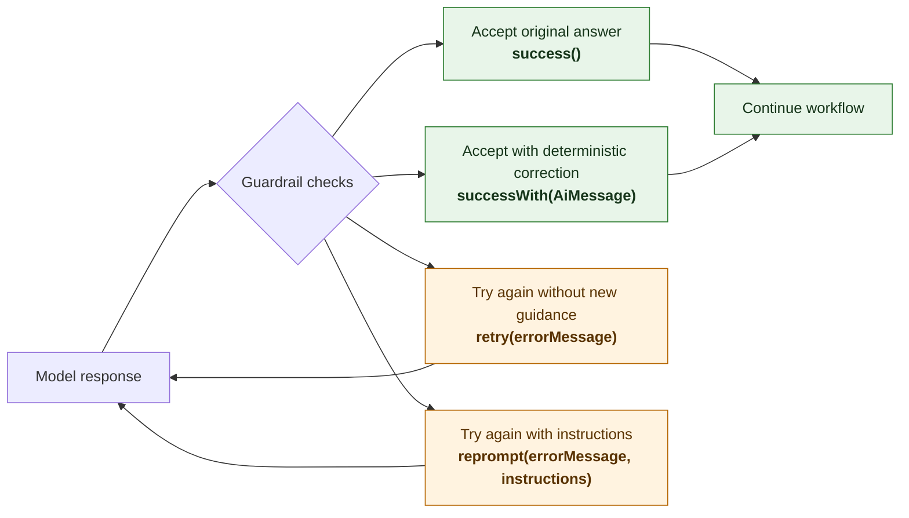
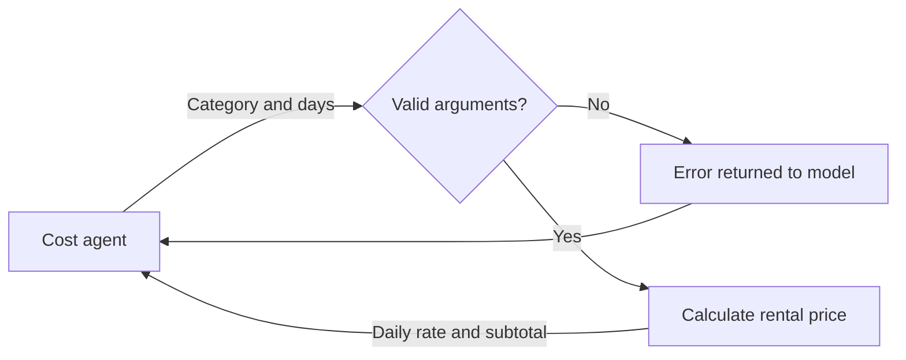
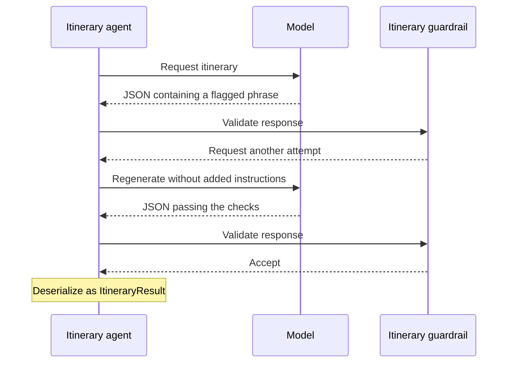
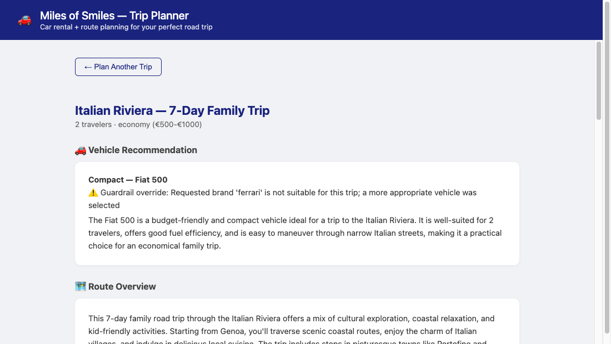

# Step 02 - Guardrails and Compliance

A family of five asks Miles of Smiles for a road trip, but the vehicle agent recommends a two-seat sports car. Even with the skills we added in Step 01, the model-backed agents can still overlook our instructions when generating a response. Such are the joys of working with probabilistic AI models. Similarly, the model might suggest an unsafe itinerary that goes through dangerous areas. The application therefore needs safety and compliance checks of its own before passing recommendations to the rest of the planning pipeline and especially before returning the final result to the user.

In this step we'll attach output guardrails to the vehicle and itinerary agents so they can request another response or rewrite a recommendation. We'll also give the cost estimator a tool that calculates rental prices from a small rate list, with a tool input guardrail to reject invalid arguments before the calculation runs. 

## Per-agent output guardrails

The [input guardrails from Section 1](../section-1/step-09.md) checked the customer's message before it reached the model. **Output guardrails** run *after* an agent has finished its model and tool interactions, allowing the application to inspect the response before accepting it and potentially calling a next agent with incorrect information, or returning the result to the end user.

For our scenario, we need to check the recommendations the parallel itinerary and vehicle selection agents produce before the cost estimator uses them. An **itinerary guardrail** will look for a missing or empty itinerary and a short list of dangerous-area phrases, while a **vehicle guardrail** will compare the recommendation with the customer's request.

Guardrails can take different kinds of action based on the context and how we implement them. They can either **accept** the original answer if everything looks good, or take action by either **correcting** the result itself or going back to the model and asking it to retry. In that case you have the option of simply **retrying with the same instructions** as before, or **reprompting by adding additional context** to the request. The diagram below shows these four possible paths a guardrail can take:


```mermaid
flowchart LR
    accTitle: Four ways an output guardrail can respond
    accDescr: The guardrail accepts the original answer with success or a Java correction with successWith. Both continue the workflow. Retry requests another answer without new guidance, while reprompt adds instructions. Each new model answer is checked again, up to the configured attempt limit.
    Model[Model response] --> Check{Guardrail checks}
    Check --> Pass["Accept original answer<br/><b>success()</b>"]
    Check --> Fix["Accept with deterministic correction<br/><b>successWith(AiMessage)</b>"]
    Check --> Retry["Try again without new guidance<br/><b>retry(errorMessage)</b>"]
    Check --> Reprompt["Try again with instructions<br/><b>reprompt(errorMessage, instructions)</b>"]
    Pass --> Continue[Continue workflow]
    Fix --> Continue
    Retry --> Model
    Reprompt --> Model

    classDef accepted fill:#e8f5e9,stroke:#2e7d32,color:#16351a
    classDef regenerate fill:#fff3e0,stroke:#b56500,color:#593200
    class Pass,Fix,Continue accepted
    class Retry,Reprompt regenerate
```

You can also set an **attempt limit** when registering the guardrails so that repeated failures stop planning instead of looping indefinitely.

## Tool guardrails

Aside from adding guardrails to agents, you can also add **guardrails to local or MCP tool calls**. Checking tool arguments can be particularly important when a tool can modify the file system or write to a database. Before a destructive action such as deleting files or removing database records, a **tool input guardrail** can check whether the requested paths or records are within the permitted scope. A **tool output guardrail** on the other hand inspects the response from a tool for correctness before the agentic system continues with potentially incorrect data.

For the Miles of Smiles app, we're going to give the cost estimator agent a rental calculator tool so it can calculate the vehicle cost using Miles of Smiles' daily rates. If the model requests an unknown vehicle category or a rental of zero days, the calculator might return invalid information, which might end up causing issues in the system. For that, we will add a tool input guardrail to **check the values before** the calculator runs.

A tool input guardrail sits between the agent's tool request and the calculation. Valid arguments let the tool execute. Invalid arguments block that call and return an error to the model as a tool result, giving it a chance to correct its request.


```mermaid
flowchart LR
    Agent[Cost agent] -->|Category and days| Check{Valid arguments?}
    Check -->|No| Error[Error returned to model]
    Error --> Agent
    Check -->|Yes| Tool[Calculate rental price]
    Tool -->|Daily rate and subtotal| Agent
```

## Preparing the working copy

=== "Option 1: Continue from Step 01"

    Continue in your Step 01 working copy and apply the changes below. Use the completed Step 02 project for comparison if you get stuck.

=== "Option 2: Follow the completed Step 02 project"

    The completed project already contains the changes below. You can follow along through the implementation, then join the exercise at [Testing the new guardrail implementation](#testing-the-new-guardrail-implementation).

    ==Open `section-3/step-02` and start dev mode:==

    === "Linux / macOS"
        ```bash
        cd section-3/step-02
        ./mvnw quarkus:dev
        ```

    === "Windows"
        ```cmd
        cd section-3\step-02
        .\mvnw.cmd quarkus:dev
        ```

## Validating structured output with `retry()`

Let's start with adding the guardrail for the itinerary agent. It will ask the model to retry when its response has invalid JSON, an empty itinerary, but also when it is suggesting an itinerary that mentions dangerous areas such as a war zone or which has a travel ban.

==Create `src/main/java/com/tripplanner/guardrails/TripSafetyGuardrail.java`:==

```java title="TripSafetyGuardrail.java"
--8<-- "../../section-3/step-02/src/main/java/com/tripplanner/guardrails/TripSafetyGuardrail.java"
```

`validate()` runs three checks in order and returns as soon as one fails:

- The response must parse as JSON. `extractJson()` strips any Markdown fences the model wraps around it.
- The `itinerary` array must contain at least one day.
- The route overview and day descriptions must not contain any phrase from `DANGEROUS_KEYWORDS`.

A failed check returns `retry()`, which asks the model for a new response. The message passed to `retry()` goes to the log, not to the model, so the second attempt gets the same prompt as the first. Each branch also logs its decision (`PASS`, `RETRY`, or `SKIP`) with Quarkus's static `Log` helper, and we'll use those lines later to follow a real request.

Here's what a retry looks like when the second response passes:


```mermaid
sequenceDiagram
    participant A as Itinerary agent
    participant M as Model
    participant G as Itinerary guardrail
    A->>M: Request itinerary
    M-->>A: JSON containing a flagged phrase
    A->>G: Validate response
    G-->>A: Request another attempt
    A->>M: Regenerate without added instructions
    M-->>A: JSON passing the checks
    A->>G: Validate response
    G-->>A: Accept
    Note over A: Deserialize as ItineraryResult
```

## Rewriting and reprompting with `successWith()` and `reprompt()`

The next step is to create a guardrail for the vehicle selection agent. The guardrail needs to check whether a recommended car fits the customer's group size and budget. It checks the economy-budget rule first, then corrects small-vehicle recommendations for groups of four or more.

==Create `src/main/java/com/tripplanner/guardrails/TripAppropriatenessGuardrail.java`:==

```java title="TripAppropriatenessGuardrail.java"
--8<-- "../../section-3/step-02/src/main/java/com/tripplanner/guardrails/TripAppropriatenessGuardrail.java"
```

`requestParams().variables()` gives the guardrail the trip details for this agent call, so retries are checked against the same group size and budget. From there, a recommendation ends up in one of four places:

- `REPROMPT`: an economy budget with a brand from `LUXURY_BRANDS`. `reprompt()` tells the model what was wrong and asks for JSON straight away instead of an acknowledgement, which keeps it in structured-output mode.
- `REWRITE`: a small vehicle for four or more travelers. `rewriteVehicle()` swaps in an SUV for adventure trips, an Estate for business trips, or an MPV otherwise, and `successWith()` accepts the corrected JSON without another model call. A family gets `Family MPV; specific model subject to availability.`, with a note asking them to confirm capacity, price, and availability.
- `ANNOTATE`: the customer asked for a luxury brand, but the model already picked something sensible. The response passes through unchanged apart from an explanation.
- `PASS`: none of the rules matched.

!!! info "Deterministic validation limitations"
    As you can see, we added a simple set of strings for the small vehicles and luxury brands. It's very possible that the LLM
    suggests a luxury vehicle that is not in this list, or a small vehicle that is described in a different way and our guardrail
    would not catch the issue. In Step 7 we will introduce evaluation guardrail patterns that involve a different AI model to 
    evaluate the response from the main model.
    

## Registering guardrails with `@OutputGuardrails`

Now we need to tell the agents to actually use the guardrails after they run by adding an `@OutputGuardrails()` annotation.

==Open `src/main/java/com/tripplanner/agentic/agents/ItineraryPlannerAgent.java` and add the highlighted imports and annotation:==

```java hl_lines="3 7 28" title="ItineraryPlannerAgent.java"
--8<-- "../../section-3/step-02/src/main/java/com/tripplanner/agentic/agents/ItineraryPlannerAgent.java"
```

==Make the corresponding additions in `src/main/java/com/tripplanner/agentic/agents/VehicleAdvisorAgent.java`:==

```java hl_lines="3 7 25" title="VehicleAdvisorAgent.java"
--8<-- "../../section-3/step-02/src/main/java/com/tripplanner/agentic/agents/VehicleAdvisorAgent.java"
```

Each `@OutputGuardrails` annotation connects the agent to its guardrail, which checks the response before deserialization. With `maxRetries = 3`, the agent gets the first response plus two more attempts.

## Mapping guardrail exceptions to HTTP responses

When an agent runs out of attempts, the customer needs a readable error explaining that planning failed.

==Create `src/main/java/com/tripplanner/resource/GuardrailExceptionMapper.java`:==

```java title="GuardrailExceptionMapper.java"
--8<-- "../../section-3/step-02/src/main/java/com/tripplanner/resource/GuardrailExceptionMapper.java"
```

The mapper searches the exception's causes for a `GuardrailException`, returning HTTP 422 with `guardrail_violation` when it finds one. Other agent failures return HTTP 500 with `planning_failed`. Both responses include a customer-facing `message`, while the full exception stays in the server log.

## Calculating rental prices with a tool

The cost estimator needs a calculator that multiplies a daily rental rate (in this case in EUR) by the requested number of days.
We need to create a tool for this, and then add a `@ToolInputGuardrails()` annotation to handle the
 input validation before the tool gets called.

==Create `src/main/java/com/tripplanner/agentic/tools/RentalPricingTool.java`:==

```java hl_lines="3 5 21" title="RentalPricingTool.java"
--8<-- "../../section-3/step-02/src/main/java/com/tripplanner/agentic/tools/RentalPricingTool.java"
```

The tool calculates a rental subtotal using the fictional prices in `DAILY_RATES` and returns it alongside the daily rate. The `@ToolInputGuardrails` annotation connects it to the argument validator which we'll add below.

### Rejecting invalid tool arguments with a Tool Input Guardrail

We need to now implement the tool input guardrail used by the tool above. The guardrail checks the category and duration for validity.

==Create `src/main/java/com/tripplanner/guardrails/RentalEstimateInputGuardrail.java`:==

```java title="RentalEstimateInputGuardrail.java"
--8<-- "../../section-3/step-02/src/main/java/com/tripplanner/guardrails/RentalEstimateInputGuardrail.java"
```

`validate()` checks the raw JSON before Quarkus converts it to Java arguments. The category must be exactly `compact`, `estate`, `suv`, or `mpv`, and days must be a whole number from 1 to 30, so `days: 1.5` and `days: "5"` are both rejected instead of being quietly converted, which could yield unexpected results. `failure()` blocks the calculation and hands the reason back to the model as a tool error.

A rejected tool call doesn't use up any of the output guardrail's attempts, and it doesn't fail the HTTP request. The model can simply try another tool call in the same conversation. See the [tool guardrails reference](https://docs.quarkiverse.io/quarkus-langchain4j/dev/function-calling.html#_tool_guardrails){target="_blank"} for more detail.

### Giving the cost estimator access

Now that we've built the tool, we need to give the cost agent access to the calculator and instructions to use its prices in the estimate.

==Open `src/main/java/com/tripplanner/agentic/agents/CostEstimatorAgent.java` and add the highlighted imports, prompt changes, annotation, and `days` parameter:==

```java title="CostEstimatorAgent.java" hl_lines="3 8 18 22-28 31 36"
--8<-- "../../section-3/step-02/src/main/java/com/tripplanner/agentic/agents/CostEstimatorAgent.java"
```

`@ToolBox` makes the calculator available to the agent, and the new `days` parameter supplies the duration from the workflow's shared scope. The prompt asks the model to use the returned daily rate and include the rental subtotal once, while estimating the other trip expenses separately.

## Testing the new guardrail implementation

Time to test if everything is working! As always, if the application is not already running, start it from the project directory you chose above:

=== "Linux / macOS"
    ```bash
    ./mvnw quarkus:dev
    ```

=== "Windows"
    ```cmd
    .\mvnw.cmd quarkus:dev
    ```

==Open [http://localhost:8080](http://localhost:8080){target="_blank"} and fill in the form:==

- Destination: `Italian Riviera`
- Start date: a future date
- Duration: `5` days
- Travelers: `4`
- Trip Type: `Family Vacation`
- Budget: `Moderate (€1,000–€2,500)`

==Click **Generate Trip Plan**, wait for it to finish, and check the terminal for guardrail decisions.== When the responses pass, the guardrails write INFO lines like these (not necessarily in this order):

```text
🛡️ [TripSafetyGuardrail] PASS — Nonempty itinerary; no configured phrases in route overview or day descriptions
🛡️ [TripAppropriatenessGuardrail] PASS — No configured small-vehicle or economy-brand rule matched
```

!!!note
    If you find the guardrail lines hard to spot, set both `quarkus.langchain4j.openai.log-requests` and `quarkus.langchain4j.openai.log-responses` to `false` and try again.

A `PASS` means the recommendation already met the rules. A `REPROMPT` means the guardrail sent the model corrective instructions and waited for another answer. A `REWRITE` means the guardrail replaced the response directly without another model call. If a `REPROMPT` appears, look for the subsequent guardrail decision to see whether the next answer passed.

The `RentalEstimateInputGuardrail` decisions show up in the same log.

==Open the [Quarkus Dev UI](http://localhost:8080/q/dev-ui){target="_blank"}, select **Executions** on the LangChain4j Agentic card, and expand `estimateCosts` in the latest run.== Look for the `estimateRental` call and its category, duration, and result. An accepted `suv` call for five days, for example, returns a daily rate of 80 EUR and a rental subtotal of 400 EUR. The daily rate should match the vehicle-per-day amount in the browser.

## Observing a guardrail reprompt in the browser

The vehicle-selection skill guides the model toward sensible choices for most trips, but the guardrail's budget rule operates independently of the skill. Let's try to trigger it by requesting a luxury vehicle on an economy budget. 

==Open [http://localhost:8080](http://localhost:8080){target="_blank"} and fill in the form:==

- Destination: `Italian Riviera`
- Start date: a future date
- Duration: `7` days
- Travelers: `2`
- Trip Type: `Family Vacation`
- Budget: `Economy (€500–€1,000)`
- Additional Preferences: `We want a Ferrari`

==Click **Generate Trip Plan**, wait for it to finish, and look for the guardrail decisions in the terminal.==

When the model recommends a Ferrari on an economy budget, the vehicle guardrail steps in with a `REPROMPT`. The model's second answer is an affordable car, but the preferences still mention Ferrari, so the guardrail lets it through with an `ANNOTATE` decision and a note for the customer. After both agents finish, the cost estimator calls `estimateRental` and the tool input guardrail checks its arguments. You should see lines like these, though again not necessarily in this order and the same data response.

```text
🛡️ [TripAppropriatenessGuardrail] REPROMPT — Luxury vehicle 'ferrari portofino' does not match economy budget — asking model to retry with an affordable option
🛡️ [TripAppropriatenessGuardrail] ANNOTATE — Preferences mentioned 'ferrari' but output is 'fiat 500' — Requested brand 'ferrari' is not suitable for this trip; a more appropriate vehicle was selected
🛡️ [TripSafetyGuardrail] PASS — Nonempty itinerary; no configured phrases in route overview or day descriptions
🛡️ [RentalEstimateInputGuardrail] PASS — Rental arguments accepted
```

The annotation ends up in the browser too. The guardrail writes it to the `guardrailOverride` field of the JSON response, and the vehicle recommendation card shows it as a notice above the reasoning. The same notice appears when the guardrail replaces a vehicle that is too small for the group.



!!!note
    The model may skip the Ferrari entirely and pick an affordable car on the first attempt. In that case you'll see no `REPROMPT`, but the `ANNOTATE` line and the notice still appear because the preferences mention a brand the plan doesn't include. If you see neither, try a different luxury brand in the preferences or a different model.

When a guardrail exhausts all its retry or reprompt attempts without a passing response, the `GuardrailExceptionMapper` returns HTTP 422 and the browser displays: `The trip plan could not pass the recommendation checks. Please revise your trip details and try again.`

## Observing a tool input guardrail rejection

The Duration field in the form accepts any number (the Miles of Smiles developers were perhaps a bit lazy), so we can trigger the input guardrail simply by entering a value outside the tool's accepted range.

==Open [http://localhost:8080](http://localhost:8080){target="_blank"}, fill in the form with any destination, and set Duration to `45` days. Click **Generate Trip Plan** and look for the `RentalEstimateInputGuardrail` lines in the terminal:==

```text
🛡️ [RentalEstimateInputGuardrail] REJECT — Set days to a whole number from 1 to 30.
🛡️ [RentalEstimateInputGuardrail] PASS — Rental arguments accepted
```

There is no `Rental calculation executed` line after the rejected call, because the guardrail stopped it first. The model gets the rejection reason as a tool result and decides what to do next. Note that a resourceful model might split the 45-day rental into a 30-day and a 15-day call and add them up itself.

==Open the Dev UI Executions panel for the cost estimator, expand the latest run, and compare the rejected tool call with the corrected ones that follow it.==

??? info "Verifying with tests"
    Because a live model will not reliably reproduce a specific bad recommendation on demand, the supplied tests use fixed responses to exercise each guardrail branch deterministically. You can find them in the step-02 folder.

    - The `*GuardrailTest` classes cover the output guardrails (rewrite, reprompt, retry decisions) and the rental pricing input guardrail (invalid arguments blocked, valid arguments reaching the calculation). An invalid duration is rejected with `Input guardrail failed for tool estimateRental: Set days to a whole number from 1 to 30.` A valid five-day SUV call logs `Rental calculation executed: category=suv, days=5, total=400 EUR`.

    - `TripPlanningFailureTest` calls the real `POST /trip/plan` endpoint with scripted model responses. It checks that corrected vehicle fields reach the client, that exhausted guardrail attempts return HTTP 422, and that an unrelated agent failure returns HTTP 500. 
    
    - `VehicleGuardrailConcurrencyTest` exercises concurrent planning through the agent pipeline with scripted model responses. The exhausted-check cases assert this response body:

        ```json
            {
            "error": "guardrail_violation",
            "message": "The trip plan could not pass the recommendation checks. Please revise your trip details and try again."
            }
        ```

    ==Run the Step 02 test suite:==

    === "Linux / macOS"
        ```bash
        ./mvnw test
        ```

    === "Windows"
        ```cmd
        .\mvnw.cmd test
        ```

    The default Surefire configuration runs guardrail unit tests, `TripPlanningFailureTest`, and `GuardrailExceptionMapperTest`.

    There is also a Playwright browser test that shows a family vehicle correction and the error responses at desktop and mobile widths, using intercepted responses instead of model calls. You will need to install Node.js and npm for this to run successfully:

    ```bash
    npm install --no-save --package-lock=false playwright
    npx playwright install chromium
    ```

    === "Linux / macOS"
        ```bash
        APP_URL=http://localhost:8080 node --test src/test/frontend/app.test.cjs
        ```

    === "Windows (PowerShell)"
        ```powershell
        $env:APP_URL="http://localhost:8080"
        node --test src/test/frontend/app.test.cjs
        ```

    Use your application's port in `APP_URL` if it differs from 8080. To watch the controlled vehicle card and failure messages in a real browser, rerun with `SHOW_BROWSER=true` added to the environment (`$env:SHOW_BROWSER="true"` in PowerShell). The test pauses briefly after each displayed result.

## Taking it further

- Child-seat rentals give us another use for tool guardrails. As an optional exercise, add a small fictional extras-pricing tool with seat identifiers and quantities. Its input guardrail could reject an unknown seat or a negative quantity before calculation. Fixed-response tests should check that rejected calls never execute and that accepted calls return the expected separate extras subtotal.

- For output-guardrail practice, compare a recommended seat's catalog limits with supplied child measurements and vehicle compatibility data. A fixed response recommending an unsuitable seat should be rejected even if its price is valid. Missing suitability data should prompt a request for details instead of accepting a guess.

- To explore tool output guardrails instead, add a fictional internal sales note to a pricing result, such as the agency's commission on a child-seat rental, and filter it with `@ToolOutputGuardrails` before it reaches the model. Extend the scripted test to check that the calculation ran but the internal note is absent from the tool result seen by the model. Unlike the input guardrail, this check runs after the tool has executed.

- You can also add a test with a flagged phrase only in an itinerary title, then extend `findDangerousContent()` to check titles. Another useful case is a warning such as "avoid the conflict area": the current phrase matching rejects it even though it advises the customer to stay away.

!!! note 
    These experiments are optional. Later steps build on the original guardrail rules and retry allowance, so keep any experimental rule changes in a separate working copy if you want to follow along with that baseline.

## What's next?

The planner now checks its research recommendations and can calculate rental prices through a tool that rejects invalid arguments before execution. In Step 03, we'll add evaluator agents that vote on the vehicle recommendation, an iterative refinement loop, and adaptive model selection that picks a more capable model as the recommendation improves.

[Continue to Step 03 - Voting, Loops, and Adaptive Model Selection](step-03.md)

## Troubleshooting

??? warning "The rental estimate tool is missing or rejected"
    ==Check that the cost agent has `@ToolBox(RentalPricingTool.class)` and that its prompt asks for `estimateRental`. Inspect the tool-call arguments and error result.== Categories must be exactly `compact`, `estate`, `suv`, or `mpv`, and `days` must be a JSON integer from 1 to 30. The tool checks the arguments the model supplies, not whether they match the original trip request, so compare those values when inspecting the execution.

??? warning "The guardrail never triggers"
    The model may already produce output that passes these rules. ==Run the fixed-payload tests above to check specific branches, and inspect the terminal logs for `SKIP` decisions.== A skipped check permits processing to continue without validating that recommendation.

??? warning "An unsuitable response was accepted"
    ==Compare the original response with the fields and keywords checked by the guardrail, and look for `SKIP` lines in the log.== Both guardrails log `SKIP` and let the response through when they can't check it, for example on blank text or unparseable JSON. The itinerary scan ignores titles, and the keyword lists don't cover every small or expensive vehicle. Step 07 replaces the luxury-brand list with an LLM judge.

??? warning "Planning fails after retries"
    ==Check the guardrail log lines for the rejection reason, then inspect the HTTP response in the browser's network panel and the server exception log.== HTTP 422 with `guardrail_violation` identifies an actual guardrail failure in the cause chain. HTTP 500 with `planning_failed` identifies an unrelated wrapped agent failure. Client messages intentionally omit the internal exception details, which can include model content or provider information; take care when sharing logs.

??? warning "OPENAI_API_KEY is not set"
    ==Set `OPENAI_API_KEY` in the shell used to start the application, then restart it.== Keep the same model configuration used in Step 01.


