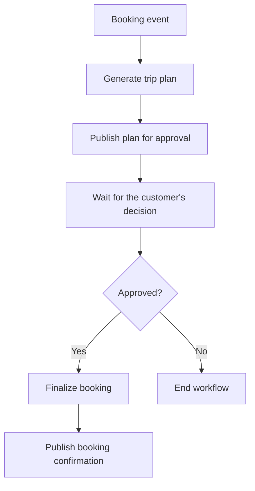
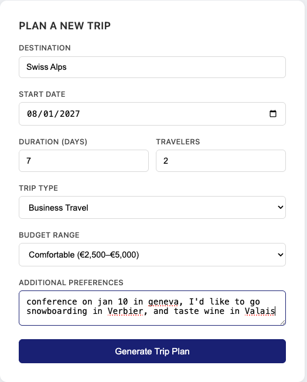
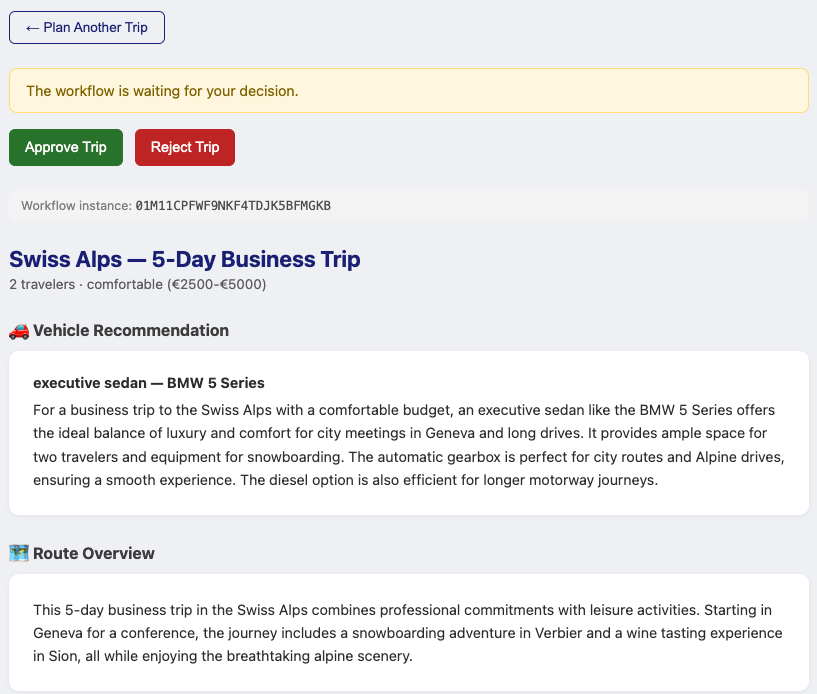

# Step 03 - Event-Driven Agentic Workflows with Quarkus Flow

## Human-in-the-loop orchestration with Quarkus Flow

The trip planner can now generate recommendations and check them before returning a response, but a customer may need time to read the itinerary before agreeing to a booking. Keeping the planning request open while they decide would tie the approval process to a long-lived HTTP connection.

[Quarkus Flow](https://quarkiverse.github.io/quarkiverse-docs/quarkus-flow/dev/index.html){target="_blank"} lets us pause the workflow after generating a plan, without holding a thread while the customer decides. We'll use Kafka to carry the approval request and response as [CloudEvents](https://cloudevents.io/){target="_blank"}, so the decision can arrive in a separate request.

By the end of the exercise, the browser will show a plan awaiting approval. Approving it will resume the same workflow and produce a booking reference; rejecting it will end the workflow without finalizing the booking. We'll inspect the events in the Dev UI to follow both paths.

---

## Event-driven workflows with CloudEvents

The workflow starts when a booking event arrives, runs the existing planning agents, and publishes the plan for approval. It then waits for a decision addressed to that particular workflow instance, so an approval can resume the correct trip.



Quarkus Flow expresses these tasks in Java using the [CNCF Serverless Workflow specification](https://serverlessworkflow.io/){target="_blank"}. CloudEvents supplies the event envelope, with common fields such as `type`, `source`, `id`, and `data`; Kafka transports those events between the application and the workflow.

!!! note "In-memory state"
    The workflow waits in memory in this step. Restarting the application loses the waiting instance and the stored plan, even if Kafka still has the events. Step 04 adds persistence so the customer can continue after a restart.

---

## Preparing the working project

=== "Option 1: Continue from Step 02 and build the new features hands-on"

    ==Continue in your Step 02 working copy and apply the changes below.== Quarkus dev mode can remain running while you edit.

=== "Option 2: Use the completed Step 03 project and review the changes"

    The completed project already contains the changes below.

    ==Open `section-3/step-03` and start dev mode:==

    === "Linux / macOS"
        ```bash
        cd section-3/step-03
        ./mvnw quarkus:dev
        ```

    === "Windows"
        ```cmd
        cd section-3\step-03
        mvnw quarkus:dev
        ```

---

Kafka runs through Dev Services, so a container runtime such as Docker or Podman must be running. Keep the model provider configuration from Step 02, and submit only one planning request at a time because the sample still uses a shared trip request context.

## Connecting Flow to Kafka

==Open `pom.xml` in your working project and add the Quarkus Flow BOM inside `<dependencyManagement><dependencies>`:==

```xml
<dependency>
    <groupId>io.quarkiverse.flow</groupId>
    <artifactId>quarkus-flow-bom</artifactId>
    <version>${quarkus-flow.version}</version>
    <type>pom</type>
    <scope>import</scope>
</dependency>
```

==Add the version property from the completed Step 03 project inside `<properties>`:==

```xml title="pom.xml"
--8<-- "../../section-3/step-03/pom.xml:19:19"
```

==Add these dependencies to `<dependencies>`:==

```xml title="pom.xml"
--8<-- "../../section-3/step-03/pom.xml:69:84"
```

---

### Configuring Kafka messaging channels

==Add this configuration to `src/main/resources/application.properties`, keeping the model and skills settings:==

```properties
# Quarkus Flow messaging bridge
quarkus.flow.messaging.defaults-enabled=true

# Quarkus Flow execution logging
quarkus.log.category."io.quarkiverse.flow".level=DEBUG
quarkus.log.category."io.serverlessworkflow".level=DEBUG

# Kafka channels for Flow events
mp.messaging.incoming.flow-in.connector=smallrye-kafka
mp.messaging.incoming.flow-in.topic=flow-in
mp.messaging.incoming.flow-in.value.deserializer=org.apache.kafka.common.serialization.StringDeserializer
mp.messaging.incoming.flow-in.key.deserializer=org.apache.kafka.common.serialization.StringDeserializer

mp.messaging.outgoing.flow-out.connector=smallrye-kafka
mp.messaging.outgoing.flow-out.topic=flow-out
mp.messaging.outgoing.flow-out.value.serializer=org.apache.kafka.common.serialization.StringSerializer
mp.messaging.outgoing.flow-out.key.serializer=org.apache.kafka.common.serialization.StringSerializer

mp.messaging.outgoing.flow-in-producer.connector=smallrye-kafka
mp.messaging.outgoing.flow-in-producer.topic=flow-in
mp.messaging.outgoing.flow-in-producer.value.serializer=io.quarkus.kafka.client.serialization.ObjectMapperSerializer
mp.messaging.outgoing.flow-in-producer.key.serializer=org.apache.kafka.common.serialization.StringSerializer

mp.messaging.incoming.flow-out-consumer.connector=smallrye-kafka
mp.messaging.incoming.flow-out-consumer.topic=flow-out
mp.messaging.incoming.flow-out-consumer.value.deserializer=org.apache.kafka.common.serialization.StringDeserializer
mp.messaging.incoming.flow-out-consumer.key.deserializer=org.apache.kafka.common.serialization.StringDeserializer
mp.messaging.incoming.flow-out-consumer.auto.offset.reset=earliest
```

The application publishes booking and approval events through `flow-in-producer` to the `flow-in` topic, where Flow consumes them. In the other direction, Flow publishes plans and confirmations to `flow-out`, and the application's `flow-out-consumer` captures them for the browser. The four channels connect the two sides through two Kafka topics.

---

## Modeling workflow event payloads

The customer's decision needs a workflow identifier so it can be matched to a waiting trip. The approved path also needs a result the browser can display once booking finishes.

==Create `src/main/java/com/tripplanner/model/TripApproval.java`:==

```java title="TripApproval.java"
--8<-- "../../section-3/step-03/src/main/java/com/tripplanner/model/TripApproval.java"
```

==Create `src/main/java/com/tripplanner/model/BookingConfirmation.java`:==

```java title="BookingConfirmation.java"
--8<-- "../../section-3/step-03/src/main/java/com/tripplanner/model/BookingConfirmation.java"
```

`TripApproval` carries the user's decision (approved or rejected) along with the `instanceId` that ties it back to the right workflow instance. `BookingConfirmation` is what the workflow produces at the end of the approve path.

---

## Integrating LangChain4j agents with Quarkus Flow

The workflow will call the existing agents through an adapter. A separate store will receive the resulting events and keep the plan available to the REST endpoints.

### Updating agent parameters and structured outputs

The completed Step 03 pipeline generates practical tips alongside the itinerary, removing a separate model call. It also keeps `days` and `travelers` numeric throughout the pipeline, so the adapter can pass the values from `TripRequest` directly without converting them to strings.

==Open `src/main/java/com/tripplanner/model/ItineraryResult.java` and add the highlighted field, including the comma after `itinerary`:==

```java title="ItineraryResult.java (record)" hl_lines="3-4"
--8<-- "../../section-3/step-03/src/main/java/com/tripplanner/model/ItineraryResult.java:5:9"
```

==In `src/main/java/com/tripplanner/agentic/agents/ItineraryPlannerAgent.java`, add the tips instruction to the prompt and change `days` to `Integer`, keeping the existing skills and guardrail annotations:==

```java title="ItineraryPlannerAgent.java (prompt and method)" hl_lines="7-8 22"
--8<-- "../../section-3/step-03/src/main/java/com/tripplanner/agentic/agents/ItineraryPlannerAgent.java:12:35"
```

==In the same package, update the method declarations in `VehicleAdvisorAgent.java` and `CostEstimatorAgent.java` so `travelers` is also an `Integer`. Leave their prompts and annotations unchanged:==

```java title="VehicleAdvisorAgent.java (method)" hl_lines="3"
--8<-- "../../section-3/step-03/src/main/java/com/tripplanner/agentic/agents/VehicleAdvisorAgent.java:28:32"
```

```java title="CostEstimatorAgent.java (method)" hl_lines="3"
--8<-- "../../section-3/step-03/src/main/java/com/tripplanner/agentic/agents/CostEstimatorAgent.java:25:28"
```

==In `src/main/java/com/tripplanner/agentic/workflow/ResearchPhase.java`, update both numeric parameters in `research()`. Keep its `@ParallelAgent` annotation and output method unchanged:==

```java title="ResearchPhase.java (method)" hl_lines="3 5"
--8<-- "../../section-3/step-03/src/main/java/com/tripplanner/agentic/workflow/ResearchPhase.java:16:22"
```

==Delete `src/main/java/com/tripplanner/agentic/agents/TipsGeneratorAgent.java`. In `src/main/java/com/tripplanner/agentic/workflow/TripPlannerSystem.java`, remove the `TipsGeneratorAgent` and `java.util.List` imports, remove `TipsGeneratorAgent.class` from `subAgents`, and update the numeric parameters:==

```java title="TripPlannerSystem.java (sequence and method)" hl_lines="5 9 11"
--8<-- "../../section-3/step-03/src/main/java/com/tripplanner/agentic/workflow/TripPlannerSystem.java:12:24"
```

==Update the output method below it, removing the `List<String> tips` parameter and reading tips from `itineraryResult`:==

```java title="TripPlannerSystem.java (output)" hl_lines="4 10"
--8<-- "../../section-3/step-03/src/main/java/com/tripplanner/agentic/workflow/TripPlannerSystem.java:26:36"
```

The final `TripPlan` still has the same fields, but its tips now come from the itinerary agent. Research still runs the vehicle and itinerary agents in parallel, followed by cost estimation.

### Invoking the agentic workflow through a Flow adapter

This bean bridges `TripRequest` to the existing `TripPlannerSystem.planTrip(...)` method so the workflow can call it as a function. It also handles post-approval booking finalization.

==Create `src/main/java/com/tripplanner/agentic/flow/TripPlannerFlowAdapter.java`:==

```java title="TripPlannerFlowAdapter.java"
--8<-- "../../section-3/step-03/src/main/java/com/tripplanner/agentic/flow/TripPlannerFlowAdapter.java"
```

### Consuming workflow events into an in-memory store

This bean listens on the `flow-out-consumer` channel and captures workflow events so the REST layer can return results to the UI. It stores plan payloads when the workflow emits an approval request, and booking confirmations after the workflow finalizes.

==Create `src/main/java/com/tripplanner/agentic/flow/TripPlanStore.java`:==

```java title="TripPlanStore.java"
--8<-- "../../section-3/step-03/src/main/java/com/tripplanner/agentic/flow/TripPlanStore.java"
```

### Publishing approval CloudEvents

This endpoint turns the UI's approve or reject action into a `com.tripplanner.trip.approval.done` CloudEvent and publishes it to `flow-in`, where the waiting workflow instance picks it up.

==Create `src/main/java/com/tripplanner/resource/TripApprovalResource.java`:==

```java title="TripApprovalResource.java"
--8<-- "../../section-3/step-03/src/main/java/com/tripplanner/resource/TripApprovalResource.java"
```

### Triggering workflows from a REST endpoint

The existing `TripPlannerResource` changes from calling `TripPlannerSystem` directly to publishing a CloudEvent that starts the workflow. It then waits for `TripPlanStore` to receive the plan and returns it, so from the UI's perspective the POST still behaves synchronously.

==Open `src/main/java/com/tripplanner/resource/TripPlannerResource.java`. Remove the `tripPlannerSystem` field and its `@Inject` annotation, along with the `TripPlannerSystem` and `TripPlan` imports. Update the imports with the highlighted additions:==

```java title="TripPlannerResource.java (imports)" hl_lines="1 4 7 11 13-17 19-20"
--8<-- "../../section-3/step-03/src/main/java/com/tripplanner/resource/TripPlannerResource.java:3:22"
```

==Keep the request-context injection and add the timeout, store, and event emitter fields:==

```java title="TripPlannerResource.java (fields)" hl_lines="1 6-10"
--8<-- "../../section-3/step-03/src/main/java/com/tripplanner/resource/TripPlannerResource.java:27:36"
```

==Update `planTrip()` with the highlighted changes, including its return type and `throws` clause:==

```java title="TripPlannerResource.java (starting the workflow)" hl_lines="5 8-28"
--8<-- "../../section-3/step-03/src/main/java/com/tripplanner/resource/TripPlannerResource.java:38:66"
```

Publishing the event starts planning asynchronously, but this endpoint still waits for the store to receive the generated plan before returning to the browser. The later approval wait belongs to the workflow and does not keep this HTTP request open.

==Add the status and latest-plan endpoints below `planTrip()`:==

```java title="TripPlannerResource.java (reading results)"
--8<-- "../../section-3/step-03/src/main/java/com/tripplanner/resource/TripPlannerResource.java:68:98"
```

The browser uses the instance-specific endpoint to check for a booking confirmation. The latest-plan endpoint lets it redisplay a pending plan after a page refresh, while the application is still running.

??? info "Complete updated TripPlannerResource.java"
    The complete file is included for comparison with the focused edits above.

    ```java title="TripPlannerResource.java" hl_lines="3 6 9 13 15-19 21-22 27 32-36 42 45-65 68-98"
    --8<-- "../../section-3/step-03/src/main/java/com/tripplanner/resource/TripPlannerResource.java"
    ```

??? info "What happens if planning fails?"
    In Step 02, the REST call invoked the agents directly, so the exception mapper could translate a guardrail failure into HTTP 422. Planning now runs in the workflow; a failure there does not propagate through the waiting REST call. If no plan reaches the store, this endpoint returns HTTP 504 after its timeout. The workflow logs contain the cause.

---

## Workflow suspension and event correlation with `listen()`

With the event publishing and result storage in place, the workflow can connect planning to approval. Its wait must match the response to the workflow instance that requested the decision.

==Create `src/main/java/com/tripplanner/agentic/flow/TripPlannerFlow.java`:==

```java title="TripPlannerFlow.java"
--8<-- "../../section-3/step-03/src/main/java/com/tripplanner/agentic/flow/TripPlannerFlow.java"
```

The booking event registered with `schedule` starts a new instance, and the first function passes its request to the planning adapter. After publishing the plan with `emitJson`, the workflow pauses at `listen`. The `flowinstanceid` filter prevents a decision for another trip from resuming this instance; once a matching decision arrives, `switchWhenOrElse` allows only approval to reach booking finalization.

### Testing workflow branches with a mocked adapter

The completed Step 03 tests use a mocked planning adapter and inspect emitted events to check approval and rejection without calling the model. The old REST test expects a bare `TripPlan`, but `/trip/plan` now returns a status object containing the plan and workflow identifier.

==Remove `src/test/java/com/tripplanner/TripPlannerResourceTest.java` from your working copy. Copy `MockTripPlannerFlowAdapter.java` and `TripPlannerFlowTest.java` from `section-3/step-03/src/test/java/com/tripplanner/flow/` into the same test package in your working copy.== The Step 02 guardrail tests can remain; the new tests bypass the agents and do not replace that coverage.

==In `pom.xml`, replace the existing `quarkus-junit` dependency with `quarkus-junit5` and add `quarkus-junit5-mockito` as shown:==

```xml title="pom.xml (JUnit dependencies)" hl_lines="3 6-10"
--8<-- "../../section-3/step-03/pom.xml:85:94"
```

==Keep `rest-assured` and add the in-memory messaging and Awaitility test dependencies:==

```xml title="pom.xml (messaging test dependencies)"
--8<-- "../../section-3/step-03/pom.xml:100:109"
```

==Remove `<argLine>@{argLine}</argLine>` from both the `maven-surefire-plugin` and `maven-failsafe-plugin` configurations, leaving their other settings unchanged. Their configuration blocks should match these excerpts:==

```xml title="pom.xml (Surefire configuration)"
--8<-- "../../section-3/step-03/pom.xml:139:144"
```

```xml title="pom.xml (Failsafe configuration)"
--8<-- "../../section-3/step-03/pom.xml:157:163"
```

==Update `src/test/resources/application.properties` with the highlighted connector overrides, keeping any other test-specific settings:==

```properties title="src/test/resources/application.properties" hl_lines="3-4"
--8<-- "../../section-3/step-03/src/test/resources/application.properties"
```

Only the outgoing event capture and the store's consumer use in-memory connectors here. The incoming booking and approval channels still use Kafka, so these tests still need a broker or a running container runtime for Dev Services. They check emitted events, not the browser or the REST response body.

==Run the workflow tests from your working project directory:==

=== "Linux / macOS"
    ```bash
    ./mvnw test -Dtest=TripPlannerFlowTest
    ```

=== "Windows"
    ```cmd
    mvnw test -Dtest=TripPlannerFlowTest
    ```

---

## Inspecting Quarkus Flow in the Dev UI

==Start the app in dev mode if it is not already running.==

==Open the app at [http://localhost:8080](http://localhost:8080){target="_blank"}.==

==Open the Dev UI at [http://localhost:8080/q/dev](http://localhost:8080/q/dev){target="_blank"}.== The extensions page now has Quarkus Flow and Kafka cards.


==Click **Workflows** in the Flow card.== The list includes `trip-planner-flow`, the workflow added above, alongside `research-phase` and `trip-planner-system` for the agent pipeline.


==Click the eye icon next to `trip-planner-flow` to open the visual flow diagram.== Follow the path from planning to the approval wait and the decision branch.

??? info "Earlier workflow capture"
    This existing capture predates the current workflow definition and includes an initial `set` task that is no longer needed. Use it to locate the diagram view, not to check the exact task list.

    

==Open **Messaging > Channels** to check the Kafka channel connections.== The publishers and subscribers should match the two-topic arrangement configured above.

??? info "Earlier channel capture"
    This capture locates the channel view, but predates the planner's event emitter and shows different serializer settings. Compare the running application with the configuration above when checking the wiring.

    

---

## Verifying workflow suspension and resumption

==Fill in the trip form with a future start date and click **Generate Trip Plan**.== For example, use a Swiss Alps business trip with a conference in Geneva, snowboarding in Verbier, and wine tasting in Valais.

The screenshots below are examples from separate runs, so their trip details and identifiers differ. The approval and confirmation captures also show a workflow-identifier bar added in Step 04; this step's UI does not display that bar yet.



The form submits to the REST endpoint, which triggers the workflow and blocks until the plan is ready. While the agents research the destination, select a vehicle, and estimate costs, the UI shows a wait screen:


==Watch the terminal for the `planTrip` task to finish and `waitApproval` to start.== The execution listener logs task transitions, so the absence of a completion entry for the wait task helps locate the pause. The workflow remains in memory without holding a thread while it waits for the decision event.

When the workflow reaches the approval wait state, the generated plan appears with **Approve Trip** and **Reject Trip** buttons:



The yellow banner shows that the workflow is suspended at `listen()`, waiting for a decision. The page shows the vehicle recommendation and route overview produced by the agents.

### Approve path

==Click **Approve Trip**.==

The app sends an approval event with the current `flowinstanceid`. The terminal should show the wait completing and `finalizeBooking` running, followed by a `com.tripplanner.booking.finalized` event. This confirms that the decision resumed the waiting instance.

The UI shows a booking reference once the `booking.finalized` event arrives:


### Reject path

==Generate another plan and click **Reject Trip**.==

The workflow resumes from the same wait point and ends without booking finalization. The UI shows a cancellation message.

### Inspecting CloudEvents in the Kafka Dev UI

==Open **Apache Kafka Client > Topics** in the Dev UI and select `flow-in`.== The topic should contain the `com.tripplanner.booking.confirmed` CloudEvent that triggered the workflow, with the trip request in its data field.


==Select `flow-out` and inspect the `com.tripplanner.trip.approval.requested` event.== It contains the generated plan and a `flowinstanceid` extension that identifies the workflow waiting for a decision.


After approval, `flow-in` will also contain the `com.tripplanner.trip.approval.done` event, and `flow-out` will contain `com.tripplanner.booking.finalized` (approve path only).

==Compare the `flowinstanceid` on the approval request and decision events.== They should refer to the same workflow, which pauses at `waitApproval` and continues after approval or rejection.

---

## What's next?

The customer can now review a plan before deciding whether to book, with events connecting that decision to the waiting workflow. The plan and workflow still live in memory, so in Step 04 we'll save them in PostgreSQL and approve the same trip after an application restart.

[Continue to Step 04 - Persistent State with PostgreSQL](step-04.md)
