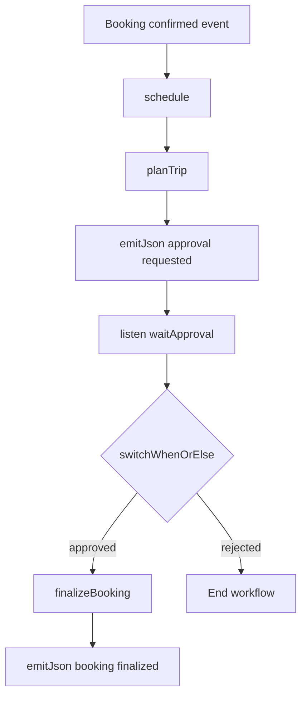
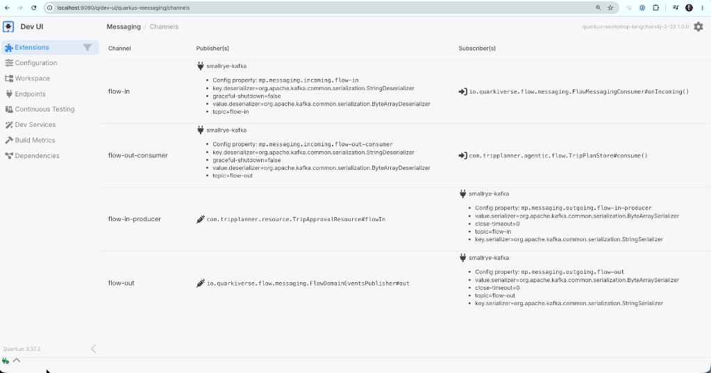
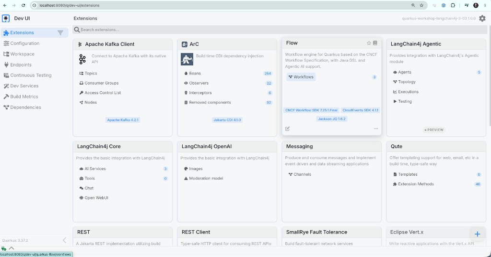
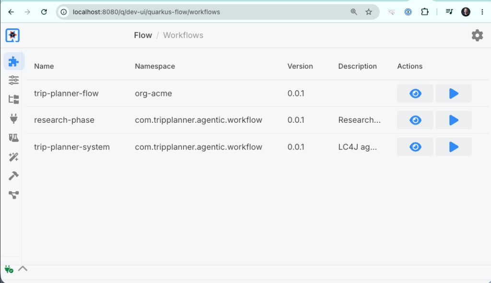
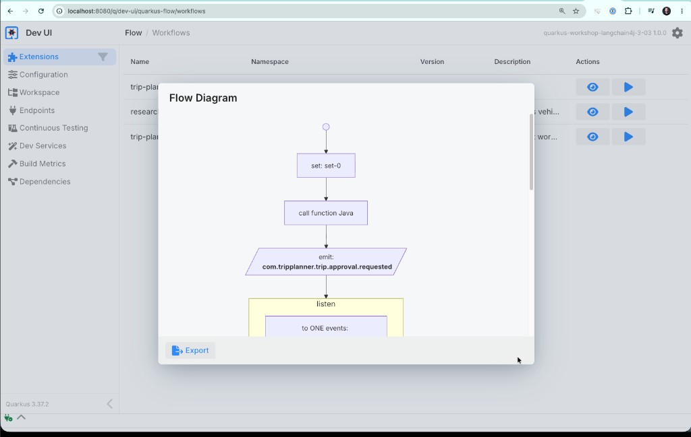
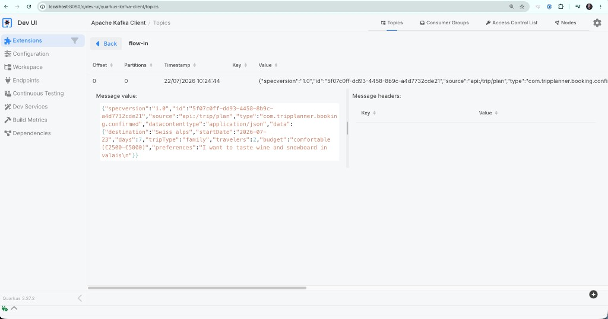
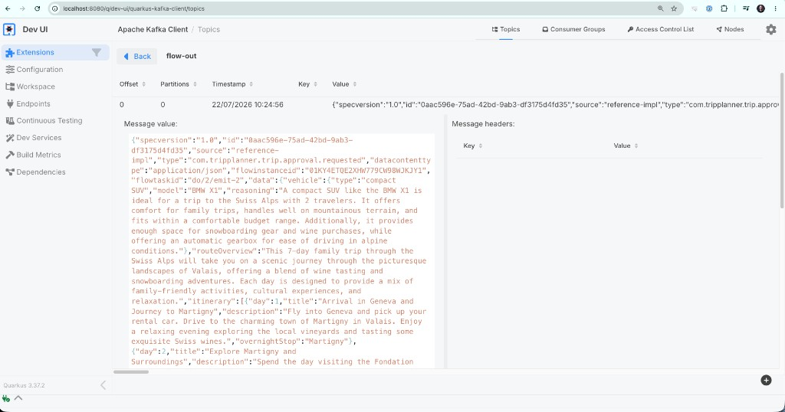

# Step 03 - Event-Driven Workflows with Quarkus Flow

## From REST Calls to Suspendable Workflows

In the previous steps, we saw how the trip planning flow runs as one synchronous call. The request comes in, the agents run, and the response comes back. This works for immediate answers, but real-world workflows often need to pause for a human decision, wait for an external system, or coordinate multiple asynchronous steps, and each of those wait points should be observable and recoverable rather than hidden inside a blocked thread.

[Quarkus Flow](https://quarkiverse.github.io/quarkiverse-docs/quarkus-flow/dev/index.html){target="_blank"} is an event-driven workflow engine where each step emits and consumes [CloudEvents](https://cloudevents.io/){target="_blank"}. The workflow suspends without holding a thread, and any service that receives CloudEvents from e.g. a Kafka topic can see what happened and what the workflow is waiting for.

In this step, you will wire the trip planner through a Quarkus Flow workflow. It will generate a plan, emit an approval request, and suspend. Then, when the user approves or rejects, a second event will resume the same workflow instance.

---

## What Is Quarkus Flow?

Quarkus Flow lets you model long-running, event-driven workflows directly in Java, using the [CNCF Serverless Workflow specification](https://serverlessworkflow.io/){target="_blank"} under the hood. This specification defines a common way to describe workflow concepts such as tasks, events, branching, waiting states, and transitions, without tying them to one particular runtime. In practice, it gives Quarkus Flow a shared vocabulary for workflows while still letting you write them in normal Java code.

The workflow in this step is triggered by a [CloudEvent](https://cloudevents.io/){target="_blank"}, which is a standard open source specification for event envelopes. This means events sent via systems like Kafka, Knative Eventing, or HTTP webhooks can all use the same format with common fields such as type, source, id, and data. Because of this, different tools and services (for example, a microservice listening on a Kafka topic or a cloud function triggered by a webhook) can exchange events easily, without having to invent new event formats for each integration.

The workflow in this step takes a booking event, generates a trip plan, sends that plan out for approval, and then waits for a response. Once an approval or rejection event comes back, the workflow resumes and either finalizes the booking or cancels, depending on the decision. In the code, those stages are expressed with `schedule`, `emitJson`, `listen`, and `switchWhenOrElse`.



!!! note "In-memory state"
    In this step, the workflow state will be kept in memory. This means that if you restart the app while a workflow is waiting for approval, that waiting instance is lost. In Step 04 we will introduce loop-oriented orchestration concepts and  advanced control flow patterns to address this scenario.

---

## Prerequisites

=== "Option 1: Continue from Step 02"

    Stay in the code you've built in the previous step(s) and apply the changes described in this page. You can continue to run Quarkus in Dev Mode.

=== "Option 2: Use the completed Step 03 project"

    ==Open `section-3/step-03` and start dev mode:==

    === "Linux / macOS"
        ```bash
        cd section-3/step-03
        ./mvnw quarkus:dev
        ```

    === "Windows"
        ```cmd
        cd section-3\step-03
        mvnw quarkus:dev
        ```

---

## Dependencies

==Open `section-3/step-02/pom.xml` and add the Quarkus Flow BOM inside `<dependencyManagement>`:==

```xml
<dependency>
    <groupId>io.quarkiverse.flow</groupId>
    <artifactId>quarkus-flow-bom</artifactId>
    <version>${quarkus-flow.version}</version>
    <type>pom</type>
    <scope>import</scope>
</dependency>
```

==Add the version property in `<properties>`:==

```xml
<quarkus-flow.version>0.13.0</quarkus-flow.version>
```

==Add these dependencies to `<dependencies>`:==

```xml
<dependency>
    <groupId>io.quarkiverse.flow</groupId>
    <artifactId>quarkus-flow</artifactId>
</dependency>
<dependency>
    <groupId>io.quarkiverse.flow</groupId>
    <artifactId>quarkus-flow-langchain4j</artifactId>
</dependency>
<dependency>
    <groupId>io.quarkus</groupId>
    <artifactId>quarkus-messaging-kafka</artifactId>
</dependency>
```

---

## Messaging Configuration

==Add this configuration to `application.properties`:==

```properties
# Quarkus Flow messaging bridge
quarkus.flow.messaging.defaults-enabled=true

# Quarkus Flow execution logging
quarkus.log.category."io.quarkiverse.flow".level=DEBUG
quarkus.log.category."io.serverlessworkflow".level=DEBUG

# Kafka channels for Flow events
mp.messaging.incoming.flow-in.connector=smallrye-kafka
mp.messaging.incoming.flow-in.topic=flow-in
mp.messaging.incoming.flow-in.value.deserializer=org.apache.kafka.common.serialization.ByteArrayDeserializer
mp.messaging.incoming.flow-in.key.deserializer=org.apache.kafka.common.serialization.StringDeserializer

mp.messaging.outgoing.flow-out.connector=smallrye-kafka
mp.messaging.outgoing.flow-out.topic=flow-out
mp.messaging.outgoing.flow-out.value.serializer=org.apache.kafka.common.serialization.ByteArraySerializer
mp.messaging.outgoing.flow-out.key.serializer=org.apache.kafka.common.serialization.StringSerializer

mp.messaging.outgoing.flow-in-producer.connector=smallrye-kafka
mp.messaging.outgoing.flow-in-producer.topic=flow-in
mp.messaging.outgoing.flow-in-producer.value.serializer=org.apache.kafka.common.serialization.ByteArraySerializer
mp.messaging.outgoing.flow-in-producer.key.serializer=org.apache.kafka.common.serialization.StringSerializer

mp.messaging.incoming.flow-out-consumer.connector=smallrye-kafka
mp.messaging.incoming.flow-out-consumer.topic=flow-out
mp.messaging.incoming.flow-out-consumer.value.deserializer=org.apache.kafka.common.serialization.ByteArrayDeserializer
mp.messaging.incoming.flow-out-consumer.key.deserializer=org.apache.kafka.common.serialization.StringDeserializer
```

Four channels make up the messaging layer:

| Channel | Direction | Purpose |
|---|---|---|
| `flow-in` | incoming | Quarkus Flow reads events from this topic to start or resume workflows |
| `flow-out` | outgoing | Quarkus Flow publishes workflow events (approval requests, booking confirmations) here |
| `flow-in-producer` | outgoing | The REST endpoint writes to `flow-in` so it can trigger the workflow from application code |
| `flow-out-consumer` | incoming | The application reads `flow-out` so it can capture the plan and confirmation for the UI |

Once the app is running, you can verify the channel wiring in the Dev UI under **Messaging > Channels**:



---

## New Models

The workflow introduces two new records that don't exist in Step 02.

==Create `src/main/java/com/tripplanner/model/TripApproval.java`:==

```java title="TripApproval.java"
--8<-- "../../section-3/step-03/src/main/java/com/tripplanner/model/TripApproval.java"
```

==Create `src/main/java/com/tripplanner/model/BookingConfirmation.java`:==

```java title="BookingConfirmation.java"
--8<-- "../../section-3/step-03/src/main/java/com/tripplanner/model/BookingConfirmation.java"
```

`TripApproval` carries the user's decision (approved or rejected) along with the `instanceId` that ties it back to the right workflow instance. `BookingConfirmation` is what the workflow produces at the end of the approve path.

---

## Supporting Classes

Before writing the workflow itself, you need the classes that connect it to the REST layer and the UI.

### TripPlannerFlowAdapter

This bean bridges `TripRequest` to the existing `TripPlannerSystem.planTrip(...)` method so the workflow can call it as a function. It also handles post-approval booking finalization.

==Create `src/main/java/com/tripplanner/agentic/flow/TripPlannerFlowAdapter.java`:==

```java title="TripPlannerFlowAdapter.java"
--8<-- "../../section-3/step-03/src/main/java/com/tripplanner/agentic/flow/TripPlannerFlowAdapter.java"
```

### TripPlanStore

This bean listens on the `flow-out-consumer` channel and captures workflow events so the REST layer can return results to the UI. It stores plan payloads when the workflow emits an approval request, and booking confirmations after the workflow finalizes.

==Create `src/main/java/com/tripplanner/agentic/flow/TripPlanStore.java`:==

```java title="TripPlanStore.java"
--8<-- "../../section-3/step-03/src/main/java/com/tripplanner/agentic/flow/TripPlanStore.java"
```

### TripApprovalResource

This endpoint turns the UI's approve or reject action into a `com.tripplanner.trip.approval.done` CloudEvent and publishes it to `flow-in`, where the waiting workflow instance picks it up.

==Create `src/main/java/com/tripplanner/resource/TripApprovalResource.java`:==

```java title="TripApprovalResource.java"
--8<-- "../../section-3/step-03/src/main/java/com/tripplanner/resource/TripApprovalResource.java"
```

### TripPlannerResource (modified)

The existing `TripPlannerResource` changes from calling `TripPlannerSystem` directly to publishing a CloudEvent that starts the workflow. It then waits for `TripPlanStore` to receive the plan and returns it, so from the UI's perspective the POST still behaves synchronously.

==Replace the contents of `src/main/java/com/tripplanner/resource/TripPlannerResource.java`:==

```java title="TripPlannerResource.java" hl_lines="28 30-31 36-40 45-46 49-71 74-88"
--8<-- "../../section-3/step-03/src/main/java/com/tripplanner/resource/TripPlannerResource.java"
```

---

## Implementing `TripPlannerFlow`

With the supporting classes in place, you can now write the workflow itself. This is the central piece of this step.

==Create `src/main/java/com/tripplanner/agentic/flow/TripPlannerFlow.java`:==

```java title="TripPlannerFlow.java"
--8<-- "../../section-3/step-03/src/main/java/com/tripplanner/agentic/flow/TripPlannerFlow.java"
```

The workflow reads top to bottom as a sequence of tasks:

1. `schedule` registers a trigger: every time a `com.tripplanner.booking.confirmed` event arrives, a new workflow instance starts.
2. `set(".[0].data")` unwraps the CloudEvent envelope and passes the `TripRequest` payload to the next task.
3. `function("planTrip", ...)` calls the adapter, which runs the full multi-agent pipeline and returns a `TripPlan`.
4. `emitJson` publishes the plan as a `com.tripplanner.trip.approval.requested` event on `flow-out`.
5. `listen("waitApproval", ...)` suspends the workflow. It will resume only when a `com.tripplanner.trip.approval.done` event arrives whose `flowinstanceid` matches this instance.
6. `switchWhenOrElse` inspects the approval status. If approved, execution continues to `finalizeBooking`. Otherwise the workflow ends immediately.
7. `function("finalizeBooking", ...)` generates a `BookingConfirmation`, and the final `emitJson` publishes it as `com.tripplanner.booking.finalized`.

---

## Running and Inspecting

==Start the app in dev mode if it is not already running.==

Open the app at [http://localhost:8080](http://localhost:8080){target="_blank"}.

Open the Dev UI at [http://localhost:8080/q/dev](http://localhost:8080/q/dev){target="_blank"} and notice the new Quarkus Flow and Kafka cards. 



Click **Workflows** in the Flow card to see the three registered workflows: `trip-planner-flow` (the one you wrote), plus `research-phase` and `trip-planner-system` (generated by the LangChain4j Agentic extension for the agent pipeline).



Click the eye icon next to `trip-planner-flow` to open the visual flow diagram. You can see each stage of the workflow rendered as a graph, matching the code you wrote in `TripPlannerFlow.java`:



---

## Try It Out

==Fill in the trip form and click **Generate Trip Plan**.==

The form submits to the REST endpoint, which triggers the workflow and blocks until the plan is ready. While you wait, watch the terminal. The `TraceLoggerExecutionListener` prints a line for every task transition:

```
Task 'set-0' started at ...           pos=do/0/set-0
Task 'set-0' completed at ...
Task 'planTrip' started at ...        pos=do/1/planTrip
Task 'planTrip' completed at ...      output={...}
Task 'emit-2' started at ...          pos=do/2/emit-2
Flow: Publishing on channel flow-out  event={..."type":"com.tripplanner.trip.approval.requested"...}
Task 'emit-2' completed at ...
Task 'waitApproval' started at ...    pos=do/3/waitApproval
```

Notice how the log stops at `waitApproval`. The workflow is now suspended in memory, waiting for an event. No thread is blocked and no CPU is consumed while it waits.

When the workflow reaches the approval wait state, the generated plan appears with two buttons:

- **Approve Trip**
- **Reject Trip**

### Approve path

==Click **Approve Trip**.==

The app sends an approval event with the current `flowinstanceid`. Back in the terminal, the workflow resumes from where it paused:

```
Task 'waitApproval' completed at ...
Task 'switch-4' started at ...       pos=do/4/switch-4
Task 'switch-4' completed at ...
Task 'finalizeBooking' started at ... pos=do/5/finalizeBooking
Task 'finalizeBooking' completed at ...
Task 'emit-6' started at ...         pos=do/6/emit-6
Flow: Publishing on channel flow-out  event={..."type":"com.tripplanner.booking.finalized"...}
Task 'emit-6' completed at ...
Workflow name=trip-planner-flow ...    completed
```

The UI shows a booking reference once the `booking.finalized` event arrives.

### Reject path

==Generate another plan and click **Reject Trip**.==

The workflow resumes from the same wait point and ends without booking finalization. The UI shows a cancellation message.

### Check in Dev UI

Open the Kafka topic browser in the Dev UI under **Apache Kafka Client > Topics**. In the `flow-in` topic, you should see the `com.tripplanner.booking.confirmed` CloudEvent that triggered the workflow, with the full `TripRequest` in its data field:



In the `flow-out` topic, you should see the `com.tripplanner.trip.approval.requested` event containing the generated plan. Notice the `flowinstanceid` extension that correlates the approval back to the right workflow instance:



After approval, `flow-in` will also contain the `com.tripplanner.trip.approval.done` event, and `flow-out` will contain `com.tripplanner.booking.finalized` (approve path only).

In Quarkus Flow instances, you should see each workflow pause at `waitApproval`, then continue after approval or rejection.

---

## Summary

You now have a full event-driven path from UI to workflow. The UI starts the workflow by publishing an event, Flow emits a plan and waits, and the UI decision resumes the same workflow instance. Only approval performs the finalization step.

This is the practical HITL pattern for event-driven orchestration in Quarkus Flow.

In **Step 04**, you will focus on voting and loop-based orchestration patterns.

[Continue to Step 04 - Voting, Loops, and Adaptive Model Selection](step-04.md)
