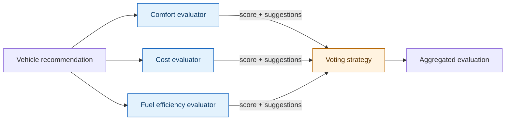
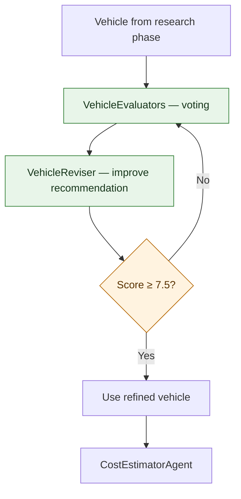
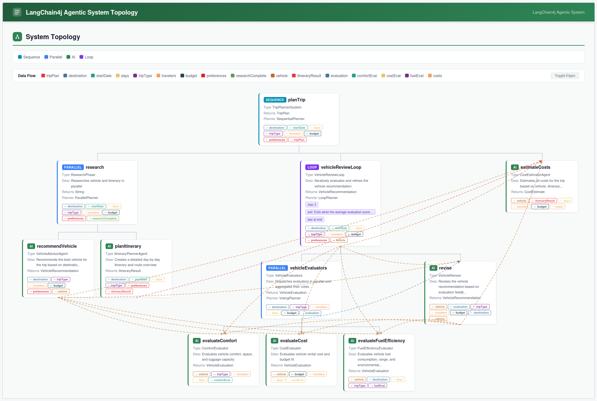
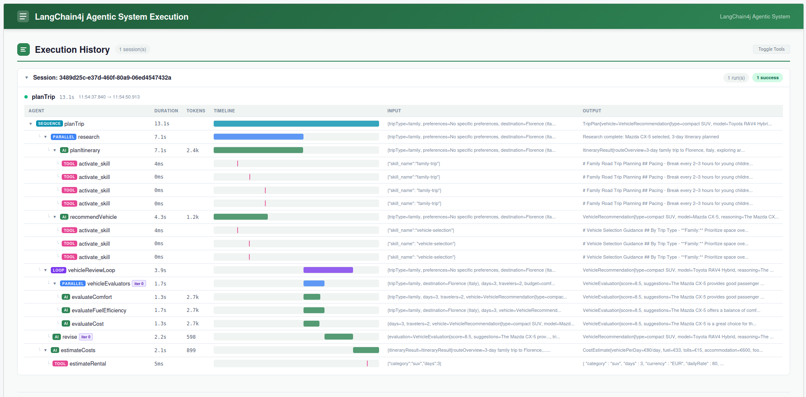

# Step 03 - Voting, Loops, and Adaptive Model Selection

The guardrails from Step 02 catch obviously unsuitable recommendations, like suggesting a sports car for a family of five. They cannot however tell us whether the accepted vehicle is actually the *best* choice. E.g. is it comfortable enough for a long road trip? Does it fit the budget? Is it fuel-efficient for the planned route?

In this step we'll add three evaluator agents that independently assess the vehicle recommendation, aggregate their scores with a custom **voting pattern**, and feed the result into a **refinement loop** that lets a reviser agent improve the recommendation until it meets a quality threshold. We'll also add an **adaptive model selection** so that the reviser starts with a lightweight model and switches to a more capable one as the recommendation improves.

## Parallel assessment with the Voting pattern

The voting pattern dispatches multiple agents in parallel, collects their independent assessments, and aggregates the results into a single decision. Unlike a simple parallel fan-out that merges structured outputs, voting applies a **strategy** to the collected responses, such as averaging scores, taking a majority, or applying any custom aggregation logic.

In production systems, voting is valuable because it distributes responsibility across agents that each have a narrow, well-defined scope. An agent focused entirely on cost will catch cost problems that a general-purpose evaluator might trade away against other concerns. The aggregation step makes those individual judgements visible, which also makes the system's behaviour auditable, since you can inspect each agent's score independently to understand why the overall result came out the way it did.



We'll implement this with a custom `VotingPlanner` that implements the `Planner` interface from LangChain4j. The planner dispatches all evaluator subagents in parallel using `call(subagents)`, then collects their outputs from the workflow scope and passes them to a `VotingStrategy` for aggregation.

## Iterative refinement with @LoopAgent

A single evaluation pass tells us how good the recommendation is, but it doesn't improve it. We need a loop that runs the evaluators, checks whether the score meets our threshold, and if not, asks a reviser agent to improve the recommendation before evaluating again. A numeric score and an explicit exit condition also make quality verifiable, because you can write a test that asserts the system meets a defined standard rather than relying on manual review of every output.



The `@LoopAgent` annotation wraps this cycle with a configurable maximum number of iterations. The `@ExitCondition` checks the aggregated evaluation score at the end of each iteration. If the score reaches 7.5, the loop exits and the refined vehicle moves on to cost estimation.

## Adaptive model selection with @ChatModelSupplier

Not every iteration needs the same model. When the output is still rough, a smaller model can make broad improvements just as effectively as a larger one, at a fraction of the cost. Only once the score is already close to the threshold, and the reviser is making fine adjustments, does a more capable model justify the extra expense. This pattern is particularly relevant in systems that run quality loops at scale, where the cost difference between early and late iterations adds up quickly.

The `@ChatModelSupplier` annotation on the reviser agent delegates model selection to a `DynamicModelSelector` CDI bean. This bean injects both the base model (`gpt-4o-mini`) and an enhanced model (`gpt-4o`) and chooses between them based on the current evaluation score.

| Evaluation score | Model selected | Rationale |
|---|---|---|
| ≤ 6.0 | `gpt-4o-mini` (base) | Broad improvements still needed, so a lighter model suffices |
| > 6.0 | `gpt-4o` (enhanced) | Fine-tuning a near-ready recommendation benefits from more capability |

This pattern is identical to the one used in [Section 2 Step 07](../section-2/step-07.md) for dynamic model selection based on car value.

## Prepare the working copy

As always, you have the option to keep working from the previous step, or work directly with the solution:

=== "Option 1: Continue from Step 02"

    Continue in your Step 02 working copy and apply the changes below. Use the completed Step 03 project for comparison if you get stuck.

=== "Option 2: Use the completed Step 03 project"

    The completed project already contains the changes below. You can read through the implementation without editing, then join the exercise at [Inspecting the voting loop](#inspecting-the-voting-loop).

Start dev mode if it is not already running:

=== "Linux / macOS"
    ```bash
    cd section-3/step-03
    ./mvnw quarkus:dev
    ```

=== "Windows"
    ```cmd
    cd section-3\step-03
    .\mvnw.cmd quarkus:dev
        ```

## Add the vehicle evaluation model

The evaluator agents need a shared return type to represent their assessment.

==Create `src/main/java/com/tripplanner/model/VehicleEvaluation.java`:==

```java title="VehicleEvaluation.java"
--8<-- "../../section-3/step-03/src/main/java/com/tripplanner/model/VehicleEvaluation.java"
```

Each evaluator will return a score between 1 and 10, along with textual suggestions for improvement. The voting strategy will average the scores and concatenate the suggestions.

## Create the evaluator agents

Each evaluator assesses the vehicle recommendation from a different perspective.

==Create `src/main/java/com/tripplanner/agentic/agents/ComfortEvaluator.java`:==

```java title="ComfortEvaluator.java"
--8<-- "../../section-3/step-03/src/main/java/com/tripplanner/agentic/agents/ComfortEvaluator.java"
```

==Create `src/main/java/com/tripplanner/agentic/agents/CostEvaluator.java`:==

```java title="CostEvaluator.java"
--8<-- "../../section-3/step-03/src/main/java/com/tripplanner/agentic/agents/CostEvaluator.java"
```

==Create `src/main/java/com/tripplanner/agentic/agents/FuelEfficiencyEvaluator.java`:==

```java title="FuelEfficiencyEvaluator.java"
--8<-- "../../section-3/step-03/src/main/java/com/tripplanner/agentic/agents/FuelEfficiencyEvaluator.java"
```

- Each evaluator uses `@Agent` with a unique `outputKey` so the voting planner can read their individual results from the workflow scope.
- The evaluators take the current `vehicle` recommendation from the scope, plus trip context parameters for their specific assessment dimension.
- All three return `VehicleEvaluation`, the same record type, so the aggregation strategy can process them uniformly.

## Implement the VotingPlanner

The `VotingPlanner` is a custom `Planner` implementation that dispatches evaluators in parallel and aggregates their results.

==Create `src/main/java/com/tripplanner/agentic/voting/VotingStrategy.java`:==

```java title="VotingStrategy.java"
--8<-- "../../section-3/step-03/src/main/java/com/tripplanner/agentic/voting/VotingStrategy.java"
```

==Create `src/main/java/com/tripplanner/agentic/voting/VotingPlanner.java`:==

```java title="VotingPlanner.java"
--8<-- "../../section-3/step-03/src/main/java/com/tripplanner/agentic/voting/VotingPlanner.java"
```

- `VotingStrategy` is a **functional interface**, so any lambda or method reference that takes a collection of votes and returns an aggregate can serve as the strategy.
- `init()` saves the subagents list from the `InitPlanningContext` for later use.
- `firstAction()` dispatches all evaluator subagents in parallel using `call(subagents)`.
- `nextAction()` reads each evaluator's output from the workflow scope using its `outputKey`, collects them into a list, and passes them to the strategy. The aggregated result is returned via `done(result)`.
- `topology()` returns `PARALLEL` so the Dev UI renders the evaluators as parallel branches.
- Neither `VotingPlanner` nor `VotingStrategy` are library classes — they are custom implementations specific to this application. You can adapt the strategy for any aggregation logic: majority vote, weighted average, or consensus.

## Wire evaluators with @PlannerAgent

The `@PlannerAgent` annotation connects the evaluator subagents to our custom planner through a `@PlannerSupplier` method.

==Create `src/main/java/com/tripplanner/agentic/workflow/VehicleEvaluators.java`:==

```java title="VehicleEvaluators.java"
--8<-- "../../section-3/step-03/src/main/java/com/tripplanner/agentic/workflow/VehicleEvaluators.java"
```

- `@PlannerAgent` lists the three evaluator interfaces as `subAgents` and sets `outputKey = "evaluation"` so the aggregated score is available to the exit condition and reviser.
- `@PlannerSupplier` returns a new `VotingPlanner` instance with the aggregation strategy. The `aggregateVotes` method averages the scores and concatenates non-blank suggestions separated by semicolons.
- The method signature includes the trip context parameters that the individual evaluators need — the framework propagates them through the workflow scope.

## Add the vehicle reviser with @ChatModelSupplier

The reviser agent takes the current recommendation and evaluation feedback and produces an improved recommendation. It uses adaptive model selection to pick the right model for the current quality level.

==Create `src/main/java/com/tripplanner/agentic/agents/DynamicModelSelector.java`:==

```java title="DynamicModelSelector.java"
--8<-- "../../section-3/step-03/src/main/java/com/tripplanner/agentic/agents/DynamicModelSelector.java"
```

==Create `src/main/java/com/tripplanner/agentic/agents/VehicleReviser.java`:==

```java title="VehicleReviser.java"
--8<-- "../../section-3/step-03/src/main/java/com/tripplanner/agentic/agents/VehicleReviser.java"
```

- `DynamicModelSelector` is a `@Singleton` CDI bean that injects both the default `ChatModel` and a named `@ModelName("enhancedModel")` model. The `select()` method compares the evaluation score against a threshold.
- The reviser's `@ChatModelSupplier` static method uses `@CdiBean` to inject the `DynamicModelSelector` and receives the current `VehicleEvaluation` from the workflow scope. This is the same pattern used in [Section 2 Step 07](../section-2/step-07.md).
- The reviser's `outputKey = "vehicle"` overwrites the original vehicle recommendation in the workflow scope. Downstream agents (like the cost estimator) automatically receive the refined version.

## Wrap the review cycle with @LoopAgent

The loop wraps the evaluators and reviser into an iterative cycle with an exit condition.

==Create `src/main/java/com/tripplanner/agentic/workflow/VehicleReviewLoop.java`:==

```java title="VehicleReviewLoop.java"
--8<-- "../../section-3/step-03/src/main/java/com/tripplanner/agentic/workflow/VehicleReviewLoop.java"
```

- `@LoopAgent` lists `VehicleEvaluators` and `VehicleReviser` as subagents. Each iteration runs both: first the evaluators vote, then the reviser refines.
- `maxIterations = 3` prevents runaway loops if the score never reaches the threshold.
- `@ExitCondition(testExitAtLoopEnd = true)` checks the condition after each complete iteration. The `shouldExit` method receives the `VehicleEvaluation` from the scope and returns `true` when the average score reaches 7.5.
- The loop's `outputKey = "vehicle"` means it writes the final refined vehicle back to the scope, overwriting the original from the research phase.

## Update the main workflow

==Open `src/main/java/com/tripplanner/agentic/workflow/TripPlannerSystem.java` and add `VehicleReviewLoop.class` to the `subAgents` array, between `ResearchPhase` and `CostEstimatorAgent`:==

```java hl_lines="5" title="TripPlannerSystem.java"
--8<-- "../../section-3/step-03/src/main/java/com/tripplanner/agentic/workflow/TripPlannerSystem.java"
```

The sequence now runs: parallel research → voting evaluation loop → cost estimation. The `@Output` method is unchanged because it still assembles the final `TripPlan` from `vehicle`, `itineraryResult`, and `costs`. The loop simply refines which vehicle reaches the cost estimator.

## Configure adaptive model selection

==Update `src/main/resources/application.properties` to add the enhanced model configuration:==

```properties title="application.properties"
--8<-- "../../section-3/step-03/src/main/resources/application.properties"
```

- The base model is now `gpt-4o-mini`, which is cost-effective for most agents.
- The `enhancedModel` is configured as a separate named model using `gpt-4o`. The `@ModelName("enhancedModel")` qualifier in `DynamicModelSelector` resolves to this configuration.
- Both models share the same `OPENAI_API_KEY`. The enhanced model has its own temperature and timeout settings.

## Inspecting the voting loop

If the application is not already running, start it from the project directory you chose above:

=== "Linux / macOS"
    ```bash
    ./mvnw quarkus:dev
    ```

=== "Windows"
    ```cmd
    .\mvnw.cmd quarkus:dev
    ```

==Open [http://localhost:8080](http://localhost:8080){target="_blank"} and fill in the form:==

- Destination: `Italian Riviera`
- Start date: a future date
- Duration: `5` days
- Travelers: `4`
- Trip Type: `Family Vacation`
- Budget: `Moderate (€1,000–€2,500)`

==Click **Generate Trip Plan**, wait for it to finish, and look for the evaluation and model selection messages in the terminal.== You should see lines like:

```text
Score 6.3 > 6.0 — switching to enhanced model for final refinement
```

This indicates the `DynamicModelSelector` chose the enhanced model for that iteration's revision. The evaluator scores and the loop iteration count appear in the agentic execution log.

==Open the [Quarkus Dev UI](http://localhost:8080/q/dev-ui){target="_blank"} and select **Topology** on the LangChain4j Agentic card.== The graph shows the full agent structure: the `planTrip` sequence contains the parallel research phase, the `vehicleReviewLoop`, and `estimateCosts`. Inside the loop you can see the `vehicleEvaluators` node, rendered as a parallel fan-out with the three evaluators, and the `vehicleReviser`.



==Switch to **Executions** on the same card and expand the latest run.== The execution trace shows timing for each agent. In the example below, the research phase completed in 7.1 seconds (parallel), the vehicle review loop ran one iteration in 3.9 seconds — the three evaluators scored the initial recommendation at 8.5, 7.5, and 8.5 (average 8.17), the reviser refined the vehicle, and the loop exited because 8.17 ≥ 7.5. The cost estimator then priced the refined vehicle in 1.9 seconds.



==Compare the vehicle recommendation before and after the loop by inspecting the scope values.== The initial recommendation from the research phase should differ from the refined one produced by the reviser.

??? info "Verifying with tests"
    The supplied tests verify the voting aggregation, pipeline assembly, and end-to-end HTTP contract without calling a live model.

    ==Run the Step 03 test suite:==

    === "Linux / macOS"
        ```bash
        ./mvnw test -Dquarkus.http.test-port=0
        ```

    === "Windows"
        ```cmd
        .\mvnw.cmd test -Dquarkus.http.test-port=0
        ```

    **Aggregation test** — `VehicleEvaluationAggregatorTest` verifies the averaging strategy: three scores produce the correct average, blank suggestions are skipped, and an empty vote list returns zero.

    **Pipeline test** — `TripPlanContractTest` checks that the workflow's `subAgents` array includes `VehicleReviewLoop` between `ResearchPhase` and `CostEstimatorAgent`. The scripted model returns high evaluation scores so the loop exits after one iteration, and the HTTP endpoint returns the expected JSON contract.

    **Failure tests** — `TripPlanningFailureTest` and the guardrail tests from Step 02 continue to pass with the added loop. Each scripted model profile includes an `@Alternative` for the `@ModelName("enhancedModel")` model so the `DynamicModelSelector` resolves correctly without a live API key.

## Taking it further

As an optional exercise, try adding a **fourth evaluator** that assesses the vehicle's suitability for the planned route terrain (mountain roads, coastal highways, city driving). Use a different `outputKey` and update the `aggregateVotes` method to handle four votes.

You can also experiment with the exit condition threshold — lowering it to 6.0 makes the loop exit faster, while raising it to 9.0 may consume all three iterations. Add logging inside the `shouldExit` method to observe the score progression across iterations.

For a more advanced experiment, try a **weighted voting strategy** where the comfort evaluator counts double for family trips and the cost evaluator counts double for economy budgets. Pass the trip type into the aggregation to select the weights.

## Troubleshooting

??? warning "The enhanced model is not configured"
    ==Check that `application.properties` has the `quarkus.langchain4j.enhancedModel.*` properties and that `OPENAI_API_KEY` is set.== Both the base and enhanced models use the same API key. If the enhanced model configuration is missing, the `@ModelName("enhancedModel")` injection will fail at startup.

??? warning "The loop always runs all three iterations"
    ==Check the evaluator prompts and the exit condition threshold.== If the evaluators consistently return low scores, the reviser may not improve the recommendation enough. Try lowering the threshold in `VehicleReviewLoop.shouldExit()` or adjusting the evaluator prompts to be more generous. Inspect the evaluation scores in the Dev UI execution view.

??? warning "Tests fail with missing enhancedModel bean"
    ==Check that each test profile's `getEnabledAlternatives()` includes both `ScriptedModel.class` and `ScriptedEnhancedModel.class`.== The `ScriptedEnhancedModel` is an `@Alternative @ModelName("enhancedModel")` bean that delegates to the default scripted model.

??? warning "OPENAI_API_KEY is not set"
    ==Set `OPENAI_API_KEY` in the shell used to start the application, then restart it.== Both models require the same key.

## What's next?

The planning pipeline now evaluates vehicle recommendations through a voting pattern, refines them iteratively, and adapts model selection based on quality. In Step 04, we'll wrap the entire planning pipeline in an event-driven Quarkus Flow workflow with Kafka and CloudEvents so the customer can approve or reject a proposed trip.

[Continue to Step 04 - Event-Driven Workflows with Quarkus Flow](step-04.md)
