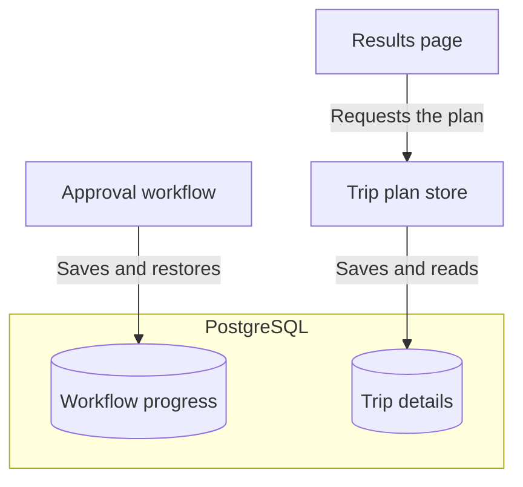
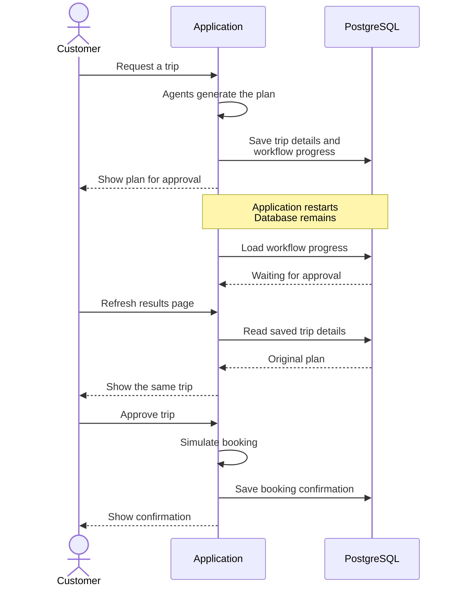
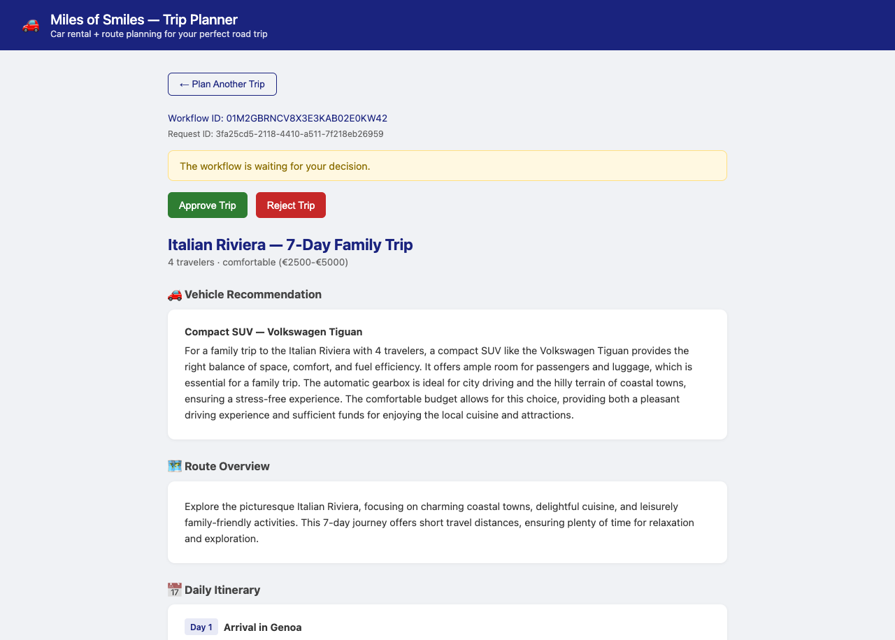

# Step 04 - Resilient Agentic Workflows with Persistence

## Durable workflows with Quarkus Flow persistence

The Miles of Smiles team has been trying out the approval flow from Step 03, and everything works well until the application needs to restart. A customer who was still reading their itinerary comes back to an empty form, with no way to approve the trip they had just generated. Although the agents had finished their work, the plan and its pending approval were only held in memory.

We'll address this by saving enough information for the customer to continue where they left off. Along the way, we'll see how Quarkus Flow restores a waiting workflow and how Hibernate ORM with Panache stores the trip data that the browser needs, using PostgreSQL for both.

The exercise ends with a full application restart while a trip is awaiting approval. When the application is running again, the customer should be able to open the same plan and approve it without asking the agents to generate another one.

### Workflow state and application state

For this to work, the application needs to remember both where it paused and what it was showing the customer. These are saved separately in the same database, so the workflow can continue waiting for approval while the browser retrieves the trip details.



Quarkus Flow handles the workflow side through its persistence extension, while our application uses Panache for the trip records. Neither change requires rewriting the agents or the approval process.

---

## Prerequisites

=== "Option 1: Continue from Step 03"

    ==Stop dev mode in your Step 03 working project and apply the changes below.== Keep your existing model-provider settings and dependencies.

=== "Option 2: Use the completed Step 04 project"

    ==Copy `section-3/step-04` to a working directory and open that copy. Apply your Step 03 model-provider settings, keeping the supplied persistence configuration.== The code changes below are already included. Configure container reuse before starting the application, then join the hands-on route at [Checking persistence without a model](#checking-persistence-without-a-model).

PostgreSQL will run through Dev Services, so a container runtime such as Docker or Podman must be running. The model provider configuration from Step 03 is still needed to generate a plan.

!!! warning "If you used an older Step 04 database"
    ==Stop the application and reset only that disposable workshop database before continuing, removing both the old trip tables and Flow checkpoints by recreating the database.== The old schema and checkpoints are not compatible with this definition. This deletes its saved trips, so do not use a database containing data you need to keep.

---

## Configuring PostgreSQL Dev Services

Quarkus can start PostgreSQL for us through Dev Services, so there is no separate database installation to work through. We do need to add the driver and the Flow persistence extension, then make sure the database is kept when the application stops.

==Open `pom.xml` and add these two dependencies:==

```xml title="pom.xml (new persistence dependencies)"
--8<-- "../../section-3/step-04/pom.xml:81:88"
```

The BOMs already imported in Step 03 manage both dependency versions. The Flow extension also brings in Hibernate ORM with Panache, which we'll use to save the trip plan without adding another dependency.

==Add the following to `src/main/resources/application.properties`:==

```properties title="application.properties (database settings)"
--8<-- "../../section-3/step-04/src/main/resources/application.properties:44:48"
```

With `%dev` set to `update`, Hibernate can create the tables we need without discarding their contents on the next dev-mode startup. Its usual Dev Services setting, `drop-and-create`, would leave us with an empty database every time we restarted. The JSON format setting keeps Hibernate's record serialization independent of the application's REST and CloudEvent mapper customizations. For a production application, an explicitly configured datasource and controlled schema migrations would be a better choice than letting Hibernate update the schema automatically.

### Enabling Testcontainers reuse

Keeping the tables is only useful if the next run connects to the same database. We also need to enable container reuse so that Testcontainers, which Dev Services uses to run PostgreSQL, keeps the database container available across application restarts.

==Choose one of the following ways to enable container reuse before starting or restarting dev mode.==

=== "Bash / Zsh"
    ==Set the variable in the shell you are using to run the app:==
    ```bash
    export TESTCONTAINERS_REUSE_ENABLE=true
    ```

=== "PowerShell"
    ==Set the variable in the shell you are using to run the app:==
    ```powershell
    $env:TESTCONTAINERS_REUSE_ENABLE = "true"
    ```

=== "direnv"
    ==Add this line to `.envrc` in the project directory:==
    ```bash
    export TESTCONTAINERS_REUSE_ENABLE=true
    ```
    ==Run `direnv allow` to activate it.==

=== "~/.testcontainers.properties"
    ==Add this line to `.testcontainers.properties` in your home directory, creating the file if needed:==
    ```properties
    testcontainers.reuse.enable=true
    ```


=== "devbox"
    ==Add the `env` setting to your project's `devbox.json`, preserving any existing packages and settings:==
    ```json
    {
      "packages": [],
      "env": {
        "TESTCONTAINERS_REUSE_ENABLE": "true"
      }
    }
    ```

    ==Enter a `devbox shell` in the project directory.== The environment variable is available inside that shell.

!!! warning "Keep the same database"
    ==Keep the datasource settings unchanged between runs and leave the PostgreSQL container running until the exercise is complete.== If the application starts with a fresh container, the tables will be empty even if the previous run saved its data correctly.

### Isolating test databases with Dev Services

Tests need a clean database, but clearing the one used by dev mode would erase the trip we're trying to restore. Disabling reuse in the test configuration gives the tests disposable PostgreSQL storage separate from the reused development database.

==Update `src/test/resources/application.properties` with the following settings, keeping any other test-specific configuration:==

```properties hl_lines="10-12" title="src/test/resources/application.properties"
--8<-- "../../section-3/step-04/src/test/resources/application.properties"
```

All four messaging channels keep Step 03's in-memory connectors, and Kafka Dev Services stays disabled for tests. PostgreSQL is real, so the tests can check committed data without a Kafka broker or live model. ==Keep test datasource overrides pointed at disposable test storage, never at the development database.== The test schema is dropped and recreated on startup.

---

## Persisting and restoring Quarkus Flow instances

With the database ready, Flow can save a waiting workflow and restore it when the application starts again. The persistence extension handles this without changes to the workflow definition, so the approval process we built in Step 03 remains intact.

==Add the following to `src/main/resources/application.properties`:==

```properties title="application.properties (workflow restoration)"
--8<-- "../../section-3/step-04/src/main/resources/application.properties:49:49"
```

Automatic restoration is already enabled by default, but making the setting explicit helps explain what will happen during the restart exercise. Flow will reload the saved workflow and wait for the customer's decision, rather than generating the trip again.

??? info "Does this also save the agents' working state?"
    The restart exercise begins after the agents have generated the plan, while the workflow is waiting for approval. At that point, restoring the workflow and its completed plan is enough to continue to simulated booking without restoring LangChain4j's shared `AgenticScope`.

    Saving that scope would be a separate feature, with its own serialization and recovery logic. We therefore do not need `AgenticScopeSerializer` or its deserialization-package registration here, and this example does not demonstrate recovery in the middle of an agent's execution.

## Persisting application state with Hibernate ORM and Panache

Flow now knows how to resume the approval process, but the browser still needs a plan to display. In Step 03, the application kept that plan in an in-memory store, so we'll give it a database-backed implementation that can answer the same requests after a restart.

??? info "Why not read the plan back from Kafka?"

    The workflow already publishes the generated plan to Kafka when it requests approval, and Kafka can retain that event after the application stops. However, a consumer normally resumes from its committed offset when it restarts, so it does not automatically reread earlier events to rebuild the application's in-memory store. The [Kafka guide's discussion of commit strategies](https://quarkus.io/guides/kafka#commit-strategies){target="_blank"} explains how those offsets track processing progress.

    The outcome events already contain the original request and plan in the status envelope. We could rebuild a view by replaying retained events, but we would need to manage that replay and preserve the identity and transition checks from Step 03. A compacted topic or a Kafka Streams state store could support such a design.

    Recovering those trip details would not, by itself, restore the workflow waiting for approval, because the event is not a complete workflow checkpoint. Since our Flow persistence extension already uses PostgreSQL for that purpose, storing the trip records in the same database lets us focus on the restart exercise without introducing a second recovery mechanism.

### Defining a Panache entity

Each trip needs a database row that keeps the customer's request and plan available after a restart.

==Create `src/main/java/com/tripplanner/model/TripPlanEntity.java`:==

```java title="TripPlanEntity.java"
--8<-- "../../section-3/step-04/src/main/java/com/tripplanner/model/TripPlanEntity.java"
```

#### What to notice

- `requestId` identifies the trip before Flow starts. The same row gains an `instanceId` when the workflow is created, followed by the plan, accepted decision, and outcome.
- `@JdbcTypeCode(SqlTypes.JSON)` stores the request, plan, confirmation, and decision as JSON while keeping them typed Java fields. The saved request lets the browser restore the form and page header.
- `PanacheEntityBase` provides persistence operations while allowing an explicit ID definition. `allocationSize = 1` avoids reserving separate ID blocks per application instance, preserving the ordering used to find the latest request.

The [Hibernate ORM with Panache guide](https://quarkus.io/guides/hibernate-orm-panache){target="_blank"} has more about entity mapping and queries.

### Adding transactional persistence and queries

The store will continue receiving the same events and returning the same `TripPlanStatus` envelope, including both identifiers and the original request. The edits below move its reads and writes into the database, with changed lines highlighted. The agents, Flow definition, REST resources, and browser need no changes.

==Open `src/main/java/com/tripplanner/agentic/flow/TripPlanStore.java`. Remove the `requests`, `instances`, and `decisions` maps, the `latestRequestId` field, and the `HashMap` and `Map` imports. Update the imports as highlighted below, keeping the logger and injected `ObjectMapper`:==

```java hl_lines="16 21 25-26 30" title="TripPlanStore.java (imports and fields)"
--8<-- "../../section-3/step-04/src/main/java/com/tripplanner/agentic/flow/TripPlanStore.java:3:39"
```

The in-memory implementation used synchronized methods to protect those maps. Database transactions and locks will now protect the records, including when more than one application instance connects to the same database.

==Replace `register()` and `bind()` with the following versions, removing their `synchronized` modifiers:==

```java hl_lines="1-8 11-17 20-21" title="TripPlanStore.java (saving the request before planning)"
--8<-- "../../section-3/step-04/src/main/java/com/tripplanner/agentic/flow/TripPlanStore.java:41:62"
```

`register()` commits the request before the REST resource publishes the planning event. When Flow starts, `bind()` locks that trip's row to check the request and attach its workflow identifier before the agents run. Other trips have separate rows, so they can be planned at the same time.

### Committing outcomes before acknowledging events

An event must not be acknowledged before its database update has committed. Otherwise, a failed commit could lose the plan even though Kafka considers the event processed.

==Add `@Blocking` to `consume()` and the highlighted comment, keeping its event names, dispatch, and exception handling unchanged:==

```java hl_lines="2 20" title="TripPlanStore.java (outcome consumer)"
--8<-- "../../section-3/step-04/src/main/java/com/tripplanner/agentic/flow/TripPlanStore.java:64:85"
```

==Replace the private synchronized `accept()` method with this public transactional version:==

```java hl_lines="1-2 4-8 10 14-18" title="TripPlanStore.java (saving a correlated outcome)"
--8<-- "../../section-3/step-04/src/main/java/com/tripplanner/agentic/flow/TripPlanStore.java:87:105"
```

#### What to notice

- `@Blocking` moves database work off the messaging event loop.
- `@Transactional(REQUIRES_NEW)` commits `accept()` before `message.ack()` acknowledges the event. Quarkus applies the transaction even though the call comes from the same bean.
- The row lock prevents concurrent updates from overwriting each other. Hibernate saves the entity's changes when the transaction commits.
- Only JSON decoding errors are caught as malformed input. Database failures reach the messaging failure handler, so an unsuccessful save is not acknowledged.

`accept()` keeps Step 03's identity and state checks. An old approval event cannot reopen a completed trip, and a final outcome adds its confirmation or error without replacing the plan the customer reviewed.

### Keeping the decision and failure outcome

The workflow checks a decision against the one accepted by the REST resource before resuming. Saving that accepted decision alongside the trip lets this check continue to work after the in-memory maps are gone.

==Replace `submitDecision()` and `matchesDecision()` with these database-backed versions:==

```java hl_lines="1-6 9-14 17-21" title="TripPlanStore.java (persisting the accepted decision)"
--8<-- "../../section-3/step-04/src/main/java/com/tripplanner/agentic/flow/TripPlanStore.java:107:128"
```

Locking the row while accepting a decision ensures that two concurrent submissions cannot both see `awaiting_approval`. The first moves it to `decision_submitted`, and a later submission receives the same conflict response as before. The eventual confirmed, rejected, or failed outcome is still recorded only when it arrives.

==Replace `submissionFailed()` and `onWorkflowFailed()` with the following versions, removing their `synchronized` modifiers and the old map updates and `notifyAll()` call:==

```java hl_lines="1-11 15 18" title="TripPlanStore.java (persisting failures)"
--8<-- "../../section-3/step-04/src/main/java/com/tripplanner/agentic/flow/TripPlanStore.java:130:148"
```

The lifecycle fallback still handles an actual workflow failure when publishing an outcome fails. It now saves the safe error in the database while retaining the original request and any reviewed plan. A late failure cannot overwrite an existing terminal outcome.

### Reading saved trips without holding a transaction open

The planning HTTP request still waits for its own result, but it must not keep a database connection occupied while the agents run. Each status lookup gets a short transaction, with the polling delay outside it.

==Update `awaitPlan()` as highlighted. Remove `synchronized` and replace the map read and `timedWait()` call, without adding a transaction around this method:==

```java hl_lines="1 4 8-9" title="TripPlanStore.java (bounded waiting)"
--8<-- "../../section-3/step-04/src/main/java/com/tripplanner/agentic/flow/TripPlanStore.java:150:160"
```

==Replace `byRequestId()`, `byInstanceId()`, and `latest()`, removing their `synchronized` modifiers, and add `toStatus()`. Keep the existing `error()` helper and the separate `TripPlanStatus` record unchanged:==

```java hl_lines="1-3 6-8 11-14 17-19" title="TripPlanStore.java (queries and response conversion)"
--8<-- "../../section-3/step-04/src/main/java/com/tripplanner/agentic/flow/TripPlanStore.java:162:181"
```

Each lookup runs in a short transaction, leaving `awaitPlan()` free to pause between reads without holding a database connection. The `latest()` query orders by sequence ID, so updating an older trip cannot make it the latest request, even after a restart. `toStatus()` returns the existing response format from the entity's typed fields for the browser to display.

??? info "Complete updated TripPlanStore.java"
    The complete file is included here for comparison with the focused edits above.

    ```java title="TripPlanStore.java"
    --8<-- "../../section-3/step-04/src/main/java/com/tripplanner/agentic/flow/TripPlanStore.java"
    ```

??? info "Does this make database writes and Kafka sends atomic?"
    The database transactions cover only the store operations. Model calls, event publication, and polling delays do not hold those transactions open. A process crash between saving a request or decision and sending its event can still leave a record with no corresponding event. Closing that gap would require a delivery design such as a transactional outbox. The restart exercise checks a saved approval wait with an unchanged workflow definition, not recovery from every possible crash point.

### Updating the persistence tests

The lifecycle assertions from Step 03 still apply, but their store now needs Quarkus injection and a database transaction. Constructing it directly in the old fixture would bypass that setup.

==Open `src/test/java/com/tripplanner/agentic/flow/TripPlanStoreLifecycleTest.java`. Remove `private final TripPlanStore store = new TripPlanStore();`, then add the highlighted imports, annotations, injected field, and database cleanup. Keep the test methods and helpers unchanged:==

```java hl_lines="4-8 17 19-20 24-27" title="TripPlanStoreLifecycleTest.java (persistence-aware fixture)"
--8<-- "../../section-3/step-04/src/test/java/com/tripplanner/agentic/flow/TripPlanStoreLifecycleTest.java:16:42"
```

==Copy `src/test/java/com/tripplanner/agentic/flow/PersistentTripPlanStoreTest.java` from the completed `section-3/step-04` project to the same path in your working copy.== It checks fresh database reads, accepted decisions, terminal outcomes and replay guards, as well as a failed commit that must not acknowledge its event.

==Also copy `src/test/java/com/tripplanner/flow/FlowRestartProbe.java` from Step 04 to the same path. Keep the inherited `TripPlannerFlowTest`, `TripPlanningFailureTest`, guardrail tests, and browser tests unchanged.== The probe is an opt-in check using separate JVMs against a dedicated disposable database. Its [setup and phase commands](https://github.com/quarkusio/quarkus-workshop-langchain4j/tree/main/section-3/step-04#restart-probe){target="_blank"} are available if you want to automate the restart check with a fixed plan instead of a live model.

## Checking persistence without a model

Both starting routes now have the same persistence tests and configuration. ==Run the store and workflow tests from your working project with Docker or Podman running:==

=== "Linux / macOS"
    ```bash
    ./mvnw test "-Dtest=PersistentTripPlanStoreTest,TripPlanStoreLifecycleTest,TripPlannerFlowTest,TripPlanningFailureTest"
    ```

=== "Windows"
    ```cmd
    mvnw.cmd test "-Dtest=PersistentTripPlanStoreTest,TripPlanStoreLifecycleTest,TripPlannerFlowTest,TripPlanningFailureTest"
    ```

The tests check that the original request survives store recreation, that a decision cannot be submitted twice, and that confirmed, rejected, and failed records retain the reviewed plan when late events arrive. They also check request ordering and the transaction boundary before acknowledgement. Reading from another store object establishes database persistence, but a full application restart is still needed to check that Flow restores its waiting execution.

---

## Verifying workflow recovery after a restart

We're ready to try the customer journey that prompted this change, using one trip and leaving it awaiting approval while we restart the application. The agents generate the plan before shutdown, and afterward the application restores what it saved and continues with the customer's decision. The existing results page already displays both identifiers and restores the latest trip, so there is no UI edit to make.



==Keep this trip as the latest request until its restart checks are complete, and avoid submitting trips from other clients during the exercise.== The latest-trip lookup is ordered by registration, but it is application-wide rather than customer-specific.

==Start dev mode from your project directory, in the shell where container reuse is enabled:==

=== "Linux / macOS"
    ```bash
    ./mvnw quarkus:dev
    ```

=== "Windows"
    ```cmd
    mvnw.cmd quarkus:dev
    ```

==Open [http://localhost:8080](http://localhost:8080){target="_blank"} and generate a trip plan with a future start date. Leave it awaiting approval.==

Once the plan is ready, the results page shows the workflow and request identifiers above the approval buttons, just as in Step 03.



==Note both identifiers and inspect [the latest-trip response](http://localhost:8080/trip/plan/latest){target="_blank"} so you can compare the original request and plan after restarting.==

==Open the Quarkus Dev UI at [http://localhost:8080/q/dev](http://localhost:8080/q/dev){target="_blank"} and navigate to **Datasources**. Inspect the `workflow_instance` and `trip_plan_status` tables.==

The workflow table should contain the saved instance, while the trip-plan table should hold the original request and generated plan with status `awaiting_approval`. Both should refer to the workflow identifier shown in the browser, so we can check that the workflow's progress and the customer's trip details have each been saved.

==Select **Workflows** on the Quarkus Flow card and inspect `trip-planner-flow`. Check the task-transition logs for your instance reaching `waitApproval` before stopping the application.== The Flow debug logging from Step 03 remains enabled. ==Keep the workflow definition and configuration unchanged during the restart check.==

!!! warning "Wait for approval before restarting"
    ==Restart only after the trip reports `awaiting_approval`, before submitting its decision.== Stopping during planning or between saving a decision and sending its event can leave a record without a matching event. An interrupted `planning` record also blocks new requests until it is reconciled or the disposable database is reset.

### Resuming a persisted workflow

==Stop the application with Ctrl-C.==

==Start it again:==

=== "Linux / macOS"
    ```bash
    ./mvnw quarkus:dev
    ```

=== "Windows"
    ```cmd
    mvnw.cmd quarkus:dev
    ```

==Check the startup log for `Restoring workflow instance:` and compare its identifier with the one from the results page.== The matching identifier shows that Flow has loaded the saved workflow and is waiting for the customer's decision again.

The log excerpt below illustrates the restoration messages. ==Find your own trip's identifier and confirm it resumes `waitApproval`.==


==Refresh the browser and compare both identifiers, the original request, and the plan with the saved response. Check that no new planning call appears in the logs, then click **Approve Trip**.==

The restored workflow can now process the approval and complete the simulated booking, even though it began in the previous application run. As in Step 03, HTTP 202 reports `decision_submitted`, and the browser waits for a status read reporting `confirmed`. The confirmation should appear alongside the same identifiers, with no need to generate another plan. No vehicle has been reserved.

==Check `trip_plan_status` again in the Dev UI.== Its row should now have status `confirmed` and a booking confirmation in the JSON `confirmation` field, while `request`, `plan`, and `acceptedDecision` remain available.

==Stop and start the application once more, then refresh the browser without generating a new trip.== The same confirmed trip, reviewed plan, and simulated booking reference should return. This checks that the final outcome survives a restart too, rather than only the approval wait.

### Keeping a rejected trip after restart

==Click **Plan Another Trip**, generate a new plan, and note its identifiers. Click **Reject Trip** and wait for `/trip/plan/status` to report `rejected`, then refresh the page.== The rejected banner and reviewed plan should remain visible, with no confirmation or approval buttons.

==Stop and start the application again, then refresh the page and inspect `/trip/plan/latest`.== The same request and workflow identifiers should return with `status: "rejected"`, the original request, and the reviewed plan. Its `confirmation` must remain null, and the database row should retain the accepted rejection. A rejected trip must not return to awaiting approval or produce a `com.tripplanner.booking.finalized` event for that instance.

??? warning "The pending trip did not come back"
    ==Check that container reuse was enabled before the first run and that the same PostgreSQL container is still available. Confirm that dev mode uses `%dev.quarkus.hibernate-orm.schema-management.strategy=update`, not the test configuration's `drop-and-create` setting.== The pending workflow checkpoint and trip row should still exist after the restart. ==If the rows remain but the restore log is missing, check the Flow debug log for startup errors.==

??? info "Trying restoration without a full shutdown"
    ==Press `s` in the dev mode terminal to force a runtime restart without stopping the process.== This keeps the Dev Services container running and lets you try workflow restoration without container reuse. It does not replace the full shutdown-and-restart check above.

### Removing the reused PostgreSQL container

Because we enabled reuse, the database container remains available after the application stops. ==When you no longer need the saved trips, stop the application and identify the workshop's PostgreSQL container before removing it with the commands below.== Removing it also deletes the data used in this exercise.

```bash
docker ps | grep postgres
docker rm -f <container-id>
```

==Use the equivalent commands if you run Podman:==

```bash
podman ps | grep postgres
podman rm -f <container-id>
```

---

The customer can now return to a pending trip after an application restart, but the decision is still limited to approving or rejecting the plan. In Step 05, we'll explore how evaluator agents can review a plan and request another pass when it needs improvement, using voting and refinement loops.

[Continue to Step 05 - Voting, Loops, and Adaptive Model Selection](step-05.md)
