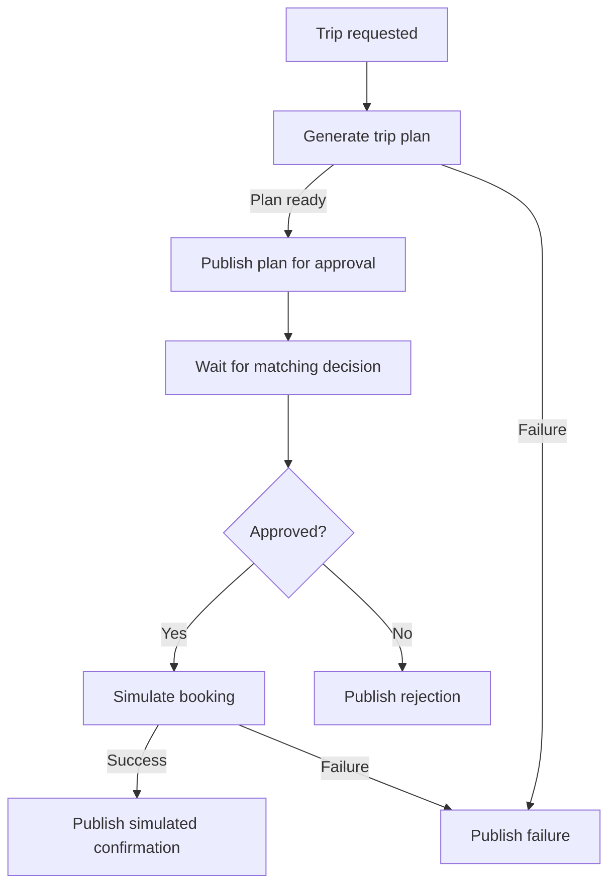
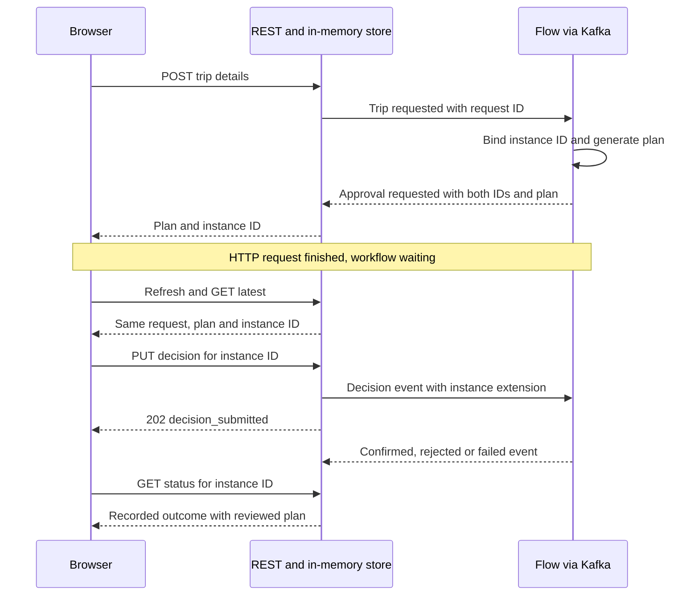
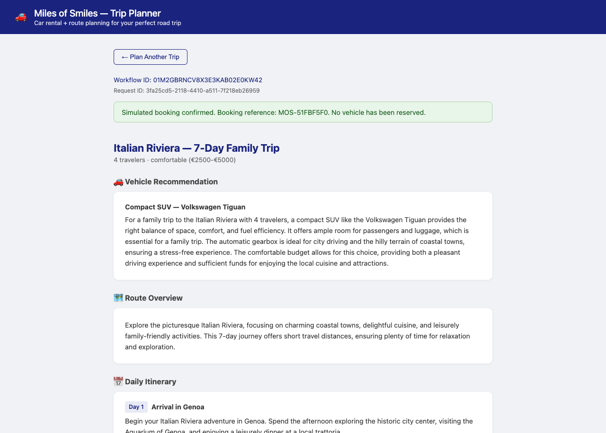
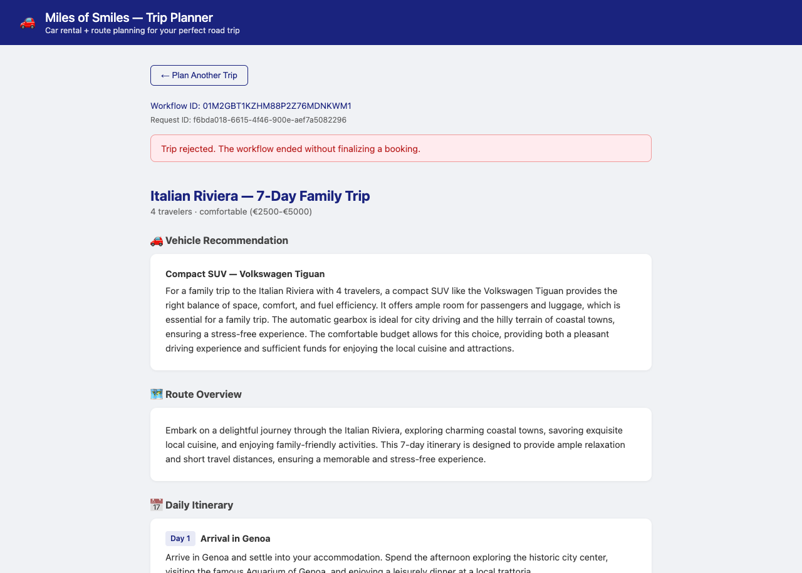

# Step 04 - Event-Driven Agentic Workflows with Quarkus Flow

The trip planner can now generate recommendations and check them before returning a response, but a customer may need time to read the itinerary before agreeing to a booking. Keeping the planning request open while they decide would tie approval to a long-lived HTTP connection.

[Quarkus Flow](https://quarkiverse.github.io/quarkiverse-docs/quarkus-flow/dev/index.html){target="_blank"} lets the workflow pause after generating a plan without holding a thread while the customer decides. Kafka carries the request and decision as [CloudEvents](https://cloudevents.io/){target="_blank"}, so approval can arrive in a separate HTTP request and resume the matching workflow.

By the end of the exercise, the customer can refresh the browser, return to the same pending trip with its original request details, and approve or reject it. Approval produces a simulated booking reference; rejection ends the workflow without booking finalization. No vehicle is reserved, and no inventory or booking service is called.

## Separating planning from the customer decision

The workflow starts when a trip request arrives, runs the existing planning pipeline, and publishes the plan for approval. Its wait matches a decision to the workflow instance that requested it. Failures and rejection also produce events, so the browser can learn the outcome instead of waiting indefinitely for a confirmation that will never arrive.



Quarkus Flow expresses these tasks in Java using the [CNCF Serverless Workflow specification](https://serverlessworkflow.io/){target="_blank"}. CloudEvents supplies the envelope, including `type`, `source`, `id`, and `data`; Kafka transports those events between the application and the workflow.

The initial planning HTTP request still waits for a generated plan or a failure. Once that request finishes, the workflow remains at the approval wait without keeping an HTTP connection open. This separation is the pattern we'll implement here; a fully asynchronous planning API is outside this exercise.

!!! note "Browser refresh is not application recovery"
    Both the workflow and the trip store live in memory. Refreshing the browser while the application remains running restores the saved trip, but restarting the application loses it and its waiting workflow. Kafka event retention does not restore this in-memory state. Step 05 introduces persistence.

## Preparing the working project

Kafka runs through Dev Services, so Docker or Podman must be running for the live exercise. Keep the model-provider configuration from Step 02, including your API key environment variable.

The exercise changes the Flow definition. The frontend, event store, REST resources, payload models, and tests are supplied so we can concentrate on starting, suspending, and resuming a workflow instead of implementing HTTP and browser plumbing.

=== "Option 1: Continue from Step 03 and build the new features hands-on"

    ==Stop dev mode in your Step 03 working copy before updating the dependencies and supplied files.==

    ==Copy `pom.xml` from `section-3/step-04` into your working copy. Keep any local model-provider dependencies you added in Step 02.== This supplies the Flow BOM, Flow messaging and LangChain4j integration, Kafka connector, and test dependencies together with their compatible build configuration. Versions are maintained in that file.

    ==Copy these supplied paths from `section-3/step-04` to the same paths in your working copy, replacing matching files:==

    - `src/main/java/com/tripplanner/` (the retained agents and guardrails, plus the new Flow, store, resources, and models)
    - `src/main/resources/META-INF/resources/` (both `index.html` and `app.js`)
    - `src/main/resources/skills/family-trip/SKILL.md` (the Step 01 baseline with driving-time and break guidance)
    - `src/test/java/com/tripplanner/` (the Flow smoke suite and store lifecycle tests)
    - `src/test/resources/application.properties`
    - `src/test/frontend/`

    The supplied agents retain the completed Step 02 pipeline. Their `days` and `travelers` parameters use `Integer` instead of `String` because the Flow adapter passes numeric values from `TripRequest` directly. The cost agent keeps both parameters, its `@ToolBox(RentalPricingTool.class)` annotation, and its rental-tool instructions. No participant agent refactor is needed.

    ==Remove `src/test/java/com/tripplanner/TripPlannerResourceTest.java` and `src/test/java/com/tripplanner/TripPlanContractTest.java` from this working copy. If you previously copied an older Step 04, also remove `src/test/java/com/tripplanner/flow/MockTripPlannerFlowAdapter.java` and any copied `TripPlanningFailureTest.java`.== The old HTTP tests called a synchronous agent pipeline and expected the old response contract. Step 04 keeps a small Flow smoke suite only; guardrail and pricing-tool coverage stays in Step 02.

    ==Add the messaging configuration below, then open the supplied `TripPlannerFlow.java` and implement its `descriptor()` method using the focused excerpt in the exercise.== Keep the supplied fields and helper methods around it.

=== "Option 2: Use the completed Step 04 project and review the changes"

    ==Copy `section-3/step-04` to a working directory and open that copy.== It supplies the Flow definition and the matching frontend, store, resources, models, and tests. Keep the supplied frontend for this step; the Step 02 frontend expects a bare plan and cannot handle the approval status envelope.

    ==Apply your Step 02 model-provider settings to `src/main/resources/application.properties`, keeping the supplied Flow and Kafka settings.== If you use a different provider extension, keep its dependency as well.

    ==Read the Flow definition and correlation explanation below, then run the same tests and browser verification as the hands-on route.== No frontend implementation is required for either route.

The planning pipeline remains parallel vehicle and itinerary research, followed by cost estimation. The Step 02 pricing tool and input guardrail still provide fictional rental estimates, and its recommendation corrections and audit distinctions remain applicable. These checks do not establish real availability, complete route safety, or a correct final price.

Each planning request has its own identifier and workflow instance, so several trips can be planned or awaiting a decision at once. The refresh exercise still assumes a single workshop user because `/trip/plan/latest` returns the latest trip across the application, without identifying the customer.

### Connecting Flow to Kafka

The supplied POM includes the Flow extensions and Kafka connector:

```xml title="pom.xml (Flow and Kafka dependencies)"
--8<-- "../../section-3/step-04/pom.xml:69:84"
```

The messaging channels carry trip requests to Flow and bring plans and outcomes back to the application.

==For the hands-on route, append the following settings to `src/main/resources/application.properties`, keeping your existing model and skills configuration:==

```properties title="application.properties (Flow and messaging)"
--8<-- "../../section-3/step-04/src/main/resources/application.properties:15:42"
```

The application sends requests and decisions through `flow-in-producer` to the `flow-in` topic, where Flow reads them. Plans and final outcomes travel back through `flow-out` to the application's `flow-out-consumer`, which records them for the browser.

==Keep `%dev.quarkus.live-reload.watched-resources=skills/family-trip/SKILL.md` from Step 01, adding it if your working copy lacks it.== Editing that skill automatically reloads the application. Finish any pending approval exercise before editing code, configuration, or watched skills, because a reload loses this chapter's in-memory trips and workflow waits.

## Starting and resuming the workflow

The supplied adapter calls the same trip-planning pipeline as before. Its booking method only creates a sample reference and a message identifying the result as simulated.

```java title="TripPlannerFlowAdapter.java (adapter methods)"
--8<-- "../../section-3/step-04/src/main/java/com/tripplanner/agentic/flow/TripPlannerFlowAdapter.java:19:34"
```

The workflow will publish the generated plan and wait for the customer's decision before continuing.

==Open `src/main/java/com/tripplanner/agentic/flow/TripPlannerFlow.java`. For the hands-on route, update `descriptor()` to match the following definition. Keep the supplied imports, injections, and the `plan()`, `resolveDecision()`, and `matchesDecision()` helpers unchanged:==

```java title="TripPlannerFlow.java (workflow definition)" hl_lines="4 6-24"
--8<-- "../../section-3/step-04/src/main/java/com/tripplanner/agentic/flow/TripPlannerFlow.java:32:57"
```

### What to notice

- `schedule()` starts a workflow for each `com.tripplanner.trip.requested` event. `withInstanceId()` supplies the workflow identifier so the planning task can attach it to the original request before calling the agents.
- `switchWhenOrElse()` sends planning failures straight to `publishFailure`, skipping approval.
- `emitJson()` publishes the plan for approval, and `listen()` pauses until a matching `com.tripplanner.trip.approval.done` event arrives.
- `.envelope(this::matchesDecision)` checks the event's `flowinstanceid` and the decision accepted by the store. A wrong identifier, mismatched decision, or unreadable payload leaves the workflow waiting.
- The final branch publishes confirmation, rejection, or failure. `END` prevents confirmation and rejection from continuing into another outcome task, and rejection never calls the booking adapter.

??? info "Complete supplied Flow class"
    The complete source includes the imports and injected adapter, store, and `ObjectMapper`, as well as all three helper methods. These are supplied for both participation routes; only the workflow definition is the participant edit.

    ```java title="TripPlannerFlow.java"
    --8<-- "../../section-3/step-04/src/main/java/com/tripplanner/agentic/flow/TripPlannerFlow.java"
    ```

    The supplied `matchesDecision()` helper reads the instance extension and deserializes the decision with the injected mapper before checking the store. It keeps both checks in a single envelope predicate. Adding `dataAs()` after an instance-envelope filter would replace that predicate in this DSL instead of combining the checks.

    Agent exceptions now occur outside the REST call, so the Step 02 exception mapper cannot return them directly. These helpers turn planning or finalization exceptions into a failed status, which the workflow publishes as an event. The error model checks the cause chain for an actual guardrail exception and returns a safe message; unrelated failures are server errors. A finalization failure keeps the plan the customer reviewed.

## Keeping the result attached to its request

There are two identifiers because the HTTP request exists before Flow creates its instance. The REST resource registers a `requestId` and publishes it with the original `TripRequest` in `com.tripplanner.trip.requested`. The workflow then binds the actual `instanceId` to that registered request. Waiting for this explicit request avoids confusing a different trip's result with the one the browser submitted.

The supplied `TripPlanStatus` record carries the trip details and current outcome in both API responses and workflow events.

```java title="TripPlanStatus.java"
--8<-- "../../section-3/step-04/src/main/java/com/tripplanner/model/TripPlanStatus.java"
```

Alongside both identifiers, the record keeps the original `request` and generated `plan` so the browser can restore the trip after a refresh. Its `status` describes the current state, with a `confirmation` for a completed booking or an `error` and `message` for a failure. Calling `failed()` retains any generated plan.

### Checking incoming outcomes

The store checks the event's workflow identifier against the payload, then verifies the registered request and its details before accepting an outcome. It also checks the current state, so an old approval-request event cannot reopen a rejected trip.

An outcome event cannot report its own publication failure. The supplied store therefore also listens for Flow's `WorkflowFailedEvent` through `onWorkflowFailed()`. If execution actually fails, it records a safe failure against that workflow's request and retains any reviewed plan. This fallback does not treat a task notification, suspended workflow, missing event, or HTTP timeout as proof of workflow failure.



The browser displays the workflow identifier so it can be compared with the CloudEvents. After either decision, HTTP 202 means submission was accepted, not that booking or rejection has finished. The page shows `decision_submitted` while it checks `GET /trip/plan/status`; only a backend status of `confirmed`, `rejected`, or `failed` establishes a terminal outcome. This also applies after refreshing a page while a decision is in progress.

### Validation and bounded waits

`PUT /trip/approve` accepts a nonblank `instanceId` and exactly `approved` or `rejected` as the decision's `status`. A missing identifier or invalid decision returns HTTP 400, an unknown trip returns 404, and a trip that is no longer awaiting approval returns 409. This rejects duplicate submissions and decisions for completed trips before publishing an event.

Planning waits up to `trip.planning.timeout`, which defaults to `PT120S`. HTTP 504 with `planning_timeout` means that wait expired, not that the workflow was cancelled or failed. The response retains the request identifier and any bound instance identifier, so status can be checked even if the initial HTTP request timed out. Other trips can continue planning while this workflow waits for an outcome. A timeout leaves its status unchanged until an outcome arrives, event submission fails, or Flow reports an actual workflow failure.

The supplied frontend also bounds status polling and individual network waits. When polling times out or a status request fails, it preserves the reviewed plan and identifiers with an understandable message. It must not label the trip confirmed, rejected, or failed just because polling stopped, or discard the plan because a decision could not be submitted. Refreshing while the application remains running can retrieve a later outcome.

For a planning failure received during the HTTP wait, actual guardrail failures return HTTP 422 `guardrail_violation`; unrelated failures return HTTP 500 `planning_failed`. An unrelated failure during simulated booking uses `finalization_failed`. Status reads return HTTP 200 for a known record even when its `status` is `failed`, so the frontend inspects the envelope rather than treating every successful GET as a successful booking. Messages exclude raw exception details and model output. These are demonstration checks and safe failure reporting, not comprehensive request validation or a production booking protocol.

??? info "Supplied API reference"
    `POST /trip/plan` accepts a `TripRequest` and normally returns HTTP 200 with an `awaiting_approval` envelope. A null request returns 400, overlapping planning returns 409, and planning failures or timeouts use the responses described above.

    `PUT /trip/approve` accepts `TripApproval` and returns HTTP 202 with `decision_submitted`. Both approval and rejection use this endpoint. Event-send failures are recorded as failed statuses; submission acceptance alone does not prove event processing completed.

    `GET /trip/plan/status?instanceId=...` returns one trip's envelope. `requestId=...` can be used before an instance identifier is available. If both are supplied, `instanceId` takes precedence. Missing identifiers return 400; an unknown identifier returns 404.

    `GET /trip/plan/latest` returns the latest registered trip, including its original request and any terminal outcome. It returns HTTP 204 only when no trip is stored. It is used for browser refresh, not for correlating a planning response or choosing an older customer's trip.

## Checking the event boundary without a model

The supplied `TripPlannerFlowTest` mocks the planning adapter and uses the real workflow, store, and REST resources. Its in-memory messaging connectors let the tests relay each event deliberately and check the state before and after consumption. The tests use no Kafka broker or live model.

```properties title="src/test/resources/application.properties"
--8<-- "../../section-3/step-04/src/test/resources/application.properties"
```

==Run the Step 04 test suite from your working project:==

=== "Linux / macOS"
    ```bash
    ./mvnw test
    ```

=== "Windows"
    ```cmd
    mvnw.cmd test
    ```

The default Surefire configuration runs the slim `TripPlannerFlowTest` smoke suite and `TripPlanStoreLifecycleTest` only. Each CI job for a step covers that lesson's additions, so guardrail unit tests remain in Step 02.

The Flow smoke tests check approval through to confirmation, rejection without finalization, and safe HTTP 422/500 responses when the mocked adapter fails during planning. The store lifecycle tests check unrelated instances, nonterminal notifications, workflow failure while awaiting approval, and duplicate failure events.

The supplied browser tests in `src/test/frontend/` exercise status rendering and network failure paths with intercepted API responses. Their setup and command are in the [Step 04 README](https://github.com/quarkusio/quarkus-workshop-langchain4j/tree/main/section-3/step-04#verification){target="_blank"}. These tests do not establish Kafka delivery or live-model output quality.

## Following a trip through the running application

==Start dev mode from your working project with `./mvnw quarkus:dev` (`mvnw.cmd quarkus:dev` on Windows), then open [http://localhost:8080](http://localhost:8080){target="_blank"}.== If another step uses that port, add `-Dquarkus.http.port=8083` and use the corresponding URLs below. Do not run Maven `clean` while dev mode is running.

==Generate a trip with a future start date and note its workflow identifier.== A family trip to the California coast for seven days and four travelers is a useful comparison with the previous chapters.

==Check the browser's Network panel to confirm that `POST /trip/plan` has finished while the page is awaiting approval. Open the Dev UI at [http://localhost:8080/q/dev](http://localhost:8080/q/dev){target="_blank"}, select **Workflows** on the Quarkus Flow card, and inspect `trip-planner-flow`.== Its diagram contains the planning task, approval publication, matching wait, and outcome branches. The task-transition logs can also locate `waitApproval`; the customer decision does not keep the planning HTTP request open.

==Refresh the browser without restarting the application. Compare the restored workflow identifier and plan with the ones you noted, and check the original destination, start date, duration, travelers, budget, and preferences in the restored form or `/trip/plan/latest` response.== The same pending trip should return without another model call. A new identifier would not demonstrate recovery of the same trip.


### Approving the pending trip

==Click **Approve Trip** and follow the status requests in the Network panel.== The decision response is HTTP 202 `decision_submitted`; the page keeps the plan visible while finalization is in progress. A later GET reports `confirmed` with a simulated `MOS-...` booking reference and the message that no vehicle has been reserved.

==In the Dev UI, open **Apache Kafka Client > Topics** and inspect `flow-in`.== The initiating event is `com.tripplanner.trip.requested`, with the planning request identifier and original trip details in its payload. The decision event is `com.tripplanner.trip.approval.done`, with the workflow identifier in its `flowinstanceid` extension and in its decision payload.

==Inspect `flow-out` and compare the `flowinstanceid` on `com.tripplanner.trip.approval.requested` and `com.tripplanner.booking.finalized` with the identifier displayed in the browser.== They should identify the same instance. The approval-request payload contains the status envelope, including the plan and original request, not a bare `TripPlan`.



### Rejecting a different trip

==Generate another trip, note its new workflow identifier, and click **Reject Trip**.== Rejection also passes through `decision_submitted`. It becomes final only after `GET /trip/plan/status` reports `rejected` from the recorded `com.tripplanner.trip.rejected` event.

==Refresh the browser, then inspect this instance's status and events.== The trip must remain rejected instead of returning to awaiting approval. There must be no `com.tripplanner.booking.finalized` event for this instance, and no call to the booking adapter on the rejection path.



### Checking failures without guessing at model behavior

==Use the Flow smoke tests for planning failures, the supplied browser tests for failed responses, network errors, and polling timeouts, and the Step 02 guardrail tests for synchronous pipeline behavior.== A finalization failure produces `com.tripplanner.trip.failed` and retains the reviewed plan. A client timeout leaves the outcome uncertain until a later status read; it is not proof of cancellation.

==During a live run, inspect the cost agent's pricing-tool call in the LangChain4j execution view and compare its category and duration with the request. Recheck the Step 02 correction and guardrail tests before treating the predecessor behavior as carried forward.== Successful event handling does not establish model adherence, real-world price accuracy, or vehicle availability.

## What's next?

The customer can now leave a plan awaiting approval and return after a browser refresh, with a decision event resuming the matching workflow. In Step 05, we'll persist workflow and trip state so the same journey can continue after an application restart.

[Continue to Step 05 - Persistent State with PostgreSQL](step-05.md)
