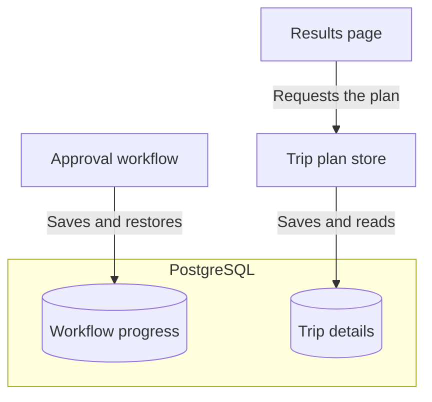

# Step 04 - Resilient Agentic Workflows with Persistence

## Durable workflows with Quarkus Flow persistence

The Miles of Smiles team has been trying out the approval flow from Step 03, and everything works well until the application needs to restart. A customer who was still reading their itinerary comes back to an empty form, with no way to approve the trip they had just generated. Although the agents had finished their work, the plan and its pending approval were only held in memory.

We'll address this by saving enough information for the customer to continue where they left off. Along the way, we'll see how Quarkus Flow restores a waiting workflow and how Hibernate ORM with Panache stores the trip data that the browser needs, using PostgreSQL for both.

The exercise ends with a full application restart while a trip is awaiting approval. When the application is running again, the customer should be able to open the same plan and approve it without asking the agents to generate another one.

### Workflow state and application state

For this to work, the application needs to remember both where it paused and what it was showing the customer. These are saved separately in the same database, so the workflow can continue waiting for approval while the browser retrieves the trip details.



Quarkus Flow handles the workflow side through its persistence extension, while our application uses Panache for the trip records. Neither change requires rewriting the agents or the approval process.

---

## Prerequisites

=== "Option 1: Continue from Step 03"

    ==Continue in your Step 03 working project and apply the changes below.==

=== "Option 2: Use the completed Step 04 project"

    ==Open `section-3/step-04`.== The code changes below are already included. Configure container reuse before starting the application, then follow the verification exercise.

PostgreSQL will run through Dev Services, so a container runtime such as Docker or Podman must be running. The model provider configuration from Step 03 is still needed to generate a plan.

!!! note "Dependency versions"
    The completed Step 04 project currently uses older Quarkus, LangChain4j, and Flow versions than Step 03. Continuing from Step 03 retains its versions; the two starting options are not identical. Consult each project's `pom.xml` when comparing behavior or logs.

---

## Configuring PostgreSQL Dev Services

Quarkus can start PostgreSQL for us through Dev Services, so there is no separate database installation to work through. We do need to add the driver and the Flow persistence extension, then make sure the database is kept when the application stops.

==Open `pom.xml` and add these two dependencies:==

```xml
<dependency>
    <groupId>io.quarkiverse.flow</groupId>
    <artifactId>quarkus-flow-jpa</artifactId>
</dependency>
<dependency>
    <groupId>io.quarkus</groupId>
    <artifactId>quarkus-jdbc-postgresql</artifactId>
</dependency>
```

The BOMs already imported in Step 03 manage both dependency versions. The Flow extension also brings in Hibernate ORM with Panache, which we'll use to save the trip plan without adding another dependency.

==Add the following to `src/main/resources/application.properties`:==

```properties
# Start PostgreSQL through Dev Services
quarkus.datasource.db-kind=postgresql

# Keep existing data when the application starts again
quarkus.hibernate-orm.schema-management.strategy=update
```

With `update`, Hibernate can create the tables we need without discarding their contents on the next startup. Its usual Dev Services setting, `drop-and-create`, would leave us with an empty database every time we restarted. For a production application, controlled schema migrations would be a better choice than letting Hibernate update the schema automatically.

### Enabling Testcontainers reuse

Keeping the tables is only useful if the next run connects to the same database. We also need to enable container reuse so that Testcontainers, which Dev Services uses to run PostgreSQL, keeps the database container available across application restarts.

==Choose one of the following ways to enable container reuse before starting or restarting dev mode.==

=== "Bash / Zsh"
    ==Set the variable in the shell you are using to run the app:==
    ```bash
    export TESTCONTAINERS_REUSE_ENABLE=true
    ```

=== "PowerShell"
    ==Set the variable in the shell you are using to run the app:==
    ```powershell
    $env:TESTCONTAINERS_REUSE_ENABLE = "true"
    ```

=== "direnv"
    ==Add this line to `.envrc` in the project directory:==
    ```bash
    export TESTCONTAINERS_REUSE_ENABLE=true
    ```
    ==Run `direnv allow` to activate it.==

=== "~/.testcontainers.properties"
    ==Add this line to `.testcontainers.properties` in your home directory, creating the file if needed:==
    ```properties
    testcontainers.reuse.enable=true
    ```


=== "devbox"
    ==Add the `env` setting to your project's `devbox.json`, preserving any existing packages and settings:==
    ```json
    {
      "packages": [],
      "env": {
        "TESTCONTAINERS_REUSE_ENABLE": "true"
      }
    }
    ```

    ==Enter a `devbox shell` in the project directory.== The environment variable is available inside that shell.

!!! warning "Keep the same database"
    ==Keep the datasource settings unchanged between runs and leave the PostgreSQL container running until the exercise is complete.== If the application starts with a fresh container, the tables will be empty even if the previous run saved its data correctly.

### Isolating test databases with Dev Services

Tests need a clean database, but clearing the one used by dev mode would erase the trip we're trying to restore. Giving tests their own database configuration keeps the two runs separate, including when Quarkus runs tests during development.

==Update `src/test/resources/application.properties` with the following settings, keeping any other test-specific configuration:==

```properties hl_lines="6-11" title="src/test/resources/application.properties"
quarkus.langchain4j.openai.api-key=${OPENAI_API_KEY:test}

mp.messaging.outgoing.flow-out.connector=smallrye-in-memory
mp.messaging.incoming.flow-out-consumer.connector=smallrye-in-memory

# Keep test data separate from the development database
quarkus.datasource.devservices.db-name=tripplanner_test
quarkus.datasource.devservices.reuse=false

# Start tests with an empty schema
quarkus.hibernate-orm.schema-management.strategy=drop-and-create
```

With a different database name and container reuse disabled for tests, Dev Services starts a separate test container. The existing in-memory messaging configuration stays in place for capturing outgoing events, but the incoming booking and approval channels still use Kafka.

---

## Persisting and restoring Quarkus Flow instances

With the database ready, Flow can save a waiting workflow and restore it when the application starts again. The persistence extension handles this without changes to the workflow definition, so the approval process we built in Step 03 remains intact.

==Add the following to `src/main/resources/application.properties`:==

```properties
# Restore suspended workflows when the application starts
quarkus.flow.persistence.auto-restore=true
```

Automatic restoration is already enabled by default, but making the setting explicit helps explain what will happen during the restart exercise. Flow will reload the saved workflow and wait for the customer's decision, rather than generating the trip again.

??? info "Does this also save the agents' working state?"
    The restart exercise begins after the agents have generated the plan, while the workflow is waiting for approval. At that point, restoring the workflow and its completed plan is enough to continue to booking; it does not require restoring LangChain4j's shared `AgenticScope`.

    Saving that scope would be a separate feature, with its own serialization and recovery logic. We therefore do not need `AgenticScopeSerializer` or its deserialization-package registration here, and this example does not demonstrate recovery in the middle of an agent's execution.

## Persisting application state with Hibernate ORM and Panache

Flow now knows how to resume the approval process, but the browser still needs a plan to display. In Step 03, the application kept that plan in an in-memory store, so we'll give it a database-backed implementation that can answer the same requests after a restart.

??? info "Why not read the plan back from Kafka?"

    The workflow already publishes the generated plan to Kafka when it requests approval, and Kafka can retain that event after the application stops. However, a consumer normally resumes from its committed offset when it restarts, so it does not automatically reread earlier events to rebuild the application's in-memory store. The [Kafka guide's discussion of commit strategies](https://quarkus.io/guides/kafka#commit-strategies){target="_blank"} explains how those offsets track processing progress.

    We could rebuild the store by replaying events, provided those events contained all the necessary trip details and were retained long enough. A compacted topic or a Kafka Streams state store could support that design, but we would still need a way to recover the data and look up a trip's current status for the browser. The current events do not contain everything we save, such as the customer's original request.

    Recovering those trip details would not, by itself, restore the workflow waiting for approval, because the event is not a complete workflow checkpoint. Since our Flow persistence extension already uses PostgreSQL for that purpose, storing the trip records in the same database lets us focus on the restart exercise without introducing a second recovery mechanism.

### Defining a Panache entity

==Create `src/main/java/com/tripplanner/model/TripPlanEntity.java`:==

```java title="TripPlanEntity.java"
--8<-- "../../section-3/step-04/src/main/java/com/tripplanner/model/TripPlanEntity.java"
```

Each row holds one trip's details and approval status, linked to the workflow that created it. Panache supplies the database ID and common persistence operations, leaving us to define the information we want to keep.

We store the plan and confirmation as JSON because the application reads them as complete documents; it does not need to query individual itinerary entries. Keeping the original request alongside them also allows the browser to restore the destination and trip details in its page header. For more about mapping entities and querying them, see the [Hibernate ORM with Panache guide](https://quarkus.io/guides/hibernate-orm-panache){target="_blank"}.

### Adding transactional persistence and queries

The store will continue receiving the same events and answering the same browser requests, so most of the surrounding application can stay unchanged. The edits below move its reads and writes into the database, with the changed lines highlighted in each excerpt.

==Open `src/main/java/com/tripplanner/agentic/flow/TripPlanStore.java`. Remove the `plansByInstanceId` and `latestInstanceId` fields, along with the unused `ConcurrentHashMap`, `ConcurrentMap`, and `AtomicReference` imports, then update the imports and injected fields as shown:==

```java hl_lines="4-6 10 21-22" title="TripPlanStore.java (imports and fields)"
--8<-- "../../section-3/step-04/src/main/java/com/tripplanner/agentic/flow/TripPlanStore.java:8:29"
```

The added request context gives the store access to the customer's original trip details when it saves the plan. Database writes also need a transaction, which we can place around the existing event consumer without changing how it dispatches messages.

==Add `@Transactional` above `consume()`, keeping the method body unchanged:==

```java hl_lines="2" title="TripPlanStore.java (consumer declaration)"
--8<-- "../../section-3/step-04/src/main/java/com/tripplanner/agentic/flow/TripPlanStore.java:31:33"
```

==Update `handleApprovalRequested()` and `handleBookingFinalized()` with the highlighted changes:==

```java hl_lines="4-15 24-28" title="TripPlanStore.java (saving the plan and confirmation)"
--8<-- "../../section-3/step-04/src/main/java/com/tripplanner/agentic/flow/TripPlanStore.java:83:114"
```

When the plan is ready for approval, the store now saves it together with the original request. Once booking finishes, it adds the confirmation to the same record, so the browser can retrieve the outcome even after the in-memory objects are gone. Calling `persist()` saves a new entity, while Hibernate tracks changes to an entity already loaded in the transaction and writes them when the transaction is flushed.

==Update `latest()` and `byInstanceId()` to read from the database, leaving `awaitNextPlan()` unchanged:==

```java hl_lines="1 3-4" title="TripPlanStore.java (finding a pending plan)"
--8<-- "../../section-3/step-04/src/main/java/com/tripplanner/agentic/flow/TripPlanStore.java:50:54"
```

```java hl_lines="1 3-4" title="TripPlanStore.java (finding a particular trip)"
--8<-- "../../section-3/step-04/src/main/java/com/tripplanner/agentic/flow/TripPlanStore.java:77:81"
```

These queries return database entities, but the browser still expects the trip records it received in Step 03. A conversion method will read the saved JSON and assemble that response, now including the original request so the page header can be restored too.

==Add `toStatus()` and update the `TripPlanStatus` record at the end of the class:==

```java hl_lines="1-13 15" title="TripPlanStore.java (building the response)"
--8<-- "../../section-3/step-04/src/main/java/com/tripplanner/agentic/flow/TripPlanStore.java:116:131"
```

??? info "Complete updated TripPlanStore.java"
    The complete file is included here for comparison, with all additions and changes from Step 03 highlighted.

    ```java hl_lines="11-13 17 28-29 32 50 52-53 77 79-80 86-97 106-110 116-128 130" title="TripPlanStore.java"
    --8<-- "../../section-3/step-04/src/main/java/com/tripplanner/agentic/flow/TripPlanStore.java"
    ```

---

## Displaying restored state and workflow identifiers

The browser already checks for a pending trip when the page loads, so saving the plan in the database is enough for it to reappear after a restart. We'll also display the workflow's identifier below the approval buttons, which gives us a way to check that we're continuing the original trip rather than creating a new one.

==Open `src/main/resources/META-INF/resources/app.js`. In `renderPlan()`, add the following after the `actions` declaration:==

```javascript
const instanceIdBar = currentInstanceId ? `
    <div class="instance-id-bar">Workflow instance: <span>${currentInstanceId}</span></div>` : "";
```

==In the same function, insert `${instanceIdBar}` immediately after `${actions}` in the results HTML template:==

```html hl_lines="3"
        ${banner}
        ${actions}
        ${instanceIdBar}
        <div class="plan-header">
```

==Add these rules to the `<style>` block in `src/main/resources/META-INF/resources/index.html`:==

```css
.instance-id-bar { margin-bottom: 1.5rem; padding: 0.5rem 0.75rem; background: #f5f5f5; border-radius: 6px; font-size: 0.78rem; color: #888; }
.instance-id-bar span { font-family: monospace; color: #555; word-break: break-all; }
```

The identifier remains visible after approval, allowing us to follow the same workflow through to the booking confirmation without further changes to the browser's restore logic.

---

## Verifying workflow recovery after a restart

We're ready to try the customer journey that prompted this change, using one trip and leaving it awaiting approval while we restart the application. The agents generate the plan before shutdown; afterward, the application restores what it saved and continues with the customer's decision.


==Use one pending trip for this exercise and approve it after the restart. Do not submit requests from other clients while working through the check.== Rejection ends the workflow but does not update the saved plan's status, so a rejected trip can reappear after a page refresh.

??? info "Why use only one pending trip?"
    The sample looks up a pending plan without filtering by customer or sorting the results, and it shares one request context across the application. Supporting several customers at once would require customer-specific lookups and request data associated with each workflow.

==Start dev mode from your project directory, in the shell where container reuse is enabled:==

=== "Linux / macOS"
    ```bash
    ./mvnw quarkus:dev
    ```

=== "Windows"
    ```cmd
    mvnw quarkus:dev
    ```

==Open [http://localhost:8080](http://localhost:8080){target="_blank"} and generate a trip plan using the form. Leave it awaiting approval.==

Once the plan is ready, the results page should show its workflow identifier below the approval buttons, as in the example below.


==Note the workflow identifier so you can compare it with the restored trip after restarting.==

==Open the Quarkus Dev UI at [http://localhost:8080/q/dev](http://localhost:8080/q/dev){target="_blank"} and navigate to **Datasources**. Inspect the `workflow_instance` and `trip_plan_status` tables.==

The workflow table should contain the saved instance, while the trip-plan table should hold the generated plan with status `awaiting_approval`. Both should refer to the identifier shown in the browser, so we can check that the workflow's progress and the customer's trip details have each been saved. The Flow execution view should show that the instance has reached `waitApproval`.

??? tip "More detail in the Flow logs"
    ==Add this to `application.properties` if you need more detail in the Flow logs:==
    ```properties
    quarkus.log.category."io.quarkiverse.flow".level=DEBUG
    ```

### Resuming a persisted workflow

==Stop the application with Ctrl-C.==

==Start it again:==

=== "Linux / macOS"
    ```bash
    ./mvnw quarkus:dev
    ```

=== "Windows"
    ```cmd
    mvnw quarkus:dev
    ```

==Check the startup log for `Restoring workflow instance:` and compare its identifier with the one from the results page.== The matching identifier shows that Flow has loaded the saved workflow and is waiting for the customer's decision again.


This capture contains two saved instances. Each is logged as `PENDING` during restoration and then enters `waitApproval`; the relevant check is that the identifier from your trip appears and resumes that wait.

==Refresh the browser, check that the same plan and workflow identifier appear, then click **Approve Trip**.==

The restored workflow can now process the approval and complete the booking, even though it began in the previous application run. The confirmation should appear alongside the same identifier, with no need to generate another plan.


==Check `trip_plan_status` again in the Dev UI.== Its row should now have status `confirmed` and a booking confirmation in `confirmationJson`, recording the outcome of the restored workflow.

??? warning "The pending trip did not come back"
    ==Check that container reuse was enabled before the first run and that the same PostgreSQL container is still available. Confirm that the application uses `schema-management.strategy=update`, not the test configuration's `drop-and-create` setting.== Both tables should still contain their rows after the restart. ==If the rows remain but the restore log is missing, enable Flow debug logging and check the startup log for errors.==

??? info "Trying restoration without a full shutdown"
    ==Press `s` in the dev mode terminal to force a runtime restart without stopping the process.== This keeps the Dev Services container running and lets you try workflow restoration without container reuse. It does not replace the full shutdown-and-restart check above.

### Removing the reused PostgreSQL container

Because we enabled reuse, the database container remains available after the application stops. ==When you no longer need the saved trips, stop the application and identify the workshop's PostgreSQL container before removing it with the commands below.== Removing it also deletes the data used in this exercise.

```bash
docker ps | grep postgres
docker rm -f <container-id>
```

==Use the equivalent commands if you run Podman:==

```bash
podman ps | grep postgres
podman rm -f <container-id>
```

---

The customer can now return to a pending trip after an application restart, but the decision is still limited to approving or rejecting the plan. In Step 05, we'll explore how evaluator agents can review a plan and request another pass when it needs improvement, using voting and refinement loops.

[Continue to Step 05 - Voting, Loops, and Adaptive Model Selection](step-05.md)
