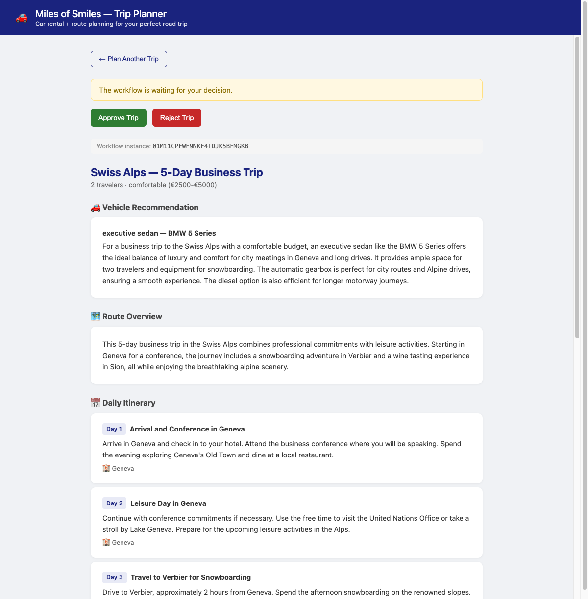
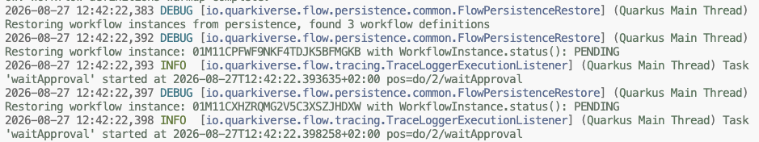
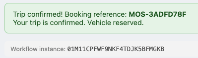

# Step 04 - Resilient Agentic Workflows with Persistence

## Workflows That Survive a Restart

The Miles of Smiles team tested out the new features, but found a rather big issue: when the app restarts, all workflows in progress are lost. They want us to make sure plans in progress are persisted so users don't end up having to start over in case the application gets rescheduled or scaled up or down.

Indeed, step 03 ended with `TripPlannerFlow` potentially suspended at a `listen()` task, waiting for the user to approve or reject. This state lives entirely in memory, so stopping the application loses the pending workflow instance with no log or error.

This step adds PostgreSQL-backed persistence to both the workflow engine and the plan store. `quarkus-flow-jpa` makes Quarkus Flow write every workflow instance to the database when it suspends and restore it at startup. `TripPlanStore` is converted from an in-memory map to a Panache entity, so the generated plan also survives the restart. 

When you restart the app with a plan awaiting approval, the browser restores directly to the results page. The workflow instance ID shown below the approval buttons is the same ID that appears in the startup log alongside `Restoring workflow instance:`.

---

## Prerequisites

=== "Option 1: Continue from Step 03"

    Stay in the code you built in Step 03 and apply the changes described below.

=== "Option 2: Use the completed Step 04 project"

    ==Open `section-3/step-04` and start dev mode:==

    === "Linux / macOS"
        ```bash
        cd section-3/step-04
        ./mvnw quarkus:dev
        ```

    === "Windows"
        ```cmd
        cd section-3\step-04
        mvnw quarkus:dev
        ```

---

## Dependencies

==Open `pom.xml` and add these two dependencies:==

```xml
<dependency>
    <groupId>io.quarkiverse.flow</groupId>
    <artifactId>quarkus-flow-jpa</artifactId>
</dependency>
<dependency>
    <groupId>io.quarkus</groupId>
    <artifactId>quarkus-jdbc-postgresql</artifactId>
</dependency>
```

`quarkus-flow-jpa` is already governed by the `quarkus-flow-bom` you imported in Step 03, so no version property is needed. It transitively brings `quarkus-hibernate-orm-panache`, which means you can use Panache in your own entities later without adding a third dependency.

---

## Configuration

==Add the following to `src/main/resources/application.properties`:==

```properties
# Database configuration
quarkus.datasource.db-kind=postgresql

# Use 'update' to preserve Flow instance rows across restarts.
# The default under Dev Services is 'drop-and-create', which would wipe
# persisted workflow state on every boot and make restore impossible.
quarkus.hibernate-orm.schema-management.strategy=update

# Quarkus Flow persistence - auto-restore suspended workflows after restart.
# true is the default; shown here because the property is worth knowing.
quarkus.flow.persistence.auto-restore=true
```

The schema strategy is the one property you must get right. Under Dev Services, Hibernate defaults to `drop-and-create`, which destroys all tables on every start. Setting it to `update` preserves the rows that hold your suspended workflow state.

### Container reuse

For the restart demo to work, the PostgreSQL container started by Dev Services must survive the application restart. Testcontainers supports this through a reuse flag that's set as an environment variable.

The project ships `devbox.json` and `.envrc` that set the flag automatically if you use devbox or direnv:

=== "devbox"
    The `devbox.json` in `section-3/step-04/` already contains:
    ```json
    {
      "packages": [],
      "env": {
        "TESTCONTAINERS_REUSE_ENABLE": "true"
      }
    }
    ```

=== "direnv"
    The `.envrc` in `section-3/step-04/` already contains:
    ```bash
    export TESTCONTAINERS_REUSE_ENABLE=true
    ```
    Run `direnv allow` once to activate it.

=== "Manual (no devbox/direnv)"
    Set the variable in your shell before starting the app:
    ```bash
    export TESTCONTAINERS_REUSE_ENABLE=true
    ./mvnw quarkus:dev
    ```

=== "~/.testcontainers.properties"
    Add this line to `~/.testcontainers.properties` (create the file if it does not exist):
    ```properties
    testcontainers.reuse.enable=true
    ```

!!! warning "Silent failure"
    If the environment variable is not set, Testcontainers will likely start a new container on every launch and the previous container's data will be gone without any error being emitted. In this case, your workflow will be lost.

### Test isolation

With container reuse enabled, tests could latch onto the same container dev mode is using. ==Create `src/test/resources/application.properties` to keep test runs isolated:==

```properties title="src/test/resources/application.properties"
quarkus.langchain4j.openai.api-key=${OPENAI_API_KEY:test}

mp.messaging.outgoing.flow-out.connector=smallrye-in-memory
mp.messaging.incoming.flow-out-consumer.connector=smallrye-in-memory

# Use a distinct database name so test runs get a separate container from the
# developer's reused dev container, preventing tests from corrupting persisted data.
quarkus.datasource.devservices.db-name=tripplanner_test
quarkus.datasource.devservices.reuse=false

# Drop and recreate the schema for every test run to ensure a clean state.
quarkus.hibernate-orm.schema-management.strategy=drop-and-create
```

The `db-name` override causes Dev Services to start a separate PostgreSQL container for tests. The `smallrye-in-memory` connector replaces Kafka during tests so no broker is required.

---

## Workflow instance ID in the UI

The `/trip/plan` endpoint already returns the `instanceId` in its response body. Step 03 uses it internally to correlate approval events. Step 04 surfaces it on the results page so you have something concrete to match against the startup log after a restart.

`renderPlan` in `app.js` builds a small bar below the approval buttons when an instance ID is available:

```javascript
const instanceIdBar = currentInstanceId ? `
    <div class="instance-id-bar">Workflow instance: <span>${currentInstanceId}</span></div>` : "";
```

Steps 00–03 share the same `app.js` scaffolding and the bar renders as empty for them since `currentInstanceId` is only set when the `/trip/plan` response contains an `instanceId`.

---

## Verifying persistence

==Start the app, then submit a trip plan using the form.==

Once the plan generates, the results page shows the workflow instance ID below the Approve and Reject buttons:



==Note that ID. You will use it to confirm the restore after restarting.==

Open the Quarkus Dev UI at [http://localhost:8080/q/dev](http://localhost:8080/q/dev){target="_blank"} and navigate to **Datasources**. The `workflow_instance` table should have one row with status `WAITING`.

!!! tip "Flow debug logging"
    To see detailed flow execution messages, add this to `application.properties`:
    ```properties
    quarkus.log.category."io.quarkiverse.flow".level=DEBUG
    ```

---

## Restarting and restoring

==Stop the application with Ctrl-C.==

==Start it again:==

=== "Linux / macOS"
    ```bash
    ./mvnw quarkus:dev
    ```

=== "Windows"
    ```cmd
    mvnw quarkus:dev
    ```

Watch the startup log. With persistence active and the container still running, Flow restores each suspended instance and resumes it at `waitApproval`:



The instance ID in the log matches the one you noted from the UI. The workflow has been loaded back from the database and is again waiting at the `listen()` task, ready to receive an approval event.

==Refresh the browser and click **Approve Trip**.==

The same workflow instance receives the approval event, transitions out of `listen()`, and completes the booking. The results page shows the confirmation and the same instance ID you noted before the restart:



If the `Restoring workflow instance:` log line does not appear, the most likely cause is that the environment variable was not set and the container was replaced on restart. See the container reuse section above and the cleanup note below.

!!! note "Live reload as a fallback"
    If you cannot set the environment variable but still want to observe restore, make a trivial change to any Java file and save it, or simply press 's' in your terminal. Quarkus restarts the runtime without stopping the container, so the workflow is restored from the existing database.

### Cleanup

Reused containers persist after the workshop session ends. If you want a clean slate, remove the lingering container:

```bash
docker ps | grep postgres
docker rm -f <container-id>
```

Or with Podman:

```bash
podman ps | grep postgres
podman rm -f <container-id>
```

---


### Workflow refinement loops

The approval step in this workflow is binary; You either approve or reject. A more realistic flow would loop back in case of a rejection and ask the agents to refine the plan before presenting it again. Step 05 introduces this pattern, with parallel evaluator agents that vote on plan quality and a loop that retries refinement until the evaluators agree or a maximum iteration limit is reached.

[Continue to Step 05 - Voting, Loops, and Adaptive Model Selection](step-05.md)
