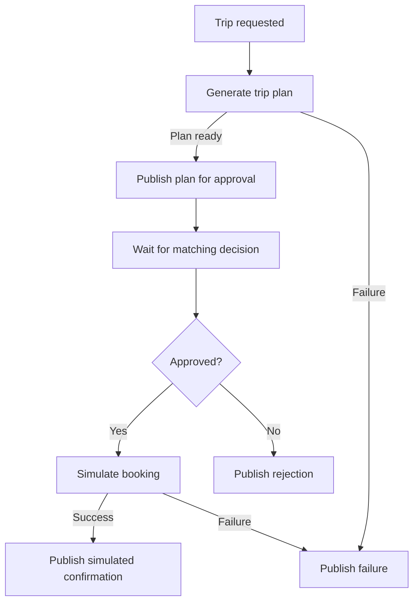
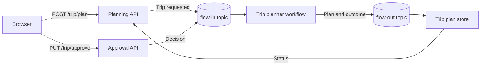
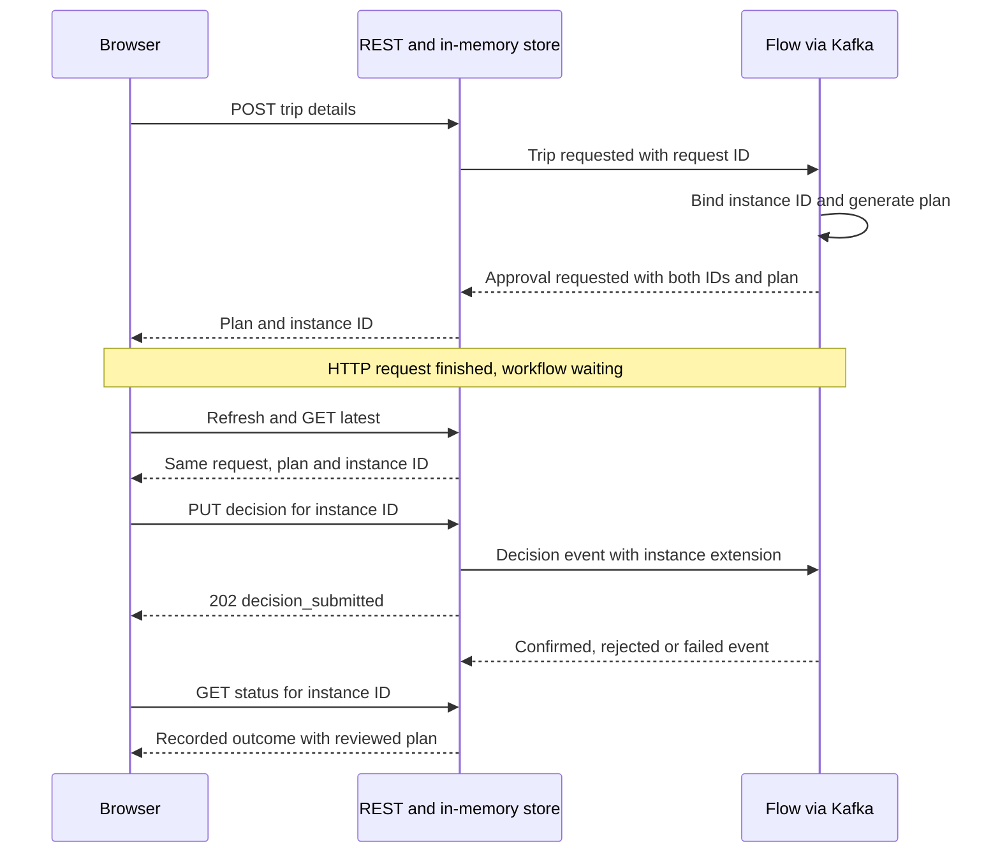

# Step 04 - Event-Driven Agentic Workflows with Quarkus Flow

The trip planner can now generate recommendations and check them before returning a response, but a customer may need time to read the itinerary before agreeing to a booking. Keeping the planning request open while they decide would tie approval to a long-lived HTTP connection. (Miles of Smiles management did suggest a 30-second countdown timer to "encourage decisiveness". It was vetoed.)

[Quarkus Flow](https://quarkiverse.github.io/quarkiverse-docs/quarkus-flow/dev/index.html){target="_blank"} lets the workflow pause after generating a plan and release its thread while the customer decides. It uses Kafka to carry the request and decision as [CloudEvents](https://cloudevents.io/){target="_blank"}, so approval can arrive in a separate HTTP request and resume the matching workflow.

By the end of the exercise, the customer can refresh the browser, return to the same pending trip with its original request details, and approve or reject it.

## Keeping track of in-flight workflows

When a customer creates a trip, the workflow runs the same planning pipeline as before, but this time it publishes the plan as a CloudEvent onto a Kafka topic, and then waits for the customer to make up their mind. It might be a minute or it might be after lunch. When the decision comes in, it picks up the workflow from where it left off (making sure to continue the right customer's workflow) and finalizes the trip and returns the confirmation to the customer.


```mermaid
flowchart TD
    request[Trip requested] --> planning[Generate trip plan]
    planning -->|Plan ready| publish[Publish plan for approval]
    planning -->|Failure| failed[Publish failure]
    publish --> wait[Wait for matching decision]
    wait --> decision{Approved?}
    decision -->|Yes| booking[Simulate booking]
    decision -->|No| rejected[Publish rejection]
    booking -->|Success| confirmed[Publish simulated confirmation]
    booking -->|Failure| failed
```

CloudEvents supplies the envelope, including `type`, `source`, `id`, and `data`, and Kafka transports those events between the application and the workflow.

## Starting from the Step 04 project

This chapter starts from the completed Step 04 project instead of your Step 03 working copy. Moving from a synchronous REST call to an event-driven workflow touches the build, the configuration, both REST resources, and several new classes, and most of those changes are wiring that carries events between the REST API and the workflow. Starting from the finished project lets us concentrate on how Flow starts, pauses, and resumes a trip, while the rest of this page walks through every change so you know how the project differs from the one you built in Step 03.

Kafka runs through Dev Services, so a container runtime such as Docker or Podman must be running for this and the following chapters.

==Copy `section-3/step-04` to a working directory outside the step folders and open that copy in your IDE.== All paths and commands below refer to this working copy.

==If you configured a different model provider in an earlier step, apply the same settings to `src/main/resources/application.properties` and add the provider's extension to `pom.xml`.== The rest of the configuration, including the skills directory and the Flow and Kafka channels, is already in place.

The agents, guardrails, skill, and browser page are the same as in Step 03. Vehicle and itinerary research still run in parallel, the evaluators vote on the vehicle, and cost estimation follows with the Step 02 pricing tool and guardrails. What changes is how a request reaches that pipeline and how its result gets back to the customer.


```mermaid
flowchart LR
    browser[Browser] -->|"POST /trip/plan"| planApi[Planning API]
    browser -->|"PUT /trip/approve"| approvalApi[Approval API]
    planApi -->|Trip requested| flowIn[(flow-in topic)]
    approvalApi -->|Decision| flowIn
    flowIn --> workflow[Trip planner workflow]
    workflow -->|Plan and outcome| flowOut[(flow-out topic)]
    flowOut --> store[Trip plan store]
    store -->|Status| planApi
```

The planning API is the existing `TripPlannerResource`, and the approval API is the new `TripApprovalResource`. The workflow is defined in `TripPlannerFlow`, and `TripPlanStore` keeps track of each trip while its workflow runs. The sections below follow a trip through these classes in the order it reaches them.

## Connecting Flow to Kafka

The build adds Quarkus Flow, its messaging and LangChain4j integrations, and the Kafka connector. Flow versions come from the Flow BOM, which is imported next to the Quarkus BOM.

```xml title="pom.xml (Flow BOM)"
--8<-- "../../section-3/step-04/pom.xml:38:44"
```

```xml title="pom.xml (Flow and Kafka dependencies)"
--8<-- "../../section-3/step-04/pom.xml:73:88"
```

The messaging channels carry trip requests and decisions to Flow and bring plans and outcomes back to the application.

```properties title="application.properties (Flow and messaging)"
--8<-- "../../section-3/step-04/src/main/resources/application.properties:18:41"
```

The application sends requests and decisions through `flow-in-producer` to the `flow-in` topic, where Flow reads them. Plans and final outcomes travel back through `flow-out` to the application's `flow-out-consumer`, which records them for the browser.

The `%dev.quarkus.live-reload.watched-resources` entry from Step 01 is still there. A reload loses this chapter's in-memory trips, so finish any pending approval before editing code, configuration, or the skill.

## Sending the trip request as an event

In Step 03, `planTrip()` called `TripPlannerSystem` directly and returned the `TripPlan` once the agents had finished. It now registers the request with the store, publishes it as a CloudEvent, and waits for the workflow to report back.

```java title="TripPlannerResource.java (planTrip)" hl_lines="4-10 12 20"
--8<-- "../../section-3/step-04/src/main/java/com/tripplanner/resource/TripPlannerResource.java:43:75"
```

- `register()` gives the request a `requestId` before any workflow exists, and the CloudEvent uses it as its `id`.
- The event type `com.tripplanner.trip.requested` is the type the workflow is scheduled on, so every POST starts a new workflow instance.
- The emitter writes to `flow-in-producer`. If Kafka refuses the message, the nack handler marks the trip as failed, and the waiting planning request returns that failure.
- `awaitPlan()` holds the HTTP request until the store records a plan or a failure, for at most `trip.planning.timeout`.

The request still waits for the plan, because the customer needs it on screen, but it returns as soon as the workflow pauses for approval. Its response body is now a `TripPlanStatus`, which wraps the plan together with the workflow identifiers. The resource also has two new endpoints. `GET /trip/plan/status` looks up a trip by either identifier, and `GET /trip/plan/latest` returns the most recent trip, which is how the browser restores a pending trip after a refresh. The browser page didn't need to change, because it already detects which kind of response the API returns.

## Starting and resuming the workflow

The pipeline call that used to live in `planTrip()` has moved to `TripPlannerFlowAdapter`, which the workflow calls. Its booking method only creates a sample reference and a message identifying the result as simulated.

```java title="TripPlannerFlowAdapter.java (adapter methods)"
--8<-- "../../section-3/step-04/src/main/java/com/tripplanner/agentic/flow/TripPlannerFlowAdapter.java:19:34"
```

The workflow publishes the generated plan and waits for the customer's decision before continuing.

==Open `src/main/java/com/tripplanner/agentic/flow/TripPlannerFlow.java` and find the `descriptor()` method:==

```java title="TripPlannerFlow.java (workflow definition)"
--8<-- "../../section-3/step-04/src/main/java/com/tripplanner/agentic/flow/TripPlannerFlow.java:32:57"
```

The definition reads top to bottom, one call per stage of the trip:

- `schedule()` starts a new workflow instance for every `com.tripplanner.trip.requested` event.
- `withInstanceId()` hands the instance identifier to the planning task, so it can tie the workflow to the original request.
- `switchWhenOrElse()` sends a failed plan straight to `publishFailure` and skips approval.
- `emitJson()` publishes the plan as `com.tripplanner.trip.approval.requested`.
- `listen()` pauses the workflow until a `com.tripplanner.trip.approval.done` event arrives. Its `.envelope(this::matchesDecision)` filter ignores an event with the wrong `flowinstanceid`, a mismatched decision, or an unreadable payload, and the workflow keeps waiting.
- `switchCase()` publishes the confirmation, rejection, or failure. `END` stops each outcome from running into the next one.

A rejection goes straight to `publishRejection` and ends the workflow, so only an approved trip reaches the booking adapter. Every planning request starts its own workflow instance, and several trips can wait for a decision at the same time.

The three helper methods below `descriptor()` are the tasks the workflow runs. `plan()` binds the instance to its request in the store before calling the adapter, `resolveDecision()` checks the decision and finalizes the booking, and `matchesDecision()` is the `listen()` filter.

??? info "Complete Flow class"
    The complete source includes the imports, the injected adapter, store, and `ObjectMapper`, and all three helper methods.

    ```java title="TripPlannerFlow.java"
    --8<-- "../../section-3/step-04/src/main/java/com/tripplanner/agentic/flow/TripPlannerFlow.java"
    ```

    The `matchesDecision()` helper reads the instance extension and deserializes the decision with the injected mapper before checking the store. It keeps both checks in a single envelope predicate. Adding `dataAs()` after an instance-envelope filter would replace that predicate in this DSL instead of combining the checks.

## Handling failures outside the REST call

The agents now run on a workflow thread after the planning request has handed its event to Kafka, so a guardrail exception is thrown inside the workflow. The Step 02 `GuardrailExceptionMapper` handles exceptions thrown by REST calls, and this step removes it.

Instead, `plan()` and `resolveDecision()` catch planning and finalization exceptions and turn them into a failed `TripPlanStatus`, which the workflow publishes as `com.tripplanner.trip.failed`. The new `TripError.from()` method builds that status. It walks the cause chain for an actual guardrail exception and returns a safe message, while other failures become server errors. A finalization failure keeps the plan the customer reviewed. When the planning request picks up a failed status, it uses the same error to choose the HTTP code, so a guardrail violation still reaches the browser as a 422.

## Keeping the result attached to its request

There are two identifiers because the HTTP request exists before Flow creates its instance. The REST resource registers a `requestId` and publishes it with the original `TripRequest` in `com.tripplanner.trip.requested`. The workflow then binds its own `instanceId` to that request, so every result the browser receives carries the identifiers of its own trip.

The `TripPlanStatus` record carries the trip details and current outcome in both API responses and workflow events.

```java title="TripPlanStatus.java"
--8<-- "../../section-3/step-04/src/main/java/com/tripplanner/model/TripPlanStatus.java"
```

Along with both identifiers, the record carries:

- `request` and `plan`, the original trip details and the generated plan, which let the browser restore the trip after a refresh.
- `status`, the current state.
- `confirmation` once booking completes, or `error` and `message` when something fails.

Two helpers change it. `failed()` keeps any plan that was already generated, and `withError()` attaches an error code and message and keeps the current state, which the REST resource uses when it stops waiting for a slow plan.

`TripPlanStore` keeps every trip in memory. It maps each `requestId` to the trip's current status and each workflow `instanceId` back to its `requestId`. It also holds the decision submitted for each waiting instance and remembers the most recent request for `/trip/plan/latest`.

```java title="TripPlanStore.java (in-memory state)"
--8<-- "../../section-3/step-04/src/main/java/com/tripplanner/agentic/flow/TripPlanStore.java:30:46"
```

`register()` creates the entry when the planning request arrives, and `bind()` links the Flow instance to it when the workflow's `plan()` task starts.

The workflow's events come back to the store on `flow-out-consumer`. Each event type published by an `emitJson()` task maps to a trip state, and the `flowinstanceid` extension, which Flow adds to every event it publishes, says which instance sent it.

```java title="TripPlanStore.java (outcome consumer)"
--8<-- "../../section-3/step-04/src/main/java/com/tripplanner/agentic/flow/TripPlanStore.java:62:81"
```

The store checks every incoming event before recording it. `accept()` makes sure the workflow identifier matches a registered request and that the trip is in the right state, so a stale approval request for a rejected trip is ignored and the trip stays rejected. Once an outcome is accepted, the store wakes the `awaitPlan()` call in the waiting planning request. A workflow that fails while publishing its outcome has no event to send, so the store also implements Flow's `WorkflowExecutionListener` and handles `WorkflowFailedEvent` in `onWorkflowFailed()` as well. When a workflow really fails, the store records a safe failure for that request and keeps any plan the customer already reviewed.

## Resuming with the customer's decision

The approval endpoint is new in this step. `TripApprovalResource` accepts `PUT /trip/approve` with the workflow's `instanceId` and a status of `approved` or `rejected`. It first asks the store to record the decision, which accepts it only for a trip that is waiting for a decision, and then publishes the decision for Flow.

```java title="TripApprovalResource.java (publishing the decision)" hl_lines="6 8"
--8<-- "../../section-3/step-04/src/main/java/com/tripplanner/resource/TripApprovalResource.java:46:66"
```

The event type `com.tripplanner.trip.approval.done` is the one the workflow's `listen()` step waits for. The `flowinstanceid` extension names the instance the customer is deciding on, and `matchesDecision()` compares it with the waiting workflow, so each decision resumes the workflow it was made for. The endpoint answers with HTTP 202 as soon as the event is sent, because the workflow finishes the booking afterwards.


```mermaid
sequenceDiagram
    participant Browser
    participant API as REST and in-memory store
    participant Flow as Flow via Kafka
    Browser->>API: POST trip details
    API->>Flow: Trip requested with request ID
    Flow->>Flow: Bind instance ID and generate plan
    Flow-->>API: Approval requested with both IDs and plan
    API-->>Browser: Plan and instance ID
    Note over Browser,Flow: HTTP request finished, workflow waiting
    Browser->>API: Refresh and GET latest
    API-->>Browser: Same request, plan and instance ID
    Browser->>API: PUT decision for instance ID
    API->>Flow: Decision event with instance extension
    API-->>Browser: 202 decision_submitted
    Flow-->>API: Confirmed, rejected or failed event
    Browser->>API: GET status for instance ID
    API-->>Browser: Recorded outcome with reviewed plan
```

The browser shows the workflow identifier so you can compare it with the CloudEvents later. After a decision, HTTP 202 only means the submission was accepted. The page shows `decision_submitted` and keeps polling `GET /trip/plan/status` until the backend reports `confirmed`, `rejected`, or `failed`.

??? info "Validation, timeouts, and error responses"
    `PUT /trip/approve` needs a nonblank `instanceId` and a `status` of `approved` or `rejected`. An invalid decision returns HTTP 400, an unknown trip 404, and a trip in any other state 409, so only decisions for a trip awaiting approval reach Kafka.

    Planning waits up to `trip.planning.timeout` (`PT120S` by default). An HTTP 504 `planning_timeout` means the HTTP wait expired while the workflow keeps running, and the status can be checked later with the returned identifiers. Guardrail failures return 422 `guardrail_violation`, other planning failures 500 `planning_failed`, and failures during the simulated booking `finalization_failed`.

## Testing the event flow with a mocked adapter

This step's test suite covers the event flow. The contract and voting tests stay in Step 03, where the synchronous response and the voting loop are introduced. `TripPlannerFlowTest` mocks the planning adapter and uses the real workflow, store, and REST resources. The test profile swaps the Kafka channels for SmallRye in-memory connectors, which let the tests relay each event deliberately and check the state before and after consumption. For this, the POM adds Mockito and the in-memory connector as test dependencies, along with Awaitility so the tests can wait for state that changes asynchronously.

```properties title="src/test/resources/application.properties"
--8<-- "../../section-3/step-04/src/test/resources/application.properties"
```

==Run the Step 04 test suite from your working copy:==

=== "Linux / macOS"
    ```bash
    ./mvnw test
    ```

=== "Windows"
    ```cmd
    .\mvnw.cmd test
    ```

This runs two test classes:

- `TripPlannerFlowTest` follows an approval through to confirmation, checks that rejection skips the booking, and checks the 422 and 500 responses when the mocked adapter fails.
- `TripPlanStoreLifecycleTest` covers unrelated instances, a workflow failing while it waits for approval, and duplicate failure events.

The browser tests in `src/test/frontend/` are described in the [Step 04 README](https://github.com/quarkusio/quarkus-workshop-langchain4j/tree/main/section-3/step-04#verification){target="_blank"}.

## Following a trip through the running application

==Start dev mode from your working copy with `./mvnw quarkus:dev` (`.\mvnw.cmd quarkus:dev` on Windows), then open [http://localhost:8080](http://localhost:8080){target="_blank"}.==

==Generate a trip with a future start date and note its workflow identifier.== A family trip to the California coast for seven days and four travelers is a useful comparison with the previous chapters.

==Check the browser's Network panel to confirm that `POST /trip/plan` has finished while the page is awaiting approval. Open the Dev UI at [http://localhost:8080/q/dev](http://localhost:8080/q/dev){target="_blank"}, select **Workflows** on the Quarkus Flow card, and inspect `trip-planner-flow`.== Its diagram has the planning task, the approval publication, the wait, and the outcome branches.

<figure markdown="span">
  { width="600" }
</figure>

The first switch sends a failed plan straight to `publishFailure`. The `waitApproval` node is the `listen()` step, where the instance sits until a matching decision arrives.

==Refresh the browser without restarting the application. Compare the restored workflow identifier and plan with the ones you noted, and check the original destination, start date, duration, travelers, budget, and preferences in the restored form or `/trip/plan/latest` response.== The same pending trip should come back from the store, with the plan the agents already generated.


### Approving the pending trip

==Click **Approve Trip** and follow the status requests in the Network panel.== The decision response is HTTP 202 `decision_submitted`, and the plan stays visible while the booking is finalized. A later GET reports `confirmed` with a simulated `MOS-...` booking reference. The booking is simulated, much to the disappointment of the sales team, who were hoping to see real reservations.

==In the Dev UI, open **Apache Kafka Client > Topics** and inspect `flow-in`.== The initiating event is `com.tripplanner.trip.requested`, with the planning request identifier and original trip details in its payload. The decision event is `com.tripplanner.trip.approval.done`, with the workflow identifier in its `ce_flowinstanceid` header and in its decision payload.

==Inspect `flow-out` and click each message to open its value and headers. Compare the `ce_flowinstanceid` header on `com.tripplanner.trip.approval.requested` and `com.tripplanner.booking.finalized` with the identifier displayed in the browser.== Kafka carries the CloudEvent attributes as `ce_` headers, so the `flowinstanceid` extension shows up as `ce_flowinstanceid`. Both events should name the same instance. The payload is the status envelope with the plan and original request, and `ce_flowtaskid` tells you which workflow task published it.


### Rejecting a different trip

==Generate another trip, note its new workflow identifier, and click **Reject Trip**.== Rejection also passes through `decision_submitted`. It becomes final only after `GET /trip/plan/status` reports `rejected` from the recorded `com.tripplanner.trip.rejected` event.

==Refresh the browser, then inspect this instance's status and events.== The trip should stay rejected, and this instance's events should end with `com.tripplanner.trip.rejected`.


## What's next?

The customer can now leave a plan awaiting approval and return after a browser refresh, with a decision event resuming the matching workflow. In Step 05, we'll persist workflow and trip state so the same journey can continue after an application restart.

[Continue to Step 05 - Resilient Agentic Workflows with Persistence](step-05.md)
