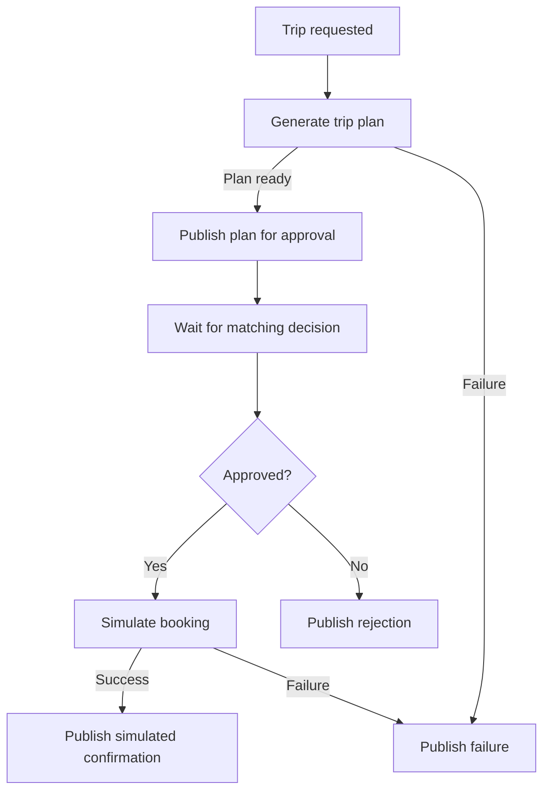
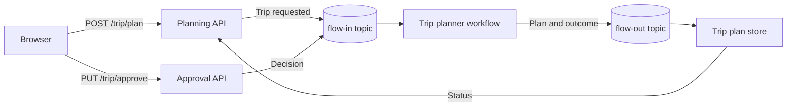
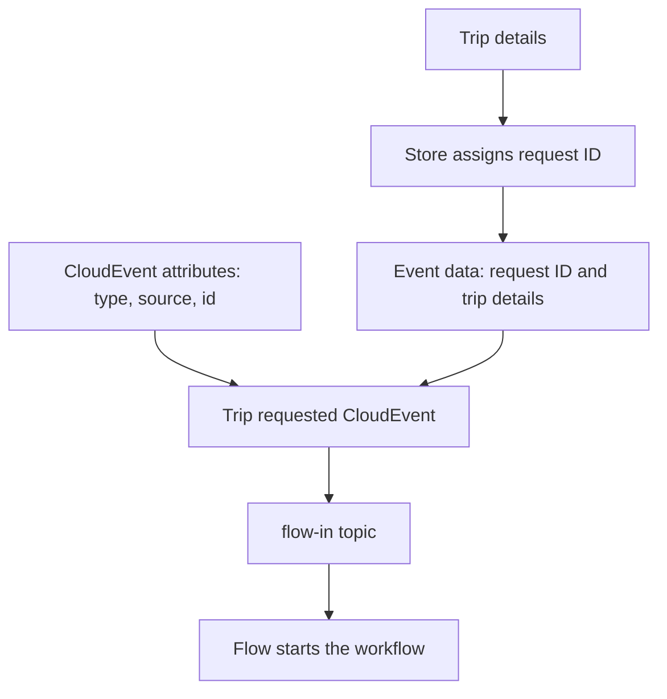
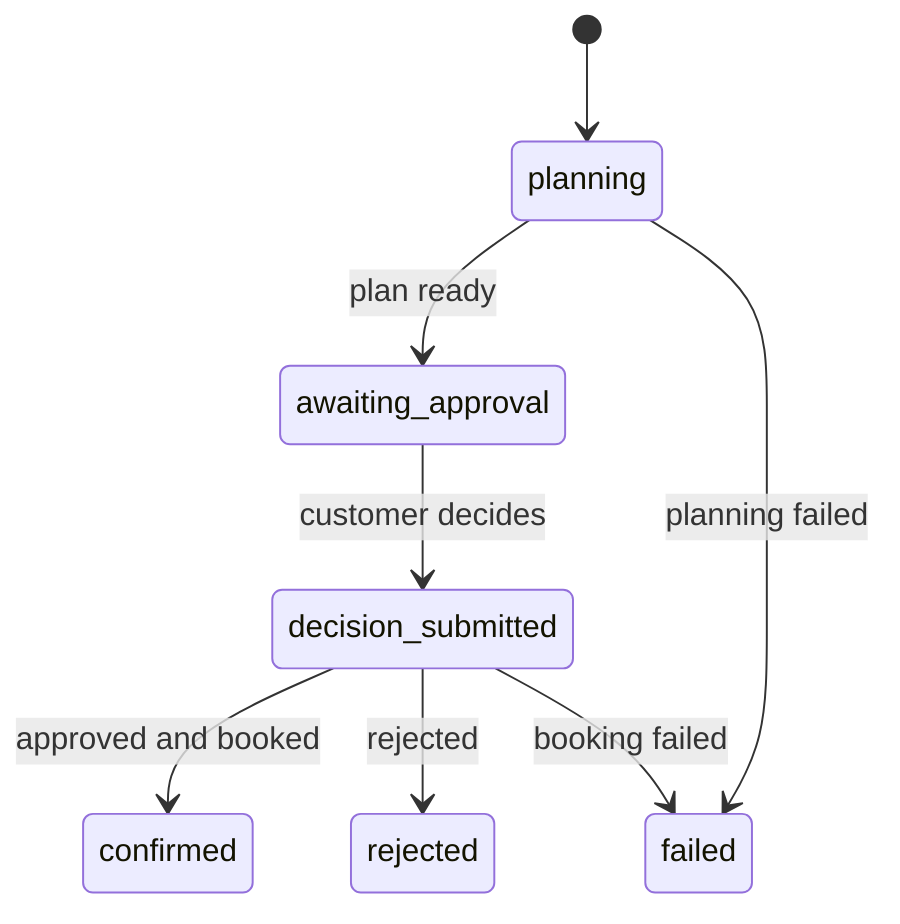
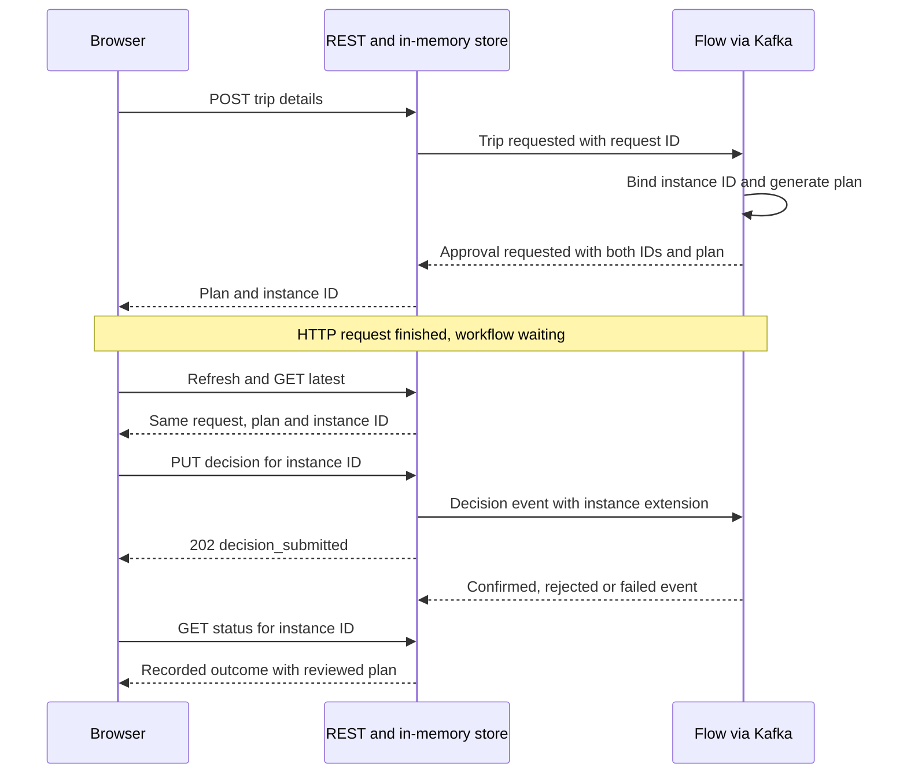
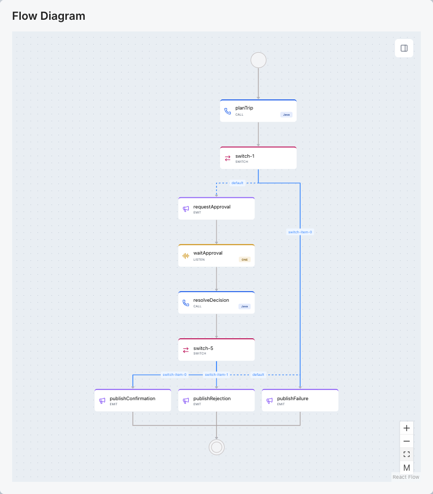
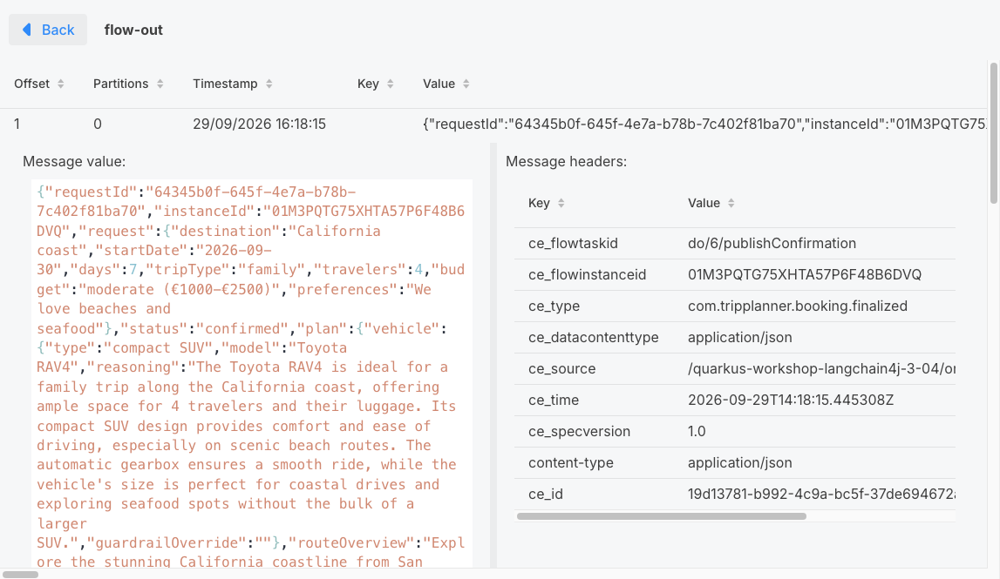

# Step 04 - Event-Driven Agentic Workflows with Quarkus Flow

The trip planner can now generate recommendations and check them before returning a response, but a customer may need time to read the itinerary before agreeing to a booking. Keeping the planning request open while they decide would tie approval to a long-lived HTTP connection. (Miles of Smiles management did suggest a 30-second countdown timer to "encourage decisiveness". It was vetoed.)

[Quarkus Flow](https://quarkiverse.github.io/quarkiverse-docs/quarkus-flow/dev/index.html){target="_blank"} lets the workflow pause after generating a plan and release its thread while the customer decides. It uses Kafka to carry the request and decision as [CloudEvents](https://cloudevents.io/){target="_blank"}, so approval can arrive in a separate HTTP request and resume the matching workflow.

By the end of the exercise, the customer can refresh the browser, return to the same pending trip with its original request details, and approve or reject it.

## Keeping track of in-flight workflows

When a customer creates a trip, the workflow runs the same planning pipeline as before, but this time it publishes the plan as a **CloudEvent onto a Kafka topic**, and then waits for the customer to make up their mind. It might be a minute or it might be after lunch. When the decision comes in, it picks up the workflow from where it left off (making sure to continue the right customer's workflow) and finalizes the trip and returns the confirmation to the customer.


```mermaid
flowchart TD
    request[Trip requested] --> planning[Generate trip plan]
    planning -->|Plan ready| publish[Publish plan for approval]
    planning -->|Failure| failed[Publish failure]
    publish --> wait[Wait for matching decision]
    wait --> decision{Approved?}
    decision -->|Yes| booking[Simulate booking]
    decision -->|No| rejected[Publish rejection]
    booking -->|Success| confirmed[Publish simulated confirmation]
    booking -->|Failure| failed
```

A CloudEvent carries the trip details as its `data` and uses attributes such as `type`, `source`, and `id` to identify the event. Kafka transports these events between the application and Flow.

## Starting from the Step 04 project

This chapter starts from the completed Step 04 project instead of your Step 03 working copy. Moving from a synchronous REST call to an event-driven workflow touches the build, the configuration, both REST resources, and several new classes, and most of those changes are wiring that carries events between the REST API and the workflow. Starting from the finished project lets us concentrate on how Flow starts, pauses, and resumes a trip, while the rest of this page walks through every change so you know how the project differs from the one you built in Step 03.

!!!note "Container Runtime Needed"
    Kafka runs through [Dev Services](https://quarkus.io/guides/dev-services), so a container runtime such as Docker or Podman must be running for this and the following chapters. (check the [requirements page](../requirements.md) for installation instructions)

==Copy `section-3/step-04` to a working directory outside the step folders and open that copy in your IDE.== All paths and commands below refer to this working copy.

The agents, guardrails, skill, and browser page are the same as in Step 03. What has changed in this step is how a request reaches that pipeline and how its result gets back to the customer:


```mermaid
flowchart LR
    browser[Browser] -->|"POST /trip/plan"| planApi[Planning API]
    browser -->|"PUT /trip/approve"| approvalApi[Approval API]
    planApi -->|Trip requested| flowIn[(flow-in topic)]
    approvalApi -->|Decision| flowIn
    flowIn --> workflow[Trip planner workflow]
    workflow -->|Plan and outcome| flowOut[(flow-out topic)]
    flowOut --> store[Trip plan store]
    store -->|Status| planApi
```

The planning and approval APIs publish requests and decisions to `flow-in`. Flow publishes the plan and final outcome to `flow-out`, where the trip plan store records them so the planning API can return the current status to the browser.

## Connecting Flow to Kafka

To enable Quarkus Flow, its messaging and LangChain4j integrations and the Kafka connector, we'll need to add a few new dependencies to our pom.xml. Quarkus Flow comes with its own BOM to keep its dependencies nicely in sync.

```xml title="pom.xml (Flow BOM)"
--8<-- "../../section-3/step-04/pom.xml:38:44"
```

```xml title="pom.xml (Flow and Kafka dependencies)"
--8<-- "../../section-3/step-04/pom.xml:73:88"
```

Next, we need to add a few configuration items to the application.properties file to configure Quarkus flow to use Kafka, and to know which topics to send and receive Flow messages from. We also need to configure the appropriate message serializers.

```properties title="application.properties (Flow and messaging)"
--8<-- "../../section-3/step-04/src/main/resources/application.properties:18:41"
```

The application sends requests and decisions through `flow-in-producer` to the `flow-in` topic, where Flow reads them. Plans and final outcomes travel back through `flow-out` to the application's `flow-out-consumer`, which records them for the browser.

## Sending the trip request as an event

In the previous version, `planTrip()` called the planning agents and returned their plan directly. Now the REST endpoint starts a **workflow** instead. It first stores the trip and creates a `PlanningRequest` containing the trip details and a request ID. It then publishes that request as a `com.tripplanner.trip.requested` CloudEvent. Flow listens for that event and starts a workflow instance to generate the plan.


```mermaid
flowchart TD
    trip[Trip details] --> register[Store assigns request ID]
    register --> data[Event data: request ID and trip details]
    attributes[CloudEvent attributes: type, source, id] --> event[Trip requested CloudEvent]
    data --> event
    event --> topic[flow-in topic]
    topic --> flow[Flow starts the workflow]
```

```java title="TripPlannerResource.java (planTrip)" hl_lines="4-10 12 20"
--8<-- "../../section-3/step-04/src/main/java/com/tripplanner/resource/TripPlannerResource.java:43:75"
```

`register()` returns the trip details and new ID as a `PlanningRequest`. The emitter sends it through `flow-in-producer` with CloudEvent metadata, and the event type starts a Flow instance. `awaitPlan()` then waits for the store to receive a plan or failure, for at most `trip.planning.timeout`.

The request still waits for the plan, because the customer needs it on screen, but it returns as soon as the workflow pauses for approval. Its response body is now a `TripPlanStatus`, which wraps the plan together with the workflow identifiers.

The resource also has two new endpoints. `GET /trip/plan/status` looks up a trip by either identifier, and `GET /trip/plan/latest` returns the most recent trip, which is how the browser restores a pending trip after a refresh.

## Starting and resuming the workflow

Once Flow starts the workflow, it needs a way to call the existing planning pipeline. `TripPlannerFlowAdapter` provides that connection: it passes the trip details to `TripPlannerSystem` during planning and creates a (simulated) booking confirmation after approval. The workflow controls when those calls happen and publishes the results.

```java title="TripPlannerFlowAdapter.java (adapter methods)"
--8<-- "../../section-3/step-04/src/main/java/com/tripplanner/agentic/flow/TripPlannerFlowAdapter.java:19:34"
```

The workflow itself publishes the generated plan and waits for the customer's decision before continuing. Its `descriptor()` method connects the incoming trip event to the planning task, the approval wait, and the final outcome events.

==Open `src/main/java/com/tripplanner/agentic/flow/TripPlannerFlow.java` and find the `descriptor()` method:==

```java title="TripPlannerFlow.java (workflow definition)"
--8<-- "../../section-3/step-04/src/main/java/com/tripplanner/agentic/flow/TripPlannerFlow.java:32:57"
```

The definition reads top to bottom, one call per stage of the trip:

- `schedule()` starts a new workflow instance for every `com.tripplanner.trip.requested` event.
- `withInstanceId()` hands the instance identifier to the planning task, so it can tie the workflow to the original request.
- `switchWhenOrElse()` sends a failed plan straight to `publishFailure` and skips approval.
- `emitJson()` publishes the plan as `com.tripplanner.trip.approval.requested`.
- `listen()` pauses the workflow until a `com.tripplanner.trip.approval.done` event arrives. Its `.envelope(this::matchesDecision)` filter ignores an event with the wrong `flowinstanceid`, a mismatched decision, or an unreadable payload, and the workflow keeps waiting.
- `switchCase()` publishes the confirmation, rejection, or failure. `END` stops each outcome from running into the next one.

A rejection goes straight to `publishRejection` and ends the workflow, so only an approved trip reaches the booking adapter. Every planning request starts its own workflow instance, and several trips can wait for a decision at the same time.

The three helper methods below `descriptor()` are the tasks the workflow runs. `plan()` binds the instance to its request in the store before calling the adapter, `resolveDecision()` checks the decision and finalizes the booking, and `matchesDecision()` is the `listen()` filter.

??? info "Complete Flow class"
    The complete source includes the imports, the injected adapter, store, and `ObjectMapper`, and all three helper methods.

    ```java title="TripPlannerFlow.java"
    --8<-- "../../section-3/step-04/src/main/java/com/tripplanner/agentic/flow/TripPlannerFlow.java"
    ```

    The `matchesDecision()` helper reads the instance extension and deserializes the decision with the injected mapper before checking the store. It keeps both checks in a single envelope predicate. Adding `dataAs()` after an instance-envelope filter would replace that predicate in this DSL instead of combining the checks.

## Handling failures outside the REST call

Previously, a guardrail exception happened during the REST call, where `GuardrailExceptionMapper` could turn it into an HTTP response. Planning now runs inside the workflow after the REST endpoint publishes the request, so that mapper cannot handle exceptions from the agents. Instead, we'll now need to carry failures back through the workflow events.

During planning or booking, the workflow catches failures and publishes a failed `TripPlanStatus`. `TripError.from()` gives guardrail failures a safe message, and the store records the result for the browser. If booking fails, the plan the customer reviewed stays available.

## Keeping the result attached to its request

The API needs a `requestId` to track the trip as soon as the HTTP request arrives. Flow assigns an `instanceId` when it starts the workflow. The REST resource publishes the request ID with the original `TripRequest` in `com.tripplanner.trip.requested`, and the store links it to the new instance ID so later events and browser requests refer to the same trip.

The `TripPlanStatus` record carries the trip details and current outcome in both API responses and workflow events.

```java title="TripPlanStatus.java"
--8<-- "../../section-3/step-04/src/main/java/com/tripplanner/model/TripPlanStatus.java"
```

Along with both identifiers, the record carries:

- `request` and `plan`, the original trip details and the generated plan, which let the browser restore the trip after a refresh.
- `status`, the current state.
- `confirmation` once booking completes, or `error` and `message` when something fails.

The `status` field follows the trip from planning through the customer's decision:


```mermaid
stateDiagram-v2
    [*] --> planning
    planning --> awaiting_approval: plan ready
    planning --> failed: planning failed
    awaiting_approval --> decision_submitted: customer decides
    decision_submitted --> confirmed: approved and booked
    decision_submitted --> rejected: rejected
    decision_submitted --> failed: booking failed
```

When a workflow task fails, `failed()` moves the trip to `failed` without discarding a generated plan. If the HTTP wait times out, `withError()` adds a message to the response without changing the status, because the workflow may still finish.

`TripPlanStore` keeps every trip in memory so the REST API can return the status recorded from workflow events. It maps each `requestId` to the trip's current status and each workflow `instanceId` back to its `requestId`. It also holds the decision submitted for each waiting instance and remembers the most recent request for `/trip/plan/latest`.

```java title="TripPlanStore.java (in-memory state)"
--8<-- "../../section-3/step-04/src/main/java/com/tripplanner/agentic/flow/TripPlanStore.java:30:46"
```

`register()` creates the entry when the planning request arrives, and `bind()` links the Flow instance to it when the workflow's `plan()` task starts.

The workflow's events come back to the store on `flow-out-consumer`. Each event type published by an `emitJson()` task maps to a trip state, and the `flowinstanceid` extension, which Flow adds to every event it publishes, says which instance sent it.

```java title="TripPlanStore.java (outcome consumer)"
--8<-- "../../section-3/step-04/src/main/java/com/tripplanner/agentic/flow/TripPlanStore.java:62:81"
```

The store checks every incoming event before recording it. `accept()` makes sure the workflow identifier matches a registered request and that the trip is in the right state, so a stale approval request for a rejected trip is ignored and the trip stays rejected. Once an outcome is accepted, the store wakes the `awaitPlan()` call in the waiting planning request. A workflow that fails while publishing its outcome has no event to send, so the store also implements Flow's `WorkflowExecutionListener` and handles `WorkflowFailedEvent` in `onWorkflowFailed()` as well. When a workflow really fails, the store records a safe failure for that request and keeps any plan the customer already reviewed.

## Resuming with the customer's decision

The approval endpoint is new in this step. `TripApprovalResource` accepts `PUT /trip/approve` with the workflow's `instanceId` and a status of `approved` or `rejected`. It first asks the store to record the decision, which accepts it only for a trip that is waiting for a decision, and then publishes the decision for Flow.

```java title="TripApprovalResource.java (publishing the decision)" hl_lines="6 8"
--8<-- "../../section-3/step-04/src/main/java/com/tripplanner/resource/TripApprovalResource.java:46:66"
```

The event type `com.tripplanner.trip.approval.done` is the one the workflow's `listen()` step waits for. The `flowinstanceid` extension names the instance the customer is deciding on, and `matchesDecision()` compares it with the waiting workflow, so each decision resumes the workflow it was made for. The endpoint answers with HTTP 202 as soon as the event is sent, because the workflow finishes the booking afterwards.


```mermaid
sequenceDiagram
    participant Browser
    participant API as REST and in-memory store
    participant Flow as Flow via Kafka
    Browser->>API: POST trip details
    API->>Flow: Trip requested with request ID
    Flow->>Flow: Bind instance ID and generate plan
    Flow-->>API: Approval requested with both IDs and plan
    API-->>Browser: Plan and instance ID
    Note over Browser,Flow: HTTP request finished, workflow waiting
    Browser->>API: Refresh and GET latest
    API-->>Browser: Same request, plan and instance ID
    Browser->>API: PUT decision for instance ID
    API->>Flow: Decision event with instance extension
    API-->>Browser: 202 decision_submitted
    Flow-->>API: Confirmed, rejected or failed event
    Browser->>API: GET status for instance ID
    API-->>Browser: Recorded outcome with reviewed plan
```

The browser shows the workflow identifier so you can compare it with the CloudEvents later. The page shows `decision_submitted` and keeps polling `GET /trip/plan/status` until the backend reports `confirmed`, `rejected`, or `failed`.

??? info "Validation, timeouts, and error responses"
    `PUT /trip/approve` needs a nonblank `instanceId` and a `status` of `approved` or `rejected`. An invalid decision returns HTTP 400, an unknown trip 404, and a trip in any other state 409, so only decisions for a trip awaiting approval reach Kafka.

## Trying it out: following a trip through the running application

Whew, that was a lot of code and theory right? Let's see it in action now, and hopefully it'll all make sense!

==Start dev mode from your working copy with `./mvnw quarkus:dev` (`.\mvnw.cmd quarkus:dev` on Windows), then open [http://localhost:8080](http://localhost:8080){target="_blank"}.==

==Generate a trip with a future start date and note its workflow identifier.== A family trip to the California coast for seven days and four travelers is a useful comparison with the previous chapters.

The page shows the generated plan and offers **Approve Trip** and **Reject Trip**. The workflow identifier above the itinerary identifies this trip when you inspect its events later.


==Refresh the browser without restarting the application. Compare the restored workflow identifier and plan with the ones you noted, and check the original destination, start date, duration, travelers, budget, and preferences in the restored form or `/trip/plan/latest` response.== The same pending trip should come back from the store, with the plan the agents already generated.

### Approving the pending trip

==Click **Approve Trip**.== The plan stays visible while the decision is submitted and the simulated booking finishes. The page then shows `confirmed` with a `MOS-...` booking reference. The booking is simulated, much to the disappointment of the sales team, who were hoping to see real reservations.


### Rejecting a different trip

==Generate another trip, note its new workflow identifier, and click **Reject Trip**.== The page briefly shows `decision_submitted`, then reports `rejected` while keeping the plan visible.

==Refresh the browser and confirm that this trip remains rejected with its plan still visible.==


### Inspecting the workflow and events

Now let's hop over to the Dev UI to inspect what has just happened.

==Open the Dev UI at [http://localhost:8080/q/dev](http://localhost:8080/q/dev){target="_blank"}==. You'll notice a new Quarkus Workflows card. ==Click on it and then select **Workflows**==. Inspect `trip-planner-flow`. Its diagram shows the planning task, the approval publication, the wait, and the outcome branches.

<figure markdown="span">
  { width="600" }
</figure>

==Go back to the main Dev UI page and open **Apache Kafka Client > Topics**==. Inspect `flow-in`. Find the `com.tripplanner.trip.requested` and `com.tripplanner.trip.approval.done` events for the approved trip. The first has the request ID and original trip details in its payload; the second has the workflow identifier in its `ce_flowinstanceid` header and decision payload.

Inspect `flow-out` and ==click the approved trip's `com.tripplanner.trip.approval.requested` and `com.tripplanner.booking.finalized` messages to open their values and headers.== Compare their `ce_flowinstanceid` headers with the workflow identifier you noted in the browser. Kafka carries CloudEvent attributes as `ce_` headers, so both messages should name the same instance. Their payloads contain the plan and original request, while `ce_flowtaskid` identifies the publishing task.



==Find the rejected trip's messages in `flow-out` using its workflow identifier.== Its events should end with `com.tripplanner.trip.rejected`, with no booking confirmation for that instance.

## What's next?

The customer can now leave a plan awaiting approval and return after a browser refresh, with a decision event resuming the matching workflow. In Step 05, we'll persist workflow and trip state so the same journey can continue after an application restart.

[Continue to Step 05 - Resilient Agentic Workflows with Persistence](step-05.md)
