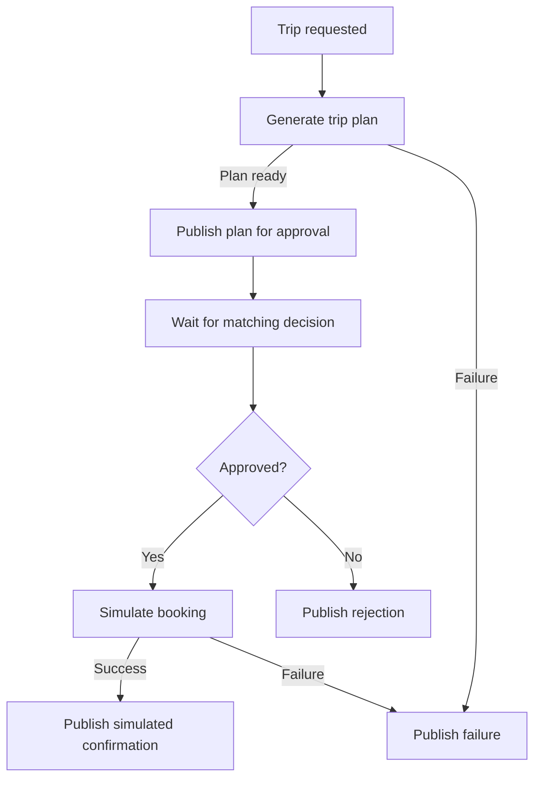
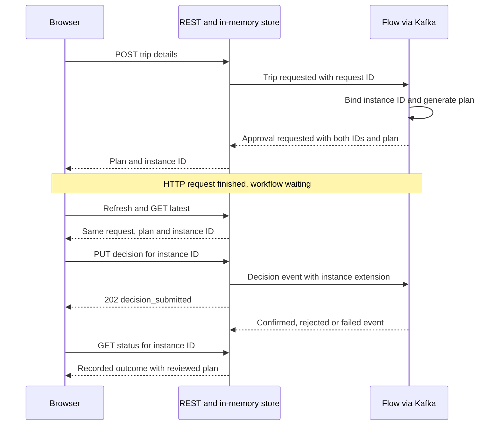
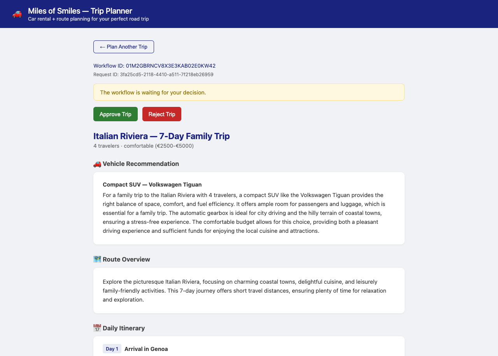
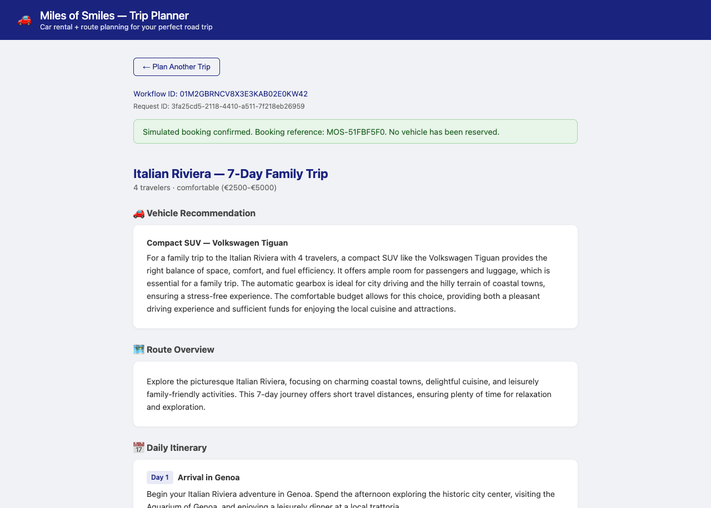
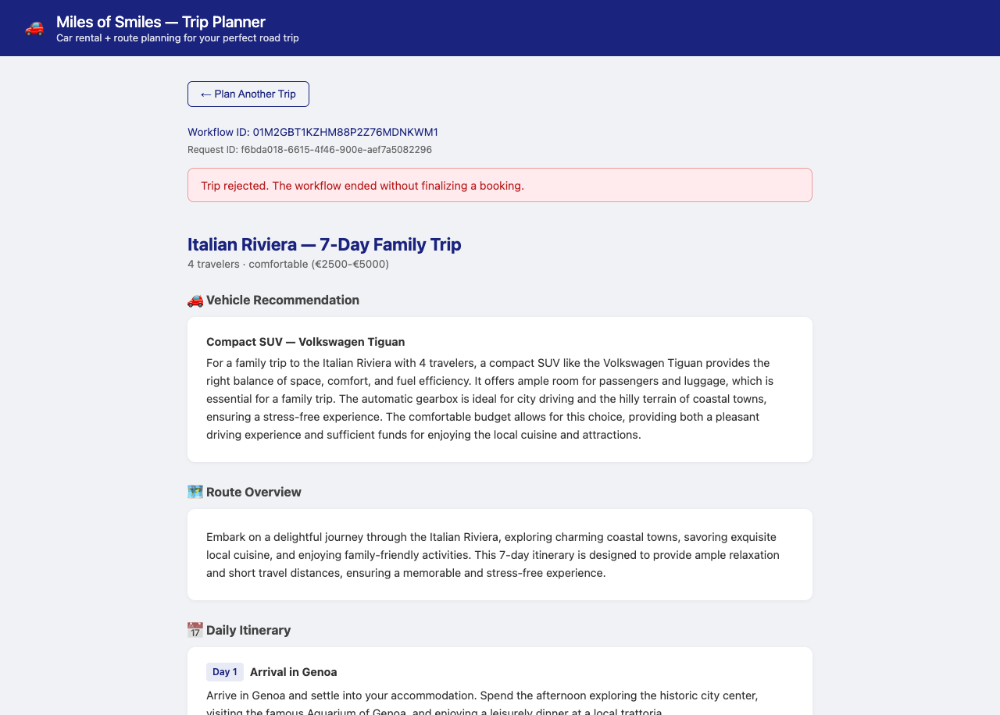

# Step 04 - Event-Driven Agentic Workflows with Quarkus Flow

The trip planner can now generate recommendations and check them before returning a response, but a customer may need time to read the itinerary before agreeing to a booking. Keeping the planning request open while they decide would tie approval to a long-lived HTTP connection. (Miles of Smiles management did suggest a 30-second countdown timer to "encourage decisiveness". It was vetoed.)

[Quarkus Flow](https://quarkiverse.github.io/quarkiverse-docs/quarkus-flow/dev/index.html){target="_blank"} lets the workflow pause after generating a plan without holding a thread while the customer decides. Kafka carries the request and decision as [CloudEvents](https://cloudevents.io/){target="_blank"}, so approval can arrive in a separate HTTP request and resume the matching workflow.

By the end of the exercise, the customer can refresh the browser, return to the same pending trip with its original request details, and approve or reject it. Approval produces a simulated booking reference; rejection ends the workflow without booking finalization. No vehicle is reserved, and no inventory or booking service is called.

## Separating planning from the customer decision

The workflow starts when a trip request arrives, runs the existing planning pipeline, and publishes the plan for approval. Its wait matches a decision to the workflow instance that requested it. Failures and rejection also produce events, so the browser can learn the outcome instead of waiting indefinitely for a confirmation that will never arrive.


```mermaid
flowchart TD
    request[Trip requested] --> planning[Generate trip plan]
    planning -->|Plan ready| publish[Publish plan for approval]
    planning -->|Failure| failed[Publish failure]
    publish --> wait[Wait for matching decision]
    wait --> decision{Approved?}
    decision -->|Yes| booking[Simulate booking]
    decision -->|No| rejected[Publish rejection]
    booking -->|Success| confirmed[Publish simulated confirmation]
    booking -->|Failure| failed
```

Quarkus Flow expresses these tasks in Java using the [CNCF Serverless Workflow specification](https://serverlessworkflow.io/){target="_blank"}. CloudEvents supplies the envelope, including `type`, `source`, `id`, and `data`; Kafka transports those events between the application and the workflow.

The initial planning HTTP request still waits for a generated plan or a failure. Once that request finishes, the workflow remains at the approval wait without keeping an HTTP connection open. This separation is the pattern we'll implement here; a fully asynchronous planning API is outside this exercise.

!!! note "Browser refresh is not application recovery"
    Both the workflow and the trip store live in memory. Refreshing the browser while the application remains running restores the saved trip, but restarting the application loses it and its waiting workflow. Kafka event retention does not restore this in-memory state. Step 05 introduces persistence.

## Preparing the working project

Kafka runs through Dev Services, so Docker or Podman must be running for the live exercise. Keep the model-provider configuration from Step 02, including your API key environment variable.

The exercise changes the Flow definition. The event store, REST resources, payload models, and tests are supplied so we can concentrate on starting, suspending, and resuming a workflow instead of implementing HTTP and browser plumbing. The browser frontend is the one you have used since Step 00. It already knows how to show the workflow status and the approval buttons, so it does not change in this step.

=== "Option 1: Continue from Step 03"

    ==Stop dev mode in your Step 03 working copy before updating the dependencies and supplied files.==

    ==Copy `pom.xml` from `section-3/step-04` into your working copy. Keep any local model-provider dependencies you added in Step 02.== This supplies the Flow BOM, Flow messaging and LangChain4j integration, Kafka connector, and test dependencies together with their compatible build configuration. Versions are maintained in that file.

    ==Copy these supplied paths from `section-3/step-04` to the same paths in your working copy, replacing matching files:==

    - `src/main/java/com/tripplanner/` (the retained agents and guardrails, plus the new Flow, store, resources, and models)
    - `src/main/resources/skills/family-trip/SKILL.md` (the Step 01 baseline with driving-time and break guidance)
    - `src/test/java/com/tripplanner/` (the Flow smoke suite and store lifecycle tests)
    - `src/test/resources/application.properties`
    - `src/test/frontend/`

    The supplied agents are the Step 02 pipeline, with one small change: `days` and `travelers` are now `Integer` instead of `String`, because the Flow adapter passes the numbers from `TripRequest` directly. You don't need to change any agents yourself.

    ==Remove `src/test/java/com/tripplanner/TripPlannerResourceTest.java` and `src/test/java/com/tripplanner/TripPlanContractTest.java` from this working copy. If you previously copied an older Step 04, also remove `src/test/java/com/tripplanner/flow/MockTripPlannerFlowAdapter.java` and any copied `TripPlanningFailureTest.java`.== The old HTTP tests called a synchronous agent pipeline and expected the old response contract. Step 04 keeps a small Flow smoke suite only; guardrail and pricing-tool coverage stays in Step 02.

    ==Add the messaging configuration below, then open the supplied `TripPlannerFlow.java` and implement its `descriptor()` method using the focused excerpt in the exercise.== Keep the supplied fields and helper methods around it.

=== "Option 2: Use the completed Step 04 project"

    ==Copy `section-3/step-04` to a working directory and open that copy.== It supplies the Flow definition and the matching store, resources, models, and tests.

    ==Apply your Step 02 model-provider settings to `src/main/resources/application.properties`, keeping the supplied Flow and Kafka settings.== If you use a different provider extension, keep its dependency as well.

    ==Read the Flow definition and correlation explanation below, then run the same tests and browser verification as the hands-on route.== No frontend implementation is required for either route.

The planning pipeline itself hasn't changed. Vehicle and itinerary research still run in parallel, followed by cost estimation with the Step 02 pricing tool and guardrails.

Each planning request gets its own workflow instance, so several trips can wait for a decision at the same time. The refresh exercise assumes a single workshop user, though, because `/trip/plan/latest` returns the latest trip in the whole application.

### Connecting Flow to Kafka

The supplied POM includes the Flow extensions and Kafka connector:

```xml title="pom.xml (Flow and Kafka dependencies)"
--8<-- "../../section-3/step-04/pom.xml:69:84"
```

The messaging channels carry trip requests to Flow and bring plans and outcomes back to the application.

==For the hands-on route, append the following settings to `src/main/resources/application.properties`, keeping your existing model and skills configuration:==

```properties title="application.properties (Flow and messaging)"
--8<-- "../../section-3/step-04/src/main/resources/application.properties:15:42"
```

The application sends requests and decisions through `flow-in-producer` to the `flow-in` topic, where Flow reads them. Plans and final outcomes travel back through `flow-out` to the application's `flow-out-consumer`, which records them for the browser.

==Keep `%dev.quarkus.live-reload.watched-resources=skills/family-trip/SKILL.md` from Step 01, adding it if your working copy lacks it.== Editing that skill automatically reloads the application. Finish any pending approval exercise before editing code, configuration, or watched skills, because a reload loses this chapter's in-memory trips and workflow waits.

## Starting and resuming the workflow

The supplied adapter calls the same trip-planning pipeline as before. Its booking method only creates a sample reference and a message identifying the result as simulated.

```java title="TripPlannerFlowAdapter.java (adapter methods)"
--8<-- "../../section-3/step-04/src/main/java/com/tripplanner/agentic/flow/TripPlannerFlowAdapter.java:19:34"
```

The workflow will publish the generated plan and wait for the customer's decision before continuing.

==Open `src/main/java/com/tripplanner/agentic/flow/TripPlannerFlow.java`. For the hands-on route, update `descriptor()` to match the following definition. Keep the supplied imports, injections, and the `plan()`, `resolveDecision()`, and `matchesDecision()` helpers unchanged:==

```java title="TripPlannerFlow.java (workflow definition)" hl_lines="4 6-24"
--8<-- "../../section-3/step-04/src/main/java/com/tripplanner/agentic/flow/TripPlannerFlow.java:32:57"
```

`schedule()` starts a new workflow instance for every `com.tripplanner.trip.requested` event, and `withInstanceId()` hands the instance identifier to the planning task so it can tie the workflow to the original request. If planning fails, `switchWhenOrElse()` skips approval and goes straight to `publishFailure`. Otherwise `emitJson()` publishes the plan, and `listen()` pauses the workflow until a `com.tripplanner.trip.approval.done` event arrives.

The `.envelope(this::matchesDecision)` filter makes sure it's the right event. One with the wrong `flowinstanceid`, a mismatched decision, or an unreadable payload is ignored, and the workflow keeps waiting. The last branch publishes the confirmation, rejection, or failure, and `END` stops each outcome from running into the next one. Rejection never calls the booking adapter.

??? info "Complete supplied Flow class"
    The complete source includes the imports and injected adapter, store, and `ObjectMapper`, as well as all three helper methods. These are supplied for both participation routes; only the workflow definition is the participant edit.

    ```java title="TripPlannerFlow.java"
    --8<-- "../../section-3/step-04/src/main/java/com/tripplanner/agentic/flow/TripPlannerFlow.java"
    ```

    The supplied `matchesDecision()` helper reads the instance extension and deserializes the decision with the injected mapper before checking the store. It keeps both checks in a single envelope predicate. Adding `dataAs()` after an instance-envelope filter would replace that predicate in this DSL instead of combining the checks.

    Agent exceptions now occur outside the REST call, so the Step 02 exception mapper cannot return them directly. These helpers turn planning or finalization exceptions into a failed status, which the workflow publishes as an event. The error model checks the cause chain for an actual guardrail exception and returns a safe message; unrelated failures are server errors. A finalization failure keeps the plan the customer reviewed.

## Keeping the result attached to its request

There are two identifiers because the HTTP request exists before Flow creates its instance. The REST resource registers a `requestId` and publishes it with the original `TripRequest` in `com.tripplanner.trip.requested`. The workflow then binds its own `instanceId` to that request, so the browser never mistakes another trip's result for its own.

The supplied `TripPlanStatus` record carries the trip details and current outcome in both API responses and workflow events.

```java title="TripPlanStatus.java"
--8<-- "../../section-3/step-04/src/main/java/com/tripplanner/model/TripPlanStatus.java"
```

Along with both identifiers, the record carries the original `request` and the generated `plan`, which is what lets the browser restore the trip after a refresh. `status` holds the current state, with a `confirmation` once booking completes, or an `error` and `message` when something fails. Calling `failed()` keeps any plan that was already generated.

The store doesn't take incoming events on trust. Before accepting an outcome, it checks that the workflow identifier matches a registered request and that the trip is in the right state, so an old approval request can't reopen a trip that was already rejected. An event also can't report that it failed to publish, so the store listens for Flow's `WorkflowFailedEvent` through `onWorkflowFailed()` as well. When a workflow really fails, the store records a safe failure for that request and keeps any plan the customer already reviewed.


```mermaid
sequenceDiagram
    participant Browser
    participant API as REST and in-memory store
    participant Flow as Flow via Kafka
    Browser->>API: POST trip details
    API->>Flow: Trip requested with request ID
    Flow->>Flow: Bind instance ID and generate plan
    Flow-->>API: Approval requested with both IDs and plan
    API-->>Browser: Plan and instance ID
    Note over Browser,Flow: HTTP request finished, workflow waiting
    Browser->>API: Refresh and GET latest
    API-->>Browser: Same request, plan and instance ID
    Browser->>API: PUT decision for instance ID
    API->>Flow: Decision event with instance extension
    API-->>Browser: 202 decision_submitted
    Flow-->>API: Confirmed, rejected or failed event
    Browser->>API: GET status for instance ID
    API-->>Browser: Recorded outcome with reviewed plan
```

The browser shows the workflow identifier so you can compare it with the CloudEvents later. After a decision, HTTP 202 only means the submission was accepted. The page shows `decision_submitted` and keeps polling `GET /trip/plan/status` until the backend reports `confirmed`, `rejected`, or `failed`.

??? info "Validation, timeouts, and error responses"
    `PUT /trip/approve` needs a nonblank `instanceId` and a `status` of exactly `approved` or `rejected`. A missing identifier or invalid decision returns HTTP 400, an unknown trip 404, and a trip that is no longer awaiting approval 409, so duplicate or late decisions never reach Kafka.

    Planning waits up to `trip.planning.timeout`, which defaults to `PT120S`. An HTTP 504 `planning_timeout` means the HTTP wait expired, not that the workflow stopped. The response still carries the request and instance identifiers, so the status can be checked later.

    Guardrail failures during planning return HTTP 422 `guardrail_violation`, other planning failures return HTTP 500 `planning_failed`, and failures during the simulated booking use `finalization_failed`. Status reads return HTTP 200 for any known trip, even a failed one, so the frontend checks the `status` field instead of the HTTP code. Error messages never include raw exception details or model output.

    The frontend also limits how long it polls and waits on the network. If polling times out, it keeps the reviewed plan on screen and says so, without labelling the trip confirmed, rejected, or failed.

??? info "Supplied API reference"
    `POST /trip/plan` accepts a `TripRequest` and normally returns HTTP 200 with an `awaiting_approval` envelope. A null request returns 400, overlapping planning returns 409, and planning failures or timeouts use the responses described above.

    `PUT /trip/approve` accepts `TripApproval` and returns HTTP 202 with `decision_submitted`. Both approval and rejection use this endpoint. If the event can't be sent, the trip is recorded as failed.

    `GET /trip/plan/status?instanceId=...` returns one trip's envelope. `requestId=...` can be used before an instance identifier is available. If both are supplied, `instanceId` takes precedence. Missing identifiers return 400; an unknown identifier returns 404.

    `GET /trip/plan/latest` returns the latest registered trip, including its original request and any terminal outcome. It returns HTTP 204 only when no trip is stored. It is used for browser refresh, not for correlating a planning response or choosing an older customer's trip.

## Checking the event boundary without a model

The supplied `TripPlannerFlowTest` mocks the planning adapter and uses the real workflow, store, and REST resources. Its in-memory messaging connectors let the tests relay each event deliberately and check the state before and after consumption. The tests use no Kafka broker or live model.

```properties title="src/test/resources/application.properties"
--8<-- "../../section-3/step-04/src/test/resources/application.properties"
```

==Run the Step 04 test suite from your working project:==

=== "Linux / macOS"
    ```bash
    ./mvnw test
    ```

=== "Windows"
    ```cmd
    .\mvnw.cmd test
    ```

This runs `TripPlannerFlowTest` and `TripPlanStoreLifecycleTest`. The Flow tests follow an approval through to confirmation, check that rejection skips the booking, and check the 422 and 500 responses when the mocked adapter fails. The store tests cover unrelated instances, a workflow failing while it waits for approval, and duplicate failure events. The browser tests in `src/test/frontend/` are described in the [Step 04 README](https://github.com/quarkusio/quarkus-workshop-langchain4j/tree/main/section-3/step-04#verification){target="_blank"}.

## Following a trip through the running application

==Start dev mode from your working project with `./mvnw quarkus:dev` (`.\mvnw.cmd quarkus:dev` on Windows), then open [http://localhost:8080](http://localhost:8080){target="_blank"}.== If another step uses that port, add `-Dquarkus.http.port=8083` and use the corresponding URLs below. Do not run Maven `clean` while dev mode is running.

==Generate a trip with a future start date and note its workflow identifier.== A family trip to the California coast for seven days and four travelers is a useful comparison with the previous chapters.

==Check the browser's Network panel to confirm that `POST /trip/plan` has finished while the page is awaiting approval. Open the Dev UI at [http://localhost:8080/q/dev](http://localhost:8080/q/dev){target="_blank"}, select **Workflows** on the Quarkus Flow card, and inspect `trip-planner-flow`.== Its diagram has the planning task, the approval publication, the wait, and the outcome branches.

==Refresh the browser without restarting the application. Compare the restored workflow identifier and plan with the ones you noted, and check the original destination, start date, duration, travelers, budget, and preferences in the restored form or `/trip/plan/latest` response.== The same pending trip should come back without another model call.



### Approving the pending trip

==Click **Approve Trip** and follow the status requests in the Network panel.== The decision response is HTTP 202 `decision_submitted`, and the plan stays visible while the booking is finalized. A later GET reports `confirmed` with a simulated `MOS-...` booking reference. No vehicle is actually reserved, much to the disappointment of the sales team.

==In the Dev UI, open **Apache Kafka Client > Topics** and inspect `flow-in`.== The initiating event is `com.tripplanner.trip.requested`, with the planning request identifier and original trip details in its payload. The decision event is `com.tripplanner.trip.approval.done`, with the workflow identifier in its `flowinstanceid` extension and in its decision payload.

==Inspect `flow-out` and compare the `flowinstanceid` on `com.tripplanner.trip.approval.requested` and `com.tripplanner.booking.finalized` with the identifier displayed in the browser.== They should identify the same instance. The approval-request payload contains the status envelope, including the plan and original request, not a bare `TripPlan`.



### Rejecting a different trip

==Generate another trip, note its new workflow identifier, and click **Reject Trip**.== Rejection also passes through `decision_submitted`. It becomes final only after `GET /trip/plan/status` reports `rejected` from the recorded `com.tripplanner.trip.rejected` event.

==Refresh the browser, then inspect this instance's status and events.== The trip should stay rejected, and there should be no `com.tripplanner.booking.finalized` event for this instance.



## What's next?

The customer can now leave a plan awaiting approval and return after a browser refresh, with a decision event resuming the matching workflow. In Step 05, we'll persist workflow and trip state so the same journey can continue after an application restart.

[Continue to Step 05 - Resilient Agentic Workflows with Persistence](step-05.md)
