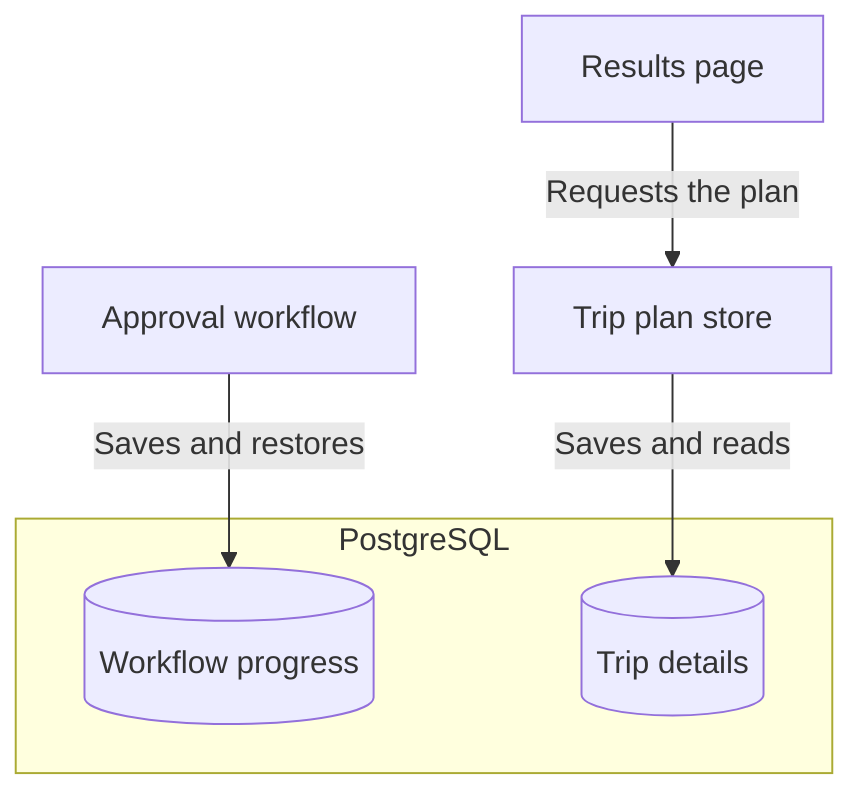
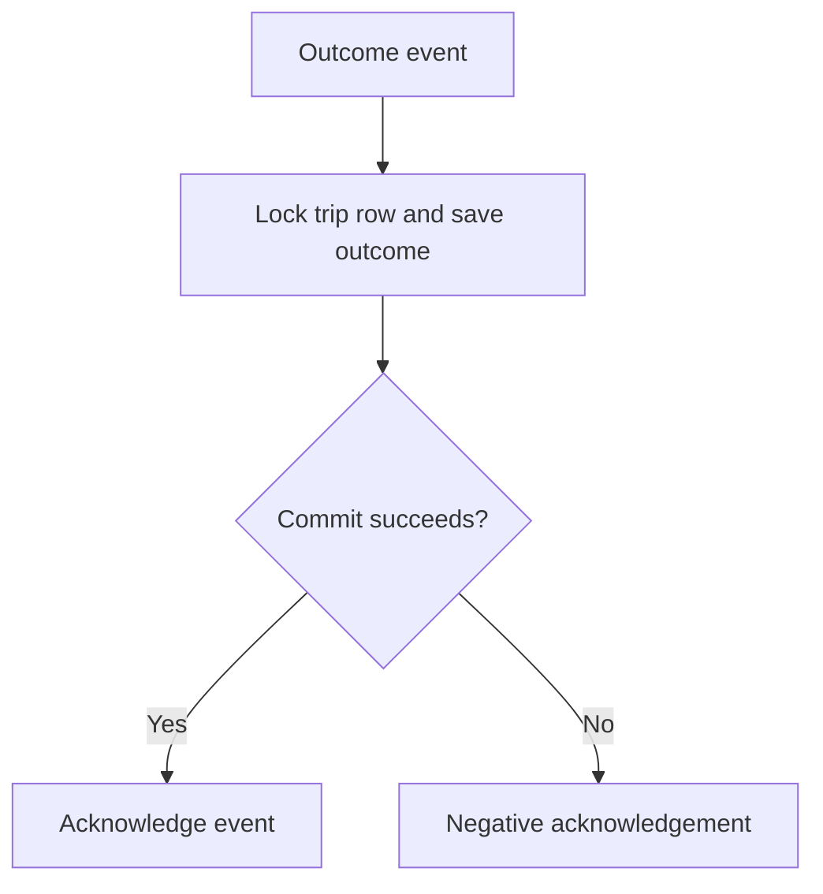
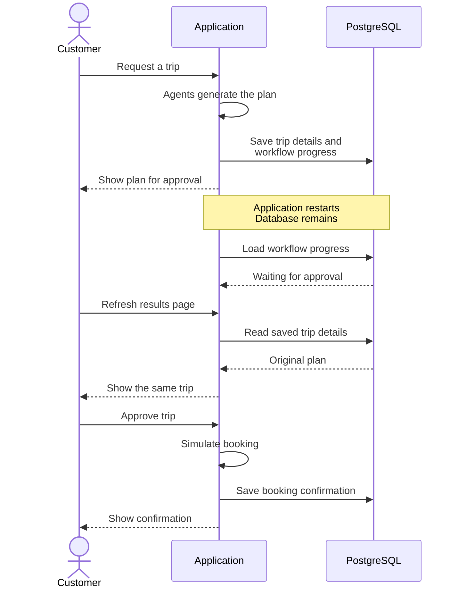
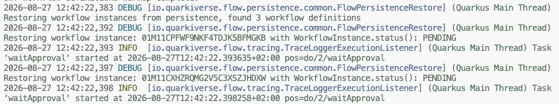
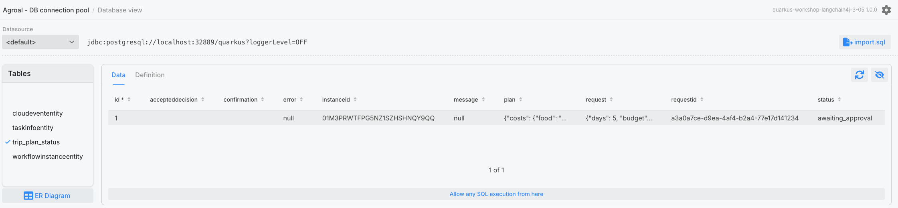

# Step 05 - Resilient Agentic Workflows with Persistence

The Miles of Smiles team has been trying out the approval flow from Step 04, and everything works well until the application needs to restart, scale up/down, or a pod gets rescheduled to a different node on their Kubernetes cluster.

A customer who was still reading their itinerary comes back to an empty form, with no way to approve the trip they had just generated. Although the agents had finished their work, the plan and its pending approval were only held in memory.

We'll address this resilience issue by saving enough information for the customer to continue where they left off. Along the way, we'll see how Quarkus Flow restores a waiting workflow and how we can store the trip and workflow state in a database .

## Workflow state and application state

For the application to be resilient, the application needs to **remember both where it paused and what it was showing the customer***. These are saved separately in the same database, so the workflow can continue waiting for approval while the browser retrieves the trip details.



Quarkus Flow handles the workflow side through its persistence extension, while our application uses Hibernate for the trip records.

## Preparing the working copy

=== "Option 1: Continue from Step 04"

    ==Apply the changes below to your working project.== Keep your existing model-provider settings and dependencies. Dev mode restarts automatically when it detects the `pom.xml` change; the first restart will take longer than usual because Dev Services is now starting a PostgreSQL container.

=== "Option 2: Follow the completed Step 05 project"

    ==Copy `section-3/step-05` to a working directory and open that copy. Apply your existing model-provider settings, keeping the supplied persistence configuration.== The code changes below are already included, so you can follow along. Configure container reuse before starting the application, then join the hands-on route at [Verifying workflow recovery after a restart](#verifying-workflow-recovery-after-a-restart).


## Configuring PostgreSQL

Quarkus can start PostgreSQL for us through Dev Services, so the database starts together with the application. We do need to add the driver and the Flow persistence extension, then make sure the database is kept when the application stops.

==Run the following Maven command to add the PostgreSQL driver and the Flow persistence extension:==

```shell
./mvnw quarkus:add-extension -Dextensions="quarkus-flow-jpa,quarkus-jdbc-postgresql"
```

The existing Quarkus Flow BOM keeps `quarkus-flow-jpa` on the same version as the other Flow extensions. `quarkus-flow-jpa` also brings in Hibernate ORM with Panache, which we'll use to save the trip plan.

==Add the database and workflow persistence settings to `src/main/resources/application.properties`:==

```properties title="src/main/resources/application.properties (database and workflow persistence)"
--8<-- "../../section-3/step-05/src/main/resources/application.properties:43:48"
```

The two Hibernate settings support the exercise:

- `%dev.quarkus.hibernate-orm.schema-management.strategy=update` lets Hibernate create the tables and keep their contents across dev-mode startups. Its usual Dev Services setting, `drop-and-create`, would leave us with an empty database every time we restarted.
- `quarkus.hibernate-orm.mapping.format.global=ignore` keeps Hibernate's JSON serialization of our records independent of the application's REST and CloudEvent mapper customizations.

For a production application, an explicitly configured datasource and controlled schema migrations would be a better choice than letting Hibernate update the schema automatically.

### Keeping PostgreSQL between restarts

Keeping the tables is only useful if the next run connects to the same database. We also need to enable container reuse so that Testcontainers, which Dev Services uses to run PostgreSQL, keeps the database container available across application restarts.

==Choose one of the following ways to enable container reuse before starting or restarting dev mode.==

=== "Bash / Zsh"
    ==Set the variable in the shell you are using to run the app:==
    ```bash
    export TESTCONTAINERS_REUSE_ENABLE=true
    ```

=== "PowerShell"
    ==Set the variable in the shell you are using to run the app:==
    ```powershell
    $env:TESTCONTAINERS_REUSE_ENABLE = "true"
    ```

=== "direnv"
    ==Add this line to `.envrc` in the project directory:==
    ```bash
    export TESTCONTAINERS_REUSE_ENABLE=true
    ```
    ==Run `direnv allow` to activate it.==

=== "~/.testcontainers.properties"
    ==Add this line to `.testcontainers.properties` in your home directory, creating the file if needed:==
    ```properties
    testcontainers.reuse.enable=true
    ```

=== "devbox"
    ==Add the `env` setting to your project's `devbox.json`, preserving any existing packages and settings:==
    ```json
    {
      "packages": [],
      "env": {
        "TESTCONTAINERS_REUSE_ENABLE": "true"
      }
    }
    ```

    ==Enter a `devbox shell` in the project directory.== The environment variable is available inside that shell.

!!! warning "Keep the same database"
    ==Keep the datasource settings unchanged between runs and leave the PostgreSQL container running until the exercise is complete.== If the application starts with a fresh container, the tables will be empty even if the previous run saved its data correctly.

## Persisting and restoring Quarkus Flow instances

With the database ready, Flow can save a waiting workflow and restore it when the application starts again. The `quarkus.flow.persistence.auto-restore=true` setting added above makes the default restoration behavior explicit. On startup, Flow reloads the saved workflow and goes straight back to waiting for the customer's decision, with the plan the agents generated before the restart.

??? info "Does this also save the agents' working state?"
    The restart exercise begins after the agents have generated the plan, while the workflow is waiting for approval. At that point, restoring the workflow and its completed plan is enough to continue to simulated booking. LangChain4j's shared `AgenticScope` is only needed while the agents are running, so it stays in memory.

    Saving that scope is a separate feature, with its own serialization and recovery logic through `AgenticScopeSerializer` and a deserialization-package registration. You would need it to resume a workflow in the middle of an agent's execution.

## Persisting application state with Hibernate ORM and Panache

Flow can now resume the approval process, but the browser also needs the customer's plan after a restart. We will save the trip details in PostgreSQL so the application can return the same plan when the browser reloads.

??? info "Why not read the plan back from Kafka?"
    The outcome events already carry the request and plan, and Kafka can retain them after the application stops. But a restarted consumer resumes from its committed offset and only reads new events. Restoring the waiting workflow also takes Flow's own checkpoint, which lives in PostgreSQL, so we store the trip records in the same database.

### Defining a Panache entity

Each trip needs a database row that keeps the customer's request and plan available after a restart.

==Create `src/main/java/com/tripplanner/model/TripPlanEntity.java`:==

```java title="TripPlanEntity.java"
--8<-- "../../section-3/step-05/src/main/java/com/tripplanner/model/TripPlanEntity.java"
```

`requestId` identifies the trip before Flow starts. The same row picks up an `instanceId` when the workflow is created, and later the plan, the accepted decision, and the outcome. `@JdbcTypeCode(SqlTypes.JSON)` stores the request, plan, confirmation, and decision as JSON columns while keeping them as typed Java fields, and the saved request is what lets the browser restore the form and page header.

The entity extends `PanacheEntityBase` so it can define its own ID. `allocationSize = 1` stops each application instance from reserving its own block of IDs, which keeps the ordering we use to find the latest request.

The [Hibernate ORM with Panache guide](https://quarkus.io/guides/hibernate-orm-panache){target="_blank"} has more about entity mapping and queries.

### Adding transactional persistence and queries

The store will continue receiving the same events and returning the same `TripPlanStatus` envelope, including both identifiers and the original request. The edits below move its reads and writes into the database, with changed lines highlighted. All of them are in the store and its new entity.

==Open `src/main/java/com/tripplanner/agentic/flow/TripPlanStore.java`. Remove the `requests`, `instances`, and `decisions` maps, the `latestRequestId` field, and the `HashMap` and `Map` imports. Update the imports as highlighted below, keeping the logger and injected `ObjectMapper`:==

```java hl_lines="16 21 25-26 30" title="TripPlanStore.java (imports and fields)"
--8<-- "../../section-3/step-05/src/main/java/com/tripplanner/agentic/flow/TripPlanStore.java:3:39"
```

The in-memory implementation used synchronized methods to protect those maps. Database transactions and locks will now protect the records, including when more than one application instance connects to the same database.

==Replace `register()` and `bind()` with the following versions, removing their `synchronized` modifiers:==

```java hl_lines="1-8 11-17 20-21" title="TripPlanStore.java (saving the request before planning)"
--8<-- "../../section-3/step-05/src/main/java/com/tripplanner/agentic/flow/TripPlanStore.java:41:62"
```

`register()` commits the request before the REST resource publishes the planning event. When Flow starts, `bind()` locks that trip's row to check the request and attach its workflow identifier before the agents run. Other trips have separate rows, so they can be planned at the same time.

### Committing outcomes before acknowledging events

The store must save each outcome before acknowledging its Kafka event. If the database commit fails, the event is negatively acknowledged and its Kafka offset stays uncommitted.



==Add `@Blocking` to `consume()` and the highlighted comment, keeping its event names, dispatch, and exception handling unchanged:==

```java hl_lines="2 20" title="TripPlanStore.java (outcome consumer)"
--8<-- "../../section-3/step-05/src/main/java/com/tripplanner/agentic/flow/TripPlanStore.java:64:85"
```

==Replace the private synchronized `accept()` method with this public transactional version:==

```java hl_lines="1-2 4-8 10 14-18" title="TripPlanStore.java (saving a correlated outcome)"
--8<-- "../../section-3/step-05/src/main/java/com/tripplanner/agentic/flow/TripPlanStore.java:87:105"
```

`@Blocking` moves the database work off the messaging event loop. `accept()` locks the trip row so concurrent updates cannot overwrite each other, and `@Transactional(REQUIRES_NEW)` commits its changes before `message.ack()` runs. Quarkus applies this transaction even though the call comes from the same bean. Malformed JSON is ignored, while a database failure goes to the messaging failure handler and leaves the event unacknowledged.

`accept()` checks that an outcome belongs to the right trip and can follow its current state. A completed trip keeps its outcome when an old approval event arrives, and a final outcome adds its confirmation or error next to the plan the customer reviewed.

### Keeping the decision and failure outcome

The workflow checks a decision against the one accepted by the REST resource before resuming. Saving that accepted decision alongside the trip lets this check continue to work after the in-memory maps are gone.

==Replace `submitDecision()` and `matchesDecision()` with these database-backed versions:==

```java hl_lines="1-6 9-14 17-21" title="TripPlanStore.java (persisting the accepted decision)"
--8<-- "../../section-3/step-05/src/main/java/com/tripplanner/agentic/flow/TripPlanStore.java:107:128"
```

Locking the row while accepting a decision makes concurrent submissions take turns. The first moves it to `decision_submitted`, and a later submission receives HTTP 409 because the trip is no longer awaiting a decision. The confirmed, rejected, or failed outcome is recorded when its event arrives.

==Replace `submissionFailed()` and `onWorkflowFailed()` with the following versions, removing their `synchronized` modifiers and the old map updates and `notifyAll()` call:==

```java hl_lines="1-11 15 18" title="TripPlanStore.java (persisting failures)"
--8<-- "../../section-3/step-05/src/main/java/com/tripplanner/agentic/flow/TripPlanStore.java:130:148"
```

If a workflow fails while publishing an outcome, the lifecycle listener saves a safe error in the database while retaining the original request and any reviewed plan. A trip that already has a final outcome keeps it when a late failure arrives.

### Reading saved trips in short transactions

The planning HTTP request waits for its result but releases its database connection between reads while the agents run. Each status lookup gets a short transaction, with the polling delay outside it.

==Update `awaitPlan()` as highlighted. Remove `synchronized` and replace the map read and `timedWait()` call, without adding a transaction around this method:==

```java hl_lines="1 4 8-9" title="TripPlanStore.java (bounded waiting)"
--8<-- "../../section-3/step-05/src/main/java/com/tripplanner/agentic/flow/TripPlanStore.java:150:160"
```

==Replace `byRequestId()`, `byInstanceId()`, and `latest()`, removing their `synchronized` modifiers, and add `toStatus()`. Keep the existing `error()` helper and the separate `TripPlanStatus` record unchanged:==

```java hl_lines="1-3 6-8 11-14 17-19" title="TripPlanStore.java (queries and response conversion)"
--8<-- "../../section-3/step-05/src/main/java/com/tripplanner/agentic/flow/TripPlanStore.java:162:181"
```

Each lookup runs in a short transaction, so `awaitPlan()` holds a connection only while it reads. Two details are easy to miss:

- `latest()` orders by sequence ID, so the latest request stays the most recently created trip, even after an older trip is updated or the application restarts.
- `toStatus()` builds the API response from the entity's typed fields, so the browser receives the saved plan and current outcome.

??? info "Complete updated TripPlanStore.java"
    The complete file is included here for comparison with the focused edits above.

    ```java title="TripPlanStore.java"
    --8<-- "../../section-3/step-05/src/main/java/com/tripplanner/agentic/flow/TripPlanStore.java"
    ```

??? info "Does this make database writes and Kafka sends atomic?"
    The database transactions cover only the store operations, while model calls, event publication, and polling delays run outside them. A process crash between saving a request or decision and sending its event can still leave a record with no corresponding event, and closing that gap would take a delivery design such as a transactional outbox. The restart exercise checks recovery of a saved approval wait.

## Verifying workflow recovery after a restart

We're ready to try the customer journey that prompted this change, using one trip and leaving it awaiting approval while we restart the application. The agents generate the plan before shutdown, and afterward the application restores what it saved and continues with the customer's decision.



==Start dev mode from your project directory, in the shell where container reuse is enabled:==

=== "Linux / macOS"
    ```bash
    ./mvnw quarkus:dev
    ```

=== "Windows"
    ```cmd
    .\mvnw.cmd quarkus:dev
    ```

==Open [http://localhost:8080](http://localhost:8080){target="_blank"} and generate a trip plan with a future start date. Leave it awaiting approval.==

Once the plan is ready, the results page shows the workflow and request identifiers above the approval buttons.


==Note both identifiers and the trip details shown in the browser.== You will compare them with the restored trip after restarting.

!!! warning "Before restarting"
    ==Restart only after the trip reports `awaiting_approval`, before submitting its decision. Keep the workflow definition and configuration unchanged, and don't submit trips from other clients until the restart checks are done.== Stopping during planning can leave an interrupted `planning` record that blocks new requests until the disposable database is reset. The latest-trip lookup covers the whole application, so another client's trip would take this one's place.

### Resuming a persisted workflow

==Stop the application with Ctrl-C.==

==Start it again:==

=== "Linux / macOS"
    ```bash
    ./mvnw quarkus:dev
    ```

=== "Windows"
    ```cmd
    .\mvnw.cmd quarkus:dev
    ```

==Refresh the browser before submitting a decision.== The same pending plan and trip details should appear with the identifiers you noted before the restart. Compare them with [the latest-trip response](http://localhost:8080/trip/plan/latest){target="_blank"} to confirm that the saved request and plan are available through the API too.

Now inspect how the application restored that pending trip. ==Check the startup log for `Restoring workflow instance:` and find your trip's identifier at `waitApproval`. Check that no new planning call appears in the log.== The workflow resumes at its approval wait with the plan generated before the restart.



==Open the Quarkus Dev UI at [http://localhost:8080/q/dev](http://localhost:8080/q/dev){target="_blank"} and select **Database view** on the Agroal card. Inspect the `workflowinstanceentity` and `trip_plan_status` tables.== The first holds the saved workflow instance. The second holds the original request and plan with status `awaiting_approval`. Both should have the workflow identifier shown in the browser.



==Click **Approve Trip** and wait for the page to report `confirmed`.== The restored workflow completes the simulated booking with the same identifiers and plan from before the restart.

==Check `trip_plan_status` again in the Dev UI.== Its row should now have status `confirmed` and a booking confirmation in the JSON `confirmation` field, while `request`, `plan`, and `accepteddecision` remain available.

==Stop and start the application once more, then refresh the browser without generating a new trip.== The same confirmed trip, reviewed plan, and simulated booking reference should return. The final outcome survives a restart as well as the approval wait.

### Keeping a rejected trip after restart

==Click **Plan Another Trip**, generate a new plan, and note its identifiers. Click **Reject Trip**, wait for the page to report `rejected`, then refresh it.== The rejected banner and reviewed plan should remain visible.

==Stop and start the application again, then refresh the page and inspect `/trip/plan/latest`.== The same request and workflow identifiers should return with `status: "rejected"`, the original request, and the reviewed plan. `confirmation` stays null, and the database row still holds the accepted rejection, so the trip stays rejected and its events end with `com.tripplanner.trip.rejected`.

??? warning "The pending trip did not come back"
    ==Check that container reuse was enabled before the first run and that the same PostgreSQL container is still available. Confirm that dev mode uses `%dev.quarkus.hibernate-orm.schema-management.strategy=update`.== The pending workflow checkpoint and trip row should still exist after the restart. ==If the rows remain but the restore log is missing, check the Flow debug log for startup errors.==

??? info "Trying restoration without a full shutdown"
    ==Press `s` in the dev mode terminal to force a runtime restart without stopping the process.== This keeps the Dev Services container running and lets you try workflow restoration without container reuse. The full shutdown-and-restart check above is the one that also shows container reuse working.

### Removing the reused PostgreSQL container

Because we enabled reuse, the database container remains available after the application stops. ==When you no longer need the saved trips, stop the application and identify the workshop's PostgreSQL container before removing it with the commands below.== Removing it also deletes the data used in this exercise.

```bash
docker ps | grep postgres
docker rm -f <container-id>
```

==Use the equivalent commands if you run Podman:==

```bash
podman ps | grep postgres
podman rm -f <container-id>
```

## What's next?

The customer can now come back to a pending trip even after the application restarts. The planner still only knows what the language model remembers about each destination, though. In Step 06, we'll connect it to an MCP server with weather forecasts and points of interest, so nobody gets sent on a sunny beach week in the middle of a thunderstorm.

[Continue to Step 06 - MCP Integration with Non-AI Agents](step-06.md)
