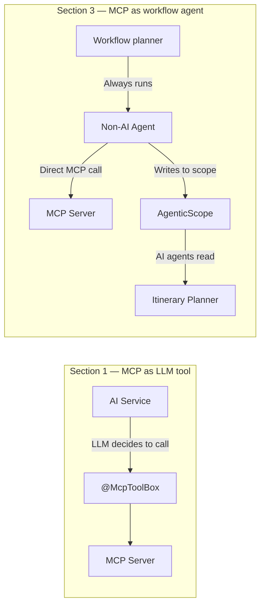
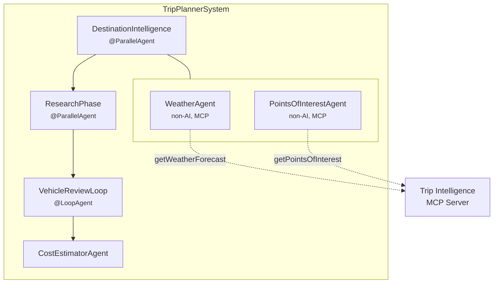

# Step 06 - MCP Integration with @McpClientAgent

## Real-time data for smarter trip plans

The Miles of Smiles trip planner generates solid itineraries, but every recommendation is based entirely on what the language model already knows. It has no way to check whether the destination will be rainy next week or which attractions are actually worth visiting. Customers are starting to notice that a "sunny outdoor itinerary" sometimes lands on a week of thunderstorms.

We'll fix this by adding a **Trip Intelligence MCP server** implemented as a small Quarkus service that exposes weather forecasts and points of interest as MCP tools. On the trip planner side, two new **`@McpClientAgent` interfaces** call these tools deterministically, before any language model runs, and write the results into the workflow's shared state. The itinerary planner and vehicle advisor then incorporate this real data into their responses.

### How this differs from Section 1

In Section 1, Step 08, we used `@McpToolBox` to give an AI service access to MCP tools. The language model decided *when* to call the weather tool, so it might call it or not.

Here, the MCP tools are wrapped as **`@McpClientAgent` interfaces** in the workflow graph. The planner *guarantees* they run at the right step, with no LLM involved. The data is fetched first, then made available to all downstream agents through the `AgenticScope`.



### Updated workflow

The trip planner sequence now starts with a `DestinationIntelligence` phase that fetches weather and points of interest in parallel:



---

## Prerequisites

=== "Option 1: Continue from Step 05"

    ==Stop dev mode in your Step 05 working project and apply the changes below.== Keep your existing model-provider settings and dependencies.

=== "Option 2: Use the completed Step 06 project"

    ==Copy `section-3/step-06` to a working directory and open that copy. Apply your model-provider settings.== The code changes below are already included. Join the hands-on route at [Running the demo](#running-the-demo).

A container runtime (Docker or Podman) is needed for PostgreSQL and Kafka Dev Services. The model provider configuration from Step 05 still applies.

---

## Project structure

Step 06 is a multi-module project with two submodules:

```
step-06/
├── pom.xml              ← parent POM
├── mcp-server/          ← Trip Intelligence MCP server
│   ├── pom.xml
│   └── src/
└── trip-planner/        ← Main trip planner app (MCP client)
    ├── pom.xml
    └── src/
```

This mirrors the structure used in `section-2/step-08` for the A2A remote agent. The MCP server is a standalone Quarkus application that the trip planner connects to over HTTP.

---

## Building the MCP server

The MCP server exposes two tools: `getWeatherForecast` and `getPointsOfInterest`. Both return deterministic stub data based on the destination, so no external API key is needed.

==Create the tool class at `mcp-server/src/main/java/com/tripplanner/mcp/TripIntelligenceTools.java`:==

```java title="TripIntelligenceTools.java"
--8<-- "../../section-3/step-06/mcp-server/src/main/java/com/tripplanner/mcp/TripIntelligenceTools.java"
```

### What to notice

- **`@Tool` and `@ToolArg`** are MCP server annotations from `quarkus-mcp-server-http`. They describe the tool for any MCP client that connects.
- The tools return **JSON strings**, which is the standard MCP tool result format. The trip planner agents receive these strings and pass them to the AI agents as prompt context.
- The data is **deterministic** — the same destination always produces the same forecast. This makes the workshop reproducible without an external weather API.

==Configure the server at `mcp-server/src/main/resources/application.properties`:==

```properties title="application.properties"
--8<-- "../../section-3/step-06/mcp-server/src/main/resources/application.properties"
```

Port 8085 avoids conflicts with the trip planner (8080).

---

## Creating declarative MCP agents

`@McpClientAgent` is a declarative annotation that wraps a single MCP tool as a non-AI agent. You define a Java interface — no implementation class needed — and the framework handles the MCP tool invocation automatically.

==Create `trip-planner/src/main/java/com/tripplanner/agentic/agents/WeatherAgent.java`:==

```java title="WeatherAgent.java"
--8<-- "../../section-3/step-06/trip-planner/src/main/java/com/tripplanner/agentic/agents/WeatherAgent.java"
```

==Create `trip-planner/src/main/java/com/tripplanner/agentic/agents/PointsOfInterestAgent.java`:==

```java title="PointsOfInterestAgent.java"
--8<-- "../../section-3/step-06/trip-planner/src/main/java/com/tripplanner/agentic/agents/PointsOfInterestAgent.java"
```

### What to notice

- **`@McpClientAgent`** declares the MCP tool to call. The `toolName` matches the tool exposed by the MCP server. Method parameters become the tool's input keys automatically.
- **`@McpClientSupplier`** provides the `McpClient` instance. The `@CdiBean` annotation tells Quarkus to resolve the parameter from CDI, and `@McpClientName("tripIntelligence")` selects the named client configured in `application.properties`.
- **`outputKey`** determines the scope key where the result is stored. Downstream agents read `weather` and `pointsOfInterest` from the scope automatically.
- No `@ApplicationScoped`, no manual `ToolExecutionRequest` construction, no JSON wiring — the framework handles it all.

---

## Wiring the DestinationIntelligence phase

==Create `trip-planner/src/main/java/com/tripplanner/agentic/workflow/DestinationIntelligence.java`:==

```java title="DestinationIntelligence.java"
--8<-- "../../section-3/step-06/trip-planner/src/main/java/com/tripplanner/agentic/workflow/DestinationIntelligence.java"
```

==Update `TripPlannerSystem.java` to insert `DestinationIntelligence` as the first step:==

```java hl_lines="4" title="TripPlannerSystem.java (updated subAgents)"
--8<-- "../../section-3/step-06/trip-planner/src/main/java/com/tripplanner/agentic/workflow/TripPlannerSystem.java:12:18"
```

---

## Enriching AI agent prompts

With weather and POI data now in the scope, the AI agents can reference it.

==Update `ItineraryPlannerAgent` to accept `weather` and `pointsOfInterest` parameters and use them in the prompt:==

```java title="ItineraryPlannerAgent.java"
--8<-- "../../section-3/step-06/trip-planner/src/main/java/com/tripplanner/agentic/agents/ItineraryPlannerAgent.java"
```

==Update `VehicleAdvisorAgent` to accept a `weather` parameter:==

```java title="VehicleAdvisorAgent.java"
--8<-- "../../section-3/step-06/trip-planner/src/main/java/com/tripplanner/agentic/agents/VehicleAdvisorAgent.java"
```

==Update `ResearchPhase` to pass the new parameters through:==

```java title="ResearchPhase.java"
--8<-- "../../section-3/step-06/trip-planner/src/main/java/com/tripplanner/agentic/workflow/ResearchPhase.java"
```

---

## Configuring the MCP client

==Add the MCP client dependency to `trip-planner/pom.xml`:==

```xml title="pom.xml (MCP client dependency)"
<dependency>
    <groupId>io.quarkiverse.langchain4j</groupId>
    <artifactId>quarkus-langchain4j-mcp</artifactId>
</dependency>
```

==Add the MCP client configuration to `trip-planner/src/main/resources/application.properties`:==

```properties title="application.properties (MCP client)"
# MCP client — Trip Intelligence Service
quarkus.langchain4j.mcp.tripIntelligence.transport-type=streamable-http
quarkus.langchain4j.mcp.tripIntelligence.url=http://localhost:8085/mcp
```

The `tripIntelligence` name matches the `@McpClientName("tripIntelligence")` qualifier used in the `@McpClientSupplier` methods.

---

## Running the demo

Start the MCP server and trip planner in two separate terminals:

**Terminal 1 — MCP Server:**
```bash
cd section-3/step-06/mcp-server
./mvnw quarkus:dev
```

**Terminal 2 — Trip Planner:**
```bash
cd section-3/step-06/trip-planner
./mvnw quarkus:dev
```

Open the trip planner UI at `http://localhost:8080` and submit a trip plan. In the trip planner terminal, you should see the MCP agents fetch weather and POI data before the AI agents start their work. The itinerary and vehicle recommendation should now reference the weather conditions and local attractions.

---

??? info "Verifying with tests"

    The MCP server has its own test suite:

    ```bash
    cd section-3/step-06/mcp-server
    ./mvnw test
    ```

    The trip planner tests include a unit test validating the `@McpClientAgent` declarations alongside the existing persistence tests:

    ```bash
    cd section-3/step-06/trip-planner
    ./mvnw test
    ```

---

## Troubleshooting

??? warning "Connection refused when starting the trip planner"
    Make sure the MCP server is running on port 8085 before starting the trip planner. The MCP client connects lazily (on first tool call), so the trip planner starts even without the MCP server, but the first trip plan request will fail.

??? warning "Unsatisfied dependency for McpClient"
    Verify that `quarkus-langchain4j-mcp` is in the trip planner's `pom.xml` dependencies and that the `tripIntelligence` name in `application.properties` matches the `@McpClientName` qualifier.

---

## What's next?

The trip planner now integrates real-time external data through MCP, combining declarative `@McpClientAgent` interfaces with LLM-powered reasoning in a single workflow. This pattern scales to any external service that speaks MCP — databases, monitoring systems, or enterprise APIs — without requiring the language model to decide when to call them.
