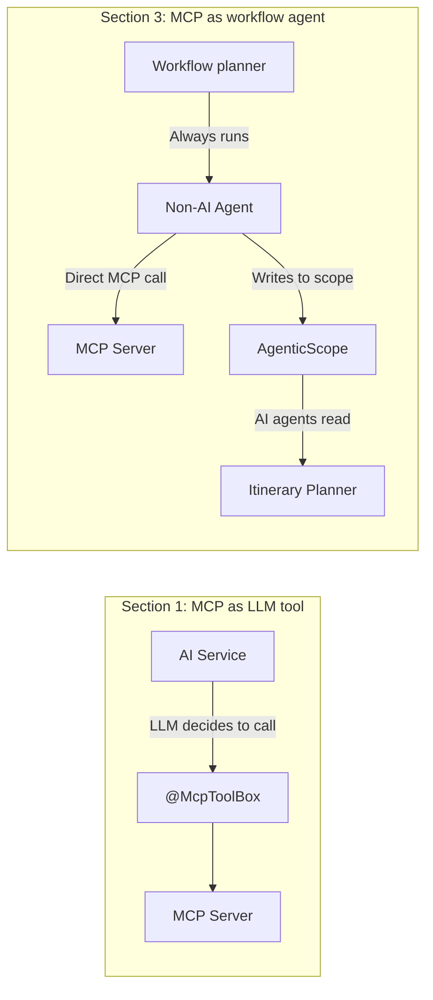
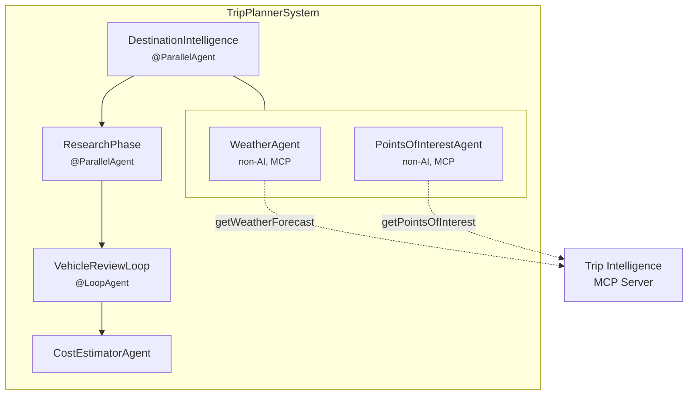
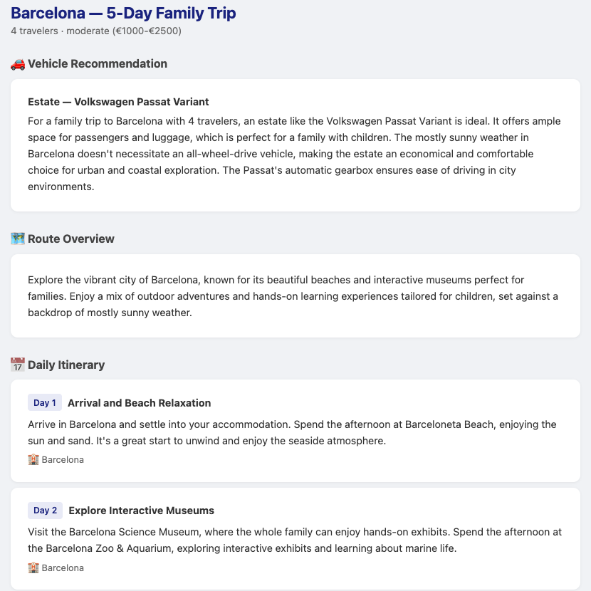
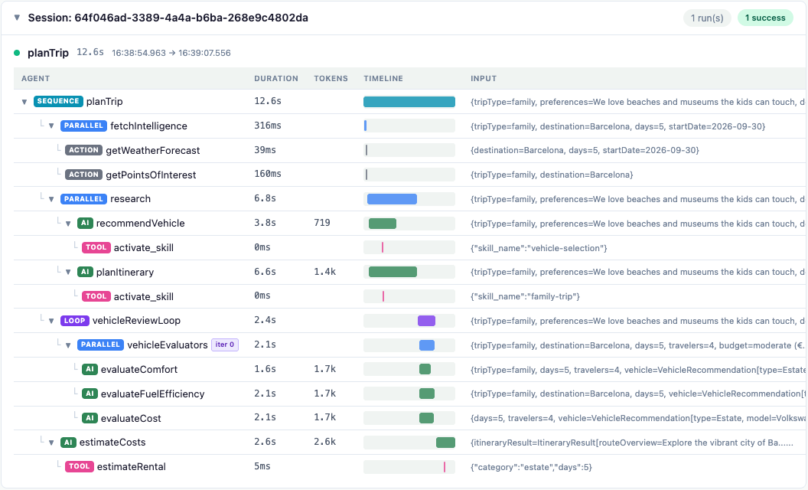

# Step 06 - MCP Integration with Non-AI Agents

## Real-time data for smarter trip plans

The Miles of Smiles trip planner generates solid itineraries, but every recommendation is based entirely on what the language model already knows. It has no way to check whether the destination will be rainy next week or which attractions are actually worth visiting. Customers are starting to notice that a "sunny outdoor itinerary" sometimes lands on a week of thunderstorms. (Management's suggestion to rename these "immersive weather experiences" was not well received.)

We'll fix this with a Trip Intelligence MCP server, a small Quarkus service that exposes weather forecasts and points of interest as MCP tools. On the trip planner side, two new `@McpClientAgent` interfaces call these tools before any language model runs and write the results into the workflow's shared state. The itinerary planner and vehicle advisor then work from real data.

### How this differs from Section 1

In Section 1, Step 08, we used `@McpToolBox` to give an AI service access to MCP tools. The language model decided when to call the weather tool, which meant it sometimes didn't.

This time the MCP tools are wrapped as `@McpClientAgent` interfaces in the workflow graph, so they always run at the same step with no LLM involved. The data is fetched first, then every downstream agent can read it from the `AgenticScope`.


```mermaid
flowchart LR
    subgraph section1["Section 1: MCP as LLM tool"]
        llm1["AI Service"] -->|"LLM decides to call"| mcp1["@McpToolBox"]
        mcp1 --> server1["MCP Server"]
    end

    subgraph section3["Section 3: MCP as workflow agent"]
        planner["Workflow planner"] -->|"Always runs"| agent["Non-AI Agent"]
        agent -->|"Direct MCP call"| server3["MCP Server"]
        agent -->|"Writes to scope"| scope["AgenticScope"]
        scope -->|"AI agents read"| ai["Itinerary Planner"]
    end
```

### Updated workflow

The trip planner sequence now starts with a `DestinationIntelligence` phase that fetches weather and points of interest in parallel:


```mermaid
flowchart TD
    subgraph trip["TripPlannerSystem"]
        direction TB
        intel["DestinationIntelligence<br/><small>@ParallelAgent</small>"]
        research["ResearchPhase<br/><small>@ParallelAgent</small>"]
        loop["VehicleReviewLoop<br/><small>@LoopAgent</small>"]
        cost["CostEstimatorAgent"]

        intel --> research --> loop --> cost

        subgraph intelSub[" "]
            weather["WeatherAgent<br/><small>non-AI, MCP</small>"]
            poi["PointsOfInterestAgent<br/><small>non-AI, MCP</small>"]
        end
        intel --- intelSub
    end

    mcp["Trip Intelligence<br/>MCP Server"]
    weather -.->|"getWeatherForecast"| mcp
    poi -.->|"getPointsOfInterest"| mcp
```

## Prerequisites

=== "Option 1: Continue from Step 05"

    ==Apply the changes below to your Step 05 working project.== Keep your existing model-provider settings and dependencies. Dev mode restarts automatically when it detects `pom.xml` changes.

=== "Option 2: Use the completed Step 06 project"

    ==Copy `section-3/step-06` to a working directory and open that copy. Apply your model-provider settings.== The code changes below are already included. Join the hands-on route at [Running the demo](#running-the-demo).

A container runtime (Docker or Podman) is needed for PostgreSQL and Kafka Dev Services. The model provider configuration from Step 05 still applies.

## Project structure

Step 06 is a multi-module project with two submodules:

```
step-06/
├── pom.xml              ← parent POM
├── mcp-server/          ← Trip Intelligence MCP server
│   ├── pom.xml
│   └── src/
└── trip-planner/        ← Main trip planner app (MCP client)
    ├── pom.xml
    └── src/
```

This mirrors the structure used in `section-2/step-08` for the A2A remote agent. The MCP server is a standalone Quarkus application that the trip planner connects to over HTTP.

## Building the MCP server

The MCP server exposes two tools: `getWeatherForecast` and `getPointsOfInterest`. Points of interest are stored in a PostgreSQL database provided automatically by Dev Services and loaded from `import.sql` at startup. The weather tool returns fixed scenario data instead of calling a live forecast service, so the workshop behaves the same for everyone and needs no external API.

### The PointOfInterest entity

Points of interest are modeled as a JPA entity using Panache:

```java title="PointOfInterest.java"
--8<-- "../../section-3/step-06/mcp-server/src/main/java/com/tripplanner/mcp/model/PointOfInterest.java"
```

The `import.sql` file seeds the database with POI data for several cities (Rome, Barcelona, Florence, Madrid, Paris, Antwerp), each with entries for family, adventure, and business trip types.

### The tool class

==Create the tool class at `mcp-server/src/main/java/com/tripplanner/mcp/TripIntelligenceTools.java`:==

```java title="TripIntelligenceTools.java"
--8<-- "../../section-3/step-06/mcp-server/src/main/java/com/tripplanner/mcp/TripIntelligenceTools.java"
```

`@Tool` and `@ToolArg` come from `quarkus-mcp-server-http` and describe each tool to any MCP client that connects. `getWeatherForecast` picks its response from a configurable scenario, `sunny` by default. The other scenarios are `severe-weather`, `empty-poi`, `malformed-response`, and `timeout`, and you can switch to one by starting the server with `-Dquarkus.profile=<name>` to see how the trip planner copes.

`getPointsOfInterest` uses Panache's `list()` to filter by destination and trip type, and wraps the result in a `PoiCatalog` record. The MCP server serializes that record to JSON on its own, so there is no `ObjectMapper` to wire up. Both tools throw `IllegalArgumentException` for blank or out-of-range input, which reaches the MCP client as a proper error.

==Configure the server at `mcp-server/src/main/resources/application.properties`:==

```properties title="application.properties"
--8<-- "../../section-3/step-06/mcp-server/src/main/resources/application.properties"
```

Port 8085 avoids conflicts with the trip planner (8080). Dev Services automatically provisions a PostgreSQL container for the MCP server, separate from the trip planner's database.

## Creating declarative MCP agents

`@McpClientAgent` is a declarative annotation that wraps a single MCP tool as a non-AI agent. You write a Java interface with no implementation class, and the framework makes the MCP tool call for you.

==Create `trip-planner/src/main/java/com/tripplanner/agentic/agents/WeatherAgent.java`:==

```java title="WeatherAgent.java"
--8<-- "../../section-3/step-06/trip-planner/src/main/java/com/tripplanner/agentic/agents/WeatherAgent.java"
```

==Create `trip-planner/src/main/java/com/tripplanner/agentic/agents/PointsOfInterestAgent.java`:==

```java title="PointsOfInterestAgent.java"
--8<-- "../../section-3/step-06/trip-planner/src/main/java/com/tripplanner/agentic/agents/PointsOfInterestAgent.java"
```

`@McpClientAgent` names the MCP tool to call through `toolName`, and the method parameters become the tool's arguments. `@McpClientSupplier` provides the `McpClient`, and the `@McpClientName("tripIntelligence")` qualifier picks the named client we'll configure in `application.properties`. The result lands in the scope under `outputKey`, so downstream agents can read `weather` and `pointsOfInterest` without any extra wiring.

## Wiring the DestinationIntelligence phase

==Create `trip-planner/src/main/java/com/tripplanner/agentic/workflow/DestinationIntelligence.java`:==

```java title="DestinationIntelligence.java"
--8<-- "../../section-3/step-06/trip-planner/src/main/java/com/tripplanner/agentic/workflow/DestinationIntelligence.java"
```

The `@Output` method calls `DestinationEvidence.validate()` before assembling the combined string. It checks the JSON from the MCP server for required fields and sensible numbers, and makes sure the response is about the destination we asked for. Anything malformed throws `TripIntelligenceException`, which maps to a 502 with error code `intelligence_unavailable`, so the frontend can tell the customer that the destination data was the problem.

==Create `trip-planner/src/main/java/com/tripplanner/agentic/workflow/DestinationEvidence.java`:==

```java title="DestinationEvidence.java"
--8<-- "../../section-3/step-06/trip-planner/src/main/java/com/tripplanner/agentic/workflow/DestinationEvidence.java"
```

==Update `TripPlannerSystem.java` to insert `DestinationIntelligence` as the first step:==

```java hl_lines="4" title="TripPlannerSystem.java (updated subAgents)"
--8<-- "../../section-3/step-06/trip-planner/src/main/java/com/tripplanner/agentic/workflow/TripPlannerSystem.java:12:18"
```

## Enriching AI agent prompts

With weather and POI data now in the scope, the AI agents can reference it.

==Update `ItineraryPlannerAgent` to accept `weather` and `pointsOfInterest` parameters and use them in the prompt:==

```java title="ItineraryPlannerAgent.java"
--8<-- "../../section-3/step-06/trip-planner/src/main/java/com/tripplanner/agentic/agents/ItineraryPlannerAgent.java"
```

==Update `VehicleAdvisorAgent` to accept a `weather` parameter:==

```java title="VehicleAdvisorAgent.java"
--8<-- "../../section-3/step-06/trip-planner/src/main/java/com/tripplanner/agentic/agents/VehicleAdvisorAgent.java"
```

==Update `ResearchPhase` to pass the new parameters through:==

```java title="ResearchPhase.java"
--8<-- "../../section-3/step-06/trip-planner/src/main/java/com/tripplanner/agentic/workflow/ResearchPhase.java"
```

## Configuring the MCP client

The MCP server's `pom.xml` includes `quarkus-hibernate-orm-panache` and `quarkus-jdbc-postgresql` for database access. Dev Services starts a PostgreSQL container for it, so there's no database to set up.

==Run the following command from the `trip-planner/` directory to add the MCP client extension:==

```shell
./mvnw quarkus:add-extension -Dextensions="quarkus-langchain4j-mcp"
```

==Add the MCP client configuration to `trip-planner/src/main/resources/application.properties`:==

```properties title="application.properties (MCP client)"
# MCP client for the Trip Intelligence server
quarkus.langchain4j.mcp.tripIntelligence.transport-type=streamable-http
quarkus.langchain4j.mcp.tripIntelligence.url=http://localhost:8085/mcp
quarkus.langchain4j.mcp.tripIntelligence.tool-execution-timeout=5s
```

The `tripIntelligence` name matches the `@McpClientName("tripIntelligence")` qualifier used in the `@McpClientSupplier` methods.

## Tightening the request validation

In Step 02, the Duration field accepted any number so you could trip the rental tool's input guardrail with something outside 1 to 30 days. Now the MCP server has its own limit: `getWeatherForecast` only accepts trips of up to 30 days. A longer trip would reach the tool, throw an `IllegalArgumentException`, and show up as a generic planning failure that tells the customer nothing.

So the resource now checks the duration before the workflow starts. Anything outside 1 to 30 days gets a 400 with a clear message, and the workflow never runs. The Step 02 guardrail still protects the rental tool's arguments. This check protects the MCP call further upstream.

## Running the demo

The two applications run side by side. ==Start the MCP server first, in its own terminal:==

=== "Linux / macOS"
    ```bash
    cd section-3/step-06/mcp-server
    ./mvnw quarkus:dev
    ```

=== "Windows"
    ```cmd
    cd section-3\step-06\mcp-server
    .\mvnw.cmd quarkus:dev
    ```

==Then start the trip planner in a second terminal:==

=== "Linux / macOS"
    ```bash
    cd section-3/step-06/trip-planner
    ./mvnw quarkus:dev
    ```

=== "Windows"
    ```cmd
    cd section-3\step-06\trip-planner
    .\mvnw.cmd quarkus:dev
    ```

==Open [http://localhost:8080](http://localhost:8080){target="_blank"} and generate a trip plan for one of the seeded cities, such as `Barcelona`.== The itinerary and vehicle recommendation should now mention the forecast and some of the attractions from `import.sql`. The lookup is an exact match on the city name, so `barcelona` or a city missing from the database gets an empty list back. The plan still arrives, but any attractions in it come from the model's own knowledge.

<figure markdown="span">
  { width="600" }
</figure>

==Open the Dev UI, click **Executions** on the LangChain4j Agentic card, and expand the latest run.== The `DestinationIntelligence` phase shows up as `fetchIntelligence`, and it finishes before the research agents start. Its two children, `getWeatherForecast` and `getPointsOfInterest`, are ACTION rows: plain MCP tool calls that take a few milliseconds and use no tokens. The AI rows below them are where the model time goes.



??? info "Verifying with tests"

    The MCP server has its own test suite that verifies both weather computation and database-backed POI queries:

    ```bash
    cd section-3/step-06/mcp-server
    ./mvnw test
    ```

    The trip planner tests check the `@McpClientAgent` interface declarations:

    ```bash
    cd section-3/step-06/trip-planner
    ./mvnw test
    ```

    On Windows, use `.\mvnw.cmd test` in each directory.

## Troubleshooting

??? warning "Connection refused when starting the trip planner"
    Make sure the MCP server is running on port 8085 before starting the trip planner. The MCP client connects lazily (on first tool call), so the trip planner starts even without the MCP server, but the first trip plan request will fail.

??? warning "Unsatisfied dependency for McpClient"
    Verify that `quarkus-langchain4j-mcp` is in the trip planner's `pom.xml` dependencies and that the `tripIntelligence` name in `application.properties` matches the `@McpClientName` qualifier.

??? warning "Trip plan fails with intelligence_unavailable"
    The MCP server returned data the trip planner could not validate. Check that the MCP server is running the default `sunny` scenario and that its database was seeded correctly. If you started the server with a test profile such as `malformed-response` or `timeout`, restart it without that profile.

## What's next?

The trip planner now checks the weather and local attractions before any model starts dreaming up an itinerary, and no language model gets a say in whether those MCP tools are called. In Step 07, we'll find out whether all this effort actually produces good plans, using an evaluation harness and traces in Langfuse.

[Continue to Step 07 - Testing, Evaluation, and Observability](step-07.md)
