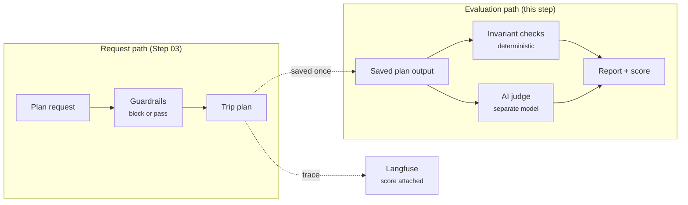

# Step 07 - Testing, Evaluation, and Observability

## Checking that the planner is right, not just plausible

The trip planner now fetches real weather and points of interest before any language model runs. But the plan it returns is still only as good as the model's judgment of that data, and a model that produces a convincing itinerary can still miss the point. The plan for a three-day family trip might skip a rest day, the cost line might come out of a miscalculation, and the vehicle recommendation might ignore the budget because nothing in the pipeline checks it.

This step adds a repeatable way to answer three questions that the demo UI cannot:

- Is a given plan structurally sound? A deterministic check catches a missing vehicle, a gap in the itinerary, or an invalid cost without calling a model.
- Does the plan match what the trip actually requires? A judge model compares the output against an expected plan, and a semantic similarity score measures how close they are even when the wording differs.
- Where did the plan come from? The planning run is traced with OpenTelemetry, the trace is exported to Langfuse, and the evaluation score is attached to the exact trace it was measured from.

The result is an evaluation harness you can run before every change to a prompt or a model: the same samples, the same checks, a report with a score and per-case details. When the score drops, the report points at which sample failed and why.

## How evaluation differs from the guardrails in Step 03

Step 03 added guardrails that block a request or a response when it violates a hard rule, such as a destination with a known safety issue. Those are enforcement mechanisms that sit in the request path.

Evaluation sits outside the request path. It runs against saved outputs of completed planning runs, it produces a score and a report rather than a decision, and it uses a judge model that is separate from the model that produced the plan. A guardrail stops a bad plan from being returned; evaluation tells you, after the fact, how often the planner produces bad plans and which ones.



## Choosing a starting point

=== "Option 1: Continue from Step 06"

    ==Stop dev mode in your Step 06 working project and apply the changes below.== Keep your existing model-provider settings and dependencies.

=== "Option 2: Use the completed Step 07 project"

    ==Copy `section-3/step-07` to a working directory and open that copy. Apply your model-provider settings.== The code changes below are already included. Join the hands-on route at [Running the offline suite](#running-the-offline-suite).

The same prerequisites from Step 06 apply: a model provider key, a container runtime for the Dev Services the planner needs, and the Trip Intelligence MCP server running on port 8085 for the live evaluation runs.

## The saved output

Everything in this step evaluates one thing: the text form of a completed plan. The harness renders a `TripPlan` to a stable, line-oriented format so that an invariant check, a judge comparison, and a fixture all agree on the same input.

```java title="TripPlanText.java"
--8<-- "../../section-3/step-07/trip-planner/src/test/java/com/tripplanner/evaluation/TripPlanText.java"
```

Rendering is deliberately mechanical. One line per day, one line for the vehicle, one for the route, one for the cost total. A plan that is structurally broken in the `TripPlan` shows up as a broken rendering, which is exactly what the checks below look for.

## The invariant gate

The cheapest way to catch a broken plan is to check its shape with plain Java. The invariant strategy inspects the saved text for the properties every valid plan must have, and it does not call a model at any point, so it runs in milliseconds and costs nothing.

```java title="TripPlanInvariantStrategy.java"
--8<-- "../../section-3/step-07/trip-planner/src/test/java/com/tripplanner/evaluation/TripPlanInvariantStrategy.java"
```

The strategy implements the `EvaluationStrategy<String>` interface from the `quarkus-langchain4j-testing-evaluation` modules, which is the same interface the judge and similarity strategies use. A strategy takes the sample and the actual output and returns an `EvaluationResult` with a score from 0 to 1, a pass or fail decision, and a reason.

The fixture that drives the gate is a file of deliberately invalid plans:

```yaml title="known-bad.yaml"
--8<-- "../../section-3/step-07/trip-planner/src/test/resources/evaluation/known-bad.yaml"
```

Each entry is a plan text with a specific defect, and the test asserts that the strategy fails it and names the defect in the result. When you add a new invariant, add a matching entry here so the check is pinned by a fixture rather than only by the passing case.

## The judge

The invariant gate checks structure. It cannot tell you that the plan is for the wrong season, or that the reasoning for the vehicle contradicts the trip. For that, the harness asks a model to judge the output against the expected output for the same sample.

The judge is a separate model invocation from the planning run. In the tests it is the same configured model, but it runs with its own prompt and is never in the planning path, so its usage stays separable from the planner's measurements.

```java title="TripPlanJudge.java"
--8<-- "../../section-3/step-07/trip-planner/src/test/java/com/tripplanner/evaluation/TripPlanJudge.java"
```

The rubric is a plain text file the judge reads:

```text title="rubric.txt"
--8<-- "../../section-3/step-07/trip-planner/src/test/resources/evaluation/rubric.txt"
```

!!! note "The verdict must be the word `true` or `false`"
    The `AiJudgeStrategy` parses the model's answer with `Boolean.parseBoolean`. Anything that is not the single word `true` or `false`, including a JSON object with a score and an explanation, is read as a failing verdict. Ask the judge for the word, not a structured object, or a good plan will be marked a failure because the verdict was too well formatted.

The offline test `TripPlanJudgeContractTest` pins this contract with a scripted model: a `true` verdict passes, a `false` verdict fails, and a JSON or prose verdict fails. This protects the gate against a model or a prompt change that starts returning structured answers.

## Repeated experiments

A single evaluation run is a snapshot. The useful question is what happens when you run the same sample again, with the same inputs, and compare the results. The harness records each run with its input, its saved output, the evidence captured during the run, the trace id, the model used, and the per-strategy outcomes.

```java title="EvaluationRun.java"
--8<-- "../../section-3/step-07/trip-planner/src/test/java/com/tripplanner/evaluation/EvaluationRun.java"
```

The recorder keeps every run per sample, so a follow-up run is compared against the first rather than replacing it. The test `EvaluationRunRecorderTest` checks that a repeated experiment retains comparable inputs and evidence, and that the aggregate score is the mean of the per-strategy scores.

## Running the offline suite

The offline suite runs the invariant gate, the judge contract, the scorer, and the recorder against the fixtures, with no model provider, no container runtime, and no network.

==Run the default test suite in `section-3/step-07/trip-planner`:==

```shell
cd section-3/step-07/trip-planner
./mvnw test
```

The suite loads the samples from `src/test/resources/evaluation/samples.yaml`, applies the invariant strategy to known-good and known-bad outputs, and saves a report. The samples are the requests the harness will also use in the live runs, so the offline and live suites share one set of inputs.

=== "samples.yaml"

    ```yaml
    --8<-- "../../section-3/step-07/trip-planner/src/test/resources/evaluation/samples.yaml"
    ```

When you change a prompt, a skill, or a model, run this suite first. It is fast enough to run after every edit, and a red invariant check on a known-good sample means the rendering or the plan shape changed in a way the gate now detects.

## Live evaluation

The offline suite evaluates saved outputs. The live suite runs the planner for real and evaluates the result, so it catches problems the saved-output checks cannot: a prompt change that makes the model ignore the MCP data, or a tool result that no longer validates.

The live suite runs under the `evals` Maven profile, which selects the `*LiveIT` classes through Failsafe. The default `./mvnw test` never runs them.

### The composition run

The composition run drives the full planning graph with a scripted model while the two `@McpClientAgent` subagents call the real Trip Intelligence server. No LLM is called, so it is cheap to run, but it exercises the argument flow, the MCP data path, and the request isolation of the complete workflow. Each saved output is checked by the invariant strategy and recorded.

==Start the MCP server in `section-3/step-07/mcp-server`, then run the composition IT:==

```shell
./mvnw -f section-3/step-07/pom.xml -pl trip-planner -Pevals -Dit.test=TripPlannerCompositionLiveIT -Dquarkus.http.test-port=0 verify
```

The IT asserts that the real fixture data reached the research agents, that the saved plan passes the invariants, and that a second request for a different destination is independent of the first.

### The quality run

The quality run performs one real planning run with your configured model, captures the planning trace while the root span is current, applies the invariant strategy and the judge to the saved output, and publishes the resulting score to Langfuse. It then verifies through the score API that the score landed on exactly the trace of the run it measured.

==Run the quality IT with a container runtime available:==

```shell
./mvnw -f section-3/step-07/pom.xml -pl trip-planner -Pevals -Dit.test=TripPlanQualityEvaluationLiveIT -Dquarkus.http.test-port=0 verify
```

The first run pulls the Langfuse Dev Services images, which is a several-hundred-megabyte download. Subsequent runs reuse them.

### Tracing and the score

The quality run opens a root span around the planning call. The agent invocations inside the planner create child spans on the same trace, so the trace contains the full run, including the LLM calls and the MCP tool calls. The test captures the trace id while the span is open, because the id is only stable while the span is current.

The score is attached to that trace id when it is published:

```java title="LangfuseScorePublisher.java"
--8<-- "../../section-3/step-07/trip-planner/src/test/java/com/tripplanner/evaluation/LangfuseScorePublisher.java"
```

Score ingestion in Langfuse is asynchronous, so the test retries the verification rather than assuming the score is queryable immediately after creation. The test also checks that the score is not queryable on an unrelated trace, which confirms the attachment targeted the right run rather than simply being accepted.

The export configuration matters. The Langfuse exporter keeps spans that carry `gen_ai` attributes and their ancestors by default, which drops a bare planning root span that has no model call attached. The live profile sets `quarkus.langfuse.otel.span-filter=ALL` so the full planning run appears in the trace.

## What to look for in Langfuse

With the quality run complete, the Langfuse UI shows the planning trace with its spans and the attached `plan-quality` score. The score's metadata carries the sample id and the model name, so you can filter by sample or by model when you run the suite several times.

Use the trace to read what the run actually did. The LLM spans show the prompts and responses, and the MCP spans show the tool calls and their results. If a sample fails its judge check, the trace is where you find out whether the model ignored the MCP data, reasoned from it, or produced a plan the judge could not match to the expected output.

## What's next?

The trip planner is now backed by a repeatable evaluation harness: deterministic invariant checks catch structural problems without calling a model, a judge measures qualitative fitness against a rubric, and every live run produces a trace in Langfuse with its evaluation score attached. That's the end of Section 3. Head to the [conclusion](conclusion.md) for a recap of the enterprise patterns you've built across all three sections.
