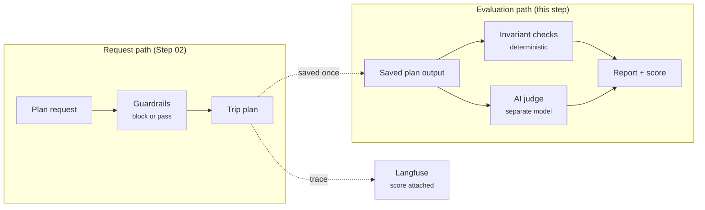
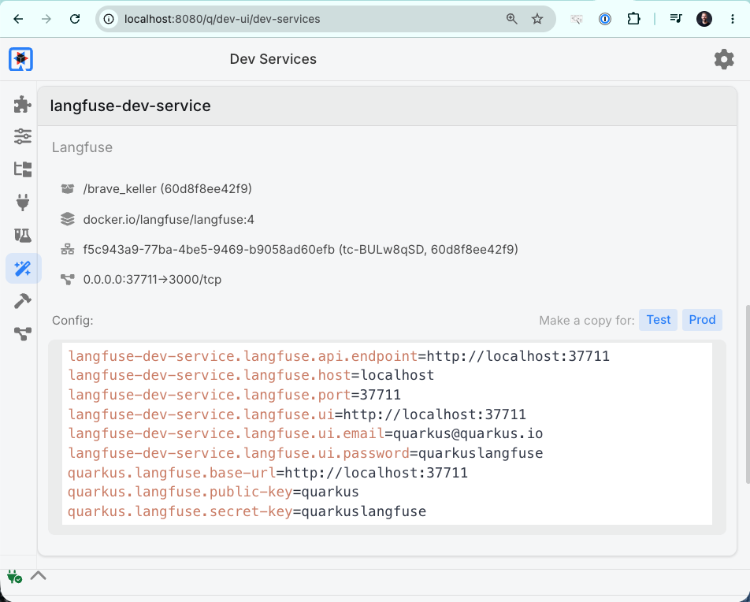
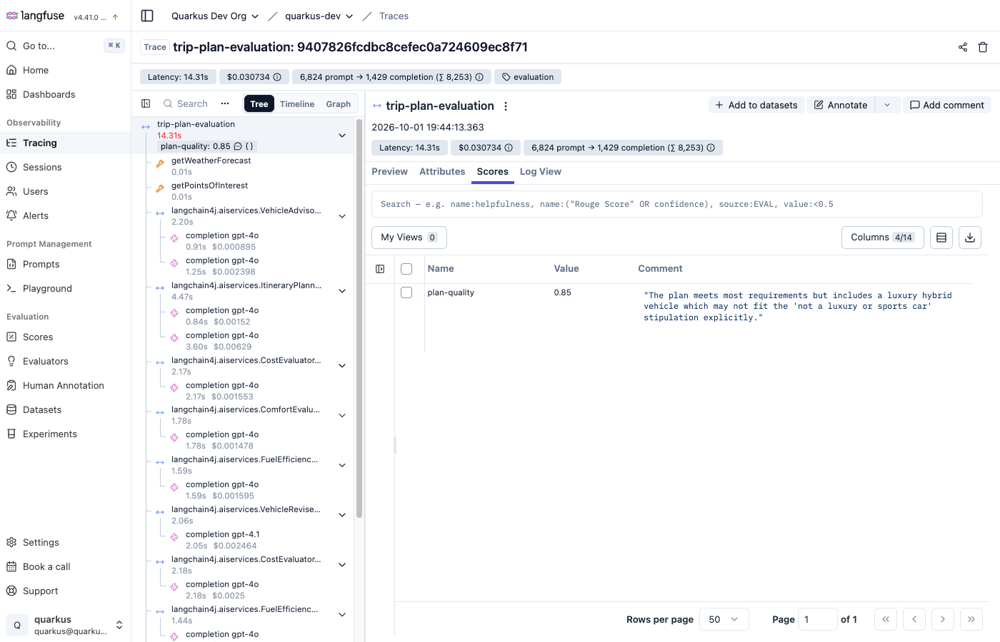
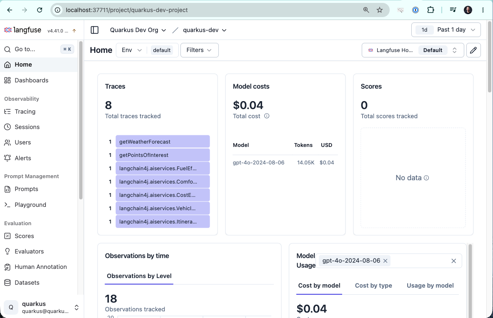
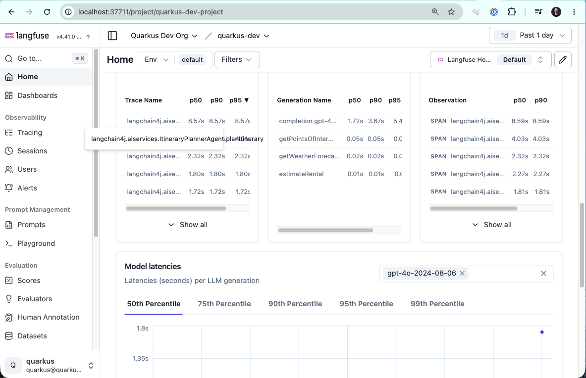

# Step 07 - Testing, Evaluation, and Observability

## Is the plan any good?

The trip planner now fetches real weather and points of interest before any language model runs. But the plan it returns is still only as good as the model's judgment of that data, and a model that produces a convincing itinerary can still miss the point. The plan for a three-day family trip might skip a rest day, the cost line might come out of a miscalculation, and the vehicle recommendation might ignore the budget because nothing in the pipeline checks it.

Clicking through the demo UI won't tell you any of that, so this step adds checks you can repeat. A plain Java check catches a missing vehicle, a gap in the itinerary, or an invalid cost without calling a model. A judge model then reads the plan and decides whether it meets a short list of requirements you wrote for that trip. Finally, the planning run is traced with OpenTelemetry and exported to Langfuse, and the evaluation score is attached to the trace it was measured from.

You'll write the parts that carry the most judgment yourself: the LLM judge for the vehicle guardrail, the evaluation samples, and the rubric. The test harness around them is supplied, and we'll walk through the parts worth understanding.

## How evaluation differs from the guardrails in Step 02

Step 02 added guardrails that block a request or a response when it violates a hard rule, such as a destination with a known safety issue. Those are enforcement mechanisms that sit in the request path.

Evaluation sits outside the request path. It runs against the saved output of completed planning runs, produces a score and a report, and uses a judge model that is separate from the one that wrote the plan. A guardrail stops a bad plan from reaching the customer. Evaluation tells you afterwards how often the planner produces bad plans, and which ones.


```mermaid
flowchart LR
    subgraph runtime["Request path (Step 02)"]
        req["Plan request"] --> gr["Guardrails<br/><small>block or pass</small>"]
        gr --> plan["Trip plan"]
    end

    subgraph eval["Evaluation path (this step)"]
        saved["Saved plan output"] --> inv["Invariant checks<br/><small>deterministic</small>"]
        saved --> judge["AI judge<br/><small>separate model</small>"]
        inv --> rep["Report + score"]
        judge --> rep
        plan -.->|"saved once"| saved
    end

    plan -.->|"trace"| lf["Langfuse<br/><small>score attached</small>"]
```

## Choosing a starting point

=== "Option 1: Continue from Step 06"

    ==Stop dev mode in your Step 06 working copy, then copy `trip-planner/pom.xml` from `section-3/step-07` into it. Keep any local model-provider dependencies you added earlier.== This brings in OpenTelemetry, the Langfuse extension, the evaluation modules, the Surefire includes for the offline suite, and the `evals` profile for the live runs.

    ==Remove the Step 06 tests from your working copy: `src/test/java/com/tripplanner/agentic/`, `src/test/java/com/tripplanner/mcp/`, and `src/test/frontend/`.== They stay in Step 06, and this step only runs the evaluation suite.

    ==Then follow the page from [Upgrading the vehicle guardrail](#upgrading-the-vehicle-guardrail-to-an-llm-judge) onwards.== The first dev mode start after the POM change takes longer than usual, because Dev Services pulls and starts the Langfuse containers.

=== "Option 2: Use the completed Step 07 project"

    ==Copy `section-3/step-07` to a working directory and open that copy. Apply your model-provider settings.== Every file on this page is already there, so you can read along and join the hands-on part at [Running the offline suite](#running-the-offline-suite).

The same prerequisites from Step 06 apply: a model provider key, a container runtime for Dev Services, and the Trip Intelligence MCP server from Step 06 running on port 8085 for the live evaluation runs.

## Upgrading the vehicle guardrail to an LLM judge

The `TripAppropriatenessGuardrail` in Steps 02–06 uses a hardcoded list of brand names to detect luxury vehicles on economy budgets. That list catches the obvious supercars but misses premium SUVs and saloons that are just as unaffordable on an economy budget. (The Miles of Smiles board found this out while reviewing last quarter's expense reports, and learned that a Land Rover Discovery is not an economy car.) In this step we replace the list with an LLM judge that reads the vehicle type, model name, and the agent's reasoning together.

==Create `src/main/java/com/tripplanner/guardrails/BudgetVerdict.java`:==

```java title="BudgetVerdict.java"
--8<-- "../../section-3/step-07/trip-planner/src/main/java/com/tripplanner/guardrails/BudgetVerdict.java"
```

==Create `src/main/java/com/tripplanner/guardrails/VehicleBudgetJudge.java`:==

```java title="VehicleBudgetJudge.java"
--8<-- "../../section-3/step-07/trip-planner/src/main/java/com/tripplanner/guardrails/VehicleBudgetJudge.java"
```

`VehicleBudgetJudge` is a `@RegisterAiService` bound to a named model called `judgeModel`. It is `@ApplicationScoped` because the guardrail runs on Quarkus Flow executor threads, which have no HTTP request context. With the default `@RequestScoped` proxy, every call would fail with `RequestScoped context was not active`. The system prompt tells the judge to be strict, so any doubt means the vehicle is not appropriate. The user message passes the budget tier, vehicle type, vehicle model, and the agent's own reasoning.

==Update `src/main/java/com/tripplanner/guardrails/TripAppropriatenessGuardrail.java` to inject and use the judge:==

```java title="TripAppropriatenessGuardrail.java"
--8<-- "../../section-3/step-07/trip-planner/src/main/java/com/tripplanner/guardrails/TripAppropriatenessGuardrail.java"
```

For economy budgets, the guardrail first checks `OBVIOUS_LUXURY_BRANDS`, a short list of supercars such as Ferrari and Lamborghini, so clear-cut cases don't need a judge call. Everything else goes to the judge. Obvious cases stay cheap, and the ambiguous ones, like a Land Rover Discovery for a five-person economy trip, get the full LLM reasoning.

==Add the `judgeModel` configuration to `src/main/resources/application.properties`:==

```properties title="application.properties (judgeModel)"
# Judge model for LLM-based guardrail evaluation (fast, cheap)
quarkus.langchain4j.judgeModel.chat-model.provider=openai
quarkus.langchain4j.openai.judgeModel.api-key=${OPENAI_API_KEY}
quarkus.langchain4j.openai.judgeModel.chat-model.model-name=gpt-4o-mini
quarkus.langchain4j.openai.judgeModel.chat-model.temperature=0
quarkus.langchain4j.openai.judgeModel.timeout=30
```

`gpt-4o-mini` at temperature 0 is fast and consistent enough for a yes-or-no budget verdict. Because it is a named model, its cost shows up separately from the planner's in Langfuse.

## What the new POM brings in

The evaluation harness uses the `quarkus-langchain4j-testing-evaluation` modules for sample loading, scoring, and the AI judge. OpenTelemetry traces the planning run, and the Langfuse extension receives those traces and the scores we attach to them.

```xml title="pom.xml (evaluation dependencies)"
--8<-- "../../section-3/step-07/trip-planner/pom.xml:76:114"
```

`quarkus-opentelemetry` and `quarkus-langfuse` are runtime dependencies, so Langfuse Dev Services starts with dev mode from now on. The rest are test-scoped. The POM also limits the default `./mvnw test` to the four offline test classes, and adds an `evals` profile that runs only the `*LiveIT` classes through Failsafe, so a plain test run never calls a model.

## Writing evaluation samples

The harness needs a set of known trip requests, each with a description of what a good plan for it looks like. Both the offline and live suites use these samples.

==Create `src/test/resources/evaluation/samples.yaml`:==

```yaml title="samples.yaml"
--8<-- "../../section-3/step-07/trip-planner/src/test/resources/evaluation/samples.yaml"
```

Each sample has a name, the planner parameters (destination, date, days, travel style, travelers, budget, interests), an expected output, and tags. A real model never writes the same plan twice, so comparing plans word for word would fail every run. The expected output lists what any acceptable plan for that request has to get right: the right number of days, a vehicle that fits the group, activities that match the travel style and interests, and a cost that suits the budget. The invariant checks only use the parameters. The judge uses the expected output.

## Writing the judge rubric

The invariant checks look at structure. They can't tell you that the plan is for the wrong season, or that the vehicle reasoning contradicts the trip requirements. For that, a judge model reads the plan and checks it against the sample's expected output, using a rubric you write.

==Create `src/test/resources/evaluation/rubric.txt`:==

```text title="rubric.txt"
--8<-- "../../section-3/step-07/trip-planner/src/test/resources/evaluation/rubric.txt"
```

The rubric tells the judge to fail the plan if it misses any requirement, and not to care about wording or extra detail. It also asks for the single word `true` or `false`. That last instruction matters more than it looks, as we'll see when we get to the judge's code.

## Adding the supplied evaluation code

The rest of the harness is test plumbing: rendering a plan as text, loading fixtures, recording runs, and publishing scores. It's supplied so you can spend the time on what the checks do.

==For the hands-on route, copy these paths from `section-3/step-07/trip-planner` to the same paths in your working copy:==

- `src/test/java/com/tripplanner/evaluation/` (the strategies, the judge wrapper, the recorder, the score publisher, and all the tests)
- `src/test/resources/evaluation/known-bad.yaml` (plans with deliberate defects)
- `src/test/resources/application.properties` (test profiles for the offline, composition, and quality runs)
- `src/main/java/com/tripplanner/agentic/TracingExecutorSetup.java` (keeps one planning run in one trace)

`TripPlanText` turns a `TripPlan` into pretty-printed JSON and back. Everything in this step evaluates that text form, the same way you'd evaluate a plan saved from production.

### The invariant checks

The cheapest way to catch a broken plan is to check its shape with plain Java. `TripPlanInvariantStrategy` implements `EvaluationStrategy<String>` from the evaluation module, and it never calls a model, so it runs in milliseconds and costs nothing.

```java title="TripPlanInvariantStrategy.java (the checks)"
--8<-- "../../section-3/step-07/trip-planner/src/test/java/com/tripplanner/evaluation/TripPlanInvariantStrategy.java:26:71"
```

The requested duration comes from the sample's third parameter. The strategy collects every problem it finds instead of stopping at the first one: missing vehicle fields, the wrong number of days, a duplicate or out-of-range day, and a total that isn't a plain euro amount. A plan with no problems scores 1, and anything else scores 0 with the list of problems as the reason.

The checks need tests of their own, or you won't notice when one stops catching anything. `known-bad.yaml` pins five defects: a null vehicle, a gap in the itinerary days, a negative cost, a non-numeric cost, and an empty output. `TripPlanInvariantStrategyTest` asserts that each of them fails with the right reason, and that a complete plan passes.

### How the judge reads a verdict

`TripPlanJudge` wraps `AiJudgeStrategy`, loads your rubric, and records which model class did the judging.

```java title="TripPlanJudge.java"
--8<-- "../../section-3/step-07/trip-planner/src/test/java/com/tripplanner/evaluation/TripPlanJudge.java:22:44"
```

`AiJudgeStrategy` parses the verdict with `Boolean.parseBoolean`. A judge that answers with a JSON object or a polite sentence explaining that the plan is lovely reads as `false`. `TripPlanJudgeContractTest` checks this rule with a scripted model that returns a fixed string, so it needs no network. A `true` verdict passes, and `false`, JSON, and prose all fail.

### Keeping one planning run in one trace

The vehicle and itinerary research run as parallel agents. LangChain4j runs parallel branches on an executor it gets from its `ExecutorProvider`, and by default that executor doesn't carry the OpenTelemetry context over to the new thread. Each branch would then start a trace of its own, and a single planning run would show up in Langfuse as a handful of unrelated traces.

```java title="TracingExecutorSetup.java"
--8<-- "../../section-3/step-07/trip-planner/src/main/java/com/tripplanner/agentic/TracingExecutorSetup.java:20:31"
```

At startup, the class wraps the Quarkus managed executor with `Context.taskWrapping()`, which copies the current trace context into every task it runs, and hands it to LangChain4j. Every agent of one planning run now lands in the same trace, which is what lets us attach one score to one run.

??? info "Recording runs and publishing scores"
    `EvaluationRun` holds everything about one run: the sample, the inputs, the saved output, some evidence, the trace id, the model name, and one `StrategyOutcome` per strategy. `aggregateScore()` is the mean of the strategy scores.

    ```java title="EvaluationRun.java"
    --8<-- "../../section-3/step-07/trip-planner/src/test/java/com/tripplanner/evaluation/EvaluationRun.java"
    ```

    `EvaluationRunRecorder` keeps every run per sample in memory, so a follow-up run sits next to the first one instead of replacing it. `inputsMatch()` spots a repeated experiment that quietly used different parameters. `EvaluationRunRecorderTest` covers both.

    ```java title="EvaluationRunRecorder.java"
    --8<-- "../../section-3/step-07/trip-planner/src/test/java/com/tripplanner/evaluation/EvaluationRunRecorder.java"
    ```

    `LangfuseScorePublisher` creates a numeric score on the run's trace id, with the sample id and model name as metadata. `scoreIsQueryable()` checks whether Langfuse shows the score on a given trace yet. Langfuse ingests scores asynchronously, so callers retry until it shows up.

    ```java title="LangfuseScorePublisher.java"
    --8<-- "../../section-3/step-07/trip-planner/src/test/java/com/tripplanner/evaluation/LangfuseScorePublisher.java"
    ```

## Running the offline suite

The offline suite runs the invariant, judge contract, recorder, and harness tests against the fixtures, with no model provider, no container runtime, and no network. `TripPlanEvaluationHarnessTest` builds a valid plan for each sample in `samples.yaml`, checks that they all pass, and saves a JSON report. It also makes sure a one-day plan can't pass a sample that asks for a longer trip.

==Run the default test suite from your `trip-planner` directory:==

=== "Linux / macOS"
    ```bash
    ./mvnw test
    ```

=== "Windows"
    ```cmd
    .\mvnw.cmd test
    ```

The suite takes a few seconds, so make it your first stop whenever you change a prompt, a skill, or a model. A red invariant check on a known-good sample means the plan's shape changed.

## Test profiles for the live runs

The supplied test `application.properties` has one profile per kind of run. The `%test` profile turns off Langfuse Dev Services and points the exporters at a dead endpoint, so the offline suite needs nothing running. The `%mcp` profile does the same for the composition run, which only checks plan structure.

```properties title="src/test/resources/application.properties (telemetry profiles)"
--8<-- "../../section-3/step-07/trip-planner/src/test/resources/application.properties:19:51"
```

The `%evals` profile is the interesting one. It sends traces and scores to the Langfuse that dev mode started, so they're still there after the test JVM exits. A Langfuse the test started for itself would be removed along with the JVM, taking the evidence with it. The keys are the Langfuse Dev Services defaults, and you'll pass the URL on the command line. The span filter is widened to `ALL` because the planning root span has no `gen_ai` attributes and would otherwise be dropped. With `ALL`, every HTTP client call would also become a trace, including the test's own polling of the score API, so Vert.x HTTP instrumentation is turned off for this profile.

## Live evaluation: the composition run

The composition run drives the full planning graph with a scripted model while the two `@McpClientAgent` subagents call the real Trip Intelligence server. No LLM is called, so it's cheap, but it exercises the argument flow, the MCP data path, and request isolation for the complete workflow.

`TripPlannerCompositionLiveIT` plans a Rome trip, checks that the weather and points of interest from the MCP server reached the itinerary planner's prompt, runs the invariant strategy on the saved output, and records the result. A second test plans two trips in a row and checks that the first plan doesn't pick up the second request's destination. Before each test, it probes the MCP server on port 8085 and skips if the server isn't running the sunny fixture.

==With the MCP server running, run the composition IT from your `trip-planner` directory:==

=== "Linux / macOS"
    ```bash
    ./mvnw -Pevals -Dit.test=TripPlannerCompositionLiveIT -Dquarkus.http.test-port=0 verify
    ```

=== "Windows"
    ```cmd
    .\mvnw.cmd -Pevals -Dit.test=TripPlannerCompositionLiveIT -Dquarkus.http.test-port=0 verify
    ```

## Live evaluation: the quality run

The quality run does one real planning run with your configured model, applies the invariant strategy and the judge to the saved output, and publishes the result to Langfuse as a `plan-quality` score. It then asks the score API whether the score landed on exactly the trace of the run it measured.

The test loads the `rome-family-three-days` sample from `samples.yaml`, opens a root span around the planning call, and grabs the trace id while that span is still current:

```java title="TripPlanQualityEvaluationLiveIT.java (capturing the trace)"
--8<-- "../../section-3/step-07/trip-planner/src/test/java/com/tripplanner/evaluation/TripPlanQualityEvaluationLiveIT.java:76:95"
```

The invariant check and the judge both get the same sample, and the judge compares the plan with that sample's requirements. The test injects the judge's model with `@ModelName("judgeModel")`, the same gpt-4o-mini the budget guardrail uses. Without it the test would get the default model, which is the gpt-4o that wrote the plan, and nobody should mark their own homework. The test then publishes the aggregate score to that trace and waits for Langfuse to report it:

```java title="TripPlanQualityEvaluationLiveIT.java (publishing the score)"
--8<-- "../../section-3/step-07/trip-planner/src/test/java/com/tripplanner/evaluation/TripPlanQualityEvaluationLiveIT.java:122:131"
```

A last check makes sure the score didn't end up on an unrelated trace. The judge's own model call is a separate trace, so its cost never gets mixed up with the planner's.

The test is skipped unless you pass `quarkus.langfuse.base-url`, and it needs dev mode running so there's a Langfuse to send to.

==Start dev mode in your working project with `./mvnw quarkus:dev` (`.\mvnw.cmd quarkus:dev` on Windows) and keep the MCP server running. Open the Dev UI at [http://localhost:8080/q/dev](http://localhost:8080/q/dev){target="_blank"}, go to **Dev Services**, and copy the `quarkus.langfuse.base-url` value from the Langfuse entry.==



The same page has the Langfuse login, `quarkus@quarkus.io` with the password `quarkuslangfuse`. The Extensions page also has a Quarkus Langfuse card with a direct link to the Langfuse UI.

==In a second terminal, run the quality IT from your `trip-planner` directory, using the URL you copied:==

=== "Linux / macOS"
    ```bash
    ./mvnw -Pevals -Dit.test=TripPlanQualityEvaluationLiveIT -Dquarkus.http.test-port=0 \
        -Dquarkus.langfuse.base-url=http://localhost:<port> verify
    ```

=== "Windows"
    ```cmd
    .\mvnw.cmd -Pevals -Dit.test=TripPlanQualityEvaluationLiveIT -Dquarkus.http.test-port=0 -Dquarkus.langfuse.base-url=http://localhost:<port> verify
    ```

The run takes under a minute, most of it spent waiting for the model. (Miles of Smiles management asked whether the score could simply be set to 1.00 in `application.properties` to save time. It cannot.)

??? info "Complete quality IT"
    ```java title="TripPlanQualityEvaluationLiveIT.java"
    --8<-- "../../section-3/step-07/trip-planner/src/test/java/com/tripplanner/evaluation/TripPlanQualityEvaluationLiveIT.java"
    ```

## What to look for in Langfuse

==Open Langfuse from the Quarkus Langfuse card, log in, and go to **Traces**. Open the `trip-plan-evaluation` trace and select the **Scores** tab.==



The whole planning run is one tree. The MCP calls for the weather and points of interest come first, then the vehicle advisor and itinerary planner with their guardrails, the three evaluators, and the cost estimator with its pricing tool. The header shows the latency, cost, and token counts for the run, next to the `plan-quality` score. The score's comment records which checks passed, and its metadata carries the sample id and the model name, so you can filter by either when you run the suite several times.

Use the trace to read what the run actually did. The LLM spans show the prompts and responses, and the MCP spans show the tool calls and their results. If a sample fails its judge check, the trace is where you find out whether the model ignored the MCP data, reasoned from it, or produced a plan that missed one of the sample's requirements.

The project dashboard adds up the runs, with model costs and the trace names for every agent and tool.



Scroll down to see trace latencies, generation times, and observation spans. The tooltip on a trace name shows the full agent class and method, so you can match a slow span to a specific agent in your code.



## What's next?

The trip planner now has an evaluation harness that checks each plan's structure without calling a model and asks a judge model to score the rest, with every live score attached to its Langfuse trace. That's the end of Section 3. Head to the [conclusion](conclusion.md) for a recap of everything you've built.
