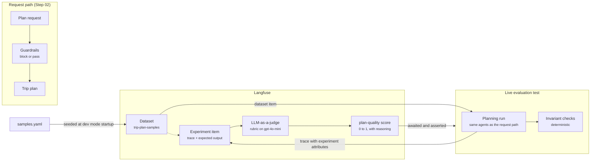
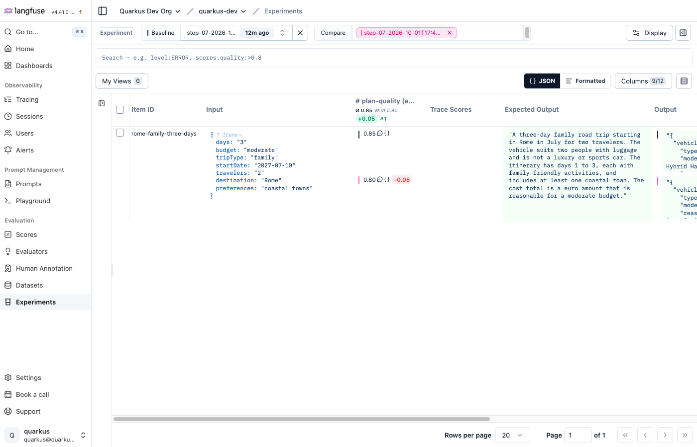

# Step 07 - Testing, Evaluation, and Observability

In Step 06, we connected the planner to weather and points-of-interest tools through MCP so it could use their results when recommending a trip. Even with those details, the model still has to choose activities that fit the customer's request. It might for example recommend three days of sightseeing in Rome's historical center when the family specifically asked to visit coastal towns. Milles of Smiles could wait for customer feedback to improve their systems, but management would prefer to be more proactive about improving the results.

We need a way to check whether changes to our prompts, skills, or models actually improve the results, or at least don't make them worse. 
We'll define a few trip requests and describe what an acceptable result should contain. We'll then implement checks in deterministic Java code that will catch structural problems, such as a missing itinerary day, while a judge model in Langfuse will assess the recommendations against the requirements. After running an evaluation, we'll inspect the score and the judge's explanation.

## Evaluating trip plans

Evaluation lets us repeat a trip request after changing the planner and compare the results against the same requirements. We'll use OpenTelemetry to record each planning run as a trace and send it to Langfuse, where a separate judge model scores the completed plan. Langfuse stores the request and its requirements together as a dataset item, so each new run can be assessed against the same criteria.

!!! note "Evaluation vs step 2's guardrails"
    The guardrails from Step 02 check agent responses while the customer is waiting for a plan. They can correct a response or ask the model to try again before the workflow continues. Evaluation runs separately to assess completed plans against a set of test requests.


```mermaid
flowchart LR
    subgraph runtime["Request path (Step 02)"]
        req["Plan request"] --> gr["Guardrails<br/><small>block or pass</small>"]
        gr --> plan["Trip plan"]
    end

    yaml["samples.yaml"] -->|"seeded at dev mode startup"| ds

    subgraph lf["Langfuse"]
        ds["Dataset<br/><small>trip-plan-samples</small>"]
        item["Experiment item<br/><small>trace + expected output</small>"]
        judge["LLM-as-a-judge<br/><small>rubric on gpt-4o-mini</small>"]
        score["plan-quality score<br/><small>0 to 1, with reasoning</small>"]
        ds -.-> item
        item --> judge --> score
    end

    subgraph test["Live evaluation test"]
        run["Planning run<br/><small>same agents as the request path</small>"]
        inv["Invariant checks<br/><small>deterministic</small>"]
        run --> inv
    end

    ds -->|"dataset item"| run
    run -->|"trace with experiment attributes"| item
    score -->|"awaited and asserted"| test
```

The test checks the plan's structure before waiting for the Langfuse score. It then fails if the score is below the required threshold. We'll inspect the trace to understand what the judge found and whether its assessment agrees with the plan.

## Prepare the working copy

=== "Option 1: Continue from Step 06"

    ==Stop dev mode in your Step 06 working copy, then copy `section-3/step-07/trip-planner/pom.xml` to `trip-planner/pom.xml` in your working copy. Keep any local model-provider dependencies you added earlier.== Use the completed Step 07 project for comparison if you get stuck.

    ==Remove the Step 06 tests from your working copy's `trip-planner` directory: `src/test/java/com/tripplanner/agentic/`, `src/test/java/com/tripplanner/mcp/`, and `src/test/frontend/`.== These tests remain available in Step 06. The Step 07 test configuration selects the evaluation suite.

    ==Then follow the page from [the vehicle guardrail changes](#check-vehicle-budgets-with-a-judge-model) onwards.== The first dev mode start after the POM change takes longer than usual, because Dev Services pulls and starts the Langfuse containers.

=== "Option 2: Follow the completed Step 07 project"

    ==Copy `section-3/step-07` to a working directory and open that copy. Apply your model-provider settings.== Every file on this page is already there, so you can follow along and join the hands-on part at [Run the offline tests](#run-the-offline-tests).

You still need a container runtime for Dev Services, and the live evaluation runs need the Trip Intelligence MCP server from Step 06 running on port 8085. The judge in Langfuse calls OpenAI, so dev mode needs `OPENAI_API_KEY` set for the quality run. If you use another provider, read the note in [Configure the Langfuse evaluator](#configure-the-langfuse-evaluator) first.

The paths below are relative to your working copy's `trip-planner` directory.

The updated POM adds the LangChain4j evaluation module for loading samples and running checks. It also adds OpenTelemetry and the Langfuse extension to record planning runs and send them to Langfuse.

```xml title="pom.xml (evaluation dependencies)"
--8<-- "../../section-3/step-07/trip-planner/pom.xml:76:104"
```

Maven runs the fixture-based tests with `./mvnw test`. The `evals` profile selects the live integration tests through Failsafe, so we'll use it when we reach the MCP and model evaluations.

## Check vehicle budgets with a judge model

Before evaluating complete plans, let's revisit the vehicle guardrail from Step 02. Its brand list catches a Ferrari on an economy budget, but can miss an expensive model from another manufacturer. We'll add a judge that checks the recommendation before the workflow continues. Later, the Langfuse evaluator will assess completed plans against our test requests.

The budget judge returns a verdict and a reason, which we'll represent with a Java record.

==Create `src/main/java/com/tripplanner/guardrails/BudgetVerdict.java`:==

```java title="BudgetVerdict.java"
--8<-- "../../section-3/step-07/trip-planner/src/main/java/com/tripplanner/guardrails/BudgetVerdict.java"
```

==Create `src/main/java/com/tripplanner/guardrails/VehicleBudgetJudge.java`:==

```java title="VehicleBudgetJudge.java"
--8<-- "../../section-3/step-07/trip-planner/src/main/java/com/tripplanner/guardrails/VehicleBudgetJudge.java"
```

The judge reads the budget tier together with the vehicle type, model, and the recommending agent's reasoning. Its prompt asks it to reject a recommendation when it is uncertain whether the vehicle fits an economy budget.

`@RegisterAiService` connects this service to the named `judgeModel`. The service also needs `@ApplicationScoped` because the guardrail runs on Quarkus Flow executor threads, where there is no HTTP request context. The default `@RequestScoped` service would fail there with `RequestScoped context was not active`.

==Update the highlighted lines in `src/main/java/com/tripplanner/guardrails/TripAppropriatenessGuardrail.java` to inject and use the judge:==

```java hl_lines="24-26 36-37 81-95" title="TripAppropriatenessGuardrail.java"
--8<-- "../../section-3/step-07/trip-planner/src/main/java/com/tripplanner/guardrails/TripAppropriatenessGuardrail.java"
```

For economy budgets, the guardrail still rejects brands in `OBVIOUS_LUXURY_BRANDS` without calling the judge. Other recommendations go to the judge, whose verdict determines whether the guardrail asks the vehicle agent for an affordable alternative.

==Add the `judgeModel` configuration to `src/main/resources/application.properties`:==

```properties title="application.properties (judgeModel)"
# Model used by the vehicle budget judge
quarkus.langchain4j.judgeModel.chat-model.provider=openai
quarkus.langchain4j.openai.judgeModel.api-key=${OPENAI_API_KEY}
quarkus.langchain4j.openai.judgeModel.chat-model.model-name=gpt-4o-mini
quarkus.langchain4j.openai.judgeModel.chat-model.temperature=0
quarkus.langchain4j.openai.judgeModel.timeout=30
```

The budget judge uses its own model configuration, so you can change it independently of the agents that generate the plan.

## Define acceptable plans for sample requests

To evaluate a completed plan, we need to describe what the customer asked for and what would satisfy that request. Each sample pairs the planner inputs with those requirements.

==Create `src/main/resources/evaluation/samples.yaml`:==

```yaml title="samples.yaml"
--8<-- "../../section-3/step-07/trip-planner/src/main/resources/evaluation/samples.yaml"
```

For the three-day Rome sample, an acceptable plan needs family-friendly activities and at least one coastal town. Several itineraries could meet those requirements, so `expected-output` describes what the plan must contain without prescribing its exact wording.

The Java checks use the request parameters to check details such as the number of days. The Langfuse judge compares the generated plan with `expected-output`.

The samples belong in the main resources because dev mode reads them at startup and copies them into the `trip-plan-samples` dataset in Langfuse. Edit the YAML file to keep changes in your project, then restart dev mode to update the dataset.

## Write the evaluation rubric

Java can check whether the itinerary has three days, but assessing whether its activities suit a family requires judgment. We'll give the Langfuse evaluator a rubric that tells it how to compare the plan with the sample's requirements.

==Create `src/main/resources/evaluation/rubric.txt`:==

```text title="rubric.txt"
--8<-- "../../section-3/step-07/trip-planner/src/main/resources/evaluation/rubric.txt"
```

Langfuse fills in the three variables before it sends the prompt to the judge model. `{{input}}` is the trip request, `{{output}}` is the plan JSON the planner returned, and `{{ground_truth}}` is the sample's expected output. The rubric asks the judge to check the plan against each requirement and to ignore wording, order, and extra detail. We'll configure the score and the judge's explanation when we register the evaluator next.

## Configure the Langfuse evaluator

We'll configure Langfuse from the application so that starting dev mode prepares the dataset and evaluator for the tests. `LangfuseEvaluationSetup` uses the extension's `LangfuseOperations` client to register the rubric and connect Langfuse to the judge model.

==Create `src/main/java/com/tripplanner/evaluation/LangfuseEvaluationSetup.java`:==

```java title="LangfuseEvaluationSetup.java"
--8<-- "../../section-3/step-07/trip-planner/src/main/java/com/tripplanner/evaluation/LangfuseEvaluationSetup.java"
```

At startup, `onStart()` checks whether evaluation setup is enabled. When it is, the class creates the model connection and the `trip-plan-samples` dataset, then registers the rubric as an evaluator named `plan-quality`. Its evaluation rule selects experiment items from that dataset and supplies the request, generated plan, and expected output to the rubric.

The evaluator returns a score between 0 and 1, where 1 means the plan meets every requirement, with a sentence explaining any missed requirements. The test will retrieve this score by its `plan-quality` name, so the evaluator and test must use the same name.

The setup reuses existing objects and updates dataset items by sample name, so restarting it against the same Langfuse instance does not add duplicate samples. If a setup call fails, the application logs a warning and continues starting. The quality test needs both the dataset and evaluator, so we'll check those startup messages before running it.

==Add the setup flag to `src/main/resources/application.properties` to enable this initialization in dev mode:==

```properties title="application.properties (evaluation setup)"
--8<-- "../../section-3/step-07/trip-planner/src/main/resources/application.properties:21:23"
```

!!! note "Using a provider other than OpenAI"
    The judge runs in the Langfuse worker container and calls the model through the LLM connection, so it needs an OpenAI API key even when your planner uses another provider. If your provider has an OpenAI-compatible endpoint, you can point the connection at it instead, either by editing the LLM connection in the Langfuse UI or by setting a base URL in `createLlmConnection()`. For Ollama, the base URL is `http://host.docker.internal:11434/v1`, because `localhost` inside the container is the container itself. If neither works for you, skip the quality run. The offline suite and the composition run work with any provider.

## Checking plan structure

The supplied tests load the samples, invoke the planner, and retrieve the evaluation results. Copy them into the working project so we can run the checks against fixture plans first, then try the complete workflow.

==For the hands-on route, copy these paths from `section-3/step-07/trip-planner` to the same paths in your working copy:==

- `src/test/java/com/tripplanner/evaluation/` (the invariant strategy, the dataset loader, the experiment runner, and all the tests)
- `src/test/resources/evaluation/known-bad.yaml` (plans with deliberate defects)
- `src/test/resources/application.properties` (test profiles for the offline, composition, and quality runs)
- `src/main/java/com/tripplanner/agentic/TracingExecutorSetup.java` (keeps one planning run in one trace)

`TripPlanText` converts plans to JSON for evaluation and parses that JSON when the structural checks need to inspect a field.

A plan needs a complete itinerary and a valid cost before we assess its recommendations. `TripPlanInvariantStrategy` checks those fields in Java and implements `EvaluationStrategy<String>` so the evaluation module can run it against each sample.

```java title="TripPlanInvariantStrategy.java (the checks)"
--8<-- "../../section-3/step-07/trip-planner/src/test/java/com/tripplanner/evaluation/TripPlanInvariantStrategy.java:26:71"
```

The requested duration comes from the sample's third parameter. The strategy collects every problem it finds instead of stopping at the first one:

- The vehicle must have a type, model, and reasoning, and the plan needs a route overview.
- The itinerary must have exactly the requested number of days, each with a title, description, and overnight stop.
- Day numbers must be unique, fall between 1 and the requested duration, and leave no gaps.
- The total cost must be a plain, non-negative euro amount.

A plan with no problems scores 1, and anything else scores 0 with the list of problems as the reason.

To check that the strategy detects defects, `known-bad.yaml` contains plans with a missing vehicle, a gap in the itinerary, a negative or non-numeric cost, and an empty output. `TripPlanInvariantStrategyTest` checks that each fails for the expected reason and that a complete plan passes.

## Tracing parallel agent calls

The vehicle and itinerary research run as parallel agents. LangChain4j runs parallel branches on an executor it gets from its `ExecutorProvider`, and by default that executor doesn't carry the OpenTelemetry context over to the new thread. Each branch would then start a trace of its own, and a single planning run would show up in Langfuse as a handful of unrelated traces.

```java title="TracingExecutorSetup.java"
--8<-- "../../section-3/step-07/trip-planner/src/main/java/com/tripplanner/agentic/TracingExecutorSetup.java:20:31"
```

At startup, the class uses `Context.taskWrapping()` to copy the current trace context into tasks submitted to the Quarkus managed executor. LangChain4j uses this wrapped executor for the parallel branches, so their agent calls appear under the same planning trace in Langfuse.

## Run the offline tests

`TripPlanEvaluationHarnessTest` checks that the harness loads the samples and applies the requested duration to each fixture plan. It also checks that a one-day plan fails a request for a longer trip and that the results can be saved as a JSON report. Maven runs this test alongside the invariant strategy tests by default.

==Run the default test suite from your `trip-planner` directory:==

=== "Linux / macOS"
    ```bash
    ./mvnw test
    ```

=== "Windows"
    ```cmd
    .\mvnw.cmd test
    ```

These tests check the evaluation code using plans with known contents. If a deliberately broken plan passes, or a valid fixture fails, investigate the checks before relying on their results. To assess a prompt, skill, or model change, run the live quality evaluation below.

## Test the workflow with scripted responses

Now that the checks pass against fixtures, we can test whether the agents pass the right data through the workflow. The composition test uses scripted model responses while the two `@McpClientAgent` subagents call the running Trip Intelligence server. Controlling the responses lets the test check the workflow against known outputs.

`TripPlannerCompositionLiveIT` has two tests:

- The first plans a Rome trip, checks that the weather and points of interest from the MCP server reached the itinerary planner's prompt, and runs the invariant strategy on the saved output.
- The second plans two trips in a row and checks that each plan keeps its own request's destination.

The test's `mcp` profile disables Langfuse because these assertions use the plan and the captured prompts. Before each test, it probes the MCP server on port 8085 and skips if the server isn't running the sunny fixture.

==With the MCP server running, run the composition IT from your `trip-planner` directory:==

=== "Linux / macOS"
    ```bash
    ./mvnw -Pevals -Dit.test=TripPlannerCompositionLiveIT -Dquarkus.http.test-port=0 verify
    ```

=== "Windows"
    ```cmd
    .\mvnw.cmd -Pevals -Dit.test=TripPlannerCompositionLiveIT -Dquarkus.http.test-port=0 verify
    ```

## Evaluating recommendation quality

The composition test uses scripted replies, so it cannot tell us whether the model will recommend suitable activities. The quality test generates a plan with your configured model and asks Langfuse to assess it against the Rome sample's requirements.

Before planning, the test checks that the MCP server is running the sunny fixture and that the `trip-plan-samples` dataset exists in Langfuse. If the dataset is missing, the test fails and tells you to start dev mode first, since dev mode is what creates it. The test then loads the `rome-family-three-days` item from the dataset and passes it to a small helper bean that runs the planner:

```java title="TripPlanQualityEvaluationLiveIT.java (running the dataset item)"
--8<-- "../../section-3/step-07/trip-planner/src/test/java/com/tripplanner/evaluation/TripPlanQualityEvaluationLiveIT.java:49:56"
```

The runner records the planning calls in a trace and returns the plan together with its trace id. The test checks the plan's structure before waiting for the judge's score:

```java title="TripPlanQualityEvaluationLiveIT.java (waiting for the score)"
--8<-- "../../section-3/step-07/trip-planner/src/test/java/com/tripplanner/evaluation/TripPlanQualityEvaluationLiveIT.java:63:72"
```

Langfuse evaluates the plan asynchronously in its worker container, so the test polls for the trace's `plan-quality` score for up to 90 seconds. It passes when the structural checks succeed, the score is at least 0.7, and the judge has supplied a reason.

The test's `evals` profile connects to the Langfuse instance started by dev mode, where the dataset and evaluator have been created. It uses the Dev Services credentials and disables the generic OTLP exporter because the Langfuse extension exports the traces itself.

```properties title="src/test/resources/application.properties (quality evaluation profile)"
--8<-- "../../section-3/step-07/trip-planner/src/test/resources/application.properties:43:46"
```

Keep dev mode running while you evaluate plans and inspect their traces. The test is skipped unless you pass its Langfuse URL through `quarkus.langfuse.base-url`.

==Start dev mode in your working project with `./mvnw quarkus:dev` (`.\mvnw.cmd quarkus:dev` on Windows), with `OPENAI_API_KEY` set, and keep the MCP server running. Open the Dev UI at [http://localhost:8080/q/dev](http://localhost:8080/q/dev){target="_blank"}, go to **Dev Services**, and copy the `quarkus.langfuse.base-url` value from the Langfuse entry.==


The same page lists the Langfuse login, `quarkus@quarkus.io` with the password `quarkuslangfuse`. The Extensions page also has a Quarkus Langfuse card with a direct link to the Langfuse UI.

==Check the dev mode log for the `Langfuse evaluation setup` messages before running the test.== Each completed setup operation logs a ready message. If the log reports a warning, resolve the reported setup failure before continuing.

==In a second terminal, run the quality IT from your `trip-planner` directory, using the URL you copied:==

=== "Linux / macOS"
    ```bash
    ./mvnw -Pevals -Dit.test=TripPlanQualityEvaluationLiveIT -Dquarkus.http.test-port=0 \
        -Dquarkus.langfuse.base-url=http://localhost:<port> verify
    ```

=== "Windows"
    ```cmd
    .\mvnw.cmd -Pevals -Dit.test=TripPlanQualityEvaluationLiveIT -Dquarkus.http.test-port=0 -Dquarkus.langfuse.base-url=http://localhost:<port> verify
    ```

??? info "Complete quality IT"
    ```java title="TripPlanQualityEvaluationLiveIT.java"
    --8<-- "../../section-3/step-07/trip-planner/src/test/java/com/tripplanner/evaluation/TripPlanQualityEvaluationLiveIT.java"
    ```

## Inspect the score and the planning trace

A passing test tells us that the plan met the structural checks and scored at least 0.7. To understand which requirements affected the score, we need to read the judge's explanation alongside the plan.

==Open Langfuse from the Quarkus Langfuse card, log in, and go to **Tracing**. Open the `trip-plan-evaluation` trace, select its root span in the tree, and select the **Scores** tab.==


The whole planning run is one tree. The MCP calls for the weather and points of interest come first, then the vehicle advisor and itinerary planner, the three evaluators, the vehicle reviser when the review loop asks for another round, and the cost estimator with its pricing tool. The header shows the latency, cost, and token counts for the run, and the `evaluation` tag the test put on the trace. The `plan-quality` score sits on the root span, because that is the span the experiment attributes point at.

A low score can come from a poor plan or a mistaken judgment. Before changing the planner, compare the judge's explanation with the sample's requirements and the generated plan.

==Open the score's comment and find any requirement the judge says was missed.== Check the plan against that requirement. If the plan is wrong, inspect the relevant agent's prompt and response. For a recommendation that depends on weather or points of interest, check the MCP tool result as well. If the explanation misreads the plan, review the rubric before treating the score as evidence of a regression.

??? info "How the trace becomes a dataset experiment"
    The experiment name is `step-07-` followed by the current time, so each run of the IT shows up as a separate run of the dataset in Langfuse. The helper bean runs the planner inside a root span:

    ```java title="TripPlanExperimentRunner.java"
    --8<-- "../../section-3/step-07/trip-planner/src/test/java/com/tripplanner/evaluation/TripPlanExperimentRunner.java:34:55"
    ```

    `@WithSpan("trip-plan-evaluation")` opens a span for the whole planning run, so every agent, guardrail, and MCP call is recorded beneath it. The attributes on that span turn the trace into an experiment item:

    - `langfuse.experiment.dataset.id` and `langfuse.experiment.item.id` tie the trace to the dataset item it came from.
    - `langfuse.experiment.id` and `langfuse.experiment.name` both get the experiment name, which groups the trace with the other items of the same run.
    - `langfuse.experiment.item.root_observation_id` is the span's own id, which tells Langfuse where the result of the run is.
    - `langfuse.experiment.item.expected_output` carries the sample's expected output, which the judge reads as `{{ground_truth}}`.
    - `langfuse.observation.input` and `langfuse.observation.output` hold the trip request and the rendered plan, which become `{{input}}` and `{{output}}`.
    - `langfuse.trace.tags` tags the trace with `evaluation`, and the two `langfuse.trace.metadata.*` attributes record the sample id and the planner's model name, so you can filter traces by them when you run the IT several times.

## Compare plans after a change

To compare results, we need a second evaluation of the same request. ==Change a planner prompt or skill, then rerun the quality test with dev mode still running.== Keep the sample requirements and rubric unchanged so both plans are assessed against the same criteria.

==Go to **Datasets**, open `trip-plan-samples`, and select the **Experiments** tab. Select two runs and click **Compare**.==



Each quality test adds an experiment for the `rome-family-three-days` item. The comparison shows both generated plans and their scores beside the request and expected output. ==Open the speech-bubble icon next to each score to read the judge's reasoning.== Compare the explanations with the plans to see whether the change addressed the requirement you were interested in. A single pair of runs is only a starting point because both generation and judging can vary between runs.

### Adjust the rubric

If the judge repeatedly misinterprets a requirement, try making the rubric more specific. ==Open **Evaluators** and select **plan-quality**.==

The evaluator's prompt contains the rubric from `rubric.txt`. You can edit it here and rerun the quality test to inspect the judge's explanation with the revised instructions. Changing the rubric also changes the basis for the score, so treat this as an adjustment to the evaluation itself.

==Copy any rubric changes you want to keep into `src/main/resources/evaluation/rubric.txt`.== Dev Services removes the Langfuse containers when dev mode stops, and the next start recreates the evaluator from that file.

### Inspect model costs and latency

==Open the project dashboard to inspect model costs and timing across the recorded runs.== The trace names identify the agents and tools, which helps locate the calls responsible for a slow or expensive plan.


==Scroll down to the latency charts and hover over a trace name.== The tooltip shows the agent class and method so you can locate the corresponding code.


## Further reading

Eric Deandrea's [non-deterministic-no-problem](https://github.com/edeandrea/non-deterministic-no-problem){target="_blank"} project uses the same Quarkus Langfuse extension and goes further than this step. It detects drift in a running application with a guardrail and scores whole sessions as well as single traces. The Langfuse documentation on [running experiments through OpenTelemetry](https://langfuse.com/integrations/native/opentelemetry/experiments){target="_blank"} describes the `langfuse.experiment.*` attributes the quality run sets.

You can now rerun a trip request after changing the planner and inspect how the generated plan meets its requirements. This completes Section 3. Continue to the [conclusion](conclusion.md) to review the workshop.
