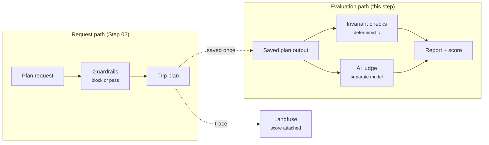

# Step 07 - Testing, Evaluation, and Observability

## Is the plan any good?

The trip planner now fetches real weather and points of interest before any language model runs. But the plan it returns is still only as good as the model's judgment of that data, and a model that produces a convincing itinerary can still miss the point. The plan for a three-day family trip might skip a rest day, the cost line might come out of a miscalculation, and the vehicle recommendation might ignore the budget because nothing in the pipeline checks it.

Clicking through the demo UI won't tell you any of that, so this step adds checks you can repeat. A plain Java check catches a missing vehicle, a gap in the itinerary, or an invalid cost without calling a model. A judge model then compares the plan against an expected one to see whether it fits what the trip actually needs. Finally, the planning run is traced with OpenTelemetry and exported to Langfuse, and the evaluation score is attached to the trace it was measured from.

Together they make an evaluation harness you can run before every change to a prompt or a model. The samples and checks stay the same, and the report tells you which sample failed and why.

## How evaluation differs from the guardrails in Step 02

Step 02 added guardrails that block a request or a response when it violates a hard rule, such as a destination with a known safety issue. Those are enforcement mechanisms that sit in the request path.

Evaluation sits outside the request path. It runs against the saved output of completed planning runs, produces a score and a report, and uses a judge model that is separate from the one that wrote the plan. A guardrail stops a bad plan from reaching the customer. Evaluation tells you afterwards how often the planner produces bad plans, and which ones.


```mermaid
flowchart LR
    subgraph runtime["Request path (Step 02)"]
        req["Plan request"] --> gr["Guardrails<br/><small>block or pass</small>"]
        gr --> plan["Trip plan"]
    end

    subgraph eval["Evaluation path (this step)"]
        saved["Saved plan output"] --> inv["Invariant checks<br/><small>deterministic</small>"]
        saved --> judge["AI judge<br/><small>separate model</small>"]
        inv --> rep["Report + score"]
        judge --> rep
        plan -.->|"saved once"| saved
    end

    plan -.->|"trace"| lf["Langfuse<br/><small>score attached</small>"]
```

## Choosing a starting point

=== "Option 1: Continue from Step 06"

    ==Apply the changes below to your Step 06 working project.== Keep your existing model-provider settings. Adding `quarkus-langfuse` and `quarkus-opentelemetry` to `pom.xml` triggers an automatic restart in dev mode; the first restart after adding those dependencies will take longer than usual because Dev Services pulls and starts Langfuse containers.

=== "Option 2: Use the completed Step 07 project"

    ==Copy `section-3/step-07` to a working directory and open that copy. Apply your model-provider settings.== The code changes below are already included, including `BudgetVerdict.java`, `VehicleBudgetJudge.java`, the updated `TripAppropriatenessGuardrail.java`, and the `judgeModel` configuration. Join the hands-on route at [Adding the evaluation dependencies](#adding-the-evaluation-dependencies).

The same prerequisites from Step 06 apply: a model provider key, a container runtime for the Dev Services the planner needs, and the Trip Intelligence MCP server running on port 8085 for the live evaluation runs.

## Upgrading the vehicle guardrail to an LLM judge

The `TripAppropriatenessGuardrail` in Steps 02–06 uses a hardcoded list of brand names to detect luxury vehicles on economy budgets. That list catches the obvious supercars but misses premium SUVs and saloons that are just as unaffordable on an economy budget. (The Miles of Smiles board found this out while reviewing last quarter's expense reports, and learned that a Land Rover Discovery is not an economy car.) In this step we replace the list with an LLM judge that reads the vehicle type, model name, and the agent's reasoning together.

==Create `src/main/java/com/tripplanner/guardrails/BudgetVerdict.java`:==

```java title="BudgetVerdict.java"
--8<-- "../../section-3/step-07/trip-planner/src/main/java/com/tripplanner/guardrails/BudgetVerdict.java"
```

==Create `src/main/java/com/tripplanner/guardrails/VehicleBudgetJudge.java`:==

```java title="VehicleBudgetJudge.java"
--8<-- "../../section-3/step-07/trip-planner/src/main/java/com/tripplanner/guardrails/VehicleBudgetJudge.java"
```

`VehicleBudgetJudge` is a `@RegisterAiService` bound to a named model called `judgeModel`. It is `@ApplicationScoped` because the guardrail runs on Quarkus Flow executor threads, which have no HTTP request context. With the default `@RequestScoped` proxy, every call would fail with `RequestScoped context was not active`. The system prompt tells the judge to be strict, so any doubt means the vehicle is not appropriate. The user message passes the budget tier, vehicle type, vehicle model, and the agent's own reasoning.

==Update `src/main/java/com/tripplanner/guardrails/TripAppropriatenessGuardrail.java` to inject and use the judge:==

```java title="TripAppropriatenessGuardrail.java"
--8<-- "../../section-3/step-07/trip-planner/src/main/java/com/tripplanner/guardrails/TripAppropriatenessGuardrail.java"
```

For economy budgets, the guardrail first checks `OBVIOUS_LUXURY_BRANDS`, a short list of supercars such as Ferrari and Lamborghini, so clear-cut cases don't need a judge call. Everything else goes to the judge. Obvious cases stay cheap, and the ambiguous ones, like a Land Rover Discovery for a five-person economy trip, get the full LLM reasoning.

==Add the `judgeModel` configuration to `src/main/resources/application.properties`:==

```properties title="application.properties (judgeModel)"
# Judge model for LLM-based guardrail evaluation (fast, cheap)
quarkus.langchain4j.judgeModel.chat-model.provider=openai
quarkus.langchain4j.openai.judgeModel.api-key=${OPENAI_API_KEY}
quarkus.langchain4j.openai.judgeModel.chat-model.model-name=gpt-4o-mini
quarkus.langchain4j.openai.judgeModel.chat-model.temperature=0
quarkus.langchain4j.openai.judgeModel.timeout=30
```

`gpt-4o-mini` at temperature 0 is fast and consistent enough for a yes-or-no budget verdict. Because it is a named model, its cost shows up separately from the planner's in Langfuse.

## Adding the evaluation dependencies

The evaluation harness uses the `quarkus-langchain4j-testing-evaluation` modules for sample loading, scoring, and the AI judge. We also need OpenTelemetry for tracing and the Langfuse extension for publishing scores to the trace.

==Add the following dependencies to your `trip-planner/pom.xml`:==

```xml title="pom.xml (new evaluation dependencies)"
--8<-- "../../section-3/step-07/trip-planner/pom.xml:72:110"
```

The snippet shows all evaluation-related dependencies. If you are continuing from Step 06, `quarkus-junit` and `smallrye-reactive-messaging-in-memory` are already there, so add only the new ones: `quarkus-opentelemetry`, `quarkus-langfuse`, the three `testing-evaluation` modules, and `awaitility`.

## Saving a plan as text

Everything in this step evaluates one thing: the text form of a completed plan. Before we can check whether a plan is valid or compare it against an expected output, we need a stable way to turn a `TripPlan` into a string. The invariant checks, the judge comparison, and the test fixtures all operate on this rendering.

==Create `src/test/java/com/tripplanner/evaluation/TripPlanText.java`:==

```java title="TripPlanText.java"
--8<-- "../../section-3/step-07/trip-planner/src/test/java/com/tripplanner/evaluation/TripPlanText.java"
```

`render()` serializes a `TripPlan` to pretty-printed JSON, and `read()` parses it back. Rendering is deliberately mechanical, so a structurally broken `TripPlan` shows up as a broken rendering, which is exactly what the checks below look for.

## Writing the invariant strategy

The cheapest way to catch a broken plan is to check its shape with plain Java. The invariant strategy inspects a saved plan for the properties every valid plan must have, and it does not call a model at any point, so it runs in milliseconds and costs nothing.

==Create `src/test/java/com/tripplanner/evaluation/TripPlanInvariantStrategy.java`:==

```java title="TripPlanInvariantStrategy.java"
--8<-- "../../section-3/step-07/trip-planner/src/test/java/com/tripplanner/evaluation/TripPlanInvariantStrategy.java"
```

The strategy implements `EvaluationStrategy<String>` from the `quarkus-langchain4j-testing-evaluation` module. It takes the sample and the actual output and returns an `EvaluationResult` with a score from 0 to 1, a pass or fail, and a reason. It checks the vehicle fields, the itinerary day count and numbering, and the cost format.

## Pinning the invariants with known-bad fixtures

The invariants need their own test cases so you can verify they catch real defects. Each fixture is a plan with a specific problem, and the test asserts that the strategy fails it and names the defect in the result.

==Create `src/test/resources/evaluation/known-bad.yaml`:==

```yaml title="known-bad.yaml"
--8<-- "../../section-3/step-07/trip-planner/src/test/resources/evaluation/known-bad.yaml"
```

The file is JSON inside a YAML list so each entry is a single string the strategy can parse. Five defects are pinned: a null vehicle, a gap in the itinerary days, a negative cost, a non-numeric cost, and an empty output.

==Create `src/test/java/com/tripplanner/evaluation/KnownBadOutputs.java` to load the fixtures:==

```java title="KnownBadOutputs.java"
--8<-- "../../section-3/step-07/trip-planner/src/test/java/com/tripplanner/evaluation/KnownBadOutputs.java"
```

## Testing the invariant strategy

Now we can write the test that exercises the strategy against both valid plans and the known-bad fixtures.

==Create `src/test/java/com/tripplanner/evaluation/TripPlanInvariantStrategyTest.java`:==

```java title="TripPlanInvariantStrategyTest.java"
--8<-- "../../section-3/step-07/trip-planner/src/test/java/com/tripplanner/evaluation/TripPlanInvariantStrategyTest.java"
```

`validPlan()` builds a complete `TripPlan` with the right number of days, which should pass. Wrong day counts, duplicate days, missing fields, and every entry in `known-bad.yaml` should fail, each with the right reason.

==Run the invariant test from your `trip-planner` directory:==

=== "Linux / macOS"
    ```bash
    ./mvnw test -Dtest=TripPlanInvariantStrategyTest
    ```

=== "Windows"
    ```cmd
    .\mvnw.cmd test -Dtest=TripPlanInvariantStrategyTest
    ```

All four test methods should pass. If one fails, the test names the fixture entry that slipped through.

## Adding the AI judge

The invariant gate checks structure. It cannot tell you that the plan is for the wrong season, or that the vehicle reasoning contradicts the trip requirements. For that, we need a model to compare the output against the expected output for the same sample.

The judge is a separate model call with its own prompt, and it never runs in the planning path.

==Create `src/test/resources/evaluation/rubric.txt`:==

```text title="rubric.txt"
--8<-- "../../section-3/step-07/trip-planner/src/test/resources/evaluation/rubric.txt"
```

The rubric asks the model for the single word `true` or `false`. `AiJudgeStrategy` parses the verdict with `Boolean.parseBoolean`, so anything chattier, like a JSON object or a full sentence, reads as `false`.

==Create `src/test/java/com/tripplanner/evaluation/TripPlanJudge.java`:==

```java title="TripPlanJudge.java"
--8<-- "../../section-3/step-07/trip-planner/src/test/java/com/tripplanner/evaluation/TripPlanJudge.java"
```

`TripPlanJudge` wraps `AiJudgeStrategy`, loads the rubric from the classpath, and attaches metadata recording which model class was used for the judgment.

## Verifying the judge contract offline

That parsing rule is easy to break, so it gets a test of its own. A scripted model returns a fixed string, which lets us check the rule without a network call.

==Create `src/test/java/com/tripplanner/evaluation/TripPlanJudgeContractTest.java`:==

```java title="TripPlanJudgeContractTest.java"
--8<-- "../../section-3/step-07/trip-planner/src/test/java/com/tripplanner/evaluation/TripPlanJudgeContractTest.java"
```

The `JudgeModel` inner class implements `ChatModel` and always returns the configured verdict. A `true` verdict passes, and `false`, JSON, and prose verdicts all fail.

==Run both tests so far:==

=== "Linux / macOS"
    ```bash
    ./mvnw test -Dtest=TripPlanInvariantStrategyTest,TripPlanJudgeContractTest
    ```

=== "Windows"
    ```cmd
    .\mvnw.cmd test -Dtest=TripPlanInvariantStrategyTest,TripPlanJudgeContractTest
    ```

## Recording evaluation runs

A single evaluation run is only a snapshot. The interesting part is running the same sample again and comparing, so each run is recorded with its input, output, evidence, trace id, model name, and the outcome of each strategy.

==Create `src/test/java/com/tripplanner/evaluation/EvaluationRun.java`:==

```java title="EvaluationRun.java"
--8<-- "../../section-3/step-07/trip-planner/src/test/java/com/tripplanner/evaluation/EvaluationRun.java"
```

`EvaluationRun` holds everything about one run, and `StrategyOutcome` holds the result of one strategy. `aggregateScore()` is the mean of the strategy scores.

==Create `src/test/java/com/tripplanner/evaluation/EvaluationRunRecorder.java`:==

```java title="EvaluationRunRecorder.java"
--8<-- "../../section-3/step-07/trip-planner/src/test/java/com/tripplanner/evaluation/EvaluationRunRecorder.java"
```

The recorder keeps every run per sample in memory, so a follow-up run sits next to the first one instead of replacing it. `SampleHistory` groups the runs for one sample, and `inputsMatch()` spots a repeated experiment that quietly used different parameters.

## Testing the recorder

==Create `src/test/java/com/tripplanner/evaluation/EvaluationRunRecorderTest.java`:==

```java title="EvaluationRunRecorderTest.java"
--8<-- "../../section-3/step-07/trip-planner/src/test/java/com/tripplanner/evaluation/EvaluationRunRecorderTest.java"
```


## Writing evaluation samples

The harness needs a set of known trip requests and their expected outputs. These samples define the inputs that both the offline and live suites use.

==Create `src/test/resources/evaluation/samples.yaml`:==

```yaml title="samples.yaml"
--8<-- "../../section-3/step-07/trip-planner/src/test/resources/evaluation/samples.yaml"
```

Each sample has a name, the planner parameters (destination, date, days, travel style, travelers, budget, interests), an expected output string, and tags. The expected output uses the same format as `TripPlanText.render()` so the invariant and judge checks agree on what they're comparing.

## Assembling the harness test

The harness test ties the samples, the invariant strategy, and the scorer together. It loads samples from the YAML file, runs the invariant strategy against a synthetic valid plan for each sample's requested duration, and saves a report.

==Create `src/test/java/com/tripplanner/evaluation/TripPlanEvaluationHarnessTest.java`:==

```java title="TripPlanEvaluationHarnessTest.java"
--8<-- "../../section-3/step-07/trip-planner/src/test/java/com/tripplanner/evaluation/TripPlanEvaluationHarnessTest.java"
```

The first test generates a valid plan for each sample, checks that they all pass, and saves the report as JSON. The second makes sure a one-day plan can't pass a sample that asks for a longer trip.

## Running the offline suite

The offline suite runs all four test classes against the fixtures, with no model provider, no container runtime, and no network.

==Add the four test classes to the Surefire `<includes>` in your `trip-planner/pom.xml`:==

```xml
<includes>
    <include>**/TripPlanInvariantStrategyTest.java</include>
    <include>**/TripPlanJudgeContractTest.java</include>
    <include>**/TripPlanEvaluationHarnessTest.java</include>
    <include>**/EvaluationRunRecorderTest.java</include>
</includes>
```

==Run the default test suite:==

=== "Linux / macOS"
    ```bash
    ./mvnw test
    ```

=== "Windows"
    ```cmd
    .\mvnw.cmd test
    ```

The suite is fast enough to run after every edit, so make it your first stop whenever you change a prompt, a skill, or a model. A red invariant check on a known-good sample means the plan's shape changed.

## Configuring telemetry for the live runs

Because `quarkus-langfuse` and `quarkus-opentelemetry` are runtime dependencies, Langfuse Dev Services starts whenever you run the application, and traces show up in Langfuse as planning runs complete. The Langfuse URL, login credentials, and injected configuration are in the Dev UI under **Dev Services**. Startup is slower than in earlier steps because Dev Services now starts Kafka, PostgreSQL, and Langfuse. In production Quarkus doesn't manage any of those, so it starts as quickly as before.


The Extensions page also has a Quarkus Langfuse card with a direct link to the Langfuse UI, and an Observability card for the OpenTelemetry stack.


The tests need a bit more care. The offline suite runs without containers or network, so the `%test` profile turns off Dev Services and points the OTLP exporter at a dead endpoint. The `%mcp` profile does the same, since the composition IT only checks plan structure. The `%evals` profile keeps Dev Services on and marks the Langfuse container as shared, so Failsafe reuses the running one. It also widens the span filter, because the planning root span has no `gen_ai` attributes and would otherwise be dropped from the trace.

==Add the following to your `src/test/resources/application.properties`:==

```properties title="application.properties (test telemetry config)"
--8<-- "../../section-3/step-07/trip-planner/src/test/resources/application.properties:18:42"
```

## Adding the evals Maven profile

The live evaluation tests run under a separate Maven profile so `./mvnw test` never triggers them. The profile selects only the `*LiveIT` classes through Failsafe.

==Add the `evals` profile to your `trip-planner/pom.xml`, inside the `<profiles>` block:==

```xml title="pom.xml (evals profile)"
--8<-- "../../section-3/step-07/trip-planner/pom.xml:192:222"
```

## Live evaluation: the composition run

The composition run drives the full planning graph with a scripted model while the two `@McpClientAgent` subagents call the real Trip Intelligence server. No LLM is called, so it is cheap to run, but it exercises the argument flow, the MCP data path, and the request isolation of the complete workflow. Each saved output is checked by the invariant strategy and recorded.

==Create `src/test/java/com/tripplanner/evaluation/TripPlannerCompositionLiveIT.java`:==

```java title="TripPlannerCompositionLiveIT.java"
--8<-- "../../section-3/step-07/trip-planner/src/test/java/com/tripplanner/evaluation/TripPlannerCompositionLiveIT.java"
```

The test uses a `ScriptedProfile` that activates the `mcp` config profile and substitutes a `ScriptedModel` that returns deterministic responses for each agent. The `@BeforeEach` method probes the MCP server on port 8085 and skips the test if it isn't running the sunny fixture, so the suite stays green in environments without the server.

`aRomeFamilyTripPassesItsInvariantsAndIsRecorded()` plans a Rome trip, verifies that the real weather and POI data from the MCP server reached the itinerary planner's prompt, runs the invariant strategy on the saved output, and records the result. `requestIsolationMeansASecondDestinationIsIndependent()` plans two trips in sequence and checks that the first plan doesn't leak the second request's destination.

==Start the MCP server in `section-3/step-07/mcp-server`, then run the composition IT:==

```shell
./mvnw -f section-3/step-07/pom.xml -pl trip-planner -Pevals -Dit.test=TripPlannerCompositionLiveIT -Dquarkus.http.test-port=0 verify
```

## Publishing scores to Langfuse

Before we write the quality evaluation test, we need a way to publish evaluation scores to Langfuse and verify they land on the correct trace.

==Create `src/test/java/com/tripplanner/evaluation/LangfuseScorePublisher.java`:==

```java title="LangfuseScorePublisher.java"
--8<-- "../../section-3/step-07/trip-planner/src/test/java/com/tripplanner/evaluation/LangfuseScorePublisher.java"
```

`publishScore()` creates a numeric score on the run's trace id, with the sample id and model name as metadata. `scoreIsQueryable()` checks whether the score is visible on a given trace yet. Langfuse ingests scores asynchronously, so callers have to retry until it shows up.

## Live evaluation: the quality run

The quality run performs one real planning run with your configured model, captures the planning trace while the root span is current, applies the invariant strategy and the judge to the saved output, and publishes the resulting score to Langfuse. It then verifies through the score API that the score landed on exactly the trace of the run it measured.

==Create `src/test/java/com/tripplanner/evaluation/TripPlanQualityEvaluationLiveIT.java`:==

```java title="TripPlanQualityEvaluationLiveIT.java"
--8<-- "../../section-3/step-07/trip-planner/src/test/java/com/tripplanner/evaluation/TripPlanQualityEvaluationLiveIT.java"
```

The test opens a root span around the planning call so every agent call lands on the same trace, and it grabs the trace id while that span is still open. After planning, it runs the invariant check and the judge, publishes the aggregate score, and uses Awaitility to wait until Langfuse reports the score on the right trace. A last check makes sure the score didn't end up on an unrelated one.

The test is gated by `@EnabledIf("containerRuntimeAvailable")` so it skips cleanly when Docker or Podman is not installed.

==Run the quality IT with a container runtime available:==

```shell
./mvnw -f section-3/step-07/pom.xml -pl trip-planner -Pevals -Dit.test=TripPlanQualityEvaluationLiveIT -Dquarkus.http.test-port=0 verify
```

The first run pulls the Langfuse Dev Services images, which is a several-hundred-megabyte download. Subsequent runs reuse them.

## What to look for in Langfuse

With the quality run complete, the Langfuse UI shows the planning trace with its spans and the attached `plan-quality` score. The score's metadata carries the sample id and the model name, so you can filter by sample or by model when you run the suite several times.


Scroll down to see trace latencies, generation times, and observation spans. The tooltip on a trace name shows the full agent class and method, so you can match a slow span to a specific agent in your code.


Use the trace to read what the run actually did. The LLM spans show the prompts and responses, and the MCP spans show the tool calls and their results. If a sample fails its judge check, the trace is where you find out whether the model ignored the MCP data, reasoned from it, or produced a plan the judge could not match to the expected output.

## What's next?

The trip planner now has an evaluation harness that checks each plan's structure without calling a model and asks a judge model to score the rest, with every live score attached to its Langfuse trace. That's the end of Section 3. Head to the [conclusion](conclusion.md) for a recap of everything you've built.
