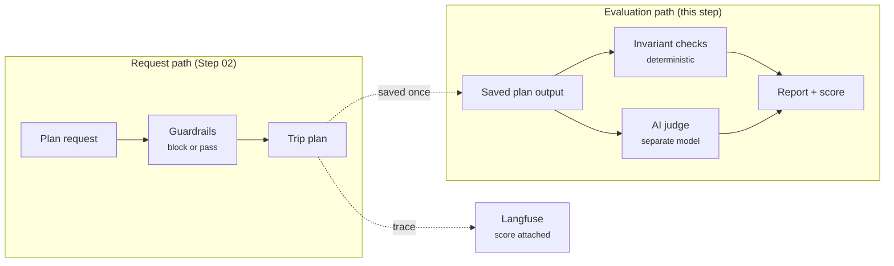
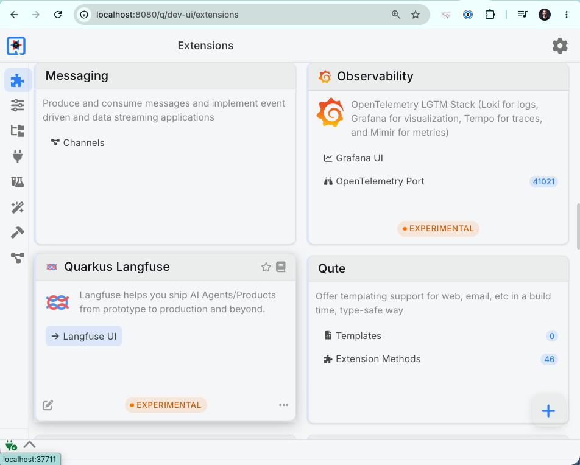

# Step 07 - Testing, Evaluation, and Observability

## Checking that the planner is right, not just plausible

The trip planner now fetches real weather and points of interest before any language model runs. But the plan it returns is still only as good as the model's judgment of that data, and a model that produces a convincing itinerary can still miss the point. The plan for a three-day family trip might skip a rest day, the cost line might come out of a miscalculation, and the vehicle recommendation might ignore the budget because nothing in the pipeline checks it.

This step adds a repeatable way to answer three questions that the demo UI cannot:

- Is a given plan structurally sound? A deterministic check catches a missing vehicle, a gap in the itinerary, or an invalid cost without calling a model.
- Does the plan match what the trip actually requires? A judge model compares the output against an expected plan, and a semantic similarity score measures how close they are even when the wording differs.
- Where did the plan come from? The planning run is traced with OpenTelemetry, the trace is exported to Langfuse, and the evaluation score is attached to the exact trace it was measured from.

The result is an evaluation harness you can run before every change to a prompt or a model: the same samples, the same checks, a report with a score and per-case details. When the score drops, the report points at which sample failed and why.

## How evaluation differs from the guardrails in Step 02

Step 02 added guardrails that block a request or a response when it violates a hard rule, such as a destination with a known safety issue. Those are enforcement mechanisms that sit in the request path.

Evaluation sits outside the request path. It runs against saved outputs of completed planning runs, it produces a score and a report rather than a decision, and it uses a judge model that is separate from the model that produced the plan. A guardrail stops a bad plan from being returned; evaluation tells you, after the fact, how often the planner produces bad plans and which ones.


```mermaid
flowchart LR
    subgraph runtime["Request path (Step 02)"]
        req["Plan request"] --> gr["Guardrails<br/><small>block or pass</small>"]
        gr --> plan["Trip plan"]
    end

    subgraph eval["Evaluation path (this step)"]
        saved["Saved plan output"] --> inv["Invariant checks<br/><small>deterministic</small>"]
        saved --> judge["AI judge<br/><small>separate model</small>"]
        inv --> rep["Report + score"]
        judge --> rep
        plan -.->|"saved once"| saved
    end

    plan -.->|"trace"| lf["Langfuse<br/><small>score attached</small>"]
```

## Choosing a starting point

=== "Option 1: Continue from Step 06"

    ==Apply the changes below to your Step 06 working project.== Keep your existing model-provider settings. Adding `quarkus-langfuse` and `quarkus-opentelemetry` to `pom.xml` triggers an automatic restart in dev mode; the first restart after adding those dependencies will take longer than usual because Dev Services pulls and starts Langfuse containers.

=== "Option 2: Use the completed Step 07 project"

    ==Copy `section-3/step-07` to a working directory and open that copy. Apply your model-provider settings.== The code changes below are already included, including `BudgetVerdict.java`, `VehicleBudgetJudge.java`, the updated `TripAppropriatenessGuardrail.java`, and the `judgeModel` configuration. Join the hands-on route at [Adding the evaluation dependencies](#adding-the-evaluation-dependencies).

The same prerequisites from Step 06 apply: a model provider key, a container runtime for the Dev Services the planner needs, and the Trip Intelligence MCP server running on port 8085 for the live evaluation runs.

## Upgrading the vehicle guardrail to an LLM judge

The `TripAppropriatenessGuardrail` in Steps 02–06 uses a hardcoded list of brand names to detect luxury vehicles on economy budgets. That list covers obvious supercars but misses premium SUVs and saloons that are equally unaffordable on an economy budget. In this step we replace that heuristic with an LLM-based judge that evaluates the vehicle's type, model name, and reasoning text together, so the decision reflects intent rather than brand-name matching.

==Create `src/main/java/com/tripplanner/guardrails/BudgetVerdict.java`:==

```java title="BudgetVerdict.java"
--8<-- "../../section-3/step-07/trip-planner/src/main/java/com/tripplanner/guardrails/BudgetVerdict.java"
```

==Create `src/main/java/com/tripplanner/guardrails/VehicleBudgetJudge.java`:==

```java title="VehicleBudgetJudge.java"
--8<-- "../../section-3/step-07/trip-planner/src/main/java/com/tripplanner/guardrails/VehicleBudgetJudge.java"
```

`VehicleBudgetJudge` is a `@RegisterAiService` bound to a named model called `judgeModel`, and is annotated `@ApplicationScoped` so it can be injected and called from threads that have no active HTTP request context, such as the Quarkus Flow executor threads that run the guardrail. Without that annotation, the default `@RequestScoped` CDI proxy would throw a `RequestScoped context was not active` error every time the guardrail tried to reach it. Its system prompt explains what the judge must decide and instructs it to be strict: if there is any doubt, the vehicle is not appropriate. The user message gives the judge the budget tier, vehicle type, vehicle model, and the agent's own reasoning, so it can read the full context rather than pattern-matching a single field.

==Update `src/main/java/com/tripplanner/guardrails/TripAppropriatenessGuardrail.java` to inject and use the judge:==

```java title="TripAppropriatenessGuardrail.java"
--8<-- "../../section-3/step-07/trip-planner/src/main/java/com/tripplanner/guardrails/TripAppropriatenessGuardrail.java"
```

For economy budgets, the guardrail runs a fast pre-check against `OBVIOUS_LUXURY_BRANDS` — Ferrari, Lamborghini, and similar supercars — to skip the judge call for clear-cut cases. For everything else it calls the judge and acts on the verdict. This keeps obvious cases cheap while using the full LLM reasoning for the ambiguous ones, such as a Land Rover Discovery recommended for a five-person economy trip.

==Add the `judgeModel` configuration to `src/main/resources/application.properties`:==

```properties title="application.properties (judgeModel)"
# Judge model for LLM-based guardrail evaluation (fast, cheap)
quarkus.langchain4j.judgeModel.chat-model.provider=openai
quarkus.langchain4j.openai.judgeModel.api-key=${OPENAI_API_KEY}
quarkus.langchain4j.openai.judgeModel.chat-model.model-name=gpt-4o-mini
quarkus.langchain4j.openai.judgeModel.chat-model.temperature=0
quarkus.langchain4j.openai.judgeModel.timeout=30
```

`gpt-4o-mini` at temperature 0 is fast and deterministic enough for a binary budget verdict. Using a named model keeps its cost separate from the planner's main model usage, which is visible as a distinct service in Langfuse.

## Adding the evaluation dependencies

The evaluation harness uses the `quarkus-langchain4j-testing-evaluation` modules for sample loading, scoring, and the AI judge. We also need OpenTelemetry for tracing and the Langfuse extension for publishing scores to the trace.

==Add the following dependencies to your `trip-planner/pom.xml`:==

```xml title="pom.xml (new evaluation dependencies)"
--8<-- "../../section-3/step-07/trip-planner/pom.xml:72:110"
```

The snippet shows all evaluation-related dependencies. If you are continuing from Step 06, `quarkus-junit` and `smallrye-reactive-messaging-in-memory` are already present — add only the ones that are new: `quarkus-opentelemetry`, `quarkus-langfuse`, the three `testing-evaluation` modules, and `awaitility`.

## Saving a plan as text

Everything in this step evaluates one thing: the text form of a completed plan. Before we can check whether a plan is valid or compare it against an expected output, we need a stable way to turn a `TripPlan` into a string. The invariant checks, the judge comparison, and the test fixtures all operate on this rendering.

==Create `src/test/java/com/tripplanner/evaluation/TripPlanText.java`:==

```java title="TripPlanText.java"
--8<-- "../../section-3/step-07/trip-planner/src/test/java/com/tripplanner/evaluation/TripPlanText.java"
```

`render()` serializes a `TripPlan` to pretty-printed JSON, and `read()` parses it back. Rendering is deliberately mechanical, so a plan that is structurally broken in the `TripPlan` shows up as a broken rendering. This is exactly what the checks below look for.

## Writing the invariant strategy

The cheapest way to catch a broken plan is to check its shape with plain Java. The invariant strategy inspects a saved plan for the properties every valid plan must have, and it does not call a model at any point, so it runs in milliseconds and costs nothing.

==Create `src/test/java/com/tripplanner/evaluation/TripPlanInvariantStrategy.java`:==

```java title="TripPlanInvariantStrategy.java"
--8<-- "../../section-3/step-07/trip-planner/src/test/java/com/tripplanner/evaluation/TripPlanInvariantStrategy.java"
```

The strategy implements `EvaluationStrategy<String>` from the `quarkus-langchain4j-testing-evaluation` module. It takes the sample and the actual output, then returns an `EvaluationResult` with a score from 0 to 1, a pass or fail decision, and a reason. The checks cover the vehicle recommendation fields, the itinerary day count and numbering, and the cost total format.

## Pinning the invariants with known-bad fixtures

The invariants need their own test cases so you can verify they catch real defects. Each fixture is a plan with a specific problem, and the test asserts that the strategy fails it and names the defect in the result.

==Create `src/test/resources/evaluation/known-bad.yaml`:==

```yaml title="known-bad.yaml"
--8<-- "../../section-3/step-07/trip-planner/src/test/resources/evaluation/known-bad.yaml"
```

The file is JSON inside a YAML list so each entry is a single string the strategy can parse. Five defects are pinned: a null vehicle, a gap in the itinerary days, a negative cost, a non-numeric cost, and an empty output.

==Create `src/test/java/com/tripplanner/evaluation/KnownBadOutputs.java` to load the fixtures:==

```java title="KnownBadOutputs.java"
--8<-- "../../section-3/step-07/trip-planner/src/test/java/com/tripplanner/evaluation/KnownBadOutputs.java"
```

## Testing the invariant strategy

Now we can write the test that exercises the strategy against both valid plans and the known-bad fixtures.

==Create `src/test/java/com/tripplanner/evaluation/TripPlanInvariantStrategyTest.java`:==

```java title="TripPlanInvariantStrategyTest.java"
--8<-- "../../section-3/step-07/trip-planner/src/test/java/com/tripplanner/evaluation/TripPlanInvariantStrategyTest.java"
```

The test builds valid plans with `validPlan()`, which constructs a complete `TripPlan` with the right number of days, and checks them against the strategy. It also verifies that currency formats with or without the euro sign pass, that wrong day counts and duplicates fail, that missing fields fail without a crash, and that every entry in `known-bad.yaml` is caught with the correct reason.

==Make sure the Surefire plugin in your `pom.xml` includes this test:==

```xml
<include>**/TripPlanInvariantStrategyTest.java</include>
```

==Run the invariant test:==

```shell
cd section-3/step-07/trip-planner
./mvnw test -Dtest=TripPlanInvariantStrategyTest
```

All four test methods should pass. If an invariant is missing or the fixture format is wrong, the test names the failing entry.

## Adding the AI judge

The invariant gate checks structure. It cannot tell you that the plan is for the wrong season, or that the vehicle reasoning contradicts the trip requirements. For that, we need a model to compare the output against the expected output for the same sample.

The judge is a separate model invocation from the planning run. It runs with its own prompt and is never in the planning path, so its usage stays separable from the planner's measurements.

==Create `src/test/resources/evaluation/rubric.txt`:==

```text title="rubric.txt"
--8<-- "../../section-3/step-07/trip-planner/src/test/resources/evaluation/rubric.txt"
```

The rubric asks the model for the single word `true` or `false`. `AiJudgeStrategy` parses the verdict with `Boolean.parseBoolean`, so a JSON object, a full sentence, or a score with an explanation all read as `false`.

==Create `src/test/java/com/tripplanner/evaluation/TripPlanJudge.java`:==

```java title="TripPlanJudge.java"
--8<-- "../../section-3/step-07/trip-planner/src/test/java/com/tripplanner/evaluation/TripPlanJudge.java"
```

`TripPlanJudge` wraps `AiJudgeStrategy`, loads the rubric from the classpath, and attaches metadata recording which model class was used for the judgment.

## Verifying the judge contract offline

The judge contract is worth pinning with a deterministic test. A scripted model always returns a fixed string, so we can verify the parsing rules without any network call: a `true` verdict passes, a `false` verdict fails, and a JSON or prose verdict fails.

==Create `src/test/java/com/tripplanner/evaluation/TripPlanJudgeContractTest.java`:==

```java title="TripPlanJudgeContractTest.java"
--8<-- "../../section-3/step-07/trip-planner/src/test/java/com/tripplanner/evaluation/TripPlanJudgeContractTest.java"
```

The `JudgeModel` inner class implements `ChatModel` and always returns the configured verdict string. The four test methods pin the contract: a matching plan passes, a mismatching plan fails, a JSON verdict is never parsed as a pass, and a prose verdict is treated as false.

==Add the test to Surefire:==

```xml
<include>**/TripPlanJudgeContractTest.java</include>
```

==Run both tests so far:==

```shell
./mvnw test -Dtest=TripPlanInvariantStrategyTest,TripPlanJudgeContractTest
```

## Recording evaluation runs

A single evaluation run is a snapshot. The useful question is what happens when you run the same sample again with the same inputs and compare the results. We need a way to record each run with its input, saved output, captured evidence, trace id, model name, and per-strategy outcomes.

==Create `src/test/java/com/tripplanner/evaluation/EvaluationRun.java`:==

```java title="EvaluationRun.java"
--8<-- "../../section-3/step-07/trip-planner/src/test/java/com/tripplanner/evaluation/EvaluationRun.java"
```

`EvaluationRun` is a record that holds everything about one evaluated run. `StrategyOutcome` captures the result of one strategy. `aggregateScore()` returns the mean of the strategy scores, and `allStrategiesPassed()` is a convenience check.

==Create `src/test/java/com/tripplanner/evaluation/EvaluationRunRecorder.java`:==

```java title="EvaluationRunRecorder.java"
--8<-- "../../section-3/step-07/trip-planner/src/test/java/com/tripplanner/evaluation/EvaluationRunRecorder.java"
```

The recorder is an in-memory store that keeps every run per sample, so a follow-up run is compared against the first rather than replacing it. `SampleHistory` groups the runs for one sample and has an `inputsMatch()` method that detects when a repeated experiment used different parameters.

## Testing the recorder

==Create `src/test/java/com/tripplanner/evaluation/EvaluationRunRecorderTest.java`:==

```java title="EvaluationRunRecorderTest.java"
--8<-- "../../section-3/step-07/trip-planner/src/test/java/com/tripplanner/evaluation/EvaluationRunRecorderTest.java"
```

The test verifies that a repeated experiment retains comparable inputs and evidence, that per-case results stay separate, that mismatched inputs are detected, and that the aggregate score is the mean of the per-strategy scores.

==Add the test to Surefire:==

```xml
<include>**/EvaluationRunRecorderTest.java</include>
```

## Writing evaluation samples

The harness needs a set of known trip requests and their expected outputs. These samples define the inputs that both the offline and live suites use.

==Create `src/test/resources/evaluation/samples.yaml`:==

```yaml title="samples.yaml"
--8<-- "../../section-3/step-07/trip-planner/src/test/resources/evaluation/samples.yaml"
```

Each sample has a name, the planner parameters (destination, date, days, travel style, travelers, budget, interests), an expected output string, and tags. The expected output uses the same format as `TripPlanText.render()` so the invariant and judge checks agree on what they're comparing.

## Assembling the harness test

The harness test ties the samples, the invariant strategy, and the scorer together. It loads samples from the YAML file, runs the invariant strategy against a synthetic valid plan for each sample's requested duration, and saves a report.

==Create `src/test/java/com/tripplanner/evaluation/TripPlanEvaluationHarnessTest.java`:==

```java title="TripPlanEvaluationHarnessTest.java"
--8<-- "../../section-3/step-07/trip-planner/src/test/java/com/tripplanner/evaluation/TripPlanEvaluationHarnessTest.java"
```

The first test loads the samples, generates a valid plan for each one, runs the invariant strategy, and asserts all pass. It also saves the report as JSON and checks that one of the sample names (`rome-family-seven-days`) appears in it. The second test proves that a fixed one-day plan cannot pass samples requesting different durations, confirming the harness actually catches the mismatch.

==Add the test to Surefire:==

```xml
<include>**/TripPlanEvaluationHarnessTest.java</include>
```

## Running the offline suite

The offline suite runs all four test classes against the fixtures, with no model provider, no container runtime, and no network.

==Run the default test suite in `section-3/step-07/trip-planner`:==

```shell
./mvnw test
```

Your Surefire `<includes>` should now list all four tests:

```xml
<includes>
    <include>**/TripPlanInvariantStrategyTest.java</include>
    <include>**/TripPlanJudgeContractTest.java</include>
    <include>**/TripPlanEvaluationHarnessTest.java</include>
    <include>**/EvaluationRunRecorderTest.java</include>
</includes>
```

The suite loads the samples from `samples.yaml`, applies the invariant strategy to known-good and known-bad outputs, and verifies the judge contract and the recorder. When you change a prompt, a skill, or a model, run this suite first. It is fast enough to run after every edit, and a red invariant check on a known-good sample means the rendering or the plan shape changed in a way the gate now detects.

## Configuring telemetry for the live runs

Because `quarkus-langfuse` and `quarkus-opentelemetry` are runtime dependencies, Langfuse Dev Services starts automatically whenever you run the application — in dev mode, traces appear in Langfuse as planning runs complete. You can find the UI URL, login credentials, and all injected configuration in the Dev UI under **Dev Services**. You may notice that startup takes longer than in previous steps: Dev Services is now pulling and starting containers for Kafka, PostgreSQL, and Langfuse. In production none of those would be managed by Quarkus, so startup time would be unaffected.


The Extensions page also has a Quarkus Langfuse card with a direct link to the Langfuse UI, and an Observability card for the OpenTelemetry stack.



The tests need a bit more care. The offline suite runs with no containers and no network, so the `%test` profile disables Dev Services and points the OTLP exporter at a dead endpoint. The `%mcp` profile does the same because the composition IT checks plan structure rather than telemetry. The `%evals` profile, by contrast, keeps Dev Services on (it is already the default), marks the container as shared so Failsafe reuses the one already running rather than starting a fresh instance, and widens the span filter so the planning root span — which carries no `gen_ai` attributes — is not dropped from the trace.

==Add the following to your `src/test/resources/application.properties`:==

```properties title="application.properties (test telemetry config)"
--8<-- "../../section-3/step-07/trip-planner/src/test/resources/application.properties:18:42"
```

## Adding the evals Maven profile

The live evaluation tests run under a separate Maven profile so `./mvnw test` never triggers them. The profile selects only the `*LiveIT` classes through Failsafe.

==Add the `evals` profile to your `trip-planner/pom.xml`, inside the `<profiles>` block:==

```xml title="pom.xml (evals profile)"
--8<-- "../../section-3/step-07/trip-planner/pom.xml:192:222"
```

## Live evaluation: the composition run

The composition run drives the full planning graph with a scripted model while the two `@McpClientAgent` subagents call the real Trip Intelligence server. No LLM is called, so it is cheap to run, but it exercises the argument flow, the MCP data path, and the request isolation of the complete workflow. Each saved output is checked by the invariant strategy and recorded.

==Create `src/test/java/com/tripplanner/evaluation/TripPlannerCompositionLiveIT.java`:==

```java title="TripPlannerCompositionLiveIT.java"
--8<-- "../../section-3/step-07/trip-planner/src/test/java/com/tripplanner/evaluation/TripPlannerCompositionLiveIT.java"
```

The test uses a `ScriptedProfile` that activates the `mcp` config profile and substitutes a `ScriptedModel` that returns deterministic responses for each agent. The `@BeforeEach` method probes the MCP server on port 8085 and skips the test if it isn't running the sunny fixture, so the suite stays green in environments without the server.

`aRomeFamilyTripPassesItsInvariantsAndIsRecorded()` plans a Rome trip, verifies that the real weather and POI data from the MCP server reached the itinerary planner's prompt, runs the invariant strategy on the saved output, and records the result. `requestIsolationMeansASecondDestinationIsIndependent()` plans two trips in sequence and checks that the first plan doesn't leak the second request's destination.

==Start the MCP server in `section-3/step-07/mcp-server`, then run the composition IT:==

```shell
./mvnw -f section-3/step-07/pom.xml -pl trip-planner -Pevals -Dit.test=TripPlannerCompositionLiveIT -Dquarkus.http.test-port=0 verify
```

The test asserts that the real fixture data reached the research agents, that the saved plan passes the invariants, and that a second request for a different destination is independent of the first.

## Publishing scores to Langfuse

Before we write the quality evaluation test, we need a way to publish evaluation scores to Langfuse and verify they land on the correct trace.

==Create `src/test/java/com/tripplanner/evaluation/LangfuseScorePublisher.java`:==

```java title="LangfuseScorePublisher.java"
--8<-- "../../section-3/step-07/trip-planner/src/test/java/com/tripplanner/evaluation/LangfuseScorePublisher.java"
```

`publishScore()` creates a numeric score on the run's trace id with metadata carrying the sample id and model name. `scoreIsQueryable()` checks whether the score has been ingested and is queryable on a given trace. Score ingestion in Langfuse is asynchronous, so callers must retry rather than assuming the score is queryable immediately after creation.

## Live evaluation: the quality run

The quality run performs one real planning run with your configured model, captures the planning trace while the root span is current, applies the invariant strategy and the judge to the saved output, and publishes the resulting score to Langfuse. It then verifies through the score API that the score landed on exactly the trace of the run it measured.

==Create `src/test/java/com/tripplanner/evaluation/TripPlanQualityEvaluationLiveIT.java`:==

```java title="TripPlanQualityEvaluationLiveIT.java"
--8<-- "../../section-3/step-07/trip-planner/src/test/java/com/tripplanner/evaluation/TripPlanQualityEvaluationLiveIT.java"
```

The test opens a root span around the planning call so the agent invocations create child spans on the same trace. It captures the trace id while the span is current, because the id is only stable while the span is open. After the planning run, it renders the saved output, runs the invariant gate, runs the AI judge, builds an `EvaluationRun`, publishes the aggregate score to Langfuse, and uses Awaitility to retry until the score is queryable on the correct trace. A final check confirms the score is not queryable on an unrelated trace.

The test is gated by `@EnabledIf("containerRuntimeAvailable")` so it skips cleanly when Docker or Podman is not installed.

==Run the quality IT with a container runtime available:==

```shell
./mvnw -f section-3/step-07/pom.xml -pl trip-planner -Pevals -Dit.test=TripPlanQualityEvaluationLiveIT -Dquarkus.http.test-port=0 verify
```

The first run pulls the Langfuse Dev Services images, which is a several-hundred-megabyte download. Subsequent runs reuse them.

## What to look for in Langfuse

With the quality run complete, the Langfuse UI shows the planning trace with its spans and the attached `plan-quality` score. The score's metadata carries the sample id and the model name, so you can filter by sample or by model when you run the suite several times.


Scroll down to see trace latencies, generation times, and observation spans. The tooltip on a trace name shows the full agent class and method, so you can match a slow span to a specific agent in your code.


Use the trace to read what the run actually did. The LLM spans show the prompts and responses, and the MCP spans show the tool calls and their results. If a sample fails its judge check, the trace is where you find out whether the model ignored the MCP data, reasoned from it, or produced a plan the judge could not match to the expected output.

## What's next?

The trip planner is now backed by a repeatable evaluation harness: deterministic invariant checks catch structural problems without calling a model, a judge measures qualitative fitness against a rubric, and every live run produces a trace in Langfuse with its evaluation score attached. That's the end of Section 3. Head to the [conclusion](conclusion.md) for a recap of the enterprise patterns you've built across all seven steps.
